# Technical Design: Client-Orchestrated Semantic Workflow API

## 1. Summary

ArchFlow will keep Claude Code or Codex as the producer and workflow orchestrator and replace the
current mechanical workflow protocol with two bounded task-lifecycle tools:

- `archflow_status` reads durable truth and returns one compact `WorkflowViewV1`.
- `archflow_apply` applies exactly one server-offered semantic action and returns the freshly
  recomputed `WorkflowViewV1`.

The two-tool surface is not a one-call workflow runner. A phase contains several `archflow_apply`
calls with client work between them. An offered action can enter a client write window, snapshot
client-produced work, run the bounded server-owned counter-review, record client-authored triage,
open or resolve one human decision, observe an authorized client-created commit, or perform one
judgment-free hand-off. The handler returns after that action. It never dispatches a producer,
triages findings, edits implementation code, runs verification, commits, or loops to a later
action.

The existing durable kernel remains authoritative. `computeTaskStatus` and `deriveNextAction`
remain the read model; the artifact builders, transition planner, transaction/replay machinery,
counter-review dispatcher, fixed-point policy, gate archives, waiver validation, commit proof, and
reconciliation remain the write and evidence model. The refactor moves the valuable judgment-only
composition in `archflow-local build-request` behind the loaded MCP server, removes public request
envelopes and staged references from the normal path, and projects every result into the same
semantic view.

Human decisions become nonblocking. When status says an ordinary gate is required, the skill
supplies its human-readable summary in one apply action; the server opens and archives the gate and
returns the conversational presentation. The skill asks the human, then sends the server-issued
choice and reason in a later apply call. A requested waiver is the narrow exception: its follow-up
gate uses the existing server-derived summary and opens through a no-submission action. No MCP
request waits for `gate.decision`, and no local command writes workflow authority.

Explicit backward reopening also remains a first-class workflow path. A core skill identifies
itself, its requested phase, and explicit `reopen` intent in the read-only status call. If that planning boundary is strictly
earlier than the current active phase and no gate or repair blocks it, status returns one `reopen`
offer describing the invalidation impact. Apply records the human's exact request through the
canonical planning-restart transaction, preserves existing Git/worktree bytes, archives target-and-downstream result
authority, and returns the reopened produce window. It does not edit the plan or replay successor
work; the client performs fresh production and the normal review/approval loop.

This design explicitly discards the previous in-server coordinator, autonomous phase runner,
write-capable producer dispatch, repository fence, provider proxy, credential broker, OS producer
sandbox, background control plane, and delegation-policy revision. Those components solved the
superseded premise that MCP should perform the phase. They are neither retained nor replaced here.

## 2. Current architecture and reusable seams

### 2.1 Current public choreography

The current catalogue is exactly four tools in `src/contracts/tool-names.ts`:

| Tool | Public responsibility today |
|---|---|
| `archflow_state` | Caller supplies phase, pipeline step, running/succeeded/failed transition, revision/fingerprint/intent fields, and any artifact. |
| `archflow_counter_review` | Caller enters review separately, then requests the server-owned review with a mechanically bound request. |
| `archflow_gate` | Caller composes a full gate request; the call opens the gate and blocks while polling a local decision file. |
| `archflow_waiver` | Caller reconstructs a fully bound waiver origin which the server immediately re-authenticates. |

The normal skill does not author those requests directly. It runs:

`status -> build-request/envelope -> staged request -> MCP tool -> status`

`archflow-local status` computes reconciled task status and one `NextAction`.
`archflow-local build-request` translates that action plus caller judgment into the exact tool
payload, `call-envelope` resolves the input fingerprint and request digest, and a staged request
file lets the model pass only a reference. Gate resolution is a separate `archflow-local decide`
write while the MCP gate call waits.

The helper is correct and valuable under the current API, but the process boundary is wrong. The
loaded MCP server and a newly invoked CLI can come from different installed builds, and the skill
still has to choose helper kinds, MCP tools, and transition ordering. A request digest protects
bytes, not shared interpretation across two loaded versions.

### 2.2 Reusable authority and service seams

The following existing components remain authoritative and should be changed only where the new
transport needs a narrow service seam:

- `src/state/status.ts` and `src/state/next-action.ts`: reconciled status, role-based resources,
  active policy, evidence assessment, human presentation, and exactly one legal next action.
- `src/state/production.ts`, `document-artifact.ts`, `implementation-manifest.ts`,
  `phase-documents.ts`, and `produce-subject.ts`: exact document/implementation subject building.
- `src/state/transitions.ts`, `transaction.ts`, `request.ts`, receipts, replay, reconciliation,
  projection, snapshots, and secret scanning: durable legality and atomicity.
- `src/review/`: pinned context, opposite-family review, fixed-point materiality, evidence
  freshness, and constitution review.
- `src/state/gates.ts`, `gate-approvals.ts`, waiver and adjudication services: exact human
  authority and re-authentication.
- root-bound Git observation and commit proof: exact design milestones and implementation commit
  scope.
- `src/local/build-request.ts` and `call-envelope.ts`: the existing derivation rules. Their pure
  parts move to a transport-neutral internal module; the CLI wrapper remains only during cutover.

Most of the semantic facade needs no durable shape change. Backward reopening is the one focused
exception in this branch: Phase 1 adds the optional `restart_history` authority, strict planning
phase ordering, and bounded restart transition described below. Old state without that optional
field remains valid and needs no migration. This is workflow audit history, not coordinator state.

### 2.3 Superseded design

The prior design treated the interface audit's autonomy recommendation as a requirement. It moved
the coordinator into the MCP process, added seven tools around a long-running phase job, planned
server-owned producers, and made fencing/containment/delegated commit authority prerequisites.
The user's correction rejects that ownership model. The prior task design and Phase 1 spike have no
implementation to migrate; their Git history remains the audit trail.

Reusable ideas from that design are limited to compact purpose descriptions, plain-object input
roots, final-catalogue measurement, first-call selection in both clients, and preserving the
durable kernel during cutover.

## 3. Target ownership and control flow

### 3.1 Boundary diagram

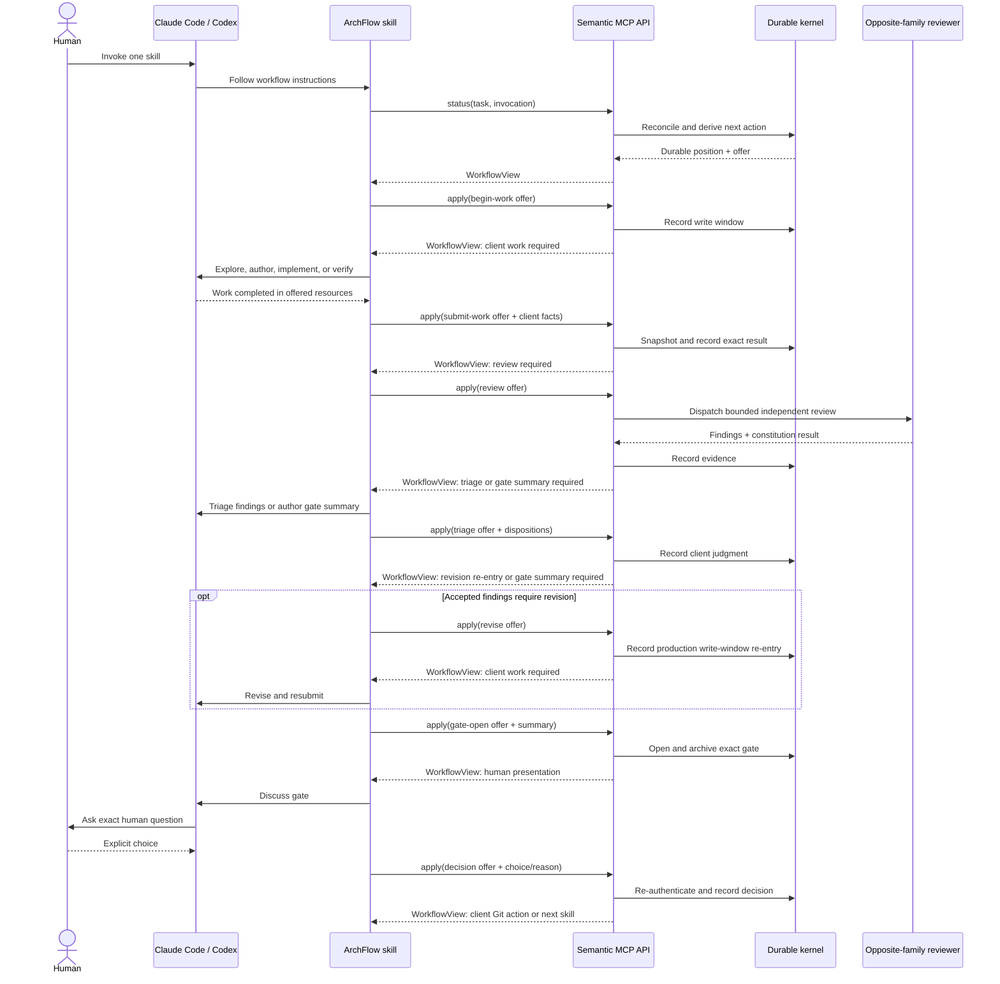

The skill and client may delegate their own bounded sub-work, but the MCP server does not launch a
producer. The only model dispatch shown is the existing independent review boundary.

### 3.2 One offered action per mutation

`archflow_apply` is constrained by a server-issued offer from the immediately preceding status or
apply result. The offer identifies one semantic action and the exact durable position it applies
to. The client cannot ask apply to choose an action, loop, or "finish the phase."

The server may combine internal transitions only when no omitted actor owns intervening judgment:

- a review action may record counter-review running, dispatch rubric and constitution review, and
  record terminal review evidence;
- a review with no findings may record the empty fixed-point triage and return the mandatory
  gate-opening action, but it cannot author the gate summary;
- a triage action with no accepted material findings may return the required gate-opening action;
- a decision requesting a waiver may return the separately required no-submission `open-waiver`
  action; that action derives the existing server-authored summary and all waiver bindings, opens
  one gate, and returns before the later human choice;
- a decision action may exclusively archive the submitted choice and immediately settle that same
  choice as fixed named substeps because no actor boundary separates them; interruption after the
  archive returns a no-submission settlement continuation and never repeats the human question;
- accepted triage or a human request for changes returns a separate no-submission `revise` action;
  applying it records only the server-derived production write-window re-entry and returns before
  the client edits or resubmits;
- an explicit `intent: "reopen"` invocation of an earlier PRD, design, or numbered phase-design
  skill may return one `reopen` action whose apply call records the exact human request and performs
  only the bounded planning restart (plus the exact-once ask-history append for PRD);
- a completed, already-authorized Git observation may perform the one legal hand-off.

The server must stop before production, triage judgment, remediation, verification, Git, a human
choice, or successor-skill work.

### 3.3 Top-level skill kickoff

PRD, design, every numbered phase design, and every numbered phase implementation remain separate
human invocations. Completing a predecessor leaves its durable approval and commit proof in place
and returns `ready` with the exact next skill. The successor skill's first apply call consumes the
offered start/handoff action and opens its produce write window. This binds mechanical phase
advance to the fresh user-invoked skill without adding a new durable phase state.

Core producing skills identify their invocation and `resume` or `reopen` intent in
`archflow_status`; `$archflow-status` omits that field and receives no mutation offer. If a skill is
rerun at its current phase, status returns the current action instead of creating another kickoff.
If a `resume` invocation names the exact server-derived successor, status returns the normal
hand-off offer. Only a `reopen` invocation naming a strictly earlier planning boundary returns the
bounded reopen offer below. A normal `resume` aimed backward, forward target, earlier phase
implementation, terminal task, open gate, or inconsistent authority gets no reopen offer and the
view names the current safe action without a mutation offer for the mismatched invocation.

### 3.4 Backward reopening

Reopening is intentionally heavier than correcting a returned parent document during the current
phase. It invalidates workflow authority from the chosen planning boundary onward while leaving the
worktree and Git history untouched. Old decision archives remain audit history but cannot authorize
new subjects after the referenced results are superseded. This is enforced even for identical
bytes: every approval consumer ignores approvals resolved at or before the latest restart whose
target affects the phase the authenticated approval itself authorizes, not the later phase consuming
it. A prior Git commit may be re-observed only after fresh
eligible approval rebinds the exact current subject.

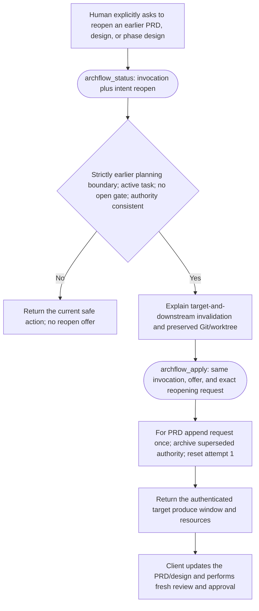

For a PRD reopen, the public submission is
`{kind: "reopening-request", request: <exact human wording>}`. The server preserves those bytes
verbatim inside generated `Reopening and corrections` framing and installs that append exactly once
before deriving the PRD restart fingerprint. Stable operation/restart identity and recoverable
write ordering make interruption before or after the append safe to retry. Existing ask, Git,
index, and worktree bytes are never rewritten; the ask entry is the sole intentional addition.
Reopening task design clears the obsolete planned final phase; reopening a numbered phase design
retains it. Reopening a phase implementation is never offered—change its approved phase design or
plan a new phase. A request aimed at the current boundary uses ordinary re-entry rather than a
restart-history record; at the current PRD boundary, the skill preserves the exact correction in
ask history before recording new production.

An open material-drift gate remains higher priority than direct reopen. If its explicit human
decision is `amend-upstream`, the gate resolver authenticates the affected document digest, derives
the corresponding earlier planning target, archives the decision, and invokes this same restart
planner with the gate ID as restart identity. It removes the open gate only inside that authorized
resolution transaction. Every other direct reopen request is refused while a gate is open.

### 3.5 Happy-path skill journeys

The diagrams below show the target steady state after cutover, not the current low-level helper
choreography. Each rounded MCP node is a separate call that returns before the next client or human
step. Rectangles are work performed by Claude Code or Codex; diamonds are explicit human choices.
An arrow back to client work is a new turn through status/apply, never an in-server workflow loop.
Unless a diagram is the read-only status skill or the explicit reopen flow above, its status/apply
calls carry that producing skill's same `intent: "resume"` invocation.

#### `$archflow-init`

Initialization remains a local bootstrap because it creates the MCP registrations needed before a
semantic server call is possible. It creates no task, approval, or commit.

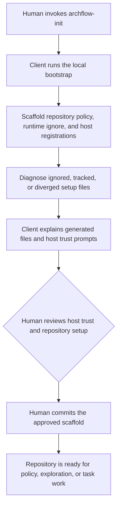

#### `$archflow-constitution`

Constitution maintenance stays a purpose-specific repository-policy workflow rather than a task
`archflow_apply` action. Phase 4 may expose a narrow validation adapter if cutover needs one, but it
must not turn policy editing into a general workflow runner.

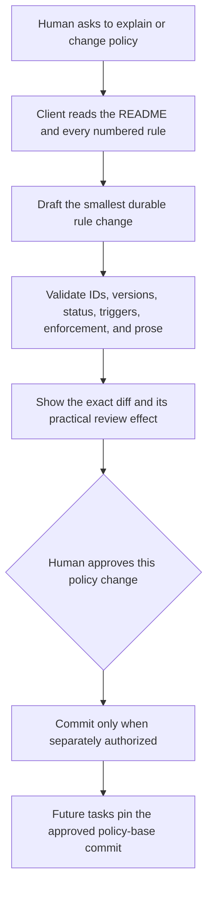

Existing tasks keep their already pinned policy base; editing the worktree never silently repins
them.

#### `$archflow-explore`

Exploration remains client-owned documentation work and does not use the task-lifecycle MCP API.

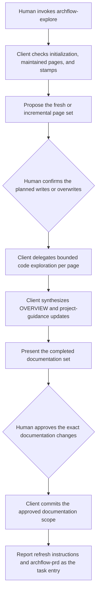

#### `$archflow-prd <task>`

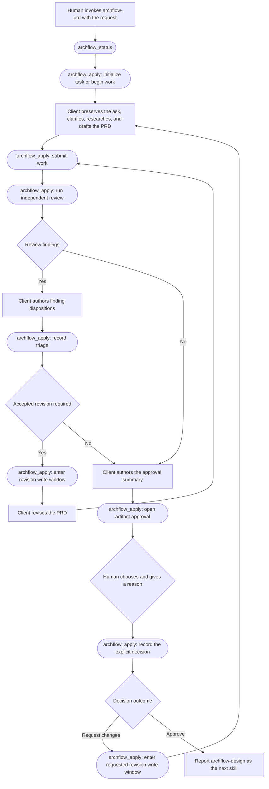

The PRD boundary has no Git milestone. The later `$archflow-design` invocation consumes the
offered hand-off; PRD completion does not start design work itself.

#### `$archflow-design <task>`

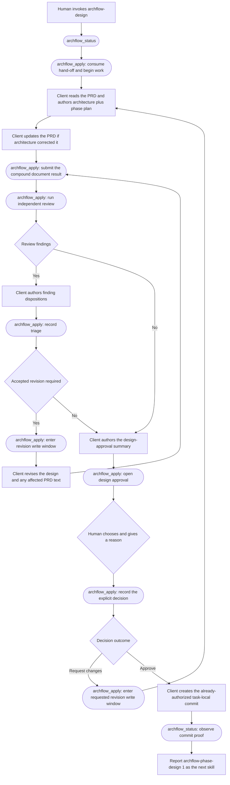

The approval is the commit authority, so there is no second commit prompt at this design
milestone. The next invocation consumes the hand-off and starts Phase 1 design.

#### `$archflow-phase-design <task> N`

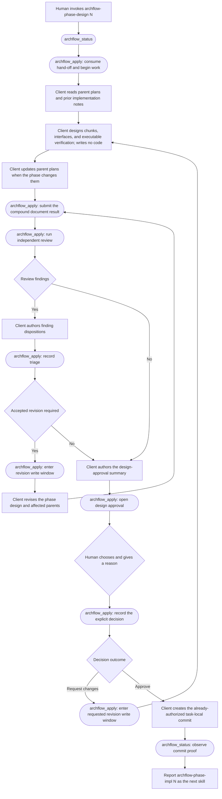

Only the durable approval and observed milestone commit make implementation ready. The later phase
implementation invocation consumes the hand-off.

#### `$archflow-phase-impl <task> N`

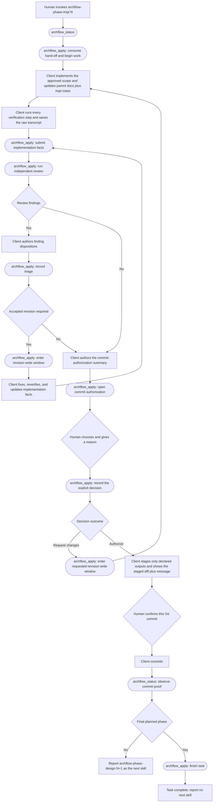

The two human diamonds are intentionally separate: durable authorization binds the reviewed diff,
then the second confirmation binds the exact staged Git commit.

#### `$archflow-status [task]`

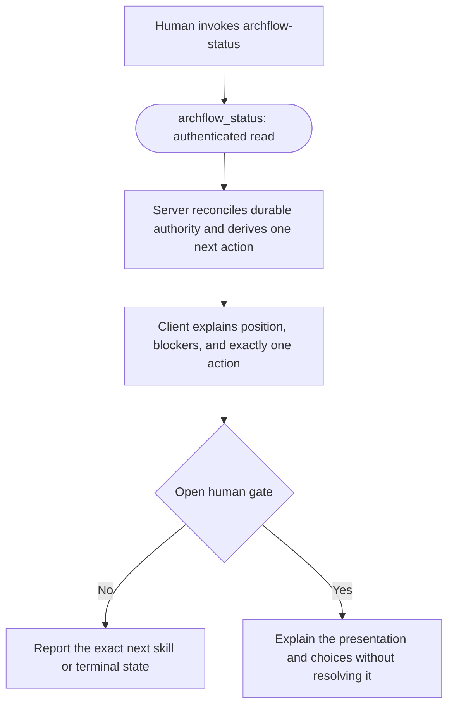

This skill never calls `archflow_apply`, edits, repairs, commits, advances, or records a human
decision. Read-only degraded status remains a local fallback when MCP is unavailable.

#### `$archflow-upgrade <legacy-source> <task>`

Legacy adoption keeps a narrow purpose-specific preview/stage/adopt adapter; it is not encoded as
an arbitrary task `archflow_apply` action. After atomic adoption, the ordinary semantic review and
decision shapes take over.

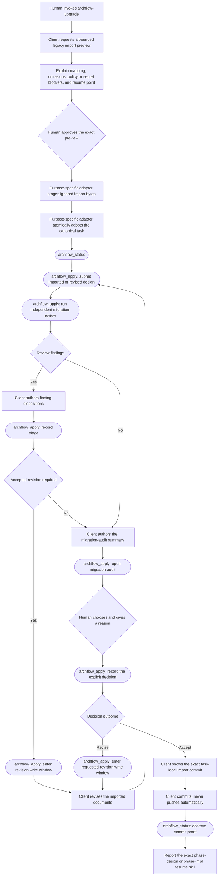

The newly invoked resume skill consumes the offered hand-off. Preview approval and
migration-audit acceptance remain distinct human decisions. Migration-audit acceptance is
the import-commit authority under the same milestone rule as design approval — the client
shows the exact commit and creates it without a second durable confirmation, matching the
shipped input-free commit behavior; PRD R8's explicit pre-commit confirmation applies to
implementation commits, not import milestones.

## 4. Public contracts

### 4.1 `WorkflowViewV1`

The exact contract will be a graph of `type` aliases, not interfaces, so any shape later retained
from a canonical root remains plain-JSON compatible and closed to declaration merging.

```ts
type WorkflowConditionV1 =
  | "awaiting-client"
  | "awaiting-human"
  | "ready"
  | "blocked"
  | "complete";

type WorkflowResourceV1 = {
  role: string;
  path: string;
  access: "read" | "write" | "read-write";
};

type WorkflowPositionV1 = {
  kind: "prd" | "design" | "phase-design" | "phase-impl";
  phase?: number;
};

type WorkflowInvocationV1 =
  | { skill: "archflow-prd"; intent: "resume" | "reopen" }
  | { skill: "archflow-design"; intent: "resume" | "reopen" }
  | {
      skill: "archflow-phase-design";
      phase: number;
      intent: "resume" | "reopen";
    }
  | { skill: "archflow-phase-impl"; phase: number; intent: "resume" };

type WorkflowReopenImpactV1 = {
  target: WorkflowPositionV1;
  affected_positions: readonly WorkflowPositionV1[];
  authority_effects: readonly (
    | "supersede-results"
    | "clear-active-waivers"
    | "clear-pending-human-revision"
    | "clear-planned-final-phase"
  )[];
  planned_final_phase: "clear" | "retain";
  preserves_existing_git_index_and_worktree_bytes: true;
  appends_prd_ask_history: boolean;
  requires_fresh_review_and_approval: true;
};

type SemanticNextActionV1 = {
  kind:
    | "initialize-task"
    | "begin-work"
    | "submit-work"
    | "review"
    | "triage"
    | "revise"
    | "reopen"
    | "open-waiver"
    | "decide"
    | "commit"
    | "start-next-skill"
    | "finish-task"
    | "inspect"
    | "none";
  instruction: string;
  offer?: string;
  expected_submission?:
    | "none"
    | "task-ask"
    | "work-result"
    | "triage"
    | "gate-summary"
    | "reopening-request"
    | "decision";
  skill?: string;
  skill_args?: readonly string[];
  commit?: {
    paths: readonly string[];
    message: string;
    target_ref: string;
    baseline: string;
    requires_human_confirmation: boolean;
  };
  reopen?: WorkflowReopenImpactV1;
};

type WorkflowViewV1 = {
  schema_version: "1";
  task_id: string;
  condition: WorkflowConditionV1;
  headline: string;
  detail: string;
  position?: WorkflowPositionV1;
  resources: readonly WorkflowResourceV1[];
  next_action: SemanticNextActionV1;
  findings?: readonly PublicFindingV1[];
  review_context?: {
    rubric: RubricV1;
    active_rules: readonly PublicConstitutionRuleV1[];
  };
  presentation?: HumanPresentationV1;
};
```

The public finding contains the stable finding ID, severity, blocking flag, summary, reviewer
evidence, suggested resolution, and any current disposition/rationale needed for remediation. The
human presentation reuses the existing title, summary, details, question, and labeled
option/consequence model, but each option contains an opaque choice token rather than gate IDs or
digests.

`review_context` is returned only when the producing skill needs the canonical same-side review
rubric or pinned active rules. It intentionally omits rubric digests, routing, reviewer identity,
and evidence ordering. Resources reuse the current status roles and paths because a client
producer must know where to work.

Server-internal companions include `SemanticActionOfferV1`, `SemanticOperationKeyV1`, and the
closed named-substep vocabulary for each action family. They are canonical type aliases used for
derivation/tests, never fields in `WorkflowViewV1` and never new durable records.

`PublicFindingV1` retains the reviewer's evidence and suggested resolution in addition to its ID,
severity, blocking flag, and summary. The current `TaskStatusV1.evidence.findings` projection omits
those two fields, so the semantic read path must load them from the same authenticated retained
review snapshot rather than fabricate or discard them.

The view never exposes:

- phase-instance/step/status transition triples;
- durable revision or input fingerprint;
- intent or request/evidence/subject digests;
- staged request or archive paths;
- gate IDs, gate context, waiver origin, or approval references;
- reviewer routing identities or internal request templates.

Project errors use a compact public summary and include a fresh `WorkflowViewV1` whenever durable
status remains readable. That lets a stale action fail with the actual safe next action.

### 4.2 `archflow_status`

Input:

```ts
type ArchFlowStatusInputV1 = {
  schema_version: "1";
  task_id: string;
  invocation?: WorkflowInvocationV1;
};
```

The tool is mechanically read-only. It creates production services, computes one authenticated
`SemanticStatusSnapshotV1`, projects that snapshot into `WorkflowViewV1`, derives the current action
offer for the supplied invocation, and returns. The snapshot contains the existing full
`TaskStatusV1` plus the authority's repository identity digest, full current review findings, any
authenticated pending-waiver origin, any authenticated post-decision/pre-reentry revision
checkpoint, any exact archived-but-unsettled decision beside its still-open gate, and the
planning-restart facts needed to validate and explain a reopen. These
enrichment facts come from the same canonical state, immutable gate archives, and retained-evidence snapshot;
the implementation must not join legacy status to unrelated later reads. It never repairs,
advances, opens a gate, restarts, or creates a task.

Core producing skills always send their invocation. An omitted invocation, as used by
`$archflow-status`, returns the same reconciled view but no mutation offer. `intent: "resume"`
derives only the current or exact successor action; it can never cause a backward reset.
`intent: "reopen"` derives a reopen only for its own strictly earlier planning position and never
for `phase-impl`. The invocation is context, not authority: the server derives current position,
target legality, and concrete impact. Open gates, reconciliation/repair, and terminal state take
precedence over it and are presented without a mutation offer when the invoked skill is not their
current owner.

For an initialized repository with no task, an `archflow-prd` resume invocation returns an
`initialize-task` offer. For an uninitialized repository or unreadable authority, status returns
`blocked` with the existing safe bootstrap/repair direction. Local manual status remains only the
degraded fallback when MCP is unavailable.

### 4.3 `archflow_apply`

Input root:

```ts
type ArchFlowApplyInputV1 = {
  schema_version: "1";
  task_id: string;
  invocation: WorkflowInvocationV1;
  action: {
    offer: string;
    submission?: ApplySubmissionV1;
  };
};
```

`ApplySubmissionV1` is a nested discriminated union below the plain object root:

```ts
type ApplySubmissionV1 =
  | { kind: "task-ask"; text: string }
  | { kind: "reopening-request"; request: string }
  | {
      kind: "work-result";
      outcome: "succeeded";
      implementation?: {
        base_commit: string;
        outputs: readonly string[];
        restore_targets: readonly string[];
        declared_inputs: readonly { input_id: string; path: string }[];
      };
      human_revision?: HumanRevisionDeclarationV1;
    }
  | { kind: "work-result"; outcome: "failed"; reason: string }
  | { kind: "triage"; dispositions: readonly TriageDispositionV1[] }
  | { kind: "gate-summary"; summary: string }
  | {
      kind: "decision";
      choice: string;
      reason: string;
      option_rationale?: string;
    };
```

Apply reuses the exact invocation supplied to status. The opaque offer binds that invocation, and
the server recomputes both together; the client cannot convert a resume offer into a reopen or
change the target by editing the submission. `reopening-request.request` must contain non-whitespace
human text and is capped at the existing 4,096-character human-reason limit, but its accepted bytes are never trimmed,
normalized, or reflowed. Internally those exact bytes become the durable restart reason. For a PRD
target, the same stable operation installs one generated ask-history entry exactly once before the
restart fingerprint is derived. A target field is intentionally absent from the submission.

For task initialization, semantic staging writes the UTF-8 encoding of `task-ask.text` exactly—no
trim, normalization, or added newline—to the canonical `ask.md` slot before recording revision
zero. The current `TaskInitializationV1` request remains
unchanged; the staged ask is a recoverable input which the first PRD result later pins as its
declared `user-ask`. Exact replay accepts an existing byte-identical ask, while different bytes
fail closed. If initialization fails after staging, status still reports an uninitialized task and
the same ask submission can safely retry; research never begins in that window.

Document completion needs no artifact body or path: the server snapshots the exact writable
resource slots named by the offer. Phase implementation includes only facts the client genuinely
owns. `base_commit`, declared output/restore paths, and declared input IDs describe the work the
client performed; the server derives canonical parent-document slots, verification transcript
location, after-images, digests, scope classification, secret scan, and all durable bindings.

No submission is supplied for deterministic offered actions such as begin-work, revision re-entry,
independent review, pending-waiver opening, phase handoff, or final task completion. `revise`
records only the server-derived produce-running transition after accepted triage or an
authenticated close-only human revision decision, then returns `submit-work` with the writable
resources; the client must not edit before that apply result. Accepted triage takes the ordinary
attempt-incrementing re-entry. A revision-decision checkpoint binds the archived gate request and
decision, derives the re-entry fingerprint, preserves the attempt for a human revision (or
increments it for `retry-once`), and creates `pending_human_revision` only as part of the resulting
produce/running state. Ordinary gate opening
requires `gate-summary`: the exact human-readable summary authored by the skill for that decision.
The server derives the gate kind, subject, evidence, context, and choices. Pending-waiver opening
instead derives the existing `Waiver request for <rule_id>` summary and every other gate field from
authenticated authority. `decide` normally requires the human decision submission; once an exact
decision archive exists beside its still-open gate, the settlement continuation requires and
permits no submission. A missing, extra, or wrong submission kind is rejected against the
recomputed offer.

### 4.4 Action offers

An action offer is an opaque `af1_<sha256>` token derived from a canonical
`SemanticActionOfferV1`; the offer digest is domain-separated from all durable document kinds. The
internal shape is not encoded into the public token and binds at least:

- task and repository identity;
- durable revision and input fingerprint;
- current phase and server-derived next-action code;
- the exact workflow invocation, including `resume` versus `reopen`, plus the server-derived reopen
  target and impact when applicable;
- subject/evidence/gate/commit identity when applicable;
- the archived gate-decision identity when `revise` consumes a close-only human-revision
  checkpoint;
- expected submission kind.

On apply the server recomputes the one currently legal offer and compares the digest. A caller
cannot create a different legal action by editing the token. The token is an interface binding, not
authority on its own; exact durable state, artifacts, evidence, approvals, and Git observations
remain the authority.

Each action derives a private `SemanticOperationKeyV1` from a domain label, the accepted starting
offer digest, authenticated repository/task identity, invocation, semantic action family,
phase/attempt/subject identity, and canonical submission digest. The key therefore binds the offer
but is not the volatile offer alone. Its domain-separated canonical digest is carried in every
substep's distinct internal intent ID:

`afop-<64-hex operation digest>-<closed substep code>`

Substep codes use the lowercase safe-code alphabet and are capped at 58 characters, so the full
format fits the 128-character `PathSafeId`. For the current compound action, review, it lets
authenticated `last_transition.intent_id` retain operation correlation after normal cleanup
deletes transient receipts. Single-step actions continue through their existing transaction or
immutable gate-archive replay authority. Each action family has a fixed named substep plan—usually
one substep; review uses `review-enter`, `review-run`, and, for a finding-free result, the
authenticated `triage-enter` boundary followed by `review-empty-triage`; client-authored triage
uses the same `triage-enter` boundary before terminal `triage`; Phase 2 decision uses
`decision-archive` and `decision-settle`.
Receipts remain the existing crash buffer only while one substep is being installed; no design rule
depends on an earlier substep receipt surviving commit cleanup.

For reopen, that deterministic identity is also the restart ID. Exact retry authenticates the
matching restart-history record, target, request bytes, landing position, and ask-history append
when applicable; a changed request or invocation is a conflicting operation, never a second
restart. The PRD ask append uses the same identity and recoverable receipt/atomic-replace machinery,
so a crash on either side of that append converges without duplicating it.

On the first call, apply validates the current offer and derives the operation digest. At a compound
continuation, it accepts an embedded digest only after recomposing and authenticating the preceding
substep's tool, operation, request digest, input fingerprint, outcome, and exact legal successor
state against `last_transition`. An exact retry derives a candidate digest from its old starting
offer/submission and must match that authenticated digest. A fresh mid-action call must match the
new current offer, then carries the authenticated existing digest to the first unfinished substep.
Review accepts no client submission. Decision accepts one submission only for
`decision-archive`; after the immutable record exists, fresh continuation accepts none and
recomposes the operation from the gate request/frozen predecessor, invocation, and archived
choice/reason. A changed single-step or starting decision submission derives a different digest and
conflicts with the recorded transition or gate archive. Once another actor
completes a later semantic action, an older token is simply stale and returns the fresh safe view.
There is no semantic operation record, offer archive, or receipt-retention exception.

### 4.5 Semantic mapping over the current state machine

| Durable position / next action | Public view | Apply effect |
|---|---|---|
| Task missing, repository ready | `ready / initialize-task` | Recoverably stage exact ask bytes, initialize PRD produce-running, return writable ask/artifact resources. |
| Explicit `reopen` invocation names a strictly earlier PRD/design/phase-design and no higher-priority blocker exists | `awaiting-client / reopen` expecting `reopening-request` plus concrete impact | Bind the exact request to the offered target; for PRD append it once to ask history; archive target-and-downstream result authority, clear waivers/pending revision, reset attempt 1, and return the target produce window. |
| Produce not running or retry/re-entry required | `ready / begin-work` | Record only produce-running, then return `awaiting-client / submit-work`. |
| Produce running | `awaiting-client / submit-work` | Snapshot client work and record produce success/failure. |
| Review required, running, or durably finding-free before empty triage | `awaiting-client / review` expecting `none` | Execute only the unfinished fixed named review substeps, dispatch existing independent reviews at most once, and record terminal/empty-triage evidence; return findings or the next ordinary gate-opening action. |
| Findings need judgment | `awaiting-client / triage` | Record exact dispositions; return the separate `revise` action, exhausted gate, constitution gate, or artifact approval. |
| Accepted triage requires production re-entry | `ready / revise` expecting `none` | Record only the ordinary attempt-incrementing produce-running re-entry, then return `awaiting-client / submit-work` with writable resources. |
| An authenticated close-only gate decision requires re-entry | `ready / revise` expecting `none`; no writable resources yet | Revalidate its immutable request/decision checkpoint, derive the fingerprint, enter produce-running, create `pending_human_revision` only for a human revision, then return writable resources. |
| Ordinary gate needs opening | `awaiting-client / decide` expecting `gate-summary` | Bind the submitted human-readable summary to server-derived gate authority, open/archive it, and return the presentation without waiting. |
| Open gate, no decision archive | `awaiting-human / decide` expecting `decision` | Re-authenticate choice and reason, exclusively archive that decision, settle it in the next fixed substep, and return without any second human action. |
| Open gate, exact decision archive already exists | `ready / decide` expecting `none`; no presentation | Continue only `decision-settle`; close/apply the already-recorded choice once, never reprompt, and return its bounded next action. |
| Open gate, invalid or conflicting decision archive | `blocked / inspect` | Do not present choices or mutate until the authority conflict is repaired. |
| Authenticated `waiver-requested` decision, waiver gate not yet open | `awaiting-client / open-waiver` expecting `none` | Derive the existing waiver summary, rationale, rule, scope, subject, evidence, and origin from archived/current authority, open exactly one waiver gate, and return its presentation. |
| Authorized client commit required | `awaiting-client / commit` | Return exact Git instructions and no apply offer. The client commits, then calls read-only status; status performs existing commit observation and returns the now-legal handoff/completion offer. |
| Approved predecessor can advance | `ready / start-next-skill` | Only the newly invoked successor skill applies the phase handoff and opens its work window. |
| Final implementation commit is observed | `ready / finish-task` | The current phase-implementation skill records terminal task completion. |
| Repair/reconciliation ambiguity | `blocked / inspect` | No apply offer unless an existing bounded semantic repair is defined; report the current safe owner/action. |
| Final phase committed | `complete / none` | No mutation. |

The exact internal transition sequence remains the legal state machine. The focused planning
restart extension adds only the backward edge and audit record described above; the facade changes
how all other transitions are grouped and derived, not what evidence or approvals authorize them.

### 4.6 Catalogue and schema projection

Both tools have purpose-level descriptions. Their advertised input roots are plain objects with no
root `oneOf`, `allOf`, or `$ref`; invocation and `action.submission` variants remain nested below
those roots. The result schema is the compact public view and public error summary, not the durable
artifact/gate/error corpus.

The current custom `$defs` reachability projection may be reused initially. After the compact
contracts are measured, delete projection machinery only if the simpler schema makes it
unnecessary; do not rewrite it speculatively. Catalogue size and first-call selection are measured
against final production descriptors in Phase 4, not against a test-only future catalogue.

## 5. Internal implementation

### 5.1 One read model

`computeTaskStatus` remains the base durable read model. Add one server-internal
`computeSemanticStatusSnapshot` adapter that obtains the base status, authenticated repository
identity, full retained finding fields, pending-waiver facts, authenticated post-decision revision
facts, and planning-restart eligibility from one consistent read. Add pure
`projectWorkflowView(snapshot, invocation)` and
`buildSemanticOffer(snapshot, invocation)` functions. Semantic status and every successful or
recoverable apply call invoke the same functions. Tests compare an apply response byte-for-byte
with a fresh semantic-status projection for the same invocation to prevent response drift.

Implement the consistent read by extracting the smallest private detailed-status assembly seam
from `computeTaskStatus` (or an equivalent internal return used by both callers), so state and
retained evidence are loaded once. Keep the serialized legacy `TaskStatusV1` output unchanged; do
not compute legacy status and then reopen mutable files to enrich it.

The adapter is not a second state machine. Except for explicit backward invocation, the legacy
waiver interval below, an archived-but-unsettled decision, the authenticated post-decision revision
interval, and the narrow finding-free review continuation, it projects the base
`next_action`. A reopen projection first honors open gate, terminal, and reconciliation/repair
blockers; then validates the invocation target with the canonical total phase ordering and derives
the affected authority from the same state snapshot. `resume` never enters this branch. After
`review-run` has durably produced no findings but `review-empty-triage` has not committed,
the snapshot keeps the public action as no-submission `review` and marks that fixed substep as the
first unfinished operation step; it must not expose a meaningless client triage judgment or
redispatch review. The adapter uses the transaction authority's repository identity rather than an
input fingerprint, and it preserves `evidence` plus `suggested_resolution` from the authenticated
review artifact. Cross-repository fixtures with otherwise identical task bytes must produce
different offer tokens.

For a valid checkpoint produced by the old surface, the same authenticated finding-free state may
have no semantic intent prefix. Treat the current offer as a new one-substep review-settlement
operation whose only substep is `review-empty-triage`; do not redispatch the already retained
review. A semantic-looking prefix that fails full `last_transition` recomposition is not legacy—it
returns `blocked / inspect`.

When `open_gate` exists, the same snapshot loads its immutable request and decision-archive slot
before projecting the presentation. A missing archive is the normal `awaiting-human / decide`
state. One exact semantic archive suppresses that presentation and projects `ready / decide` with
no submission and only `decision-settle` unfinished; the operation digest is recovered from the
archive's semantic event binding and the recomputed starting offer. One exact pre-facade archive
starts a new one-substep settlement over the already-authenticated human choice. Invalid,
mismatched, or conflicting archives yield `blocked / inspect`, never another prompt. This is
archive authority, not a new coordinator record.

The revision interval adds no state field. It is recognized only when the Phase 2 semantic
decision service has archived an exact re-entry decision, removed that gate without entering
production, left the state at the request phase's triage/succeeded position with no
`pending_human_revision`, incremented revision once, and installed the current
`archflow_gate / semantic-revision-requested` last transition. The snapshot reloads and validates
the request and decision archives, deterministic decision-substep identity, frozen predecessor,
subject, evidence, phase/attempt context, re-entry choice, and transition digests. Missing, forged,
stale, wrong-phase, non-reentry, or superseded facts return `blocked / inspect`; a valid checkpoint
projects `ready / revise` with no writable resources.

`NextAction` may retain its internal request templates during migration. They are not reachable
from `WorkflowViewV1`. Once all semantic composers cover every emitted action, the templates and
their skill-facing guidance can be retired.

### 5.2 Transport-neutral composition

Split `src/local/build-request.ts` into:

- internal, transport-neutral composition services that accept authenticated production services,
  the current state/status, and only semantic submission facts;
- the existing CLI adapter, retained temporarily for old skills;
- the new semantic apply dispatcher, which consumes the offer and invokes exactly one service.

The internal services reuse `buildDocumentArtifact`, `buildImplementationOutput`, triage binding,
counter-review request derivation, gate-context derivation, and advance derivation. They produce the
same resolved internal request or invoke the same bounded handler service. They do not shell out,
self-call MCP, or stage a request between functions in the loaded server.

Add the focused planning-restart kernel absent from this branch: canonical phase comparison and
strict earlier-planning validation; an optional sorted/unique `restart_history` record; a planner
that supersedes target-and-downstream authoritative results, clears active waivers and pending
human revision, preserves prior approvals/history/fixed pins, resets the target to produce-running
attempt 1, and clears `planned_final_phase` only for PRD/design targets; connected-human provenance;
and replay validation against the stable semantic restart ID. The generic transaction preservation
guard may permit waiver/pending-revision removal only for an authenticated restart plan and must
remain strict otherwise. Cleanup keeps archived result/decision authority referenced by restart
history. Old state with no history remains valid.

Add one shared restart-generation predicate for approval authority. First derive the
`authority_phase` the approval binds: the authenticated gate request phase must agree with the
current/upstream subject artifact's producer `phase_instance`; imported projections use their
canonical binding, while migration-audit authority uses its authenticated migration gate request
phase. Never substitute the current consuming phase. For that authority phase, find the greatest
`restarted_at_revision` among restart records whose target is at or before that phase in canonical
workflow order. An approval is eligible for that phase only when `resolved_at_revision` is greater
than that cutoff. Apply it everywhere approval is authority: current next action, approved-upstream
loading, evidence/adjudication, gate and transition validation, migration-audit/resume, commit
observation, and phase advancement. Archives and diagnostic history may still display older
approvals. This closes deterministic identical-byte reuse without changing artifact or fingerprint
digests.

Extend the existing retained-result accounting graph to the deduplicated union of active
`authoritative_results`, current `pending_human_revision.evidence`,
`human_revision_history[].evidence`,
`restart_history[].superseded_results`, and evidence nested in each cleared pending human revision.
Snapshot creation, result installation/replay, status/workspace accounting, and the task byte cap
all use this same graph. A result digest shared across any histories counts once; moving it to
restart history never frees quota while cleanup keeps its bytes live.

The reopen composer accepts only the authenticated invocation, offer, and exact
`reopening-request`; it derives the target and invalidation set. For PRD it uses one stable
operation/restart identity to install a server-framed ask-history append through recoverable
exclusive/atomic replacement, verifies an existing retry append byte-for-byte, then derives the
target fingerprint and lands the restart. A crash before state replacement leaves a resumable
append; a crash after it authenticates the restart-history record and does not append again. Any
unexpected ask bytes fail closed. Design/phase-design reopen has no document side effect before the
state transition.

Semantic initialization adds one explicit recoverable staging step around the existing
`stageTaskInitialization`: write the exact ask bytes to canonical `ask.md` with exclusive-create
semantics, accepting only a byte-identical existing file on retry, then compose the unchanged
`TaskInitializationV1` revision-zero request. If the later state transaction fails, the staged ask
remains resumable and no PRD review treats it as pinned until the first produced PRD declares it as
`user-ask`. This preserves exact ask capture without widening the durable initialization contract.

The envelope/request-digest code remains internal because receipts and handler identity still need
it. The public caller no longer computes or transcribes any of those fields.

### 5.3 Bounded apply dispatcher

The apply handler performs this fixed sequence:

1. materialize and validate the caller-owned input once;
2. create production services and compute full current status;
3. bind the supplied invocation, then validate either the current offer or an old offer whose derived operation digest matches the
   fully authenticated semantic `last_transition` before rejecting it as stale;
4. derive or carry forward the stable operation digest and validate the expected submission;
5. execute only the first unfinished substep in that action family's fixed plan, settle its existing
   receipt/transaction, and explicitly continue only when the next named substep has no intervening
   actor boundary;
6. recompute/re-authenticate status between substeps and once more for the returned
   `WorkflowViewV1`.

The plan is explicit code per action family, not a registry or workflow interpreter. Most actions
have one state-transition substep. `revise` is exactly `revise-enter`: after accepted triage it
composes the ordinary attempt-incrementing produce re-entry; after an authenticated
`semantic-revision-requested` checkpoint it reloads the immutable gate archives, derives the gate
re-entry fingerprint, preserves the attempt for a human revision (or increments it for
`retry-once`), and creates `pending_human_revision` only while entering produce/running. Exact replay
authenticates that transition and returns `submit-work`; it never repeats re-entry. Review is pinned
to `review-enter`, `review-run`, and, only for a finding-free result, `triage-enter` followed by
`review-empty-triage`; each name has its own deterministic internal intent. `review-enter`
composes the existing counter-review/running state transition, `review-run` invokes the existing
counter-review handler/service, `triage-enter` records the required triage/running boundary, and
`review-empty-triage` composes the zero-disposition terminal result only after authenticated review
evidence proves there are no findings. Client-authored triage uses the same authenticated entry
boundary before recording its dispositions.
Interruption after any one of them leaves durable state from which either the old exact call or a
fresh status offer selects the same next substep: the current substep may use its recovery receipt,
while every completed substep is correlated by authenticated `last_transition`. The
dispatcher has no `while` over workflow actions, recursive apply, dynamic substep discovery,
queued continuation, or execution past the next client/human boundary.

Decision is the other fixed compound plan once Phase 2 enables it. `decision-archive` accepts the
one human submission and exclusively writes its immutable record; `decision-settle` accepts no
submission and alone changes state. With no actor boundary the normal apply continues directly,
but a crash between writes makes fresh status offer only the settlement continuation. It never
renders the gate for a second decision. A revision choice settles at the closed
`semantic-revision-requested` checkpoint and returns; `revise-enter` remains a later offered
action.

Reopen is one bounded semantic action. Its durable state effect is one planning-restart transition;
the PRD variant has the recoverable ask-append precondition described in 5.2. Neither variant edits
the reopened artifact, performs review, resolves a gate, or advances a successor. Exact retry may
recognize either its authenticated `last_transition` or restart-history record because normal
cleanup can remove the transient receipt.

### 5.4 Independent review

The review action reuses `handleCounterReview`/`runCounterReview`. Producer family still comes from
the MCP initialize handshake. The server derives the canonical subject, artifact path, rubric,
pinned repository view, reviewer family, and constitution rules. The client supplies none of them.

Move the existing process-wide dispatch FIFO boundary outward so it encloses the `review-run`
pre-dispatch replay recheck, rubric/constitution dispatches, and durable commit as one serialized
operation; the inner dispatches then run directly and must not acquire the FIFO again. This prevents
concurrent old/fresh calls from both dispatching without a new keyed registry. It does not claim
external exactly-once execution if the server process dies before any result is durably recorded;
R9 only replays an effect once durable authority exists.

If findings exist, apply returns them for client triage. If none exist, the same bounded action may
record the no-judgment triage result but must return the gate-opening action for the skill-authored
summary. Any constitution trigger, material drift, or attempt exhaustion follows the same summary
boundary before its presentation opens. The server never authors a disposition, revision, or gate
summary.

### 5.5 Nonblocking gates and waivers

`openDurableGate` already provides a bounded gate-opening seam. Current decision application is
not yet a comparable semantic service: `resolveDurableGate` consumes an already written
`gate.decision` projection, while `runDurableGate` owns the blocking wait and approval resolution;
neither accepts a decision payload from an MCP handler. Phase 2 must extract one bounded
decision-application service that accepts the authenticated server-issued choice and human reason,
selects and validates the live template, records appropriate human provenance, archives the
decision, and closes the gate under the existing transaction/lock rules. It is a fixed compound
operation: `decision-archive` exclusively creates the immutable record, then `decision-settle`
changes state. The archive's existing connected-host `decision_event_id` deterministically binds
the semantic operation digest; connection ID and request-ID digest retain the real host trace, so
no archive shape or coordinator record is added. If create-exclusive finds an archive, the service
loads and authenticates its event, choice/reason, and gate bindings and reuses its original
provenance/timestamp bytes; it never regenerates, replaces, or asks for a second record.

The normal call continues directly because no actor boundary lies between those substeps. A crash
after archive creation but before state replacement leaves the matching `open_gate` in state. Fresh
status must detect and fully validate that archive before rendering the presentation, recover the
original operation from the archived request/frozen predecessor, invocation, choice/reason, and
event binding, and return no-submission `decide` with only `decision-settle` unfinished. An old
exact call reaches the same substep. A valid pre-facade archive without the event binding starts a
new one-substep settlement over the already-authenticated decision. Invalid, changed, or
conflicting archives return `blocked / inspect`; no recovery path asks the human to decide again.

For any choice the existing `enactsReentry` predicate recognizes, the semantic service deliberately
splits closure from production re-entry. Its `decision-settle` substep removes only the matching
`open_gate`, preserves the triage-succeeded phase,
attempt, fingerprint, results, and approvals, leaves `pending_human_revision` absent, increments
revision, and writes `archflow_gate / semantic-revision-requested` in `last_transition`. It then
uses the recovered deterministic `afop-...-decision-settle` intent, binds the direct semantic decision request
digest, and records an outcome that exactly matches the immutable decision archive; the archived
gate request retains its separate open-request digest. Fresh status recomposes the decision
operation from the live-gate offer derived from that archived request and frozen predecessor, the
supplied invocation, and archived choice/reason. It then returns the no-submission `revise` action.
`revise-enter` is the only writer that derives the next
fingerprint and enters produce/running; it creates the existing pending-human-revision marker for
the human-revision choices and increments the attempt without that marker for `retry-once`.
After settlement, decision retry or fresh status authenticates the archive/transition and returns
the same `revise` offer. The installed legacy `archflow_gate` path continues its current atomic
decision-plus-reentry behavior until its skills migrate, so no old caller is stranded at the new
checkpoint. Extract the existing fingerprint/re-entry planning from `planGateAuthorizedReentry`
behind one authenticated internal seam that accepts either the still-open legacy predecessor or
the exact close-only semantic checkpoint; do not duplicate its attempt, evidence, or
`pending_human_revision` rules.

For ordinary gates, the new flow submits `gate-summary` to `openDurableGate`, archives the request,
builds the existing conversational presentation, and returns. A later decision submission uses the
new Phase 2 service to resolve that exact archive after re-observation and re-authentication. Phase
1 defines and projects the starting/continuation submission shapes and validates synthetic
archive-before-state plus close-only revision checkpoints, but does not claim to execute direct
decisions or to have parity for the split legacy gate operation.

The existing material-drift `amend-upstream` choice is the one gate-resolution path that enacts a
planning restart. Phase 1 wires its legacy resolver to the same restart planner: derive the target
from the authenticated affected-upstream artifact digest by enumerating the current phase's
canonical upstream bindings and loading each through `loadProduceUpstreamSubject`; this covers both
retained document results and legacy-import projections. Deduplicate bindings that resolve to the
same authenticated subject, require one unique subject matching the sealed digest, and derive the
planning target from that subject's document artifact `phase_instance` (the imported projection's
synthesized artifact already carries its canonical binding phase). Then remove the exact open gate only as
part of its authorized resolution, use the gate ID as restart identity, archive the decision, and
verify the landing state/history on replay. Zero, duplicate, changed, or unauthenticated matches
fail closed. Phase 2's extracted decision service preserves that behavior; it does not turn an
arbitrary open gate into a reopen offer.

The disposable interface file may continue to be projected for recovery/audit compatibility, but
it is not required to resolve authority and normal skills never write it. Once no supported path
waits on it, remove `gate-wait.ts` and the normal local `decide` command. A corrupted or missing
projection cannot strand the durable gate.

Waiver-requested remains a non-approval decision. It returns the separate no-submission
`open-waiver` action. That later apply derives and opens the exact waiver gate from archived
authority, uses the current handler's server-derived `Waiver request for <rule_id>` summary, and
returns a second presentation. The human's later grant/deny choice is another decision submission.
No client supplies a second summary or reconstructs waiver origin fields.

Current gate closure removes `open_gate` and leaves no normal next-action code for the interval
between a `waiver-requested` decision and opening its waiver gate. The semantic snapshot adapter
recognizes that interval from the current `last_transition`, loads and validates the referenced
archived gate request and decision, verifies the rule, scope, current subject, and evidence
bindings, and produces an internal authenticated pending-waiver origin. The new waiver context
derives its rationale from that authenticated decision payload; the rule, scope, subject, evidence,
origin, and summary are all server-derived. That fact takes precedence over the base next action and
yields the `open-waiver` action above. Missing, stale, mismatched, or
already superseded archives return `blocked / inspect`; they never reopen the original constitution
gate or ask the client to reconstruct the origin. Once the waiver gate opens or resolves, ordinary
open-gate and waiver state again determine the view.

Recognition is deliberately narrow: there is no `open_gate`; `last_transition` is an
`archflow_gate` result for the current state revision whose authenticated decision is
`waiver-requested`; its request belongs to the current task/phase and current subject/evidence; and
no later waiver result supersedes it. The archived decision digest supplies the internal origin.

### 5.6 Client work, verification, and Git

Documents are written only in resource slots returned by the view. The server snapshots those
slots on submit. Phase-design production may update the returned PRD and task-design parents in the
same result, preserving current compound-subject behavior.

A parent edit inside the current phase is not a backward restart: it is included in that phase's
compound produced subject and fresh evidence. If the change invalidates already approved or
implemented work, the client must stop and invoke the affected earlier planning skill with explicit
`reopen` intent. The server then invalidates downstream authority before any replacement bytes are
authored. A PRD correction is always preserved in ask history, whether it uses same-phase re-entry
or the server-owned append in a backward restart.

For implementation, Claude Code or Codex edits the worktree, updates parents and implementation
notes, writes the canonical verification transcript, and supplies the small implementation
declaration. Existing snapshot, projection, secret, path-classification, diff, transcript, and
subject builders validate exact bytes. The server does not run a test or edit source.

Design and implementation commit rules remain unchanged. Existing design status already supplies
the authenticated commit facts and the semantic view returns them. Current phase-implementation
status does not expose an equivalent complete fact set, so Phase 1 maps that position to an honest
generic client-commit instruction with no fabricated `commit` object. Before Phase 3 cuts the
implementation skill over, it extends the authenticated read model to return the exact authorized
paths, target ref, baseline, message, and confirmation requirement. The public commit block carries
`paths` as a sorted list because an authorized implementation commit is an exact set of repository
paths; a design milestone projects its single task-local root as the one-element list.

The client stages only the authorized scope, inspects it, and for implementation obtains the
separate explicit commit confirmation. After the client commits, read-only `archflow_status`
reuses the current Git proof and returns either the successor handoff offer or the final-completion
offer. This observation is required only after an external Git change, not after an MCP mutation.
MCP never runs `git add` or `git commit` in this design.

After restart, an existing identical Git commit is history, not approval. Status may re-observe it
as byte/target evidence only after a post-restart eligible approval authorizes the current exact
subject; old approval or commit-observed facts alone cannot skip the fresh gate or advance.

### 5.7 No new coordinator state

The optional `restart_history` audit field is the sole focused durable extension and is not a job
or coordinator record. Do not add `active_step`, heartbeats, fencing generations, background jobs, worker manifests,
producer output channels, event delivery, pause tokens, or server session memory. The current task
state, authenticated `last_transition`, and within-transaction recovery receipts already identify
the next durable action. A client pause is simply stopping at the current boundary and later
calling status.

Cross-task interactive worktree concurrency remains an honest existing limitation. A server fence
could not contain edits made directly by independent host sessions anyway, so it is outside this
API refactor.

## 6. Compatibility, replay, and cutover

### 6.1 Existing durable tasks

Every valid existing checkpoint is projected through the mapping in Section 4.5. The state schema
adds only optional `restart_history`; absence means no restart has occurred, so old tasks need no
migration file or compatibility state. The planning restart is a backward edge to an existing
produce-running position, not a new phase or pipeline status. Tests seed every next-action class and
restart-history presence/absence and require one semantic view for the supplied invocation.

Open legacy gates remain resolvable from their durable archives through the new decision action.
The old disposable presentation is treated as a reconstructible projection, never required input.
Existing receipts continue to replay their original low-level requests; new semantic calls add
stable operation-key and named-substep intent correlation through the existing
`last_transition.intent_id` field without rewriting history or retaining transient receipts.
Restart history authenticates exact reopen replay after receipt cleanup; retained old approvals
remain audit history only and cannot authorize newly produced subject bytes. PRD reopen recovery
also verifies the operation-bound ask append before accepting or continuing the state transition.
The revision cutoff is derivable entirely from optional restart history, and retained-byte
accounting adds its archived result references to the existing deduplicated graph; neither needs a
migration projection.

### 6.2 Transition period

Phases 1-3 keep the old four tools and CLI composers available so this task can continue under the
current approved workflow while replacements are tested. New semantic handlers call the same
internal services; they do not create a second state machine. Skills switch only after their full
journeys pass.

The final cutover removes the old four tools from advertisement and removes
`build-request`/`envelope`/normal `decide` from supported skill instructions. Purpose-specific
constitution and legacy-upgrade operations receive narrow semantic adapters before low-level tool
retirement; they are not folded into task `archflow_apply`. Bootstrap, installation/registration,
read-only degraded status, and bounded exceptional repair may remain local.

### 6.3 Loaded-build coherence

All normal request derivation and mutation now run inside the same loaded MCP build. A fresh CLI no
longer constructs authority for an older server. If a client invokes an unsupported semantic schema
version, the server returns a compact blocked result and restart/reinstall direction; it does not
ask another executable to mutate around the mismatch.

## 7. Requirement mapping

| PRD requirement | Design response |
|---|---|
| R1 Client-owned work | Skills and host clients remain producer/orchestrator; only independent review is dispatched. |
| R2 Semantic granularity | One server-offered action per `archflow_apply`; compound actions use fixed named substeps, never a dispatcher loop over later actions. |
| R3 Common view | `WorkflowViewV1` is returned by status and every mutation. |
| R4 Skill lifecycle | Status/apply sequence preserves visible work, review, triage, a separate durable revision re-entry, decision, Git, handoff, and explicit backward-reopen boundaries; only strictly earlier planning positions can restart, and prior approval generation cannot authorize the new cycle. |
| R5 Server-derived integrity | Opaque offers plus in-server composers hide all mechanical fields, bind the exact invocation, and derive reopen target/impact rather than accepting them from the submission. |
| R6 Review integrity | Existing opposite-family/constitution review and fixed-point policy are reused unchanged. |
| R7 Human decisions | Skill submits ordinary gate summaries, waiver opening derives its existing summary with no submission, durable open returns immediately, and a later apply records one explicit choice through fixed archive/settle substeps; an interrupted archive settles without re-prompting, and a revision choice stops at a close-only checkpoint before `revise` opens production. |
| R8 Git/handoffs | Client performs authorized Git; read-only status observes proof and apply executes only the resulting legal handoff/completion. |
| R9 Resumption | Stable operation keys resume compound review through durable `last_transition`; an immutable decision archive recovers the pre-state settlement interval, and gate archives plus the current transition reconstruct pending waiver and revision-decision intervals; restart identity/history and the verified PRD ask append make reopen exact-replay safe; archived result bytes remain in shared quota accounting. No background coordinator state. |
| R10 Authority/CLI | MCP composes its own calls; old normal helpers retire after parity. |
| R11 Skills/special flows | Core skills orchestrate two-tool loop; special workflows get narrow adapters, not a universal runner. |
| R12 Docs/verification | Phase-local maintained docs, semantic journeys, negative ownership tests, final host proof. |

## 8. Verification strategy

### 8.1 Contract and unit coverage

- Generate and validate the semantic contract graph; use type aliases for every reachable
  canonical/public JSON shape.
- Assert plain object input roots, nested-only unions, purpose descriptions, compact public result
  graph, and absence of low-level fields.
- Table-test every current `NextAction` class to one `WorkflowViewV1` action and expected
  submission kind, plus archived-but-unsettled decision, authenticated pending-waiver, and
  post-decision revision intervals not represented by the legacy `NextActionCode` union.
- Table-test invocation routing: generic status has no offer; current/successor `resume` works;
  backward `resume` never resets; strictly earlier PRD/design/phase-design `reopen` returns the
  exact impact; same/current, forward, phase-impl, terminal, open-gate, and repair cases refuse it.
- Compare internal semantic composition with current build-request composition for initialization,
  produce entry/result, review, triage, the separate no-submission revision re-entry after accepted
  triage, ordinary gate-opening summaries, no-submission waiver opening, successor handoff, and
  final completion. The human-requested split is intentionally not legacy parity: Phase 1 tests its
  canonical checkpoint/consumer seam, and Phase 2 proves decision creation plus re-entry against
  the extracted service while leaving the old combined gate path green.
  Separately prove status changes from commit instructions to handoff/completion after client Git.
- Prove exact action replay, changed-submission conflict, stale-offer recovery, and concurrent
  revision refusal. For every compound action, interrupt between each fixed named substep and prove
  that the old exact call and a fresh mid-action offer converge on one unfinished substep with at
  most one dispatch/transition; specifically, the post-review/pre-empty-triage snapshot remains a
  no-submission review continuation and never redispatches review, while an open gate plus exact
  decision archive becomes a no-submission settlement and never redisplays the presentation. Run
  those checks after ordinary
  workspace cleanup has removed prior-substep receipts, and reject a forged operation-prefix or old
  offer that does not match the authenticated `last_transition` request identity.
- Prove otherwise identical snapshots under different authenticated repository identities produce
  different offers, and triage views retain finding evidence plus suggested resolution.
- Prove apply executes one action and contains no loop or producer/verification/Git dispatch.

### 8.2 Integration and crash coverage

- PRD, task-design, and phase-design journeys through revisions (including the explicit
  no-submission `revise` apply before any edit), opposite-family review,
  constitution results, nonblocking exact approval, task-local milestone commit observation, and
  successor readiness.
- Phase-implementation journey through client-written code/docs/transcript, implementation subject
  construction, review/remediation, commit authorization, explicit confirmation, commit proof, and
  successor readiness or terminal completion.
- No-findings review that skips empty client triage, returns a gate-summary action, and reaches the
  human presentation only after the skill submits that summary.
- Material and editorial remediation preserving the current invalidation rules; accepted material
  triage and human-requested changes each stop at `revise`, whose separate apply records only
  produce-running before client edits resume.
- Lost response after a revision decision, fresh semantic status, and exact decision retry all
  converge across both crash cuts: archive created while `open_gate` remains projects
  no-submission `decision-settle`, and the resulting `semantic-revision-requested` transition
  projects one `revise` offer. Missing, changed, forged, stale, wrong-phase, non-reentry, or
  superseded bindings fail to inspect; no cut repeats human judgment, and exact `revise` replay
  enters production once and creates `pending_human_revision` only there.
- Human significant revision, waiver, attempts-exhausted, material-drift, cancellation, and stale
  decision cases.
- Interruption immediately after `waiver-requested` resumes at the no-submission `open-waiver`
  action without client-authored summary or origin fields; malformed or stale origin archives fail
  to inspect.
- Crash/retry before and after every named substep, internal transaction, and gate archive write,
  with no duplicate review dispatch, decision, projection, or commit proof.
- Seeded existing checkpoints, open gates, and valid pre-facade archive-before-state decision
  recovery mapped without durable migration or a repeated human prompt.
- Reopen from active phase design and phase implementation to each legal earlier planning target;
  prove exact impact, target-and-downstream supersession, attempt reset, PRD/design final-plan
  clearing, phase-design final-plan retention, waiver/pending-revision clearing, and fresh review.
- PRD reopen crash cuts before/after ask replacement and state replacement; exact retry produces one
  verbatim framed entry and one restart record, while changed bytes conflict. Assert Git history,
  index, source files, and all pre-existing worktree bytes are preserved.
- PRD byte cases cover leading/trailing whitespace, Unicode, embedded headings/newlines, repeated
  identical corrections in distinct later reopen operations, and preservation of every original
  ask/clarification/reopen byte.
- Restart with active waivers proves the narrow restart exception clears them while generic
  transaction preservation still rejects unauthorized waiver changes; old approvals never
  authorize a new result.
- Reproduce byte-identical PRD/design/phase-design subjects after restart and prove pre-cutoff
  artifact, design, migration-audit, commit, upstream, and advancement approvals are ineligible;
  fresh post-restart approvals work, and existing Git proof is considered only after that gate.
  Boundary cases prove reopening phase design retains earlier PRD/design authority, reopening
  design retains PRD authority but invalidates design/migration/later authority, and reopening PRD
  invalidates every downstream approval generation.
- Count the deduplicated union of active, human-revision, restart-superseded, and cleared-pending
  evidence in snapshot/status/task-cap accounting. Cover one and repeated restarts, shared result
  references, exact replay exclusion, and task-cap rejection that archived payloads cannot evade.
- Material-drift `amend-upstream` derives its planning target from authenticated artifact evidence,
  uses the gate ID for one restart/history record, archives the decision, and replays exactly; no
  other open gate permits direct reopen. Cover both a retained upstream document result and an
  authenticated legacy-import projection, a compound phase-design result that updated a parent,
  plus missing/changed/conflicting-phase refusal.
- A pre-facade finding-free review checkpoint starts only the one-substep
  `review-empty-triage` settlement, while a forged semantic-looking transition fails to inspect.

### 8.3 Negative ownership coverage

Tests instrument the semantic server boundary and fail if a task-lifecycle handler:

- launches a producer model or writes a producer output manifest;
- edits a document or implementation file except durable workflow projections already owned by
  the kernel and the operation-bound PRD ask-history append;
- runs a verification command;
- stages or commits Git;
- applies more than the offered action;
- enters production from a triage or decision action, or lets `revise` do anything beyond the one
  authenticated produce-running re-entry;
- renders a human gate presentation when an exact matching decision archive is already unsettled,
  or lets `decision-settle` solicit/replace judgment;
- advances into successor work before its skill kickoff;
- authors a triage disposition or human choice.

### 8.4 Skills, catalogue, and maintained docs

Skill contract tests require the core skills to retain exploration, production, verification,
triage, remediation, human conversation, and Git responsibilities. They forbid normal
`archflow-local`, staged references, request envelopes, caller-authored revisions/digests, and
low-level transition triples.

After final descriptors stabilize, record the exact serialized catalogue byte count and run a
representative first-tool selection corpus plus a document/implementation slice in authenticated
Claude Code and Codex. No long-call/background/containment matrix is needed; only the existing
bounded review dispatch requires an extended timeout.

Each implementation phase updates the maintained caps-named pages whose current behavior changed.
The final phase cross-checks the whole set and marks the autonomous recommendation in
`docs/validation/client-interface-audit.md` as superseded without rewriting its historical
measurements.

## 9. Risks and mitigations

- **`archflow_apply` becomes an omnibus runner.** The offer names one action, the dispatcher has no
  loop, and negative tests instrument producer, verification, Git, and successor boundaries.
- **Revision begins outside durable production authority.** Accepted triage and request-changes
  decisions stop at a separate no-submission `revise` offer; only its one-step apply opens the
  write window. Request-changes resumption is authenticated by the immutable gate archives plus a
  close-only current transition, and journey tests forbid edits or resubmission before the revise
  result.
- **The view is too small for real client work.** Preserve role resources, findings, canonical
  same-side review policy, active rules, human presentation, available authenticated commit facts,
  and next skill; extend implementation status before its cutover and test every skill against the
  projection.
- **Opaque offers recreate staged references.** Offers are returned directly, contain no caller-
  authored payload, require no CLI/file handoff, and name a semantic action the view explains.
  Their only role is staleness/replay binding.
- **Semantic and low-level surfaces diverge.** Use one status read model and shared internal
  composers/handlers; parity tests run during the bounded transition and old tools retire.
- **Gate splitting weakens authority.** Reuse the existing archive, template binding, provenance,
  lock, transaction, and resolution validation in the bounded decision-application service; remove
  the blocking wait and disposable decision input only after semantic journeys pass. Revision
  decisions preserve the frozen triage predecessor and create no writable state until the separately
  authenticated re-entry. Archive-before-state is an explicit no-submission settlement interval,
  so a crash never causes a second human prompt.
- **Lost responses duplicate compound work.** Every named intent carries the stable operation
  digest, so authenticated `last_transition` survives receipt cleanup and identifies the first
  unfinished substep; an immutable decision archive supplies the same correlation before its state
  transition exists. The current substep still uses the existing recovery receipt. Old and fresh
  offers converge, forged bindings fail, and changed submissions conflict.
- **Reopen silently destroys or duplicates history.** Reopen is explicit in invocation and offer,
  returns its concrete impact before mutation, preserves all existing bytes, and uses one stable
  restart identity for the optional PRD append and restart record. Crash, active-waiver, and stale
  approval tests pin the narrow authority changes.
- **Identical bytes revive old authority.** One phase-aware revision cutoff filters every approval
  consumer, not just the public view; old archives remain visible but fresh post-restart approval is
  required before commit observation or advancement.
- **Archived restart payloads evade quota.** Cleanup liveness and retained-byte accounting consume
  the same deduplicated result-reference graph, including nested cleared-revision evidence, and cap
  tests cover repeated/shared histories.
- **Implementation submissions become path-heavy protocol.** Accept only client-owned declaration
  facts already needed by `buildImplementationOutput`; derive parents, transcript, bytes, digests,
  and scope server-side.
- **Special workflows bloat the core action tool.** Constitution and upgrade use narrow semantic
  adapters during final cutover rather than new variants in task `archflow_apply`.
- **Cutover strands an existing task.** The only state addition is optional restart history, every
  current next action plus archived-but-unsettled decision, pending-waiver, close-only
  revision-decision, and reopen cases has a projection test, and old tools remain until seeded and
  live journeys pass.
- **Scope regrows around autonomy concerns.** Background execution, producer dispatch, repository
  fencing, provider credentials, worker sandboxing, and delegated commit policy are explicit
  non-goals.

## 10. Implementation phase plan

### Phase 1: Semantic contracts and server-side composition

**Goal:** establish the compact view, opaque one-action offer, and transport-neutral request
composition without changing the installed workflow or advertising a partially working API.

**Scope:**

- define `WorkflowViewV1`, public finding/presentation/policy projections, semantic offers, apply
  submissions, explicit invocation/reopen impact, compact public errors, and generated schemas;
- add recoverable exact-ask staging for semantic initialization while leaving
  `TaskInitializationV1` and the legacy initializer unchanged;
- build the authenticated semantic status snapshot and pure snapshot-to-view/offer projection for
  every current next action plus archived-but-unsettled decisions, the pending-waiver interval,
  canonical close-only revision-decision checkpoints, and explicit reopen requests;
- add the focused optional restart-history contract, strict planning-phase ordering, restart
  planner/handler/replay path, narrow waiver-clearing transaction permission, cleanup references,
  recoverable exact-once PRD ask-history append, and the existing material-drift
  `amend-upstream` gate adapter over that planner;
- add one restart-generation approval predicate across every authority consumer and include all
  restart-history result/evidence references in shared deduplicated retained-byte accounting;
- extract build-request/call-envelope derivation into internal services callable by the loaded
  server while retaining the CLI adapter;
- implement an internal apply dispatcher for initialization, produce entry/result, independent
  review, triage, separate no-submission revision re-entry, reopening, ordinary gate opening,
  no-submission waiver opening, successor handoff, and final completion behind a test seam; define
  and project starting decision submissions plus no-submission settlement continuations, validate
  synthetic archive-before-state and closed-revision checkpoints, but leave decision substep
  execution/checkpoint creation to the Phase 2 service extraction;
- bind stable semantic operation keys and distinct named-substep intents to existing
  `last_transition`, action-specific gate archives, and within-substep replay machinery without
  retaining receipts or adding a coordinator record;
- add parity, mapping, schema, replay, and one-action-boundary tests;
- update maintained contract/pattern/complexity, durable-state/lifecycle, and additive legacy
  server/CLI documentation where Phase 1 behavior changes; do not present semantic tools as live.

**Out of scope:** advertised new tools, skill changes, nonblocking gate behavior swap, removal of
old tools/CLI commands, implementation workflow cutover, real-host evidence, any autonomous runtime
or policy change.

**Exit evidence:** all current next actions plus archived-but-unsettled decision, authenticated
pending-waiver, close-only revision-decision, and explicit reopen cases project to one semantic
action; decision settlement, waiver, and revise continuations accept no client submission;
legal restarts invalidate only derived target-and-downstream authority, preserve existing bytes,
exact-replay one PRD ask append/restart record, reject pre-restart approvals even for identical
subjects, and retain archived payloads inside the task byte cap; every Phase 1-supported internal
semantic composition matches the existing authenticated request/result, while the human-requested
split is proven through canonical checkpoint/consumer fixtures rather than false legacy parity;
direct decision execution and checkpoint creation are explicitly unavailable until Phase 2;
implementation commit status
contains no invented facts; crash/retry between named substeps and stale offers fail safely;
generated schemas and the normal full check pass; no semantic tool or skill behavior is activated,
and the only additive old-surface behavior is the bounded planning-restart adapter.

### Phase 2: Client-driven document workflows and nonblocking decisions

**Goal:** make PRD, task design, and phase design usable end to end through `archflow_status` and
`archflow_apply`, with the client producing/triaging and human decisions returned immediately.

**Scope:** advertise the two tools alongside the old surface; add MCP handlers over Phase 1
services; extract the bounded decision-application service from the blocking gate wrapper and wire
ordinary gate-summary/open, no-submission waiver-open, and decision/resolve actions; make every
semantic decision use fixed archive/settle substeps with no-prompt recovery between their writes,
and make every re-entry decision close only to the authenticated
`semantic-revision-requested` checkpoint before the separate `revise` action; support task ask
capture, compound document resources, independent review, triage plus explicit revision re-entry,
significant
revisions, constitution/waiver presentations, status-observed design milestones, and successor
readiness; wire and advertise explicit PRD/design/phase-design reopening through the same two tools;
migrate the three document skills after their normal and reopen journeys pass.

**Exit evidence:** representative PRD/design/phase-design journeys use no normal local helper or
staged request, every response equals fresh status view, no-findings and remediation paths work,
lost decision responses resume first at no-submission settlement or, after closure, at the same
no-submission revise offer, human approval remains exact,
client Git remains visible, successor work waits for its invocation,
and each document skill can reopen its legal earlier boundary without a low-level restart request.

### Phase 3: Client-driven phase implementation

**Goal:** move implementation production, verification evidence, review, commit authorization, and
handoff to the same semantic boundary while all work remains in the client.

**Scope:** semantic implementation declarations over existing output builder; client-authored
verification transcript and implementation notes; retained post-change review subject; triage and
fresh verification after remediation; extend authenticated status with the exact implementation
commit facts before exposing the commit view; constitution/material-drift/commit presentations;
commit-authorization request-changes through the same close-only decision checkpoint and separate
`revise` re-entry; explicit commit confirmation; status observation of the client-created Git commit; phase-impl
skill migration; terminal completion; regression coverage that an active phase implementation can
still reopen an earlier planning skill while phase implementation itself is never a target.

**Exit evidence:** a complete implementation journey proves no code before design approval, exact
review/evidence/parent-document bindings, fail-closed path/secret/scope cases, client-owned tests and
Git, no producer dispatch, and no successor work started by MCP.

### Phase 4: Exceptional adapters, retirement, skills/docs, and final host proof

**Goal:** make the semantic boundary the only normal documented workflow and remove the obsolete
mechanical public surface without expanding into a maintenance platform.

**Scope:** migrate `$archflow-status`; add the narrow constitution and legacy-upgrade semantic
adapters needed to retire their low-level dependencies; keep init/bootstrap and read-only degraded
status local; remove the four low-level tools from advertisement and retire normal
build-request/envelope/decide/staged-request paths when unused; invert skill contract tests; update
all affected maintained docs; annotate historical validation; measure the final catalogue and run
representative authenticated host selection/journey tests.

**Exit evidence:** no normal skill or exceptional retained skill depends on an advertised low-level
transition/gate/waiver tool; final catalogue/schema/host tests pass in Claude Code and Codex; full
local/release checks pass; maintained docs and limitations describe client-owned orchestration and
no autonomous runner.
