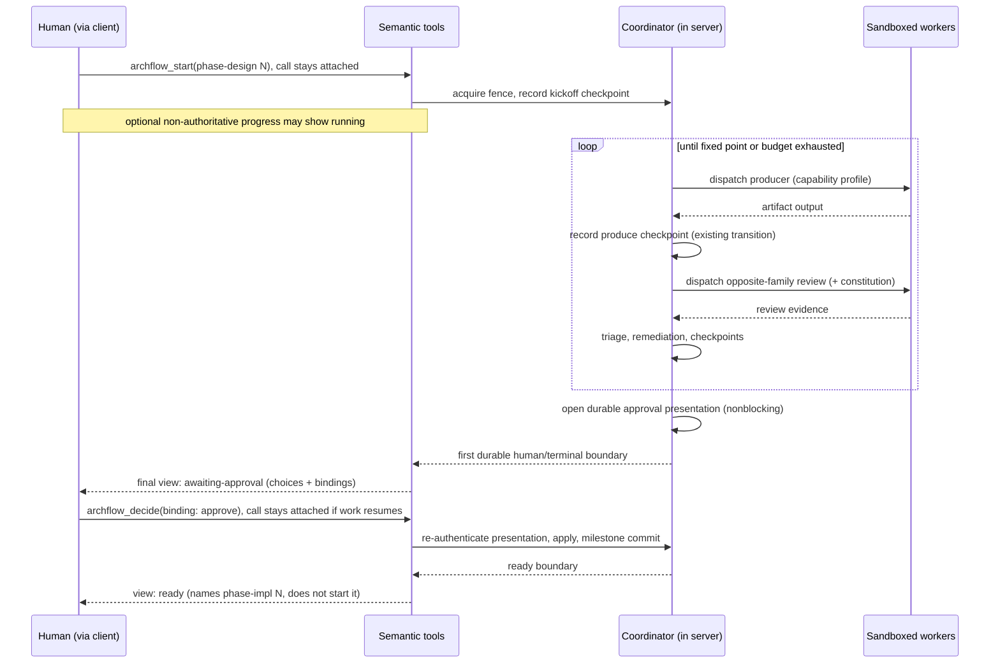
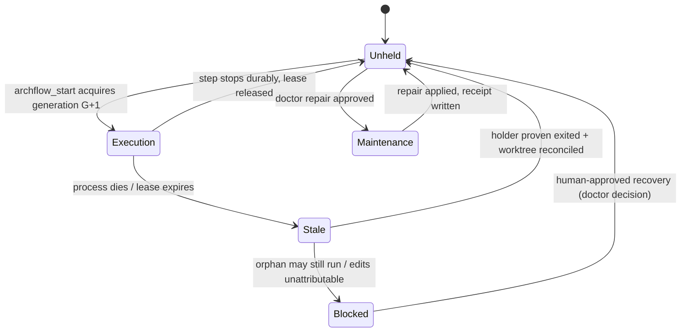

# Technical Design: Semantic API and Human-Stepped Autonomous Phase Execution

## 1. Summary

ArchFlow's public surface today is its own internals. Four low-level MCP tools
(`archflow_state`, `archflow_counter_review`, `archflow_gate`, `archflow_waiver` —
`src/contracts/tool-names.ts`) expose the durable state machine transition by transition, a
14-command CLI (`src/local/commands.ts`) composes and stages the requests those tools consume, and
the connected AI client acts as the workflow coordinator: it reads status, builds each request,
invokes each transition, polls, and resolves blocking human gates through a separate
CLI-writes-a-file side channel. The skills that drive this carry protocol vocabulary — staged
references, digests, revisions, gate mechanics — instead of user intent.

This design replaces that surface with seven semantic MCP tools and moves the coordinator into the
MCP server process. A human still explicitly starts every top-level step — PRD, task design, each
phase design, each phase implementation — and still approves every artifact's exact bytes. But
inside one human-started phase-design or phase-implementation step, a durably fenced in-process
coordinator owns the routine loop: dispatch a supervised producer, run the existing opposite-family
counter-review, triage, remediate within a bounded budget, verify, synchronize parent documents,
and (for phase implementation, once the delegation policy is explicitly approved) create the exact
scoped commit. The coordinator stops durably at exactly the boundaries the workflow already
reserves for humans: exact-byte artifact approval, new authority, unresolved judgment, and the next
top-level kickoff.

The existing durable kernel is kept, not replaced. `createProductionServices`
(`src/state/production.ts`), the transaction kernel (`src/state/transaction.ts`), the transition
planner (`src/state/transitions.ts`), the request-composition library (`src/local/build-request.ts`,
`src/local/call-envelope.ts`), review dispatch (`src/review/counter-review.ts`,
`src/dispatch/coordinator.ts`), and the gate archive machinery (`src/state/gates.ts`) become
internal services the coordinator calls directly — no CLI round-trips, no MCP self-calls, no staged
request files between the coordinator and itself. The fine-grained state transitions the old tools
exposed are retained as crash-safe internal checkpoints (PRD R5 permits exactly this).

Four structural gaps get closed: a durable repository/worktree fence with a monotonic generation
serializes writers across tasks and sessions (today only a 250 ms task-scoped lock exists,
`src/state/lock.ts`); OS-level sandboxing (bubblewrap / seatbelt) replaces best-effort CLI-flag
containment for dispatched workers; escalations and approvals become nonblocking durable
presentations resolved through one `archflow_decide` path (retiring the 500 ms `gate.decision`
file poll, `src/state/gate-wait.ts`); and the CLI shrinks to bootstrap and read-only diagnosis,
removing the long-lived-server-versus-freshly-loaded-CLI version-skew channel.

The replacement is direct: the four old tools are retired from advertisement at the end, existing
durable tasks reconcile into equivalent semantic positions or fail closed to an upgrade path, and
no compatibility facade is built.

## 2. Current architecture (verified)

### 2.1 Public MCP surface

- Exactly four tools (`TOOL_NAMES`, `src/contracts/tool-names.ts`), advertised via
  `ADVERTISED_TOOL_CATALOGUE` (`src/mcp/tools.ts`), which flattens each tool's two-branch input
  union (full payload | staged reference) into a plain object root (`mergedInputFragment`) because
  at least one host drops root-level combinators. The serialized catalogue measures 105,478 bytes
  with a <130,000-byte regression fence (`test/contracts/mcp-advertised-schema.test.ts`).
- Tool boundary: `createToolBoundary` (`src/mcp/server.ts`) — schema_version check, staged-reference
  rehydration (`rehydrateStagedToolCall`, `src/state/staged-requests.ts`), strict Zod parsing
  (`parseToolCall`, `src/contracts/mcp-tools.ts`), result re-validation and WeakSet branding.
- Handlers under `src/mcp/handlers/`: `handleState` (initialization + run-step + advance),
  `handleCounterReview` (server-dispatched opposite-family review, plus constitution review when
  active rules exist), `handleGate`, `handleWaiver`. All open a per-call session via
  `openHandlerSession` (`src/mcp/handlers/session.ts`), which derives `producer_family` from the
  connected host (`deriveHostIdentity`, `src/contracts/hosts.ts`) — the producer is the interactive
  client itself and is never dispatched.

### 2.2 Client-side orchestration

- `archflow-local` (`src/local/main.ts`) exposes 14 commands (`LOCAL_COMMANDS`,
  `src/local/commands.ts`): `validate, hash, render, snapshot, restore, clean, decide, status,
  reconcile, init, envelope, build-request, manual-status, upgrade`.
- `runBuildRequest` (`src/local/build-request.ts`) composes the seven request kinds
  (`BUILD_REQUEST_KINDS`), deriving every mechanical field from the same durable authorities the
  server checks, and stages all kinds except `initialize` to
  `.archflow/runtime/tasks/<task>/transient/intents/<intent-id>.request.json`
  (`writeStagedRequest`, `src/state/staged-requests.ts`). `computeCallEnvelope`
  (`src/local/call-envelope.ts`) authenticates authored requests and precomputes gate bindings.
- The client loop is: `archflow-local status` (`computeTaskStatus`, `src/state/status.ts`;
  `deriveNextAction`, `src/state/next-action.ts`) → `build-request` → MCP call → repeat. The audit
  (`docs/validation/client-interface-audit.md`) measures roughly 22–23 machine interactions for a
  routine no-rework document phase.

### 2.3 Human gates: a blocking call plus a file side channel

`runDurableGate` (`src/state/gates.ts`) opens a durable gate archive, then polls the runtime file
`cache/gates/gate.decision` every 500 ms (`waitForGateInterface`, `GATE_POLL_INTERVAL_MS`,
`src/state/gate-wait.ts`) while the MCP call blocks. The human's decision arrives through
`archflow-local decide`, which writes that file (`writeGateDecisionChoice`,
`src/state/gate-decision-interface.ts`). Resolution archives request and decision immutably under
`authority/decisions/<gate-id>/` and later authority checks re-authenticate from those bytes
(`loadAuthenticatedGateApproval`, `src/state/gate-approvals.ts`).

### 2.4 Dispatch and containment

- Only reviewers are dispatched: `createDispatchCoordinator` (`src/dispatch/coordinator.ts`) →
  `runDispatchChild` (`src/dispatch/process.ts`; 15-minute `DISPATCH_TIMEOUT_MS`, 8 MiB output
  caps, process-group termination) against a pinned `git archive` repository view with
  `.archflow/tasks` removed (`materializeRepositoryView`, `src/dispatch/workspace.ts`).
- Containment is best-effort, delegated to the child CLI's own flags: Claude gets
  `--safe-mode --tools "Read,Grep,Glob"` (no filesystem sandbox); Codex gets its own `-s read-only`
  sandbox plus a `--disable` feature list (`src/dispatch/cli.ts`). There is no bubblewrap,
  seatbelt, seccomp, or namespace use anywhere in `src/`. `docs/mcp/DISPATCH.md` states plainly
  that nothing filesystem-level prevents reads outside the view. Credentials are deliberately
  shared (real `HOME`) so provider auth works (`src/dispatch/workspace.ts`).
- Routing: `resolveDispatchRoute` (`src/dispatch/routing.ts`) resolves `{model, effort}` per role
  from task config and enforces the opposite-family constraint (`FAMILY_MISMATCH`).
  `selectCliAdapter` (`src/dispatch/cli.ts`) gates claude-family dispatch behind an
  `allow_claude_dispatch` option that the only production caller hard-codes to `true`
  (`src/mcp/handlers/counter-review.ts`) — a dead conditional.

### 2.5 Confirmed gaps this design closes

1. **No repository fence.** The only lock is task-scoped with a 250 ms acquisition deadline
   (`TASK_LOCK_POLICY`, `src/state/lock.ts`). Nothing serializes two tasks or two host sessions
   writing one worktree, and no fencing generation or durable active-step record exists in
   `src/state/`.
2. **No OS sandbox.** See 2.4; write-capable dispatch does not exist, and read-only dispatch
   containment is asymmetric between families.
3. **Gate polling side channel.** A blocking MCP call plus a CLI-written decision file (2.3) —
   exactly the inversion PRD R7 forbids.
4. **Version skew.** The MCP server is resident per session while every `archflow-local`
   invocation loads the currently installed bundle; after `./install.sh` the two interpret
   contracts with different code and nothing mechanical detects it (byte digests still match).
5. **Protocol-heavy skills.** The four workflow skills (`skills/archflow-prd`,
   `-design`, `-phase-design`, `-phase-impl`) are 15–19 KB each and teach build-request kinds,
   staged references, digest echoes, and gate/waiver mechanics; contract tests pin that this
   protocol text is present (`test/contracts/skill-contract-canonical.test.ts`).

## 3. Target architecture

### 3.1 Boundaries

Four planes, one process for authority:

- **Public control plane** — seven semantic MCP tools (3.2). The only workflow transport after
  bootstrap. Returns the common workflow view (R3), never internal mechanics.
- **Coordinator** — lives inside the MCP server process. Owns all authoritative task/worktree/Git
  mutation while holding the repository fence. Calls the existing pure services directly:
  `createProductionServices`, the request-composition library (`runBuildRequest` /
  `computeCallEnvelope` internals), the transaction kernel (`runStateTransaction`),
  `runCounterReview`, and the dispatch coordinator. No CLI or MCP self-round-trips; the
  staged-request file handoff disappears from the coordinator's own path because it can call
  `identifyTransactionRequest` (`src/state/request.ts`) in-process.
- **Worker plane** — dispatched producers, reviewers, and adjudicators inside OS-enforced
  capability profiles (3.5), exchanging sealed envelopes on stdin/stdout as today.
- **Durable kernel** — `.archflow/` canonical records remain the restart and recovery authority;
  the coordinator's fine-grained transitions are its crash-safe checkpoints.

### 3.2 The seven semantic tools

| Tool | Purpose | Mutates |
|---|---|---|
| `archflow_start` | Human kickoff of one named top-level step (`prd`, `design`, `phase-design N`, `phase-impl N`), including task creation for `prd`. In the portable attached mode, returns once at the first actionable `awaiting-approval`, `escalated`, `blocked`, or `ready` boundary; `running` is optional progress/status observation. | yes |
| `archflow_submit` | Pre-design authored-content exchange: PRD/task-design drafts, triage responses, significant reopen, terminal failure, as nested semantic variants below a plain object root (R4). | yes |
| `archflow_decide` | The single decision path for artifact approvals, escalations, waivers, and maintenance proposals, using a server-issued opaque choice binding with stale/replay protection. When a decision restores execution authority, it uses the same Phase 1-selected attached/detached transport as `archflow_start` and delivers the next actionable boundary. | yes |
| `archflow_control` | `pause` / `cancel` with safe-boundary semantics (R8). | yes |
| `archflow_status` | Optional observation; returns the common workflow view; never advances anything. | no |
| `archflow_doctor` | Compact diagnostic intent (R11): observation-only over task state, worktree, and Git; may append bounded maintenance proposals/receipts. | proposals only |
| `archflow_upgrade` | Legacy migration preview (R12); creation happens only through an approved maintenance decision via `archflow_decide`. | preview only |

Every tool keeps a plain object input root (per the repository's advertised-schema rule and the
regression fence in `test/contracts/mcp-advertised-schema.test.ts`); variant unions exist only
below the root. Each carries a purpose-level description so hosts select the right tool first call.
The four old tools are retired from advertisement at the end (dependency gate 10); their handler
logic is absorbed as internal coordinator services.

### 3.3 Control flow of a phase step



The same shape serves phase implementation, with verification and the scoped phase commit inside
the loop and the durable stop before the next phase kickoff. Pre-design (PRD/task design) differs
only in who produces: the human's own client session authors drafts conversationally through
`archflow_submit`; the coordinator still owns capture, counter-review, triage transitions, and
nonblocking presentations.

### 3.4 Fence and ownership



One durable fence at repository scope, outside any task (4.4). Write-capable execution requires
holding it; a second writer receives a semantic `blocked` busy view. Worker launches and results
are bound to the current generation; stale-generation results are refused before admission.
Maintenance repairs use the same fence with explicit precedence: maintenance acquisition refuses
while an execution lease is fresh, and execution acquisition refuses while maintenance holds, so
repairs can never race an active writer (R9).

A deliberate simplification makes orphan recovery tractable: **workers never write the worktree.**
Producers write a manifest plus complete after-image payloads into an attempt-scoped output
directory inside the dispatch workspace (4.6); the coordinator alone validates the declared paths,
derives every operation and durable fact, and applies the resulting plan through the existing snapshot/projection machinery
(`src/state/snapshots.ts`) under the fence and the transaction kernel. An orphaned producer can
therefore corrupt at most its own output directory — never the shared worktree — so "ambiguous
partial edits" collapses to: coordinator crashed mid-projection, which the existing reconciliation
findings already classify (`reconcileCurrentAuthority`, `src/state/reconciliation.ts`).

### 3.5 Worker containment

Dispatcher-controlled capability profiles enforced by the OS, not prompts (R10):

- **Linux**: bubblewrap (`bwrap`) — read-only bind of the repository view, writable bind of the
  task-scoped output directory only, `.git` (where present in a view) read-only, unshared network
  and PID namespaces, no new privileges, and private temporary filesystems.
- **macOS**: `sandbox-exec` with a generated seatbelt profile — deny default, read-only view,
  writable output dir, network restricted to the loopback proxy port.
- **Provider access**: every model-backed role — producer, counter-reviewer, and adjudicator — uses
  `provider-proxy-only`; none is offline. The coordinator runs a per-dispatch allowlisting forward
  proxy (CONNECT-only, exact adapter-owned provider hosts on port 443). On macOS the child reaches
  one loopback port allowed by seatbelt. On Linux the proxy listens on a private Unix socket and a
  separately built, manifest-verified ArchFlow Node helper inside the namespace bridges one fixed
  loopback port to that socket, supervises the CLI, and exits fail-closed with it. Credentials do
  not stay shared: the coordinator reads provider authority outside the sandbox and supplies only
  a Phase 1-proven adapter channel (for example an inherited ephemeral token/descriptor or a
  host-side auth broker) that is not a filesystem path addressable by model tools. No real `HOME`,
  `CODEX_HOME`, Keychain hierarchy, or reusable credential file is mounted. Token refresh remains
  coordinator/broker-owned; an adapter that cannot authenticate this way is unsupported and fails
  closed. Together with the proxy this permits first-party transport without exposing arbitrary
  host credentials or network access.
- **Fail closed**: Phase 1 must prove the proxy, helper/profile, authentication refresh, packaging,
  lifecycle, and denial canaries on every advertised platform before Phase 4 treats it as supported.
  If the required primitive or proven provider path is unavailable (including Windows), all
  model-backed dispatch refuses with an honest explanation. Current CLI restrictions remain only
  as defense in depth; there is no unrestricted or flag-only reviewer fallback.
- **Denial evidence**: sandbox denials (nonzero exit + captured stderr, proxy rejection records)
  are written as structured attempt records extending the existing failure-only telemetry
  (`writeAttemptRecord` pattern in `src/dispatch/coordinator.ts`), so the coordinator can prove a
  request was already authorized or open the smallest escalation.

Honest boundary (LIMITATIONS territory): this contains ArchFlow-dispatched workers. It does not
defend against a hostile local admin or an arbitrary malicious same-user process, and the PRD's
non-goals say so explicitly.

### 3.6 Decisions and escalations

Opening a human boundary reuses the durable gate archive (`openDurableGate`, `src/state/gates.ts`)
minus the blocking wait: the coordinator archives the request, renders a conversational
presentation, durably records it, and returns (or updates) an `awaiting-approval` / `escalated`
view immediately. `runDurableGate`'s 500 ms poll and the `archflow-local decide` side channel are
retired. The client resolves through `archflow_decide` with the server-issued binding; the
coordinator re-authenticates the exact archived presentation and current observations, applies the
effect through the existing resolution path (`resolveDurableGate` internals), and automatically
resumes the current step. Completion still stops at the next top-level boundary. A waiver request
and its grant/denial remain two distinct decisions, as today (`src/mcp/handlers/waiver.ts`
semantics preserved internally).

## 4. Key interfaces and data shapes

Sketch-level only; exact Zod schemas and generated JSON Schemas are Phase 2 work. All persisted
shapes are `type` aliases (repository convention), carry `schema_version: "1"`, and are canonical
JSON (`canonicalJsonBytes`, `src/contracts/canonical.ts`).

### 4.1 Tool inputs (plain object roots)

```ts
type StartInput = {
  schema_version: "1";
  task_id: string;
  step: "prd" | "design" | "phase-design" | "phase-impl";
  phase?: number;            // required for phase-* steps
  ask?: string;              // prd only: creates the task from this ask
};

type SubmitInput = {
  schema_version: "1";
  task_id: string;
  submission:                // union below the root (R4)
    | { kind: "draft"; content: string }                     // PRD or task-design bytes
    | { kind: "triage-response"; responses: TriageResponse[] }
    | { kind: "reopen"; revised_content: string; significance: "editorial" | "significant" }
    | { kind: "terminal-failure"; reason: string };
};

type DecideInput = {
  schema_version: "1";
  subject:
    | { kind: "task"; task_id: string }
    | { kind: "repository-maintenance"; proposal_id: string };
  binding: string;           // server-issued opaque choice binding
  reason: string;            // human reason, always required
  rationale?: string;        // only genuinely choice-specific detail (e.g. waiver scope)
};

type ControlInput = {
  schema_version: "1";
  task_id: string;
  action: "pause" | "cancel";
  confirm_discard?: boolean; // cancel only: proportional confirmation for destructive cleanup
};

type StatusInput  = { schema_version: "1"; task_id?: string };
type DoctorInput  = { schema_version: "1"; task_id?: string };
type UpgradeInput = { schema_version: "1"; legacy_source: string; task_id: string };
```

### 4.2 Common workflow view (the only ordinary response shape)

```ts
type WorkflowView = {
  schema_version: "1";
  subject:
    | { kind: "task"; task_id: string }
    | { kind: "repository" };            // task-free doctor/maintenance view
  state: "ready" | "running" | "awaiting-approval" | "escalated"
       | "paused" | "canceled" | "blocked" | "complete";
  headline: string;                       // one plain-language sentence of position
  presentation?: {                        // awaiting-approval | escalated | blocked only
    message: string;                      // conversational: what, why, evidence, consequences
    choices: Array<{ binding: string; label: string; consequence: string }>;
  };
  next_step?: { step: "prd" | "design" | "phase-design" | "phase-impl"; phase?: number };
                                          // ready only: names, never starts
};
```

Deliberately absent: revisions, fingerprints, digests, staged references, gate IDs, paths, receipt
or rubric identifiers, attempt counters. A contract test asserts these fields are unreachable from
the view schema. Restart/upgrade needs surface as `blocked` with recovery direction, not as extra
states (R3).

### 4.3 Decision binding

For task workflow decisions, the binding is derivable from durable authority, never a second store:
`binding = "d-" + sha256(domain-tag ‖ gate_id ‖ choice_id ‖ presentation_digest)[0:32]`, built on
the existing `computeGateId` / domain-tagged digest helpers (`src/contracts/fingerprints.ts`).
Resolution re-derives the binding from the archived gate request under
`authority/decisions/<gate-id>/`; a binding that no longer matches the current open presentation
(state advanced, presentation re-rendered after a significant revision, fence generation changed)
is refused with a fresh view; a binding for an already-resolved decision replays the recorded
outcome idempotently, matching the kernel's existing `last_transition` replay semantics
(`src/state/transaction.ts`).

Repository maintenance uses a separate domain and archive because task state may be absent or
malformed: `binding = "m-" + sha256(maintenance-domain ‖ proposal_id ‖ choice_id ‖
presentation_digest ‖ observed_context_digest)[0:32]`. The repository-scoped proposal archive
contains the human presentation, choices, exact observed build/worktree/fence/config bytes, and
their digest; resolution writes an immutable decision then receipt beside that proposal. A
`repository-maintenance` decision requires no task lookup, re-derives the binding solely from this
archive, refuses any changed observation or replay mismatch, and acquires the maintenance fence
before effect. Task and maintenance domains cannot authenticate one another.

### 4.4 Fence record

`.archflow/runtime/repository/fence/<generation>.json` — repository scope, outside any task, on the
ignored runtime side of the layout (`src/repository/paths.ts` gains a repository-scoped path
class). Written with the existing exclusive-create primitive (`createExclusive`,
`src/state/atomic.ts`): creating generation N+1 succeeds for exactly one contender, which is the
atomic acquisition.

```ts
type RepositoryFenceV1 = {
  schema_version: "1";
  generation: number;                    // strictly monotonic
  status: "held" | "released";
  acquisition_id: string;                // random holder capability, never worker-visible
  mode: "execution" | "maintenance";
  holder: {
    pid: number;
    process_start: string;               // process start marker (e.g. /proc stat start time),
                                         // distinguishes pid reuse
    build_id: string;                    // dist/manifest.json digest of the loaded bundle
  };
  task_id?: string;                      // execution: the active task and step
  step?: { step: string; phase?: number };
  acquired_at: string;
  lease: { heartbeat_at: string; ttl_ms: number };  // heartbeat rewritten in place (replace class)
  released_at?: string;
  release_reason?: "human-boundary" | "ready" | "paused" | "restart-required" | "canceled";
};
```

The highest generation is the durable high-water mark. It owns the repository only when
`status:"held"` and its holder is live (pid + start marker) with a fresh lease; a released record is
never valid ownership even while the long-lived server remains alive. At a safe boundary the exact
holder, authenticated by `acquisition_id`, atomically replaces that generation with
`status:"released"`; the file is never deleted or renumbered. One holder-local lease controller
serializes every heartbeat and release. Release first marks the controller closing, stops and joins
the heartbeat loop, then compare-and-swap replaces the exact current `{generation,
acquisition_id,status:"held",record_digest}` with `released`; a queued or stale heartbeat fails the
same CAS and cannot write afterward. A contender reads the highest record
and exclusively creates generation N+1 only after observing release, or after proving an abandoned
holder exited/was terminated and reconciling the worktree. Competing reclaimers race on the same
exclusive create, so one wins. A live-but-stale or otherwise ambiguous holder fails closed to a
doctor escalation. Resume/decision acquires a new generation while `active_step` retains the
original kickoff authority. Every worker result carries its launch generation and is admitted only
while that exact generation remains held; release instantly makes late results stale.

### 4.5 Capability profile

```ts
type WorkerCapabilityProfile = {
  role: "producer" | "counter-reviewer" | "adjudicator";
  model_backed: true;
  write_capable: boolean;
  filesystem: { view_root: string; writable_output_dir: string | null; git_readonly: true };
  network: "provider-proxy-only";
  provider: {
    adapter: "claude-cli" | "codex-cli";
    exact_hosts: string[];                         // measured, adapter-owned allowlist
    port: 443;
  };
  generation: number;                             // fence binding
};
```

Derived by the dispatcher from the approved envelope and routes config; workers cannot alter it.

### 4.6 Producer output contract

Producer dispatch adds an adapter invocation mode, `producer-output`. The outer OS sandbox exposes
the repository view read-only and exactly one fixed writable child path,
`.archflow-output/`. Claude keeps safe mode and no shell but gains `Read,Grep,Glob,Write,Edit`;
Codex uses its native workspace-write editor while shell, unified execution, multi-agent, browser,
apps, and plugins remain disabled. These client flags are an inner layer; only the OS sandbox is
trusted to limit writes to the output bind.

The directory has one closed, adapter-neutral format:

```text
.archflow-output/
  manifest.json
  payloads/<opaque-id>.bin
```

The manifest declares `result_kind: "document-set" | "implementation-images"` and the complete
changed-path set. Each entry is an absent path or a complete regular-file/symlink after-image
payload and mode (`100644`, `100755`, or `120000`); renames are a delete plus an add. Producers
never author patches, Git operations, path classes, digests, snapshots, durable records, or
projection instructions.

`document-set` is the bounded channel for PRDs, task/phase designs, synchronized parent documents,
and implementation logs. Its envelope names the exact current-task document slots that invocation
may return; document entries must be regular UTF-8 files, cannot delete required artifacts, and
cannot name state, config, runtime, evidence, decision, workflow, or another task path. The
coordinator validates required document structure (including phase-plan authority), derives the
artifact and parent-document bindings, installs the admitted bytes as an immutable result, and
writes only those slots through the same receipt-backed task transaction. Review binds to the
coordinator-installed artifact bytes, never to worker files. `implementation-images` additionally
admits authorized repository-source after-images and derives `ImplementationOutputV1` plus the
projection plan; its envelope may include exact current-task parent-document and impl-log slots so
reality synchronization lands in the same result.

After the whole process group exits successfully, the coordinator walks with `lstat`, opens with
no-follow semantics, and rejects extra nodes, symlinks/hardlinks/devices in the output area,
duplicate or ancestor/descendant paths, missing/reused payloads, unsafe symlink targets, no-ops,
and any path outside the kickoff envelope (especially other tasks and server-owned `.archflow`
state). It materializes the JSON once before repeated inspection, rechecks generation, process,
build, base commit, and envelope identity, and derives add/modify/delete plus full projection
sources from the pinned base tree and accepted bytes. Limits are 1 MiB manifest, 4,096 entries,
25 MiB aggregate payload, 25 MiB per payload, the existing 8 MiB process-output channels and
15-minute worker timeout, plus the existing retained-result/task caps. Within that total,
`document-set` bytes and canonical document entries co-produced by `implementation-images` are
limited to 512 KiB aggregate. Before admission, the coordinator renders the complete proposed
review envelope — implementation metadata, pinned context, and exact document contents — and
requires it to satisfy the existing 1 MiB `MAX_REVIEW_ENVELOPE_BYTES` limit. An oversized result
is rejected before any worktree/state effect and routes to bounded remediation or escalation;
exact bytes are never truncated. Repository-source after-images retain the 25 MiB limit because
reviewers inspect those bytes through the pinned repository view rather than envelope embedding.

The image-based builder feeds the existing `ImplementationOutputV1`, secret scanning, collision
checks, retained payloads, and `prepareProjectionPlan`; a dirty declared path yields zero writes.
For both result kinds, transaction order is: install immutable result bytes, create the exact-intent
receipt referencing them, project the authorized document/source after-images, atomically replace
state, then clean the receipt and disposable output. A crash after any partial projection therefore
replays the same retained intent, while an unadmitted or malformed attempt has no worktree effect.

### 4.7 Checkpoint mapping and active step

The coordinator's checkpoints ARE the existing durable transitions: `produce` / `counter_review` /
`triage` step records with `running|succeeded|failed` status, planned by `planStateTransition`
(`src/state/transitions.ts`) and committed by `runStateTransaction` — unchanged shapes, unchanged
replay/receipt recovery. One addition: `TaskStateV1` (`src/contracts/durable-state.ts`) gains an
optional `active_step` field recording the human kickoff:

```ts
type ActiveStepRef = {
  step: "prd" | "design" | "phase-design" | "phase-impl";
  phase?: number;
  kickoff_decision?: string;   // digest binding to the recorded start authority
  envelope_digest: string;     // digest of the derived delegation envelope (R1)
  status: "running" | "awaiting-decision" | "paused" | "restart-required";
};
```

Set at `archflow_start`, `active_step` survives every resumable approval, escalation, pause, and
restart-required boundary with the applicable status; those are durable observer stops, not the
end of kickoff authority. It is cleared only when the human-started top-level step reaches a
terminal `ready`/`complete` boundary or is explicitly canceled. A decision that restores authority
therefore resumes only when its archived binding and the retained kickoff/envelope still match.
Because the record lives in `state.json`, it flows through the same transaction kernel, receipts,
and crash arbitration as everything else, and a compatible restart reconstructs "which step the
human started and whether it is still authorized" solely from canonical records (R2). Absence of
`active_step` in an existing task's state is the reconciler's signal for legacy positions (Section 7).

## 5. Resolved design decisions

Each subsection resolves one bullet of the PRD's "Design must resolve" list.

### 5.1 Attached vs. background execution for calls that start or resume work

**Decision (evidence-gated):** the portable baseline is attached-until-boundary for every call that
starts or resumes coordinator execution. `archflow_start`, and `archflow_decide` when its choice
restores authority, keep their request open while the coordinator works and return their final
`WorkflowView` as soon as the step reaches `awaiting-approval`, `escalated`, `blocked`, or `ready`.
Progress notifications are optional UX only. Disconnect detaches that observer; it is not workflow
cancellation. A reissued identical start reattaches to the active/recovered step; an idempotent
decision replay reattaches to the execution authorized by that already-recorded choice.

**Criteria:** in both Claude Code and Codex — maximum tolerated single tool-call duration versus
the realistic step ceiling (a phase-impl step includes several worker dispatches, each capped at
15 minutes by `DISPATCH_TIMEOUT_MS`, `src/dispatch/process.ts`, so multi-hour steps are expected;
ArchFlow's own registrations currently pin one-hour call timeouts — `CLAUDE_MCP_TIMEOUT_MS =
3_600_000`, `CODEX_TOOL_TIMEOUT_SEC = 3_600`, `src/init/registration.ts`); stdio EOF behavior when
the host closes the pipe mid-call; whether a concurrent `archflow_control` call is deliverable
while a call is outstanding; reconnect behavior after host restart; MCP progress-notification
support in both hosts.

Phase 1 may select immediate-return/background execution only if both real hosts prove a standard
completion channel that automatically surfaces the later actionable view after either a start or
decision call returns. Status and replayed calls are optional observation/reattachment, not a
completion-polling fallback. If both hosts cannot sustain attached-until-boundary and cannot
surface a detached completion without polling, Phase 1 stops as a go/no-go failure and the design
or operating envelope must be revised.

### 5.2 Whole-catalogue budget and first-call selection

The numeric budget is measured, not guessed (dependency gate 2). Phase 1 advertises a prototype
seven-tool catalogue in both hosts, measures serialized size and first-call tool selection against
representative user intents without protocol instructions, and pins the resulting number in the
successor of `test/contracts/mcp-advertised-schema.test.ts`. Working hypothesis: purpose-level
descriptions with small semantic schemas should land far below the current 105,478 bytes; the
regression fence is set from the measurement, not from today's <130,000 fence.

### 5.3 Workflow-view and decision-binding schemas

Resolved in 4.2 and 4.3. The exact vocabulary is the PRD R3 eight-state list, `awaiting-approval`
is an expected boundary distinct from `escalated`, and the view schema's forbidden-field test is
part of the Phase 2 contract suite.

### 5.4 Remediation budget

Source: task config (`config.yaml`) gains `remediation.max_attempts_per_step`, default **3**,
mirroring the existing evidence machinery's `DEFAULT_MAX_ATTEMPTS = 3`
(`src/review/fixed-point.ts`). Counting: the existing durable `attempt` field in `TaskStateV1`
already counts per pipeline step per phase instance; no new counter is invented. Reset: a
significant human revision resets attempt to 1 (already enforced by the state schema's
revision-history rules in `src/contracts/durable-state.ts`); editorial revisions do not. Exceeded:
the coordinator opens an `attempts-exhausted` presentation (the gate kind already exists in
`src/contracts/gates.ts`) as a nonblocking escalation with the convergence history summarized
conversationally.

### 5.5 Safe boundaries for pause, cancel, build update, worker permission

- **Pause** takes effect at the next durable checkpoint boundary: the current worker dispatch (if
  any) is allowed to finish or is terminated via the existing SIGTERM→SIGKILL path
  (`src/dispatch/process.ts`), its result is recorded or discarded atomically, `active_step.status`
  becomes `paused`, and the fence lease is released. Resume = `archflow_start` of the same step.
- **Cancel** stops the same way but marks the step canceled without inventing completion: no
  checkpoint is rolled back, retained evidence and authority records are kept, and the view
  explains what was and wasn't finished. See 5.12 for cleanup.
- **Build update** (R8): the coordinator compares the loaded `build_id` against the installed
  bundle digest before each new worker dispatch and at each checkpoint. On mismatch it finishes or
  safely terminates only the current bounded worker operation, checkpoints, dispatches nothing
  new, releases the fence, and returns a `blocked` restart-required view. A compatible restarted
  server acquires a new generation and resumes from checkpoints. Durable contract incompatibility
  (schema_version it cannot parse) routes to upgrade/migration diagnosis instead.
- **Worker permission requests**: a sandbox denial produces structured evidence (3.5); the
  coordinator first checks whether the attempted effect is already inside the approved envelope
  (then re-dispatches with a corrected profile or performs the effect itself, e.g. a Git read) and
  otherwise opens the smallest escalation describing exactly the denied effect.

### 5.6 Repository/maintenance fence format, acquisition, generation, liveness, recovery

Resolved in 4.4 and 3.4. Acquisition atomicity comes from `createExclusive`'s link()-based
exclusive create (`src/state/atomic.ts`); liveness from pid + process-start marker + lease
heartbeat; recovery is fail-closed when the orphan cannot be proven exited. The existing
task-scoped lock (`src/state/lock.ts`) is retained beneath the fence for intra-task transaction
serialization — the fence serializes writers across tasks/sessions, the task lock serializes
transactions within one task; keeping both avoids rewriting the kernel.

### 5.7 Worker containment mechanism, platforms, provider access, fail-closed

Resolved in 3.5. Linux (bubblewrap plus the packaged bridge) and macOS (sandbox-exec/seatbelt) are
supported only after Phase 1 real-host evidence proves their complete provider and denial paths;
Windows is unsupported. An advertised platform fails closed for every model-backed role when its
proven boundary is unavailable.
Provider access is distinguished mechanically: the proxy allowlist is infrastructure configured by
the dispatcher from routing config, not something the worker can extend; everything else is denied
in-namespace before effect. The dead `allow_claude_dispatch` conditional in
`src/dispatch/cli.ts` / `src/mcp/handlers/counter-review.ts` is removed in passing when the
dispatcher is reworked (Phase 4).

### 5.8 Producer routing and authentication; review independence

The coordinator dispatches producers as supervised workers (today the producer is never
dispatched — `src/mcp/handlers/session.ts` binds `producer_family` to the connected host).
Producer `{model, effort}` comes from the existing routes config: `config.roles.producer` with
per-phase-kind overrides, resolved by `resolveDispatchRoute` (`src/dispatch/routing.ts`;
`ROUTING_ROLES` in `src/contracts/config.ts` already includes `producer`). Family is inferred from
the model prefix as today, and the existing `FAMILY_MISMATCH` constraint keeps counter-reviewer
and adjudicator in the opposite family from the producer — independence is preserved by the same
code path that enforces it now. Authentication changes from today's real-`HOME` passthrough to the
Phase 1-proven ephemeral credential/broker channel in 3.5; no provider credential hierarchy is
worker-visible. Pre-design remains interactively authored: for PRD and task design the human's client is
the producer via `archflow_submit`, and producer-family recording keeps using host identity there.

Implementation review material is extended at the internal `renderProduceReviewMaterial` /
pinned-context seam. Alongside `ImplementationOutputV1`, the coordinator supplies a canonical
document bundle containing the exact installed bytes for every co-produced current-task parent
document and implementation log, each bound to its retained-result entry and digest. These bytes
are review input even though the read-only repository view continues to omit `.archflow/tasks`;
reviewers receive no access to other task files or server authority records. The review subject
digest covers both implementation output and this document bundle, so changing any code after-image
or synchronized document byte invalidates the entire review/evidence set. Counter-review and
remediation therefore assess code, truthful governing documents, and the implementation log as
one exact subject before commit. The coordinator preflights this fully rendered material against
the existing 1 MiB envelope cap before admitting the producer result, so every valid admitted
document set is reviewable without truncation.

### 5.9 Coordinator-authorized commit scope, refs, messages, parent documents

The coordinator executes the Git effects that today's next actions hand to the client, using the
same derived bindings and the same proofs:

- **Milestone commits** (PRD, design, phase-design approvals): scope is exactly
  `.archflow/tasks/<task>/`; message, target ref, and baseline come from the authenticated
  approval context exactly as `computeTaskStatus` derives them today for the `commit-artifacts`
  action (`src/state/next-action.ts`, `src/state/status.ts`). Observation reuses
  `designArtifactCommittedAtCurrentTarget` (`src/state/implementation-manifest.ts`): direct child
  of baseline, exact message, diff-tree confined to the task root, state and decision archive
  included.
- **Phase-implementation commits**: scope is the exact retained after-image path set of the
  approved implementation output plus the task root (impl-notes, synchronized parent docs — all
  under `.archflow/tasks/<task>/`); proof via `implementationOutputCommittedAtCurrentTarget`.
  Parent-document synchronization is included in the same commit because deviations must land with
  the work they describe (CLAUDE.md hard rule).
- Commit creation requires: configured verification succeeded, review evidence current, parent
  docs synchronized, implementation log written, diff proven in-scope, fence held at the launch
  generation, and either the existing exact-subject human commit-authorization decision or a
  task-pinned repository constitution rule that explicitly grants stage-scoped delegation under
  R1. Scope uncertainty (unrelated dirt, conflicts — detected by
  `classifyMutationReadiness`, `src/repository/history.ts`, and status partitioning) escalates
  before staging.

The R1 authority is not a task artifact. Phase 1 drafts a repository constitution proposal with a
stable rule ID/version and exact stage-scoped semantics, then stops for the separate
`$archflow-constitution` workflow to review, approve, and commit it at repository scope. A task
branch cannot amend the constitution it pinned, so this `api-refactor` task continues to use the
existing human commit gates even after that repository change. The new coordinator enables
automated checkpoints/commit only for a later task whose immutable policy-base commit contains the
approved active rule and whose pinned `{rule_id, version, rule_digest}` exactly matches the
implementation's supported binding. Missing, changed, deprecated, or mismatched policy keeps the
legacy human authority path; task-local approvals and configuration can never turn the capability on.

### 5.10 Pre-design exact-byte artifact exchange

`archflow_submit` carries the authored document bytes; the coordinator captures them
deterministically through the existing produce path (`prepareDocumentResult` flow in
`src/mcp/handlers/state.ts` internals become a service), so the digested, reviewed, and approved
bytes are identical to the submitted bytes. The approval presentation quotes position and summary
conversationally and the approval binds — via the archived gate request, not via anything the
client echoes — to the exact artifact digest, as gate context binding works today. The client
never handles digests; exactness is server-enforced. Reopen after approval requires the
significant/editorial declaration in the submission variant, mapping to the existing
`pending_human_revision` machinery (`src/contracts/durable-state.ts`).

### 5.11 Maintenance proposal/receipt storage and cleanup

`.archflow/runtime/repository/maintenance/<proposal-id>.{proposal,receipt}.json` — repository
scope, canonical JSON, written with `createExclusive`, deliberately outside any task so a malformed
task cannot poison them (R11). Bounded: one open proposal at a time per repository; resolved
proposals retain an immutable decision and receipt; receipts are pruned by count (small fixed
retention) during later maintenance acquisitions. Each proposal includes its repository-scoped
human presentation, choices, and exact observed-context digest. Proposals are appended only by
`archflow_doctor` and the doctor CLI fallback (bootstrap repairs only). `archflow_decide` resolves
them through `subject:{kind:"repository-maintenance",proposal_id}` without loading task state,
re-authenticates the maintenance-domain binding and current bytes/build/fence/config observations,
then applies only under a newly acquired maintenance fence. Denial/cancel records the decision and
performs no repair; an already resolved binding replays the receipt, while a changed observation
returns a fresh proposal rather than reusing authority.

### 5.12 Cancellation cleanup semantics

Cancel never destroys durable authority. Kept unconditionally: canonical state, receipts, evidence,
decision archives, retained results, committed work. Cleaned automatically: dispatch workspaces
(already disposed in `finally` — `src/dispatch/coordinator.ts`) and ordinary workspace cache per
the existing retention rules (`src/state/workspace-cleanup.ts`). Discarded only with
`confirm_discard: true` (proportional explicit confirmation, R8): unapplied producer output for the
canceled step. Because workers never write the worktree (3.4), cancel never needs to revert
worktree files; a coordinator crash mid-projection is handled by reconciliation, not by cancel.
Anything beyond this (deleting a task) remains a later administrative action.

### 5.13 Direct replacement

No compatibility facade. No current-user requirement for one was demonstrated during design; the
PRD's assumptions favor direct replacement, and the reconciler (Section 7) preserves otherwise
compatible canonical authority, which is the actual obligation. The old tools' logic survives as
internal services; only their advertisement and the mutating CLI surface are removed, at the end,
after semantic replacements are proven (dependency gate 10).

## 6. Requirement mapping

| Requirement | Design element | Phases |
|---|---|---|
| R1 bounded delegation policy | Phase 1 repository-constitution proposal approved only through `$archflow-constitution`; later enablement requires an exact task-pinned rule binding, while this task retains human commit gates; envelope digest recorded in `active_step` (4.7, 5.9) | 1, 7 |
| R2 one transport, one gateway, four identities | In-server coordinator (3.1); fence record holds build/process identities (4.4); contract version in schemas; doctor surfaces all four (5.5, R11) | 3, 9 |
| R3 common workflow view | `WorkflowView` (4.2), forbidden-field contract tests (9) | 2, 5–8 |
| R4 semantic pre-design | `archflow_start`/`archflow_submit` variants (4.1), exact-byte exchange (5.10) | 8 |
| R5 human-stepped autonomous steps | Kickoff-only starts; coordinator-owned loops (3.3); checkpoints = existing transitions (4.7) | 5, 7 |
| R6 review/verification/commit integrity | Existing kernel and commit proofs remain; implementation review material includes exact co-produced document bytes under one evidence-invalidating subject digest (5.8–5.9) | 3–7 |
| R7 nonblocking escalation, one decision path | Durable presentations over the gate archive; `archflow_decide` + binding (3.6, 4.3); auto-resume | 6 |
| R8 pause/cancel/update/interruption | Safe boundaries (5.5), cancel semantics (5.12), build-skew stop (5.5), idempotent attached observation (5.1) | 3, 6, 8 |
| R9 repository fence and worker ownership | Fence record + generations + reclamation (4.4, 3.4); workers-never-write-worktree (3.4) | 3, 4 |
| R10 mechanical worker capabilities | Capability profiles + bwrap/seatbelt + proxy + validated producer after-images + fail-closed denial evidence (3.5, 4.5, 4.6) | 4, 7 |
| R11 diagnosis and safe maintenance | `archflow_doctor` tool + skill; repository-scoped task-free presentation/decision authority and bounded proposals (4.3, 5.11); doctor CLI fallback | 9 |
| R12 semantic legacy upgrade | `archflow_upgrade` preview + maintenance-decision creation; thin skill | 9 |
| R13 CLI end state | Installed surface = init/registration, version/launch diagnosis, read-only task diagnosis, approved bootstrap repair; composition logic stays internal library | 10 |
| R14 skill end state | Nine thin skills + `archflow-doctor` (ten); protocol-vocabulary ban inverted in contract tests | 10 |
| R15 docs and validation evidence | All 14 maintained pages updated in-change; audit annotated, not rewritten | every phase, finalized in 10 |

Dependency gates 1–10 map one-to-one onto Phases 1–10 (Section 10); each phase names its gate.

## 7. Migration and compatibility

**Reconciler.** A read-only classifier maps existing durable tasks onto semantic positions. Inputs
it already has: `computeTaskStatus`'s reconciled truth, `deriveNextAction`, and the checkpoint
vocabulary (phase instance + step + status + open gate). Mapping:

- terminal `complete`/`abandoned` → `complete` / `canceled`;
- an open gate (`open_gate` in `TaskStateV1`) whose kind is an artifact/design approval → the same
  gate re-rendered as a nonblocking `awaiting-approval` presentation with fresh bindings — the
  archived request under `authority/decisions/<gate-id>/` is already the exact subject authority;
  other gate kinds → `escalated`;
- mid-pipeline checkpoints (produce/counter_review/triage in any legal status) → `ready` naming the
  step that contains them; the human's next `archflow_start` of that step resumes from the
  checkpoint rather than restarting it (kernel replay semantics make reissue idempotent);
- inconsistent authority (reconciliation blocking findings, unparseable state, unknown
  schema_version) → `blocked` with direction to `archflow_doctor` / `archflow_upgrade` — fail
  closed, nothing partially adopted (R8).

**Open-gate special case.** Any `gate.decision` interface file left behind by the old CLI path is
ignored as authority and removed as disposable runtime (the interface was always reconstructible;
only the archive binds). A pending old-style blocked `archflow_gate` call cannot survive the server
upgrade anyway (the call dies with the old process); the durable gate remains open and reconciles
as above. Because a legacy gate predates `active_step`, `archflow_decide` resolves it through a
narrow legacy-completion path authenticated solely by the archived gate request, exact subject,
current checkpoint, policy base, and fresh decision. Under a newly acquired fence it applies only
the effect already enumerated by that gate (including an exact milestone commit if the archived
gate authorized it), records the resolution idempotently, and stops at `ready`/`complete`. It cannot
dispatch a producer, create new review evidence, or cross another top-level boundary. If more work
remains, a fresh `archflow_start` supplies `active_step` and a new envelope. Mid-pipeline legacy
checkpoints likewise create `active_step` only from that explicit start; checkpoint replay avoids
duplicating completed effects. No kickoff authority is inferred from old state.

**Retirement sequencing.** Old tools and mutating CLI commands remain functional until their
semantic replacements are proven (dependency gates 5–9), then are removed together in Phase 10:
tool names out of the catalogue, handlers demoted to internal services, CLI command table cut to
the R13 set, skills replaced, tests inverted. Mid-sequence, both surfaces exist but the fence makes
dual mutation safe: once Phase 3 lands, old-tool handlers and every installed CLI command that
writes task, runtime, worktree, Git, decision, result, cleanup, initialization, or upgrade state
acquire the same execution/maintenance fence through one internal wrapper. Read-only commands do
not acquire it. At a legacy human gate the server durably records the presentation and releases
its execution fence before waiting, so `archflow-local decide` can acquire a short execution lease,
write the disposable choice, and release; the server then reacquires a new generation before
authenticating and applying it. Busy/stale observations fail closed rather than bypassing the fence.

**What fails closed.** Unknown durable schema versions; tasks with unresolvable reconciliation
findings; legacy upgrade staging (`stageLegacyUpgrade`, `src/init/legacy-upgrade.ts`) is replaced
by the preview/approve flow, and a denied or canceled migration leaves no partially canonical task
(R12).

## 8. Risks and mitigations

- **Vague or premature policy weakening human authority** (PRD risk 1): the policy is a distinct
  repository constitution proposal approved only through `$archflow-constitution`; no task can
  amend its pinned rules. The coordinator requires an exact active rule binding from a task's
  immutable policy base or keeps today's commit-authorization gates (`commit-phase` remains
  `human_required: true`, `src/state/next-action.ts`). Negative tests pin that task-local approval,
  rule mismatch/deprecation, or a successor boundary never supplies that authority.
- **Host lifetime or background delivery is unreliable** (PRD risk 2): Phase 1 proves both hosts
  against the attached-until-boundary baseline; detached execution is selected only with positive
  automatic-completion evidence, and failure of both branches stops the refactor for redesign (5.1).
- **Fence/ownership bugs have larger blast radius** (PRD risk 3): the fence reuses the proven
  exclusive-create primitive; workers never write the worktree (3.4), shrinking what ownership
  bugs can corrupt; crash tests around acquisition, heartbeat, and reclamation are required
  evidence (Phase 3).
- **Containment or provider access not enforceable on every platform** (PRD risk 4): Phase 1 is a
  platform go/no-go gate for the proxy, Linux helper, macOS profile, authentication, packaging, and
  lifecycle; any unproven model-backed dispatch fails closed with an honest explanation (3.5).
- **Orphan writers need humans more than expected** (PRD risk 5): mitigated structurally (workers
  can't touch the worktree) and by pid+start-marker liveness proof; the residual ambiguous case
  fails closed to a doctor escalation by design rather than by accident.
- **Stale evidence / design drift during autonomous remediation** (PRD risk 6): unchanged
  enforcement — the one-hop editorial rule and significant-revision invalidation live in
  `src/review/fixed-point.ts` and remain the coordinator's only path to evidence reuse.
- **Diagnostics as a second authority store** (PRD risk 7): proposals are bounded, repository-
  scoped, re-authenticated, fenced, and replay-safe (5.11); doctor is otherwise observation-only.
- **Incomplete transition preserves skew/dual authority** (PRD risks 8, 11): phases are sequenced
  so the fence lands before autonomy (3 before 5/7) and removal lands only after proofs (10);
  the fence-gates-both-surfaces property (Section 7) covers the interim.
- **Catalogue bloat returns** (PRD risk 9): the semantic catalogue is measured and fenced in
  Phase 1/2; internal schemas must be unreachable from advertised tool schemas (contract test).
- **Unbounded or gate-happy remediation** (PRD risk 10): explicit budget with existing attempt
  machinery (5.4); attempts-exhausted is an escalation, not a loop.
- **Coordinator crosses a completed-step boundary** (PRD risk 12): `active_step` is cleared at the
  durable stop and `archflow_start` is the only entry that sets it; negative tests assert that
  completing any step yields `ready` and that no internal path invokes start.
- **Doc/code mismatches found during exploration** get fixed in passing: the stale "all five
  tools" comments in `src/mcp/tools.ts`, the stale 35/34 schema counts in
  `docs/contracts/CONTRACTS.md` (32 committed, 31 generated + 1 hand-written per
  `src/contracts/internal/schema-generation.ts`), the "reconcile is mutating" mislabel in
  `docs/cli/COMMANDS.md`, and the dead `allow_claude_dispatch` gate (5.7).

## 9. Verification strategy

Existing layers and gates stay authoritative: unit / contracts / integration / crash / real-host
under `test/`, and the `npm run check` chain (typecheck, generated-schema drift via
`check:schemas`, full vitest, contracts, bundle smoke, notices, SDK-boundary, release integrity —
`package.json`). Real-host suites remain opt-in (`ARCHFLOW_REAL_HOSTS=1`,
`test/helpers/real-host.ts`); Phase 1 defines the exact required runs and their durable evidence.

**New coverage by PRD verification bullet (abridged to the load-bearing items):**

- Semantic contract tests: input schemas (plain object roots, purpose descriptions, no root
  combinators), `WorkflowView` exact vocabulary, forbidden-field unreachability, decision-binding
  stale/replay rejection. Successor of `test/contracts/mcp-advertised-schema.test.ts` pins the
  measured catalogue budget.
- Journey integration tests: semantic PRD/design journey with exact approvals and scoped commit
  observation; multi-phase journey proving every boundary needs a fresh kickoff; one autonomous
  phase-design and one autonomous phase-implementation invocation without client scheduling; each
  escalation category with immediate presentation, one decision, auto-resume.
- Fence and crash tests: two tasks / two sessions competing for the fence; orphan
  termination/recovery; stale-generation result rejection; crash/fault around acquisition,
  checkpoints, worker admission, decisions, commit creation/observation — extending the existing
  `test/crash/` layer.
- Adversarial containment tests: workers attempting out-of-scope/cross-task reads, Git mutation,
  arbitrary network, privilege escalation, destructive ops, and result publication after
  cancellation/fence loss — all denied before effect (skipped-with-reason on platforms without the
  primitive, mirroring the fail-closed runtime behavior).
- Credential-boundary tests: no host home/provider credential path is mounted; model tools cannot
  read or mutate provider authority; the proven ephemeral/broker channel completes auth and refresh,
  while broker loss or an adapter without that channel fails before dispatch.
- Producer-output tests: both adapters can author the fixed manifest/payload format without shell;
  admission rejects unsafe node/path/size/type cases; document-set results can update only exact
  authorized task artifact/parent/log slots and bind review to installed bytes; implementation
  add/modify/delete/symlink images become derived retained results and projection plans; kill
  points before and after the receipt prove deterministic replay or zero writes after partial
  projection.
- Preservation suite: the durable-kernel tests (crash/, state-*, repository-*, dispatch-*,
  review-*, canonical/digest corpora) survive as internal-invariant coverage, unchanged.

**Inverted or replaced tests** (each removal paired with replacement coverage, and choreography
tests removed only after the Phase 1 policy approval, per the PRD):

| Existing test | Fate |
|---|---|
| `test/integration/status-request-roundtrip.test.ts` | Replaced by the semantic journey suites (the status→build-request→call loop it pins ceases to exist) |
| `test/unit/request-templates.test.ts` | Retired with the public NextAction↔build-request mapping; composition logic keeps unit coverage as internal services |
| `test/contracts/skill-contract-canonical.test.ts` (+ `skill-contract-server-outage`, `skill-contract-upgrade`) | Inverted: asserts protocol vocabulary is ABSENT from skill text and that no local workflow command is taught after init |
| `test/contracts/mcp-advertised-schema.test.ts` | Replaced by the seven-tool catalogue test with the measured budget; plain-object-root fence retained |
| `test/unit/state-gate-wait.test.ts` | Retired with the poll; replaced by nonblocking presentation + decide/auto-resume tests |
| `test/integration/local-cli-*.test.ts`, `staged-request-handoff.test.ts`, `test/unit/local-commands.test.ts` | Cut down to the R13 command surface; staged-handoff coverage retires with the public staging path |
| `test/real-host/terminal-journey.test.ts` | Rewritten against the semantic surface (install, init, semantic journey slice, doctor fallback) |

**Real-host evidence (Phase 1 defines; recorded under `docs/validation/` as point-in-time
evidence):** call-lifetime/EOF/reconnect/concurrent-control spikes in both hosts;
whole-catalogue advertisement size and first-call selection runs; later phases add fenced
two-session competition and one full autonomous step per host. The review benchmark
(`test/real-host/review-benchmark.test.ts`) and its evidence files are untouched.

## 10. Implementation phase plan

Phases align one-to-one with the PRD's dependency gates. Each is independently implementable and
reviewable; "evidence" names what the phase must durably produce.

### Phase 1: Real-host transport spikes and delegation policy

- **Goal:** the two evidence-gated decisions (transport binding, catalogue budget) and the
  separately approved repository constitution rule for stage-scoped delegation (dependency gates 1–2).
- **Scope in:** spike scripts against real Claude Code and Codex measuring start and decision-resume
  call lifetime, stdio EOF, interruption/reconnect, concurrent second calls, automatic post-return boundary delivery,
  and prototype seven-tool advertisement/selection; Linux/macOS containment feasibility covering
  exact provider endpoints, forced proxy compliance, adapter-specific ephemeral credential or
  host-side broker authentication, auth refresh/upstream-proxy behavior, denial of model-tool
  access to credentials and the rest of home, a release-style Linux bridge helper, macOS broker
  needs, denial canaries, supervision and cleanup; a repository constitution proposal with a stable rule ID/version and exact stage-scoped
  envelope semantics per R1; the transport and platform go/no-go decisions.
- **Scope out:** any production code change; any behavior swap.
- **Key work:** spike harness under `test/real-host/` (opt-in, like existing suites); evidence
  write-up under `docs/validation/`; constitution proposal handed to the separate
  `$archflow-constitution` workflow; selection memo applying 5.1/5.2 criteria;
  concrete supported-platform inventory and acceptance criteria. Attached-until-boundary is the
  baseline; detached requires positive automatic-completion evidence, and an unproven containment
  platform is removed from the supported envelope rather than weakened.
- **Dependencies:** none.
- **Verification evidence:** durable transport, catalogue, proxy, helper/profile, provider/auth,
  ephemeral/broker credential, lifecycle, home/credential denial, and cleanup transcripts in
  `docs/validation/`; a separately committed,
  human-approved repository constitution revision. Phase 1 cannot approve that revision itself and
  stops pending `$archflow-constitution`. This task remains on human commit gates because its
  policy base predates the change; later phases may implement/test the capability, but runtime
  enablement requires a later task's exact pinned rule binding.

### Phase 2: Semantic contracts and common workflow view

- **Goal:** the complete semantic contract surface as types, Zod schemas, and generated JSON
  Schemas — no behavior swap (dependency gate 3).
- **Scope in:** `WorkflowView`, seven tool input/output schemas (plain object roots, purpose
  descriptions), task/repository decision-subject unions and domain-separated binding derivation,
  `RepositoryFenceV1`, `WorkerCapabilityProfile`,
  `ActiveStepRef`, remediation-budget config field; schema generation via the existing
  `src/contracts/internal/schema-generation.ts` groups; forbidden-field and vocabulary contract
  tests; catalogue-budget test seeded from Phase 1's measurement.
- **Scope out:** advertising the new tools; any handler or coordinator behavior.
- **Dependencies:** Phase 1 (budget number, transport-shaped output fields).
- **Evidence:** `npm run check` green including `check:schemas` drift; new contract tests green.

### Phase 3: Repository fence and coordinator kernel

- **Goal:** the durable fence and an in-server coordinator skeleton that drives existing services
  through checkpoints (dependency gates 3–4).
- **Scope in:** fence acquisition/heartbeat/atomic release/reacquisition/reclamation (4.4) with a repository-scoped path class
  in `src/repository/paths.ts`; `active_step` in state; coordinator module that calls
  `createProductionServices`, build-request composition internals, and `runStateTransaction`
  in-process (no staged files, no self-round-trips); existing four tool handlers plus every
  installed write-capable CLI command gated on the shared fence, including release/reacquire around
  the legacy decision side channel; build-skew detection and the restart-required `blocked` stop (5.5).
- **Scope out:** producer dispatch, sandboxing, new-tool advertisement, autonomy.
- **Dependencies:** Phase 2.
- **Evidence:** two-session/two-task fence competition tests; crash tests for
  acquisition/heartbeat/atomic release/reacquisition/orphan reclamation; live server releases at a
  human boundary without losing the monotonic high-water mark; forced heartbeat/release/reacquire
  interleavings prove controller quiescence and CAS prevent release resurrection; late old-generation result refusal;
  command-by-command assertion that every CLI filesystem effect either acquires the correct fence
  mode or is read-only; legacy decide interleaving and busy refusal; skew-stop test; existing suites unaffected.

### Phase 4: Worker containment and supervised dispatch

- **Goal:** capability-profiled, OS-sandboxed dispatch, including producers (dependency gate part
  of 6's prerequisites; R9 worker binding, R10).
- **Scope in:** bubblewrap and seatbelt wrappers around `runDispatchChild`; the Phase 1-proven
  per-dispatch allowlisting proxy and manifest-verified Linux bridge helper; generation binding on
  launch and admission; the Phase 1-proven credential injection/broker with no home or
  credential-file mount; adapter `producer-output` modes; the fixed manifest/payload parser and
  validator from 4.6 for both document-set and implementation-image results; image-based
  implementation-output preparation; structured denial evidence;
  fail-closed platform behavior; removal of the dead `allow_claude_dispatch` conditional.
- **Scope out:** the coordinator loops that consume producer output.
- **Dependencies:** Phase 3 (generations to bind) and Phase 1's passing platform/provider decision.
- **Evidence:** adversarial containment and malformed-output matrices; release/install/helper and
  credential-broker lifecycle/loss tests; proof that model tools cannot read host/provider
  credentials or arbitrary home; real-host producer, counter-reviewer, and adjudicator dispatch on every
  advertised platform; both producer adapters emit equivalent validated after-image sets.

### Phase 5: Autonomous phase-design step

- **Goal:** one complete coordinator-owned phase-design step: produce → review → triage →
  remediate → `awaiting-approval` → approval → `ready`, with a fenced, resumable, restartable
  coordinator (dependency gate 6).
- **Scope in:** `archflow_start` for `phase-design N` (advertised alongside the old tools);
  `archflow_status`; admitted document-set production and remediation of the exact phase-design
  slot; the produce/review/triage loop over existing services; remediation budget enforcement;
  durable stop that names phase-impl without starting it. Approval itself may still resolve through
  the legacy gate path in this phase if Phase 6 hasn't landed, using the release/decide/reacquire
  fencing protocol from Section 7; the durable gate archive is shared either way.
- **Dependencies:** Phases 3–4.
- **Evidence:** one real phase-design invocation without client scheduling in both hosts, whose
  original attached call returns the first actionable boundary (or whose Phase 1-approved detached
  channel automatically surfaces it); document output and remediation bind review to the installed
  exact bytes; interruption/reissue idempotence; restart-from-checkpoint test; negative test that
  approval does not start phase-impl.

### Phase 6: Nonblocking escalation and unified decisions

- **Goal:** retire the blocking gate wait; one decision path with auto-resume (dependency gate 7).
- **Scope in:** presentation rendering over the gate archive; `archflow_decide` with binding
  re-authentication, stale/replay refusal, idempotent replay; automatic resume of the current
  step under the Phase 1-selected boundary-delivery transport; `archflow_control` pause/cancel at
  safe boundaries; retirement of `waitForGateInterface`
  usage and the `gate.decision` write path in the server flow.
- **Dependencies:** Phase 5 (a step to resume).
- **Evidence:** per-category escalation tests (immediate presentation, one decision, auto-resume,
  and the same decision call or approved detached channel delivers the next actionable boundary,
  with no successor start); decision-call disconnect/replay reattachment; pause/resume and
  cancel-without-false-completion tests; stale/replayed binding rejection; `state-gate-wait` tests replaced.

### Phase 7: Autonomous phase-implementation step

- **Goal:** the coordinator-owned phase-impl step through verification, review/remediation, parent
  document sync, implementation log, and the authorized scoped commit, stopping durably before the
  next phase (dependency gate 8).
- **Scope in:** write-capable producer dispatch into the step loop; coordinator admission of the
  validated implementation-image set and derivation of `ImplementationOutputV1`/projection
  sources, including exact authorized parent-document synchronization and impl-log slots;
  canonical review material containing those installed document bytes with one combined subject
  digest whose change invalidates all evidence;
  receipt-before-first-projection transaction and crash replay; verification execution;
  coordinator-executed staging/commit/observation per 5.9, enabled only under the Phase 1-approved
  policy plus the kickoff; scope-uncertainty escalation; durable stop.
- **Dependencies:** Phases 4–6 and the separately approved repository rule for feature validation;
  this task still uses its existing exact-subject human commit authority.
- **Evidence:** one phase-impl invocation without client scheduling ending in a proven scoped
  commit with synchronized parent docs and implementation log; add/modify/delete/executable/symlink
  projection and rollback; counter-review sees the exact co-produced document contents, and any
  code or document byte change stales the same evidence set; rejection of unauthorized
  task/state/evidence documents; document-budget and full-envelope overflow fail before admission
  with no truncation or worktree effect; kill-point
  replay before, during, and after projection; scope-dirty escalation test; negative test that
  completion does not start the next phase-design.

### Phase 8: Semantic pre-design facade

- **Goal:** PRD and task design through `archflow_start`/`archflow_submit` with exact-byte
  exchange (dependency gate 9, first half; R4).
- **Scope in:** task creation from an ask; submission variants (draft, triage-response, reopen,
  terminal-failure); coordinator-run capture, counter-review, triage transitions, and nonblocking
  presentations; milestone commits observed under the fence; `ready` hand-off naming design /
  phase-design 1.
- **Dependencies:** Phases 3, 6.
- **Evidence:** semantic PRD→design journey test through exact approvals and scoped commit
  observation; exact-byte round-trip assertion; kickoff-required negative tests.

### Phase 9: Diagnosis and legacy upgrade

- **Goal:** `archflow_doctor` and `archflow_upgrade` tools, the doctor skill, and the read-only
  CLI fallback — established before CLI mutation paths are removed (dependency gate 5, satisfied
  here ahead of Phase 10's removals).
- **Scope in:** doctor observation set (registration/launchability, loaded vs installed build,
  durable compatibility, ownership/generation, locks/receipts, resumability, Git scope, dispatch
  health — R11); repository-scoped presentations plus bounded proposals/decisions/receipts (5.11)
  resolved without task state and applied under the maintenance fence via `archflow_decide`;
  upgrade preview replacing `stageLegacyUpgrade`'s public path with
  approve-to-create semantics; doctor CLI fallback (installation/registration inspection,
  approved bootstrap repair only); reconciler classification surfaced through doctor for legacy
  tasks (Section 7).
- **Dependencies:** Phases 3, 6.
- **Evidence:** no-task and malformed-task diagnosis + replay-safe approve/deny/cancel repair tests
  independent of task state; task/maintenance binding cross-domain refusal; changed-observation
  invalidation; upgrade preview/deny/approve/replay tests with no partial task; fallback tests with
  the server absent.

### Phase 10: Skills, CLI reduction, retirement, and documentation

- **Goal:** the end state — thin skills, R13 CLI, old surfaces retired, docs and tests coherent
  (dependency gates 9–10).
- **Scope in:** rewrite the nine skills as thin semantic clients and add `archflow-doctor` (ten
  total); cut `LOCAL_COMMANDS` to the R13 set, moving developer utilities to repository scripts
  and keeping composition logic as internal libraries; remove the four old tools from
  `TOOL_NAMES`/advertisement and demote handlers to internal services; invert the skill-contract
  tests; replace the advertised-schema and terminal-journey tests; update all 14 maintained
  `docs/` pages; annotate `docs/validation/client-interface-audit.md` with an explicit status note
  preserving the original claims (R15).
- **Dependencies:** everything prior; removals only after their replacements' evidence exists.
- **Evidence:** full `npm run check`; inverted skill-contract tests green; real-host catalogue
  budget and first-call selection confirmed on the final catalogue in both hosts; no installed
  CLI command or advertised old tool remains as a workflow mutator; documentation cross-check
  against the implemented boundary.
