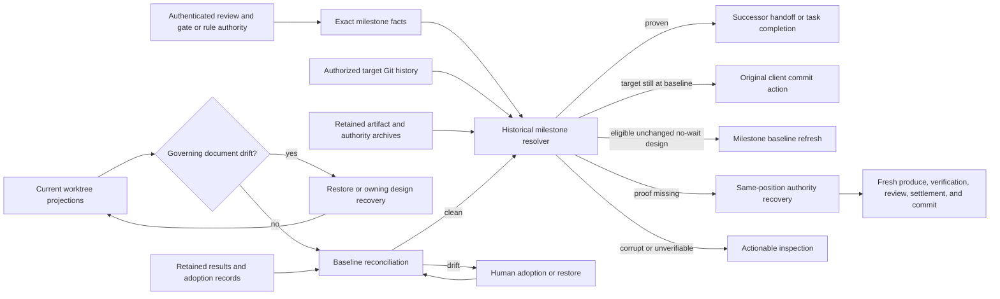

# Recoverable Free-Form Changes Between Phases — Technical Design

## Design outcome

ArchFlow will treat milestone completion and the current repository baseline as two independent facts:

1. **Historical milestone proof** establishes that the exact commit allowed by the reviewed subject and its human or rule authority was created as the first commit after the authorized baseline and remains on the authorized target's first-parent history.
2. **Current baseline reconciliation** establishes that every currently projected path still matches its newest retained or adopted generation, or that an applicable human adoption or restore has settled the exact drift. Governing planning documents are excluded from ordinary adoption when their changed bytes would be consumed by a dependent phase; they must be restored or receive fresh owning-document authority first.

A later commit never becomes the reviewed or authorized milestone. It may only retain the original milestone in history and, when it changes projected files, create a separate baseline decision. Status and the mutation that consumes a successor will re-derive both facts from authenticated state and Git.

When historical proof is missing, ArchFlow will not transfer the old authority to current `HEAD`. An eligible unchanged no-wait design keeps the existing bounded milestone-baseline refresh. Other cases with a representable committable delta receive a server-authenticated same-position recovery action that preserves repository bytes, invalidates the old active authority, and starts a fresh significant production and review cycle. A content-preserving rewrite with no possible commit subject receives an explicit safe inspection instead of an empty synthetic commit. Inspection also remains for corrupt, unreadable, or genuinely unverifiable authority and names the concrete recovery condition.

The implementation is one repository-ready increment. Commit proof, adoption settlement, recovery authority, semantic actions, tests, skills, and maintained documentation are one trust boundary: landing only part would either falsely advance a task or leave one of the promised choices as a dead end.

## Constraints and retained behavior

- Git stays client-owned. The server continues to return exact commit facts; it does not stage or commit files.
- The existing human and authenticated no-wait authority modes remain distinct. `requires_human_confirmation` retains its current meaning at the original implementation commit action.
- A milestone commit still has the exact authorized baseline as its first parent and must satisfy the existing message, path-set, tree, document, and recovery-authority checks.
- A commit made on another branch, a cherry-pick, squash, rebase, reset, or lookalike tree is not the authorized milestone unless it satisfies the original first-parent position on the authorized target.
- Adoption remains a human decision and is not counter-review, verification, commit authorization, or proof that bytes are committed.
- A later result that projects the same path still supersedes an older adoption through the existing newest-generation ordering.
- Review-subject or governing upstream-document drift routes to its owning production/review boundary whenever the changed bytes could govern dependent work, including after the old document milestone was committed. Baseline adoption must not rebind a retained review subject or turn an edited approved plan into successor authority.
- Task isolation, canonical state validation, digest binding, secret scanning, restore collision handling, and the no-code-before-approved-phase-design boundary do not change.
- Existing durable state and gate records remain readable. New fields are additive or use explicitly tolerant readers; writers emit only the new complete shapes.

## Current failure and affected boundaries

`src/state/implementation-manifest.ts` currently validates `HEAD` itself as the milestone. The human implementation, autonomous implementation, human design, migration design, and autonomous design observers all require the milestone to remain the current target tip. `src/state/status.ts` discards commit facts after target movement, while `src/state/next-action.ts` then has neither observed completion nor executable old commit facts and falls to inspection. The state mutation handler repeats the same tip-only observation, so changing the status projection alone would not fix advancement.

Baseline adoption already records only current path digests or absences in `TaskStateV1.baseline_adoptions`. It correctly clears reconciliation drift but does not and should not alter commit authority. The reported dead end appears after adoption because the separate commit observer still demands the old milestone at `HEAD`.

The same coupling affects:

- task-design milestone commit before phase 1 handoff;
- each phase-design milestone commit before its implementation handoff;
- an implementation milestone commit before the next phase handoff;
- the final implementation milestone before terminal completion; and
- any successor mutation whose race-closing status recomputation happens after a new descendant commit.

## System boundaries



The status order is deliberate: classify governing-document drift first, reconcile other current projections second, then resolve historical milestone proof. This preserves the existing human decision for changed implementation output without allowing adopted task-design or phase-design bytes to govern a dependent phase before review. A settled applicable adoption or restore can immediately expose the successor when the original milestone remains provable.

## Historical milestone proof

### One resolver, subject-specific validators

Refactor the tip-only observers behind one result shape shared by status and the state mutation handler:

```ts
type MilestoneProof =
  | { readonly kind: "proven"; readonly commit: GitOid; readonly target_ref: string; readonly target_head: GitOid }
  | { readonly kind: "not-created"; readonly target_ref: string; readonly target_head: GitOid }
  | { readonly kind: "missing-from-history"; readonly target_ref: string; readonly target_head: GitOid; readonly reason: MilestoneProofMiss }
  | { readonly kind: "unverifiable"; readonly reason: MilestoneProofIssue };
```

The resolver receives authenticated milestone facts, never caller-supplied guesses. It performs one race-closed observation:

1. Verify that the checked-out symbolic target matches the authorized `target_ref`, retaining the current explicit detached-`HEAD` semantics.
2. Resolve and pin the authorized target head.
3. If the target head equals the authorized baseline, return `not-created`; the existing commit action remains executable.
4. Require the baseline to be an ancestor of the pinned target. A command failure or missing object is `unverifiable`, not ordinary absence.
5. Read the first commit after the baseline on the target's first-parent history. That is the only possible milestone under the existing client commit contract. Do not scan other refs or search the object database for a similar commit.
6. Run the existing exact validator against that immutable candidate rather than `HEAD`.
7. Re-resolve the target and checked-out ref and repeat the ancestry relationship after all tree reads. Any movement makes the offer stale and status recomputes.

First-parent selection distinguishes the two important cases without heuristics:

- If the authorized commit was created first, later maintenance commits and merges retain it as the first child and proof succeeds.
- If the branch moved before the authorized commit was created, the first child is not the authorized milestone; proof is missing and stale commit facts are never replayed.

### Implementation validator

The implementation validator keeps every existing exact predicate:

- authorization baseline equals `ImplementationOutputV1.base_commit`;
- candidate first parent is that baseline;
- exact deterministic commit message;
- exact sorted changed-path set, including both rename endpoints;
- exact retained after-image mode and blob identity for additions, modifications, and rename destinations;
- exact absence for deletions and rename sources; and
- human gate or accepted no-wait settlement matches the exact implementation subject and survives all authority cutoffs.

It returns the candidate OID only as server-internal proof. Public responses continue to describe the original milestone and current baseline in plain language, not as Git object plumbing.

### Design and migration validator

The design validator also moves its checks from `HEAD` to the immutable candidate:

- exact first parent and message;
- changes confined to the task root;
- exact reviewed primary and additional document blobs;
- no unauthorized task document in the milestone;
- required `state.json` recovery authority;
- the exact archived request/decision pair for human design or migration authority; or
- a canonical candidate `state.json` that independently authenticates at its recorded revision, contains the exact accepted no-wait settlement for the reviewed subject, and resolves that settlement's required authority from the candidate tree.

Live task-root cleanliness and live approved-document equality apply while deciding whether the original commit action is currently executable. They do not form part of historical proof after the commit exists. Current document changes are governed by reconciliation and the existing owning-document re-entry rules.

The autonomous validator must not compare the candidate's `state.json` byte-for-byte with today's live state: a later baseline adoption or other valid append-only workflow record changes live state after the milestone. Instead it parses and validates the immutable candidate state in its own commit-tree view, proves the exact settlement and subject there, and checks that the corresponding settlement remains present and eligible in current authenticated state. This is the state-side equivalent of validating reviewed document blobs in the historical candidate while reconciling current blobs separately.

### No separate proof receipt

No new durable milestone-OID receipt is introduced. Before handoff, authenticated authority plus the immutable reachable commit re-derives proof; the handoff transaction repeats it. After handoff, the authenticated workflow position or terminal state is the durable completion fact. A separate receipt would create another observation boundary and would still fail when the descendant lands before that receipt is written.

Git author and committer metadata are not currently part of authorized commit facts. “Exact milestone” therefore retains the current semantic definition: exact authorized parent, message, path set, tree, subject, and recovery authority on the authorized target's first-parent history. Rewritten history that removes that position fails proof; ArchFlow does not claim an unknowable historical OID.

## Durable authority changes

### Persist no-wait target facts

Human gate contexts already persist `target_ref` and baseline. New no-wait settlements must persist the same target identity so a later status does not derive authority from whichever branch happens to be checked out.

Extend `RuleSettlementV1` with additive milestone facts for every `wait:false` design or implementation settlement:

```ts
readonly milestone_target_ref?: string;
readonly milestone_baseline_commit?: GitOid;
```

For implementation, the baseline must equal the retained output's `base_commit`. For design it retains its existing meaning. The settlement transaction captures target ref and resolved head at the clean fixed point. New writers emit both fields together for milestone-bearing no-wait settlements.

Old settlements remain readable. An old autonomous settlement without a durable target keeps the current exact-tip behavior while the tip is still recognizable. After movement it may use the already-supported unchanged-design baseline refresh when eligible; otherwise it enters fresh-authority recovery. The server never invents a historical target for old evidence.

### Same-position milestone recovery

Add an optional sorted `milestone_recovery_history` to `TaskStateV1`:

```ts
type MilestoneRecoveryRecord = {
  readonly recovery_id: PathSafeId;
  readonly phase_instance: PhaseInstanceId;
  readonly subject_digest: Sha256Digest;
  readonly reason: "milestone-proof-missing" | "governing-document-drift";
  readonly target_ref: string;
  readonly baseline_commit: GitOid;
  readonly observed_target_head: GitOid;
  readonly recovered_at_revision: SafeInteger;
  readonly superseded_results: readonly AuthoritativeResultRef[];
  readonly cleared_waivers: readonly WaiverRef[];
  readonly cleared_pending_human_revision?: PendingHumanRevision;
};
```

This is server-authenticated recovery evidence, not human provenance and not a human revision record. Its no-submission semantic action has two explicit entry causes: missing historical milestone proof, or current-owner governing-document drift that cannot be allowed to reach a dependent handoff. The common preconditions are:

- the current position owns the authenticated reviewed/settled subject;
- projection reconciliation is readable and its complete drift set has been classified by authority role;
- the original milestone target and baseline are readable;
- no gate is open and no other mutation is in progress; and
- the recovery offer is bound to the exact current state revision, repository identity, target ref/head, subject, and cause.

For `milestone-proof-missing`, ordinary projection reconciliation is clean, the target has advanced but the exact milestone is not provable there, the unchanged no-wait design refresh exception does not apply, and a server-built recovery-delta assessment proves that fresh production has a representable change to capture and commit from the current target. For `governing-document-drift`, the offer binds the complete current-owner governing drift set, those task-design or phase-design bytes differ from the retained reviewed subject, and they would otherwise be consumed by its successor; this cause is eligible whether the old milestone is `proven`, `not-created`, or missing. It is not conditioned on commit-proof failure. Applying either cause revalidates its own condition under the task lock.

Applying the action under the task lock revalidates the same target facts and then:

- stays in the same `phase_instance`;
- preserves all index and worktree bytes;
- enters `produce/running` at attempt 1 as a fresh significant cycle;
- moves active produce, counter-review, adjudication, and triage references for that phase into `superseded_results`;
- clears and records active waivers and any pending human revision;
- recomputes the production fingerprint; and
- appends exactly one replay-safe recovery record.

Approvals, decisions, settlements, and retained results remain immutable audit history. Generalize the restart cutoff helper so approval, settlement, and waiver eligibility use the newest applicable revision from either `restart_history` or `milestone_recovery_history`. This prevents byte-identical reproduction from silently reactivating authority whose commit proof was lost or whose governing bytes changed.

The recovery does not itself approve current bytes. Normal production, implementation verification, automatic counter-review, constitution review, rule settlement, human presentation when required, and commit handling run again. Parent documents are updated through their normal writable projections if the current repository reality changes architecture or requirements.

### Content-preserving rewritten history

A missing milestone after reset, squash, or rebase needs one additional classification before automatic implementation recovery. Compare the current target/worktree identities for the phase's exact retained output path set with the retained reviewed after-images and with the new target baseline. If the reviewed phase bytes are already wholly present in the rewritten target and no representable implementation delta remains, same-position recovery is not offered: its fresh produce would have no committable subject and could only lead to a synthetic empty commit.

Status instead returns actionable inspection that says the authorized milestone position was rewritten while its content is already present. It names the two safe remedies: restore a target ancestry that contains the exact authorized milestone, or explicitly reopen the owning planning boundary so the phase is reconsidered as new work under fresh authority. It never asks for state edits, calls the rewritten commit authorized, or offers an empty commit. A rewrite that leaves an actual representable delta may use `milestone-proof-missing` recovery normally. Git/object failures remain a distinct unverifiable inspection.

This exception is not the ordinary descendant path: a valid descendant always proves the original first-parent milestone and advances normally. It is the honest bounded behavior for history replacement that erased the authorized position while preserving its content, which the current commit contract cannot retroactively authorize.

### Autonomous unchanged-design exception

Keep `refresh-milestone-baseline` only for unchanged no-wait task design or phase design. It continues to require exact retained document bytes, a matching live configuration digest, clean reconciliation, and an authenticated settlement. Human-authorized design, implementation, changed documents, missing target identity, and replaced history use same-position recovery.

## Governing-document drift

Projection discovery must classify a changed `prd.md`, task `design.md`, or numbered phase `design.md` by authority role and successor consumption before composing an ordinary baseline-adoption subject. The rule is position-independent: at every action that could hand off to another skill, advance a phase, or complete the task, compute the authenticated governing documents the not-yet-consumed successor reads. If any of those live bytes differ from their retained approved subject, exclude them from baseline adoption even when a later implementation result is their newest projection owner.

This explicitly covers `phase-impl-N` after its milestone commit but before `phase-design-(N+1)`: implementation production may mechanically co-produce changed canonical task documents, but projection ownership does not turn `prd.md`, task `design.md`, or a governing phase design into adoptable implementation output. Their governing role wins.

- If a changed governing document is owned by the current task-design or phase-design position, status returns the same-position `recover-milestone-authority` action with cause `governing-document-drift`. This route is independent of whether the old milestone is already proven. Applying it preserves the edited bytes, invalidates the old document approval or settlement through the recovery cutoff, and runs fresh production, counter-review, constitution review, and any required human gate before the milestone can be committed and handed off again.
- If a changed governing document is owned by an earlier PRD, task-design, or phase-design position—including a co-produced document seen at an implementation pre-handoff boundary—the existing owning-upstream/material-drift presentation blocks the successor. Restoring the exact retained bytes preserves the current position; keeping the new plan requires the explicit human-owned backward restart to that document's owner. Dependent work cannot consume the new bytes until the owner completes fresh review and authority.
- If the user restores the exact retained approved bytes before recovery or backward restart, fresh status may prove the original milestone and continue normally; no new review is needed because the governing bytes again match the reviewed subject.
- Drift in ordinary source/test outputs, implementation notes that do not govern a successor, and other non-governing projections continues through baseline adoption/restore when representable.

This classification is unconditional at completion and handoff boundaries. It must not depend on the current phase kind, newest projection owner, or `assessment.next === "counter_review"`; the old document milestone being review-complete is precisely when the unsafe adoption path would otherwise appear. Mixed drift is processed in trust order: governing-document recovery, explicit backward restart, or restore first, then fresh status presents any remaining ordinary output drift. No single human choice can both replace a governing plan and adopt unrelated implementation bytes.

## Baseline adoption and restore

### Bind the decision to Git durability as well as bytes

After excluding governing documents that require owning authority, extend newly composed baseline-adoption context with:

- the exact `target_ref`;
- the target commit observed when the presentation was composed, as durable disclosure context rather than an equality lock;
- the complete sorted changed/deleted path set and existing recorded/observed digests; and
- a sorted `uncommitted_paths` set derived by comparing each live observed version or absence with the pinned target tree.

The target ref, complete path/digest set, and `uncommitted_paths` form the decision's semantic drift subject. The presented target commit is retained in the durable gate request for audit and for reconstructing what the user saw, but does not by itself make an otherwise identical decision stale. The presentation can therefore say whether a fresh clone contains the versions under consideration.

At settlement, pin the current target head and recompute the entire representable drift subject under the task lock rather than checking only the paths from the old request. Require the same target ref, complete drift/deletion set, observed digests, and committed/uncommitted classification. A byte change, new drifted path, branch switch, or history change that alters any of those relevant facts refuses the stale choice. An unrelated descendant commit that leaves the semantic drift subject identical does not ask the human the same question again; historical milestone proof is re-evaluated separately after the decision settles.

### Refresh a stale open decision without forging a human choice

A refused stale gate cannot remain the highest-priority open gate forever. Add a narrow server-owned no-submission stale-baseline refresh action. It:

- is offered only when an open `baseline-adoption` request no longer matches the recomputed live drift subject;
- records a small `GateSupersessionRecord` naming the old gate, server reason, and revision;
- removes only the stale open-gate reference and disposable interface projection;
- preserves the immutable request and any independently archived decision for audit; and
- lets fresh status compose a new baseline decision for current bytes and Git facts.

No cancellation, adoption, restoration, or human provenance is fabricated. If a decision was concurrently archived, normal exact replay/settlement wins or the supersession refuses and recomputes.

The audit fact is an optional sorted `gate_supersessions` entry on `TaskStateV1`, with only `gate_id`, `gate_kind: "baseline-adoption"`, `reason: "stale-subject"`, and `superseded_at_revision`. Durable semantics require the named request to exist, require its subject to differ from the server-recomputed live subject, and forbid a supersession from earning an approval or baseline-adoption record. The gate archive remains reconstructible even though its disposable presentation no longer blocks current status.

### Human-facing consequences

The gate renderer continues to enumerate only applicable choices and lists every practical changed or deleted path. Copy changes are semantic, not cosmetic:

- **Keep current versions** records the exact versions as the accepted current workflow baseline. It performs no counter-review and grants no commit authorization.
- If any listed path is uncommitted, the presentation states that a fresh clone recovers only the last committed repository and durable workflow boundary.
- **Restore recorded versions** rewrites only the listed paths from retained sources, preserves unrelated changes, and warns that uncommitted current versions may be lost.
- When fresh assurance is required because milestone proof is missing, status explains that current bytes will re-enter production, verification, and review; this is not presented as an adoption choice.
- When a governing document changed, status explains that ordinary adoption is unavailable because a successor would consume unreviewed plan bytes, and names restore versus owning-boundary review consequences.

Existing projection planning, file-kind handling, secret scanning, collision detection, rollback, and newest-generation overlay remain the writers. A later change after adoption creates a new drift digest and a new human decision.

## Semantic control flow

The internal next-action order becomes:

1. authenticate task state, retained results, approvals, settlements, and repository identity;
2. discover the complete current projection reconciliation result and classify authenticated governing-document owners;
3. route changed governing documents to exact restore, current-owner recovery, or the existing human-owned backward restart before any dependent handoff or ordinary adoption;
4. resolve or refresh an already-open stale baseline gate;
5. if other representable projection drift remains, open the exact adoption/restore presentation;
6. resolve historical milestone proof for a design or implementation completion position;
7. `proven` returns the ordinary successor handoff or final task completion;
8. `not-created` while target equals baseline returns the original exact commit action;
9. missing proof uses unchanged no-wait design refresh when eligible;
10. content-preserving replaced history with no committable recovery delta returns the explicit rewritten-history inspection and safe remedies;
11. other representable missing proof returns `recover-milestone-authority` with no submission;
12. only corrupt, unreadable, ambiguous, or otherwise unrepresentable authority returns inspection, with the failed fact and safe remedy.

Add `recover-milestone-authority` and `refresh-stale-baseline` to the internal action vocabulary and semantic workflow schema. Both are server-derived, no-submission actions bound by opaque offers. The owning design, phase-design, and phase-implementation skills apply only the returned offer, explain why fresh work is required, and then consume the fresh view. `archflow-status` reports the single server-derived owning skill when it does not own the mutation.

`composeAdvance` continues to recompute status. The state handler must use the shared `MilestoneProof` resolver inside its transaction boundary rather than reconstructing a second Boolean check. Transition input carries a server-internal proof capability or exact proven candidate, not an unauthenticated caller Boolean. Status and mutation must therefore agree on candidate selection and exact validation.

## Data and control flow examples

### Ordinary descendant after an implementation commit

1. Phase output is reviewed and authorized at baseline `B`.
2. Client creates exact milestone `M`, whose first parent is `B`.
3. Maintenance commit `D` advances the same target.
4. Reconciliation is clean because `D` did not touch projected output.
5. Historical resolver pins `D`, selects `M` as the first first-parent commit after `B`, and validates the original subject against `M`.
6. Status exposes the successor or final completion. It never calls `D` reviewed.

### Projected drift after the milestone

1. Exact milestone `M` exists; later commits advance to `D` and change projected paths.
2. Reconciliation opens a gate bound to the exact current drift and `D`.
3. Adoption records current digests, or restore rewrites the listed paths to retained versions.
4. Fresh status sees clean reconciliation and independently proves `M` in the target history.
5. The successor or final completion becomes usable without another Git commit.

### Movement before the milestone

1. Authority is bound at baseline `B`, but another commit `D` lands before the authorized commit.
2. The first-parent child after `B` fails the exact milestone validator.
3. No stale commit action is returned and `D` is not called the milestone.
4. An eligible unchanged no-wait design may refresh its mechanical baseline. Otherwise the server records same-position recovery and starts fresh production and review from preserved repository bytes.

## Interface and file impact

| Surface | Change |
|---|---|
| `src/state/implementation-manifest.ts` and Git helpers | Resolve the authorized first-parent child and validate immutable candidate trees; separate live pre-commit checks from historical proof. |
| `src/state/status.ts`, `src/state/next-action.ts` | Carry structured proof, preserve original commit facts only at the authorized baseline, order reconciliation before proof, and return supported recovery actions. |
| `src/mcp/handlers/state.ts`, `src/state/transitions.ts`, `src/state/request-composition.ts` | Recompute the same proof at mutation; implement replay-safe same-position recovery and stale-gate refresh. |
| `src/contracts/durable-state.ts` and schemas | Add no-wait target facts and milestone recovery history; update exact semantic validation and authority cutoffs. |
| Gate contracts, fingerprints, renderer, and schemas | Persist presented target context, bind the recomputed path/digest/committedness subject, render honest adoption/restore consequences, and record stale-gate supersession. |
| Semantic contracts and skills | Add the two no-submission actions and teach owning skills to follow only the returned action. |
| Maintained docs | Explain historical proof, current baseline, adoption limits, fresh-authority recovery, stale decisions, and all completion boundaries. |

## Requirement mapping

| Requirement | Design coverage |
|---|---|
| R1 | First-parent historical resolver proves the original exact milestone under human or rule authority after ordinary descendants at every document and implementation boundary. |
| R2 | Existing newest-generation reconciliation remains independent for applicable non-governing outputs; governing documents instead restore or re-enter their owning reviewed boundary. Exact drift context, repeated drift, and later-result supersession are retained. |
| R3 | Reconciliation settles first; successful historical proof then returns successor/final actions and never replays stale commit facts. |
| R4 | Target-at-baseline preserves the original commit action; eligible unchanged no-wait design refreshes; representable missing-proof cases use authenticated same-position fresh authority; content-preserving rewrites with no committable delta and corrupt/unverifiable authority return explicit actionable inspection rather than false completion or a synthetic commit. |
| R5 | No descendant or synthetic commit is required after valid historical proof. Adoption binds committedness, preserves unrelated changes, and discloses the fresh-clone limit for worktree-only bytes. |
| R6 | Presentation lists practical paths and truthful consequences; exact bytes, full drift set, target identity, and committedness are revalidated; unrelated descendants with an identical decision subject do not reprompt, while genuinely stale gates refresh without an invented choice. |
| R7 | The same resolver feeds task design, phase design, non-final implementation, and final completion. Governing-document drift cannot authorize a dependent handoff; after advancement, non-governing reconciliation preserves the active position while changed governing upstreams require explicit owning-boundary treatment. |
| R8 | The implementation phase updates all maintained pages whose lifecycle, state, semantic, review, or trust-boundary descriptions change. |

## Risks and mitigations

- **Retroactive over-authorization.** Selecting an arbitrary matching commit could bless a later descendant. Selection is limited to the first first-parent child of the exact baseline, and validation uses the original subject and authority.
- **Adopted plan bypasses review.** Governing-document consumption is classified before baseline adoption at every handoff regardless of current phase or projection owner; edited plans restore or re-enter their owning authority and cannot expose dependent implementation.
- **Wrong target or rewritten history.** Target ref is durable for every new authority mode and candidate ancestry is checked twice. Rewrites with a committable delta enter recovery; content-preserving rewrites without one return an explicit safe inspection and never an empty commit.
- **Status/mutation disagreement.** Both use one structured resolver; successor composition and the state transaction re-run it against fresh repository facts.
- **Reusing stale authority after recovery.** Recovery creates a same-position eligibility cutoff consumed by approvals, settlements, and waivers; byte-identical new production cannot revive old authority.
- **Stale human decision loop.** Recomputed target identity, drift, and committedness reject materially stale choices, while an unrelated descendant with identical facts settles normally. Server-owned supersession removes only a genuinely stale disposable interface and exposes a fresh decision.
- **Misleading adoption.** Durable committedness facts drive copy that explicitly separates acceptance, review, commit authorization, and clone durability.
- **Restore data loss.** Existing exact-source validation, collision planning, rollback, and unrelated-path preservation remain authoritative; copy warns about uncommitted versions.
- **Large or unusual Git history.** First-parent traversal is bounded by the authorized baseline-to-target range and uses the existing Git runner limits. Missing objects and command failures are unverifiable, never absence.
- **Schema compatibility.** New target and history fields are additive; old records use bounded compatibility behavior. Contract agreement and durable-semantics tests cover both reader and writer shapes.
- **Excess machinery.** No generalized Git-history service, CLI repair command, migration subsystem, or proof receipt is added. The two new durable records exist only to preserve authority cutoffs and recover stale human interfaces.

## Verification strategy

Use focused unit and real-Git checks first, then semantic journeys that exercise the returned actions rather than merely asserting the absence of inspection.

### Focused proof and contract coverage

- Update `test/integration/implementation-output-builder.test.ts` so a valid first-parent milestone remains proven after unrelated descendants and later merges.
- Retain negatives for wrong message, path set, parent, target, retained tree, design recovery authority, unauthorized task documents, and concurrent ref movement.
- Add negatives for movement before commit, candidate absent from the authorized target, reset/rebase/squash/cherry-pick, branch replacement, and missing Git objects. A content-preserving squash/rebase must return the explicit rewritten-history inspection and never offer recovery or an empty commit.
- Extend state, next-action, semantic-view, semantic-action, fingerprint, gate-interface, durable schema, and contract-agreement tests for structured proof, recovery cutoffs, position-independent governing-document consumption, target-context baseline requests, uncommitted disclosure, semantic-subject settlement, and stale-gate refresh.
- Preserve file-kind, rename, deletion, collision, secret, and rollback coverage in the existing restore suites rather than duplicating their matrix.

### Representative semantic journeys

1. Human task-design and phase-design milestones each receive unrelated descendants before handoff and still expose the exact successor.
2. No-wait task-design and phase-design milestones do the same; pre-commit movement retains only the bounded unchanged-design refresh.
3. Human and no-wait task-design and phase-design milestones each receive an edit to their governing document after commit but before handoff. No dependent successor is available; restoring exact bytes resumes, while keeping current bytes runs fresh owning review and authority first.
4. A human-authorized non-final implementation milestone receives an unrelated descendant and advances without a gate or inspection.
5. A no-wait final implementation milestone receives an unrelated descendant and completes without invented human confirmation.
6. The reported multi-commit performance journey changes multiple projected files, adds a later workflow-record commit, adopts current versions, and reaches Phase 2 without a synthetic commit or state edit. A variant changes a governing task document co-produced by Phase 1 and proves that the Phase 2 handoff is blocked for restore or explicit owning-boundary review. A second ordinary worktree-only drift opens a fresh gate and discloses clone durability.
7. A no-wait final implementation with projected drift restores retained versions and completes.
8. Byte or relevant target-history changes after gate presentation refuse the old decision, refresh the stale interface, present current facts, and then reach a usable successor. An unrelated descendant that preserves the exact path/digest/committedness subject settles the original choice without reprompting.
9. Missing implementation proof with a representable delta enters same-position recovery and completes through fresh production, verification, review, authority, and commit. A content-preserving rewrite instead returns the actionable no-synthetic-commit inspection. The design variant proves unchanged no-wait refresh versus changed/config-mismatched fresh recovery.

Within the reported journey, after consuming the Phase 2 handoff, change a Phase 1 output while later work is active, resolve reconciliation, and assert the Phase 2 position and pending action remain unchanged. Use unrelated index/worktree sentinels around adoption and restore to prove their scope does not expand.

Implementation verification should run the narrow unit and integration files while iterating, then `npm run typecheck`, `npm run check:schemas` for persisted/public contract changes, `npm run check`, and `npm run check:deep` because state, gate, and transaction lifecycle shapes change. No real-host test or new CLI command is needed.

## Maintained documentation and skill updates

Update these caps-named pages in the same implementation change:

- `docs/OVERVIEW.md` — original milestone proof versus accepted current baseline;
- `docs/workflow/LIFECYCLE.md` — before-commit movement, ordinary descendants, drift, all handoff/final boundaries, and fresh-authority recovery;
- `docs/state/DURABLE-STATE.md` — historical proof derivation, adoption records, recovery cutoff, stale-gate supersession, and uncommitted durability;
- `docs/mcp/SERVER.md` — semantic actions, race-closing recomputation, and both authority modes;
- `docs/review/COUNTER-REVIEW.md` — adoption is not review; missing proof fresh recovery is;
- `docs/contracts/CONTRACTS.md` — additive state, gate, digest, semantic action, and compatibility shapes; and
- `docs/TESTING.md` — the descendant, drift, stale-decision, and missing-proof verification matrix.

Update `skills/archflow-design/SKILL.md`, `skills/archflow-phase-design/SKILL.md`, `skills/archflow-phase-impl/SKILL.md`, and `skills/archflow-status/SKILL.md` only as needed to follow the two returned no-submission actions and explain their consequences. The server remains the sole action selector; skills never infer recovery from Git evidence or choose a human baseline decision.

## Phase sizing

The split check considered separate phases for historical Git proof, baseline-gate hardening, and fresh-authority recovery. Those pieces cannot be delivered safely on their own: descendant proof without stale-decision and recovery handling leaves required states unusable, while recovery or adoption changes without the exact proof resolver can either loop or authorize the wrong commit. Their meaningful verification is the same end-to-end handoff and final-completion journey.

The merge check considered separate contract, implementation, test, documentation, and skill phases. Each is scaffolding or assurance for the same behavior and has no stable user capability alone. Keeping them separate would create intermediate repository states where published schemas, semantic actions, clients, and durable state disagree.

One phase is therefore the fewest coherent plan. It is broad across layers because the authority boundary is atomic and its verification is inseparable, not because of file count or estimated diff size.

### Phase 1: Descendant-Aware Milestone Recovery

**Outcome.** Normal committed or uncommitted repository work can occur around every task-design, phase-design, implementation, and final-completion boundary. Exact authorized milestones remain provable through ordinary descendants; changed projected files settle through an honest, race-safe adoption, restore, or governing-document review; representable missing proof enters fresh authority; and content-preserving rewritten history receives an explicit safe recovery explanation without manual state edits or synthetic commits.

**Stable inputs and predecessors.** The approved PRD; existing exact human and no-wait authority; retained document and implementation results; baseline-adoption and projection-restore machinery; canonical state and gate transactions; semantic status/apply offers; and the repository's Git runner.

**Implementation scope.** Add the shared historical resolver and immutable candidate validators; persist new no-wait target facts; classify governing-document ownership before adoption; add same-position milestone recovery and authority cutoffs; bind applicable baseline decisions to exact target and durability facts; add stale-gate supersession; update semantic actions and owning skills; update affected maintained documentation; and implement the focused and representative verification above.

**Repository-ready completion state.** All public and durable schemas agree with their TypeScript mirrors; existing records remain readable; status and mutation use the same proof; every offered adoption, restore, refresh, recovery, successor, and completion action is executable and replay-safe; no unrelated task or worktree data is modified; maintained documentation describes the shipped behavior; and the full proportional test suite passes.

**Verification story.** Contract/unit tests prove exact shapes and routing, real-Git tests prove candidate selection and failure boundaries, and representative semantic journeys prove the complete user-visible paths—including governing-document edits—across both authority modes and every completion boundary. Final validation includes schema agreement, type checking, ordinary checks, and deep transaction/state checks.
