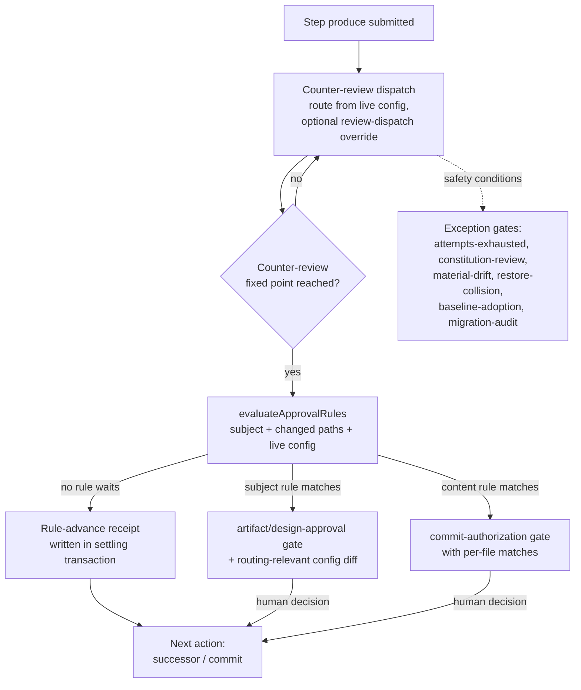

# Design — review-flexibility

**Status:** draft for review
**Date:** 2026-08-19
**Research basis:** `.archflow/tasks/review-flexibility/research/` (four exploration reports with file:line references; written 2026-08-19 against the current tree)

## Purpose and scope

Make ArchFlow's review machinery flexible enough to run as an automated pipeline with human attention spent only where deliberately targeted. Three changes, per the approved PRD:

1. Task config becomes an ordinary editable input with field-level change reporting (replaces byte-pinning).
2. The existing server-side per-dispatch reviewer route override becomes reachable through the semantic workflow tools; the config-level per-phase-kind `overrides` section ships in the template and is documented in the skills.
3. Built-in human approval gates (artifact-approval, design-approval, commit-authorization) are replaced by per-project declarative trigger rules (subject triggers + file-path content triggers); counter-review before step completion stays machine-enforced; safety/exception gates are untouched.

Out of scope (PRD non-goals): semantic diff analysis, multi-user/adversarial defenses, migration tooling beyond what exists, trigger languages beyond the two declared kinds.

## System boundaries

**Changes:**

- Config lifecycle: live config bytes stop being validated against a pinned digest; a last-seen snapshot in task state drives change notices.
- Fingerprint subject: `config_digest` leaves the `InputFingerprintSubject` composition; creation-time provenance uses remain.
- Semantic apply path: one new submission kind (`review-dispatch`) carrying a route override into the `review` action.
- Gate model: the three approval gate kinds become conditionally opened by rule evaluation; a new durable rule-advance record covers steps that proceed without a human gate; the commit boundary is ungated by default.
- Config schema: new `approval_rules` section; template ships it plus `overrides`.
- Constitution of this repository: `explicit-human-authority` and `approved-design-before-code` narrow to version 2; CLAUDE.md/AGENTS.md hard rules and skill prose follow.
- Maintained docs set: all affected caps-named pages.

**Explicitly unchanged:**

- Counter-review fixed point (`src/review/fixed-point.ts`): counter-review always runs before a step completes, regardless of any rule. No rule kind can skip it. (Its upstream-approval and adjudication acceptance points change per D6/D7; the review-dispatch fixed point itself does not.)
- Exception/safety gate kinds: attempts-exhausted, constitution-review (+waiver arm), material-drift, constitution-edit, restore-collision, baseline-adoption, migration-audit. These never become rule-conditional.
- Constitution policy-base pinning mechanics (`src/state/constitution.ts`): trigger rules live in config, not constitution files.
- Task isolation, canonical JSON/digest machinery, dispatch sandbox, repo views, request-digest authentication of submissions.
- Route override request-digest binding (already request-scoped, not fingerprint-scoped).

## Design decisions

### D1 — Config digest splits into provenance-only; live comparison dies

`config_digest` (sha256 over config bytes, `computePinnedConfigDigest`, `src/contracts/fingerprints.ts:388`) stays in its creation-time provenance roles: `TaskInitializationV1`/`LegacyImportInitializationV1`/`TaskStateV1.config_digest` agreement (`src/contracts/durable.ts:713`) and legacy-import staging (D15). The six live-bytes fail-closed comparisons (`PINNED_CONFIG_MISMATCH`) are deleted:

1. `src/state/fingerprint.ts:79-87` (internal resolver)
2. `src/state/transaction.ts:412-417` (kernel pre-preparation)
3. `src/state/initialization.ts:258-263`
4. `src/state/gates.ts:137` (`validateLiveGateState`)
5. `src/mcp/handlers/session.ts:56-61` (handler session open)
6. `src/local/call-envelope.ts:88-93`

Unparseable config bytes remain fail-closed (`CONFIG_INVALID`) — a broken YAML must never be silently used. The `pinned-config-schema-unsupported` → `upgrade-tooling` branch (`src/state/status.ts:746-751`) is removed; a config whose schema the tooling can't parse is just `config-invalid`. The `restore-pinned-config` next action (`src/state/next-action.ts:270-275`, rendered `src/state/semantic-view.ts:246`) and its error vocabulary (`src/contracts/errors.ts`) are removed.

### D2 — Fingerprint subject drops `config_digest`, with a bounded legacy fallback

`InputFingerprintSubject` (`src/contracts/fingerprints.ts:24-37`) loses `config_digest`. This changes every computed fingerprint, which would strand in-flight tasks at each check (persisted `state.input_fingerprint` D13 check `src/contracts/durable.ts:748-758`, gate checks, evidence manifest and chain comparisons, fixed-point binding). Rather than a migration subsystem (prototype priority: no migration machinery), the internal resolver (`src/state/fingerprint.ts`) gains one bounded fallback: when a recompute under the new composition does not match a recorded/expected value, recompute once under the legacy composition — using the recorded creation-time `state.config_digest`, never live config bytes — and accept on match. Every legacy fingerprint was recorded while pinning enforced live == pinned, so the recording-time digest is exactly the retained creation-time one; using it means a post-cutover config edit cannot invalidate legacy-recorded fingerprints (R1). Rules:

- The fallback only retries and accepts; it never rewrites recorded values. Comparing sites — the kernel, the local envelope, the gate-reentry *replay validations*, and the PRD planning-restart landing (whose next state commits through the kernel's equality pin) — keep recording the accepted, possibly legacy value, since the committed state must equal the fingerprint the request claimed; the composition flips to the new one only at no-expected write sites (revision zero, the material-drift restart landing, and gate-reentry landings, whose recomputation can never equal the pre-reentry recorded value because the reentry call's step and rubric digest differ), so legacy tasks converge at those sites rather than on every transaction.
- **Resolver contract change:** the internal resolver (`createInternalInputFingerprintResolver`, `src/state/fingerprint.ts`) currently returns an `InputFingerprintSubject` and each caller computes and compares the digest itself (`liveIdentification` in `src/state/transaction.ts`, gate and evidence checks, the kernel recompute) — so the fallback requires the resolver to return the **accepted fingerprint value** (new composition, or legacy composition when that is what matches) alongside the subject, and comparison sites compare the returned accepted value instead of recomputing. The local call-envelope path (`fingerprintFor`, `src/local/call-envelope.ts`) has no expected digest available at all; it returns whichever composition matches the state's recorded `input_fingerprint`, extending its existing short-circuit to `state.input_fingerprint` for gate/waiver calls. With the seam specified this way, all downstream validation inherits the fallback from one resolver call.
- It covers the self-application case: this task's own recorded evidence (computed with config in the subject) keeps validating after the cutover phase, even if this task later edits its own config (Phase 5 does exactly that).
- If neither composition matches, the mismatch is real and fails closed as today.

In-flight tasks on other branches/checkouts: acceptable breakage per the PRD non-goal, documented in LIMITATIONS; `archflow-upgrade` remains the adoption path.

### D3 — Change reporting: last-seen snapshot in state, leaf diff in status

`TaskStateV1` gains optional `last_seen_config`: the parsed plain-JSON config snapshot most recently observed by a state transaction (precedent for optional state fields: `baseline_adoptions`, `src/contracts/durable-state.ts:298`). It must live in state.json because status reads state.json alone (REQ-14/21).

- **Update point:** the state transaction kernel (which already reads config at `src/state/transaction.ts:412`, currently for the pin check) records the current parsed snapshot whenever it differs. Status stays read-only.
- **Notice computation:** `computeTaskStatusDetailedInternal` already reads and parses live config (`src/state/status.ts:742-770`); it diffs live parsed config against `last_seen_config` with a small recursive leaf diff (new module `src/state/config-change.ts`; no existing generic diff util — `deriveImplementationDiffDigest` is the only neighbor). Diff is over the parsed structure, not bytes, so YAML comment/reorder edits produce no notice. The parser's retired-`producer` role normalization is applied before diffing so a cosmetic retire doesn't report as a change.
- **Status surface:** a `config_change` notice in the status value projected by `src/state/semantic-view.ts`: field-level old → new entries. Informational only; no step blocks.
- **Gate presentations:** at gate composition, the routing-relevant diff since the last state transaction (live config vs `last_seen_config`) is embedded in the gate context and rendered in the presentation. Routing-relevant fields: `roles`, `overrides`, `max_attempts`, `approval_rules`. Precedent for routing info in gate correspondence: `counter_review_provenance.route_override` (`src/state/status.ts:1119-1124`).
- **Durable record of what ran** stays the per-dispatch route provenance on evidence; notices supplement, never replace (PRD assumption).

### D4 — Route override rides a new `review-dispatch` submission kind

The server already accepts `RouteOverrideDeclaration` (`{reason, "counter-reviewer"?: route, adjudicator?: route}`, `src/contracts/mcp-tools.ts:74-81`) and `composeCounterReview` already accepts `facts.route_override` (`src/state/request-composition.ts:481-509`); dispatch children fire on the semantic `review` action's `review-run` substep (`src/state/semantic-actions.ts:345-350`), whose composition facts currently omit it. The gap is only submission → facts.

- New submission kind `review-dispatch` with one required field `route_override: RouteOverrideDeclaration`, accepted by the `review` action. The dispatching review offer advertises `expected_submission: "review-dispatch"` (`src/state/semantic-view.ts:182-187`; non-dispatching review shapes keep `"none"`), and `assertSubmissionMatches` tolerates an absent submission for exactly that kind — advertising `"none"` while relaxing the matcher would keep the override unreachable to clients that follow the advertised interface (phase-2 refinement of the original sketch; a required field because an override-less apply uses no submission and the declaration already rejects emptiness). Because `substepPlan` continuations call `requestFacts` without the submission (`src/state/semantic-actions.ts:601`), the declaration rides the plan (`decision_submission` precedent) into the `review-run` facts. An override is request-scoped: one lost to a crash between review-enter and review-run does not survive — the resumed dispatch runs under the configured route and the client re-requests it on the re-offered review action.
- `requestFacts`'s review case threads the declaration into the `review-run` facts. Because it arrives as a submission, `operationKey`'s `submission_digest` (`src/state/semantic-actions.ts:120-141`) binds it into the authenticated operation identity for free, and replay continuation matches automatically.
- Validation is unchanged: the composed input passes `counterReviewInputSchema` (`src/mcp/handlers/semantic.ts:195-201`), zod arm `routeOverrideSchema` (`src/contracts/mcp-tools.ts:181-197`) requires a non-empty reason and at least one role, and `routeFromConfiguredRoute` (`src/dispatch/routing.ts:57-80`) holds the substitute to configured-route rules. Evidence records (`RouteOverrideRecord`, `src/contracts/review.ts:144-150`) and rendering (`renderRouteOverride`, `src/contracts/renderers.ts:39-59`) already exist.
- MCP root-schema convention is safe: the union stays nested under `action.submission` (`src/contracts/semantic-workflow.ts:311-312`); the arm's route schema is a parentless semantic-workflow-local `$def` (clone pattern; the shared instance is `config#/$defs/route`, an unresolvable cross-document `$ref` in the advertised catalogue); regenerate `src/contracts/schemas/v1/semantic-workflow.schema.json` via `npm run generate:schemas`.
- No dedicated pre-approval gate for an override (PRD assumption): the human reason is required by validation, relayed by the client, recorded on evidence, and surfaced at the next gate or report.

Rejected alternatives: an `action.route_override` sibling (must be manually added to the operation digest — worse binding for more API surface), and piggybacking on `work-result` (wrong timing: dispatch happens on the next apply, so the override would have to be remembered across actions).

### D5 — Approval rules: two kinds, in config, evaluated by one pure helper

New config section (schema in `src/contracts/config.ts`; shipped in `assets/config.template.yaml`):

```yaml
approval_rules:
  subjects: [prd, design]          # subset of: prd | design | phase-design | phase-impl
  content:
    - paths: ["**/*.sql"]          # list of glob patterns; rule fires when any changed path matches
```

- **Subjects** are workflow subjects (prd, design, phase-design, phase-impl). A subject trigger means: after that subject's counter-review completes, stop for a human decision on the presented result.
- **Subject-to-gate-kind mapping (explicit):** `prd` opens artifact-approval; `design` and `phase-design` open design-approval (its approval arm — see D7 for the unconditional policy arm); `phase-impl` opens commit-authorization at the commit boundary, and a phase-impl subject trigger forces that gate for the phase regardless of content rules. There is no separate post-review approval gate kind for phase-impl — its approval vehicle is the commit boundary. This mapping is what makes the D9 self-application switchover mechanical rather than assumed.
- **Content triggers** match the file paths a change touches. For phase-impl these are the per-file paths in the retained `ImplementationOutputV1.outputs` (path, operation, before/after blob oids/modes/sizes — `src/state/implementation-manifest.ts`), recorded at produce time; no new git readers. Artifact subjects (prd, design, phase-design) touch fixed single document paths (`src/state/phase-documents.ts:104-150`), so content triggers degenerate to subject triggers there and are evaluated as such (a `**/*.md` rule does not fire on the design doc by accident of extension — content rules apply to phase-impl changes only; documented).
- **Evaluation** is one pure helper, new module `src/state/approval-rules.ts`: `evaluateApprovalRules(config, subject, changedPaths) → {wait, matches}`, where `matches` carries the matched subject (if any) and, per matched content rule, every matching file with its operation and size delta. Glob matching: a small self-contained matcher supporting `**`, `*`, `?` over `/`-separated segments (no new dependency; exact semantics documented and tested). Mid-project rule edits are covered by D3 change reporting — a rule change is a config change, surfaced like any other, and never blocks.
- **Single evaluation point:** `computeTaskStatusDetailedInternal` (`src/state/status.ts:706-1287`) already assembles subject kind, digests, retained produce outputs, evidence, and approvals. The three sites that must agree — next-action (`src/state/next-action.ts` `advanceAction`/`deriveNextAction`), `composeGate` (`src/state/request-composition.ts:547-552`), and `planStateTransition` (`src/state/transitions.ts:460-473`) — all call the same helper on the same assembled context, and the existing disagreement guard (`src/state/request-composition.ts:595-618`) is extended to cover rule-derived conclusions.
- **Rules live in config, not constitution** (PRD R5): the constitution's immutable policy-base pinning stays as-is for its rule kinds, so trigger-rule changes can't reproduce the lock-in this task removes.

### D6 — Steps that pass without a human leave a rule-advance receipt

Removing approval gates breaks machinery that requires approved upstreams. There are six hard approval preconditions in the tree, and the receipt must satisfy all of them: `currentApprovedUpstreams` (`src/state/status.ts:481`), `requireApprovedUpstreamDigests` (`src/review/fixed-point.ts:586`), `planned_final_phase` derivation (`src/state/planned-final-phase.ts:50`), `deriveApprovedUpstreams` (`src/mcp/handlers/counter-review.ts:124-203`, its own approval scan fails `upstream-approval-missing` at :172-192), `assembleUpstreamContext` (`src/review/pinned-context.ts:263-267`, same failure), and `loadProduceUpstreamSubject`'s owner filter (`src/state/produce-subject.ts:110-142`) — the last is the shared loader behind status/composeGate/material-drift, so fixing only the first three would leave the loader itself refusing unapproved upstreams. Introduce a durable **rule-advance receipt** (`RuleAdvanceV1`, new contract in `src/contracts/`): per autonomously advanced step it records the task, the subject digest, the evaluated rule outcome (matched rule or "no rule matched"), and the config digest at evaluation (informational). Written in the same state transaction that settles the step. All six acceptance points treat approval *or* rule-advance receipt as satisfying the upstream requirement; `planned_final_phase` derives from design approval or design rule-advance. The receipt is honest bookkeeping, not approval — `explicit-human-authority` v2 wording reflects that (D9).

**Design milestone commit authority on the rule-advance path:** today `designCommit` facts (baseline, message, target ref, authorized document paths) derive exclusively from an authenticated design-approval or migration-audit gate context (`src/state/status.ts:942-991`), and `advanceAction` routes to `inspect-state` when they are absent. Under the shipped default ruleset `phase-design` never opens design-approval, so the rule-advance path must compose the same commit facts from the rule-advance receipt plus the retained produce manifest (document paths, base commit) — same shape, mechanically derived, recorded on the receipt — and `advanceAction` accepts that derivation as design commit authority.

### D7 — Approval gate kinds become triggered; presentations enumerate matches

The gate kinds artifact-approval, design-approval, and commit-authorization survive (kinds, parsers, resolution paths, archived-gate tolerance), but `composeGate` opens them only when `evaluateApprovalRules` says wait. Everything still funnels through `openDurableGate` (`src/state/gates.ts:163`, sole call site `src/mcp/handlers/semantic.ts:108-169`).

**The design-approval gate carries two roles, and only one becomes rule-conditional.** On design/phase-design subjects this gate is also the sole vehicle that discharges the constitution-review adjudication gate: `adjudicationGateSatisfied` (`src/review/fixed-point.ts`) treats an authenticated design-approval approve — or migration-audit accept — as satisfying it, the next-action `adjudication-gate` branch opens design-approval (not a separate gate) with the policy findings and eligible waivers folded into its context (`src/state/status.ts:669-703`), and `composeGate` composes the design-approval arm ahead of the pending constitution arm (`src/state/request-composition.ts:680-691`). That **policy arm is a safety path exempt from triggers** (R4): unsatisfied policy findings, a failing or uncertain constitution rule, or eligible waivers open the gate regardless of any subject rule. `resolveAdjudicationGateStep` keeps returning `adjudication-gate` whenever policy findings exist; only the policy-clean path consults `evaluateApprovalRules` — clean adjudication plus no matching subject rule advances by rule with a D6 receipt. Neither deadlock (fixed point demanding a gate nothing opens) nor silent safety-gate removal is possible.

- When a **content trigger** fires, the presentation names every matching file path, its operation (add/modify/delete/rename), and a concise per-file summary (operation + size delta, from `ImplementationOutputV1.outputs`) — enough for the human to go read the right files (PRD R7). Rendered via the gate decision interface (`src/state/gate-decision-interface.ts:267`; `details` precedent for path lists at :291-304). Per the interface hard rule, the template enumerates every decision shape the resolver accepts for these gates, unchanged from today's resolvers (`src/contracts/durable-gate.ts:229-235`): artifact-approval `[approve, revise, reject, cancel]`, design-approval `[approve, revise, reject, waiver-requested, cancel]` (the waiver arm and the cancellation escape path stay visible), commit-authorization `[authorize-commit, revise, abort, cancel]`. Resolution paths and archived-gate parsers are not narrowed.
- When a **subject trigger** fires, the presentation is today's artifact/design approval presentation, plus the D3 routing-relevant config diff since the last transaction.
- In-flight tasks with approval gates already open keep resolving across the switchover (archived/tolerant gate parsers unchanged).

### D8 — The commit boundary is ungated by default

With no matching rule, the phase-impl flow proceeds from completed review straight to the `commit` next action (`src/state/next-action.ts:199`, rendered `src/state/semantic-view.ts:286-299`); commit facts derivation and the commit proof cycle are unchanged. When a content rule matches the phase's changed paths, commit-authorization opens as a triggered gate with the D7 presentation and the commit proceeds after the human decision. `buildCommitAuthorizationInput` (`src/state/status.ts:631`) loses its unconditional-call site and gains the rule-driven one. Design/phase-design milestone commits use the D6 rule-advance derivation instead of a gate context; their commit proof cycle is likewise unchanged.

### D9 — Constitution amendment for this repository

Per the amendment procedure (`skills/archflow-constitution`, `validateConstitutionEvolution` `src/contracts/constitution.ts:64-75`: keep IDs, bump versions), in `.archflow/constitution/00-process.md`:

- `explicit-human-authority` → v2: required human decisions are explicit and bound to the exact subject *at gates that a rule or safety condition opened*; silence/elapsed time/agent prose/model verdict never supplies approval; commits are not human-gated by default. Trigger narrowed from "advancement, approval, review-gate, waiver, or commit authority is inferred" to inferred authority *over a gate that opened*.
- `approved-design-before-code` → v2: implementation starts from a phase design that either passed its triggered human gate or advanced by rule with counter-review complete; truthfulness requirements unchanged.

The `assets/constitution/` seed (`00-process.md`) changes in lockstep; `test/unit/constitution.test.ts` pins the four-ID registry (IDs unchanged, so text edits pass). CLAUDE.md hard-rules section and AGENTS.md (byte-identical, enforced by `test/contracts/skill-contract-canonical.test.ts:367-370`) update in the same change: the "never commit without explicit user approval" hard rule becomes "never skip a gate a rule or safety condition opened; never bypass a triggered human decision". The amendment lands after the rule engine works (Phase 5), so the narrowed text never describes machinery that doesn't exist yet.

**Self-application switchover (explicit):** once Phase 3 lands, gate opening is decided solely by `evaluateApprovalRules` over live config — this task's pinned v1 constitution text does not keep its own gates open (constitution rules are review content, `src/mcp/handlers/counter-review.ts:347-352`; gate opening is a per-kind code path, `src/state/request-composition.ts:547-552`). To honor the v1 rule this task was created under, Phase 3's cutover adds `subjects: [prd, design, phase-design, phase-impl]` to *this task's own* config.yaml, so its remaining phases keep explicit human gates until the task completes. That edit is itself an R1/R2 config change — reported per D3, harmless to legacy evidence under the D2 recorded-digest fallback — and it is recorded in Phase 3's implementation notes. Future tasks get the narrowed defaults from the template.

### D10 — Default ruleset and template surface

`assets/config.template.yaml` ships:

```yaml
overrides:
  # per-phase-kind reviewer route overrides (schema: contracts/config.ts configOverridesSchema)
  # phase-design: {counter-reviewer: {model: ..., effort: ...}}
approval_rules:
  subjects: [prd, design]
  content:
    - paths: ["**/*.sql"]
```

The `overrides` block is commented guidance (schema already accepts it, `src/contracts/config.ts:27-33`); `approval_rules` is active defaults per PRD R6. Check the legacy-upgrade template byte-compare (`src/init/legacy-upgrade.ts:476-483`) when editing the template. Skills document both: config routing/overrides guidance in archflow-init, outage procedure (ask the human for a substitution + reason → submit `review-dispatch` with the override on the review offer) in the four reviewing skills, config-change notice handling in archflow-status.

## Data and control flow (post-change step completion)



Config edits enter at any point: next transaction/dispatch reads live config; status shows the leaf diff vs `last_seen_config`; nothing invalidates.

## Requirement mapping

| Req | Design | Phase |
|-----|--------|-------|
| R1 free config editing | D1, D2 | 1 |
| R2 change reporting | D3 | 1 |
| R3 route override via semantic API | D4, D10 | 2 |
| R4 targeted approval gates | D5–D8 | 3, 4 |
| R5 rule kinds and location | D5 | 3 |
| R6 default ruleset | D10 | 3 (template), 5 (constitution) |
| R7 content-trigger presentation | D7 | 4 |
| R8 constitution amendment | D9 | 5 |
| R9 documentation | all pages per research inventory | 6 |

PRD clarification added in the same production result (Assumptions): the task's own `config.yaml` remains the evaluated surface for that task (copied from repo config at creation); repo-level edits seed new tasks, and mid-task changes are made on the task copy where R1/R2 apply.

## Risks and mitigations

- **Fingerprint composition break strands in-flight tasks** (D2): bounded legacy-composition fallback in the single internal resolver; convergence as tasks transact; documented limitation for other checkouts.
- **Upstream-approval machinery breaks when approvals disappear** (D6): rule-advance receipts written in the settling transaction; acceptance extended at all six hard precondition sites (status, fixed-point, planned-final-phase, counter-review handler, pinned-context, produce-subject loader); disagreement guard extended.
- **Three agreement sites drift** (D5): one pure helper, one evaluation context, guard extended — same pattern the codebase already uses.
- **Rule semantics misread by projects** (over/under-matching): D7 presentation shows exactly what matched; LIMITATIONS documents that content rules apply to phase-impl changed paths only and SQL-in-non-SQL-files is out of scope (PRD assumption).
- **Self-application**: once Phase 3 lands, gate opening depends only on live-config rules — this task's pinned v1 constitution would not by itself keep its remaining gates open. Phase 3's cutover therefore adds the full subject list to this task's own config so its phases 4–6 keep explicit human gates (D9 switchover). The amendment itself lands in Phase 5. The fingerprint fallback keeps this task's recorded evidence valid across the cutover, including through that config edit (D2).
- **Test-pin churn**: skill-contract canonical/upgrade/outage suites and constitution registry pin exact prose; every phase that rewrites pinned passages updates its assertions in the same change (per-phase task, listed below).

## Verification strategy

Per-phase unit/integration tests (listed per phase). End-to-end observable criteria from the PRD, each mapped to a test:

1. Mid-phase config edit → no error; next dispatch uses new routing; status reports field-level change (phase-1 integration test on a real task fixture).
2a. TS-only phase completes with no approval gate and commits (phase-4 integration); exception gates still stop when applicable (existing attempts-exhausted tests stay green).
2b. `.sql`-touching phase stops; presentation lists paths + summaries (phase-4 test asserting the rendered interface).
3. Fresh-project first PRD and architecture stop for review with defaults only (phase-3 test over the shipped template).
4. Override requested via `review-dispatch` during an outage scenario runs under the substitute and appears on evidence with reason (phase-2 dispatch test).
5. Docs grep for pinning finds the change-reporting model (phase-6 check).
6. Config edit with open gate + existing evidence invalidates neither (phase-1 test).

Cross-cutting: durable-contract corpus tests, crash/replay suites, and advertised-schema tests must stay green each phase (they pin fingerprints, submissions, and skill prose — each phase updates only the pins it deliberately changes).

## Phase plan

### Phase 1: Config as an editable input

Remove byte-pinning and add change reporting. Files: `src/contracts/fingerprints.ts` (subject + keep provenance digest), `src/state/fingerprint.ts` (resolver, legacy fallback), `src/state/transaction.ts`, `src/state/initialization.ts`, `src/state/gates.ts`, `src/mcp/handlers/session.ts`, `src/local/call-envelope.ts`, `src/contracts/durable-state.ts` (`last_seen_config`), new `src/state/config-change.ts` (leaf diff + normalization), `src/state/status.ts` (notice, remove blockers), `src/state/next-action.ts` + `src/state/semantic-view.ts` (remove `restore-pinned-config`, add notice projection), `src/contracts/errors.ts` (vocabulary), `assets/config.template.yaml` (`overrides` guidance only; `approval_rules` waits for Phase 3). Tests: invert `test/unit/config-pinning.test.ts` per site, extend `fingerprints.test.ts` (subject fixture, the resolver's accepted-value contract, and a legacy-recorded fixture pinning the fallback end to end), status/transaction integration for notices and open-gate survival. Success: PRD criteria 1 and 6.

### Phase 2: Route override through the semantic workflow tools

Files: `src/contracts/semantic-workflow.ts` (submission kind + union + enums), regenerate `src/contracts/schemas/v1/semantic-workflow.schema.json`, `src/state/semantic-actions.ts` (submission matching for review + `requestFacts` and plan-field threading — `substepPlan` continuations drop the submission), `src/state/semantic-view.ts` (dispatching review offer advertises `review-dispatch`; instruction mentions the override option), skills `archflow-prd`/`archflow-design`/`archflow-phase-design`/`archflow-phase-impl` (review-apply wording + outage paragraph: human reason required, submit with the review offer) + `archflow-init` (config routing/overrides guidance) + `archflow-upgrade` (one-clause carve-out in its generic submission rule: `review-dispatch` is optional, only for a human-authorized reviewer substitution — counter-review finding on the P2-1 honest advertisement), `test/contracts/skill-contract-canonical.test.ts` + `skill-contract-server-outage.test.ts` pins, new unit/integration tests for submission→facts→evidence threading and operation-digest binding. Success: PRD criterion 4.

### Phase 3: Subject triggers and autonomous advancement

Files: `src/contracts/config.ts` (`approval_rules` schema), new `src/state/approval-rules.ts` (evaluate helper + glob matcher), new rule-advance contract (`src/contracts/`), `src/contracts/durable-state.ts` (receipts), `src/state/status.ts` (evaluation at assessment; accept receipts in `currentApprovedUpstreams`), `src/state/next-action.ts` (`advanceAction` rule-driven), `src/state/request-composition.ts` (`composeGate` conditional for artifact/design approval; guard extension), `src/state/transitions.ts` (`planStateTransition` + receipt settlement), `src/review/fixed-point.ts` (`requireApprovedUpstreamDigests` accepts receipts; `resolveAdjudicationGateStep` advances on the policy-clean no-rule path per D7), `src/mcp/handlers/counter-review.ts` (`deriveApprovedUpstreams` accepts receipts), `src/review/pinned-context.ts` (`assembleUpstreamContext`), `src/state/produce-subject.ts` (`loadProduceUpstreamSubject` owner filter), `src/state/planned-final-phase.ts`, `assets/config.template.yaml` (default `approval_rules`). Cutover step: add `subjects: [prd, design, phase-design, phase-impl]` to this task's own config (D9 switchover) and note it in the phase implementation notes. Tests: helper unit tests (subjects, empty rules, no-rules-config = fully autonomous), receipts, upstream acceptance at all six D6 sites (including receipt-only-upstream dispatch and pinned-context assembly), gate-not-opened-when-untriggered, fresh-project defaults (PRD criterion 3), agreement-guard test, the subject-to-gate-kind mapping (D5) including a phase-impl subject trigger forcing commit-authorization, the D7 policy-arm split (constitution rule fails + no subject rule matches → design-approval still opens; clean adjudication + no subject rule → advances with receipt), and the D6 design-milestone derivation (gateless phase-design composes commit facts from receipt + produce manifest and advances, not `inspect-state`). Existing approval-gate suites adapted: gates now open only with a matching subject rule (fixtures add `subjects: [prd, design, phase-design, phase-impl]` where a gate is expected).

### Phase 4: Content triggers and the commit boundary

Files: `src/state/approval-rules.ts` (path matching), `src/state/status.ts` (`buildCommitAuthorizationInput` rule-driven, match assembly from `ImplementationOutputV1.outputs`), `src/state/request-composition.ts` (commit-authorization conditional), `src/state/gate-decision-interface.ts` (per-file match presentation), `src/state/next-action.ts` + `src/state/semantic-view.ts` (ungated commit flow), `src/state/transitions.ts` (commit consumption unchanged, gateless path). Tests: glob matcher unit tests, sql-matches/ts-doesn't integration, rendered presentation lists every path + summary (PRD criteria 2a, 2b), ungated commit end-to-end, exception gates still stop (attempts-exhausted fixture).

### Phase 5: Constitution amendment, hard rules, and skill prose

Files: `.archflow/constitution/00-process.md` (two rules → v2 per D9), `assets/constitution/00-process.md` seed, `CLAUDE.md` + `AGENTS.md` (hard-rules section, byte-identical), skills `archflow-prd`/`archflow-design`/`archflow-phase-design`/`archflow-phase-impl`/`archflow-status`/`archflow-upgrade` (gate prose → ruleset-derived; status loses the config-mismatch remediation paragraph; phase-impl commit section becomes trigger-conditional), `test/contracts/skill-contract-canonical.test.ts` + `skill-contract-upgrade.test.ts` pins, `test/unit/constitution.test.ts` (registry unchanged; add v2 text assertions). Verification: full skill-contract suite green; grep CLAUDE.md/AGENTS.md for the old absolute commit rule finds nothing.

### Phase 6: Documentation refresh

Update every affected caps-named page in the same change, per the research inventory: LIFECYCLE (gate tables, stage "Human approval" column, pin paragraphs, hard-boundaries), COUNTER-REVIEW (override reachability, pinning → change reporting, verdict-opens section), DURABLE-STATE (config lifecycle, approval/receipt model, commit paragraph), SERVER, DISPATCH, OVERVIEW (pipeline narrative, glossary gate count), SKILLS, LIMITATIONS (remove the override-not-proof and config-schema-evolution entries; add content-trigger scope + in-flight fingerprint-composition limitation), TESTING, CONTRACTS, PATTERNS, COMPLEXITY, DEPENDENCIES stamps. Verification: PRD criterion 5 (grep for pinning/mismatch finds the reporting model); stamp lines updated.

Each phase ends with its own reviewed phase design (`/archflow-phase-design review-flexibility N`) before implementation. No phase exceeds ~15 hand-written files including tests.
