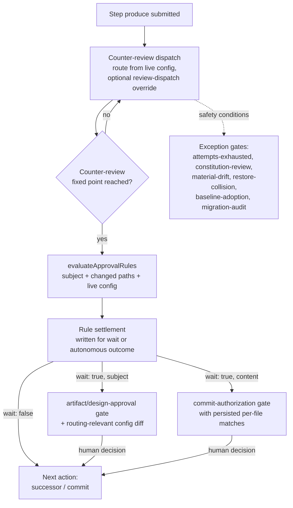

# Design — review-flexibility

**Status:** draft for review
**Date:** 2026-08-19
**Research basis:** `.archflow/tasks/review-flexibility/research/` (four exploration reports with file:line references; written 2026-08-19 against the current tree)

## Purpose and scope

Make ArchFlow's review machinery flexible enough to run as an automated pipeline with human attention spent only where deliberately targeted. Three changes, per the approved PRD:

1. Task config becomes an ordinary editable input with field-level change reporting (replaces byte-pinning).
2. The existing server-side per-dispatch reviewer route override becomes reachable through the semantic workflow tools; the config-level per-phase-kind `overrides` section ships in the template and is documented in the skills.
3. Built-in human approval gates (artifact-approval, design-approval, commit-authorization) are replaced by per-project declarative trigger rules (subject triggers + file-path content triggers); counter-review before step completion stays machine-enforced; safety/exception gates are untouched.

Out of scope (PRD non-goals): semantic diff analysis, multi-user/adversarial defenses, migration tooling beyond what exists, trigger languages beyond the two declared kinds.

## System boundaries

**Changes:**

- Config lifecycle: live config bytes stop being validated against a pinned digest; a last-seen snapshot in task state drives change notices.
- Fingerprint subject: `config_digest` leaves the `InputFingerprintSubject` composition; creation-time provenance uses remain.
- Semantic apply path: one new submission kind (`review-dispatch`) carrying a route override into the `review` action.
- Gate model: rule evaluation and durable settlements land before they are allowed to replace human authority. Until the repository constitution is explicitly amended, every document and commit boundary remains human-approved; activation occurs only with that amendment.
- Config schema: new `approval_rules` section; template ships it plus `overrides`.
- Constitution of this repository: `explicit-human-authority` and `approved-design-before-code` narrow to version 2; CLAUDE.md/AGENTS.md hard rules and skill prose follow.
- Maintained docs set: all affected caps-named pages.

**Explicitly unchanged:**

- Counter-review fixed point (`src/review/fixed-point.ts`): counter-review always runs before a step completes, regardless of any rule. No rule kind can skip it. (Its upstream-approval and adjudication acceptance points change per D6/D7; the review-dispatch fixed point itself does not.)
- Exception/safety gate kinds: attempts-exhausted, constitution-review (+waiver arm), material-drift, constitution-edit, restore-collision, baseline-adoption, migration-audit. These never become rule-conditional.
- Constitution policy-base pinning mechanics (`src/state/constitution.ts`): trigger rules live in config, not constitution files.
- Task isolation, canonical JSON/digest machinery, dispatch sandbox, repo views, request-digest authentication of submissions.
- Route override request-digest binding (already request-scoped, not fingerprint-scoped).

## Design decisions

### D1 — Config digest splits into provenance-only; live comparison dies

`config_digest` (sha256 over config bytes, `computePinnedConfigDigest`, `src/contracts/fingerprints.ts:388`) stays in its creation-time provenance roles: `TaskInitializationV1`/`LegacyImportInitializationV1`/`TaskStateV1.config_digest` agreement (`src/contracts/durable.ts:713`) and legacy-import staging (D15). The six live-bytes fail-closed comparisons (`PINNED_CONFIG_MISMATCH`) are deleted:

1. `src/state/fingerprint.ts:79-87` (internal resolver)
2. `src/state/transaction.ts:412-417` (kernel pre-preparation)
3. `src/state/initialization.ts:258-263`
4. `src/state/gates.ts:137` (`validateLiveGateState`)
5. `src/mcp/handlers/session.ts:56-61` (handler session open)
6. `src/local/call-envelope.ts:88-93`

Unparseable config bytes remain fail-closed (`CONFIG_INVALID`) — a broken YAML must never be silently used. The `pinned-config-schema-unsupported` → `upgrade-tooling` branch (`src/state/status.ts:746-751`) is removed; a config whose schema the tooling can't parse is just `config-invalid`. The `restore-pinned-config` next action (`src/state/next-action.ts:270-275`, rendered `src/state/semantic-view.ts:246`) and its error vocabulary (`src/contracts/errors.ts`) are removed.

### D2 — Fingerprint subject drops `config_digest`, with a bounded legacy fallback

`InputFingerprintSubject` (`src/contracts/fingerprints.ts:24-37`) loses `config_digest`. This changes every computed fingerprint, which would strand in-flight tasks at each check (persisted `state.input_fingerprint` D13 check `src/contracts/durable.ts:748-758`, gate checks, evidence manifest and chain comparisons, fixed-point binding). Rather than a migration subsystem (prototype priority: no migration machinery), the internal resolver (`src/state/fingerprint.ts`) gains one bounded fallback: when a recompute under the new composition does not match a recorded/expected value, recompute once under the legacy composition — using the recorded creation-time `state.config_digest`, never live config bytes — and accept on match. Every legacy fingerprint was recorded while pinning enforced live == pinned, so the recording-time digest is exactly the retained creation-time one; using it means a post-cutover config edit cannot invalidate legacy-recorded fingerprints (R1). Rules:

- The fallback only retries and accepts; it never rewrites recorded values. Comparing sites — the kernel, the local envelope, the gate-reentry *replay validations*, and the PRD planning-restart landing (whose next state commits through the kernel's equality pin) — keep recording the accepted, possibly legacy value, since the committed state must equal the fingerprint the request claimed; the composition flips to the new one only at no-expected write sites (revision zero, the material-drift restart landing, and gate-reentry landings, whose recomputation can never equal the pre-reentry recorded value because the reentry call's step and rubric digest differ), so legacy tasks converge at those sites rather than on every transaction.
- **Resolver contract change:** the internal resolver (`createInternalInputFingerprintResolver`, `src/state/fingerprint.ts`) currently returns an `InputFingerprintSubject` and each caller computes and compares the digest itself (`liveIdentification` in `src/state/transaction.ts`, gate and evidence checks, the kernel recompute) — so the fallback requires the resolver to return the **accepted fingerprint value** (new composition, or legacy composition when that is what matches) alongside the subject, and comparison sites compare the returned accepted value instead of recomputing. The local call-envelope path (`fingerprintFor`, `src/local/call-envelope.ts`) has no expected digest available at all; it returns whichever composition matches the state's recorded `input_fingerprint`, extending its existing short-circuit to `state.input_fingerprint` for gate/waiver calls. With the seam specified this way, all downstream validation inherits the fallback from one resolver call.
- It covers self-application evidence if this task's config is later edited after a separately authorized server adoption; Phase 3 itself does not perform that edit.
- If neither composition matches, the mismatch is real and fails closed as today.

In-flight tasks on other branches/checkouts: acceptable breakage per the PRD non-goal, documented in LIMITATIONS; `archflow-upgrade` remains the adoption path.

### D3 — Change reporting: last-seen snapshot in state, leaf diff in status

`TaskStateV1` gains optional `last_seen_config`: the parsed plain-JSON config snapshot most recently observed by a state transaction (precedent for optional state fields: `baseline_adoptions`, `src/contracts/durable-state.ts:298`). It must live in state.json because status reads state.json alone (REQ-14/21).

- **Update point:** the state transaction kernel (which already reads config at `src/state/transaction.ts:412`, currently for the pin check) records the current parsed snapshot whenever it differs. Status stays read-only.
- **Notice computation:** `computeTaskStatusDetailedInternal` already reads and parses live config (`src/state/status.ts:742-770`); it diffs live parsed config against `last_seen_config` with a small recursive leaf diff (new module `src/state/config-change.ts`; no existing generic diff util — `deriveImplementationDiffDigest` is the only neighbor). Diff is over the parsed structure, not bytes, so YAML comment/reorder edits produce no notice. The parser's retired-`producer` role normalization is applied before diffing so a cosmetic retire doesn't report as a change.
- **Status surface:** a `config_change` notice in the status value projected by `src/state/semantic-view.ts`: field-level old → new entries. Informational only; no step blocks.
- **Gate presentations:** at gate composition, the routing-relevant diff since the last state transaction (live config vs `last_seen_config`) is embedded in the gate context and rendered in the presentation. Routing-relevant fields: `roles`, `overrides`, `max_attempts`, `approval_rules`. Precedent for routing info in gate correspondence: `counter_review_provenance.route_override` (`src/state/status.ts:1119-1124`).
- **Durable record of what ran** stays the per-dispatch route provenance on evidence; notices supplement, never replace (PRD assumption).

### D4 — Route override rides a new `review-dispatch` submission kind

The server already accepts `RouteOverrideDeclaration` (`{reason, "counter-reviewer"?: route, adjudicator?: route}`, `src/contracts/mcp-tools.ts:74-81`) and `composeCounterReview` already accepts `facts.route_override` (`src/state/request-composition.ts:481-509`); dispatch children fire on the semantic `review` action's `review-run` substep (`src/state/semantic-actions.ts:345-350`), whose composition facts currently omit it. The gap is only submission → facts.

- New submission kind `review-dispatch` with one required field `route_override: RouteOverrideDeclaration`, accepted by the `review` action. The dispatching review offer advertises `expected_submission: "review-dispatch"` (`src/state/semantic-view.ts:182-187`; non-dispatching review shapes keep `"none"`), and `assertSubmissionMatches` tolerates an absent submission for exactly that kind — advertising `"none"` while relaxing the matcher would keep the override unreachable to clients that follow the advertised interface (phase-2 refinement of the original sketch; a required field because an override-less apply uses no submission and the declaration already rejects emptiness). Because `substepPlan` continuations call `requestFacts` without the submission (`src/state/semantic-actions.ts:601`), the declaration rides the plan (`decision_submission` precedent) into the `review-run` facts. An override is request-scoped: one lost to a crash between review-enter and review-run does not survive — the resumed dispatch runs under the configured route and the client re-requests it on the re-offered review action.
- `requestFacts`'s review case threads the declaration into the `review-run` facts. Because it arrives as a submission, `operationKey`'s `submission_digest` (`src/state/semantic-actions.ts:120-141`) binds it into the authenticated operation identity for free, and replay continuation matches automatically.
- Validation is unchanged: the composed input passes `counterReviewInputSchema` (`src/mcp/handlers/semantic.ts:195-201`), zod arm `routeOverrideSchema` (`src/contracts/mcp-tools.ts:181-197`) requires a non-empty reason and at least one role, and `routeFromConfiguredRoute` (`src/dispatch/routing.ts:57-80`) holds the substitute to configured-route rules. Evidence records (`RouteOverrideRecord`, `src/contracts/review.ts:144-150`) and rendering (`renderRouteOverride`, `src/contracts/renderers.ts:39-59`) already exist.
- MCP root-schema convention is safe: the union stays nested under `action.submission` (`src/contracts/semantic-workflow.ts:311-312`); the arm's route schema is a parentless semantic-workflow-local `$def` (clone pattern; the shared instance is `config#/$defs/route`, an unresolvable cross-document `$ref` in the advertised catalogue); regenerate `src/contracts/schemas/v1/semantic-workflow.schema.json` via `npm run generate:schemas`.
- No dedicated pre-approval gate for an override (PRD assumption): the human reason is required by validation, relayed by the client, recorded on evidence, and surfaced at the next gate or report.

Rejected alternatives: an `action.route_override` sibling (must be manually added to the operation digest — worse binding for more API surface), and piggybacking on `work-result` (wrong timing: dispatch happens on the next apply, so the override would have to be remembered across actions).

### D5 — Approval rules: two kinds, in config, evaluated by one pure helper

New config section (schema in `src/contracts/config.ts`; shipped in `assets/config.template.yaml`):

```yaml
approval_rules:
  subjects: [prd, design]          # subset of: prd | design | phase-design | phase-impl
  content:
    - paths: ["**/*.sql"]          # list of glob patterns; rule fires when any changed path matches
```

- **Subjects** are workflow subjects (prd, design, phase-design, phase-impl). A subject trigger means: after that subject's counter-review completes, stop for a human decision on the presented result.
- **Subject-to-gate-kind mapping (explicit):** `prd` opens artifact-approval; `design` and `phase-design` open design-approval (its approval arm — see D7 for the unconditional policy arm); `phase-impl` opens commit-authorization at the commit boundary, and a phase-impl subject trigger forces that gate for the phase regardless of content rules. There is no separate post-review approval gate kind for phase-impl.
- **Content triggers** match the file paths a change touches. For phase-impl these are the per-file paths in the retained `ImplementationOutputV1.outputs` (path, operation, before/after blob oids/modes/sizes — `src/state/implementation-manifest.ts`), recorded at produce time; no new git readers. Artifact subjects (prd, design, phase-design) touch fixed single document paths (`src/state/phase-documents.ts:104-150`), so content triggers degenerate to subject triggers there and are evaluated as such (a `**/*.md` rule does not fire on the design doc by accident of extension — content rules apply to phase-impl changes only; documented).
- **Evaluation** is one pure helper, new module `src/state/approval-rules.ts`: `evaluateApprovalRules(config, subject, changedPaths) → {wait, match}`, where `match` carries the matched subject or the complete set of matched paths. Glob matching: a small self-contained matcher supporting `**`, `*`, `?` over `/`-separated segments (no new dependency; exact semantics documented and tested). Phase 4 joins matched paths back to retained `ImplementationOutputV1.outputs` for operation and size-delta presentation. Mid-project rule edits are covered by D3 change reporting — a rule change is a config change, surfaced like any other, and never blocks.
- **One authoritative evaluation boundary:** the first narrowly enumerated transaction that establishes a clean final-review fixed point evaluates the helper against its prospective evidence set, then durably records the complete wait/autonomous conclusion. Those routes are final triage with its pending result overlaid, accepted-editorial `produce-succeeded` re-entry with the new subject over retained predecessor evidence, and authenticated policy-waiver discharge. A human-requested simple revision is excluded: it always returns for approval of final bytes and cannot clear an accepted material finding. Rule edits before settlement govern it; edits afterward govern future settlements and are reported without erasing the original trigger match.
- **Rules live in config, not constitution** (PRD R5): the constitution's immutable policy-base pinning stays as-is for its rule kinds, so trigger-rule changes can't reproduce the lock-in this task removes.

### D6 — Every eligible clean fixed point leaves durable rule evidence

The shared pure constructor serves only final triage, accepted-editorial `produce-succeeded` re-entry, and authenticated current policy-waiver discharge. Each route evaluates one live-config read and atomically appends `RuleSettlementV1` to `TaskStateV1.rule_settlements`; every other transition or gate resolution rejects or omits settlement. The conclusion preserves the evaluated no-wait result or the exact wait match. The type and schema live directly in `durable-state.ts` because task-state is the only durable root. Numeric ordering, digest binding, and restart cutoff remain as specified.

Until D9's constitution amendment lands, this is durable bookkeeping and presentation evidence, not human approval, upstream authority, phase-exit authority, or milestone-commit authority. Design commit facts continue to derive only from authenticated design approval or migration audit.

### D7 — Presentations enumerate matches before conditional opening activates

The gate kinds artifact-approval, design-approval, and commit-authorization survive. Any eligible clean fixed point records the rule conclusion. Before D9 lands, status opens the ordinary human gate for both conclusions; when `wait:true`, composition renders the persisted match. After D9, an approved activation may make opening conditional. Everything still funnels through `openDurableGate`.

**The design-approval gate carries two roles, and only one can eventually become rule-conditional.** The policy arm remains exempt from triggers. Final-review settlement writes no rule settlement while policy adjudication is pending. If a waiver is granted, that resolution records the ordinary rule settlement, then returns to explicit document approval while the current constitution is active because a waiver is not approval of produced bytes.

- When a **content trigger** fires, the presentation names every matching file path, its operation (add/modify/delete/rename), and a concise per-file summary (operation + size delta, from `ImplementationOutputV1.outputs`) — enough for the human to go read the right files (PRD R7). Rendered via the gate decision interface (`src/state/gate-decision-interface.ts:267`; `details` precedent for path lists at :291-304). Per the interface hard rule, the template enumerates every decision shape the resolver accepts for these gates, unchanged from today's resolvers (`src/contracts/durable-gate.ts:229-235`): artifact-approval `[approve, revise, reject, cancel]`, design-approval `[approve, revise, reject, waiver-requested, cancel]` (the waiver arm and the cancellation escape path stay visible), commit-authorization `[authorize-commit, revise, abort, cancel]`. Resolution paths and archived-gate parsers are not narrowed.
- When a **subject trigger** fires, the presentation is today's artifact/design approval presentation, plus the D3 routing-relevant config diff since the last transaction.
- In-flight tasks with approval gates already open keep resolving across the switchover (archived/tolerant gate parsers unchanged).

### D8 — Content-trigger presentation is prepared before commit activation

Phase-impl settlements and content-trigger summaries land while commit-authorization remains mandatory. A `wait:true` settlement supplies its persisted path match to the D7 presentation; `wait:false` remains evidence only. Conditional commit opening and any autonomous document consumption move to the same post-amendment activation boundary as D9.

### D9 — Constitution amendment for this repository and policy-pinned activation

Per the amendment procedure (`skills/archflow-constitution`, `validateConstitutionEvolution` `src/contracts/constitution.ts:64-75`: keep IDs, bump versions), amend the two files that actually own the rules:

- `.archflow/constitution/00-process.md`: `explicit-human-authority` → v2. Required human decisions are explicit and bound to the exact subject *at gates that a rule or safety condition opened*; silence/elapsed time/agent prose/model verdict never supplies approval; commits are not human-gated by default. The trigger narrows from inferred advancement/commit authority generally to inferred authority *over a gate that opened*.
- `.archflow/constitution/10-architecture.md`: `approved-design-before-code` → v2. Implementation starts from a phase design that either passed its triggered human gate or advanced by rule with counter-review complete; truthfulness requirements remain unchanged.

The matching `assets/constitution/00-process.md` and `assets/constitution/10-architecture.md` seeds change byte-for-byte in lockstep. `test/unit/constitution.test.ts` pins the stable four-ID registry and the two v2 rules. CLAUDE.md's hard-rules section and AGENTS.md (byte-identical, enforced by `test/contracts/skill-contract-canonical.test.ts:367-370`) update in the same change: the "never commit without explicit user approval" hard rule becomes "never skip a gate a rule or safety condition opened; never bypass a triggered human decision".

Autonomous settlement consumption is not a global code-version switch. The server derives an unforgeable internal capability only from the task's immutable `policy_base_commit` when the resolved constitution digest equals `state.constitution_digest` and the complete canonical objects for the two selected active rules — IDs, exact version-2 text, review triggers, status, and enforcement metadata — equal ArchFlow's supported v2 acceptance profile. ID/version equality alone is insufficient because constitution rules are repository-owned. Only that capability may turn the latest exact, restart-eligible `wait:false` settlement into advancement authority. A task pinned to v1, a divergent or unknown future rule version, a digest disagreement, a missing settlement, a `wait:true` settlement, or stale/wrong-subject evidence keeps the current mandatory human gate. This preserves the policy each in-flight task actually pinned; the current task therefore completes this cutover under its v1 gates, while tasks initialized against the exact amended v2 policy may advance autonomously.

Design and phase-design milestones still create exact task-local commits after an autonomous decision. Because `DocumentArtifactV1` has no Git baseline and no human gate archive exists on this path, a no-wait design settlement records the observed HEAD as its `milestone_baseline_commit`. Fresh status derives the target and deterministic message, requires HEAD to remain at that baseline before offering the commit, and later proves the commit is its direct child with the exact task state (including the accepted settlement), document bytes, message, path scope, and clean task tree. If HEAD moves while the subject, fixed-point evidence, frozen rule conclusion/config digest, task projections, and all safety conditions remain exact, one server-owned no-submission action appends a replacement settlement carrying only the refreshed baseline; it never re-evaluates rules or crosses changed bytes. Reconciliation and every exception gate outrank this refresh. Implementation outputs continue using their already-durable `base_commit`. Triggered implementation commits retain their existing separate confirmation; autonomous implementation commits return `requires_human_confirmation:false`.

The cutover lands across two independently reviewed boundaries. Phase 5 adds the authenticated profile, consumers, and exact Git proof while the shipped live/seed constitution remains v1, so the machinery is dormant outside explicit exact-v2 test fixtures. Phase 6 then amends the live/seed rules and client instructions and proves the shipped activation end to end. Until Phase 6 receives the existing explicit human approval and is committed, the Phase-3/4 machinery remains dormant for normally initialized repositories, so narrowed text never authorizes earlier bytes retroactively.

**Installed-server boundary:** this checkout does not automatically become the active MCP server when repository code or `dist/` changes. The server is a separately installed machine-global bundle, and repository policy forbids installing it without the user's explicit request. Phase 3 therefore edited only `assets/config.template.yaml`; it did not add `approval_rules` to repository `.archflow/config.yaml` or this task's copied config while the new parser/authority remained dormant. Phase 6 must add the approved defaults to repository `.archflow/config.yaml` in the same commit that activates exact v2 so future self-hosted tasks do not become entirely ungated. That repository seed edit cannot affect this in-flight task, whose task-local config was copied at creation. No new task should be created from the amended policy/config until a compatible bundle adoption is separately and explicitly authorized; Phase 6 rebuilds tracked `dist/` but does not install it. Re-running scaffold in this initialized repository continues to report `scaffold-diverged` rather than rewriting live repository inputs.

### D10 — Default ruleset and template surface

`assets/config.template.yaml` ships:

```yaml
overrides:
  # per-phase-kind reviewer route overrides (schema: contracts/config.ts configOverridesSchema)
  # phase-design: {counter-reviewer: {model: ..., effort: ...}}
approval_rules:
  subjects: [prd, design]
  content:
    - paths: ["**/*.sql"]
```

The `overrides` block is commented guidance (schema already accepts it, `src/contracts/config.ts:27-33`); `approval_rules` is active defaults per PRD R6. Check the legacy-upgrade template byte-compare (`src/init/legacy-upgrade.ts:476-483`) when editing the template. Skills document both: config routing/overrides guidance in archflow-init, outage procedure (ask the human for a substitution + reason → submit `review-dispatch` with the override on the review offer) in the four reviewing skills, config-change notice handling in archflow-status.

## Data and control flow (post-change step completion)



Config edits enter at any point: next transaction/dispatch reads live config; status shows the leaf diff vs `last_seen_config`; nothing invalidates.

## Requirement mapping

| Req | Design | Phase |
|-----|--------|-------|
| R1 free config editing | D1, D2 | 1 |
| R2 change reporting | D3 | 1 |
| R3 route override via semantic API | D4, D10 | 2 |
| R4 targeted approval gates | D5–D9 | 3, 4, 5, 6 |
| R5 rule kinds and location | D5 | 3 |
| R6 default ruleset | D10 | 3 (template), 6 (constitution activation) |
| R7 content-trigger presentation | D7 | 4 |
| R8 constitution amendment | D9 | 6 |
| R9 documentation | all pages per research inventory | 7 |

PRD clarification added in the same production result (Assumptions): the task's own `config.yaml` remains the evaluated surface for that task (copied from repo config at creation); repo-level edits seed new tasks, and mid-task changes are made on the task copy where R1/R2 apply.

## Risks and mitigations

- **Fingerprint composition break strands in-flight tasks** (D2): bounded legacy-composition fallback in the single internal resolver; convergence as tasks transact; documented limitation for other checkouts.
- **Activation before the constitution amendment would violate current human authority** (D6/D9): Phase 3 writes settlements only at final triage, accepted-editorial re-entry, and authenticated current waiver discharge, and Phase 4 presents their matches while all approval consumers remain human-only. Phase 5 lands exact-profile consumers while shipped v1 policy keeps them dormant; Phase 6 separately amends the governing rules and proves shipped activation. Tests pin v1, divergent-v2, exact-v2, and post-amendment boundaries.
- **Three agreement sites drift** (D5): one pure helper, one evaluation context, guard extended — same pattern the codebase already uses.
- **Rule semantics misread by projects** (over/under-matching): D7 presentation shows exactly what matched; LIMITATIONS documents that content rules apply to phase-impl changed paths only and SQL-in-non-SQL-files is out of scope (PRD assumption).
- **Self-application and installed-server skew**: repository bytes do not replace the active machine-global server. Editing repository `.archflow/config.yaml` or this task's config with a key the installed parser does not know would wedge the workflow. Phase 3 leaves both live configs and the installation untouched; task creation continues copying the compatible repository config, re-scaffold returns `scaffold-diverged`, and parser/template adoption requires a separate explicit user request or new initialization.
- **Test-pin churn**: skill-contract canonical/upgrade/outage suites and constitution registry pin exact prose; every phase that rewrites pinned passages updates its assertions in the same change (per-phase task, listed below).

## Verification strategy

Per-phase unit/integration tests (listed per phase). End-to-end observable criteria from the PRD, each mapped to a test:

1. Mid-phase config edit → no error; next dispatch uses new routing; status reports field-level change (phase-1 integration test on a real task fixture).
2a. Phase 5 proves the dormant runtime with authentic exact-v2 fixtures while the shipped v1 seed stays human-gated; Phase 6 proves a normally initialized task pinned to the shipped amended v2 constitution completes a TS-only phase with no approval gate and commits. Exception gates still stop when applicable.
2b. `.sql`-touching phase stops; presentation lists paths + summaries (phase-4 test asserting the rendered interface).
3. Fresh-project first PRD and architecture stop for review with defaults only (phase-3 test over the shipped template).
4. Override requested via `review-dispatch` during an outage scenario runs under the substitute and appears on evidence with reason (phase-2 dispatch test).
5. Docs grep for pinning finds the change-reporting model (phase-7 check).
6. Config edit with open gate + existing evidence invalidates neither (phase-1 test).

Cross-cutting: durable-contract corpus tests, crash/replay suites, and advertised-schema tests must stay green each phase (they pin fingerprints, submissions, and skill prose — each phase updates only the pins it deliberately changes).

## Phase plan

### Phase 1: Config as an editable input

Remove byte-pinning and add change reporting. Files: `src/contracts/fingerprints.ts` (subject + keep provenance digest), `src/state/fingerprint.ts` (resolver, legacy fallback), `src/state/transaction.ts`, `src/state/initialization.ts`, `src/state/gates.ts`, `src/mcp/handlers/session.ts`, `src/local/call-envelope.ts`, `src/contracts/durable-state.ts` (`last_seen_config`), new `src/state/config-change.ts` (leaf diff + normalization), `src/state/status.ts` (notice, remove blockers), `src/state/next-action.ts` + `src/state/semantic-view.ts` (remove `restore-pinned-config`, add notice projection), `src/contracts/errors.ts` (vocabulary), `assets/config.template.yaml` (`overrides` guidance only; `approval_rules` waits for Phase 3). Tests: invert `test/unit/config-pinning.test.ts` per site, extend `fingerprints.test.ts` (subject fixture, the resolver's accepted-value contract, and a legacy-recorded fixture pinning the fallback end to end), status/transaction integration for notices and open-gate survival. Success: PRD criteria 1 and 6.

### Phase 2: Route override through the semantic workflow tools

Files: `src/contracts/semantic-workflow.ts` (submission kind + union + enums), regenerate `src/contracts/schemas/v1/semantic-workflow.schema.json`, `src/state/semantic-actions.ts` (submission matching for review + `requestFacts` and plan-field threading — `substepPlan` continuations drop the submission), `src/state/semantic-view.ts` (dispatching review offer advertises `review-dispatch`; instruction mentions the override option), skills `archflow-prd`/`archflow-design`/`archflow-phase-design`/`archflow-phase-impl` (review-apply wording + outage paragraph: human reason required, submit with the review offer) + `archflow-init` (config routing/overrides guidance) + `archflow-upgrade` (one-clause carve-out in its generic submission rule: `review-dispatch` is optional, only for a human-authorized reviewer substitution — counter-review finding on the P2-1 honest advertisement), `test/contracts/skill-contract-canonical.test.ts` + `skill-contract-server-outage.test.ts` pins, new unit/integration tests for submission→facts→evidence threading and operation-digest binding. Success: PRD criterion 4.

### Phase 3: Subject rules and durable settlements

Files: `src/contracts/config.ts` (`approval_rules`), `src/contracts/durable-state.ts` (task-state-owned settlement shape, numeric ordering, config mirror), new `src/state/approval-rules.ts`, `src/state/request-composition.ts`, `src/state/transitions.ts`, `src/mcp/handlers/state.ts` (final-triage and accepted-editorial settlement), `src/state/gates.ts` (waiver-discharge settlement), `src/review/fixed-point.ts`, `src/state/restart-authority.ts`, and `assets/config.template.yaml`. Tests cover both conclusions, numeric ordering, prospective evidence, persisted trigger presentation after config edits, mandatory human consumers, waiver boundaries, simple-revision trust rules, defaults, and repository-config/scaffold behavior. No separate settlement schema root, live-config edit, installation, autonomous upstream acceptance, gateless phase exit, or autonomous milestone proof occurs.

### Phase 4: Content-trigger presentation at the guarded commit boundary

Files: `src/state/status.ts` and `src/state/request-composition.ts` (join persisted path matches to `ImplementationOutputV1.outputs` for operation/size summaries), `src/state/gate-decision-interface.ts` (per-file match presentation), and existing commit-authorization composition. Tests: SQL-match and TypeScript-no-match settlements; config edits after settlement still present the original complete paths; both remain behind explicit commit authorization; exception gates still stop.

### Phase 5: Dormant exact-policy settlement authority and Git proof

Add the exact supported-v2 canonical policy profile, branded acceptance capability, rule-settlement autonomous design baseline plus bounded unchanged-evidence baseline refresh, and all approval-dependent upstream/routing/transition/status/milestone consumers. The shipped `.archflow/constitution/`, `assets/constitution/`, `CLAUDE.md`, `AGENTS.md`, and skills remain v1/unconditional, so normally initialized repositories cannot activate the new paths. Authentic test fixtures prove v1 fail-closed behavior, exact-v2 restart-aware upstream/phase-exit authority, exact autonomous design/implementation commit proof and HEAD-movement recovery, unchanged `wait:true` presentations, and exception-gate precedence. Regenerate tracked `dist/`; do not install or edit live config.

### Phase 6: Constitution amendment, shipped activation, hard rules, and skill prose

Amend `.archflow/constitution/00-process.md` + `10-architecture.md` and their exact `assets/constitution/` seeds to the supported v2 profile. Add the approved default rules to repository `.archflow/config.yaml`, update the config template's activation commentary, and leave the in-flight task config untouched. Correct `src/state/next-action.ts` and `src/state/semantic-view.ts` so human-required and autonomous implementation commit facts carry truthful distinct detail/instructions. Update byte-identical `CLAUDE.md`/`AGENTS.md` and skills `archflow-prd`/`archflow-design`/`archflow-phase-design`/`archflow-phase-impl`/`archflow-status`/`archflow-upgrade`; phase-impl distinguishes triggered confirmation from autonomous commit facts. Tests prove scaffolded v2 activation, live/default rule agreement, live/seed and client-byte identity, conditional gate prose, truthful semantic commit projection, unchanged migration/exception behavior, and full skill contracts. In the same phase, update every maintained statement made false by activation across OVERVIEW, LIFECYCLE, SKILLS, SERVER, COUNTER-REVIEW, DURABLE-STATE, CONTRACTS, TESTING, and the affected LIMITATIONS entry. Regenerate the repository payload without installing it, and do not create a new task from the amended policy/config before a separately authorized compatible bundle adoption.

### Phase 7: Documentation refresh

Complete the maintained-set audit after Phase 6's activation-facing updates. Reconcile earlier config and override changes across DISPATCH and finish the LIMITATIONS audit (including config-schema evolution, content-trigger scope, and the in-flight fingerprint-composition limitation), then audit every Phase 6-updated page for remaining cross-phase omissions. Refresh PATTERNS, COMPLEXITY, DEPENDENCIES and all affected stamps. Verification: PRD criterion 5 (grep for pinning/mismatch finds the reporting model); the complete caps-named set is truthful and stamp lines are updated.

Each phase ends with its own reviewed phase design (`/archflow-phase-design review-flexibility N`) before implementation. Phase boundaries keep dormant runtime mechanics, the human policy amendment, and the descriptive documentation audit independently reviewable; phases target roughly 10–15 hand-written files when the cross-cutting trust seam permits it.
