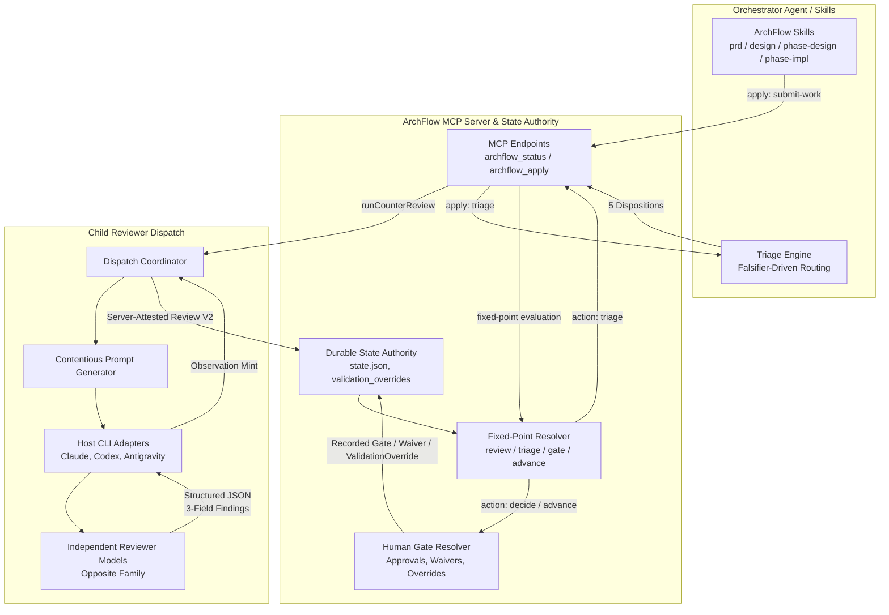
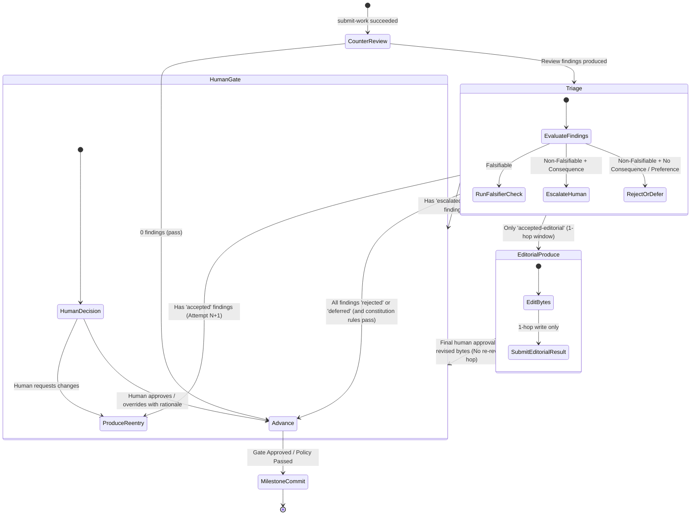

# Technical Design: Review Taxonomy & Workflow State Overrides

**Task:** `review-taxonomy`  
**Status:** In Review (Revision 3)  
**Date:** 2026-08-31  

---

## 1. Executive Summary & Architectural Goals

The ArchFlow review and verification subsystem is undergoing an architectural upgrade to replace legacy severity scales (`critical`, `bug`, `blocker`, `major`, `minor`, and binary `blocking`) with a 3-field descriptive taxonomy:
1. `claim_type`: `defect`, `risk`, `gap`, `preference`
2. `confidence`: `certain`, `likely`, `suspicion`
3. `falsifier`: Concrete test command, code inspection, or explicit rationale for unevaluable conditions.

This architecture decouples what an issue is (`claim_type`) from how sure the reviewer is (`confidence`), and requires an actionable settling mechanism (`falsifier`).

Additionally, this design introduces two explicit human-gated escape hatches:
- **Validation Override:** Allows developers to waive lengthy/expensive verification steps during phase implementation (`phase-impl`) with recorded human rationale and explicit displaced validations tracking, stored in a dedicated durable record (`state.validation_overrides`).
- **Review Push-Through:** Allows developers to break out of spinning rubric review loops without rewriting upstream design documents, while strictly preserving active constitution rule enforcement.

---

## 2. System Boundaries & High-Level Architecture



---

## 3. Data Models & Schema Contracts

### 3.1 Review Findings & Version-Discriminated Review Contracts (`src/contracts/review.ts`)

To ensure complete backward compatibility with archived evidence (NFR-2) and prevent structural guessing, review manifests use an explicit version discriminator (`schema_version: "1"` for legacy reviews, `schema_version: "2"` for 3-field taxonomy reviews).

```typescript
export const CLAIM_TYPES = ["defect", "risk", "gap", "preference"] as const;
export type ClaimType = (typeof CLAIM_TYPES)[number];

export const CONFIDENCE_LEVELS = ["certain", "likely", "suspicion"] as const;
export type ConfidenceLevel = (typeof CONFIDENCE_LEVELS)[number];

export const REVIEW_VERDICTS = ["pass", "advisory", "review-raised"] as const;
export type ReviewVerdict = (typeof REVIEW_VERDICTS)[number];

export const LEGACY_REVIEW_VERDICTS = ["pass", "advisory", "fail"] as const;
export type LegacyReviewVerdict = (typeof LEGACY_REVIEW_VERDICTS)[number];

/** 3-Field Review Finding (Schema V2) */
export type ReviewFindingV2 = {
  readonly finding_id: string;
  readonly claim_type: ClaimType;
  readonly confidence: ConfidenceLevel;
  readonly falsifier: string;
  readonly summary: string;
  readonly evidence: string;
  readonly suggested_resolution: string;
};

/** Summary counts partitioned by (claim_type, confidence) */
export type FindingPartitionCounts = Readonly<
  Record<`${ClaimType}:${ConfidenceLevel}`, number>
>;

/** New Review Manifest (Schema V2) */
export type RawReviewV2 = {
  readonly schema_version: "2";
  readonly task_id: TaskSlug;
  readonly phase_instance: string;
  readonly step: "counter_review";
  readonly role: ReviewRole;
  readonly subject_digest: Sha256Digest;
  readonly input_fingerprint: Sha256Digest;
  readonly rubric_digest: Sha256Digest;
  readonly producer_family: ModelFamily;
  readonly findings: readonly ReviewFindingV2[];
  readonly matched_rule_versions: readonly RuleVersionRef[];
  readonly verdict: ReviewVerdict;
  readonly total_findings: number;
  readonly partition_counts: FindingPartitionCounts;
};

/** Legacy Review Manifest (Schema V1 - Archived Read Compatibility) */
export type RawReviewV1 = {
  readonly schema_version: "1";
  readonly task_id: TaskSlug;
  readonly phase_instance: string;
  readonly step: "counter_review";
  readonly role: ReviewRole;
  readonly subject_digest: Sha256Digest;
  readonly input_fingerprint: Sha256Digest;
  readonly rubric_digest: Sha256Digest;
  readonly producer_family: ModelFamily;
  readonly findings: readonly LegacyReviewFinding[];
  readonly matched_rule_versions: readonly RuleVersionRef[];
  readonly verdict: LegacyReviewVerdict;
  readonly total_findings: number;
  readonly blocking_count: number;
};

export type RawReview = RawReviewV1 | RawReviewV2;
```

### 3.2 Verdict Derivation Functions

Verdict derivation is selected deterministically per schema version arm:
- **Schema V2 Verdict Derivation:**
$$\text{verdict}_{\text{V2}} = \begin{cases} 
\text{"pass"} & \text{if } |\text{findings}| = 0 \\
\text{"advisory"} & \text{if } \forall f \in \text{findings},\, f.\text{claim\_type} = \text{"preference"} \\
\text{"review-raised"} & \text{if } \exists f \in \text{findings},\, f.\text{claim\_type} \in \{\text{"defect"}, \text{"risk"}, \text{"gap"}\}
\end{cases}$$

- **Schema V1 Legacy Verdict Derivation (preserved for pre-change records):**
$$\text{verdict}_{\text{V1}} = \begin{cases} 
\text{"pass"} & \text{if } |\text{findings}| = 0 \\
\text{"advisory"} & \text{if } |\text{findings}| > 0 \land \text{blocking\_count} = 0 \\
\text{"fail"} & \text{if } \text{blocking\_count} > 0
\end{cases}$$

### 3.3 Public MCP Contract Surface (`src/contracts/semantic-workflow.ts` & `src/contracts/mcp-tools.ts`)

The public MCP schemas read by orchestrating skills are updated to mirror the V2 taxonomy:
- `publicFindingV1Schema`: updated to include `claim_type: z.enum(CLAIM_TYPES)`, `confidence: z.enum(CONFIDENCE_LEVELS)`, `falsifier: nonBlankBounded(4096)`, and legacy fields removed.
- `triageDispositionV1Schema`: extended to accept all 5 dispositions (`accepted`, `accepted-editorial`, `rejected`, `escalated-human`, `deferred`).
- `publicReviewRoundV1Schema`: updated from fixed `{ attempt, findings, blocking, accepted }` to `{ attempt, total_findings, partition_counts, accepted_count, deferred_count, escalated_human_count }`.
- `CounterReviewSuccess` in `mcp-tools.ts`: updated with `verdict: "pass" | "advisory" | "review-raised"` and `partition_counts`.

### 3.4 Triage Dispositions & Machine Invariant (`src/contracts/triage.ts`)

Triage dispositions support 5 mutually exclusive outcomes:
1. `accepted`: Substantive defect/risk accepted for remediation $\rightarrow$ re-entry into produce attempt $N+1$.
2. `accepted-editorial`: Wording/formatting fix with no behavioral or contract change $\rightarrow$ 1-hop produce without full re-review.
3. `rejected`: Finding is disproven, non-material, or out of scope $\rightarrow$ requires rejection evidence.
4. `escalated-human`: Non-falsifiable issue with material consequence escalated to human judgment $\rightarrow$ folds into human gate before advancement.
5. `deferred`: Non-blocking observation or future consideration $\rightarrow$ closes finding for current phase, recorded in durable ledger.

**Machine Invariant on Editorial Triage:**  
`validateTriage` enforces a strict server-side check:
$$\text{If } \text{disposition} = \text{"accepted-editorial"} \implies \text{claim\_type} = \text{"preference"}$$
Any attempt to submit `accepted-editorial` for a finding whose `claim_type` is `defect`, `risk`, or `gap` is rejected with `CONTRACT_INVALID (editorial-refused-for-substantive-finding)`.

---

## 4. Counter-Reviewer Prompting & Rubrics

### 4.1 Contentious Prompt Directive (`src/review/envelopes.ts`)
The reviewer system instructions are updated with explicit directives:
1. **Adversarial & Contentious Stance:** Actively seek edge cases, latent boundary hazards, performance cliffs, spec omissions, and untested assumptions.
2. **Cost-Free Suspicions:** Models are explicitly instructed that `suspicion` confidence ratings are welcomed, valuable signals, and incur no penalty.
3. **Falsifier Requirement:** Every finding must provide a concrete, falsifiable check (e.g., test fixture name, CLI invocation, or code location) or an explicit statement explaining why automated verification is impossible and citing the material consequence.

### 4.2 Host Structured Output Projection (`src/dispatch/cli.ts`)
`hostFindingSchema` is updated to project the 3-field taxonomy (`claim_type`, `confidence`, `falsifier`) directly into Claude (`--json-schema`) and Codex (`--output-schema`) formats, stripping legacy severity fields.

---

## 5. Fixed-Point Advancement & Complete State Lifecycle



### 5.1 The Complete Editorial Lifecycle
1. `Triage` records `accepted-editorial` for non-substantive wording/formatting items.
2. Server transitions to `EditorialProduce` write window (single 1-hop authorization).
3. Client edits the artifact and submits `work-result`.
4. The server validates the revised bytes, marks the review evidence as bound to this single hop, and prohibits further editorial chaining.
5. The workflow transitions to the applicable human gate (`artifact-approval`, `design-approval`, or `commit-authorization`) so the human explicitly approves the final revised bytes before advancement.

---

## 6. Human-Gated Workflow State Overrides

### 6.1 Validation Override (`phase-impl`)
When a phase implementation encounters a lengthy, flaky, or disproportionate test suite:
- The human gate opens with a `validation-override` option.
- The gate context and decision envelope require:
  - `rationale`: Non-empty human justification string.
  - `displaced_validations`: Non-empty array of specific test commands, harness targets, or requirement identifiers being bypassed.
- **Durable Storage & Isolation from Constitution Rules:**  
  Validation overrides are stored in a dedicated `state.validation_overrides: readonly ValidationOverrideRecordV1[]` array on `TaskStateV1`. They are **never** stored in `state.waivers` and do not use `rule_id`/`rule_version`.  
  `waiverInForce` in `src/review/fixed-point.ts` only evaluates `state.waivers` against constitution rules and ignores `state.validation_overrides`. This ensures a validation override can never accidentally satisfy a constitution review gate.
- **Audit Trail:** `archflow_status` and status projections reconstruct the timestamp, human reason, gate ID, phase instance, and exact displaced validation checks.

### 6.2 Review Push-Through (Loop Breakout)
When a task has undergone multiple review rounds ($\ge 2$) and is spinning on repetitive feedback:
- The human gate offers an explicit `review-push-through` option alongside normal approval choices.
- The human authorizes the push-through with a required reason string.
- **Strict Policy Resolution Preservation:**  
  Review push-through disposes **only** ordinary rubric review findings. It **never** bypasses constitution rules or review-trigger gates. If active constitution rules fail or a review trigger is matched, those rules must be independently satisfied or explicitly waived through the human constitution-waiver mechanism after attempt budget exhaustion before advancement can occur.

---

## 7. Requirements Traceability Matrix

| Requirement ID | Description | Architecture / Implementation Mapping |
|---|---|---|
| **FR-1.1** | `claim_type` field (`defect`, `risk`, `gap`, `preference`) | `src/contracts/review.ts`, `ReviewFindingV2`, `publicFindingV1Schema` |
| **FR-1.2** | `confidence` field (`certain`, `likely`, `suspicion`) | `src/contracts/review.ts`, `ReviewFindingV2`, `publicFindingV1Schema` |
| **FR-1.3** | `falsifier` string contract | `src/contracts/review.ts`, `src/review/envelopes.ts` |
| **FR-1.4** | Legacy severity deprecation & legacy compatibility | `RawReviewV1` vs `RawReviewV2` discriminated union in `src/contracts/review.ts` |
| **FR-1.5** | Review summary & verdict derivation (`pass`, `advisory`, `review-raised`) | `src/contracts/review.ts`, `src/contracts/semantic-workflow.ts`, `src/contracts/mcp-tools.ts`, `src/state/semantic-status.ts` |
| **FR-2.1 - 2.3** | Contentious review prompting & falsifier enforcement | `src/review/envelopes.ts`, `src/dispatch/cli.ts` |
| **FR-3.1 - 3.4** | Falsifier-based triage, 5 dispositions, fixed-point engine | `src/contracts/triage.ts`, `src/contracts/semantic-workflow.ts`, `src/review/fixed-point.ts` |
| **FR-4.1 - 4.2** | Skill instructions & agent agency | `skills/archflow-*/SKILL.md` |
| **FR-5.1 - 5.3** | Human-gated validation overrides | `src/contracts/gates.ts`, `src/contracts/durable-state.ts` (`validation_overrides`), `src/state/gates.ts` |
| **FR-6.1 - 6.3** | Review push-through escape hatch (preserving policy gates) | `src/contracts/gates.ts`, `src/review/fixed-point.ts`, `src/state/gates.ts` |
| **FR-7.1 - 7.2** | Metrics & audit trails (including displaced validations) | `src/state/semantic-view.ts`, `src/state/semantic-status.ts`, `src/local/automation-status.ts` |
| **NFR-1** | Security & trust bounds (no agent auto-waiver, isolated validation override) | `src/state/transaction.ts`, rule `explicit-human-authority`, `state.validation_overrides` |
| **NFR-2** | Schema backwards compatibility & discriminated legacy reads | Discriminated union in `src/contracts/review.ts`, legacy fixtures |
| **NFR-3** | Deterministic hashing & digests | `canonicalJsonDigest` over structured objects |
| **NFR-4** | Execution overhead $<100\text{ms}$ | `test/unit/triage-benchmark.test.ts`, in-memory evaluation |

---

## 8. Quantitative Commitments & Constants Table

| Constant / Budget | Value | Purpose / Constraint | Direct Assertion Seam |
|---|---|---|---|
| `MAX_CLAIM_TYPES` | 4 | Cardinality of `CLAIM_TYPES` enum (`defect`, `risk`, `gap`, `preference`) | `test/contracts/review-taxonomy-contract.test.ts` |
| `MAX_CONFIDENCE_LEVELS` | 3 | Cardinality of `CONFIDENCE_LEVELS` enum (`certain`, `likely`, `suspicion`) | `test/contracts/review-taxonomy-contract.test.ts` |
| `MAX_TRIAGE_DISPOSITIONS` | 5 | Cardinality of triage disposition set (`accepted`, `accepted-editorial`, `rejected`, `escalated-human`, `deferred`) | `test/contracts/triage-contract.test.ts` |
| `REVIEW_PUSH_THROUGH_MIN_ATTEMPT` | 2 | Minimum attempt count before review push-through is offered | `test/unit/fixed-point-review-push-through.test.ts` |
| `MAX_FALSIFIER_STRING_LENGTH` | 4096 UTF-16 code units | Upper bound on `falsifier` string length in JS (`String.prototype.length`) | `reviewFindingSchema` zod `.max(4096)` |
| `MAX_REASON_STRING_LENGTH` | 4096 UTF-16 code units | Upper bound on override / waiver reason string length in JS (`String.prototype.length`) | `gateRequestSchema` zod `.max(4096)` |
| `TRIAGE_EVALUATION_MAX_LATENCY_MS` | 100 ms | NFR-4 upper bound on triage evaluation overhead | `test/unit/triage-benchmark.test.ts` |
| `GATE_PRESENTATION_MAX_LATENCY_MS` | 100 ms | NFR-4 upper bound on gate presentation derivation overhead | `test/unit/triage-benchmark.test.ts` |

---

## 9. Boundary & Mechanism Safety Matrix

| Safety Property | Mechanism | Direct Test Verification |
|---|---|---|
| **No Auto-Waiver by Agent** | Validation override and push-through require explicit signed human decision envelope | `test/unit/gate-approval-authorization.test.ts` |
| **Validation Override / Constitution Rule Isolation** | `validation_overrides` stored separately from `state.waivers`; `waiverInForce` never matches validation overrides | `test/unit/validation-override-isolation.test.ts` |
| **Push-Through Preserves Constitution Gates** | Push-through clears only review findings; active constitution rules and triggers still enforce | `test/unit/push-through-policy-preservation.test.ts` |
| **Legacy Archive Compatibility** | Discriminated union (`schema_version: "1"` vs `"2"`) reads stored pre-change review evidence without error | `test/contracts/archived-review-compatibility.test.ts` |
| **Editorial Refusal on Defect** | `validateTriage` throws `CONTRACT_INVALID` if `accepted-editorial` is given for a `defect`, `risk`, or `gap` | `test/unit/triage-editorial-guard.test.ts` |
| **Falsifier String Enforcement** | Zod validation rejects whitespace-only or empty falsifier strings | `test/unit/review-finding-schema.test.ts` |
| **Triage Exact Coverage** | `validateTriage` checks that all current review findings are covered exactly once by dispositions | `test/unit/triage-validation.test.ts` |
| **Sub-100ms Latency Budget** | Microbenchmarks assert triage evaluation and gate presentation take $<100\text{ms}$ | `test/unit/triage-benchmark.test.ts` |

---

## 10. Phase Sizing & Split/Merge Judgment

### 10.1 Split Check (Atomicity & Cohesion)
- **Phase 1 (Contracts, Schemas & Compile-Time Consumers):** Strictly encapsulates TypeScript types, Zod validators, schema generation, CLI projections, and updates all compile-time consumers of `ReviewFinding` and public round/finding schemas across the repository (`src/review/fixed-point.ts`, `src/contracts/triage.ts`, `src/state/request-composition.ts`, `src/review/counter-review.ts`, `src/state/evidence-results.ts`, `src/review/pinned-context.ts`, `src/contracts/renderers.ts`, `src/state/status.ts`, `src/state/semantic-status.ts`). It guarantees that `npm run check:schemas` and `npm run typecheck` pass at Phase 1 completion.
- **Phase 2 (Prompting & Dispatch):** Focuses entirely on reviewer prompt engineering, rubrics, and child CLI dispatch coordination.
- **Phase 3 (Triage & State Machine):** Implements the 5 triage dispositions, the editorial guard, fixed-point state machine transitions, and triage ledgers.
- **Phase 4 (Escape Hatches & Governance):** Implements validation overrides (with displaced validations) in `state.validation_overrides`, review push-through gates, and status projections.
- **Phase 5 (Skills, Docs & Acceptance Matrix):** Updates user-facing skill instructions, system documentation, and performs full benchmark and acceptance validation.

### 10.2 Merge Check (Anti-Fragmentation)
- Phases 1 and 2 are not merged because schema stability and repository typecheck integrity must precede prompt and child-dispatch rewiring.
- Phases 3 and 4 are not merged because deterministic agent triage logic (Phase 3) is functionally and conceptually separate from human governance and waiver escape hatches (Phase 4).

---

## 11. Implementation Phase Plan

### Phase 1: Three-Field Review Taxonomy, Verdict Contracts, Consumer Migration & Schema Generation
- **Primary Outcome:** Define the 3-field review taxonomy (`claim_type`, `confidence`, `falsifier`), verdict derivation (`pass`, `advisory`, `review-raised`), summary partitioning, and version-discriminated schema (`schema_version: "2"` vs `"1"`) in `src/contracts/review.ts`. Update `src/contracts/semantic-workflow.ts`, `src/contracts/mcp-tools.ts`, `src/dispatch/cli.ts` (`hostFindingSchema`), and migrate all compile-time consumers (`src/review/fixed-point.ts`, `src/contracts/triage.ts`, `src/state/request-composition.ts`, `src/review/counter-review.ts`, `src/state/evidence-results.ts`, `src/review/pinned-context.ts`, `src/contracts/renderers.ts`, `src/state/status.ts`, `src/state/semantic-status.ts`) so the whole repository typechecks cleanly.
- **Predecessors:** None (Initial Phase).
- **Key Deliverables:**
  - `src/contracts/review.ts` updated with `CLAIM_TYPES`, `CONFIDENCE_LEVELS`, `REVIEW_VERDICTS`, `ReviewFindingV2`, `RawReviewV2`, and legacy `RawReviewV1` compatibility reader.
  - `src/contracts/semantic-workflow.ts` and `src/contracts/mcp-tools.ts` updated for V2 taxonomy and verdicts.
  - `src/dispatch/cli.ts` `hostFindingSchema` updated for Claude/Codex structured outputs.
  - `src/state/semantic-status.ts` adapted (review round counts re-shaped to partitioned counts, finding projections dropping `blocking`).
  - All compile-time consumer files adapted for the new review types.
  - `scripts/generate-schemas.mjs` run and `npm run check:schemas` passing.
- **Verification Strategy:** Contract tests (`test/contracts/review-taxonomy-contract.test.ts`), legacy archive compatibility tests (`test/contracts/archived-review-compatibility.test.ts`), schema generator check (`npm run check:schemas`), and typecheck (`npm run typecheck`).

### Phase 2: Counter-Reviewer Contentious Prompting, Rubrics & Dispatch Pipeline
- **Primary Outcome:** Update review envelope builder, rubrics, and dispatch coordination to instruct models to be contentious, surface suspicions cost-free, enforce falsifiers, and aggregate partitioned counts.
- **Predecessors:** Phase 1.
- **Key Deliverables:**
  - `src/review/envelopes.ts` updated with contentious prompt directives and falsifier instructions.
  - `assets/rubrics/*.yaml` updated to remove legacy severity terms and align with the 3-field taxonomy.
  - `src/review/counter-review.ts` updated to compute merged verdicts and partitioned finding counts.
- **Verification Strategy:** Unit and integration tests for review envelopes and counter-review dispatch (`test/unit/counter-review.test.ts`, `test/unit/envelopes.test.ts`).

### Phase 3: Falsifier-Driven Triage, Expanded Dispositions & Fixed-Point State Machine
- **Primary Outcome:** Implement 5 triage dispositions (`accepted`, `accepted-editorial`, `rejected`, `escalated-human`, `deferred`), the editorial refusal guard on defects, triage validation in `src/contracts/triage.ts`, durable disposition ledger, and complete editorial lifecycle in `src/review/fixed-point.ts`.
- **Predecessors:** Phase 1, Phase 2.
- **Key Deliverables:**
  - `src/contracts/triage.ts` updated with 5 dispositions, validated partition counts, and editorial defect guard.
  - `TriageDispositionLedgerEntry` updated with `claim_type`, `confidence`, `falsifier`.
  - `src/review/fixed-point.ts` updated to handle clean advancement on all-`rejected`/`deferred`, produce re-entry on `accepted`, 1-hop editorial produce followed by human gate approval, and gate escalation on `escalated-human`.
- **Verification Strategy:** Triage validation tests (`test/contracts/triage-contract.test.ts`), editorial guard tests (`test/unit/triage-editorial-guard.test.ts`), and fixed-point state transition tests (`test/unit/fixed-point.test.ts`).

### Phase 4: Human-Gated Validation Overrides & Review Push-Through Escape Hatches
- **Primary Outcome:** Add validation overrides with displaced validations in `phase-impl` stored in `state.validation_overrides`, and review push-through in spinning review loops strictly preserving constitution gates, complete with gate contracts and status projections.
- **Predecessors:** Phase 3.
- **Key Deliverables:**
  - `src/contracts/gates.ts` updated with validation override (carrying `displaced_validations`) and review push-through gate contexts/decisions.
  - `src/contracts/durable-state.ts` updated with `validation_overrides: readonly ValidationOverrideRecordV1[]` on `TaskStateV1`.
  - `src/state/gates.ts` and `src/review/fixed-point.ts` updated to record immutable validation override records and handle push-through transitions while enforcing constitution rules.
  - `src/state/semantic-view.ts` and `src/local/automation-status.ts` updated to surface overrides, displaced validations, and push-through status.
- **Verification Strategy:** Gate lifecycle tests, validation override isolation tests (`test/unit/validation-override-isolation.test.ts`), push-through policy preservation tests (`test/unit/push-through-policy-preservation.test.ts`).

### Phase 5: Skills Agency Instructions, System Documentation & Acceptance Verification
- **Primary Outcome:** Update all four skill definitions with agent triage agency and anti-overfitting rules; update maintained documentation in `docs/`; run latency benchmarks and full test matrix.
- **Predecessors:** Phase 1, Phase 2, Phase 3, Phase 4.
- **Key Deliverables:**
  - `skills/archflow-prd/SKILL.md`, `skills/archflow-design/SKILL.md`, `skills/archflow-phase-design/SKILL.md`, `skills/archflow-phase-impl/SKILL.md` updated.
  - `docs/review/COUNTER-REVIEW.md`, `docs/workflow/LIFECYCLE.md`, `docs/state/DURABLE-STATE.md`, `docs/OVERVIEW.md` refreshed.
  - Latency microbenchmarks in `test/unit/triage-benchmark.test.ts` asserting $<100\text{ms}$ triage evaluation and gate presentation overhead.
  - Full suite verification: `npm run check:deep`.
- **Verification Strategy:** Comprehensive test suite execution (`npm run check:deep`), benchmark assertions, and skill audit.
