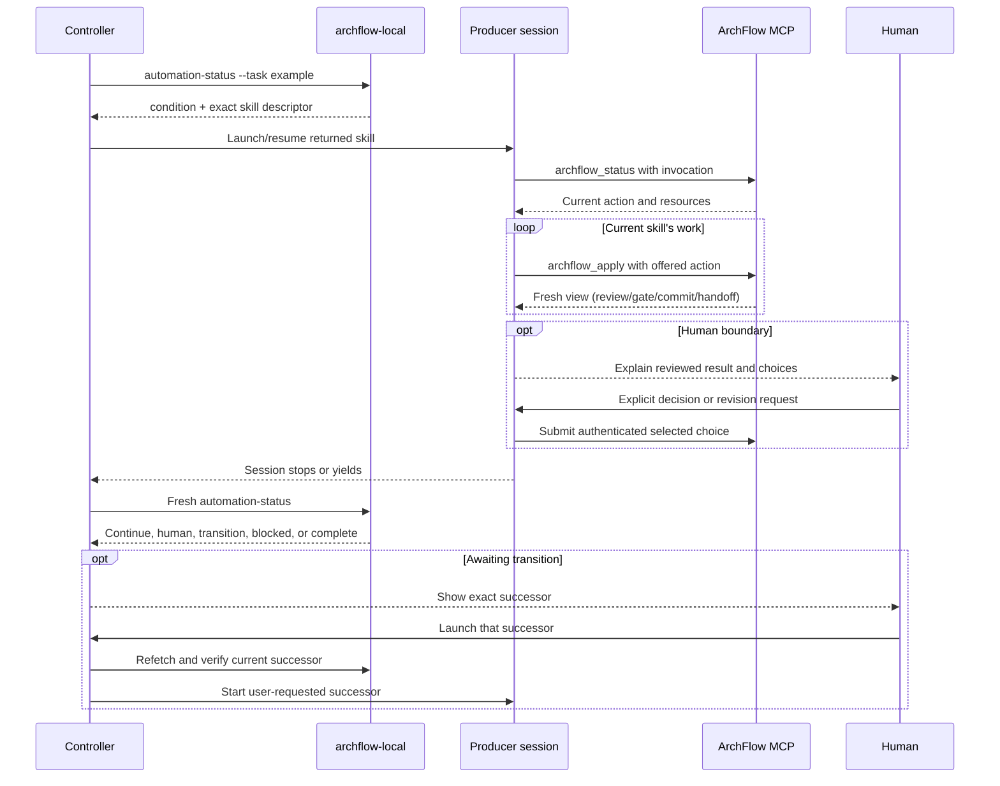

# ArchFlow integration guide for orchestration applications

**Explored:** 2026-09-15 · **Commit:** `9b035d0` · **Covers:** `src/review/simple-*.ts`, `src/contracts/simple-review.ts`, `src/local/`, `src/contracts/automation-status.ts`, `src/contracts/schemas/v1/automation-status-v3.schema.json`, `src/contracts/semantic-workflow.ts`, `src/contracts/evidence.ts`, `src/contracts/workflow-progress.ts`, `src/contracts/dispatch-failure.ts`, `src/contracts/effort-review.ts`, `src/dispatch/recovery.ts`, `src/state/semantic-*.ts`, `src/mcp/`, `src/repository/git.ts`, `src/init/`, `skills/`, `test/integration/automation-status-*.test.ts`, `package.json`

This is a self-contained integration brief for an application that orchestrates ArchFlow tasks. It describes the implemented interface, the controller behavior to build around it, and the boundaries that preserve human decisions. You can pass this file to an agent building that application. Source paths at the end are optional verification references; the architecture and operating rules are explained here.

## 1. Integration architecture

Minor corrections are normal producer work. At report triage, the producer can choose `revise-minor`, enter the returned revision window, run applicable checks, and submit `review_revision` with the actual classification and rationale. A localized clarification may reuse the prior review group once; substantive changes and coordinated rewrites return to review. Controllers continue following returned actions: this option requires no new configuration, approval dialog, or controller-side classification. Any returned human gate still requires the human's decision on the final bytes.

Use `archflow-local automation-status --task <task>` to observe a task, then handle its returned condition and exact skill descriptor in a supported coding-agent host. Current-skill work can resume automatically; a completed skill hands off to the human to launch its successor. ArchFlow already decides which workflow action is next. Your application supplies process supervision, session persistence, scheduling, and a human conversation interface.

| Component | Responsibility |
|---|---|
| External controller (your app) | Poll status; supervise one producer per task; resume current work and launch successors when the user requests them; connect humans to its session; report blocked or complete tasks. |
| Producer (interactive coding-agent session) | Follow the installed skill; author documents/code; run verification; use semantic tools; present human decisions; execute authenticated Git commit instructions. |
| ArchFlow MCP server | Authenticate durable workflow authority; offer the current action; validate submissions; dispatch independent reviewers; derive gates and commit facts. |
| Human | Supply the original task request and clarifications; decide every returned human gate or exception; launch each successor skill. |



A normal task proceeds through PRD, architecture design, then each phase's design and implementation. This is explanatory context, not a scheduler algorithm. Review, revision, recovery, and commit work can keep a task at the same position for many calls. Always use the returned action; never increment a phase number yourself.

## 2. Prerequisites and bootstrap

Run the controller command and producer in the intended primary Git worktree. The CLI discovers the repository from its working directory; it has no `--cwd` or polling `--repository` option. Set the child process's `cwd` explicitly.

This checkout requires Node `^24.15.0`, Git 2.25 or later, and a SHA-1 Git repository. The producer needs installed ArchFlow skills, access to both ArchFlow MCP tools, appropriate filesystem/Git permissions, and functioning credentials and executables for configured reviewers. Supported hosts are Claude Code, Codex, and Google Antigravity. Their launch/session APIs belong in your host adapter; ArchFlow does not publish a universal producer-launch command.

Installation and repository initialization are separate setup actions. `install.sh` places skills, launchers, and a bundle in shared machine-global locations. Run it only when the user explicitly requests that installation; do not install or update automatically on task launch. The `archflow-init` skill initializes repository assets and MCP registrations. Host trust or registration approval may require a human. Do not bypass it or use `init --force` as automatic repair. The CLI and MCP server must both support the split constitution layout before migrating a repository: shipped rules live in `default/` and repository additions or replacements in `custom/`. Forced initialization refreshes defaults from the running bundle, preserves custom rules, and also resets other scaffold files including repository config. Commit adopted policy for future tasks; existing tasks retain their pinned policy and pending decisions.

After setup, the polling command is:

```text
Executable: archflow-local
Arguments:  ["automation-status", "--task", "example"]
Working directory: /absolute/path/to/primary/worktree
Stdin: unused
```

For a checkout-local integration harness, `node /absolute/path/to/ArchFlow/dist/archflow-local.mjs automation-status --task example` runs the bundled command without installing. Keep its working directory set to the target repository. Use an aligned bundle, skills, and schema from the same revision; source changes do not automatically update a previously built bundle.

Task IDs are 1–64 characters matching `^[a-z0-9][a-z0-9._-]{0,63}$`, cannot end in a dot, and cannot be Windows reserved device names (including names such as `con.txt`). Prefer simple names such as `invoice-export`.

For a new task, retain the user's exact original request and supply it as conversation context to the first PRD session. The skill submits it through the offered `task-ask` action. The controller must not create `state.json`, a task directory, or a PRD to bootstrap authority. Repository initialization must already be in place.

## 3. Polling process contract

Each invocation emits one canonical JSON document on stdout. Read the complete stdout stream until process exit; do not depend on a trailing newline or parse it as progress events. Capture stderr separately.

- Exit `0`: a classified status, including `blocked` and `complete`. The JSON is the status object itself, with no `ok/value` wrapper.
- Nonzero exit: a structured `ok:false` project-error envelope on stdout and a concise diagnostic on stderr. Do not treat this envelope as a workflow status.
- Missing executable, timeout, invalid JSON, unsupported version, or invalid schema: integration/transport failure. Do not guess a successor.

`automation-status` requires `--task`, accepts no payload, rejects `--input`, and never reads stdin even if the parent keeps it open. It does not acquire a task lock, mutate workflow state, launch reviewers, open or answer gates, stage files, or commit.

The command currently emits **schema version `"3"`**. Its JSON Schema is `src/contracts/schemas/v1/automation-status-v3.schema.json`, with ID `urn:archflow:schema:v3:automation-status`; the enclosing directory name does not determine the protocol version. Validate with that schema and its referenced schemas from the same checkout, or use `parseAutomationStatusV3` from the source contract in a source-based integration. The older `parseAutomationStatus` alias parses v1; `parseAutomationStatusV2` retains v2. These are repository source exports, not a published client SDK.

Reject unsupported versions and unknown fields according to the versioned schema. Pin schema assets with your adapter and upgrade them deliberately. This guide's examples explain the contract; they do not replace its full runtime validator.

## 4. Status document

Every successful document contains:

| Field | Shape and meaning |
|---|---|
| `schema_version` | Literal string `"3"`. |
| `task_id` | Requested task ID; check that it matches your request. |
| `observation_id` | 64 lowercase hexadecimal characters identifying the SHA-256 observation; use for deduplication/change detection only. |
| `state_revision` | Nonnegative safe integer, or `null` when readable canonical state is absent. |
| `position` | `{ "kind": "prd" }`, `{ "kind": "design" }`, `{ "kind": "phase-design", "phase": N }`, or `{ "kind": "phase-impl", "phase": N }`. N is a positive safe integer. Certain blocked states use `null`. |
| `condition` | One of the five conditions in the table below. |
| `next_action` | Exactly one condition-specific action. |
| `implementation_recommendation` | Advisory model/effort result described below. |
| `progress` | Pipeline progress and responsibility, or `null` when no readable pipeline position exists. |

The condition fixes the actor and action kind:

| `condition` | `next_action.actor` | `next_action.kind` | Controller behavior |
|---|---|---|---|
| `awaiting-client` | `skill` | `continue-skill` | Keep the live producer; if absent, start/resume the returned owning skill. |
| `awaiting-human` | `human` | `respond-in-session` | Attach the human to the owning session, reconstructing it if needed. |
| `awaiting-transition` | `human` | `launch-skill` | Show the exact successor and wait for the user to launch it; refetch before that launch. |
| `blocked` | `operator` | `repair` | Suspend producer automation and surface the repair instruction. |
| `complete` | `none` | `none` | Stop the task loop. |

All actions have a nonblank `instruction`. The first three also contain `skill`, `task_id`, and `skill_args` (an array of strings). Repair and terminal actions do not contain a skill descriptor. Only `awaiting-human` contains `human_boundary`; only `blocked` contains `blocked`.

An illustrative new-task observation (the repeated-zero digest is a placeholder):

```json
{
  "schema_version": "3",
  "task_id": "invoice-export",
  "observation_id": "0000000000000000000000000000000000000000000000000000000000000000",
  "state_revision": null,
  "progress": null,
  "position": { "kind": "prd" },
  "condition": "awaiting-client",
  "next_action": {
    "actor": "skill",
    "kind": "continue-skill",
    "skill": "archflow-prd",
    "task_id": "invoice-export",
    "skill_args": [],
    "instruction": "Start the PRD skill for this task."
  },
  "implementation_recommendation": {
    "status": "unavailable",
    "reason": "not-applicable",
    "explanation": "No implementation phase applies to this observation."
  }
}
```

### Progress and skill transitions

`progress` contains `step` (`produce`, `counter_review`, `triage`, or `adjudicate`), `step_status` (`running`, `succeeded`, or `failed`), `review_rounds_completed`, `review_round_limit`, `boundary`, and a human-readable `reason`. Completed rounds are nonnegative safe integers; the limit is a positive safe integer, five by default. Boundary is `none`, `configured-approval`, `exception`, `step-transition`, `complete`, or `abandoned`. These fields explain activity; they do not authorize a launch, approval, or mutation. A pipeline step succeeding does not mean the skill finished.

Optional `progress.dispatch_recovery` has `status` (`retrying`, `exhausted`, or `repair-required`), `dispatches` (0–3), `maximum_dispatches:3`, and optionally `next_retry_at` (an ISO datetime). A transient retry remains `awaiting-client`; keep observing the current producer. Recovery is managed by the server, including after producer restart. Dispatch retries do not spend completed review rounds or reset the review budget.

`awaiting-transition` replaces v2's `ready` condition and changes the launch actor to `human`. There is no `human_boundary` on this condition: the user's launch of the named successor is the transition decision, not another content approval. The completed invocation stops. Show a launch action for that exact descriptor, and require a new user choice if fresh status names a different successor. Do not migrate a v2 controller by merely accepting the new version number.

### Human boundaries

`human_boundary` contains `source`, `class`, `headline`, `summary`, `question`, and `reasons`, where each reason is `{ "class": "configured-approval" | "exception", "text": "..." }`.

`source:"presentation"` describes a durable gate. Its class is `configured-approval` only when all reasons are ordinary configured approvals; otherwise it is `exception`. `source:"dispatch-failure"` is always exceptional and also contains `failed_role` and `failure_code`. The boundary accepts roles `counter-reviewer`, `test-reviewer`, `effort-reviewer`, and `adjudicator`; fresh effort-selector failures currently fall back internally instead of producing a human boundary.

Display the headline, summary, question, and explanatory reasons. The observation contains no decision token or selectable gate option. Route the actual human response to the owning interactive session, whose semantic view contains the authenticated choices. Do not turn a generic dashboard “approve” button into an automatic approval of whichever gate exists later. The session must bind the human's answer to its current presentation and ask again if the reviewed result or relevant choice changed.

The server retries positively classified transient reviewer failures twice on the same route, for three dispatches including the initial call. Rate limits, timeouts, recognized temporary transport failures, and unavailable repository views qualify. Missing credentials, invalid routes, invalid model output, cancellation, and generic process failures require intervention instead. Exhausted or repair-required failures produce the exceptional boundary; partial successful feedback remains available to the producer and successful siblings can be reused. The owning skill handles an explicitly authorized one-dispatch retry or substitute, with the human’s reason. The controller cannot silently substitute a reviewer or reset retry accounting.

### Blocked states

`blocked` is `{ "category": "...", "reasons": ["..."] }`. Categories are:

```text
inspect-state, resume-exact-intent, inspect-retained-receipt,
create-fresh-intent, resolve-current-authority, state-unreadable,
legacy-upgrade-staged, legacy-upgrade-restart-required,
archived-decision-invalid, revision-checkpoint-invalid,
waiver-origin-invalid, presentation-unavailable, commit-facts-unavailable
```

Use `next_action.instruction` for operator guidance. Do not convert category names into homegrown repair writes. A new task with no state and no staged import is valid PRD continuation. Staged legacy imports require the upgrade workflow; unreadable state is blocked, not a new task to overwrite.

### Advice and optional audit data

A ready implementation recommendation has `status:"ready"`, a catalog-defined `model`, optional `effort`, and an explanatory `rationale` for fresh assessments. Do not maintain a fixed model allowlist in consumers or invent an effort when omitted. The strict contract also retains historical advice shapes. Profile names are advisory identifiers, not a guarantee that a host supports them.

The V5 reviewer classifies remaining difficulty; server code selects against captured Terminal-Bench v4.0 scores, enabled profiles, and cost priorities. Defaults select GLM 5.3 Flash for routine/bounded reasoning, GLM 5.3 max for hard work, and Astra high for exceptional work. The rationale explains the reasoning, score, cost preference, and any fallback or shortfall. Existing recommendations remain fixed after settings or catalog edits. See `review/COUNTER-REVIEW.md` for configuration and selection details.

An unavailable recommendation has `status:"unavailable"`, `reason`, `explanation`, and an optional positive integer `phase`. Reasons are `not-applicable`, `not-produced`, `subject-stale`, `legacy-evidence`, and `selection-unavailable`. The last covers no enabled profile above the minimum or unusable selection data; it does not block the workflow.

The application may display advice or map it to a supported host launch profile. Advice never determines whether a launch is authorized or which skill is next. If the host cannot supply the suggested profile, use an explicitly configured application policy; do not invent model identifiers or interpret missing advice as workflow failure.

Optional `validation_overrides` and `review_push_throughs` arrays expose authenticated exception history or safe invalid/unavailable summaries. Validate their full shapes with the published schema. Granted validation overrides identify checks **not run**, not checks passed. Review push-throughs identify accepted review occurrences settled by a human exception. These audit fields can contain identifiers and digests; they are not mutation authority and never alter controller action selection.

## 5. Controller loop and durable session handling

The following is application pseudocode. `host.*`, the supervisor, and the schema validator are components your application implements, not ArchFlow APIs.

```text
on task registration, producer exit, human response, user launch request, or repository/config change:
    acquire application scheduler guard for (primary worktree, task ID)
    register guard release on every exit, including early returns and failures
    recover/reconcile saved host session identity and actual producer liveness
    status = run command; check exit, parse JSON, validate v3 and requested task ID

    if status.condition == blocked:
        suspend automatic producer work; show repair instruction; return
    if status.condition == complete:
        record terminal outcome using progress.boundary (complete or abandoned); return
    if status.condition == awaiting-human:
        attach to owning session, or reconstruct it using returned skill descriptor
        present boundary and wait for actual human input; return
    if status.condition == awaiting-transition:
        show exact successor and check for an explicit user launch request
        if no matching user request exists: return
    if a producer is still alive:
        keep observing; do not launch a second producer; return

    fresh = run and validate automation-status again immediately before launch
    if fresh.condition == awaiting-transition:
        require the user's launch request to match the fresh skill/task/arguments
        if absent or changed: show fresh successor and wait; return
    else if fresh.condition != awaiting-client:
        process fresh status through this handler; return
    reserve the producer slot atomically in the application supervisor
    host.start_or_resume(fresh.next_action descriptor, saved task context)
    persist host session identity and launch outcome; consume any matched launch request
    return
```

Human waits return control to the application; do not hold the scheduler guard while waiting for input. A successor launch starts a new invocation rather than resuming the completed skill’s session.

In the human branch, verify the attached session owns the returned skill/task/arguments. If a different producer is still alive, reconcile it before creating another session. A human wait is a live session state, not proof that the producer exited.

Maintain at most one live producer per task across controller workers and restarts. Persist primary worktree, task ID, exact original ask, host/session identity, current launch descriptor, invocation route declarations, and supervisor state. The observation ID is useful for display deduplication, but a changed ID is not a reason to launch another producer. Conversely, an unchanged ID must not suppress recovery after the producer dies.

The read-only command supplies no launch lease. A scheduler guard coordinates your own workers; the producer still rechecks server authority on entry. On controller restart, reconcile actual host processes/sessions before replacing one. A producer exit code or its prose saying “done” is not task completion: always poll again. Add application backoff and an operator-visible retry limit for repeated crashes or no progress; a retry limit grants no workflow authority.

A user-requested successor starts its own skill invocation; phase implementation uses a fresh session. Do not continue the completed producing invocation into the successor. Resume the owning session for ongoing work and human responses when possible. If it was lost, a fresh invocation reconstructs workflow context from the server's returned resources. Preserve the user's request and conversation needed to interpret pending input; do not preserve/replay opaque offers in controller storage.

Polling can invoke Git and hash worktree files. Prefer events plus a modest periodic fallback (roughly one or two seconds for a small active repository, adjusted to observed cost), with backoff while idle or blocked. A process timeout indicates uncertainty, not a workflow decision. Reviewer actions may run much longer than a status poll; host MCP registrations use a one-hour tool timeout.

Per-task serialization does not isolate two tasks writing the same checkout. A simple application should serialize writers per worktree, including overlapping writable secondary repositories, or provision appropriate isolated workspaces before starting tasks. Do not move active tasks between repositories by copying their internal state.

## 6. Skill launch adapter

Translate `next_action.skill`, `task_id`, and every string in `skill_args` into the host's native invocation syntax, preserving them exactly. These are skill invocations sent to a coding-agent session, not shell executables:

| Returned skill | Typical returned `skill_args` | Codex conversation invocation |
|---|---|---|
| `archflow-prd` | `[]` | `$archflow-prd invoice-export` |
| `archflow-design` | `[]` | `$archflow-design invoice-export` |
| `archflow-phase-design` | `["2"]` | `$archflow-phase-design invoice-export 2` |
| `archflow-phase-impl` | `["2"]` | `$archflow-phase-impl invoice-export 2` |
| `archflow-upgrade` | Preserve returned arguments | Resume the returned upgrade owner; do not invent a legacy source. |

Claude Code and Antigravity use `/archflow-…` instead of `$archflow-…`. The table's phase 2 is an example, never a default. `position` describes current workflow context; the launch descriptor is authoritative for the successor.

Pass executable arguments as an argument array and conversation text through the host's supported input channel. Avoid shell interpolation of `$archflow-…`, user text, or route values. Do not put unbounded prompts in a single argv element; use stdin or a workspace file where the host supports it.

An app can optionally append reviewer declarations after the returned positional arguments. A value is one argument shaped `model:effort[@provider]`:

| Producing skill | Accepted optional route flags |
|---|---|
| PRD / task design | `--counter-reviewer`, `--adjudicator` |
| Phase design | Those two plus `--test-reviewer`, `--effort-reviewer` |
| Phase implementation | `--counter-reviewer`, `--test-reviewer`, `--adjudicator` |

Omit flags to use task configuration and shipped defaults. Each flag can appear once; invalid routes fail rather than silently falling through. Supplied routes override configuration for that invocation and must remain identical through retries and significant revisions. Producer model selection and reviewer route declarations are separate settings.

## 7. What happens inside the producer

The controller integrates at the skill boundary. Each skill may perform many semantic actions before returning control. To understand or debug that inner loop, the initialized-workflow interface uses two tools (the separate `archflow_review` tool serves standalone work):

- `archflow_status`: read the reconciled view; a supported producing invocation may receive an opaque offer for its current action. Generic status receives no mutation offer.
- `archflow_apply`: apply exactly one issued offer with the expected submission and return a fresh view.

The MCP server is the `archflow-mcp` stdio process, not an HTTP service or command-oriented CLI. Automation status uses version `"3"`; semantic tool inputs use version `"1"`. Do not substitute one schema for the other.

Example producer status input:

```json
{
  "schema_version": "1",
  "task_id": "invoice-export",
  "invocation": {
    "skill": "archflow-phase-impl",
    "phase": 2,
    "intent": "resume"
  }
}
```

For an offered no-submission action, the producer's apply input is:

```json
{
  "schema_version": "1",
  "task_id": "invoice-export",
  "invocation": {
    "skill": "archflow-phase-impl",
    "phase": 2,
    "intent": "resume"
  },
  "action": { "offer": "<exact next_action.offer from this invocation>" }
}
```

The placeholder is not a valid offer. When requested, `submission` belongs inside `action`; its kind must match `next_action.expected_submission`. The supported submission kinds are `task-ask`, `work-result`, `triage`, `gate-summary`, `reopening-request`, `decision`, and `review-dispatch`; `none` means omit the submission entirely. Use the installed skill and advertised tool contract for the complete payload, not hand-built durable state envelopes. Repeat the invocation, including declared routes, unchanged. A lost, stale, or refused offer requires fresh status.

The producer applies the offered production/handoff action before writing, reads task artifacts only through returned `{role,path,access}` resources, and writes implementation code only after the server reports durable phase-design authority. It runs verification and lets the server dispatch independent review. Current reviews return `review_reports` whose fresh entries carry `outcome: issues_found | no_issues_found` and concise `feedback` (archived V4 entries retain `report` without inferred outcomes); the producer evaluates their evidence and submits a triage response to finish, revise, or escalate. A revision requires the separate offered revision action before editing. Archived structured findings retain their older disposition submission. Reports and partial feedback are available in the semantic view, not promised as fields of automation status; triage itself remains current-skill work unless an actual human boundary is returned. It stops for every returned human presentation and submits only an explicitly chosen authenticated option. No presentation means follow the returned action without inventing an approval gate.

Git remains producer-owned: only the semantic `commit` action supplies authorized paths, message, target ref, and baseline. The producer checks and executes those exact facts, preserves unrelated changes, then calls status to prove the commit. Neither an automation observation nor a clean review alone authorizes a commit. For multiple writable repositories, commits are proved primary first, then ordered secondaries; this is not an atomic cross-repository commit. A failure later in the sequence does not authorize undoing or repeating earlier proved commits. Context-only repositories remain read-only.

A custom app acting directly as the producer must implement all these skill obligations and the full semantic contract; two tool names alone are not a replacement producer SDK. The smaller polling-and-host adapter above is sufficient to orchestrate the existing workflow.

## 8. Recovery, human control, and completion

| Situation | Required integration behavior |
|---|---|
| Config or worktree changes between polls | Refetch; let the owning skill reconcile fresh authority. |
| Human session disconnected | Preserve pending conversation; resume/reconstruct the returned owner and refresh its presentation before submitting any answer. |
| Reviewer retry in progress | Keep observing the existing producer; the server owns retry scheduling and accounting. |
| Reviewer failure exhausted or repair-required | Surface the exceptional boundary; let the skill obtain a reason-bearing human-authorized retry or substitute. |
| `awaiting-transition` | Stop the completed invocation and wait for the user to launch the exact successor. |
| MCP tools unavailable | Owning skill uses read-only `archflow-local manual-status --task <task>` and stops. Do not advance, edit workflow artifacts, stage, or commit offline. |
| Legacy task needs adoption | Use `archflow-upgrade` with explicit legacy source and destination context; staging/adoption are a separate workflow, not polling repairs. |
| Human explicitly wants earlier planning reopened | Route that request to the relevant planning skill; do not rewind state or infer reopen from ordinary feedback. |
| Final implementation committed but status still awaits client | Resume the owning skill so it can apply the offered task-finish action. |
| `complete` | Inspect `progress.boundary`: `complete` means final planned implementation committed and task completion recorded; `abandoned` means the task ended without successful completion. QA, release, deployment, PR publication, and merging are separate actions. |

Raw `.archflow` state, archives, manifests, offers, and decision tokens are not controller APIs. Do not scrape Markdown status, infer authority from Git history, synthesize approval, or edit state to make progress. Observation IDs are not approvals, preconditions, locks, or mutation tokens. Human gate explanations should use ordinary language; mechanical bindings stay inside the producer/server interaction unless diagnostics are requested.

## 9. Integration acceptance checks

Before using a controller unattended, exercise these representative cases against an initialized disposable repository and controlled producer sessions:

1. A new task returns PRD ownership, and its session receives the exact original ask.
2. A running producer is never duplicated by repeated polls, concurrent scheduler workers, or controller restart.
3. A completed skill returns `awaiting-transition` with actor `human`; no successor launches until the user requests the exact fresh descriptor. Repeat through terminal completion without calculating phase order.
4. A configured approval stops for a real human response; a lost session reconstructs the current boundary without replaying an old decision.
5. Transient reviewer failure remains `awaiting-client` with retry progress and no duplicate producer; exhausted or repair-required failure requests human intervention. Blocked authority exposes operator instructions.
6. Producer crash, stale status, changed configuration, invalid JSON, unsupported version, and command failure trigger fresh observation or operator handling without fabricated progress.
7. Terminal outcome comes from fresh status, distinguishing completed from abandoned tasks. Current and historical model advice validate, with optional rationale only where allowed; advice and audit fields never change dispatch authority.

The repository covers CLI behavior and workflow outcomes in `test/integration/automation-status-*.test.ts`, versioned contracts in `test/contracts/automation-status-contract.test.ts`, projections in `test/unit/automation-status-projection.test.ts`, and retry accounting in `test/unit/dispatch-recovery.test.ts`. Some controller fixtures exercise retained v1/v2 contracts; use the v3 contract and CLI cases for current handoff expectations. Your app still needs tests for its own host adapter, supervision, crash recovery, and human-response routing.

## 10. Source references and maintenance

This file describes the source at the stamped commit, not a promise that an arbitrary installed binary has identical behavior. Keep it current when integration behavior changes.

| Source | What to verify |
|---|---|
| `src/contracts/automation-status.ts` and `src/contracts/schemas/v1/automation-status-v3.schema.json` | Strict status union, parser, schema, identity, and categories. |
| `src/local/main.ts`, `src/local/commands.ts`, `src/local/automation-status.ts`, `src/local/automation-status-edges.ts` | Process behavior, read-only projection, and absent/damaged-state handling. |
| `src/contracts/workflow-progress.ts`, `src/contracts/dispatch-failure.ts`, `src/dispatch/recovery.ts` | Progress shape, retry classification, and durable retry budget. |
| `src/contracts/effort-review.ts` | Current selector profiles and retained recommendation compatibility. |
| `src/contracts/semantic-workflow.ts`, `src/state/semantic-*.ts`, `src/mcp/tools.ts` | Producer inputs, server-owned actions, and advertised tools. |
| `skills/archflow-*/SKILL.md` | Exact host skill responsibilities and route flag support. |
| `test/integration/automation-status-*.test.ts` | Executable examples of polling and workflow outcomes. |
| `docs/contracts/AUTOMATION.md`, `docs/mcp/SERVER.md`, `docs/cli/COMMANDS.md` | Deeper subsystem explanations for maintainers. |

The external app to build consists of a strict status reader, a host session adapter, a serialized task supervisor, and a human conversation surface. Keep workflow decisions inside ArchFlow and treat the returned descriptor as the sole source of the next step.

## Implementation profile discovery

`archflow-local implementation-profiles --task <task>` is an input-free, read-only
catalog query for application launch settings. Its version `"1"` response contains
`task_id` and `profiles`: each has `profile_id`, `model`, optional `effort`, and
`enabled`. The command uses the same shipped catalog and effective task settings as
fresh assessments. Disabled profiles remain visible for configuring future use.
It never updates task state or changes retained recommendations. Errors use the
helper's existing nonzero-exit JSON error contract.

Consumers map model IDs to their own CLI, API provider and model/slot settings.
Catalog IDs and cost groups do not name installed API providers. An omitted effort
must not be replaced with a guessed value. Existing recommendations may name profiles
no longer in the current catalog; discovery is not launch authorization.

## Standalone simple-task integration

Use `archflow_review` for a single review pass outside durable workflows. Send `schema_version: "1"`, `stage: "plan" | "implementation"`, `ask`, `plan`, `base_commit` (the full starting HEAD), and `paths` (repository-relative files, including intended additions and deletions). Implementation also requires `verification`. Optional `review_routes` accepts counter-reviewer, test-reviewer, and adjudicator routes using the ordinary model/effort/provider shape. Carry the returned `policy_digest` into implementation as `expected_policy_digest`.

The call returns reports and policy judgments directly. Honor `human_review_reasons` conversationally, fix supported findings, and run relevant checks without automatically calling reviewers again. A successful response certifies completion of review coverage, not acceptance, execution, or human approval. `ok:false` can include partial reports. After a dispatch failure, an explicitly requested fresh call reruns reviewers; there is no resumable job or persisted sibling cache. Existing automation status and controller launch loops apply only to initialized workflows.
