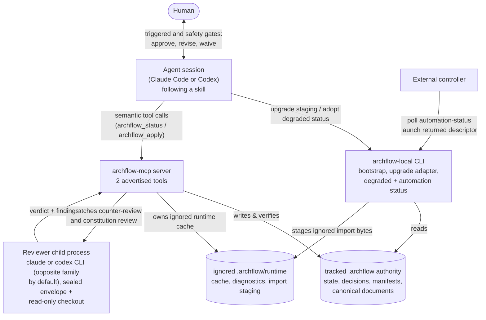
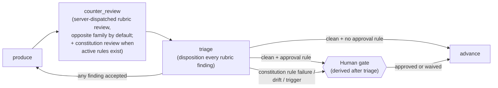

# OVERVIEW

**Explored:** 2026-08-31 · **Commit:** `fe0e4ce` · **Covers:** the whole repository

ArchFlow is a governed development workflow for AI coding agents. A *task* moves through fixed stages — PRD → design → per-phase design → per-phase implementation — and at every stage the agent must produce an artifact, review it, and survive an adversarial review dispatched to an independent reviewer CLI (the **other model family** by default, either family by explicit config). Project `approval_rules` decide which clean PRD, design, phase-design, or phase-implementation subjects stop for a human; changed-path content triggers add phase-implementation-only waits. Policy findings over those same reviewed bytes fold into that position's ordinary approval boundary, while distinct safety and recovery remedies remain separate unconditional gates. The system's core belief, stated plainly:

> **Nothing an agent says is trusted until the server has re-derived it.** The only authority is durable state on disk, written and verified by the server.

This documentation set describes the system as built, aimed at humans auditing and iterating on the workflow. Caps-named files (like this one) are the maintained, human-readable documentation, produced and refreshed by `/archflow-explore`. The one exception is `docs/validation/`: point-in-time validation evidence and benchmark data, not kept current by explore.

## The three surfaces

The system is one codebase with three faces. Understanding which face does what dissolves most confusion:

| Surface | What it is | What it's trusted with |
|---|---|---|
| **Skills** (`skills/archflow-*`) | Prose playbooks the agent follows (`/archflow-prd`, `/archflow-phase-impl`, …) | Nothing. They are instructions, not enforcement. |
| **`archflow-local` CLI** (`src/local/`) | Narrow local adapters: repository bootstrap, legacy-upgrade staging and atomic adoption, diagnostics, degraded human status, and a versioned read-only controller observation | Deriving mechanical fields correctly. Its writes are bounded recovery and diagnostics; automation status is strictly observational. |
| **`archflow-mcp` MCP server** (`src/mcp/`, `src/state/`, …) | A stdio MCP server advertising two purpose-described semantic workflow tools | Everything. It is the sole writer of durable state and the sole judge of validity. |

A subtlety worth naming immediately: the `archflow-mcp` binary has **no CLI mode** — it is always a stdio MCP server. The word "CLI" appears in two other senses: `archflow-local` (the helper above), and `src/dispatch/cli.ts`, which spawns the *external* `claude` and `codex` command-line tools as child processes to run counter-reviews.

## How the pieces connect

One client loop serves every workflow. PRD, task design, phase design, phase implementation, status reporting, and legacy adoption all use `archflow_status` for one reconciled, read-only view and `archflow_apply` for exactly one server-offered action. The offer hides revisions, digests, gate bindings, and request composition while keeping the client responsible for authored production and triage submissions. The one purpose-specific local adapter is the legacy upgrade: preview, stage, and atomic adoption run through `archflow-local upgrade` because the task does not exist yet at adoption time; everything after adoption is ordinary semantic surface. Git also remains client-owned: the semantic view returns exact authorized commit facts — plural path set, message, target ref, and baseline. Those facts already derive from either matching human approval or authenticated no-wait rule authority. The client verifies and stages exactly them, inspects the staged diff and message, creates the commit without another approval question, and asks read-only status to observe proof. The server never stages or commits repository bytes.

External controllers use a still smaller read-only view: `archflow-local automation-status --task <task>`. It projects the same reconciled semantic snapshot without an invocation, so it cannot mint an offer. The strict document identifies one actor—current skill, human, successor-launching orchestrator, repairing operator, or none—and supplies canonical task/phase arguments without asking the controller to infer phase order. The controller keeps at most one producer alive, returns human conversation to that owning session, and treats observation IDs only as freshness hints. Raw state and semantic decision tokens never become controller APIs; the complete contract is [`contracts/AUTOMATION.md`](contracts/AUTOMATION.md).

The boundary is intentionally exact. Generic `archflow_status` is a common read-only view and mints no mutation offer. A producing invocation can own only its current position, document or implementation phase, except that the exact server-named successor skill may finish an authenticated hand-off. One `archflow_apply` call executes one bounded offered action and returns a fresh view; it never chooses or loops into the next action.

Milestone proof and the current workflow baseline are separate facts. The server proves an authorized design or implementation milestone at the first commit after its bound baseline on the authorized target's first-parent history; ordinary descendant commits therefore do not erase completion or inherit the original review authority. Separately, projected bytes are reconciled against the current worktree. Eligible ordinary drift can be adopted or restored, but adoption is only acceptance of the current workflow baseline: it performs no review and grants no commit authority. Changed governing planning documents must instead be restored or re-enter their owning review boundary before dependent work can continue.

When history no longer proves the milestone, the server either retains the narrow unchanged no-wait design refresh, offers a same-position significant production/review recovery when a real committable delta exists, or returns an actionable inspection for corrupt evidence and content-preserving rewritten history. A stale baseline decision gets a server-owned refresh that replaces only its disposable interface and records no human choice. Both recovery actions are opaque, replay-safe, no-submission offers; clients never infer them from Git.

## The evidence pipeline

Every gated stage runs the same three-step pipeline until it reaches a fixed point — all evidence current, all findings dispositioned, no blockers:

The counter_review step is one semantic action that runs the configured rubric reviewers and, when active rules exist, the constitution reviewer. The children share sealed repository views and their results commit atomically. For implementation, declared outputs, co-produced documents, and their current behavior are the subject; unchanged files and context-only repositories are supporting evidence, not a general review target. Every finding must tie a material defect to behavior introduced, exposed, or worsened by the current change.

Design subjects may be compound so planning can correct their parents: task design binds `design.md` with current `prd.md`, and phase design binds its phase document with current `design.md` and `prd.md`. Once triage reaches a fixed point, the rule settlement decides whether the server opens a human gate or returns direct authority. `accepted` sends work back into produce; `accepted-editorial` permits a one-hop wording or formatting correction; `rejected` requires a rationale and closes the finding. Remediation sends only latest accepted intents to their owning reviewers, with the first configured reviewer handling an unattributed accepted finding. The cumulative ledger remains durable for audit and `review_strength`, not reviewer context. Constitution verdicts are never triaged.

Human gates are deliberately not protocol consoles. The server derives a title, plain-language summary, direct question, structured reason envelope, material evidence, and labeled choices; skills present that conversationally and keep IDs, hashes, JSON, paths, and error codes in the diagnostic layer. Each reason is classified `configured-approval` or `exception`, and one exceptional reason makes the whole boundary exceptional. The archived gate request—not the skill-authored summary or mutable live config—is the source for configured trigger provenance, policy findings, and legacy fallback. A skill-authored `gate-summary` opens the nonblocking presentation, and the human's selected choice and reason return through the offered semantic action, which archives the decision immutably and settles it in a separate substep — a retried call after an interruption converges without recording the decision twice. The server-dispatched review has already run automatically before the gate. If the human changes the work, the producer classifies the resulting diff: a simple wording or formatting change may reuse review evidence for one hop but still needs approval of the final bytes; a significant change resets the attempt counter and automatically starts a fresh counter-review and constitution-review cycle. The human can override either classification, with the override recorded.

Approval and rule evaluation are intentionally separate durable facts. The triage-settle transaction reads and evaluates live task config once and records a settlement at either a clean fixed point or a policy-adjudication fixed point. Every fresh ordinary gate carries an `approval_trigger`: normally it copies and identifies that exact settlement and its authenticated or unavailable rule authority; after a human-requested simple revision it instead binds the prior decision plus predecessor and final subject digests. Policy findings and exact eligible waivers travel in the same `artifact-approval`, `design-approval`, or `commit-authorization` context. A matching authenticated ordinary approval always outranks a coexisting `wait:false` settlement in commit, recovery, and phase-exit consumers; no-wait authority is autonomous only when no matching approval exists. Historical pre-trigger requests remain strictly readable and reconstructible without weakening fresh writers.

Editing the artifact changes its digest, which automatically invalidates every downstream review — you cannot sneak an edit past a stale approval. That mechanism (digests as identity) is the engine of the whole trust model; see `contracts/CONTRACTS.md`.

## Why each subsystem exists

- **Skills** — encode the workflow and its human gates as instructions any capable agent can follow. See `workflow/SKILLS.md`.
- **Workflow lifecycle & gates** — the phase graph, the ten gate kinds, and where a human must decide. See `workflow/LIFECYCLE.md`.
- **MCP server** — validates every request, owns all writes, and treats even the MCP SDK as untrusted for framing and output fidelity. See `mcp/SERVER.md`.
- **Dispatch** — runs the configured reviewer (opposite family by default, optionally through a cc-switch provider) as a locked-down child process so review evidence is something the producer *cannot author*. See `mcp/DISPATCH.md`.
- **Local CLI** — the retained adapters: repository bootstrap, legacy-upgrade staging and atomic adoption, diagnostics, the degraded human classifier, and the strict read-only automation observation. Every workflow action itself is composed server-side from one semantic offer, so the CLI never derives a durable request by hand. See `cli/COMMANDS.md` and `contracts/AUTOMATION.md`.
- **Review & constitution checks** — sealed 1 MiB envelopes, pinned context, the constitution review, waivers. See `review/COUNTER-REVIEW.md`.
- **Contracts** — canonical JSON, digests, plain-JSON validation, trust brands: the vocabulary everything else is written in. See `contracts/CONTRACTS.md`.
- **Durable state** — the `.archflow/` layout, the state machine, transactions, and recovery. See `state/DURABLE-STATE.md`.
- **Complexity audit** — where the heaviest machinery lives and what could be simplified, per subsystem. See `COMPLEXITY.md`.

## Glossary

- **Task** — one unit of work under `.archflow/tasks/<task>/`, fully isolated from other tasks.
- **Phase instance** — where a task is: `prd`, `design`, `phase-design-N`, or `phase-impl-N`.
- **Gate** — a durable, recorded human decision point. Ten kinds exist; approval is never inferred from conversation.
- **Digest / fingerprint** — SHA-256 identities. A *subject digest* names an artifact's exact bytes; an *input fingerprint* names everything a step depended on. Stale identity = invalid evidence.
- **Request digest** (`src/local/call-envelope.ts`) — the internal authentication wrapper around one composed durable request; semantic offers bind the same derivation without exposing it to the caller.
- **Dispatch envelope** (`src/review/envelopes.ts`) — the sealed, byte-capped evidence package handed to a child reviewer. *Same word, unrelated concepts* — a known naming collision.
- **Constitution** — versioned repository policy rules (`.archflow/constitution/`) that the constitution review — dispatched inside the offered review action when active rules exist — judges every artifact against, pinned per task at an approved commit.
- **Waiver** — a human-granted exemption from one rule version, for one subject digest, for one task. Evaporates if the artifact or the rule changes.
- **Degraded mode** — the read-only stance when the MCP server is unavailable: `manual-status` reports where the task stands and the answer is to wait; no offline recording exists, and it is never a shortcut around gates.
- **Automation observation** — the versioned, side-effect-free controller projection returned by `automation-status`; it names one responsible actor and is never mutation or approval authority.

## Durable authority versus local runtime

Git sees only the durable side of `.archflow/`: task documents, `state.json`, adopted initialization, current result manifests under `authority/results/`, and state-referenced gate decisions under `authority/decisions/`. The shipped `.archflow/.gitignore` contains only `/runtime/`; payload duplicates, rendered reviews and gate UI, verification transcripts, import staging, locks, transaction receipts, and attempts all live below that ignored root.

Repeated review rounds replace the current authority for a `(phase, step)` instead of accumulating tracked files. Automatic cleanup runs after successful writes and phase boundaries; `archflow-local clean --task <id>` retries it manually. Cleanup failure is non-blocking and appears as `workspace.cleanup_pending` in full status (and in brief status only while pending).

Phase-design review has one additional required child: a fixed `gpt-5.6-luna`/`xhigh` effort reviewer. The phase design supplies a strict implementation-component manifest, while the repository may supply `.archflow/hazards.yaml`. The server captures both, asks the child only for A–E judgments and classifications, then derives component and phase implementation profiles itself. Specification gaps and undifferentiated decomposition block the phase-design fixed point independently of ordinary findings; recommendations remain evidence and never select a producer, create approval, alter an offer, or authorize a commit.

That evidence now has one authenticated public projection. Phase-design completion, generic status, phase-implementation entry, and automation status v2 receive the same `ready`, `blocked`, or `unavailable` recommendation while the server-derived action remains unchanged. Reviewer provenance—including a conspicuous one-dispatch substitute—stays separate from the recommended implementation profile, and the actual producer route is explicitly not recorded. Live hazard-registry drift may add an informational caveat but cannot rewrite sealed evidence or workflow authority.

This split defines recovery honestly. A fresh clone reconstructs status, current result validation, and gate UI from tracked authority, verified projections, and recorded Git blobs. It recovers the last checked-in durable boundary, not uncommitted implementation or cache bytes. Durable `.archflow` files exist only on the working branch for resumability and are removed before the final product PR.
