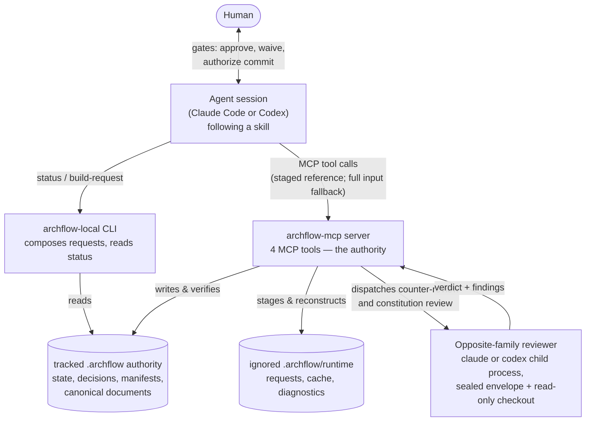
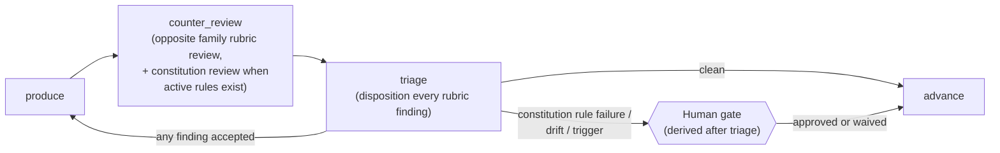

# OVERVIEW

**Explored:** 2026-08-12 · **Commit:** `247df34` · **Covers:** the whole repository

ArchFlow is a governed development workflow for AI coding agents. A *task* moves through fixed stages — PRD → design → per-phase design → per-phase implementation — and at every stage the agent must produce an artifact, review it, survive an adversarial review by a **different model family**, and then stop and ask a human. The system's core belief, stated plainly:

> **Nothing an agent says is trusted until the server has re-derived it.** The only authority is durable state on disk, written and verified by the server.

This documentation set describes the system as built, aimed at humans auditing and iterating on the workflow. Caps-named files (like this one) are the maintained, human-readable documentation, produced and refreshed by `/archflow-explore`. The one exception is `docs/validation/`: point-in-time validation evidence and benchmark data, not kept current by explore.

## The three surfaces

The system is one codebase with three faces. Understanding which face does what dissolves most confusion:

| Surface | What it is | What it's trusted with |
|---|---|---|
| **Skills** (`skills/archflow-*`) | Prose playbooks the agent follows (`/archflow-prd`, `/archflow-phase-impl`, …) | Nothing. They are instructions, not enforcement. |
| **`archflow-local` CLI** (`src/local/`) | A local helper that *composes* requests and reads status — including a read-only classification when the server is down | Deriving mechanical fields correctly. It writes almost nothing. |
| **`archflow-mcp` MCP server** (`src/mcp/`, `src/state/`, …) | A stdio MCP server exposing four tools | Everything. It is the sole writer of durable state and the sole judge of validity. |

A subtlety worth naming immediately: the `archflow-mcp` binary has **no CLI mode** — it is always a stdio MCP server. The word "CLI" appears in two other senses: `archflow-local` (the helper above), and `src/dispatch/cli.ts`, which spawns the *external* `claude` and `codex` command-line tools as child processes to run counter-reviews.

## How the pieces connect

The loop the agent lives in is simple: run `archflow-local status --task <task>`, get **exactly one** `next_action`, compose the request for it with `archflow-local build-request`, call the matching MCP tool with the returned four-field staged reference (`{schema_version, task_id, intent_id, request_digest}` — the server rehydrates the staged bytes and fails closed on any mismatch; copying `request.input` verbatim is the fallback), repeat. The agent supplies judgment (findings, rationales, prose); the tooling supplies every mechanical field (digests, fingerprints, revisions, routing).

## The evidence pipeline

Every gated stage runs the same three-step pipeline until it reaches a fixed point — all evidence current, all findings dispositioned, no blockers:

The counter_review step is one tool call and up to two server-run dispatches: the rubric review (read-only checkout at a pinned commit) and, only when the pinned constitution has active rules — the server decides, never the agent — the constitution review (sealed envelope, no checkout). Both results commit in one atomic transaction. Self-review is not a durable step: the producing agent reviews its own draft as ordinary sub-agent work inside produce, before the artifact's bytes are ever recorded. Triage has three dispositions: `accepted` sends the work back into produce; `accepted-editorial` (non-blocking wording/formatting fixes only) lets the artifact be revised under a server-validated one-hop predecessor link with **nothing re-run** — retained reviews and the constitution verdict stay bound to the predecessor, disclosed at the gate; `rejected` requires a written rationale. Constitution verdicts are never triaged: a rule failure, material drift, or matched trigger opens a human gate after triage.

Human gates are deliberately not protocol consoles. The server composes a title, plain-language summary, direct question, material evidence, and labeled choices; skills present that conversationally and keep IDs, hashes, JSON, paths, and error codes in the diagnostic layer. The opposite-client review has already run automatically before the gate. If the human changes the work, the producer classifies the resulting diff: a simple wording or formatting change may reuse review evidence for one hop but still needs approval of the final bytes; a significant change resets the attempt counter and automatically starts a fresh counter-review and constitution-review cycle. The human can override either classification, with the override recorded.

Editing the artifact changes its digest, which automatically invalidates every downstream review — you cannot sneak an edit past a stale approval. That mechanism (digests as identity) is the engine of the whole trust model; see `contracts/CONTRACTS.md`.

## Why each subsystem exists

- **Skills** — encode the workflow and its human gates as instructions any capable agent can follow. See `workflow/SKILLS.md`.
- **Workflow lifecycle & gates** — the phase graph, the nine gate kinds, and where a human must decide. See `workflow/LIFECYCLE.md`.
- **MCP server** — validates every request, owns all writes, and treats even the MCP SDK as untrusted for framing and output fidelity. See `mcp/SERVER.md`.
- **Dispatch** — runs the opposite-family reviewer as a locked-down child process so review evidence is something the producer *cannot author*. See `mcp/DISPATCH.md`.
- **Local CLI** — exists because hand-transcribing mechanical fields was the dominant source of errors; `build-request` is "the one documented door." See `cli/COMMANDS.md`.
- **Review & constitution checks** — sealed 1 MiB envelopes, pinned context, the constitution review, waivers. See `review/COUNTER-REVIEW.md`.
- **Contracts** — canonical JSON, digests, plain-JSON validation, trust brands: the vocabulary everything else is written in. See `contracts/CONTRACTS.md`.
- **Durable state** — the `.archflow/` layout, the state machine, transactions, and recovery. See `state/DURABLE-STATE.md`.
- **Complexity audit** — where the heaviest machinery lives and what could be simplified, per subsystem. See `COMPLEXITY.md`.

## Glossary

- **Task** — one unit of work under `.archflow/tasks/<task>/`, fully isolated from other tasks.
- **Phase instance** — where a task is: `prd`, `design`, `phase-design-N`, or `phase-impl-N`.
- **Gate** — a durable, recorded human decision point. Nine kinds exist; approval is never inferred from conversation.
- **Digest / fingerprint** — SHA-256 identities. A *subject digest* names an artifact's exact bytes; an *input fingerprint* names everything a step depended on. Stale identity = invalid evidence.
- **Call envelope** (`src/local/call-envelope.ts`) — the authentication wrapper around one outgoing MCP tool call.
- **Dispatch envelope** (`src/review/envelopes.ts`) — the sealed, byte-capped evidence package handed to a child reviewer. *Same word, unrelated concepts* — a known naming collision.
- **Constitution** — versioned repository policy rules (`.archflow/constitution/`) that the constitution review — run inside `archflow_counter_review` when active rules exist — judges every artifact against, pinned per task at an approved commit.
- **Waiver** — a human-granted exemption from one rule version, for one subject digest, for one task. Evaporates if the artifact or the rule changes.
- **Degraded mode** — the read-only stance when the MCP server is unavailable: `manual-status` reports where the task stands and the answer is to wait; no offline recording exists, and it is never a shortcut around gates.

## Durable authority versus local runtime

Git sees only the durable side of `.archflow/`: task documents, `state.json`, adopted initialization, current result manifests under `authority/results/`, and state-referenced gate decisions under `authority/decisions/`. The shipped `.archflow/.gitignore` contains only `/runtime/`; staged requests, payload duplicates, rendered reviews and gate UI, verification transcripts, import staging, locks, receipts, and attempts all live below that ignored root.

Repeated review rounds replace the current authority for a `(phase, step)` instead of accumulating tracked files. Automatic cleanup runs after successful writes and phase boundaries; `archflow-local clean --task <id>` retries it manually. Cleanup failure is non-blocking and appears as `workspace.cleanup_pending` in full status (and in brief status only while pending).

This split defines recovery honestly. A fresh clone reconstructs status, current result validation, and gate UI from tracked authority, verified projections, and recorded Git blobs. It recovers the last checked-in durable boundary, not uncommitted implementation or cache bytes. Durable `.archflow` files exist only on the working branch for resumability and are removed before the final product PR.
