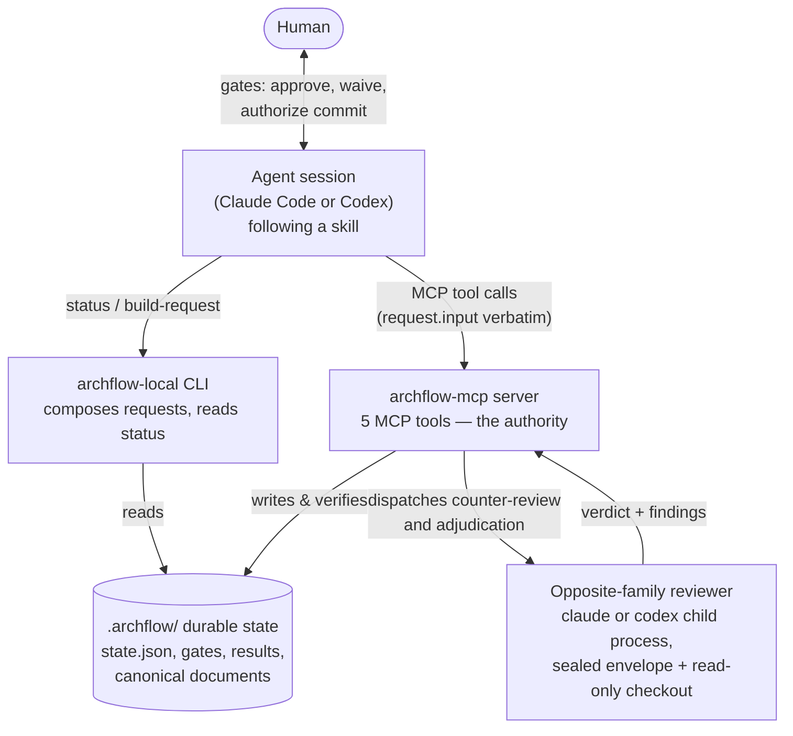
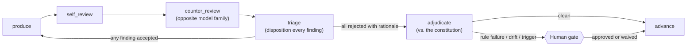

# OVERVIEW

ArchFlow is a governed development workflow for AI coding agents. A *task* moves through fixed stages — PRD → design → per-phase design → per-phase implementation — and at every stage the agent must produce an artifact, review it, survive an adversarial review by a **different model family**, and then stop and ask a human. The system's core belief, stated plainly:

> **Nothing an agent says is trusted until the server has re-derived it.** The only authority is durable state on disk, written and verified by the server.

This documentation set describes the system as built, aimed at humans auditing and iterating on the workflow. Caps-named files (like this one) are the maintained, human-readable documentation. Lowercase files in `docs/` are historical working documents from the project's own development.

## The three surfaces

The system is one codebase with three faces. Understanding which face does what dissolves most confusion:

| Surface | What it is | What it's trusted with |
|---|---|---|
| **Skills** (`skills/archflow-*`) | Prose playbooks the agent follows (`/archflow-prd`, `/archflow-phase-impl`, …) | Nothing. They are instructions, not enforcement. |
| **`archflow-local` CLI** (`src/local/`) | A local helper that *composes* requests, reads status, and runs the degraded-mode fallback | Deriving mechanical fields correctly. It writes almost nothing. |
| **`archflow-mcp` MCP server** (`src/mcp/`, `src/state/`, …) | A stdio MCP server exposing five tools | Everything. It is the sole writer of durable state and the sole judge of validity. |

A subtlety worth naming immediately: the `archflow-mcp` binary has **no CLI mode** — it is always a stdio MCP server. The word "CLI" appears in two other senses: `archflow-local` (the helper above), and `src/dispatch/cli.ts`, which spawns the *external* `claude` and `codex` command-line tools as child processes to run counter-reviews.

## How the pieces connect

The loop the agent lives in is simple: run `archflow-local status --task <task>`, get **exactly one** `next_action`, compose the request for it with `archflow-local build-request`, call the matching MCP tool with the returned `request.input` copied verbatim, repeat. The agent supplies judgment (findings, rationales, prose); the tooling supplies every mechanical field (digests, fingerprints, revisions, routing).

## The evidence pipeline

Every gated stage runs the same five-step pipeline until it reaches a fixed point — all evidence current, all findings dispositioned, no blockers:

Editing the artifact changes its digest, which automatically invalidates every downstream review — you cannot sneak an edit past a stale approval. That mechanism (digests as identity) is the engine of the whole trust model; see `contracts/CONTRACTS.md`.

## Why each subsystem exists

- **Skills** — encode the workflow and its human gates as instructions any capable agent can follow. See `workflow/SKILLS.md`.
- **Workflow lifecycle & gates** — the phase graph, the nine gate kinds, and where a human must decide. See `workflow/LIFECYCLE.md`.
- **MCP server** — validates every request, owns all writes, and treats even the MCP SDK as untrusted for framing and output fidelity. See `mcp/SERVER.md`.
- **Dispatch** — runs the opposite-family reviewer as a locked-down child process so review evidence is something the producer *cannot author*. See `mcp/DISPATCH.md`.
- **Local CLI** — exists because hand-transcribing mechanical fields was the dominant source of errors; `build-request` is "the one documented door." See `cli/COMMANDS.md`.
- **Review & adjudication** — sealed 1 MiB envelopes, pinned context, constitution checks, waivers. See `review/COUNTER-REVIEW.md` and `review/ADJUDICATION.md`.
- **Contracts** — canonical JSON, digests, plain-JSON validation, trust brands: the vocabulary everything else is written in. See `contracts/CONTRACTS.md`.
- **Durable state** — the `.archflow/` layout, the state machine, transactions, and recovery. See `state/DURABLE-STATE.md`.
- **Complexity audit** — where the heaviest machinery lives and what could be simplified, per subsystem. See `COMPLEXITY.md`.

## Glossary

- **Task** — one unit of work under `.archflow/tasks/<task>/`, fully isolated from other tasks.
- **Phase instance** — where a task is: `prd`, `design`, `phase-design-N`, or `phase-impl-N`.
- **Gate** — a durable, recorded human decision point. Nine kinds exist; approval is never inferred from conversation.
- **Digest / fingerprint** — SHA-256 identities. A *subject digest* names an artifact's exact bytes; an *input fingerprint* names everything a step depended on. Stale identity = invalid evidence.
- **Call envelope** (`src/local/envelope.ts`) — the authentication wrapper around one outgoing MCP tool call.
- **Dispatch envelope** (`src/review/envelopes.ts`) — the sealed, byte-capped evidence package handed to a child reviewer. *Same word, unrelated concepts* — a known naming collision.
- **Constitution** — versioned repository policy rules (`.archflow/constitution/`) that the adjudicator judges every artifact against, pinned per task at an approved commit.
- **Waiver** — a human-granted exemption from one rule version, for one subject digest, for one task. Evaporates if the artifact or the rule changes.
- **Degraded mode** — the manual checkpoint workflow used when the MCP server is unavailable; progress is recorded locally and folded back in later. Never a shortcut around gates.
