# ArchFlow Process

## Overall Workflow

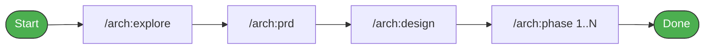

Each command has a human review gate -- nothing proceeds without your approval. See command details below for full flows.

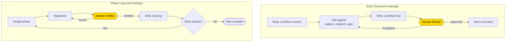

---

## File System

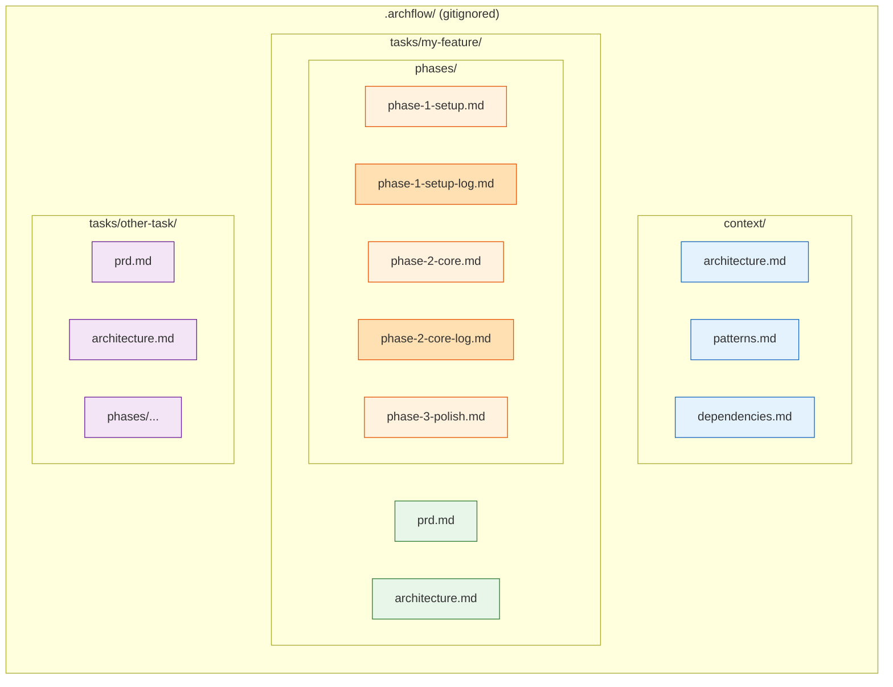

- **Blue**: Shared context (reused across all tasks)
- **Green**: Task-level docs (PRD, architecture)
- **Orange**: Phase design docs + companion log files (log written on phase completion, read by subsequent phases)
- **Purple**: Independent tasks (fully isolated from each other)

---

## Context Passing

Every command (except `/arch:explore`, which creates context) follows this pattern:

1. **Main agent reads key `.archflow/` files** -- for control flow decisions (does the PRD exist? what's the phase status?) and to gather context
2. **Passes relevant context to sub-agents** -- when spawning Explore, Research, or Plan agents, the main agent includes the necessary context in each agent's prompt

No separate context-gathering step is needed. The main agent reads the files directly and includes the relevant parts when spawning downstream agents.

**What each command reads:**

| Command | Files Read | Passed to Sub-Agents |
|---------|-----------|---------------------|
| `/arch:prd` | prd.md (check if exists), context/* | User requirements + codebase context summary |
| `/arch:design` | prd.md (required), architecture.md (if revising), context/* | PRD requirements/constraints + codebase context |
| `/arch:phase` | architecture.md (required), phase-N doc (check status), ALL prior phase docs + ALL prior log files, context/* | Phase definition + prior phase learnings (decisions, patterns, interfaces, gotchas) |
| `/arch:status` | architecture.md, phase docs (for status) | N/A (no sub-agents) |

---

## Command Details

### `/arch:explore`

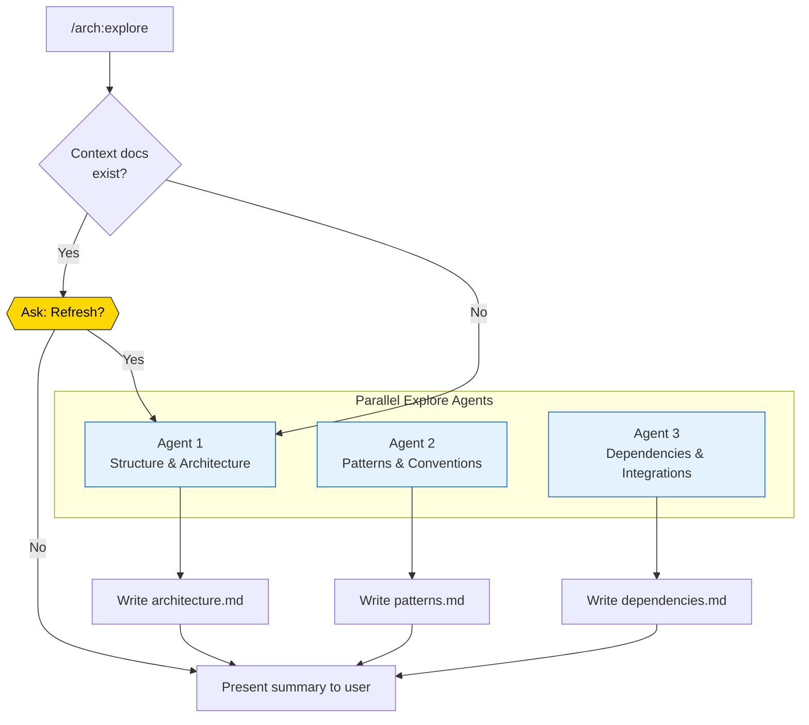

**Agents**: 3x general-purpose (parallel, explore + write)
**Output**: `.archflow/context/{architecture,patterns,dependencies}.md`
**When to run**: Before starting tasks on an existing codebase. Re-run after major refactors.

---

### `/arch:prd <task-name>`

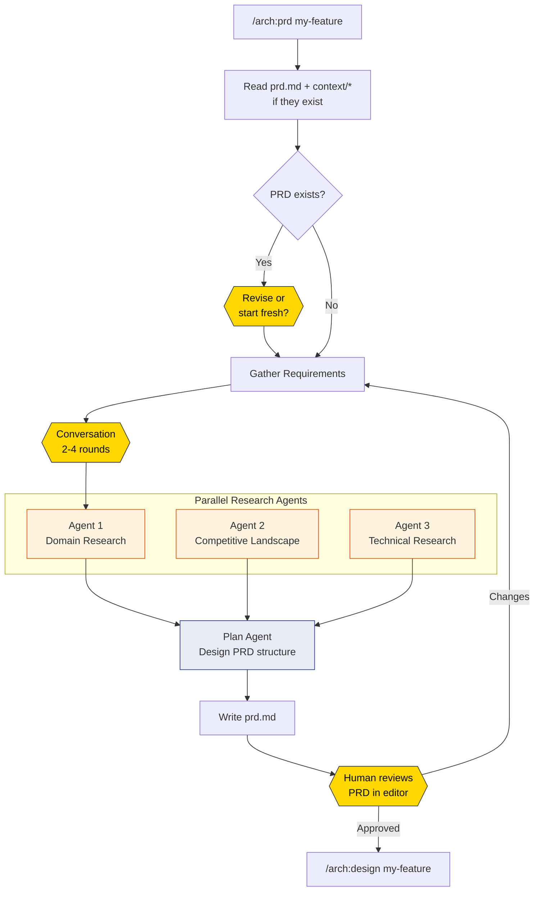

**Agents**: 2-3x general-purpose (parallel research) + 1x general-purpose (plan + write PRD)
**Output**: `.archflow/tasks/{task}/prd.md`
**Context read**: `.archflow/context/*` (if available)

---

### `/arch:design <task-name>`

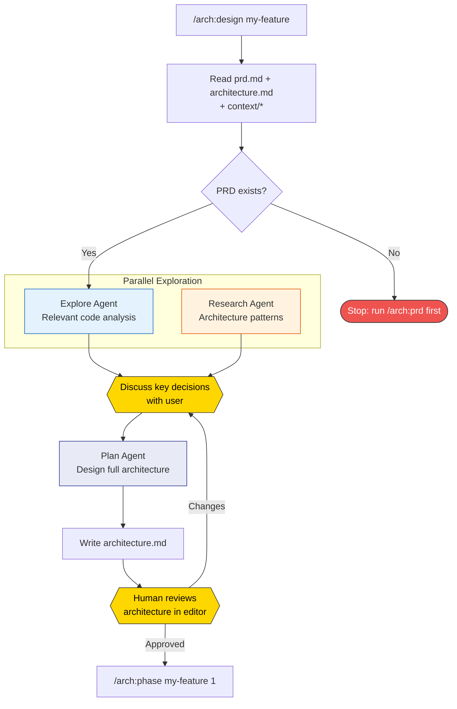

**Agents**: 1x Explore + 0-1x general-purpose (research) + 1x general-purpose (plan + write architecture)
**Output**: `.archflow/tasks/{task}/architecture.md`
**Context read**: `.archflow/tasks/{task}/prd.md` + `.archflow/context/*`

---

### `/arch:phase <task-name> N`

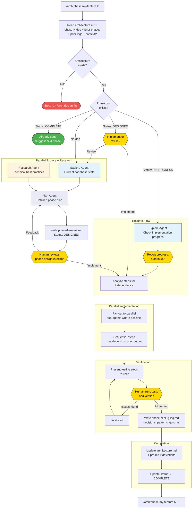

**Agents**: 1x Explore + 0-1x general-purpose (research) + 1x general-purpose (plan + write phase doc) + Nx general-purpose (parallel implementation)
**Output**: `.archflow/tasks/{task}/phases/phase-N-{slug}.md` + `phase-N-{slug}-log.md` + actual code
**Context read**: architecture.md + prd.md + ALL prior phase docs + ALL prior log files + `.archflow/context/*`

---

## Sub-Agent Map

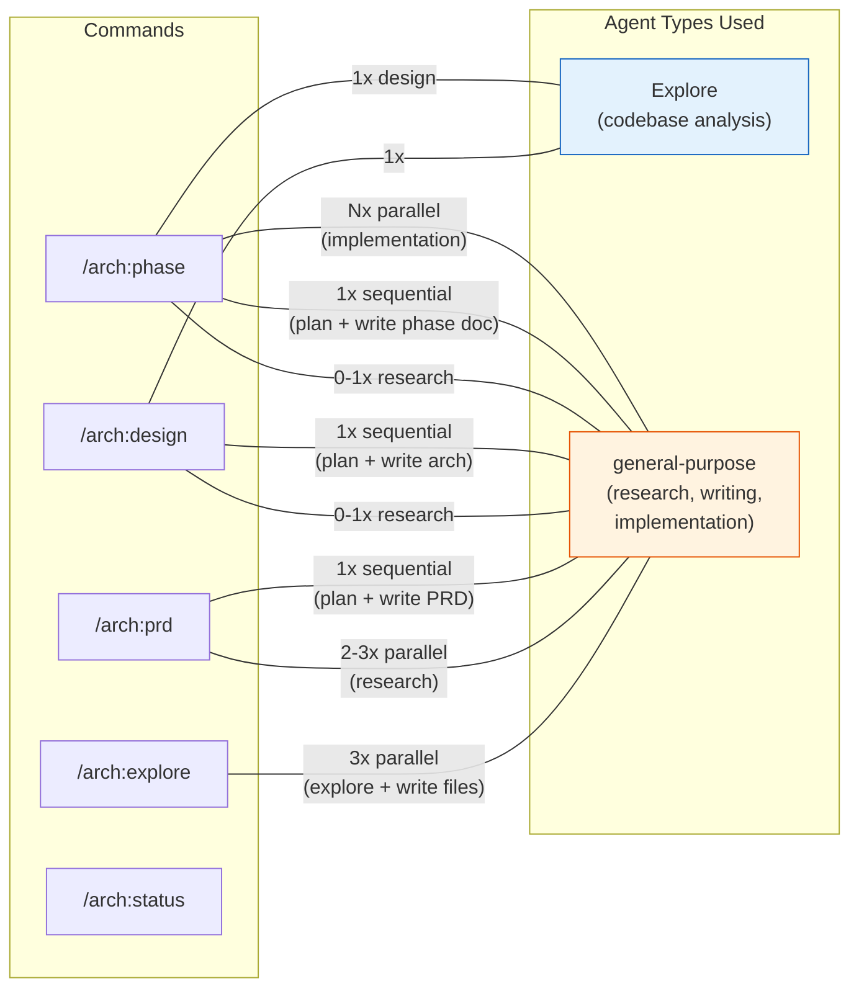

---

## Context Flow Between Sessions

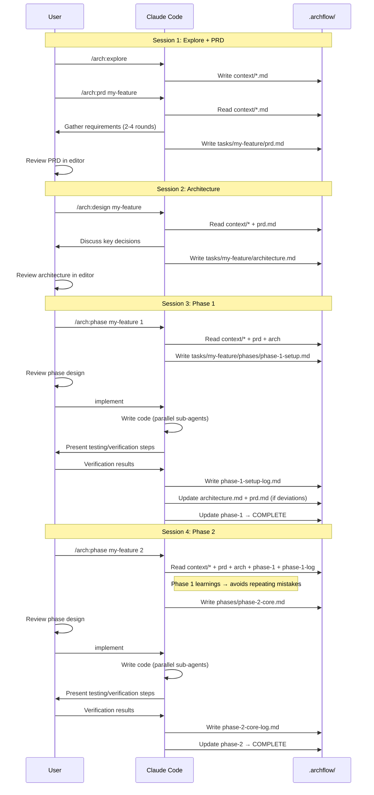

Each session only reads what it needs. The `.archflow/` docs **are** the context -- no separate state files.

---

## Phase State Machine

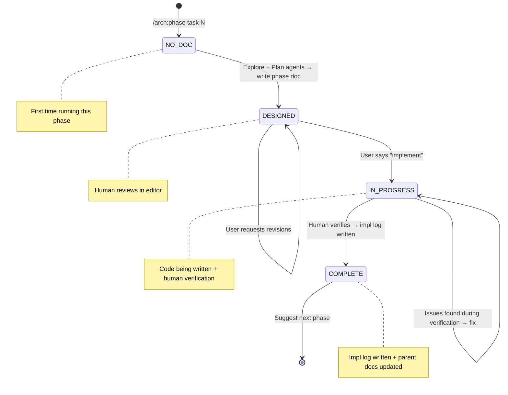

---

## Implementation Log (Inter-Phase Learning)

Each completed phase gets a companion **log file** at `phase-N-{slug}-log.md`. This is how phases learn from each other.

```markdown
## Implementation Log

### Decisions Made
- Chose Zod over Joi for validation: Zod has native TypeScript inference, Joi required separate type definitions
- Used a single `errors` table instead of per-module tables: simpler queries, one place to check

### Deviations from Plan
- Planned separate `AuthService` class, built as plain functions instead: the class had no state, functions were simpler and easier to test
- Added `retry` wrapper to API client: external service was flaky during testing, needed exponential backoff

### Patterns Established
- Error handling: all service functions return `Result<T, AppError>` -- no thrown exceptions past the service boundary
- DB queries: use repository pattern in `src/repos/`, one file per entity, raw SQL via Kysely

### Gotchas
- SQLite doesn't enforce VARCHAR length -- validation must happen in application code
- `bcrypt.hash()` returns a different length depending on the salt rounds config -- the `password_hash` column needs VARCHAR(72) minimum

### Key Interfaces
- `src/repos/user-repo.ts`: exports `createUser()`, `findByEmail()`, `findById()` -- phase 2 auth flow should use these, not query directly
- `src/lib/result.ts`: exports `Result<T, E>`, `ok()`, `err()` -- all service functions must use this pattern
```

**How it flows:**
- Phase 1 completes → log written to `phase-1-setup-log.md` → architecture.md and prd.md updated if deviations occurred
- Phase 2 starts → reads ALL prior phase docs AND their log files
- Phase 2's Plan Agent receives these learnings as input → avoids repeating mistakes, reuses established patterns, builds on actual interfaces (not just planned ones)
- The architecture doc stays accurate because each phase updates it on completion — remaining phase definitions reflect reality, not the original guess

Separate file keeps the design doc clean and the log focused. The naming convention (`-log.md` suffix) makes it easy to glob for all logs.

---

## Verification Flow

After implementation, before marking COMPLETE, the phase goes through verification:

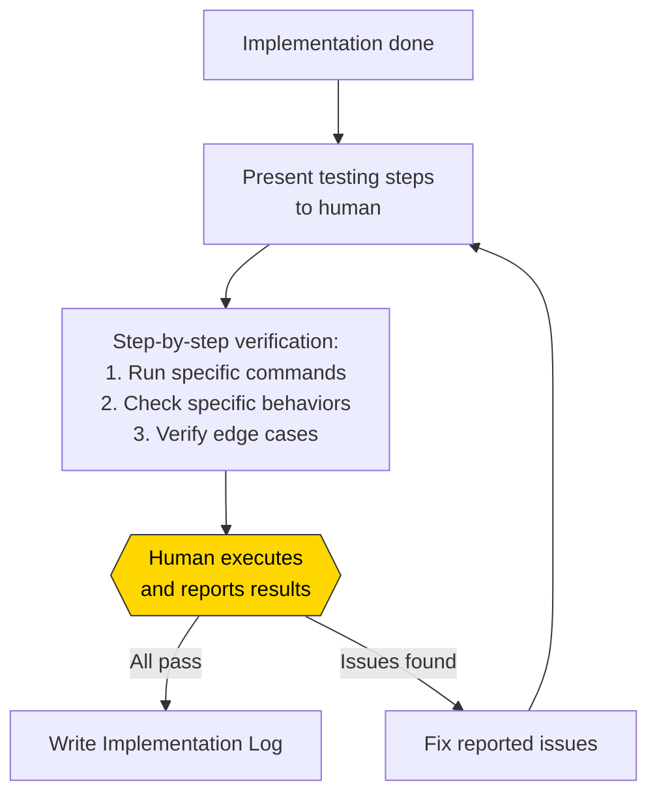

Testing steps are **specific and actionable** -- not "verify it works" but concrete commands, URLs to check, behaviors to observe. The human acts as the verification layer, and any issues feed back into the implementation before the phase closes.

---

## Task Independence

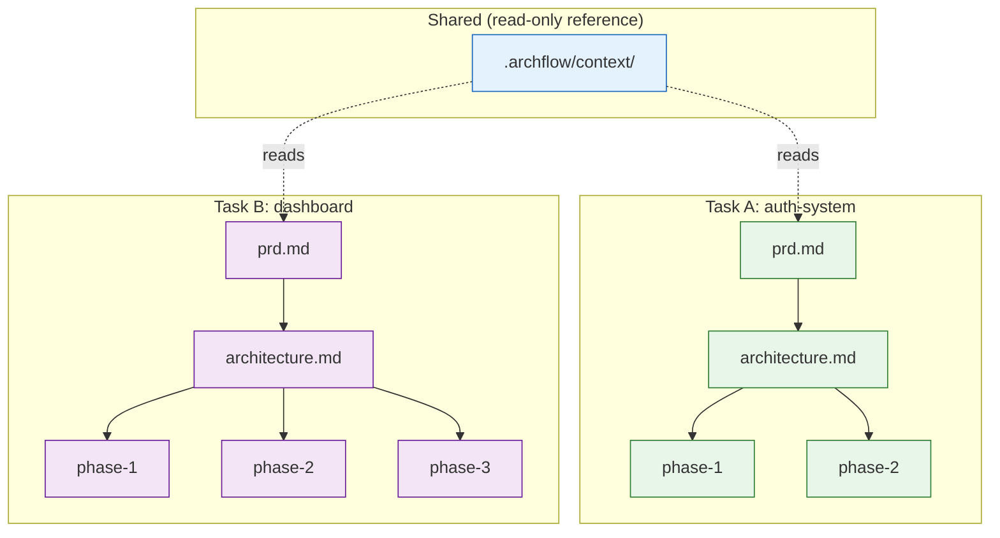

Tasks never read each other's files. Deleting one task has zero impact on others. Context docs are shared but read-only -- they inform, they don't couple.
