# ArchFlow Process

## Overall Workflow

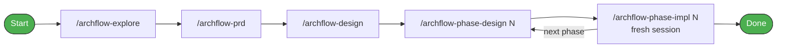
```mermaid
flowchart LR
    Start([Start]) --> Explore["/archflow-explore"]
    Explore --> PRD["/archflow-prd"]
    PRD --> Design["/archflow-design"]
    Design --> PhaseDesign["/archflow-phase-design N"]
    PhaseDesign --> PhaseImpl["/archflow-phase-impl N<br/>fresh session"]
    PhaseImpl -->|next phase| PhaseDesign
    PhaseImpl --> Done([Done])

    style Start fill:#4CAF50,stroke:#333,color:#fff
    style Done fill:#4CAF50,stroke:#333,color:#fff
```

Each skill has a human review gate -- nothing proceeds without your approval. Before a document reaches that gate, fresh-context sub-agents have already critiqued and revised it; at the gate, the skill also emits a ready-to-paste **counter-review prompt** for the other client (Claude Code ↔ Codex), whose findings land in `reviews/` and are triaged explicitly. See skill details below for full flows.

Every reviewed artifact carries a **rubric** with a human review-time budget — a PRD reads in 5–10 minutes, an architecture in under 10 — given to both writer and reviewer agents, so drafts are held to the bar before the gate rather than pulled back at it. Phase designs and implementation logs are written primarily for the machine that consumes them next.

Two constraints keep that machinery from running away. Reviewers are held to a **materiality bar** — only findings that change what gets built, at two severities (blocker, major); wording and polish are never findings, and a second round runs only when revisions changed the document's shape. And every design is held to the PRD's **operating envelope** — the scale, criticality, and threat model the product actually faces — so complexity nothing in the requirements pays for is treated as a defect.


```mermaid
flowchart TD
    subgraph "Each Document Skill Internally"
        Read[Read .archflow/ context] --> Agents[Sub-agents<br/>explore, research, plan]
        Agents --> Output[Write .archflow/ doc]
        Output --> SelfReview[Sub-agent review:<br/>critique, triage, revise]
        SelfReview --> Review{{Human Review<br/>+ counter-review prompt offered}}
        Review -->|Feedback| Agents
        Review -->|Counter-review findings<br/>in reviews/| Triage[Triage: accept & revise<br/>or reject with reason]
        Triage --> Review
        Review -->|Approved| Next[Next skill]
    end

    subgraph "Phase Loop (two skills, two sessions)"
        Design2["/archflow-phase-design:<br/>design + review loops"] --> Gate{{Design approved}}
        Gate --> Impl["/archflow-phase-impl (fresh session):<br/>implement via sub-agent delegation"]
        Impl --> AgentVerify[Agent verifies:<br/>tests, build, drive the flow]
        AgentVerify --> Verify{{Human reviews evidence<br/>+ impl counter-review offered}}
        Verify -->|Issues or findings| Impl
        Verify -->|Verified| Log[Write impl log]
        Log --> More{More phases?}
        More -->|Yes| Design2
        More -->|No| Done2([Task complete])
    end

    style Review fill:#ffd700,stroke:#333,color:#000
    style Gate fill:#ffd700,stroke:#333,color:#000
    style Verify fill:#ffd700,stroke:#333,color:#000
```

---

## File System

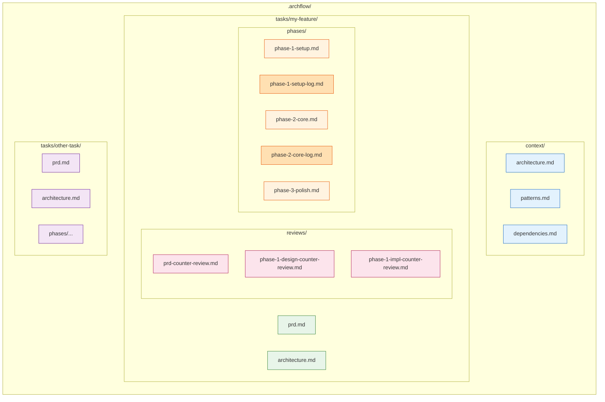
```mermaid
flowchart LR
    subgraph ".archflow/"
        subgraph "context/"
            A1[architecture.md]
            A2[patterns.md]
            A3[dependencies.md]
        end
        subgraph "tasks/my-feature/"
            B1[prd.md]
            B2[architecture.md]
            subgraph "reviews/"
                R1[prd-counter-review.md]
                R2[phase-1-design-counter-review.md]
                R3[phase-1-impl-counter-review.md]
            end
            subgraph "phases/"
                C1[phase-1-setup.md]
                C1L[phase-1-setup-log.md]
                C2[phase-2-core.md]
                C2L[phase-2-core-log.md]
                C3[phase-3-polish.md]
            end
        end
        subgraph "tasks/other-task/"
            D1[prd.md]
            D2[architecture.md]
            D3[phases/...]
        end
    end

    style A1 fill:#e3f2fd,stroke:#1565c0
    style A2 fill:#e3f2fd,stroke:#1565c0
    style A3 fill:#e3f2fd,stroke:#1565c0
    style B1 fill:#e8f5e9,stroke:#2e7d32
    style B2 fill:#e8f5e9,stroke:#2e7d32
    style C1 fill:#fff3e0,stroke:#e65100
    style C1L fill:#ffe0b2,stroke:#e65100
    style C2 fill:#fff3e0,stroke:#e65100
    style C2L fill:#ffe0b2,stroke:#e65100
    style C3 fill:#fff3e0,stroke:#e65100
    style R1 fill:#fce4ec,stroke:#ad1457
    style R2 fill:#fce4ec,stroke:#ad1457
    style R3 fill:#fce4ec,stroke:#ad1457
    style D1 fill:#f3e5f5,stroke:#6a1b9a
    style D2 fill:#f3e5f5,stroke:#6a1b9a
    style D3 fill:#f3e5f5,stroke:#6a1b9a
```

- **Blue**: Shared context (reused across all tasks)
- **Green**: Task-level docs (PRD, architecture)
- **Pink**: Counter-review findings from the other client, each triaged in place (a `## Triage` section records every accept/reject)
- **Orange**: Phase design docs + companion log files (log written on phase completion, read by subsequent phases)
- **Purple**: Independent tasks (fully isolated from each other)

---

## Context Passing

Every skill (except `/archflow-explore`, which creates context) follows this pattern:

1. **Main agent reads key `.archflow/` files** -- for control flow decisions (does the PRD exist? what's the phase status?) and to gather context
2. **Passes relevant context to sub-agents** -- when spawning Explore, Research, or Plan agents, the main agent includes the necessary context in each agent's prompt

No separate context-gathering step is needed. The main agent reads the files directly and includes the relevant parts when spawning downstream agents.

**What each skill reads:**

| Skill | Files Read | Passed to Sub-Agents |
|---------|-----------|---------------------|
| `/archflow-prd` | prd.md (check if exists), reviews/prd-counter-review.md (if untriaged), context/* | User requirements + codebase context summary; draft + requirements to reviewer agents |
| `/archflow-design` | prd.md (required), architecture.md (if revising), reviews/architecture-counter-review.md (if untriaged), context/* | PRD requirements/constraints + codebase context; draft + PRD to reviewer agents |
| `/archflow-phase-design` | architecture.md (required, kept current), phase-N doc (check status), immediately prior phase doc + log (older logs on demand), reviews/phase-N-design-counter-review.md (if untriaged), context/* | Phase definition + prior phase learnings (decisions, patterns, interfaces, gotchas); draft to reviewer agents |
| `/archflow-phase-impl` | phase-N doc (required, DESIGNED), architecture.md, prior log, reviews/phase-N-impl-counter-review.md (if untriaged), context/* | Chunk objective + Files-table paths + pinned interface contracts + conventions to implementation agents |
| `/archflow-status` | architecture.md, phase docs, reviews/* (triage state) | N/A (no sub-agents) |

---

## Skill Details

### `/archflow-explore`

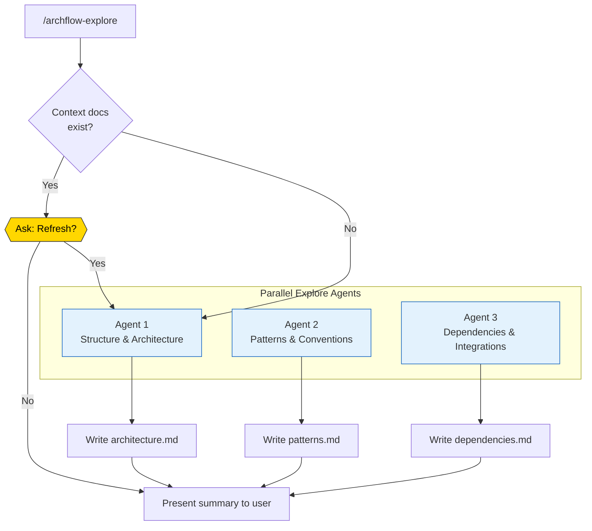
```mermaid
flowchart TD
    E0["/archflow-explore"] --> E1{Context docs<br/>exist?}
    E1 -->|Yes| E1a{{Ask: Refresh?}}
    E1a -->|No| E_done
    E1a -->|Yes| E2
    E1 -->|No| E2

    subgraph "Parallel Explore Agents"
        E2[Agent 1<br/>Structure & Architecture]
        E3[Agent 2<br/>Patterns & Conventions]
        E4[Agent 3<br/>Dependencies & Integrations]
    end

    E2 --> E5[Write architecture.md]
    E3 --> E6[Write patterns.md]
    E4 --> E7[Write dependencies.md]

    E5 --> E_done[Present summary to user]
    E6 --> E_done
    E7 --> E_done

    style E2 fill:#e3f2fd,stroke:#1565c0
    style E3 fill:#e3f2fd,stroke:#1565c0
    style E4 fill:#e3f2fd,stroke:#1565c0
    style E1a fill:#ffd700,stroke:#333,color:#000
```

**Agents**: 3x general-purpose (parallel, explore + write) by default — the document set scales to the repo's shape (e.g. per-package docs in a monorepo)
**Output**: `.archflow/context/{architecture,patterns,dependencies}.md`, each stamped with the HEAD commit for staleness detection
**When to run**: Before starting tasks on an existing codebase. Re-run when status/phase skills flag drift.

---

### `/archflow-prd <task-name>`

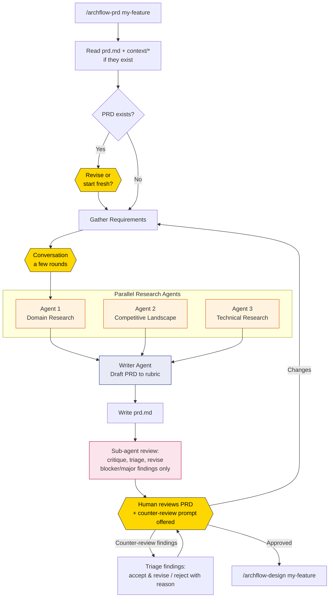
```mermaid
flowchart TD
    P0["/archflow-prd my-feature"] --> P_read[Read prd.md + context/*<br/>if they exist]
    P_read --> P1{PRD exists?}
    P1 -->|Yes| P1a{{Revise or<br/>start fresh?}}
    P1a --> P2
    P1 -->|No| P2

    P2[Gather Requirements] --> P2a{{Conversation<br/>a few rounds}}
    P2a --> P3

    subgraph "Parallel Research Agents"
        P3[Agent 1<br/>Domain Research]
        P4[Agent 2<br/>Competitive Landscape]
        P5[Agent 3<br/>Technical Research]
    end

    P3 --> P6
    P4 --> P6
    P5 --> P6

    P6[Writer Agent<br/>Draft PRD to rubric] --> P7[Write prd.md]
    P7 --> P7a[Sub-agent review:<br/>critique, triage, revise<br/>blocker/major findings only]
    P7a --> P8{{Human reviews PRD<br/>+ counter-review prompt offered}}
    P8 -->|Changes| P2
    P8 -->|Counter-review findings| P8a[Triage findings:<br/>accept & revise / reject with reason]
    P8a --> P8
    P8 -->|Approved| P9["/archflow-design my-feature"]

    style P3 fill:#fff3e0,stroke:#e65100
    style P4 fill:#fff3e0,stroke:#e65100
    style P5 fill:#fff3e0,stroke:#e65100
    style P6 fill:#e8eaf6,stroke:#283593
    style P7a fill:#fce4ec,stroke:#ad1457
    style P2a fill:#ffd700,stroke:#333,color:#000
    style P1a fill:#ffd700,stroke:#333,color:#000
    style P8 fill:#ffd700,stroke:#333,color:#000
```

**Agents**: 0-3x general-purpose (parallel research — only load-bearing dimensions) + 1x general-purpose (draft PRD) + 1x+ general-purpose (fresh-context review loop, typically 1-2 rounds)
**Output**: `.archflow/tasks/{task}/prd.md` (+ triaged `reviews/prd-counter-review.md` when the user runs the counter-review)
**Context read**: `.archflow/context/*` (if available)

---

### `/archflow-design <task-name>`

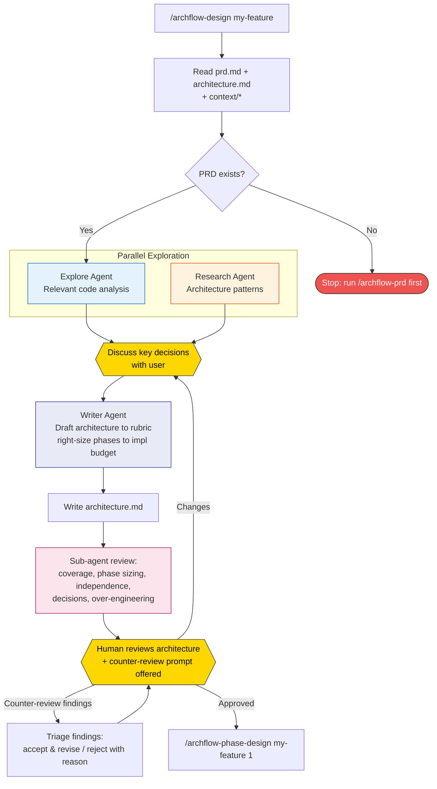
```mermaid
flowchart TD
    D0["/archflow-design my-feature"] --> D_read[Read prd.md + architecture.md<br/>+ context/*]
    D_read --> D_check{PRD exists?}
    D_check -->|No| D_stop([Stop: run /archflow-prd first])
    D_check -->|Yes| D1

    subgraph "Parallel Exploration"
        D1[Explore Agent<br/>Relevant code analysis]
        D2[Research Agent<br/>Architecture patterns]
    end

    D1 --> D3
    D2 --> D3

    D3{{Discuss key decisions<br/>with user}} --> D4

    D4[Writer Agent<br/>Draft architecture to rubric<br/>right-size phases to impl budget] --> D5[Write architecture.md]

    D5 --> D5a[Sub-agent review:<br/>coverage, phase sizing, independence,<br/>decisions, over-engineering]
    D5a --> D6{{Human reviews architecture<br/>+ counter-review prompt offered}}
    D6 -->|Changes| D3
    D6 -->|Counter-review findings| D6a[Triage findings:<br/>accept & revise / reject with reason]
    D6a --> D6
    D6 -->|Approved| D7["/archflow-phase-design my-feature 1"]

    style D1 fill:#e3f2fd,stroke:#1565c0
    style D2 fill:#fff3e0,stroke:#e65100
    style D4 fill:#e8eaf6,stroke:#283593
    style D5a fill:#fce4ec,stroke:#ad1457
    style D3 fill:#ffd700,stroke:#333,color:#000
    style D6 fill:#ffd700,stroke:#333,color:#000
    style D_stop fill:#ef5350,stroke:#333,color:#fff
```

**Agents**: 1x Explore + 0-1x general-purpose (research) + 1x general-purpose (draft architecture) + 1x+ general-purpose (fresh-context review loop, typically 1-2 rounds)
**Output**: `.archflow/tasks/{task}/architecture.md` (+ triaged `reviews/architecture-counter-review.md` when the user runs the counter-review)
**Context read**: `.archflow/tasks/{task}/prd.md` + `.archflow/context/*`

---

### `/archflow-phase-design <task-name> N`

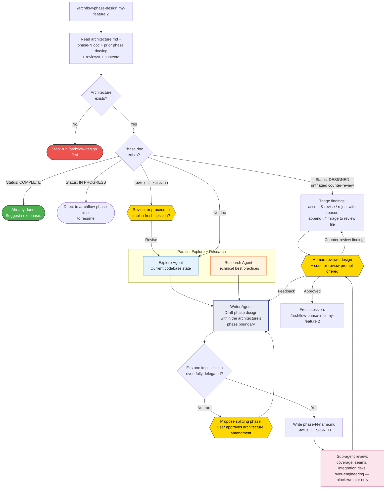
```mermaid
flowchart TD
    PD0["/archflow-phase-design my-feature 2"] --> PD_read[Read architecture.md +<br/>phase-N doc + prior phase doc/log<br/>+ reviews/ + context/*]
    PD_read --> PD_check{Architecture<br/>exists?}
    PD_check -->|No| PD_stop([Stop: run /archflow-design first])
    PD_check -->|Yes| PD1{Phase doc<br/>exists?}

    PD1 -->|"Status: COMPLETE"| PD_done([Already done.<br/>Suggest next phase.])
    PD1 -->|"Status: IN PROGRESS"| PD_redirect([Direct to /archflow-phase-impl<br/>to resume])
    PD1 -->|"Status: DESIGNED<br/>untriaged counter-review"| PD_triage
    PD1 -->|"Status: DESIGNED"| PD_ask{{Revise, or proceed to<br/>impl in fresh session?}}
    PD_ask -->|Revise| PD2
    PD1 -->|No doc| PD2

    subgraph "Parallel Explore + Research"
        PD2[Explore Agent<br/>Current codebase state]
        PD3[Research Agent<br/>Technical best practices]
    end

    PD2 --> PD4
    PD3 --> PD4

    PD4[Writer Agent<br/>Draft phase design<br/>within the architecture's<br/>phase boundary] --> PD_size{Fits one impl session<br/>even fully delegated?}
    PD_size -->|No: rare| PD_split{{Propose splitting phase,<br/>user approves architecture amendment}}
    PD_split --> PD4
    PD_size -->|Yes| PD5[Write phase-N-name.md<br/>Status: DESIGNED]

    PD5 --> PD5a[Sub-agent review:<br/>coverage, seams, integration risks,<br/>over-engineering — blocker/major only]
    PD5a --> PD6{{Human reviews design<br/>+ counter-review prompt offered}}
    PD6 -->|Feedback| PD4
    PD6 -->|Counter-review findings| PD_triage[Triage findings:<br/>accept & revise / reject with reason<br/>append ## Triage to review file]
    PD_triage --> PD6
    PD6 -->|Approved| PD_next["Fresh session:<br/>/archflow-phase-impl my-feature 2"]

    style PD2 fill:#e3f2fd,stroke:#1565c0
    style PD3 fill:#fff3e0,stroke:#e65100
    style PD4 fill:#e8eaf6,stroke:#283593
    style PD5a fill:#fce4ec,stroke:#ad1457
    style PD6 fill:#ffd700,stroke:#333,color:#000
    style PD_ask fill:#ffd700,stroke:#333,color:#000
    style PD_split fill:#ffd700,stroke:#333,color:#000
    style PD_stop fill:#ef5350,stroke:#333,color:#fff
    style PD_done fill:#4CAF50,stroke:#333,color:#fff
```

**Agents**: 1x Explore + 0-1x general-purpose (research) + 1x general-purpose (draft phase doc) + 1x+ general-purpose (fresh-context review loop, typically 1-2 rounds)
**Output**: `.archflow/tasks/{task}/phases/phase-N-{slug}.md` at `DESIGNED` (+ triaged `reviews/phase-N-design-counter-review.md`)
**Context read**: architecture.md (kept current) + prd.md + immediately prior phase doc/log + older logs on demand + `.archflow/context/*`
**No code is written in this skill.** Implementation happens in a fresh session so the whole phase gets a clean context window.

---

### `/archflow-phase-impl <task-name> N`

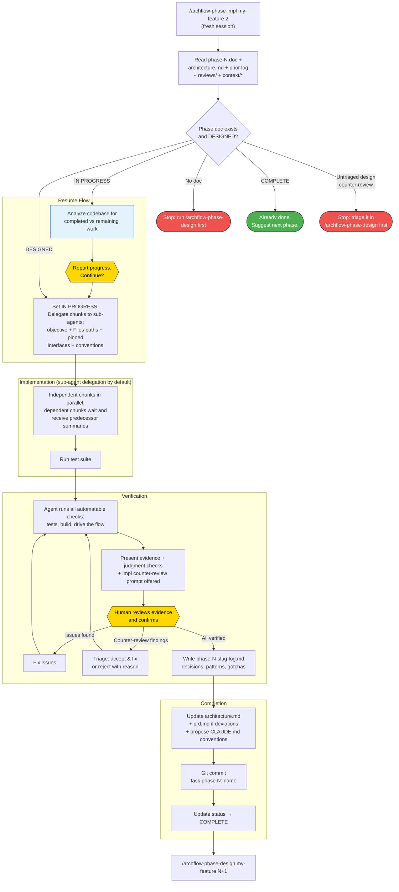
```mermaid
flowchart TD
    PI0["/archflow-phase-impl my-feature 2<br/>(fresh session)"] --> PI_read[Read phase-N doc +<br/>architecture.md + prior log<br/>+ reviews/ + context/*]
    PI_read --> PI_check{Phase doc exists<br/>and DESIGNED?}
    PI_check -->|No doc| PI_stop([Stop: run /archflow-phase-design first])
    PI_check -->|"COMPLETE"| PI_done([Already done.<br/>Suggest next phase.])
    PI_check -->|"Untriaged design<br/>counter-review"| PI_stop2([Stop: triage it in<br/>/archflow-phase-design first])
    PI_check -->|"IN PROGRESS"| PI_resume

    subgraph "Resume Flow"
        PI_resume[Analyze codebase for<br/>completed vs remaining work] --> PI_report{{Report progress.<br/>Continue?}}
        PI_report --> PI_impl
    end

    PI_check -->|"DESIGNED"| PI_impl

    subgraph "Implementation (sub-agent delegation by default)"
        PI_impl[Set IN PROGRESS.<br/>Delegate chunks to sub-agents:<br/>objective + Files paths + pinned<br/>interfaces + conventions] --> PI_parallel[Independent chunks in parallel;<br/>dependent chunks wait and<br/>receive predecessor summaries]
        PI_parallel --> PI_tests[Run test suite]
    end

    PI_tests --> PI_verify

    subgraph "Verification"
        PI_verify[Agent runs all automatable checks:<br/>tests, build, drive the flow] --> PI_evidence[Present evidence + judgment checks<br/>+ impl counter-review prompt offered]
        PI_evidence --> PI_human{{Human reviews evidence<br/>and confirms}}
        PI_human -->|Issues found| PI_fix[Fix issues] --> PI_verify
        PI_human -->|Counter-review findings| PI_triage[Triage: accept & fix<br/>or reject with reason] --> PI_verify
        PI_human -->|All verified| PI_log
    end

    subgraph "Completion"
        PI_log[Write phase-N-slug-log.md<br/>decisions, patterns, gotchas] --> PI_parent[Update architecture.md<br/>+ prd.md if deviations<br/>+ propose CLAUDE.md conventions]
        PI_parent --> PI_commit[Git commit<br/>task phase N: name]
        PI_commit --> PI_update[Update status → COMPLETE]
    end

    PI_update --> PI_next["/archflow-phase-design my-feature N+1"]

    style PI_resume fill:#e3f2fd,stroke:#1565c0
    style PI_report fill:#ffd700,stroke:#333,color:#000
    style PI_human fill:#ffd700,stroke:#333,color:#000
    style PI_stop fill:#ef5350,stroke:#333,color:#fff
    style PI_stop2 fill:#ef5350,stroke:#333,color:#fff
    style PI_done fill:#4CAF50,stroke:#333,color:#fff
```

**Agents**: 0-Nx general-purpose (implementation chunks — delegation is the default to keep the orchestrator's context lean; direct implementation only for small phases)
**Output**: actual code + `phase-N-{slug}-log.md` + updated parent docs (+ triaged `reviews/phase-N-impl-counter-review.md`)
**Context read**: phase-N doc (required) + architecture.md + immediately prior log + `.archflow/context/*`

**Why delegation is the default**: the orchestrator must finish the whole phase — implementation, verification, and review — without compacting its context. A delegated chunk costs it a brief and a summary; a direct one costs the full file reads, edits, and test output. The sizing calibration lives in `archflow-design`, which cuts phases to fit one fully delegated session.

---

## Sub-Agent Map

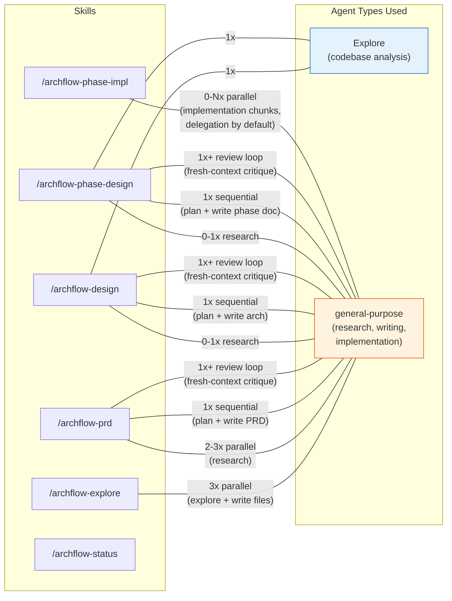
```mermaid
flowchart LR
    subgraph "Agent Types Used"
        EX["Explore<br/>(codebase analysis)"]
        GP["general-purpose<br/>(research, writing,<br/>implementation)"]
    end

    subgraph "Skills"
        explore["/archflow-explore"]
        prd["/archflow-prd"]
        design["/archflow-design"]
        phasedesign["/archflow-phase-design"]
        phaseimpl["/archflow-phase-impl"]
        status["/archflow-status"]
    end

    explore ---|"3x parallel<br/>(explore + write files)"| GP
    prd ---|"2-3x parallel<br/>(research)"| GP
    prd ---|"1x sequential<br/>(plan + write PRD)"| GP
    prd ---|"1x+ review loop<br/>(fresh-context critique)"| GP
    design ---|1x| EX
    design ---|"0-1x research"| GP
    design ---|"1x sequential<br/>(plan + write arch)"| GP
    design ---|"1x+ review loop<br/>(fresh-context critique)"| GP
    phasedesign ---|1x| EX
    phasedesign ---|"0-1x research"| GP
    phasedesign ---|"1x sequential<br/>(plan + write phase doc)"| GP
    phasedesign ---|"1x+ review loop<br/>(fresh-context critique)"| GP
    phaseimpl ---|"0-Nx parallel<br/>(implementation chunks,<br/>delegation by default)"| GP

    style EX fill:#e3f2fd,stroke:#1565c0
    style GP fill:#fff3e0,stroke:#e65100
```

---

## Context Flow Between Sessions

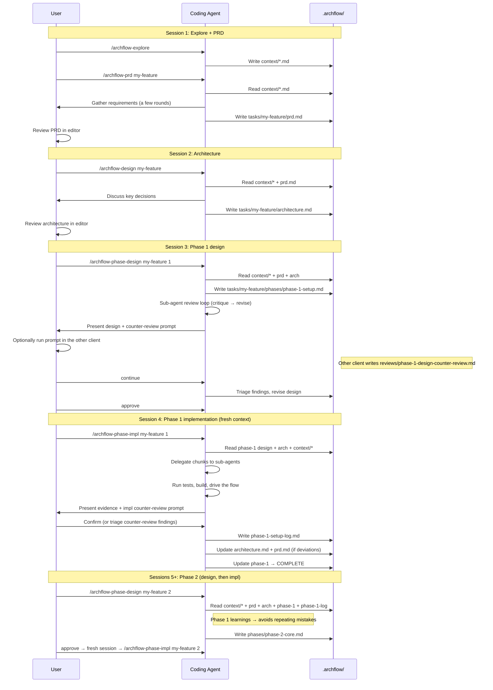
```mermaid
sequenceDiagram
    participant U as User
    participant C as Coding Agent
    participant FS as .archflow/

    Note over U,FS: Session 1: Explore + PRD
    U->>C: /archflow-explore
    C->>FS: Write context/*.md

    U->>C: /archflow-prd my-feature
    C->>FS: Read context/*.md
    C->>U: Gather requirements (a few rounds)
    C->>FS: Write tasks/my-feature/prd.md
    U->>U: Review PRD in editor

    Note over U,FS: Session 2: Architecture
    U->>C: /archflow-design my-feature
    C->>FS: Read context/* + prd.md
    C->>U: Discuss key decisions
    C->>FS: Write tasks/my-feature/architecture.md
    U->>U: Review architecture in editor

    Note over U,FS: Session 3: Phase 1 design
    U->>C: /archflow-phase-design my-feature 1
    C->>FS: Read context/* + prd + arch
    C->>FS: Write tasks/my-feature/phases/phase-1-setup.md
    C->>C: Sub-agent review loop (critique → revise)
    C->>U: Present design + counter-review prompt
    U->>U: Optionally run prompt in the other client
    Note right of FS: Other client writes reviews/phase-1-design-counter-review.md
    U->>C: continue
    C->>FS: Triage findings, revise design
    U->>C: approve

    Note over U,FS: Session 4: Phase 1 implementation (fresh context)
    U->>C: /archflow-phase-impl my-feature 1
    C->>FS: Read phase-1 design + arch + context/*
    C->>C: Delegate chunks to sub-agents
    C->>C: Run tests, build, drive the flow
    C->>U: Present evidence + impl counter-review prompt
    U->>C: Confirm (or triage counter-review findings)
    C->>FS: Write phase-1-setup-log.md
    C->>FS: Update architecture.md + prd.md (if deviations)
    C->>FS: Update phase-1 → COMPLETE

    Note over U,FS: Sessions 5+: Phase 2 (design, then impl)
    U->>C: /archflow-phase-design my-feature 2
    C->>FS: Read context/* + prd + arch + phase-1 + phase-1-log
    Note right of C: Phase 1 learnings → avoids repeating mistakes
    C->>FS: Write phases/phase-2-core.md
    U->>C: approve → fresh session → /archflow-phase-impl my-feature 2
```

Each session only reads what it needs. The `.archflow/` docs **are** the context -- no separate state files.

---

## Phase State Machine

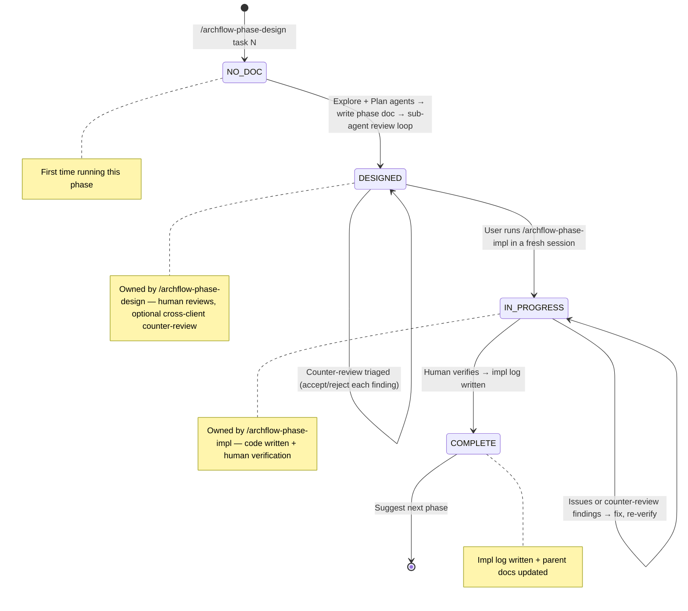
```mermaid
stateDiagram-v2
    [*] --> NO_DOC: /archflow-phase-design task N

    NO_DOC --> DESIGNED: Explore + Plan agents → write phase doc → sub-agent review loop
    DESIGNED --> DESIGNED: User requests revisions
    DESIGNED --> DESIGNED: Counter-review triaged (accept/reject each finding)
    DESIGNED --> IN_PROGRESS: User runs /archflow-phase-impl in a fresh session
    IN_PROGRESS --> IN_PROGRESS: Context lost → resume from doc
    IN_PROGRESS --> IN_PROGRESS: Issues or counter-review findings → fix, re-verify
    IN_PROGRESS --> COMPLETE: Human verifies → impl log written
    COMPLETE --> [*]: Suggest next phase

    note right of NO_DOC: First time running this phase
    note right of DESIGNED: Owned by /archflow-phase-design — human reviews, optional cross-client counter-review
    note right of IN_PROGRESS: Owned by /archflow-phase-impl — code written + human verification
    note right of COMPLETE: Impl log written + parent docs updated
```

---

## Implementation Log (Inter-Phase Learning)

Each completed phase gets a companion **log file** at `phase-N-{slug}-log.md`. This is how phases learn from each other.

```markdown
## Implementation Log

### Decisions Made
- Chose Zod over Joi for validation: Zod has native TypeScript inference, Joi required separate type definitions
- Used a single `errors` table instead of per-module tables: simpler queries, one place to check

### Deviations from Plan
- Planned separate `AuthService` class, built as plain functions instead: the class had no state, functions were simpler and easier to test
- Added `retry` wrapper to API client: external service was flaky during testing, needed exponential backoff

### Patterns Established
- Error handling: all service functions return `Result<T, AppError>` -- no thrown exceptions past the service boundary
- DB queries: use repository pattern in `src/repos/`, one file per entity, raw SQL via Kysely

### Gotchas
- SQLite doesn't enforce VARCHAR length -- validation must happen in application code
- `bcrypt.hash()` returns a different length depending on the salt rounds config -- the `password_hash` column needs VARCHAR(72) minimum

### Key Interfaces
- `src/repos/user-repo.ts`: exports `createUser()`, `findByEmail()`, `findById()` -- phase 2 auth flow should use these, not query directly
- `src/lib/result.ts`: exports `Result<T, E>`, `ok()`, `err()` -- all service functions must use this pattern
```

**How it flows:**
- Phase 1 completes → log written to `phase-1-setup-log.md` → architecture.md and prd.md updated if deviations occurred → durable, task-independent conventions proposed for the project's CLAUDE.md
- Phase 2 starts → reads the architecture doc (kept current) plus the immediately prior phase doc and log; older logs are pulled in only when they cover ground the new phase touches. This keeps context linear instead of O(N²) as phases accumulate.
- Phase 2's writer agent receives these learnings as input → avoids repeating mistakes, reuses established patterns, builds on actual interfaces (not just planned ones)
- The architecture doc stays accurate because each phase updates it on completion — remaining phase definitions reflect reality, not the original guess. Because the architecture doc absorbs deviations, it (not the log pile) is the durable source of truth.

Separate file keeps the design doc clean and the log focused. The naming convention (`-log.md` suffix) makes it easy to glob for all logs.

---

## Verification Flow

After implementation, before marking COMPLETE, the phase goes through verification. The agent runs everything automatable itself; the human gate is for judgment, not labor:

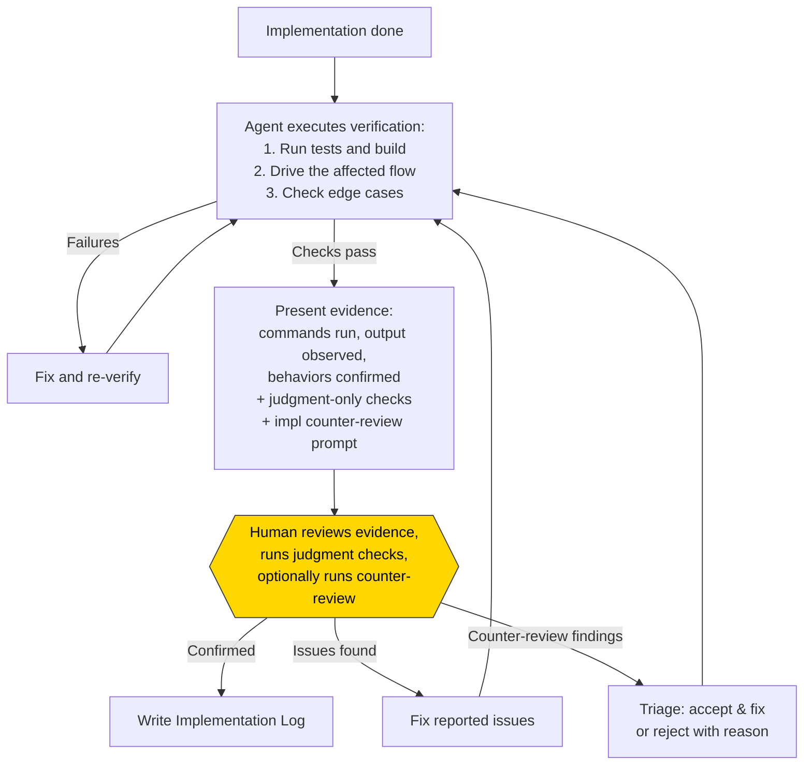
```mermaid
flowchart TD
    Impl[Implementation done] --> AgentRun["Agent executes verification:<br/>1. Run tests and build<br/>2. Drive the affected flow<br/>3. Check edge cases"]
    AgentRun -->|"Failures"| SelfFix[Fix and re-verify] --> AgentRun
    AgentRun -->|"Checks pass"| Present["Present evidence:<br/>commands run, output observed,<br/>behaviors confirmed<br/>+ judgment-only checks<br/>+ impl counter-review prompt"]
    Present --> Human{{Human reviews evidence,<br/>runs judgment checks,<br/>optionally runs counter-review}}
    Human -->|"Confirmed"| Log[Write Implementation Log]
    Human -->|"Issues found"| Fix[Fix reported issues]
    Human -->|"Counter-review findings"| Triage[Triage: accept & fix<br/>or reject with reason]
    Triage --> AgentRun
    Fix --> AgentRun

    style Human fill:#ffd700,stroke:#333,color:#000
```

Evidence is **specific and observable** -- not "it works" but the concrete commands run, output seen, and behaviors exercised. The human reviews that evidence and handles what only a human can judge: visual/UX checks, intent alignment, and anything requiring access the agent lacks. Alongside the evidence the agent offers a ready-to-paste counter-review prompt so the other client can review the uncommitted diff against the design; its findings are triaged explicitly (each accepted and fixed, or rejected with a reason, recorded in a `## Triage` section of the review file). Issues feed back into implementation before the phase closes, and re-verification covers only what changed.

---

## Task Independence

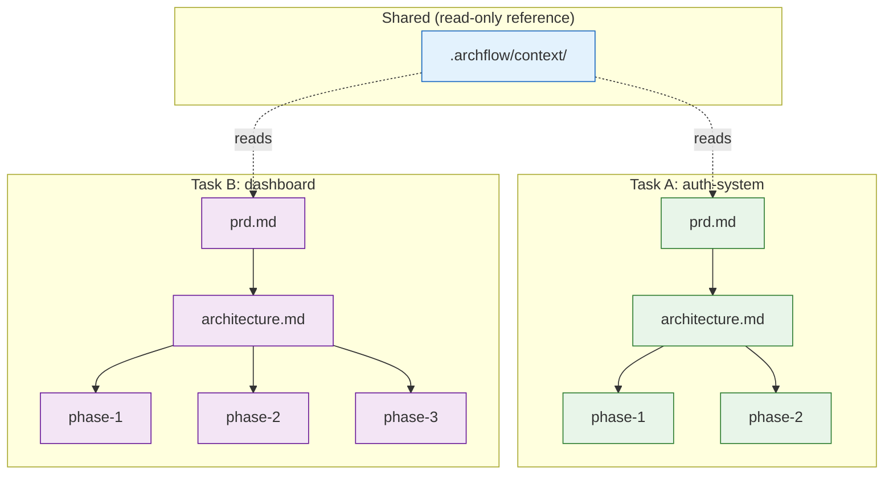
```mermaid
flowchart TD
    subgraph "Shared (read-only reference)"
        CTX[".archflow/context/"]
    end

    subgraph "Task A: auth-system"
        A_PRD[prd.md] --> A_ARCH[architecture.md]
        A_ARCH --> A_P1[phase-1]
        A_ARCH --> A_P2[phase-2]
    end

    subgraph "Task B: dashboard"
        B_PRD[prd.md] --> B_ARCH[architecture.md]
        B_ARCH --> B_P1[phase-1]
        B_ARCH --> B_P2[phase-2]
        B_ARCH --> B_P3[phase-3]
    end

    CTX -.->|reads| A_PRD
    CTX -.->|reads| B_PRD

    style CTX fill:#e3f2fd,stroke:#1565c0
    style A_PRD fill:#e8f5e9,stroke:#2e7d32
    style A_ARCH fill:#e8f5e9,stroke:#2e7d32
    style A_P1 fill:#e8f5e9,stroke:#2e7d32
    style A_P2 fill:#e8f5e9,stroke:#2e7d32
    style B_PRD fill:#f3e5f5,stroke:#6a1b9a
    style B_ARCH fill:#f3e5f5,stroke:#6a1b9a
    style B_P1 fill:#f3e5f5,stroke:#6a1b9a
    style B_P2 fill:#f3e5f5,stroke:#6a1b9a
    style B_P3 fill:#f3e5f5,stroke:#6a1b9a
```

Tasks never read each other's files. Deleting one task has zero impact on others. Context docs are shared but read-only -- they inform, they don't couple.
