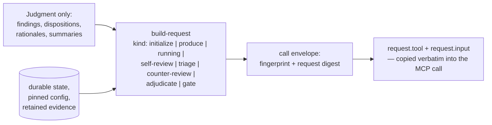

# cli/COMMANDS

**Explored:** 2026-08-10 · **Commit:** `50a218d` · **Covers:** `src/local/`, `install.sh`

`archflow-local` is the agent's local helper: it composes requests, reads status, and runs the degraded-mode fallback. It is deliberately *not* the authority — with two narrow exceptions (task initialization staging and the manual/degraded writers), it derives and verifies rather than writes.

A packaging note that trips up maintainers: there is no `bin` entry in `package.json`. `install.sh` writes a shell shim into `~/.local/bin` that execs `node dist/archflow-local.mjs`; the source of truth is `src/local/main.ts`.

## Invocation shape

```
archflow-local <command> [--task <task>] [--input <json-file>]
```

- Payload commands read JSON from `--input <file>`, or stdin when `--input` is omitted. If stdin is a TTY and no `--input` was given, the command fails immediately rather than hanging.
- Input-free commands (`status`, `manual-status`, `init`, `task-init`) never read stdin at all.
- Output is always canonical JSON on stdout. **Exit codes are not the failure signal**: most failures return `{"ok": false, ...}` with exit 0 — callers must inspect the JSON. (Whether that's a bug or a contract is an open question flagged in `../COMPLEXITY.md`.)
- `--help` is generated from the same command table that drives dispatch (`LOCAL_COMMAND_CONTRACTS` in `src/local/commands.ts`), so help can't drift from behavior.

## The command surface

**Pure / stateless** (no task directory touched):

| Command | Purpose |
|---|---|
| `validate` | Run an artifact through its contract parser and echo the parsed value |
| `hash` | SHA-256 of a value's canonical encoding (mostly superseded by `build-request`) |
| `render` | Preview the canonical Markdown projection of a review/adjudication, with digest |
| `import` | Analyze a manual-checkpoint chain; reports the greatest valid chain, writes nothing |
| `init` | Set up the repository: `.archflow/` assets + MCP registrations for both hosts |

**Task-scoped, read-only:**

| Command | Purpose |
|---|---|
| `status` | The reconciled durable truth plus exactly one `next_action`, often with a prefilled request — the normal driver loop |
| `manual-status` | The degraded-mode counterpart; classifies `normal` / `degraded` / `repair-required` |
| `envelope` | Authenticate an *already-authored* complete tool request (fingerprint + request digest) |

**Task-scoped, composing:**

| Command | Purpose |
|---|---|
| `build-request` | **The one documented door** — see below |
| `build-document` / `build-implementation-output` / `task-init` | Build bare artifacts; largely subsumed by `build-request` kinds but each retains one real caller |

**Task-scoped, writing durable state:**

| Command | Purpose |
|---|---|
| `snapshot` / `restore` | Install / read back a content-addressed retained result |
| `checkpoint` | Append to the manual checkpoint chain (only as the unique greatest valid extension) |
| `decide` | Write gate files: a manual gate request/decision, or record the human's chosen decision template |
| `gate-counter` | Ingest an elected gate counter-review after verifying it binds the archived gate request field-for-field |
| `maintain` | Delete only provably unreachable retained bytes, recording a maintenance record |
| `reconcile` | Compare recorded projections against what's on disk |
| `upgrade` | Stage a legacy task into a fresh canonical task (see `../workflow/SKILLS.md`) |

**Degraded workflow:** `manual-next`, `manual-handoff` — see below.

## build-request: the one documented door

Every ArchFlow MCP call is a large object whose fields the server checks byte-for-byte. Hand-assembling those fields was measured to be the dominant failure mode — in a full PRD loop, 8 of 10 requests were mechanical transcription, with only findings and dispositions being genuine judgment. Transcription can only *introduce* errors (`TRANSITION_INVALID`, `INPUT_FINGERPRINT_MISMATCH`); it can never add value.

So `build-request` inverts the contract: **the caller supplies only judgment; the tool derives everything mechanical** from the same durable authorities the server will check against.



Properties worth knowing:

- Each kind guards the transition with the server's own rule first, so an illegal move fails at compose time with the server's own error, not on the network call.
- `triage` enforces exactly one disposition per current finding — unknown IDs, duplicates, and gaps are rejected before the server ever sees them.
- `gate` picks the gate kind from the phase (`phase-impl` → `commit-authorization`, else `artifact-approval`); the author writes only the summary.
- `initialize` is the documented exception: the only composer that writes (it must stage the task before a fingerprint can resolve), legal only before durable state exists.
- A contract test pins that every prefill the server emits maps onto a composer kind — "the one door" is literally true, not aspirational.

## Two things called "envelope"

`src/local/envelope.ts` produces the **call envelope**: the authentication wrapper around one outgoing MCP call. It resolves the input fingerprint internally (running it over its own output is a fixed point — idempotent), substitutes it into exactly the two places the contracts bind it, and computes the request digest. For gate/waiver calls it also derives the gate ID, file paths, and a ready-to-run counter-review recipe for the human's second terminal.

This is **unrelated** to `src/review/envelopes.ts` (the sealed evidence package sent to a child reviewer — see `../review/COUNTER-REVIEW.md`). The shared name is a known collision; a rename is on the simplification list.

## Degraded mode

When the MCP server is unavailable, progress is recorded through the local checkpoint chain instead, via `src/local/manual-workflow.ts`:

1. `manual-status` classifies the situation and emits exactly one executable `next_action`.
2. `manual-next` performs one step: it emits a derived checkpoint, a fully-pinned reviewer prompt, or a gate interface with decision templates — the exact serializable substitute for whichever MCP tool is down.
3. When the server returns, a recovery `archflow_state` call folds the checkpoint chain back into server state.
4. `manual-handoff` blesses a writer transfer between machines only when the checkpoint is actually committed and pushed and the next writer can cleanly pull.

The authority object in this mode (`ManualAuthority`) is deliberately non-serializable — it can only be minted and used within one process, so no authority ever crosses the CLI's JSON boundary. Degraded mode records progress; it never advances the workflow or resolves gates on its own.
