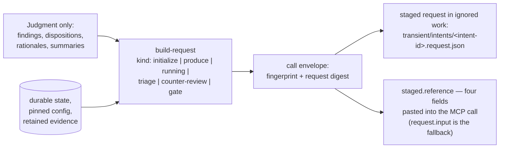

# cli/COMMANDS

**Explored:** 2026-08-12 · **Commit:** `247df34` · **Covers:** `src/local/`, `src/init/`, `install.sh`

`archflow-local` is the agent's local helper: it composes requests and reads status — including a read-only classification of where a task stands when the MCP server is unavailable. It is deliberately *not* the authority — with one narrow exception (task initialization staging inside `build-request`), it derives and verifies rather than writes.

A packaging note that trips up maintainers: there is no `bin` entry in `package.json`. `install.sh` writes a shell shim into `~/.local/bin` that execs `node dist/archflow-local.mjs`; the source of truth is `src/local/main.ts`.

## Invocation shape

```
archflow-local <command> [--task <task>] [--input <json-file>] [--brief]
```

- Payload commands read JSON from `--input <file>`, or stdin when `--input` is omitted. If stdin is a TTY and no `--input` was given, the command fails immediately rather than hanging.
- Input-free commands (`status`, `manual-status`, `init`, `clean`) never read stdin at all.
- `--brief` (status only) projects the routine-loop view from the same computed status: position, blockers, open-gate and reconciliation summaries, constitution digest with active rule ids, and the one `next_action` — with no rule text, counter-review prompt, or decision-template bodies. Workspace state appears only when `cleanup_pending` is true (`projectBriefStatus` in `src/state/status.ts`).
- Output is always canonical JSON on stdout. **Failures exit nonzero**: any result carrying `{"ok": false, ...}` also exits 1, so shell-level checks and the JSON agree; the JSON body remains the authority for structured details.
- `--help` is generated from the same command table that drives dispatch (`LOCAL_COMMAND_CONTRACTS` in `src/local/commands.ts`), so help can't drift from behavior.

## The command surface

**Pure / stateless** (no task directory touched):

| Command | Purpose |
|---|---|
| `validate` | Run an artifact through its contract parser and echo the parsed value |
| `hash` | SHA-256 of a value's canonical encoding (mostly superseded by `build-request`) |
| `render` | Preview the canonical Markdown projection of a review or constitution-review result, with digest |
| `init` | Set up the repository: `.archflow/` assets + MCP registrations for both hosts |

**Task-scoped, read-only:**

| Command | Purpose |
|---|---|
| `status` | The reconciled durable truth plus exactly one `next_action`, often with a prefilled request — the normal driver loop; `--brief` projects the loop-sized view |
| `manual-status` | Read-only mode classifier: `normal` (delegates to task status, one next action) / `degraded` (no durable state — wait for the server) / `repair-required` (state present but unreadable — position summary) |
| `envelope` | Authenticate an *already-authored* complete tool request (fingerprint + request digest) |

**Task-scoped, composing:**

| Command | Purpose |
|---|---|
| `build-request` | **The one documented door** — see below |

**Task-scoped, mutating:**

| Command | Purpose |
|---|---|
| `snapshot` / `restore` | Install / read back a content-addressed retained result |
| `decide` | Record the human's chosen decision template (`kind: "interface"` only) — the normal-mode human decision channel |
| `gate-counter` | Ingest an elected gate counter-review after verifying it binds the archived gate request field-for-field |
| `clean` | Remove only unreferenced authority plus stale or reconstructible work; reports removed/retained file and byte counts |
| `reconcile` | Compare recorded projections against what's on disk |
| `upgrade` | Stage a legacy task into a fresh canonical task (see `../workflow/SKILLS.md`) |

## build-request: the one documented door

Every ArchFlow MCP call is a large object whose fields the server checks byte-for-byte. Hand-assembling those fields was measured to be the dominant failure mode — in a full PRD loop, 8 of 10 requests were mechanical transcription, with only findings and dispositions being genuine judgment. Transcription can only *introduce* errors (`TRANSITION_INVALID`, `INPUT_FINGERPRINT_MISMATCH`); it can never add value.

So `build-request` inverts the contract: **the caller supplies only judgment; the tool derives everything mechanical** from the same durable authorities the server will check against.



Properties worth knowing:

- Each kind guards the transition with the server's own rule first, so an illegal move fails at compose time with the server's own error, not on the network call.
- Every kind except `initialize` also **stages** the resolved request below `.archflow/work/tasks/<task>/transient/intents/` (atomically, overwrite-on-recompose) and adds `staged: {path, reference}` to the envelope. The reference — `{schema_version, task_id, intent_id, request_digest}` — is the whole MCP tool input; the server rehydrates the staged bytes and refuses on any digest disagreement, so the multi-kilobyte payload never crosses the model's context. Passing `request.input` verbatim remains the documented fallback.
- `intent_id` is optional: when omitted, the composer generates `<kind>-<UTC stamp>-<4 hex>` and echoes it in the request and reference. An explicit id is only for replaying or resuming an interrupted call.
- `running` enters a pipeline step; the steps are exactly `produce`, `counter_review`, and `triage`.
- `triage` enforces exactly one disposition per current finding — unknown IDs, duplicates, and gaps are rejected before the server ever sees them.
- `gate` composes a pending constitution gate (`constitution-review`, `material-drift`, derived by the server after triage) mechanically from retained adjudication evidence — kind, subject, and context all derived; otherwise it picks the kind from the phase (`phase-impl` → `commit-authorization`, else `artifact-approval`). Either way the author writes only the summary.
- `initialize` is the documented exception: the only composer that writes (it must stage the task before a fingerprint can resolve), legal only before durable state exists. Its envelope carries **no** `staged` block — there is no durable task directory yet to hold a staged file — so the create-task call is the one place `request.input` is passed verbatim by design, as typed JSON (`artifact` an object, `expected_revision` the number `0`).
- A contract test pins that every prefill the server emits maps onto a composer kind — "the one door" is literally true, not aspirational.

## Two things called "envelope"

`src/local/call-envelope.ts` produces the **call envelope**: the authentication wrapper around one outgoing MCP call. It resolves the input fingerprint internally (running it over its own output is a fixed point — idempotent), substitutes it into exactly the two places the contracts bind it, and computes the request digest. For gate/waiver calls it also derives the gate ID, file paths, and a ready-to-run counter-review recipe for the human's second terminal.

This is **unrelated** to `src/review/envelopes.ts` (the sealed evidence package sent to a child reviewer — see `../review/COUNTER-REVIEW.md`). The shared name is a known collision; a rename is on the simplification list.

## Degraded mode

When the MCP server is unavailable, there is no offline recording path — the server is the only writer of workflow progress. What remains is `manual-status`, a read-only classifier that never blocks on stdin:

- `normal` — the server's durable state is present and readable; the result delegates to task status and returns the one `next_action`.
- `degraded` — no durable state exists for the task; the single next action is to wait for the server. Once it is available, proceed through the workflow skills as usual (reinstall with `./install.sh` if the server binary is missing).
- `repair-required` — state is present but unreadable; the result is a position summary for a human to act on.

Nothing in this mode advances the workflow, resolves gates, or records progress.

`clean --task <id>` is safe to run after an automatic cleanup warning. It never reads stdin, never treats cache as authority, and never rolls a committed transition back. Full status reports `workspace.cleanup_pending`; brief status mentions workspace only while that condition is present.
