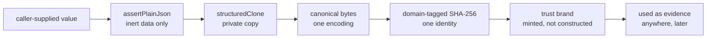

# contracts/CONTRACTS

**Explored:** 2026-08-12 · **Commit:** `247df34` · **Covers:** `src/contracts/`

`src/contracts/` is the bottom layer: ~40 modules plus 35 JSON Schemas that define what a valid thing looks like and how to prove a thing is what it claims. Everything else imports from here; nothing here imports back out.

The premise it serves: durable files in `.archflow/` are the system's *only* memory across sessions, and the things writing them are language models. So the whole layer is built around one idea — **nothing an agent says is trusted until the server has re-derived it.**

## The five core concepts

**Durable documents.** The JSON files ArchFlow writes into the repo — task state, intent receipts, gate requests/decisions, result manifests. After a crash or a host switch, the server rebuilds its entire understanding by reading them back, which is why their shapes are pinned as first-class types with schemas rather than ad-hoc objects.

**Canonical JSON.** Given the same logical data, `canonical.ts` produces exactly one byte sequence (sorted keys, fixed indentation, one trailing newline, UTF-8, no `NaN`/`undefined`). This makes "same data" and "same bytes" — and therefore "same digest" — the same statement, so any component can verify any other's claim without coordination. Parsing is strict in an unusual way: it re-renders and byte-compares against the input, so a durable file cannot be tampered with in any way that preserves its digest.

**Plain-JSON validation.** `assertPlainJson` rejects anything that isn't inert data: getters, foreign prototypes, symbol keys, non-enumerable properties, cycles, `__proto__` keys. The problem it solves is *reading the same object twice*: a getter could show one value to the validator and another to the hasher (a classic time-of-check/time-of-use split). The standard idiom is validate once, then `structuredClone` — every subsequent step reads a private copy the caller can't touch. This isn't paranoia about attackers so much as a hard-won lesson: an excluded field once reached a request digest through exactly this hole.

**Fingerprints and digests.** SHA-256 identities over canonical bytes. An `input_fingerprint` names everything a step depended on (workflow, config, constitution, rubric, upstream document identities); a `request_digest` names the semantic fields of one tool call; gate IDs and context digests bind decisions to situations. If any input changes, the identity changes, and stale approvals stop applying. Every digest is domain-tagged (a `digest_kind` or string prefix), so a commit name and a file path can never collide into the same hash. A caller's own fingerprint is always an *assertion* — the server recomputes it.

**Trust brands.** Types like "an authenticated review set" or "a validated triage" carry a `unique symbol` brand *and* are registered by object identity in a module-private `WeakSet`/`WeakMap` at mint time. A caller cannot construct a plausible look-alike object and pass it as trusted evidence — membership is by identity, not shape. Rules like "a counter-review must come from the opposite family" are checked once, at minting, and the brand carries the proof forward. This pattern recurs across the whole codebase and is its signature move.

## How the mechanisms compose

## The file clusters

- **Foundation** — `plain-json.ts`, `canonical.ts`, `yaml.ts` (one strict YAML door), `versions.ts`.
- **Vocabulary & primitives** — closed lists of phases/steps/gate policies; branded string types (`Sha256Digest`, `TaskSlug`, …); path-claim safety rules (no `..`, no pathspec magic); the four tool names.
- **Validation machinery** — `validators.ts`, now just the shared error class and the three set predicates (`isSortedUniqueBy`, `tupleKey`, `hasUniqueObjectPropertyValues`) every ordering `.refine()` calls. The Ajv compiler and its custom-keyword registry moved to the test tree (`test/helpers/json-schema.ts`); production never compiles a JSON Schema.
- **Fingerprints** — all derived identity computation in one module.
- **Evidence & trust semantics** — review/constitution-review/triage shapes in three assurance flavors (`agent-declared`, `server-attested`, `degraded`), the trust brands, secret-scan shapes, and renderers that escape control characters so rendered evidence can't spoof its own headers.
- **Durable document shapes** — the `durable-*.ts` modules for persisted roots, plus `durable.ts`, one large cross-document semantic validator. `TaskStateV1.last_transition` is the self-contained replay authority for the newest committed call. `AuthoritativeResultRef` carries no path because `authority/results/<result-digest>.json` is derived. `ImplementationOutputV1.verification_evidence` requires the digest and byte count of the ignored raw transcript.
- **Tool contracts & errors** — the four tools' input/output types (each input is a union: the full payload, or the four-field staged-request reference `{schema_version, task_id, intent_id, request_digest}` the server rehydrates from disk — see `../mcp/SERVER.md`), gate kinds and decisions, human gate presentations, human-revision references, and the project-error taxonomy. The technical shapes remain authority, but user-facing skills consume the conversational projection and expose raw bindings only for diagnostics.

## One shape authority: Zod generates the schemas

The Zod parsers are the single runtime shape authority. Of the 35 committed schemas under `schemas/v1/`, thirty-four are *generated from* the Zod sources by `npm run generate:schemas` (manifest in `internal/schema-generation.ts`, one plan module per shape group — leaf, durable, gate, errors, mcp-tools), and `npm run check:schemas` re-renders them in CI and fails on any byte drift, so the committed documents cannot disagree with the code. The release manifest stays hand-written: it describes the release payload itself, is consumed only by `scripts/release-support.mjs`, has no Zod source, and the generator refuses to emit it.

Why generate at all? The schemas are the *published* contract — something a third-party tool can compile with a stock draft-2020-12 validator. Generation ends the era of dual authorities: shapes used to exist as hand-written JSON Schema *plus* a Zod mirror, with `assertZodAgreement` proving the two matched.

The custom `x-archflow-*` keywords mostly retired with that flip. Rules that used to live in Ajv keyword callbacks — set ordering and uniqueness (`x-archflow-sorted-unique`, `x-archflow-sorted-unique-by`, `x-archflow-unique-by`), UTF-8 byte caps and NFC form (`x-archflow-max-utf8-bytes`, `x-archflow-nfc` outside `project-error`), and review, adjudication, gate, human-revision, and result-expectation semantics — now live only as Zod `.refine()`/`superRefine` logic in each shape's source, proven by negative fixtures; the generated documents simply omit the keyword and are deliberately weaker there. Three survivals: the generated `mcp-tools` document re-emits `x-archflow-mcp-semantics` on its root via `.meta` (so external validators keep the cross-field input rules), the generated `project-error` document keeps the byte/NFC pair on its hand-authored path-claim def and sorted-unique markers on its two offending-paths lists, and the hand-written release manifest keeps its set keywords. A per-def `overrides` hook in the manifest hand-authors emissions Zod cannot render faithfully. Tests compile the committed documents through `test/helpers/json-schema.ts`, a dev-only strict Ajv that registers exactly the surviving keywords.

## Design rules that follow from this layer

Two conventions documented in the project's CLAUDE.md come straight from here and are worth restating:

- **Persisted types are `type` aliases, never `interface`** — the canonical-document machinery type-checks the whole reachable graph, and only aliases get implicit index signatures; this also closes declaration merging, so a persisted shape is exactly what its schema says.
- **Property reads require `enumerable` as well as `value`** — rejecting accessors prevents split observation; rejecting non-enumerable data prevents a field invisible to serialization (and thus to digests) from being treated as present.

## Where to be skeptical

The audit's biggest finding here — shapes written twice (JSON Schema + Zod) with a third mechanism proving agreement — was resolved 2026-08-11 by the generation flip above. What remains worth watching is subtler: the generated documents are weaker than the runtime authority wherever a keyword retired, so "it passes the published schema" is not "the server will accept it". See `../COMPLEXITY.md` for the ranked list.
