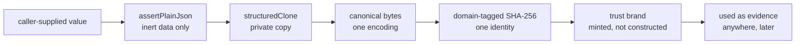

# contracts/CONTRACTS

**Explored:** 2026-09-03 · **Commit:** `1d71fee` · **Covers:** `src/contracts/`, `src/local/automation-status.ts`, `src/state/config-change.ts`, `src/state/fingerprint.ts`, `src/state/request.ts`, `src/state/semantic-*.ts`

`src/contracts/` is the bottom layer: TypeScript contract modules plus generated JSON Schemas that define what a valid thing looks like and how to prove a thing is what it claims. Everything else imports from here; nothing here imports back out.

The premise it serves: durable files in `.archflow/` are the system's *only* memory across sessions, and the things writing them are language models. So the whole layer is built around one idea — **nothing an agent says is trusted until the server has re-derived it.**

## The core concepts

**Durable documents.** The JSON files ArchFlow writes into the repo — task state, intent receipts, gate requests/decisions, result manifests. After a crash or a host switch, the server rebuilds its entire understanding by reading them back, which is why their shapes are pinned as first-class types with schemas rather than ad-hoc objects. A `DocumentArtifactV1` normally names one projection. Design and phase-design results may also carry a sorted, path-unique `additional_documents` set, each with its task-relative path, repository projection target, byte count, and content digest. The primary path cannot be repeated in that set.

Durable gate V1 is monotonic on read. Current writers emit only the conversational gate shape, but archive readers also accept the exact older V1 request supersession, supplemental-review ledger, and superseded-decision forms. Compatibility parsing validates those retired fields instead of filtering them, preserves the original document bytes and digest as authority, and never promotes a superseded outcome into an approval. This separation matters because removing a field from the writer must not invalidate approvals already authenticated and committed under the same schema version.

The same rule runs in the other direction: *adding* required gate fields must not invalidate approvals archived before they existed. Fresh ordinary requests now require policy fields and a closed `approval_trigger`, and fresh artifact/commit tuples include `waiver-requested`. Explicit strict reader arms preserve the exact pre-trigger artifact, design, exact-commit, and pre-exact-commit context/decision combinations plus surviving supersession shapes. They also reconstruct an old open request's disposable active projection when its cache is gone. Writers remain held to the full new shapes and published JSON Schema advertises only those writers; there is no optional-field hybrid. Code that needs exact commit fields asks whether an archive carries them and treats absence as "this approval attests no exact commit." Without this separation, tightening a schema would strand already-given human authority, while weakening the writer would permit new requests with unauthenticated partial provenance.

Attempts exhaustion has the same explicit compatibility split. An old request with the exact context and `retry-once | revise | abort | cancel` tuple remains readable byte-for-byte. A fresh request without authenticated review history retains that shape. Only a fresh context carrying the fixed minimum of two completed rounds, the current evidence-set digest, triage result digest, and complete accepted-occurrence set advertises the additional `push-through-review` choice. Runtime parsing cross-checks the duplicated evidence-set digest; a structurally plausible mismatch is not authority.

Validation override is a separate gate kind and evidence kind, not an approval or waiver variant. `ValidationOverrideRequestV1` accepts 1–32 unique nonblank strings of at most 1,024 UTF-16 code units in `localeCompare` order. The pending record binds that exact request to the phase implementation, current input fingerprint, authenticated governing phase-design digest, request digest, reason, and revision. The gate subject rebinds task, phase, input, governing design, and exact list; its evidence reference must reproduce those facts. Grant and deny use the dedicated `validation-resume` effect so generic approval settlement cannot accidentally create an `ApprovalRef`; cancellation likewise grants nothing.

Sorting follows the consumer, not a universal aesthetic. Human gate boundary arrays use `localeCompare`. Persisted `ValidationOverrideRecordV1`, `ReviewPushThroughRecordV1`, and their nested sets use code-unit ordinal order, while the two history arrays sort by `(phase_instance, gate_id)` and reject duplicate gate IDs. Fresh task initialization writes both histories as empty arrays, but the state schema leaves them optional so pre-feature state remains readable. The records retain the exact human decision identity, reason, timestamp, and bound evidence needed for later authentication.

**Canonical JSON.** Given the same logical data, `canonical.ts` produces exactly one byte sequence (sorted keys, fixed indentation, one trailing newline, UTF-8, no `NaN`/`undefined`). This makes "same data" and "same bytes" — and therefore "same digest" — the same statement, so any component can verify any other's claim without coordination. Parsing is strict in an unusual way: it re-renders and byte-compares against the input, so a durable file cannot be tampered with in any way that preserves its digest.

**Plain-JSON validation.** `assertPlainJson` rejects anything that isn't inert data: getters, foreign prototypes, symbol keys, non-enumerable properties, cycles, `__proto__` keys. The problem it solves is *reading the same object twice*: a getter could show one value to the validator and another to the hasher (a classic time-of-check/time-of-use split). The standard idiom is validate once, then `structuredClone` — every subsequent step reads a private copy the caller can't touch. This isn't paranoia about attackers so much as a hard-won lesson: an excluded field once reached a request digest through exactly this hole.

**Fingerprints and digests.** SHA-256 identities over canonical bytes. The current `InputFingerprintSubject` contains workflow and constitution digests, artifact and upstream Git identities, rubric, phase instance, and declared inputs. It deliberately excludes config and reviewer routing because those select policy or observer for the same reviewed bytes. Public invocation `review_routes` binds semantic offer/operation identity; copied internal `invocation_routes` and any human `route_override` bind the counter-review request digest. Neither routing member enters the reviewed-input fingerprint. `TaskStateV1.config_digest` remains creation-time provenance, and each rule settlement separately binds the live config digest whose rules it evaluated; neither is caller authority. A `request_digest` names one tool call; gate/context/preview digests bind later decisions to exact situations and presented bytes. The explicit `request-validation-override` discriminator hashes the phase, `produce/failed` state, producer reason, and complete bounded validation request, so it cannot collide with an ordinary failed state boundary. Every digest is domain-tagged, and caller identities remain assertions the server recomputes.

Pre-cutover records can still carry the older composition that included config. The read-side resolver has one bounded compatibility retry: only when its read context carries an exact old expected fingerprint and the new composition does not match, it recomputes with this task state's recorded creation `config_digest`. A match accepts that already-recorded identity for the read; it never rewrites evidence, adopts live config bytes, or provides a general migration mechanism.

**Trust brands.** Types like "an authenticated review set" or "a validated triage" carry a `unique symbol` brand *and* are registered by object identity in a module-private `WeakSet`/`WeakMap` at mint time. A caller cannot construct a plausible look-alike object and pass it as trusted evidence — membership is by identity, not shape. Rules like "a dispatched route's adapter and model family must agree" are checked once, at minting, and the brand carries the proof forward. This pattern recurs across the whole codebase and is its signature move.

**Review workspace bindings.** Single-repository envelopes retain the archived read-only checkout and produced-snapshot arms. A configured multi-repository set uses `read-only-multi-repository-view`: ordered primary-first entries name the child-visible directory, repository identity digest, and exact commit, with `snapshot_digest` only where authenticated outputs reconstruct a proposed tree. The fixed note tells the reviewer that entries without a snapshot digest are commit-only context. Source bytes remain in server-materialized workspaces rather than the JSON contract.

**Reviewer contributor contracts.** Config admits the general `counter-reviewer`, optional phase-design/implementation `test-reviewer`, and constitution `adjudicator`. Public PRD/design invocations reject `test-reviewer` instead of accepting a paid route the runtime would ignore; only phase-design and phase-implementation invocation arms expose it. A sealed assignment binds each rubric child to a stable ID, focus, and ordered criterion subset. Fresh server-attested evidence carries ordered `reviewer_runs` with route, model, envelope, assignment, and exact owned-finding provenance; parsing requires those finding lists to partition merged findings exactly. The fields remain optional on read so archived evidence stays valid. Public status withholds assignments until review records the exact contributors—configured producer routes and one-dispatch overrides make a pre-review guess dishonest—then exposes those assignments and contributor strengths. Archived evidence synthesizes one general contributor from its legacy scalar provenance.

**Versioned review taxonomy.** Active review records use `schema_version: "2"`. Every finding carries a `claim_type` (`defect`, `risk`, `gap`, or `preference`), an honest `confidence` (`certain`, `likely`, or `suspicion`), and a nonblank `falsifier` bounded to 4096 UTF-16 code units, followed by summary, evidence, and suggested resolution. The server derives `total_findings`, all 12 `claim_type:confidence` partition counts, and the verdict: zero findings is `pass`, preference-only is `advisory`, and any defect, risk, or gap is `review-raised`. The fresh child shape omits those summaries so a reviewer cannot assert them. Archived V1 records remain a strict native arm with `severity`, finding-level `blocking`, `blocking_count`, and `pass | advisory | fail`; they are never normalized into V2, and legacy counter-review receipts retain their V1 replay shape. Renderers likewise select by authenticated version, preserving the historical V1 text while showing V2 findings as `[claim_type: confidence]` with their falsifier.

**Semantic workflow contracts.** `semantic-workflow.ts` defines the client view: position, condition, resources, findings, review context, gate presentation, invocation intent and optional per-role `review_routes`, reopen impact, config changes, safe exact-current `dispatch_failure`, authenticated validation/push-through audit, and one next action. The internal offer binds repository and complete invocation identity and exposes only `af1_<canonical SHA-256>`. Semantic ownership deliberately ignores routes while offer/apply identity does not. `dispatch_failure` contains a bounded message, role, classified code, and optional selected model/effort/provider/source; it omits task paths, state revision, attempt, and forensic output and is never authority. A dispatching review offer still names optional `review-dispatch` only for the separate reason-bearing human `route_override`. A returned commit action contains only exact authenticated Git facts. Audit projection runs after action selection, so current/history labels and archive damage never choose or modify the action. Authenticated arms expose reason, time, and exact bound details; `invalid` and `unavailable` arms expose only safe phase/gate/status facts (plus attempt for push-through), never untrusted archive text.

**Repository-set contracts.** `ConfigV1.repositories` is an optional name-keyed map of secondary declarations. Names use the task-slug vocabulary and reserve `primary`; each declaration carries a nonblank absolute path or a path relative to the primary worktree root, plus an optional `context-only | writable` mode. Omission remains omission in parsed and persisted config and resolves to `context-only` only at the repository boundary. The implicit primary is always present and writable. Fresh server-attested review and adjudication evidence carries the exact ordered `ReviewedRepositoryV1` pins used for dispatch; the optional field keeps archived evidence readable. Status joins only current-position server-attested counter-review pins into `last_reviewed_commit`, never live config or unbound adjudication claims. A `writable` secondary remains commit-only review context until authenticated secondary implementation sections exist.

**Automation observation contract.** `automation-status.ts` defines a smaller strict union for external controllers. It retains the semantic five-way condition but pins exactly one actor/action arm per condition, includes the owning or successor skill descriptor where applicable, and exposes human and blocked details only in their matching arms. V2 may copy the optional authenticated validation and push-through audit arrays after selecting that arm; strict V1 remains byte-compatible and rejects those additions. Its SHA-256 `observation_id` binds the validated ID-less public document plus canonical state and live-config identity, so identical reads deduplicate while config, presentation, reconciliation, Git proof, or authority changes are visible. The ID grants no authority. The local projector consumes the authoritative no-invocation semantic snapshot; it neither recreates workflow derivation nor exports offers, decision tokens, or internal archive bindings. See [`AUTOMATION.md`](AUTOMATION.md).

The additive recovery shapes keep old state readable. New no-wait settlements carry paired milestone target/baseline facts; task state may carry milestone-recovery and stale-gate-supersession audit records; baseline-adoption contexts carry target ref/head and sorted uncommitted paths. Their fingerprints bind the complete semantic subjects, while the public semantic contract exposes only `recover-milestone-authority` and `refresh-stale-baseline` as server-selected no-submission actions. Persisted reachable shapes remain closed type aliases, and generated schemas are the byte-checked mirror of those TypeScript validators.

## How the mechanisms compose

## The file clusters

- **Foundation** — `plain-json.ts`, `canonical.ts`, `yaml.ts` (one strict YAML door), `versions.ts`.
- **Vocabulary & primitives** — closed lists of phases/steps/gate policies; branded string types (`Sha256Digest`, `TaskSlug`, …); path-claim safety rules (no `..`, no pathspec magic); the four durable low-level tool names (durable-record vocabulary for existing state) and the two-name advertised catalogue.
- **Validation machinery** — `validators.ts`, now just the shared error class and the three set predicates (`isSortedUniqueBy`, `tupleKey`, `hasUniqueObjectPropertyValues`) every ordering `.refine()` calls. The Ajv compiler and its custom-keyword registry moved to the test tree (`test/helpers/json-schema.ts`); production never compiles a JSON Schema.
- **Fingerprints** — all derived identity computation in one module.
- **Evidence & trust semantics** — review/constitution-review/triage shapes in three assurance flavors (`agent-declared`, `server-attested`, `degraded`), the trust brands, secret-scan shapes, 5-way triage dispositions (`accepted`, `accepted-editorial`, `rejected`, `escalated-human`, `deferred`) with machine-enforced partition counts and position restrictions, and renderers that escape control characters so rendered evidence can't spoof its own headers.
- **Durable document shapes** — the `durable-*.ts` modules for persisted roots, plus `durable.ts`, one large cross-document semantic validator. `TaskStateV1.last_transition` is the self-contained replay authority for the newest committed call. Every explicit state control—baseline refresh, milestone recovery, approval-trigger recovery, stale-baseline refresh, validation-override request, and `set-commit-authority`—keeps its own operation name in both the request digest and that transition, so distinct recovery, exception, and authority re-anchoring intents cannot replay as a generic state boundary. Successful config-observing commits also retain normalized `last_seen_config`; status recursively compares it with the strictly parsed live task config and reports leaf changes without turning them into blockers. State owns `rule_settlements` inline: both waiting and no-wait conclusions bind the exact phase instance, subject, live config digest, and settlement revision, with no separate durable root or registry entry. The triage-settle transaction records one at clean or foldable policy-adjudication fixed points. Fresh ordinary gates copy the exact eligible settlement identity and frozen conclusion into `approval_trigger`, or bind durable prior-decision and simple-revision subject facts instead. A current `wait:false` settlement authorizes direct advancement only when no matching ordinary human approval exists; matching approval takes precedence in all authority consumers. Neither record is caller authority: only the server-returned action authorizes the next operation. Optional `restart_history` keeps older state readable while giving each backward planning restart a stable ID, source/target, exact human reason, revision, superseded results, cleared waivers and pending revision, and human provenance in one of three arms: a declared local trace through a connected host, a declared local trace through `archflow-local`, or a server-attested `connected-request-trace` (connection, invocation, and request digests) constructed by the MCP state handler when the restart arrived as an authenticated tool call. Legacy import initialization also pins its derived resume phase, planned final phase, target ref, commit message, mapping, and every staged payload digest; the migration gate must reproduce those bindings exactly. `AuthoritativeResultRef` carries no path because `authority/results/<result-digest>.json` is derived. A compound design document result expands its primary and additional documents into the manifest's complete outputs and projections, and derives one snapshot digest over that exact set; retained payloads make each projection independently recoverable. `ImplementationOutputV1.verification_evidence` requires the digest and byte count of the ignored raw transcript.
- **Configuration, tool contracts & errors** — `config.ts` defines strict routes, per-producer routing (`producers` for `claude`, `codex`, `antigravity`), single or multi-reviewer routes (`counter-reviewer` or `counter-reviewers` array), workflow overrides, `max_attempts`, and `approval_rules` (whole-subject triggers plus changed-path triggers over implementation outputs and rewritten governing task documents), with only the retired `producer` route tolerated narrowly on read. The four low-level durable request contracts remain the internal request vocabulary the semantic composer derives from and durable records cite; nothing advertises or dispatches them (see `../mcp/SERVER.md`). The same cluster defines the two semantic tool contracts, gate kinds and decisions, classified human presentations, human-revision references, and the project/protocol error taxonomies. Gate and waiver requests carry the human decision pair — the presented preview digest plus a nested `{choice, reason}` — as closed semantic request fields rather than unauthenticated transport metadata. The three ordinary gate arms all bind policy findings, eligible waivers, and one closed `approval_trigger`; design retains milestone facts and commit authorization retains exact implementation commit facts. All three may redirect with `waiver-requested`, but grant/deny/cancel remains a separate waiver-context `constitution-review` gate. `STATE_INVALID` deliberately recommends inspecting current authority rather than a fictional generic repair: its many issue codes do not share one safe mutation, and retained-output restore is not state repair. The technical shapes remain authority, but user-facing skills consume the conversational projection and expose raw bindings only for diagnostics.
- **Semantic workflow contracts** — `semantic-workflow.ts` and its generated schema define the live status/apply vocabulary, strict nested submission unions, internal offers, semantic result/failure envelopes, and closed named substeps. `semantic-actions.ts` validates a current offer, preserves one repository-bound operation digest across fixed compound substeps, and executes one bounded action before returning a freshly authenticated view. The named boundaries include `triage-enter`, `decision-archive`, `decision-settle`, and `revise-enter`: archive and settlement are nonblocking server services, while revision settlement is close-only and cannot itself reopen document writes.
- **Automation status contract** — `automation-status.ts` and its generated schema define the read-only controller union, stable owner/action discriminators, classified human and blocked arms, strict parser, and observation identity. The local projector is deliberately outside the contract layer because it joins repository-derived semantic facts into that public shape.

## One shape authority: Zod generates the schemas

The Zod parsers are the single runtime shape authority. Committed schemas under `schemas/v1/` are generated from the Zod sources by `npm run generate:schemas` (manifest in `internal/schema-generation.ts`, one plan module per shape group, including semantic workflow), and `npm run check:schemas` re-renders them during the explicit deep validation gate and fails on any byte drift, so the committed documents cannot disagree with the code. The ordinary fast gate pins registry identity and representative advertised shapes without paying the full generation/compilation cost. The release manifest stays hand-written: it describes the release payload itself, is consumed only by `scripts/release-support.mjs`, has no Zod source, and the generator refuses to emit it.

Why generate at all? The schemas are the *published* contract — something a third-party tool can compile with a stock draft-2020-12 validator. Generation ends the era of dual authorities: shapes used to exist as hand-written JSON Schema *plus* a Zod mirror, with `assertZodAgreement` proving the two matched.

The custom `x-archflow-*` keywords mostly retired with that flip. Rules that used to live in Ajv keyword callbacks — set ordering and uniqueness (`x-archflow-sorted-unique`, `x-archflow-sorted-unique-by`, `x-archflow-unique-by`), UTF-8 byte caps and NFC form (`x-archflow-max-utf8-bytes`, `x-archflow-nfc` outside `project-error`), and review, adjudication, gate, human-revision, and result-expectation semantics — now live only as Zod `.refine()`/`superRefine` logic in each shape's source, proven by negative fixtures; the generated documents simply omit the keyword and are deliberately weaker there. Three survivals: the generated `mcp-tools` document re-emits `x-archflow-mcp-semantics` on its root via `.meta` (so external validators keep the cross-field input rules), the generated `project-error` document keeps the byte/NFC pair on its hand-authored path-claim def and sorted-unique markers on its two offending-paths lists, and the hand-written release manifest keeps its set keywords. A per-def `overrides` hook in the manifest hand-authors emissions Zod cannot render faithfully. Tests compile the committed documents through `test/helpers/json-schema.ts`, a dev-only strict Ajv that registers exactly the surviving keywords.

Adjudication has deliberately different provider and durable shapes. The child returns the bound identity plus its independent `rule_findings` and `drift_findings`; it cannot return the four redundant summaries. After strict parsing, the server folds those findings into `constitution`, `drift`, `matched_rule_versions`, and `uncertain_rule_versions`, then mints the unchanged complete evidence document. The observation digest still names the exact reduced bytes the child returned. Persisted evidence remains strict about all four summaries, so stored or imported evidence cannot contradict its findings.

Fresh effort selection uses a deliberately narrow V2 child contract. The sealed envelope carries the authenticated phase plan, optional repository hazards, policy identity, and repository pins. The child silently applies the existing component/A–E rubric and returns only the bound `profile_id`; the schema has no place for components, scores, rationale, findings, questions, or blockers. The server mints either that selection or the fixed Sol-medium default. Archived `EffortAssessmentV1` records remain readable, but their former blockers have no workflow effect.

The repository registry document uses the closed top-level shape `{ schema_version: "1", hazards: [...] }`; `entries` is not an alias. Decomposition is `adequate` or `undifferentiated`, and the latter carries a non-empty `missing_boundaries` list. Each `D >= 2` judgment carries a blocker whose `answer_kind` is `number` or `priority-order`. Policy output uses only the launch-neutral profile IDs `gemini-3-7-flash-max`, `glm-5-3-flash-max`, `gpt-5-6-sol-medium`, and `gpt-5-6-sol-xhigh`.

## Design rules that follow from this layer

Two conventions documented in the project's CLAUDE.md come straight from here and are worth restating:

- **Persisted types are `type` aliases, never `interface`** — the canonical-document machinery type-checks the whole reachable graph, and only aliases get implicit index signatures; this also closes declaration merging, so a persisted shape is exactly what its schema says.
- **Property reads require `enumerable` as well as `value`** — rejecting accessors prevents split observation; rejecting non-enumerable data prevents a field invisible to serialization (and thus to digests) from being treated as present.

## Where to be skeptical

The audit's biggest finding here — shapes written twice (JSON Schema + Zod) with a third mechanism proving agreement — was resolved 2026-08-11 by the generation flip above. What remains worth watching is subtler: the generated documents are weaker than the runtime authority wherever a keyword retired, so "it passes the published schema" is not "the server will accept it". See `../COMPLEXITY.md` for the ranked list.

## Repository-attributed implementation shapes

The public semantic contract requires `ImplementationRecommendationV1` as an informational peer of review strength. A successful `ready` arm contains only the selected `model` and `effort`; `unavailable` remains for positions without applicable/current evidence. Selector provenance and private scoring are never public, and the recommendation does not participate in action or offer identity.

Automation publishes separate strict v1 and v2 roots. V1 remains available through explicit APIs and the compatibility `parseAutomationStatus` alias. V2 preserves all condition/action shapes, requires the semantic recommendation, admits `effort-reviewer` in its dispatch-failure role, and binds advice under `archflow-automation-observation-v2`. The CLI emits v2, while both generated schemas remain separate and reject cross-version bytes.

The public work result preserves its primary top-level fields and optionally carries `repositories`, with exactly one ordinal section for every configured writable secondary. Durable implementation outputs mirror these as `secondary_repositories`; result manifests bind repository-qualified `secondary_projections`. Projection references may carry `repository`; omission is the archive-compatible primary spelling. Equality and ordering use the repository/path tuple, never a joined display string.

Commit-authorization requests retain truthful primary scalar facts and add ordered secondary commit facts. No-wait settlements add the matching secondary milestones. Semantic commit actions expose a fresh `{name, location}` execution projection for a secondary while persisting only its name, identity, target, baseline, subject, message, and paths. Baseline adoption similarly keeps primary fields compatible and adds repository-bearing secondary targets and absences.
