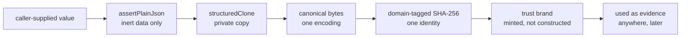

# contracts/CONTRACTS

**Explored:** 2026-08-20 · **Commit:** `b6f0b74` · **Covers:** `src/contracts/`

`src/contracts/` is the bottom layer: TypeScript contract modules plus generated JSON Schemas that define what a valid thing looks like and how to prove a thing is what it claims. Everything else imports from here; nothing here imports back out.

The premise it serves: durable files in `.archflow/` are the system's *only* memory across sessions, and the things writing them are language models. So the whole layer is built around one idea — **nothing an agent says is trusted until the server has re-derived it.**

## The core concepts

**Durable documents.** The JSON files ArchFlow writes into the repo — task state, intent receipts, gate requests/decisions, result manifests. After a crash or a host switch, the server rebuilds its entire understanding by reading them back, which is why their shapes are pinned as first-class types with schemas rather than ad-hoc objects. A `DocumentArtifactV1` normally names one projection. Design and phase-design results may also carry a sorted, path-unique `additional_documents` set, each with its task-relative path, repository projection target, byte count, and content digest. The primary path cannot be repeated in that set.

Durable gate V1 is monotonic on read. Current writers emit only the conversational gate shape, but archive readers also accept the exact older V1 request supersession, supplemental-review ledger, and superseded-decision forms. Compatibility parsing validates those retired fields instead of filtering them, preserves the original document bytes and digest as authority, and never promotes a superseded outcome into an approval. This separation matters because removing a field from the writer must not invalidate approvals already authenticated and committed under the same schema version.

The same rule runs in the other direction: *adding* a required field to a gate context must not invalidate approvals archived before it existed. `commit-authorization` gained required `baseline_commit`, `commit_message`, and `paths` fields when commit authorization became exact, so the archive reader also accepts that context's earlier four-key form. The tolerant schema is derived from the current one by omission, so every surviving field keeps its exact current constraints and the two cannot drift; writers remain held to the full shape. Tolerance is confined to reading — the published JSON Schema still advertises only the writer shape, and code that needs the exact-commit fields (commit observation, the status projection) asks whether the archived context carries them and treats their absence as "this approval attests no exact commit" rather than comparing against absent values. Without this, a schema tightening would strand five already-given human approvals behind `gate-approval-request-invalid` with no repair path, since editing the archive is itself a constitution violation.

**Canonical JSON.** Given the same logical data, `canonical.ts` produces exactly one byte sequence (sorted keys, fixed indentation, one trailing newline, UTF-8, no `NaN`/`undefined`). This makes "same data" and "same bytes" — and therefore "same digest" — the same statement, so any component can verify any other's claim without coordination. Parsing is strict in an unusual way: it re-renders and byte-compares against the input, so a durable file cannot be tampered with in any way that preserves its digest.

**Plain-JSON validation.** `assertPlainJson` rejects anything that isn't inert data: getters, foreign prototypes, symbol keys, non-enumerable properties, cycles, `__proto__` keys. The problem it solves is *reading the same object twice*: a getter could show one value to the validator and another to the hasher (a classic time-of-check/time-of-use split). The standard idiom is validate once, then `structuredClone` — every subsequent step reads a private copy the caller can't touch. This isn't paranoia about attackers so much as a hard-won lesson: an excluded field once reached a request digest through exactly this hole.

**Fingerprints and digests.** SHA-256 identities over canonical bytes. An `input_fingerprint` names everything a step depended on (workflow, config, constitution, rubric, upstream document identities) — with one deliberate exception: a counter-review `route_override` substitutes the dispatched route for a single call without changing the fingerprint, so two reviews of identical inputs can legitimately come from different reviewers; it is bound by the request digest instead, and recorded on the evidence; a `request_digest` names the semantic fields of one tool call; gate IDs and context digests bind decisions to situations. A human `preview_digest` separately binds the exact snapshot that was presented: revision, phase, gate kind, subject, context, evidence, options, and commit facts when present. Gate and waiver request digests then include both that preview identity and the nested `{choice, reason}`. If any input changes, the identity changes, and stale approvals stop applying. Every digest is domain-tagged (a `digest_kind` or string prefix), so a commit name and a file path can never collide into the same hash. A caller's own fingerprint or preview is always an *assertion* — the server recomputes it.

**Trust brands.** Types like "an authenticated review set" or "a validated triage" carry a `unique symbol` brand *and* are registered by object identity in a module-private `WeakSet`/`WeakMap` at mint time. A caller cannot construct a plausible look-alike object and pass it as trusted evidence — membership is by identity, not shape. Rules like "a dispatched route's adapter and model family must agree" are checked once, at minting, and the brand carries the proof forward. This pattern recurs across the whole codebase and is its signature move.

**Review workspace bindings.** A document envelope may bind a plain read-only checkout commit. An implementation envelope instead binds a `read-only-produced-repository-snapshot` with its base commit and declared snapshot digest. Source bytes remain in the server-materialized workspace rather than the JSON contract; the child verdict still binds the retained artifact digest and the exact control-envelope digest.

**Semantic workflow contracts.** `semantic-workflow.ts` defines the client-oriented view of the same durable workflow: human-readable position and condition, role/path/access resources, complete review findings, review context, gate presentation, invocation intent, backward-reopen impact, and one next action. Its public shapes deliberately omit revisions, fingerprints, request/evidence/subject digests, intent IDs, gate IDs, routing identities, and request templates. The corresponding internal offer binds those omitted authorities—including repository identity—and is represented to callers only as `af1_<canonical SHA-256>`. `archflow_status` and `archflow_apply` publish these contracts for every workflow; the four low-level durable request contracts remain unchanged underneath as the internal request vocabulary. A returned commit action also carries `requires_human_confirmation`: `true` preserves the client-held conversational confirmation after a human-authorized implementation gate, while `false` tells the client to execute without inventing that confirmation. For implementation, the latter identifies direct authenticated rule authority; document milestone commits use `false` after either authenticated human-gate authority or exact no-wait authority. The flag changes no Git fact and grants callers no right to infer authority from a settlement independently of the returned action.

## How the mechanisms compose

## The file clusters

- **Foundation** — `plain-json.ts`, `canonical.ts`, `yaml.ts` (one strict YAML door), `versions.ts`.
- **Vocabulary & primitives** — closed lists of phases/steps/gate policies; branded string types (`Sha256Digest`, `TaskSlug`, …); path-claim safety rules (no `..`, no pathspec magic); the four durable low-level tool names (durable-record vocabulary for existing state) and the two-name advertised catalogue.
- **Validation machinery** — `validators.ts`, now just the shared error class and the three set predicates (`isSortedUniqueBy`, `tupleKey`, `hasUniqueObjectPropertyValues`) every ordering `.refine()` calls. The Ajv compiler and its custom-keyword registry moved to the test tree (`test/helpers/json-schema.ts`); production never compiles a JSON Schema.
- **Fingerprints** — all derived identity computation in one module.
- **Evidence & trust semantics** — review/constitution-review/triage shapes in three assurance flavors (`agent-declared`, `server-attested`, `degraded`), the trust brands, secret-scan shapes, and renderers that escape control characters so rendered evidence can't spoof its own headers.
- **Durable document shapes** — the `durable-*.ts` modules for persisted roots, plus `durable.ts`, one large cross-document semantic validator. `TaskStateV1.last_transition` is the self-contained replay authority for the newest committed call. State also owns `rule_settlements` inline: both waiting and no-wait conclusions bind the exact phase instance, subject, config, and settlement revision, with no separate durable root or registry entry. Under the exact shipped v2 acceptance profile, the server may consume a current `wait:false` settlement for direct advancement after the other authenticated checks pass; `wait:true` opens a human presentation, and mismatched or legacy policy remains fail-closed. Neither record is caller authority. Optional `restart_history` keeps older state readable while giving each backward planning restart a stable ID, source/target, exact human reason, revision, superseded results, cleared waivers and pending revision, and human provenance in one of three arms: a declared local trace through a connected host, a declared local trace through `archflow-local`, or a server-attested `connected-request-trace` (connection, invocation, and request digests) constructed by the MCP state handler when the restart arrived as an authenticated tool call. Legacy import initialization also pins its derived resume phase, planned final phase, target ref, commit message, mapping, and every staged payload digest; the migration gate must reproduce those bindings exactly. `AuthoritativeResultRef` carries no path because `authority/results/<result-digest>.json` is derived. A compound design document result expands its primary and additional documents into the manifest's complete outputs and projections, and derives one snapshot digest over that exact set; retained payloads make each projection independently recoverable. `ImplementationOutputV1.verification_evidence` requires the digest and byte count of the ignored raw transcript.
- **Tool contracts & errors** — the four low-level durable request contracts (the internal request vocabulary the semantic composer derives from and durable records cite; nothing advertises or dispatches them — see `../mcp/SERVER.md`), the two semantic tool contracts, gate kinds and decisions, human gate presentations, human-revision references, and the project/protocol error taxonomies. The internal state operation set keeps its additive `planning_restart` arm as the bounded restart kernel's entry point; it does not alter the durable four-name record vocabulary. Gate and waiver requests carry the human decision pair — the presented preview digest plus a nested `{choice, reason}` — as closed semantic request fields rather than unauthenticated transport metadata. `design-approval` is a distinct durable union arm: its context binds document kind, per-rule compliance and trigger evidence, eligible waivers, target ref, baseline Git commit, and commit message, while one decision covers approval, revision, rejection, or a waiver request. `commit-authorization` additionally binds its target ref, baseline, deterministic message, sorted paths, and implementation diff. `STATE_INVALID` deliberately recommends inspecting current authority rather than a fictional generic repair: its many issue codes do not share one safe mutation, and retained-output restore is not state repair. The technical shapes remain authority, but user-facing skills consume the conversational projection and expose raw bindings only for diagnostics.
- **Semantic workflow contracts** — `semantic-workflow.ts` and its generated schema define the live status/apply vocabulary, strict nested submission unions, internal offers, semantic result/failure envelopes, and closed named substeps. `semantic-actions.ts` validates a current offer, preserves one repository-bound operation digest across fixed compound substeps, and executes one bounded action before returning a freshly authenticated view. The named boundaries include `triage-enter`, `decision-archive`, `decision-settle`, and `revise-enter`: archive and settlement are nonblocking server services, while revision settlement is close-only and cannot itself reopen document writes.

## One shape authority: Zod generates the schemas

The Zod parsers are the single runtime shape authority. Committed schemas under `schemas/v1/` are generated from the Zod sources by `npm run generate:schemas` (manifest in `internal/schema-generation.ts`, one plan module per shape group, including semantic workflow), and `npm run check:schemas` re-renders them during the explicit validation gate and fails on any byte drift, so the committed documents cannot disagree with the code. The release manifest stays hand-written: it describes the release payload itself, is consumed only by `scripts/release-support.mjs`, has no Zod source, and the generator refuses to emit it.

Why generate at all? The schemas are the *published* contract — something a third-party tool can compile with a stock draft-2020-12 validator. Generation ends the era of dual authorities: shapes used to exist as hand-written JSON Schema *plus* a Zod mirror, with `assertZodAgreement` proving the two matched.

The custom `x-archflow-*` keywords mostly retired with that flip. Rules that used to live in Ajv keyword callbacks — set ordering and uniqueness (`x-archflow-sorted-unique`, `x-archflow-sorted-unique-by`, `x-archflow-unique-by`), UTF-8 byte caps and NFC form (`x-archflow-max-utf8-bytes`, `x-archflow-nfc` outside `project-error`), and review, adjudication, gate, human-revision, and result-expectation semantics — now live only as Zod `.refine()`/`superRefine` logic in each shape's source, proven by negative fixtures; the generated documents simply omit the keyword and are deliberately weaker there. Three survivals: the generated `mcp-tools` document re-emits `x-archflow-mcp-semantics` on its root via `.meta` (so external validators keep the cross-field input rules), the generated `project-error` document keeps the byte/NFC pair on its hand-authored path-claim def and sorted-unique markers on its two offending-paths lists, and the hand-written release manifest keeps its set keywords. A per-def `overrides` hook in the manifest hand-authors emissions Zod cannot render faithfully. Tests compile the committed documents through `test/helpers/json-schema.ts`, a dev-only strict Ajv that registers exactly the surviving keywords.

Adjudication has deliberately different provider and durable shapes. The child returns the bound identity plus its independent `rule_findings` and `drift_findings`; it cannot return the four redundant summaries. After strict parsing, the server folds those findings into `constitution`, `drift`, `matched_rule_versions`, and `uncertain_rule_versions`, then mints the unchanged complete evidence document. The observation digest still names the exact reduced bytes the child returned. Persisted evidence remains strict about all four summaries, so stored or imported evidence cannot contradict its findings.

## Design rules that follow from this layer

Two conventions documented in the project's CLAUDE.md come straight from here and are worth restating:

- **Persisted types are `type` aliases, never `interface`** — the canonical-document machinery type-checks the whole reachable graph, and only aliases get implicit index signatures; this also closes declaration merging, so a persisted shape is exactly what its schema says.
- **Property reads require `enumerable` as well as `value`** — rejecting accessors prevents split observation; rejecting non-enumerable data prevents a field invisible to serialization (and thus to digests) from being treated as present.

## Where to be skeptical

The audit's biggest finding here — shapes written twice (JSON Schema + Zod) with a third mechanism proving agreement — was resolved 2026-08-11 by the generation flip above. What remains worth watching is subtler: the generated documents are weaker than the runtime authority wherever a keyword retired, so "it passes the published schema" is not "the server will accept it". See `../COMPLEXITY.md` for the ranked list.
