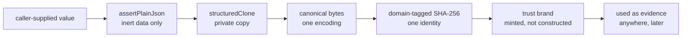

# contracts/CONTRACTS

**Explored:** 2026-08-10 · **Commit:** `50a218d` · **Covers:** `src/contracts/`

`src/contracts/` is the bottom layer: ~44 modules plus 41 JSON Schemas that define what a valid thing looks like and how to prove a thing is what it claims. Everything else imports from here; nothing here imports back out.

The premise it serves: durable files in `.archflow/` are the system's *only* memory across sessions, and the things writing them are language models. So the whole layer is built around one idea — **nothing an agent says is trusted until the server has re-derived it.**

## The five core concepts

**Durable documents.** The JSON files ArchFlow writes into the repo — task state, intent receipts, gate requests/decisions, result manifests, checkpoints. After a crash or a host switch, the server rebuilds its entire understanding by reading them back, which is why their shapes are pinned as first-class types with schemas rather than ad-hoc objects.

**Canonical JSON.** Given the same logical data, `canonical.ts` produces exactly one byte sequence (sorted keys, fixed indentation, one trailing newline, UTF-8, no `NaN`/`undefined`). This makes "same data" and "same bytes" — and therefore "same digest" — the same statement, so any component can verify any other's claim without coordination. Parsing is strict in an unusual way: it re-renders and byte-compares against the input, so a durable file cannot be tampered with in any way that preserves its digest.

**Plain-JSON validation.** `assertPlainJson` rejects anything that isn't inert data: getters, foreign prototypes, symbol keys, non-enumerable properties, cycles, `__proto__` keys. The problem it solves is *reading the same object twice*: a getter could show one value to the validator and another to the hasher (a classic time-of-check/time-of-use split). The standard idiom is validate once, then `structuredClone` — every subsequent step reads a private copy the caller can't touch. This isn't paranoia about attackers so much as a hard-won lesson: an excluded field once reached a request digest through exactly this hole.

**Fingerprints and digests.** SHA-256 identities over canonical bytes. An `input_fingerprint` names everything a step depended on (workflow, config, constitution, rubric, upstream document identities); a `request_digest` names the semantic fields of one tool call; gate IDs and context digests bind decisions to situations. If any input changes, the identity changes, and stale approvals stop applying. Every digest is domain-tagged (a `digest_kind` or string prefix), so a commit name and a file path can never collide into the same hash. A caller's own fingerprint is always an *assertion* — the server recomputes it.

**Trust brands.** Types like "an authenticated review set" or "a validated triage" carry a `unique symbol` brand *and* are registered by object identity in a module-private `WeakSet`/`WeakMap` at mint time. A caller cannot construct a plausible look-alike object and pass it as trusted evidence — membership is by identity, not shape. Rules like "a counter-review must come from the opposite family" are checked once, at minting, and the brand carries the proof forward. This pattern recurs across the whole codebase and is its signature move.

## How the mechanisms compose

## The file clusters

- **Foundation** — `plain-json.ts`, `canonical.ts`, `yaml.ts` (one strict YAML door), `versions.ts`.
- **Vocabulary & primitives** — closed lists of phases/steps/gate policies; branded string types (`Sha256Digest`, `TaskSlug`, …); path-claim safety rules (no `..`, no pathspec magic); the four tool names.
- **Validation machinery** — the Ajv setup with ten custom `x-archflow-*` keywords; `assertZodAgreement`, which proves the JSON Schemas and their Zod mirrors accept and reject exactly the same values.
- **Fingerprints** — all derived identity computation in one module.
- **Evidence & trust semantics** — review/constitution-review/triage shapes in three assurance flavors (`agent-declared`, `server-attested`, `degraded`), the trust brands, secret-scan shapes, and renderers that escape control characters so rendered evidence can't spoof its own headers.
- **Durable document shapes** — thirteen `durable-*.ts` modules for the persisted roots, plus `durable.ts`, one large cross-document semantic validator.
- **Tool contracts & errors** — the four tools' input/output types (each input is a union: the full payload, or the four-field staged-request reference `{schema_version, task_id, intent_id, request_digest}` the server rehydrates from disk — see `../mcp/SERVER.md`; the former `AdjudicateInput`/`AdjudicateSuccess` are gone, and `CounterReviewSuccess` carries the merged result `{path, verdict, blocking_count, constitution, revision, request_digest}`), gate kinds and decision envelopes, and the ~57-code project error taxonomy where every error carries an owner, a retryable flag, and a suggested action.

## Design rules that follow from this layer

Two conventions documented in the project's CLAUDE.md come straight from here and are worth restating:

- **Persisted types are `type` aliases, never `interface`** — the canonical-document machinery type-checks the whole reachable graph, and only aliases get implicit index signatures; this also closes declaration merging, so a persisted shape is exactly what its schema says.
- **Property reads require `enumerable` as well as `value`** — rejecting accessors prevents split observation; rejecting non-enumerable data prevents a field invisible to serialization (and thus to digests) from being treated as present.

## Where to be skeptical

This layer is also where the audit found the most duplication: agent-facing shapes are written twice (JSON Schema + Zod) with a third mechanism proving agreement; the error taxonomy exists in full in both a 2,800-line schema and a Zod module; some business logic lives in custom Ajv keywords *and* in `durable.ts`. See `../COMPLEXITY.md` for the ranked list.
