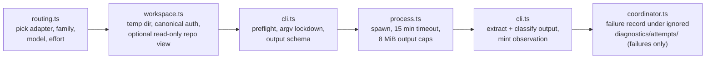

# mcp/DISPATCH

**Explored:** 2026-09-12 · **Commit:** `7f97fe0` · **Covers:** `src/dispatch/`, `src/contracts/semantic-workflow.ts`, `src/mcp/handlers/counter-review.ts`, `src/mcp/handlers/session.ts`, `src/state/semantic-actions.ts`, `src/state/workspace-cleanup.ts`

Review delivery continues to use the existing CLI adapters. Fresh child output prefers one report string, and locally extracted JSON with other shapes is preserved as feedback. Successful extracted bytes are retained before server evidence construction; failures there retain bounded validation diagnostics rather than triggering another model call.

Dispatch turns a semantic `review` action into server-run general, dedicated test, and constitution reviewer processes. The server supplies sealed role-specific inputs, captures validated output, and binds it to contributor provenance, so the producer cannot author the evidence. Required children share the same ordered server-materialized repository views and run concurrently.

## The flow

- **`routing.ts`** — pure role-local policy. It selects raw route candidates in fixed order: human one-dispatch `route_override`, invocation-declared routes, producer-specific configured routes (`producers.<host>`), phase override, top-level fallback configured routes (`roles`), then the applicable built-in default. The producer host (`claude`, `codex`, `antigravity`) is derived from the connected client. `counter-reviewer` may be one route or an array (`counter-reviewers`); `test-reviewer` is used only by phase design and implementation and falls back to `gpt-5.6-luna` at `xhigh`; `effort-reviewer` uses the same shipped fallback for phase-design effort selection. Each candidate validates into `{adapter, family, model, effort, provider?}`.
- **`workspace.ts`** — builds disposable state outside the repo, passes each selected first-party CLI its canonical authentication home, constructs a narrow environment, and creates the read-only repository view. A counter-review call lends one lazily materialized repository view to every concurrent dispatch (`shareRepositoryViewWorkspace`), while the coordinator creates a separate `children/<attempt-id>/` scratch root and points that child's `TMPDIR` there. Rubric and constitution children therefore inspect byte-identical repository bytes without same-adapter schema, output, or CLI-temporary filenames colliding. Authentication is deliberately not copied, linked, or virtualized: token refresh remains ordinary mutable CLI state. For implementations it applies authenticated retained after-images to the archived baseline without consulting the live worktree.
- **`cli.ts`** — the three adapters (`claude-cli`, `codex-cli`, `antigravity-cli`): version/auth preflight with minimum CLI versions (`claude`, `codex`, and `agy`), adapter-specific launch arguments (Claude and Codex constrain tools or sandboxing and suppress selected configuration; Antigravity currently disables slash commands but retains host tools and context), output-schema projection into each host's dialect, output extraction, and failure classification. All three feed the sealed envelope to the child on stdin, never on argv — `agy` takes it as one `--input-format stream-json` user message and answers with a final `result` event — and codex and agy read the output schema from a workspace file. Linux rejects any single argv element of 128 KiB or more (`MAX_ARG_STRLEN`) with `E2BIG` no matter how small the total is; a pinned design once crossed that line and the dispatch died with an unclassified spawn error. `process.ts` now refuses an oversized argv element before spawning and classifies a real `E2BIG` as `PROCESS_FAILED` / `argument-list-too-long`, so the failure is nameable on every platform. The coordinator seam memoizes a successful preflight per adapter for the server process (successes only, reset by tests); a failure — including cancellation — re-runs on the next dispatch, and auth lost after a memoized success still fails visibly at child launch.
- **`process.ts`** — one child run: detached spawn, piped stdio, 15-minute timeout, 8 MiB per-channel cap, SIGTERM→SIGKILL escalation.
- **`coordinator.ts`** — assembles one attempt end to end and always disposes the process workspace. Its existing random-ID forensic record remains failure-only and may contain local channel tails. Separately, classified route/dispatch failure writes one deterministic latest-only `dispatch-counter-review-<attempt>.json` observation with bounded public-safe facts. The semantic view reads only that compact record and only while its task, phase, running step, attempt, and revision match. Both products live under ignored current-phase diagnostics and cleanup removes them after the phase advances.

## The read-only repository view

The resolved configured set is the only membership source. A one-repository review preserves the historical `<workspace>/repo` cwd and envelope arm. With secondaries, the child cwd is `<workspace>/repos`, containing `primary/` first and then each configured secondary by ordinal name; findings cite paths such as `apis/src/handler.ts`. Document members are archived at their already-observed HEADs. During implementation review the primary uses the artifact's attested `base_commit` with retained projections applied, while a secondary without an authenticated implementation section is commit-only context at observed HEAD—even when configured `writable`. The compact envelope names each repository and binds its identity and commit; proposed trees additionally bind a snapshot digest.

For implementation review, the view is evidence rather than the review subject. The subject is the declared outputs, co-produced documents, and their current behavior. Reviewers may inspect unchanged files to trace direct dependencies, interfaces, and effects, but must not report unrelated pre-existing defects. Every implementation finding must describe a material defect introduced, exposed, or worsened by the current change. Unchanged writable members and context-only repositories remain supporting context.

Each baseline is a `git archive | tar -x` extraction, deliberately **not** a worktree: no snapshot contains `.git`. The primary removes `.archflow/tasks` and `.archflow/constitution` (the pinned constitution travels in the sealed envelope, so unpinned or drifted working-tree rules cannot become conflicting context); every secondary removes `.archflow` completely, so another repository's task and policy state cannot become review context. Applying a primary produced projection likewise omits task-authority entries (including a retained implementation log), and rejects escapes, symlink parents, and directory collisions; repository names never reach the filesystem unchecked because the ordered view plan is validated first (index 0 is literally `primary`, every other member is a declared repository name), so each view is a direct child of its container by construction. Unrelated live-worktree edits are never copied.

## What is and isn't guaranteed

State this plainly, because the init skill forbids overclaiming it: **dispatch context hygiene is best-effort, not an enforced isolation boundary.** Nothing filesystem-level prevents the child from reading outside its view. ArchFlow does not place the real repository path in the child environment or envelope, and the review inputs are exactly the sealed envelope plus the pinned view; the developer's home and credentials are intentionally not isolated from a first-party child running as that developer.

Other properties worth knowing:

- **A producer invocation may declare normal routes.** Optional `review_routes` travels in the complete invocation and becomes internal `invocation_routes` for each fresh review in that run. It binds offer, operation, and request identity but not reviewed-input identity. Per-role omission falls back to live config; changing invocation bytes between status and apply stales the offer.
- **A dispatching semantic review retains one exceptional submission seam.** Its offer names `review-dispatch`; a supplied reason-bearing `route_override` names either role and wins over invocation/config only for that dispatch. It is not the normal invocation carrier and never edits either source. The server validates the route shape and records actual and displaced route provenance, but does not server-authenticate the human origin of the override (see `docs/LIMITATIONS.md`). Fresh evidence records the actual route/provider/source and displaced raw route context. Classified failure keeps the same review offer and adds safe `dispatch_failure` facts so the owning skill can explain repair or ask for the human substitute; it never launches a fallback automatically.
- **One review is in flight at a time; all its children fly together in parallel** — a module-level promise queue bounds the server process to one counter-review per link. A semantic review acquires this as an outer FIFO around replay, dispatch, and commit, then calls the counter-review handler's direct inner seam; the inner call never queues again. Selected general reviewers, the test specialist when applicable, and any constitution reviewer are enqueued as one link via `serializeDispatchAll`. A fresh round runs all configured contributors; V4 follow-up runs the working AI’s selected previous reviewers plus required constitution/effort work. Archived structured remediation retains its authenticated finding-owner mapping. They execute concurrently in the same ordering domain — never as a nested acquisition, which would deadlock the link against itself. The bound is one review in flight, not one child. It is not an authentication lock and does not coordinate separate MCP servers or interactive CLI sessions. Every child runs to completion whether or not a sibling fails: each validates and retains its own output, the link is released and shared repository view disposed only after all settle, and a retry dispatches only children without retained valid output (see `../review/COUNTER-REVIEW.md`). No cancellation signal is plumbed between siblings; a client abort cancels them all together.
- **Authentication stays canonical** — both children receive the caller's real `HOME`; Codex also receives the caller's `CODEX_HOME` (or the normal `$HOME/.codex` default), while Claude receives an existing `CLAUDE_CONFIG_DIR` override. This is required for first-party atomic credential replacement: a disposable symlink/copy can strand a newly rotated OAuth token when the temporary workspace is deleted. The pinned `--safe-mode` / `--ignore-user-config` flags suppress custom instructions independently of where authentication lives.
- **Critical feedback is a successful tool result.** Fresh V4 children return readable reports, not pass/fail verdicts. The working AI interprets the feedback through triage; receiving a report does not itself authorize advancement. Archived structured reviews retain their original verdict meanings.
- **A route may name a cc-switch provider (claude routes only).** The optional per-route `provider` string in `config.yaml` wraps the claude child launch as `cc-switch start claude <provider> -- <lockdown argv…>`: cc-switch supplies the `claude` binary and runs it with the provider's settings file without changing the globally selected provider. Unset or empty means a plain direct launch, byte-identical to a route without the field. The wrap prepends the user's `~/.local/bin` to the child `PATH` (the MCP server process often lacks it); the provider id itself never needs shell quoting because the child is spawned from an argv array, not a shell string. Two known limits, both accepted for now: `--setting-sources ""` suppressing discovery is expected to compose with cc-switch's explicit `--settings` file but is CLI-version-coupled (see Fragility below), and the dispatch preflight still probes the globally installed `claude` directly — an install reachable only through cc-switch fails `CLI_MISSING`, and a provider whose auth the global CLI cannot see fails `AUTH_UNAVAILABLE`.
- **Mid-dispatch drift is caught.** After all required children return, the server re-authenticates the artifact and projection, re-resolves set identity, and rechecks every HEAD-pinned repository. Membership, mode, identity, or commit drift aborts with `counter-review-subject-not-current`; no partial evidence lands. A declared secondary that cannot be opened, identified, or resolved to a HEAD surfaces as the named, location-free `REPOSITORY_VIEW_UNAVAILABLE` failure whether the loss happens before dispatch or at this post-dispatch recheck, and the review offer is preserved for repair and retry; aliased or nested declarations stay `CONFIG_INVALID`.
- **Reviews can legitimately take up to fifteen minutes** — the child is doing a real exploration of the pinned checkout.

## Fragility to watch

Public recommendation output reports the selected implementation model and effort plus optional advisory rationale. Dispatch never copies advice into invocation routing; a suggestion to settle or isolate costly work grants no authority.

Two parts of this subsystem are version-coupled to the external CLIs and will drift over time: the lockdown argv (flag sets written out literally per CLI release) and the failure classifier, which parses free-text CLI error messages with regexes to detect rate limits and extract model names. When a host CLI updates, look here first.

A third part is coupled to the *providers* behind those CLIs: output-schema projection. Every advertised root remains a plain object. Fresh report review accepts extracted JSON as readable feedback without requiring a finding taxonomy. Constitution slot properties and effort-selection bindings still have strict child contracts checked by the normative local validator. A provider that tightens its structured-output validator surfaces as an unclassified `PROCESS_FAILED`, and only the opt-in real-host suite (`ARCHFLOW_REAL_HOSTS=1 npm run test:real-host`) can catch it — the local schema compiler accepts far more than the providers do.

Adjudication V2 uses a plain object root whose `judgments` property has one opaque server-created slot per active rule. Each slot accepts only compliance, rationale, trigger, and trigger evidence. The server checks exact slot-set equality, maps slots to rules, and derives identity, order, constitution status, and matched/uncertain trigger rollups. Approved-upstream drift and generic findings are absent. Normative validation materializes one inert clone before repeated inspection, so accessors or non-enumerable properties cannot split validation from hashing.

Fresh review requests a simple report object. Its generated schema passes through the same host projection as other outputs: `$schema`, `$id`, and unsupported metadata are removed before the CLI receives it. Successfully extracted JSON with other shapes is retained as readable feedback. The server stamps reviewer, route, and subject provenance without deriving a verdict or finding census. Archived V1–V3 evidence keeps its original readers. Each child remains isolated in the existing read-only review workspace.

For implementation review, a changed writable secondary now receives its authenticated retained proposed tree rather than HEAD context. The repository-view plan remains the single source for filesystem materialization, child bindings, and evidence pins. Unchanged writable and context-only members stay commit-pinned at HEAD. All views still remove secondary `.archflow/`, and the child remains a first-party process under best-effort context hygiene rather than OS-enforced confinement.

Phase-design review also dispatches an effort selector using the configured `effort-reviewer` route (shipped default `gpt-5.6-luna` at `xhigh`). The server captures the phase plan and hazard registry once, while ordinary reviewer routes retain their existing prevalidation. Rubric, dedicated test, selector, and constitution children share the byte-identical repository workspace.

The selector schema accepts exact subject bindings, one allowed profile ID, and an optional free-form rationale about remaining implementation difficulty. Missing rationale is tolerated locally; Codex strict projection requires the field and accepts an empty string. The explanation is informational and cannot select a workflow action. Any selector input, route, process, schema, or binding failure produces the server-owned `gpt-5.6-sol`/`medium` default; it is excluded from the round's failure list, creates no retry or substitution boundary, and cannot discard or delay ordinary review evidence.

## Automation responsibility

The handler wraps general and constitution dispatch in the durable retry journal. Two retries are allowed only for positively classified transient failures, using the same normalized route and existing sibling-output reuse. The journal is operational state, not evidence or approval. Repair and substitute-route authorization remain explicit after exhaustion; the effort selector retains its separate default-on-failure behavior.

## Model defaults and limits

Shipped counter-review defaults use Sol medium for Claude producers and Fable 5.1 medium (`claude-fable-5-1`) for Codex producers; Antigravity producers receive both. Luna/xhigh test and effort reviewers and Gemini/high adjudicators remain unchanged. Existing explicit task/repository routes are not rewritten by a template update.

Route validation rejects `gpt-6-astra` at `max` effort before dispatch, including configured, invocation-declared, and substitution routes. The error explains that Astra max is disabled; no silent downgrade occurs. An invalid effort-selector route still takes its existing Sol-medium advice fallback. Astra low/high are valid Codex routes. Implementation recommendations remain separate from these dispatch routes.
