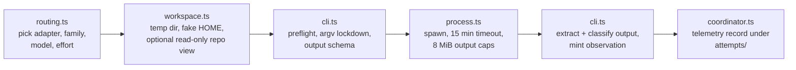

# mcp/DISPATCH

**Explored:** 2026-08-10 · **Commit:** `50a218d` · **Covers:** `src/dispatch/`

Dispatch is how the server turns "get an independent review" into a real child process running the *other* model family's CLI. It exists so that counter-review and adjudication evidence is something the producer **cannot author** — the server itself spawns the reviewer, captures its bytes, and binds the output to its provenance.

## The flow

- **`routing.ts`** — pure policy. Given the task config, phase, and role, it picks `{adapter, family, model, effort}`. Family is inferred from the model name prefix (`claude-*` / `gpt-*`), and the cross-family rule is enforced here: a counter-reviewer or adjudicator in the producer's own family fails with `FAMILY_MISMATCH`.
- **`workspace.ts`** — builds a disposable sandbox outside the repo: a fake `HOME` containing a symlink to only the one relevant credential file, a 7-name environment allowlist, and (for counter-review) a read-only repository view.
- **`cli.ts`** — the two adapters (`claude-cli`, `codex-cli`): version/auth preflight with minimum CLI versions, a hard-coded lockdown argv (read-only tools, no slash commands, no session persistence, no user config), output-schema projection into each host's dialect, output extraction, and failure classification.
- **`process.ts`** — one child run: detached spawn, piped stdio, 15-minute timeout, 8 MiB per-channel cap, SIGTERM→SIGKILL escalation.
- **`coordinator.ts`** — assembles one attempt end to end, always disposes the workspace, and always writes a JSON telemetry record under `.archflow/tasks/<task>/attempts/`, with stdout/stderr tails on failure.

## The read-only repository view

The reviewer gets a checkout of the repository at one pinned commit — HEAD for document reviews, the artifact's attested `base_commit` for implementation reviews (so the reviewer sees the *pre-change* tree; the changes travel only in the envelope).

The checkout is a `git archive | tar -x` extraction, deliberately **not** a worktree: the extracted tree has no `.git` link, so the reviewer cannot reach the producer's tracked self-review or triage material, and `.archflow/tasks` is deleted from the view. Reviewer independence holds structurally, not by convention.

## What is and isn't guaranteed

State this plainly, because the init skill forbids overclaiming it: **dispatch context hygiene is best-effort, not an enforced isolation boundary.** Nothing filesystem-level prevents the child from reading outside its view; the guarantee is that the real repository path is never disclosed to it, credentials other than its own are not present, and its inputs are exactly the sealed envelope plus the pinned view.

Other properties worth knowing:

- **Dispatches are serialized process-wide** — one child at a time, via a module-level promise queue. This avoids concurrent use of shared credential stores, at the cost of throughput and with no cancellation or fairness.
- **A `fail` verdict is a successful tool result.** The dispatch machinery records what the reviewer said; it never converts a bad review into an error or manufactures advancement.
- **Mid-dispatch drift is caught.** After the child returns, the server re-checks the artifact's digest and aborts with `counter-review-subject-not-current` if the subject changed while the review ran.
- **Reviews can legitimately take up to fifteen minutes** — the child is doing a real exploration of the pinned checkout.

## Fragility to watch

Two parts of this subsystem are version-coupled to the external CLIs and will drift over time: the lockdown argv (flag sets written out literally per CLI release) and the failure classifier, which parses free-text CLI error messages with regexes to detect rate limits and extract model names. When a host CLI updates, look here first.
