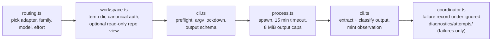

# mcp/DISPATCH

**Explored:** 2026-08-13 · **Commit:** `66c4c9b` · **Covers:** `src/dispatch/`, `src/state/workspace-cleanup.ts`

Dispatch is how the server turns "get an independent review" into a real child process running the *other* model family's CLI. It exists so that counter-review and constitution-review evidence is something the producer **cannot author** — the server itself spawns the reviewer, captures its bytes, and binds the output to its provenance. One `archflow_counter_review` call may run two child dispatches sequentially. Both receive sealed control envelopes and the same server-materialized repository view; when the subject is an implementation, that view is the exact retained post-change snapshot.

## The flow

- **`routing.ts`** — pure policy. Given the task config, phase, and role, it picks `{adapter, family, model, effort}`. The config roles stay `producer` / `counter-reviewer` / `adjudicator`: `adjudicator` is now simply the model/effort route for the constitution-review child, and the producer is always the connected MCP host itself (derived from the initialize handshake) — it is never dispatched. Family is inferred from the model name prefix (`claude-*` / `gpt-*`), and the cross-family rule is enforced here for both dispatched routes: a counter-reviewer or constitution reviewer in the producer's own family fails with `FAMILY_MISMATCH`.
- **`workspace.ts`** — builds a disposable workspace outside the repo, passes the selected first-party CLI its canonical authentication home, constructs a narrow environment, and creates a read-only repository view for each review child. Authentication is deliberately not copied, linked, or virtualized: token refresh remains ordinary mutable CLI state. For implementations it applies authenticated retained after-images to the archived baseline without consulting the live worktree.
- **`cli.ts`** — the two adapters (`claude-cli`, `codex-cli`): version/auth preflight with minimum CLI versions, a hard-coded lockdown argv (read-only tools, no slash commands, no session persistence, no user config), output-schema projection into each host's dialect, output extraction, and failure classification.
- **`process.ts`** — one child run: detached spawn, piped stdio, 15-minute timeout, 8 MiB per-channel cap, SIGTERM→SIGKILL escalation.
- **`coordinator.ts`** — assembles one attempt end to end and always disposes the process workspace. Telemetry is **failure-only**: a failed dispatch (workspace setup, timeout, cancellation, nonzero exit, bad output) writes a JSON forensic record under ignored `.archflow/runtime/tasks/<task>/diagnostics/attempts/` with its failure stage, safe local exception detail for otherwise-unclassified setup failures, stdout/stderr tails, and the preflight's managed-policy observations; a successful dispatch writes nothing there. Attempts are current-phase diagnostics and cleanup removes them when the phase advances.

## The read-only repository view

Document reviewers get a checkout at pinned HEAD. Implementation reviewers get a checkout of the artifact's attested `base_commit` with the retained projection plan applied: additions, replacements, deletions, symlinks, and executable modes reconstruct the exact proposed tree. The compact envelope names the declared operations and binds the snapshot; source bodies and large diffs do not travel through stdin.

The baseline is a `git archive | tar -x` extraction, deliberately **not** a worktree: the extracted tree has no `.git` link, so the reviewer cannot reach the producer's tracked triage or pipeline material, and `.archflow/tasks` is deleted from the view. Applying a produced projection likewise omits task-authority entries (including a retained implementation log), and rejects escapes, symlink parents, and directory collisions. Unrelated live-worktree edits are never copied. Reviewer subject isolation therefore holds structurally, not by convention.

## What is and isn't guaranteed

State this plainly, because the init skill forbids overclaiming it: **dispatch context hygiene is best-effort, not an enforced isolation boundary.** Nothing filesystem-level prevents the child from reading outside its view. ArchFlow does not place the real repository path in the child environment or envelope, and the review inputs are exactly the sealed envelope plus the pinned view; the developer's home and credentials are intentionally not isolated from a first-party child running as that developer.

Other properties worth knowing:

- **Dispatches are serialized process-wide** — one child at a time, via a module-level promise queue. This bounds reviewer resource use within one MCP server process, at the cost of throughput and with no cancellation or fairness. It is not an authentication lock and does not coordinate separate MCP servers or interactive CLI sessions.
- **Authentication stays canonical** — both children receive the caller's real `HOME`; Codex also receives the caller's `CODEX_HOME` (or the normal `$HOME/.codex` default), while Claude receives an existing `CLAUDE_CONFIG_DIR` override. This is required for first-party atomic credential replacement: a disposable symlink/copy can strand a newly rotated OAuth token when the temporary workspace is deleted. The pinned `--safe-mode` / `--ignore-user-config` flags suppress custom instructions independently of where authentication lives.
- **A `fail` verdict is a successful tool result.** The dispatch machinery records what the reviewer said; it never converts a bad review into an error or manufactures advancement.
- **Mid-dispatch drift is caught.** After the child returns, the server re-checks the artifact's digest and aborts with `counter-review-subject-not-current` if the subject changed while the review ran.
- **Reviews can legitimately take up to fifteen minutes** — the child is doing a real exploration of the pinned checkout.

## Fragility to watch

Two parts of this subsystem are version-coupled to the external CLIs and will drift over time: the lockdown argv (flag sets written out literally per CLI release) and the failure classifier, which parses free-text CLI error messages with regexes to detect rate limits and extract model names. When a host CLI updates, look here first.

A third part is coupled to the *providers* behind those CLIs, and has already drifted once: the output-schema projection. It binds each server-derived subject field into the child's schema so a child cannot return a result bound to a different task or digest, and the accepted way to write that binding is not stable. Codex rejects an array-valued `const` outright, so array bindings (only `approved_upstream_digests` today) go to it as exact cardinality plus a closed element set instead; Claude still takes the plain `const`. A provider that tightens its structured-output validator surfaces as an unclassified `PROCESS_FAILED`, and only the opt-in real-host suite (`ARCHFLOW_REAL_HOSTS=1 npm run test:real-host`) can catch it — the local schema compiler accepts far more than the providers do.

The adjudication transport schema asks the child only for bound identity fields plus `rule_findings` and `drift_findings`. Constitution, drift, and trigger rollups are mechanical duplicates, so the server derives them after strict parsing and before minting the unchanged complete evidence shape. This prevents a structured-output host from satisfying the transport schema while contradicting its own findings. Normative parsing and attestation remain the authority: `observeAdjudication` compares every bound field, hashes the exact reduced child bytes, and returns no evidence unless all finding and coverage invariants hold.
