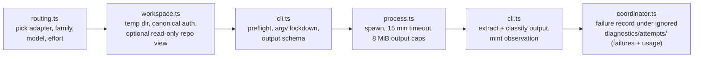

# mcp/DISPATCH

**Explored:** 2026-09-16 · **Commit:** `d795fee` · **Covers:** `src/dispatch/`, `src/contracts/semantic-workflow.ts`, `src/mcp/handlers/counter-review.ts`, `src/mcp/handlers/session.ts`, `src/state/semantic-actions.ts`, `src/state/workspace-cleanup.ts`

Review delivery uses the existing CLI adapters. Fresh general/test output requires the plain object `{outcome, feedback}`: either actionable issues or explicit `no_issues_found` signoff. Nonblank feedback is required; arbitrary JSON, absent outcomes, and failed processes never imply completion. Valid received feedback is reused after sibling failures; server evidence-construction failures keep diagnostic information without automatically spending another model call.

Dispatch turns a semantic `review` action into server-run general, dedicated test, and constitution reviewer processes. The server supplies sealed role-specific inputs, captures validated output, and binds it to contributor provenance, so the producer cannot author the evidence. Required children share the same ordered server-materialized repository views and run concurrently.

## The flow

- **`routing.ts`** — pure role-local policy. It selects raw route candidates in fixed order: human one-dispatch `route_override`, invocation-declared routes, producer-specific configured routes (`producers.<host>`), phase override, top-level fallback configured routes (`roles`), then the applicable built-in default. The producer host (`claude`, `codex`, `antigravity`) is derived from the connected client. `counter-reviewer` may be one route or an array (`counter-reviewers`); `test-reviewer` is used only by phase design and implementation and falls back to `gpt-5.6-sol` at `medium`; `effort-reviewer` uses `gpt-5.6-luna` at `xhigh` for phase-design effort selection. Each candidate validates into `{adapter, family, model, effort, provider?}`.
- **`workspace.ts`** — builds disposable state outside the repo, passes each selected first-party CLI its canonical authentication home, constructs a narrow environment, and creates the read-only repository view. A counter-review call lends one lazily materialized repository view to every concurrent dispatch (`shareRepositoryViewWorkspace`), while the coordinator creates a separate `children/<attempt-id>/` scratch root and points that child's `TMPDIR` there. Rubric and constitution children therefore inspect byte-identical repository bytes without same-adapter schema, output, or CLI-temporary filenames colliding. Authentication is deliberately not copied, linked, or virtualized: token refresh remains ordinary mutable CLI state. For implementations it applies authenticated retained after-images to the archived baseline without consulting the live worktree.
- **`cli.ts`** — the three adapters (`claude-cli`, `codex-cli`, `antigravity-cli`): version/auth preflight with minimum CLI versions (`claude`, `codex`, and `agy`), adapter-specific launch arguments (Claude and Codex constrain tools or sandboxing and suppress selected configuration; Antigravity currently disables slash commands but retains host tools and context), output-schema projection into each host's dialect, output extraction, and failure classification. All three use the shared file-input renderer and send no review payload through stdin. The coordinator seam memoizes a successful preflight per adapter for the server process (successes only, reset by tests); a failure — including cancellation — re-runs on the next dispatch, and auth lost after a memoized success still fails visibly at child launch.
- **`process.ts`** — one child run: detached spawn, piped stdio, 15-minute timeout, 8 MiB per-channel cap, SIGTERM→SIGKILL escalation.
- **`coordinator.ts`** — assembles one attempt end to end and always disposes the process workspace. Failed attempts retain the existing forensic record with bounded local channel tails. Successful Claude attempts retain only numeric usage and dispatch identity; their records contain no transcript. Accepted general/test feedback also carries usage durably, while standalone results return it to the caller. Separately, classified route/dispatch failure writes a deterministic `dispatch-counter-review-<attempt>.json` observation with bounded public-safe facts. That ignored observation retains the first sibling failure in a revision and is a fallback only: the current durable retry journal takes precedence and exposes every unresolved reviewer failure. The fallback is visible only while its task, phase, running step, attempt, and revision match. Ignored diagnostics are cleaned up after the phase advances; losing them does not lose journal-backed failure summaries.

Review prompts explicitly name the primary subject, governing documents, assigned rubric and complete diffs, explaining each file’s use. Adapters differ in whether a reference is expanded immediately or requires a tool read. Follow-ups supply the reviewer-specific revision diff, including document revisions. Source excerpts, conventions, and generated file listings are no longer injected automatically; the child can inspect the pinned codebase and is encouraged to batch independent reads. See [counter-review](../review/COUNTER-REVIEW.md#diffs-and-initial-review-material) for the file fallback and binding rules.

## Central dispatch usage

Installed runtimes write one small JSON record per actual CLI dispatch under `<ARCHFLOW_HOME>/usage/`, normally `~/.archflow/usage/`. The path is resolved beside the running `bundle/` directory, so a custom install home works without a runtime environment variable, and replacing `bundle/` during an update preserves the logs. Source checkouts do not write to a shared installation; tests and embedders can explicitly select a local destination.

Files are named `<completion-unix-ms>-<dispatch-uuid>.json`. Each records repository, task/phase/attempt when applicable, model/effort/provider, CLI version, envelope identity and size, timing, dispatch status, and a bounded failure code/stage. Claude records include reported input/output/cache/thinking tokens, turns, durations, and estimated cost. Other adapters still record dispatch timing and identity; absent token measurements are unknown, not zero. Status describes CLI dispatch completion, not approval or completion of the whole review round. Reused sibling feedback does not create another dispatch record.

The directory is created with mode `0700` and records with mode `0600`. No prompts, source, patches, feedback bodies, stdout, or stderr are copied into this central log. Separate per-dispatch files avoid interleaved concurrent writes from different MCP servers. Logging errors never change the review result.

Each completed dispatch removes regular usage-record files older than seven days, based on their completion timestamp. Cleanup skips unrelated files, directories, and symlinks. It runs on dispatch completion, not on a background timer: an idle installation cleans expired records on its next dispatch. This retention is independent of task cleanup and of the durable feedback's optional measurements.

## Local file transport and repository snapshots

The reviewer cwd is `<workspace>/review`. It contains `review-inputs/<reviewer>/` and `repositories/<name>/`; even a single repository is named `repositories/primary/`. All prompt references are local paths below that cwd. Child schema/output files stay in separate `<workspace>/children/<attempt>/` directories. Complete diffs are generated outside the review sandbox, authenticated by size and digest, then copied into each assigned reviewer's input directory.

Every adapter passes only the bounded Markdown instructions and reference list through argv and closes stdin without a payload. Codex and Antigravity load output schemas from files; Claude's inline schema remains guarded by the per-argument size check. The shared renderer enforces a 16 KiB instruction/reference limit, while `MAX_ARGV_ELEMENT_BYTES` also protects all arguments from Linux's per-element limit. No document or patch is truncated to fit argv.

Claude retains safe mode and `Read,Grep,Glob`, explicitly allowing the generated input directory. Codex enables the shell readers under `-s read-only` and suppresses user/project instructions as before. Antigravity retains its existing permissions and host context; it is not a hard filesystem sandbox. The [CLI probes](../validation/review-file-reference-probes.md) distinguish direct Claude inclusion from tool reads required by Codex and Antigravity, as well as Claude's large-file limitation.

The repository set still comes only from resolved task configuration. Document snapshots pin observed commits. Implementation snapshots apply authenticated retained after-images to each declared base; unchanged members remain supporting context. Paths in feedback can be attributed as `<name>/<path>`, with the corresponding files under `repositories/<name>/`.

Archives have no `.git` link to task blobs. The primary removes `.archflow/tasks` and `.archflow/constitution`; secondaries remove `.archflow` entirely. Task documents and pinned constitution rules are supplied separately from authenticated authority. Materialization rejects escapes and symlink parents and omits task-authority outputs. Unrelated live-worktree edits never enter the snapshots.

## What is and isn't guaranteed

State this plainly, because the init skill forbids overclaiming it: **dispatch context hygiene is best-effort, not an enforced isolation boundary.** Nothing filesystem-level prevents the child from reading outside its view. ArchFlow does not place the real repository path in the child environment or envelope, and the supplied review inputs are the rendered prompt, referenced files, and pinned snapshots; the developer's home and credentials are intentionally not isolated from a first-party child running as that developer.

Other properties worth knowing:

- **A producer invocation may declare normal routes.** Optional `review_routes` travels in the complete invocation and becomes internal `invocation_routes` for each fresh review in that run. It binds offer, operation, and request identity but not reviewed-input identity. Per-role omission falls back to live config; changing invocation bytes between status and apply stales the offer.
- **A dispatching semantic review retains one exceptional submission seam.** Its offer names `review-dispatch`; a supplied reason-bearing `route_override` names either role and wins over invocation/config only for that dispatch. It is not the normal invocation carrier and never edits either source. The server validates the route shape and records actual and displaced route provenance, but does not server-authenticate the human origin of the override (see `docs/LIMITATIONS.md`). Fresh evidence records the actual route/provider/source and displaced raw route context. Classified failure keeps the same review offer and adds safe `dispatch_failure` facts so the owning skill can explain repair or ask for the human substitute; it never launches a fallback automatically.
- **One review is in flight at a time; all its children fly together in parallel** — a module-level promise queue bounds the server process to one counter-review per link. A semantic review acquires this as an outer FIFO around replay, dispatch, and commit, then calls the counter-review handler's direct inner seam; the inner call never queues again. Selected general reviewers, the test specialist when applicable, and any constitution reviewer are enqueued as one link via `serializeDispatchAll`. A fresh round runs all configured contributors; Feedback follow-up runs the working AI’s selected previous reviewers plus required constitution/effort work. Archived structured remediation retains its authenticated finding-owner mapping. They execute concurrently in the same ordering domain — never as a nested acquisition, which would deadlock the link against itself. The bound is one review in flight, not one child. It is not an authentication lock and does not coordinate separate MCP servers or interactive CLI sessions. Every child runs to completion whether or not a sibling fails: each validates and retains its own output, the link is released and shared repository view disposed only after all settle, and a retry dispatches only children without retained valid output (see `../review/COUNTER-REVIEW.md`). No cancellation signal is plumbed between siblings; a client abort cancels them all together.
- **Authentication stays canonical** — both children receive the caller's real `HOME`; Codex also receives the caller's `CODEX_HOME` (or the normal `$HOME/.codex` default), while Claude receives an existing `CLAUDE_CONFIG_DIR` override. This is required for first-party atomic credential replacement: a disposable symlink/copy can strand a newly rotated OAuth token when the temporary workspace is deleted. The pinned `--safe-mode` / `--ignore-user-config` flags suppress custom instructions independently of where authentication lives.
- **Critical feedback is a successful tool result.** Fresh V5 children return `issues_found` or `no_issues_found` with concise feedback. These outcomes are reviewer judgments. The working AI interprets the feedback through triage; receiving a report does not itself authorize advancement. Archived structured reviews retain their original verdict meanings.
- **A route may name a cc-switch provider (claude routes only).** The optional per-route `provider` string in `config.yaml` wraps the claude child launch as `cc-switch start claude <provider> -- <lockdown argv…>`: cc-switch supplies the `claude` binary and runs it with the provider's settings file without changing the globally selected provider. Unset or empty means a plain direct launch, byte-identical to a route without the field. The wrap prepends the user's `~/.local/bin` to the child `PATH` (the MCP server process often lacks it); the provider id itself never needs shell quoting because the child is spawned from an argv array, not a shell string. Two known limits, both accepted for now: `--setting-sources ""` suppressing discovery is expected to compose with cc-switch's explicit `--settings` file but is CLI-version-coupled (see Fragility below), and the dispatch preflight still probes the globally installed `claude` directly — an install reachable only through cc-switch fails `CLI_MISSING`, and a provider whose auth the global CLI cannot see fails `AUTH_UNAVAILABLE`.
- **Mid-dispatch drift is caught.** After all required children return, the server re-authenticates the artifact and projection, re-resolves set identity, and rechecks every HEAD-pinned repository. Membership, mode, identity, or commit drift aborts with `counter-review-subject-not-current`; no partial evidence lands. A declared secondary that cannot be opened, identified, or resolved to a HEAD surfaces as the named, location-free `REPOSITORY_VIEW_UNAVAILABLE` failure whether the loss happens before dispatch or at this post-dispatch recheck, and the review offer is preserved for repair and retry; aliased or nested declarations stay `CONFIG_INVALID`.
- **Reviews can legitimately take up to fifteen minutes** — the child is doing a real exploration of the pinned checkout.

## Completed Gemini output after a temporary service error

Antigravity CLI 1.2.3 can mark its final JSON wrapper `ERROR` because an earlier Gemini capacity error remains in the conversation, even after the model recovers and completes its native `finish`. A longer review with source and diff reads has more opportunities to encounter those temporary errors; the wrapper alone does not establish whether the model finished.

The adapter recognizes this one case from the same invocation's stream: a clean exit, one terminal result for one turn, a native `finish` in state `DONE` after the error and as the last step, matching conversation identities, and final structured output. Every recorded step must have completed, and the terminal error must match Gemini's native 503 capacity-error format. Damaged streams, fatal stream events, unknown errors, later steps, timeouts, and cancellation cannot use this path. Older bare wrappers remain readable but carry no recovery proof.

Recovery only forwards the terminal `structured_output` bytes to normal validation. It never extracts answers from intermediate responses or stored conversations. Constitution judgments still pass exact slot coverage and provenance checks before dispatch recovery records success or retains the result. An unrecovered native capacity error uses the existing bounded transport retry policy; it does not change the selected route or retry budget.

Failed-attempt diagnostics retain terminal status, a bounded native error message, output presence, and error/finish step positions separately from the stdout tail. They also distinguish the process exit from the classified failure reason. Large schema metadata therefore cannot hide the reason for failure. These details stay in ignored local diagnostics; public failure messages remain fixed, safe summaries.

## Fragility to watch

Public recommendation output reports the selected implementation model, effort when specified, and advisory rationale. Dispatch never copies advice into invocation routing; a suggestion to settle or isolate costly work grants no authority.

Two parts of this subsystem are version-coupled to the external CLIs and will drift over time: the lockdown argv (flag sets written out literally per CLI release) and the failure classifier, which parses free-text CLI error messages with regexes to detect rate limits and extract model names. When a host CLI updates, look here first.

A third part is coupled to the *providers* behind those CLIs: output-schema projection. Every advertised root remains a plain object. Fresh report review accepts extracted JSON as readable feedback without requiring a finding taxonomy. Constitution slot properties and effort-selection bindings still have strict child contracts checked by the normative local validator. A provider that tightens its structured-output validator surfaces as an unclassified `PROCESS_FAILED`, and only the opt-in real-host suite (`ARCHFLOW_REAL_HOSTS=1 npm run test:real-host`) can catch it — the local schema compiler accepts far more than the providers do.

Adjudication V2 uses a plain object root whose `judgments` property has one opaque server-created slot per active rule. Each slot accepts only compliance, rationale, trigger, and trigger evidence. The server checks exact slot-set equality, maps slots to rules, and derives identity, order, constitution status, and matched/uncertain trigger rollups. Approved-upstream drift and generic findings are absent. Normative validation materializes one inert clone before repeated inspection, so accessors or non-enumerable properties cannot split validation from hashing.

Fresh review requests an explicit outcome and feedback through one strict object root. The host projection strips unsupported schema metadata, while the server validates the complete response. The server supplies provenance and optional CLI accounting; the model cannot supply either. Archived V1–V4 evidence keeps its original readers. A V4 report is not assigned a V5 outcome by parsing its prose. Each child retains the existing read-only review workspace.

For implementation review, a changed writable secondary now receives its authenticated retained proposed tree rather than HEAD context. The repository-view plan remains the single source for filesystem materialization, child bindings, and evidence pins. Unchanged writable and context-only members stay commit-pinned at HEAD. All views still remove secondary `.archflow/`, and the child remains a first-party process under best-effort context hygiene rather than OS-enforced confinement.

Phase-design review also dispatches an effort selector using the configured `effort-reviewer` route (shipped default `gpt-5.6-luna` at `xhigh`). The server captures the phase plan and hazard registry once, while ordinary reviewer routes retain their existing prevalidation. Rubric, dedicated test, selector, and constitution children share the byte-identical repository workspace.

The V5 assessment schema accepts exact subject bindings, one difficulty category, and a required nonempty rationale about remaining implementation reasoning. It rejects model choices and workload scores. The server captures effective implementation settings and benchmark data alongside the plan and deterministically selects the model. Route, process, output-schema, or binding failures use the bounded-reasoning threshold and captured preferences. Missing/invalid catalog references or no model above the minimum produces unavailable advice. These outcomes are excluded from the round's failure list, create no retry or substitution boundary, and cannot discard ordinary review evidence.

## Automation responsibility

The handler wraps general and constitution dispatch in the durable retry journal. Two retries are allowed only for positively classified transient failures, using the same normalized route and existing sibling-output reuse. The journal is operational state, not evidence or approval. Repair and substitute-route authorization remain explicit after exhaustion; the effort selector retains its separate default-on-failure behavior.

Status preserves the primary recovery boundary and includes the other unresolved failures in `dispatch_failure.additional_failures`. Both semantic and automation summaries name each route, its safe failure explanation, and its dispatch count. A successful retry removes that route's failure without hiding a sibling that still needs attention. This is a projection of the existing bounded journal, not a second retry mechanism.

Claude error wrappers identify HTTP 429 and session limits even when the CLI exits with code zero. Session-limit summaries explain that the allowance must reset or the human must explicitly select another route. Antigravity has a separate print deadline: its exact `[agy] print timeout after … with turn in progress; returning partial output` stderr diagnostic is classified as a CLI timeout before parsing output, including when it exits zero. The summary reports the CLI's duration, not ArchFlow's fifteen-minute process limit. Partial output remains rejected even if it includes structured JSON. Other stderr warnings and reviewer prose do not establish a timeout; missing structured output without this diagnostic remains an output-validation failure. These classifications use the existing bounded transient retry policy and never select a substitute route automatically.

Every Gemini dispatch through `agy`—including counter-review and constitution adjudication—passes `--print-timeout 900s`, derived from ArchFlow's fifteen-minute process deadline. This overrides agy's five-minute print default without extending the outer process limit. The timeout is adapter-wide, not tied to the reviewer role or the orchestrating host.

## Model defaults and limits

Shipped counter-review defaults use Astra low (`gpt-6-astra`) for Claude producers and Fable 5.1 medium (`claude-fable-5-1`) for Codex producers; Antigravity producers receive both. The fallback counter-review route is also Astra low. Test reviewers use Sol medium, effort reviewers use Luna/xhigh, and adjudicators use `gemini-3.8-flash-high` at high effort. Existing explicit task/repository routes are not rewritten by a template update.

Route validation rejects `gpt-6-astra` at `max` effort before dispatch, including configured, invocation-declared, and substitution routes. The error explains that Astra max is disabled; no silent downgrade occurs. An invalid effort-selector route still takes its bounded-reasoning advice fallback. Astra low/high are valid Codex routes. Implementation recommendations remain separate from these dispatch routes.

Structured-output failures preserve specific safe explanations in both recovery records and status: missing CLI structured output, invalid JSON, unexpected fields, incomplete rule judgments, or an invalid response schema. These messages are selected from server-defined issue codes; raw model output and arbitrary exception text are never copied. An unknown issue receives a neutral validation-failure message. This identifies what failed without claiming that the model is incompatible or that the contract must change. Existing records keep the message recorded at the time of failure.

## Stateless dispatch reuse

`createReviewDispatcher` owns the common CLI preflight, invocation, process execution, output extraction, and temporary workspace lifecycle. The workflow coordinator wraps it with authenticated task authority and task-scoped failure diagnostics. Standalone review calls it directly without fabricated task identity, transaction dependencies, or persisted diagnostics.

Simple review supplies two views of the connected repository: `primary` contains captured current files and `baseline` contains the starting commit. Both are disposable, use the existing snapshot hygiene, and exclude other task storage. Declared output paths define review scope; unrelated dirty files are context. Symlink parents in captured paths are rejected. The 25 MiB changed-file limit bounds materialization inputs. All children share the same captured view; any detected post-review change invalidates the result.
