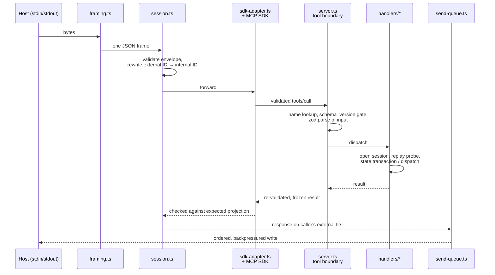

# mcp/SERVER

`archflow-mcp` is a stdio MCP server speaking newline-delimited JSON-RPC. It is the system's sole authority: the only writer of durable state and the only judge of request validity. It takes no arguments and has no other mode — `src/main.ts` is 28 lines that either print usage or start the runtime.

## The five tools

Tool names are frozen in `src/contracts/tool-names.ts`; handlers live in `src/mcp/handlers/`.

| Tool | What it does |
|---|---|
| `archflow_state` | The workflow's write path. Records that a pipeline step (`produce`, `self_review`, `counter_review`, `triage`, `adjudicate`) is running/succeeded/failed, optionally attaching a durable artifact. Runs a state transaction and returns the new revision. |
| `archflow_counter_review` | Assembles a sealed review envelope plus a read-only repo checkout, dispatches it to the opposite-family model CLI, and returns the verdict and finding count. |
| `archflow_adjudicate` | Dispatches an adjudication envelope (no repo view) judging the artifact against the pinned constitution; returns compliance, drift, and triggered rules. |
| `archflow_gate` | Records and resolves a durable human gate decision against a subject digest; handles supersession (`GATE_SUPERSEDED`). |
| `archflow_waiver` | Grants or denies a human waiver against a gate whose decision was `waiver-requested`, after re-verifying the archived origin gate. |

The advertised catalogue carries only names and JSON Schemas — no prose descriptions. The skills, not the tool listing, teach agents when to call what.

## How a request flows

## Why the protocol plumbing exists

Three modules look like reimplementations of things the MCP SDK already does. Each exists because the SDK is *used but not trusted* to be the sole authority over the wire:

- **`framing.ts`** — stdin is a byte stream, not a message stream. Hand-written newline-delimited framer with a 10 MiB cap and a deliberate fatal/non-fatal split: malformed JSON gets a `-32700` response (recoverable), but malformed UTF-8 or an oversized frame kills the connection, because after those the next message boundary can't be trusted.
- **`send-queue.ts`** — makes stdout writes ordered, bounded, and observable. Each frame gets a two-phase receipt (admitted to the stream / flushed); the session state machine advances on *admitted*, so e.g. the connection is never treated as initialized before the initialize response has actually entered the stream. Caps in-flight output and propagates backpressure so stdin pauses rather than buffering unboundedly.
- **`sdk-adapter.ts`** — a containment shim around `@modelcontextprotocol/server`. The server's own session state machine and ID rewriting run *before* the SDK sees anything, and every outbound tool result the SDK produces is compared against an expected projection derived from the authenticated tool-boundary outcome — a mismatch is replaced with a plain `-32603` rather than trusted.

`session.ts` is a full JSON-RPC/MCP state machine (`PRE_INIT → … → READY → CLOSED`) with duplicate-ID tracking and strict per-method key allowlists. Yes, this means most messages are validated twice (once here, once by the SDK) — that overlap is deliberate but is also the biggest complexity concentration in `src/mcp/`; see `../COMPLEXITY.md`.

## Process lifecycle

`runMcpProcess` (`src/mcp/process-runner.ts`) supervises the process: it races four exit reasons — startup failure, runtime-fatal, stdin EOF, signal — takes the first, closes the runtime exactly once, and emits at most one stderr diagnostic (`ARCHFLOW_MCP_START_FAILED`, `ARCHFLOW_MCP_TRANSPORT_ERROR`, or `ARCHFLOW_MCP_CLOSE_FAILED`). It's separated from the runtime so it can be tested with fake streams.

## Handler shape

Every handler follows the same skeleton: open a handler session (durable services + config pin check + host identity), run a **replay probe** to detect whether this intent was already committed (so a retried call returns the recorded outcome instead of doing the work twice), then perform its state transaction or dispatch. The replay probe is worth knowing about before reading handler code: it deliberately runs a state transaction whose callback always fails with a sentinel issue code, purely to learn whether the intent is new — it looks like dead error handling and isn't.

## Registration and hosts

`archflow-local init` registers the server with both hosts (see `../workflow/SKILLS.md`). Host tool timeouts are set to one hour — that bounds a *call*, not a gate decision; a resumable gate call can safely be retried. Claude Code registration may sit pending until a human approves it; Codex config is inert until a human trusts the repository. Neither approval is ever performed by the tooling.
