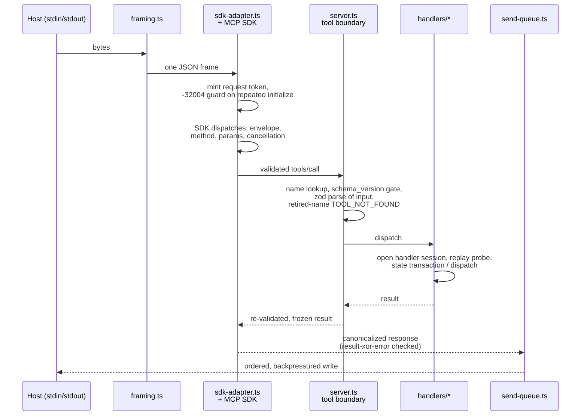

# mcp/SERVER

**Explored:** 2026-08-26 · **Commit:** `16193ec` · **Covers:** `src/main.ts`, `src/mcp/`, `src/contracts/semantic-workflow.ts`, `src/repository/`, `src/state/status.ts`, `src/state/semantic-*.ts`, `src/state/config-change.ts`, `src/state/fingerprint.ts`

`archflow-mcp` is a stdio MCP server speaking newline-delimited JSON-RPC. It is the system's sole authority: the only writer of durable state and the only judge of request validity. It takes no arguments and has no other mode — `src/main.ts` is 28 lines that either print usage or start the runtime.

## Two advertised tools

The host catalogue contains exactly two tools, each with a purpose description and a compact plain-object input/output schema generated from the semantic workflow contract. They are the only advertised and dispatched surface; every workflow — document production, implementation, status reporting, and the post-adoption half of a legacy upgrade — runs through them.

| Tool | What it does |
|---|---|
| `archflow_status` | Mechanically read-only common view of one task. An optional supported producing invocation can receive at most one opaque current-action offer; generic status never can. |
| `archflow_apply` | Applies exactly one server-issued offer with only the expected semantic submission, then returns a newly authenticated view. It neither chooses the next action nor runs a workflow loop. |

The four low-level names (`archflow_state`, `archflow_counter_review`, `archflow_gate`, `archflow_waiver`) remain durable-record vocabulary: `TOOL_NAMES` still names them for reading and writing existing state — last-transition records, gate archives, receipts — but nothing advertises or dispatches them, and a call to a retired name fails `TOOL_NOT_FOUND` with the safe view. Behind the semantic handler, the internal state and counter-review services survive unchanged: `handleState` still runs pipeline transactions (including the additive planning-restart arm), and `handleCounterReview` still selects the rubric, seals the envelope, and dispatches the configured reviewer plus, when active constitution rules exist, the constitution review. The skills, not the tool listing, teach agents when to call what.

## The semantic workflow surface

`WorkflowViewV1`, semantic status/apply inputs, one-action offers, and action planning live under `src/contracts/semantic-workflow.ts`, `src/state/semantic-*.ts`, and `src/mcp/handlers/semantic.ts`. They serve every producing workflow — PRD, task design, phase design, phase implementation, and the imported-design review of a legacy adoption — plus the read-only status skill.

The status projection joins full status—not brief status—with repository identity, complete finding prose, authenticated decision/waiver/revision recovery facts, server-derived reopen impacts, and informational `config_change` entries. It reports the live repository set: implicit writable `primary` first, then configured secondaries in ordinal name order, each with resolved location, mode, current HEAD, and `last_reviewed_commit` only when the retained current-position server-attested counter-review names that member. Relative declarations resolve from the primary worktree root; absolute declarations are accepted; omitted mode resolves to `context-only`; and `primary` is reserved. Review-backed human gates derive one line per authenticated pin and flag a moved live HEAD informationally. Baseline adoption binds drift rather than a review set and shows no review lines.

Config changes, including repository add/remove/path/mode edits, are parsed leaf differences between normalized `TaskStateV1.last_seen_config` and the strictly parsed live task-local config; they remain ordinary informational changes and do not block, reroute, stale an open gate, or invalidate retained evidence — with two hard exceptions: a declared repository whose identity no longer matches the retained one (`repository-identity-changed`) and a repository set that cannot be resolved as declared (`repository-set-invalid` for an aliased or nested declaration; `repository-open-failed`, `repository-identity-unresolved`, or `repository-head-unresolved` naming the member that could not be observed) fail as `CONFIG_INVALID` until the declaration or the repository is repaired. Each such failure carries a bounded `issues` entry of the form `repositories.<name>.path: <message>` next to its reason-specific `issue_code`, so the offending member is recoverable without exposing its location; the counter-review handler turns the three retryable reasons into a named `REPOSITORY_VIEW_UNAVAILABLE` failure both before dispatch and at the post-dispatch recheck. The primary task is the only source of task resources, configuration, and constitution; no secondary `.archflow/` is read. The semantic view exposes one human/client action without exposing revisions, fingerprints, request digests, intent IDs, gate bindings, or routing identity. A generic status invocation has no mutation offer. A skill invocation can receive an opaque `af1_` token bound to repository, task, invocation, state, and action; applying it recomputes current truth before planning one fixed named substep.

The action planner does not run a workflow loop. Supported actions route fixed named substeps through the common request composer and explicit execution capabilities, refreshing services and authenticated status between substeps and returning before another offered action can begin. Review owns an outer FIFO across replay, dispatch, and commit and calls the counter-review service through its direct inner seam, avoiding a nested queue. A dispatching review offer alone names the optional `review-dispatch` submission; when supplied, its nonempty-reason route override is validated like configured routing, bound to that request and review run, and retained in server-attested evidence. It does not persist to config or the input fingerprint. Review and submitted triage both enter `triage: running` before recording terminal triage. Human decisions archive immutable connected-host evidence first and settle it second; revision choices settle close-only, with a separate `revise-enter` operation required before writable resources reappear. Task initialization stages the exact ask before revision-zero composition; failed production, planning restart, and waiver opening share the same composer. The gate composer covers every approval kind an offered gate can name — artifact and design approval, commit authorization, attempts exhaustion, and the `migration-audit` approval of an adopted legacy import.

Rendered reviews and gate UI are disposable interfaces, not authority. The gate projection is deliberately human-shaped: title, plain summary, direct question, material evidence, authenticated reviewed-repository commits, and labeled choices with consequences. Combined design approval also projects each policy conflict or trigger with its actual rationale/evidence in `presentation.details`, making the one human decision self-contained. Skills use that projection rather than relaying raw tool output; IDs, digests, JSON, paths, and protocol codes remain available for explicit diagnostics. Durable structured evidence can regenerate the presentation after cleanup or on a fresh clone.

Both advertised input schemas are compact plain-object roots generated from the semantic workflow contract. The generated durable request contracts beneath them keep their normative closed unions, but they are internal request vocabulary now, not advertised surface. The fast regression fence in `test/contracts/mcp-advertisement.test.ts` keeps both advertised roots host-safe — plain object roots with no root-level combinator, because at least one MCP host flattens a root-level `oneOf` by dropping every branch it cannot resolve. The explicit extended project separately traverses every reference and proves it resolves in a single hop through a flat top-level `$defs` (`#/$defs/<name>`), because at least one host serialized an argument as a JSON string when its advertised schema was a `$ref` pointing into a nested `$defs`.

When the server rejects an input, `CONTRACT_INVALID` carries a bounded `issues` list (up to five `"<field path>: <message>"` strings) alongside `issue_code: "input-invalid"`, so a caller can correct the offending field instead of retrying blind.

The two semantic tools accept their compact status/apply objects directly; an opaque offer binds the hidden repository, state, invocation, and action authority, and the boundary re-derives every mechanical field from durable authority before a substep runs. Exact replay comes from durable `last_transition`, not a staged file or a permanent receipt.

Human gates deliberately do not keep the MCP request open while waiting for another interface. A skill-authored `gate-summary` opens the nonblocking presentation — the server derives the conversational snapshot from current revision, phase, kind, subject, context, evidence, and offered choices. Its structured reasons come only from authenticated archived request bindings: the ordinary gate's `approval_trigger`, policy findings, or the exceptional gate's own context. Configured reasons are distinguished from exceptions, and one exceptional reason dominates the aggregate class; caller summary text and later config cannot spoof either. Commit-bearing gates bind the exact authorized Git facts: implementation adds the retained diff digest, while design and migration bind the exact task root, baseline, target, and message because their final authority archive contains server-minted time/random provenance created only after the decision. After the human answers, the offered decision action archives the selected token and reason immutably with provenance from the authenticated connected-host context (connection plus transport request identity) and settles the durable gate in a separate substep. One human answer therefore produces bounded tool calls and exactly one durable decision, and a retried call after an interruption replays the archive and settles once.

The shipped v2 constitution makes those presentations targeted rather than universal. Counter-review and constitution review still run first. An exact authenticated approval-rule settlement with `wait:false`, a passing constitution result, aligned upstreams, and no safety or migration condition lets the server return the next commit or successor action directly; the settlement is evidence the server consumes, never authority the caller may interpret for itself. Its `config_digest` records the live rules it evaluated, separately from the task's creation provenance. `wait:true` opens the matching approval presentation, and policy failure or uncertainty, review-trigger matches, migration audit, attempts exhaustion, drift/restore/baseline adoption, cancellation, and the other exception paths remain human-required. In every branch, authority is the fresh action the server returns, not the settlement record.

Commit facts contain only the exact baseline, target ref, paths, and message. Their presence is authenticated execution authority, derived from either a matching ordinary approval or accepted no-wait settlement; a matching approval always wins when both facts coexist. The client verifies and uses only those returned facts, inspects the staged diff and exact message, commits without a second human question, then calls read-only status so the server can observe proof. Removing the old confirmation discriminator does not weaken Git binding or let a client infer authority from settlement evidence independently of the returned action.

The semantic action vocabulary also contains two no-submission recovery actions. `refresh-stale-baseline` removes only a stale disposable baseline interface after recomputing its complete repository subject; `recover-milestone-authority` starts a fresh significant owning-position cycle while preserving repository bytes. Their opaque offers bind repository identity, state revision, target/history facts, and the relevant drift or proof cause, and apply revalidates those facts under the task lock. Clients cannot request either action by diagnosis, attach a decision, or treat successful application as approval.

## How a request flows

## The trust posture: the SDK is the JSON-RPC authority

The pinned `@modelcontextprotocol/server`/`core` 2.0.0 SDK — version-pinned exactly, behaviorally probed by `scripts/probe-mcp-sdk-compatibility.mjs`, and import-fenced into `sdk-adapter.ts` — is the authority for JSON-RPC envelopes, method routing, request-schema validation, and cancellation. ArchFlow's own authority begins at the tool boundary (`server.ts`). An earlier design ran a full second JSON-RPC state machine (`session.ts`) in front of the SDK; it was retired 2026-08-11 once the probe pinned every SDK behavior the session had re-implemented. Consequences of the new posture — silently dropped malformed envelopes, SDK validator prose on the wire, no duplicate-ID ledger — are documented limitations consistent with the trusted-developer-machine stance; see `../LIMITATIONS.md`.

What remains adapter-owned, and why:

- **`framing.ts`** — stdin is a byte stream, not a message stream. Hand-written newline-delimited framer with a 10 MiB cap and a deliberate fatal/non-fatal split: malformed JSON gets a `-32700` response (recoverable), but malformed UTF-8 or an oversized frame kills the connection, because after those the next message boundary can't be trusted.
- **`send-queue.ts`** — makes stdout writes ordered, bounded, and observable. Each frame gets a two-phase receipt (admitted to the stream / flushed); initialize acceptance advances on *admitted*, so the connection is never treated as initialized before the initialize response has actually entered the stream. Caps in-flight output and propagates backpressure so stdin pauses rather than buffering unboundedly.
- **`sdk-adapter.ts`** — the fold point: framer in, SDK dispatch, send-queue out. It mints one request token per SDK-dispatched request at ingress (settled when the response is enqueued), holds frame draining while an initialize is in flight so the handshake stays in protocol order, answers a repeated initialize itself with the registry's `INITIALIZATION_REPEATED` (`-32004`) — the SDK would silently re-negotiate — and captures the connection identity exactly once via the SDK's initialized hook. On egress every response is rebuilt through one canonical serializer that enforces result-xor-error, and the registry-frozen `TOOL_DISABLED` code is restored where the SDK's legacy codec rewrites `-32002` to `-32602` (a probe-pinned rewrite). Each tool result's wire projection is computed exactly once, in the `tools/call` handler, from the WeakSet-branded tool-boundary outcome; if no authentic outcome can be produced the handler answers a prose-free `-32603`.

## When something throws anyway

The tool boundary catches everything a handler can throw, and everything `parseSemanticResultV1` can reject on the way out, and answers with one deliberately opaque `INTERNAL_ERROR` naming only a correlation ID. That opacity is intentional — an internal stack is not gate correspondence — but it means the stack is the only explanation that exists, and it used to go nowhere: a host that owns the server's stderr may never persist it, which leaves an opaque failure genuinely unexplainable. So `reportInternalError` (`src/mcp/diagnostics.ts`) writes the correlation ID and stack to stderr *and* appends the same record, timestamped, to ignored `.archflow/runtime/diagnostics/internal-errors.log` under the server's working directory. The file is written only when `.archflow/` already exists, and every write failure is swallowed: diagnostics must never change the outcome of a call. Match a wire `Internal error (request-N).` to its record by that correlation ID.

## Process lifecycle

`runMcpProcess` (`src/mcp/process-runner.ts`) supervises the process: it races four exit reasons — startup failure, runtime-fatal, stdin EOF, signal — takes the first, closes the runtime exactly once, and emits at most one stderr diagnostic (`ARCHFLOW_MCP_START_FAILED`, `ARCHFLOW_MCP_TRANSPORT_ERROR`, or `ARCHFLOW_MCP_CLOSE_FAILED`). It's separated from the runtime so it can be tested with fake streams.

## Handler shape

Every handler follows the same skeleton: open a handler session (durable services + strict parse of the current task-local config + host identity), run a **replay probe** to detect whether this intent was already committed (so a retried call returns the recorded outcome instead of doing the work twice), then perform its state transaction or dispatch. Successful config-observing transactions snapshot the normalized parsed config as `last_seen_config`; invalid or unsupported YAML fails closed. The parser narrowly accepts the retired `producer` role for older task copies, but normalization omits it from change reporting. The workflow and constitution digests remain pinned independently, while the current input fingerprint excludes config. For already-recorded pre-cutover evidence, fingerprint resolution may retry once with the state's creation `config_digest`, but only when an exact old expected digest exists and matches; this read-side compatibility path rewrites nothing and is not a general migration.

Opening a session is cheap by design. Worktree discovery and the Git version/object-format preflight are constant for a working directory, so their successful result is memoized per directory for the server process's lifetime (failures are never memoized), and one session resolves repository identity once rather than for each authority it mints. The identity comparison against `state.json` still happens live on every call: a repository whose root commits change surfaces as `REPOSITORY_MISMATCH` exactly as before. Semantic apply refreshes the session after every substep, so this memo is what keeps a compound review action from re-probing the repository half a dozen times.

Legacy import adoption is the one state-absent exception to the normal live task-config read, and it runs locally: `archflow-local upgrade adopt` drives the initialization transaction, which authenticates the digest-pinned config from the ignored import stage, validates every mapped payload, constructs the entire task beside the destination, and renames it into place; the handler session retains that staged-config read for authenticating the transaction's durable records. The replay probe is worth knowing about before reading handler code: it deliberately runs a state transaction whose callback always fails with a sentinel issue code, purely to learn whether the intent is new — it looks like dead error handling and isn't.

The planning-restart operation inside the internal state service is an additive exception, not a separate durable tool identity. It authenticates its request, derives a stable restart ID from its request digest, exact-replays an existing matching history record, performs the PRD ask append when applicable, and asks the transaction kernel to validate the exact backward restart draft. Semantic reopen derives this low-level target and impact rather than publishing them as caller choices.

## Registration and hosts

`archflow-local init` registers the server with supported hosts (Claude Code, Codex, and Antigravity; see `../workflow/SKILLS.md`). Host tool timeouts are set to one hour — that bounds a *call*, not a gate decision; a resumable gate call can safely be retried. Claude Code registration may sit pending until a human approves it; Codex config is inert until a human trusts the repository; Antigravity config is registered in `~/.gemini/config/mcp_config.json`. Human approval and trust boundaries are never bypassed by the tooling.

## Multi-repository implementation actions

A successful implementation submission keeps the primary declaration at the top level and names every writable secondary in an ordered section, including scan-only empty sections. The server binds each section to the live configured member, retains every changed proposed tree, reviews the combined subject, and evaluates repository-relative content rules over all changed sections. Context-only members are never scanned, retained, restored, or committed.

After one human decision or authenticated no-wait settlement, status returns only the first unproved commit: primary first, then ordinal secondaries. Secondary actions include the member name and freshly resolved location so the client never infers a sibling path. Proof remains repository-local and race-closed. A later failure preserves prior proof and suppresses later actions until the first remaining member is current or explicitly recovered.
