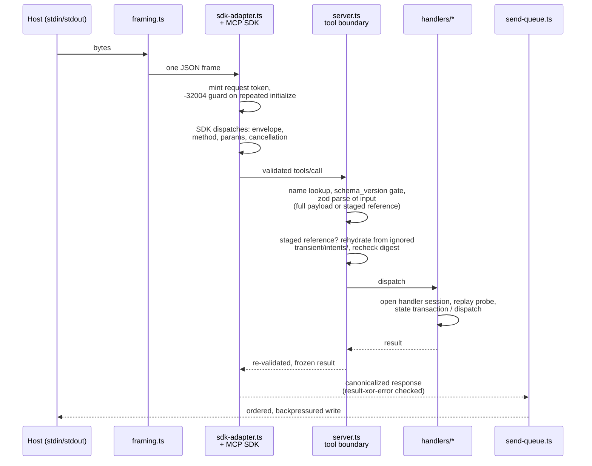

# mcp/SERVER

**Explored:** 2026-08-12 · **Commit:** `247df34` · **Covers:** `src/main.ts`, `src/mcp/`, `src/state/staged-requests.ts`

`archflow-mcp` is a stdio MCP server speaking newline-delimited JSON-RPC. It is the system's sole authority: the only writer of durable state and the only judge of request validity. It takes no arguments and has no other mode — `src/main.ts` is 28 lines that either print usage or start the runtime.

## The four tools

Tool names are frozen in `src/contracts/tool-names.ts`; handlers live in `src/mcp/handlers/`.

| Tool | What it does |
|---|---|
| `archflow_state` | The workflow's write path. Records that a pipeline step (`produce`, `counter_review`, `triage`) is running/succeeded/failed, optionally attaching a durable artifact. Runs a state transaction and returns the new revision. |
| `archflow_counter_review` | Selects the phase's immutable canonical rubric, assembles a sealed review envelope plus a read-only repo checkout, and dispatches it to the opposite-family model CLI; when the pinned constitution has active rules (the server decides, never the agent) it then dispatches a second opposite-family child for the constitution/drift review — sealed envelope, deliberately no checkout. Both results commit in one atomic state transaction; the result reports both: `{path, verdict, blocking_count, constitution, revision, request_digest}`, where `constitution` is `{status: "evaluated", path, constitution: pass\|fail\|uncertain, drift: aligned\|incidental\|material, triggers: […]}` or `{status: "not-run", reason: "no-active-constitution-rules"}`. `artifact_path` is now its only operation-specific full-request field; normal callers let `build-request` derive even that. |
| `archflow_gate` | Records and resolves a durable human gate decision against a subject digest; handles supersession (`GATE_SUPERSEDED`). |
| `archflow_waiver` | Grants or denies a human waiver against a gate whose decision was `waiver-requested`, after re-verifying the archived origin gate. |

The advertised catalogue carries names and JSON Schemas; each input schema also carries one description naming its two parameter groups. The skills, not the tool listing, teach agents when to call what.

Paths returned for rendered reviews and gate UI point below ignored `.archflow/runtime/tasks/<task>/cache/`; they are disposable interfaces, not authority. The durable result is the current manifest at `.archflow/tasks/<task>/authority/results/<result-digest>.json`, whose structured evidence can regenerate those renderings after cleanup or on a fresh clone.

The *advertised* input schema is deliberately flatter than the normative contract. The normative input is a root-level `oneOf` (full payload | staged reference) built from `$ref`/`allOf` composition — and at least one MCP host flattens a root-level `oneOf` by dropping every branch it cannot resolve, which advertised every tool as a zero-field object and left models composing calls with guessed (all-string) types. `standaloneSchema` in `src/mcp/tools.ts` therefore merges the two branches into one plain object root: the union of both groups' properties (typed by `$ref` into the pruned `$defs`, which hosts do preserve below the root), the fields common to both groups as `required`, and the group-naming description. The merge is advisory; the server's strict `oneOf` validation in `parseToolCall` is unchanged and remains the authority. A regression fence in `test/contracts/mcp-advertised-schema.test.ts` forbids root-level combinators from ever coming back.

When the server rejects an input, `CONTRACT_INVALID` carries a bounded `issues` list (up to five `"<field path>: <message>"` strings) alongside `issue_code: "input-invalid"`, so a caller can correct the offending field instead of retrying blind; `STAGED_REQUEST_MISMATCH` does the same for a staged file that no longer re-parses.

Every tool input is a union of two arms. The full payload is the complete request object. The **staged reference** — `{schema_version, task_id, intent_id, request_digest}` — points at the request `archflow-local build-request` staged below ignored `.archflow/runtime/tasks/<task>/transient/intents/`; the tool boundary (`server.ts` + `src/state/staged-requests.ts`) rehydrates the staged bytes into an authentic full-payload call *before any handler runs*, re-parses them through the tool's own contract, and recomputes the request digest exactly as the live path does. The recomputed digest must equal both the digest recorded in the staged file and the digest the model typed; the staged tool must equal the tool actually called; the inner `intent_id`/`task_id` must equal the reference's. Any disagreement fails closed — `STAGED_REQUEST_MISMATCH`, or `STAGED_REQUEST_NOT_FOUND` for a missing file — with no state change. The staged file is deleted after a successful state replacement; exact replay of the most recent call comes from `state.json.last_transition`, not a permanent receipt. This exists because hand-copying the multi-kilobyte `request.input` was the loop's largest token cost and corruption surface; the digest, not the transcription, is what binds semantics.

## How a request flows

## The trust posture: the SDK is the JSON-RPC authority

The pinned `@modelcontextprotocol/server`/`core` 2.0.0 SDK — version-pinned exactly, behaviorally probed by `scripts/probe-mcp-sdk-compatibility.mjs`, and import-fenced into `sdk-adapter.ts` — is the authority for JSON-RPC envelopes, method routing, request-schema validation, and cancellation. ArchFlow's own authority begins at the tool boundary (`server.ts`). An earlier design ran a full second JSON-RPC state machine (`session.ts`) in front of the SDK; it was retired 2026-08-11 once the probe pinned every SDK behavior the session had re-implemented. Consequences of the new posture — silently dropped malformed envelopes, SDK validator prose on the wire, no duplicate-ID ledger — are documented limitations consistent with the trusted-developer-machine stance; see `../LIMITATIONS.md`.

What remains adapter-owned, and why:

- **`framing.ts`** — stdin is a byte stream, not a message stream. Hand-written newline-delimited framer with a 10 MiB cap and a deliberate fatal/non-fatal split: malformed JSON gets a `-32700` response (recoverable), but malformed UTF-8 or an oversized frame kills the connection, because after those the next message boundary can't be trusted.
- **`send-queue.ts`** — makes stdout writes ordered, bounded, and observable. Each frame gets a two-phase receipt (admitted to the stream / flushed); initialize acceptance advances on *admitted*, so the connection is never treated as initialized before the initialize response has actually entered the stream. Caps in-flight output and propagates backpressure so stdin pauses rather than buffering unboundedly.
- **`sdk-adapter.ts`** — the fold point: framer in, SDK dispatch, send-queue out. It mints one request token per SDK-dispatched request at ingress (settled when the response is enqueued), holds frame draining while an initialize is in flight so the handshake stays in protocol order, answers a repeated initialize itself with the registry's `INITIALIZATION_REPEATED` (`-32004`) — the SDK would silently re-negotiate — and captures the connection identity exactly once via the SDK's initialized hook. On egress every response is rebuilt through one canonical serializer that enforces result-xor-error, and the registry-frozen `TOOL_DISABLED` code is restored where the SDK's legacy codec rewrites `-32002` to `-32602` (a probe-pinned rewrite). Each tool result's wire projection is computed exactly once, in the `tools/call` handler, from the WeakSet-branded tool-boundary outcome; if no authentic outcome can be produced the handler answers a prose-free `-32603`.

## Process lifecycle

`runMcpProcess` (`src/mcp/process-runner.ts`) supervises the process: it races four exit reasons — startup failure, runtime-fatal, stdin EOF, signal — takes the first, closes the runtime exactly once, and emits at most one stderr diagnostic (`ARCHFLOW_MCP_START_FAILED`, `ARCHFLOW_MCP_TRANSPORT_ERROR`, or `ARCHFLOW_MCP_CLOSE_FAILED`). It's separated from the runtime so it can be tested with fake streams.

## Handler shape

Every handler follows the same skeleton: open a handler session (durable services + config pin check + host identity), run a **replay probe** to detect whether this intent was already committed (so a retried call returns the recorded outcome instead of doing the work twice), then perform its state transaction or dispatch. The replay probe is worth knowing about before reading handler code: it deliberately runs a state transaction whose callback always fails with a sentinel issue code, purely to learn whether the intent is new — it looks like dead error handling and isn't.

## Registration and hosts

`archflow-local init` registers the server with both hosts (see `../workflow/SKILLS.md`). Host tool timeouts are set to one hour — that bounds a *call*, not a gate decision; a resumable gate call can safely be retried. Claude Code registration may sit pending until a human approves it; Codex config is inert until a human trusts the repository. Neither approval is ever performed by the tooling.
