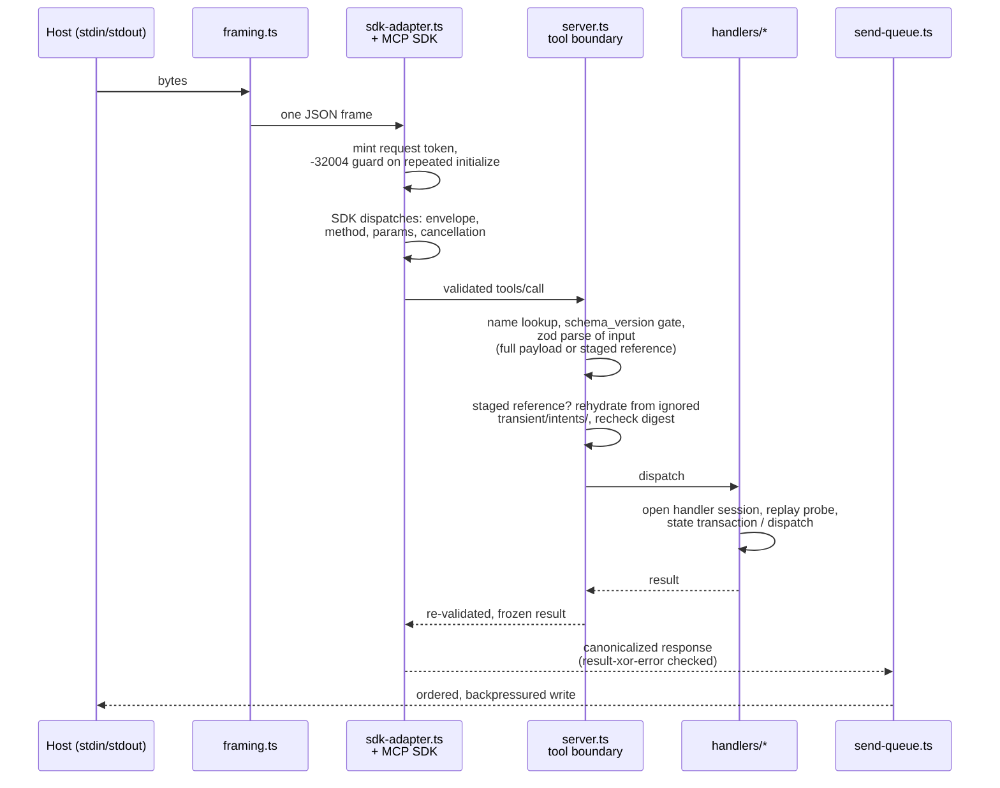

# mcp/SERVER

**Explored:** 2026-08-16 · **Commit:** `d60da73` · **Covers:** `src/main.ts`, `src/mcp/`, `src/state/staged-requests.ts`, `src/state/semantic-*.ts`

`archflow-mcp` is a stdio MCP server speaking newline-delimited JSON-RPC. It is the system's sole authority: the only writer of durable state and the only judge of request validity. It takes no arguments and has no other mode — `src/main.ts` is 28 lines that either print usage or start the runtime.

## Six advertised tools, four durable identities

The host catalogue contains six tools, each with a purpose description and standalone input/output schema. The four low-level names remain the durable protocol vocabulary used by staged requests, results, transitions, and replay. The two semantic names are a bounded client façade and do not create new durable operation identities.

| Tool | What it does |
|---|---|
| `archflow_state` | The workflow's write path. Records that a pipeline step (`produce`, `counter_review`, `triage`) is running/succeeded/failed, optionally attaching a durable artifact. Its additive `planning_restart` full-payload arm routes an explicit strictly backward planning correction through the same state handler and bounded restart kernel. Runs a state transaction and returns the new revision. |
| `archflow_counter_review` | Selects the phase's immutable canonical rubric, assembles a sealed control envelope plus a read-only repository view, and dispatches it to the opposite-family model CLI. Implementation views are reconstructed post-change snapshots from the attested base commit and retained output bytes, so source size does not consume the envelope cap. When the pinned constitution has active rules (the server decides, never the agent), a second opposite-family child receives its own sealed envelope and the same snapshot for constitution/drift review. Both results commit in one atomic state transaction; the result reports both: `{path, verdict, blocking_count, constitution, revision, request_digest}`, where `constitution` is `{status: "evaluated", path, constitution: pass\|fail\|uncertain, drift: aligned\|incidental\|material, triggers: […]}` or `{status: "not-run", reason: "no-active-constitution-rules"}`. `artifact_path` is now its only operation-specific full-request field; normal callers let `build-request` derive even that. |
| `archflow_gate` | Records and resolves a durable human gate decision against a subject digest; task/phase-design `design-approval` combines document judgment, constitution findings, and task-local milestone commit authority. `migration-audit` is the corresponding single approval for a reviewed legacy import and binds its exact visible documents, resume point, and import commit authority; handles supersession (`GATE_SUPERSEDED`). |
| `archflow_waiver` | Grants or denies a human waiver against a gate whose decision was `waiver-requested`, after re-verifying the archived origin gate. |
| `archflow_status` | Mechanically read-only common view of one task. An optional supported producing invocation can receive at most one opaque current-action offer; generic status never can. |
| `archflow_apply` | Applies exactly one server-issued offer with only the expected semantic submission, then returns a newly authenticated view. It neither chooses the next action nor runs a workflow loop. |

Every catalogue entry carries a purpose description. Low-level input schemas retain the plain-object projection that names their full-payload and staged-reference groups; semantic inputs are already compact plain objects generated from the semantic workflow contract.

## Semantic document façade

`WorkflowViewV1`, semantic status/apply inputs, one-action offers, and action planning live under `src/contracts/semantic-workflow.ts`, `src/state/semantic-*.ts`, and `src/mcp/handlers/semantic.ts`. They are advertised for PRD, task-design, and phase-design production. Phase implementation and the `archflow-status` skill remain on the legacy low-level workflow in this release; a phase-impl invocation may read the common view but receives no semantic mutation offer.

The status projection joins full status—not brief status—with repository identity, complete finding prose, authenticated decision/waiver/revision recovery facts, and server-derived reopen impacts. It exposes one human/client action without exposing revisions, fingerprints, request digests, intent IDs, gate bindings, or routing identity. A generic status invocation has no mutation offer. A skill invocation can receive an opaque `af1_` token bound to repository, task, invocation, state, and action; applying it recomputes current truth before planning one fixed named substep.

The action planner does not run a workflow loop. Supported document actions route fixed named substeps through the common request composer and explicit execution capabilities, refreshing services and authenticated status between substeps and returning before another offered action. Review owns an outer FIFO across replay, dispatch, and commit and calls the counter-review handler through its direct inner seam, avoiding a nested queue. Review and submitted triage both enter `triage: running` before recording terminal triage. Human decisions archive immutable connected-host evidence first and settle it second; revision choices settle close-only, with a separate `revise-enter` operation required before writable resources reappear. Task initialization stages the exact ask before revision-zero composition; failed production, planning restart, and waiver opening share the legacy composer.

Rendered reviews and gate UI are disposable interfaces, not authority. The gate projection is deliberately human-shaped: title, plain summary, direct question, material evidence, and labeled choices with consequences. Combined design approval also projects each policy conflict or trigger with its actual rationale/evidence in `presentation.details`, making the one human decision self-contained. Skills use that projection rather than relaying raw tool output; IDs, digests, JSON, paths, and protocol codes remain available for explicit diagnostics. Durable structured evidence can regenerate the presentation after cleanup or on a fresh clone.

Each low-level advertised input schema is deliberately flatter than its normative contract. The normative input is a root-level `oneOf` (full payload | staged reference) built from `$ref`/`allOf` composition — and at least one MCP host flattens a root-level `oneOf` by dropping every branch it cannot resolve. `standaloneSchema` therefore merges those two branches into one plain object root. The two semantic schemas are already compact plain-object roots and are projected without that merge. A regression fence in `test/contracts/mcp-advertised-schema.test.ts` keeps all six advertised roots host-safe.

When the server rejects an input, `CONTRACT_INVALID` carries a bounded `issues` list (up to five `"<field path>: <message>"` strings) alongside `issue_code: "input-invalid"`, so a caller can correct the offending field instead of retrying blind; `STAGED_REQUEST_MISMATCH` does the same for a staged file that no longer re-parses.

Each low-level tool input is a union of two arms. The full payload is the complete request object. The **staged reference** — `{schema_version, task_id, intent_id, request_digest}` — points at the request `archflow-local build-request` staged below ignored `.archflow/runtime/tasks/<task>/transient/intents/`; the boundary rehydrates and revalidates those bytes before any handler runs. The two semantic tools instead accept their compact status/apply objects directly; an opaque offer binds their hidden repository, state, invocation, and action authority. Low-level digest disagreement fails closed, and successful state replacement removes the transient staged request. Exact replay comes from durable `last_transition`, not a permanent receipt.

## How a request flows

## The trust posture: the SDK is the JSON-RPC authority

The pinned `@modelcontextprotocol/server`/`core` 2.0.0 SDK — version-pinned exactly, behaviorally probed by `scripts/probe-mcp-sdk-compatibility.mjs`, and import-fenced into `sdk-adapter.ts` — is the authority for JSON-RPC envelopes, method routing, request-schema validation, and cancellation. ArchFlow's own authority begins at the tool boundary (`server.ts`). An earlier design ran a full second JSON-RPC state machine (`session.ts`) in front of the SDK; it was retired 2026-08-11 once the probe pinned every SDK behavior the session had re-implemented. Consequences of the new posture — silently dropped malformed envelopes, SDK validator prose on the wire, no duplicate-ID ledger — are documented limitations consistent with the trusted-developer-machine stance; see `../LIMITATIONS.md`.

What remains adapter-owned, and why:

- **`framing.ts`** — stdin is a byte stream, not a message stream. Hand-written newline-delimited framer with a 10 MiB cap and a deliberate fatal/non-fatal split: malformed JSON gets a `-32700` response (recoverable), but malformed UTF-8 or an oversized frame kills the connection, because after those the next message boundary can't be trusted.
- **`send-queue.ts`** — makes stdout writes ordered, bounded, and observable. Each frame gets a two-phase receipt (admitted to the stream / flushed); initialize acceptance advances on *admitted*, so the connection is never treated as initialized before the initialize response has actually entered the stream. Caps in-flight output and propagates backpressure so stdin pauses rather than buffering unboundedly.
- **`sdk-adapter.ts`** — the fold point: framer in, SDK dispatch, send-queue out. It mints one request token per SDK-dispatched request at ingress (settled when the response is enqueued), holds frame draining while an initialize is in flight so the handshake stays in protocol order, answers a repeated initialize itself with the registry's `INITIALIZATION_REPEATED` (`-32004`) — the SDK would silently re-negotiate — and captures the connection identity exactly once via the SDK's initialized hook. On egress every response is rebuilt through one canonical serializer that enforces result-xor-error, and the registry-frozen `TOOL_DISABLED` code is restored where the SDK's legacy codec rewrites `-32002` to `-32602` (a probe-pinned rewrite). Each tool result's wire projection is computed exactly once, in the `tools/call` handler, from the WeakSet-branded tool-boundary outcome; if no authentic outcome can be produced the handler answers a prose-free `-32603`.

## Process lifecycle

`runMcpProcess` (`src/mcp/process-runner.ts`) supervises the process: it races four exit reasons — startup failure, runtime-fatal, stdin EOF, signal — takes the first, closes the runtime exactly once, and emits at most one stderr diagnostic (`ARCHFLOW_MCP_START_FAILED`, `ARCHFLOW_MCP_TRANSPORT_ERROR`, or `ARCHFLOW_MCP_CLOSE_FAILED`). It's separated from the runtime so it can be tested with fake streams.

## Handler shape

Every handler follows the same skeleton: open a handler session (durable services + config pin check + host identity), run a **replay probe** to detect whether this intent was already committed (so a retried call returns the recorded outcome instead of doing the work twice), then perform its state transaction or dispatch. Revision-zero legacy initialization is the one state-absent exception to the canonical config read: it authenticates the digest-pinned config from the ignored import stage, validates every mapped payload, constructs the entire task beside the destination, and renames it into place. The replay probe is worth knowing about before reading handler code: it deliberately runs a state transaction whose callback always fails with a sentinel issue code, purely to learn whether the intent is new — it looks like dead error handling and isn't.

`archflow_state` planning restart is an additive exception inside that handler, not a separate durable tool identity. It authenticates the low-level request, derives a stable restart ID from its request digest, exact-replays an existing matching history record, performs the PRD ask append when applicable, and asks the transaction kernel to validate the exact backward restart draft. Semantic reopen derives this low-level target and impact rather than publishing them as caller choices.

## Registration and hosts

`archflow-local init` registers the server with both hosts (see `../workflow/SKILLS.md`). Host tool timeouts are set to one hour — that bounds a *call*, not a gate decision; a resumable gate call can safely be retried. Claude Code registration may sit pending until a human approves it; Codex config is inert until a human trusts the repository. Neither approval is ever performed by the tooling.
