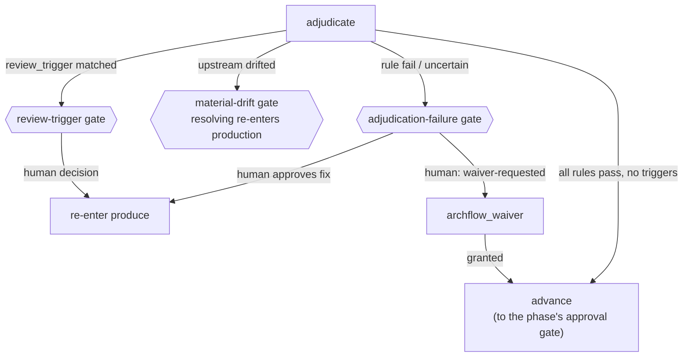

# review/ADJUDICATION

Adjudication is the pipeline's final check: a third dispatch that judges the artifact against the repository's **constitution** — the versioned policy rules in `.archflow/constitution/`, pinned per task at a human-approved commit. It is *not* "reviewer A vs reviewer B" arbitration; disagreements between reviews are resolved earlier, by triage.

## The constitution

Each numbered Markdown file is exactly one rule: frontmatter carries a stable `id`, a `version`, a `status`, and a `review_trigger` (a condition that should open a human gate); the prose body is the normative text. Rule IDs are append-only — content changes bump the version, deprecation replaces deletion. The four shipped rules are a good summary of the product's values:

- **`explicit-human-authority`** — silence, elapsed time, agent prose, or a model verdict never supplies approval.
- **`approved-design-before-code`** — implementation starts only from an approved phase design; deviations update the governing documents and re-enter review.
- **`task-and-evidence-isolation`** — tasks are isolated; stale, mismatched, cross-task, or partial evidence fails closed.
- **`honest-human-centered-outcomes`** — failures and dead ends stay visible non-success states with a safe next action, never silently bypassed.

A task cannot amend its own governing constitution: an attempted edit on the task branch short-circuits adjudication and opens a `constitution-edit` gate instead.

## How adjudication runs

The adjudicator gets a sealed envelope — the artifact, the sorted active rules, the approved upstream documents, and fixed instructions — and deliberately **no repository checkout**: it judges exactly the sealed evidence. Before dispatching, the server is unusually strict: durable state, the pinned constitution digest, the authenticated review set, and a durable `artifact-approval` for every declared upstream must all agree, or nothing is dispatched.

The output is cross-checked mechanically: one finding per active rule, in ID order, matching versions — and a rule with declared `enforced_by` mechanisms may never be reported as `pass`, because the model cannot claim mechanical evidence it does not have.

## What the verdict opens

## Waivers

A waiver is a durable, human-granted exemption from **one specific rule version**, for **one specific subject digest**, under one specific scope, lasting only until the task completes. The semantics are exact-match: change the artifact and the subject digest changes, so the waiver evaporates; bump the rule version and it evaporates.

Waivers are requested from an existing gate, never conjured: the origin gate must be a `review-trigger` or `adjudication-failure` whose recorded decision literally says `waiver-requested`, and the server re-reads and re-authenticates the archived request and decision before binding the waiver. A `waiver-requested` decision is not approval; a denied or cancelled waiver grants nothing.

## Durable decisions

Both gates and waivers funnel into the same machinery (`src/state/gates.ts`): each gate writes an immutable request and decision record under `decisions/<gate-id>/`, bound to the gate ID, context digest, subject digest, phase, and the current evidence set, with human provenance on the decision. Task state holds only *references* to approvals and waivers — any later code that wants to rely on one re-reads and re-validates the underlying documents, and the resulting authenticated object can only be minted by that verification (it cannot be hand-constructed). Supersession is honest: if the subject changed under an open gate, the resolver returns `GATE_SUPERSEDED` and the work re-enters the pipeline.
