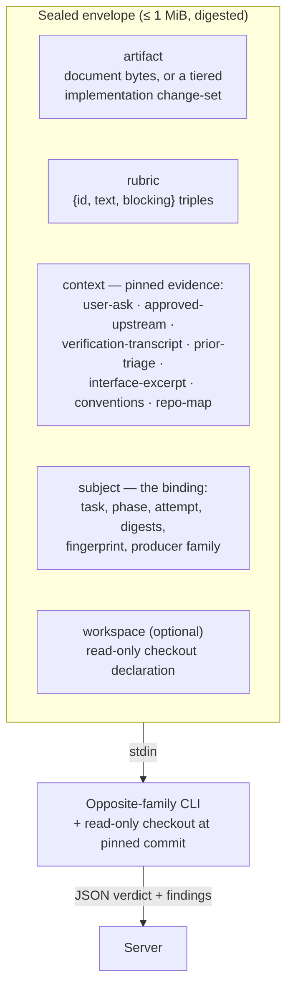
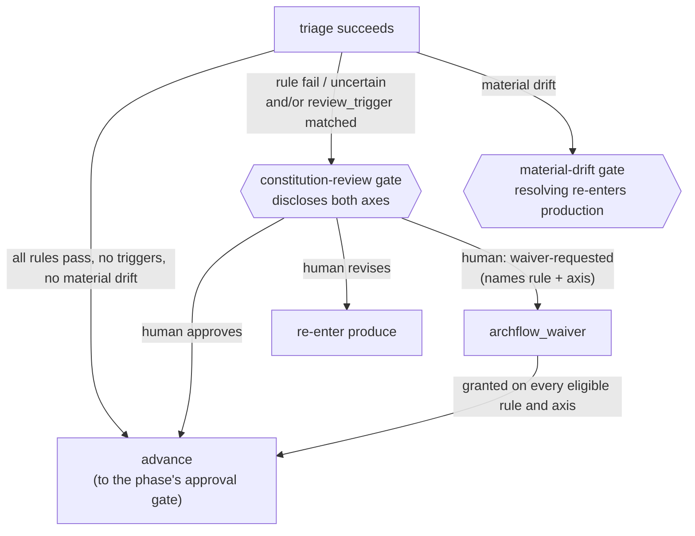

# review/COUNTER-REVIEW

**Explored:** 2026-08-12 · **Commit:** `ae25739` · **Covers:** `src/review/`, `src/state/produce-subject.ts`

Counter-review is the system's adversarial check: every artifact is reviewed by the *opposite model family* (Claude ⇄ Codex), dispatched by the server itself so the evidence is something the producer cannot author. One `archflow_counter_review` call covers up to two dispatches: the rubric counter-review, and — only when the pinned constitution has active rules, a decision the server makes alone — the constitution review (see below). This page covers the review envelope, the review flow, the constitution review, and waivers.

## The dispatch envelope

The envelope is a single JSON document — serialized, hashed, byte-capped at 1 MiB — that is the *entire* input to the reviewing child. It arrives on stdin; nothing else is prepended.

The shape is deliberately closed: field validation rejects any key not on the expected list, so free-form producer history and agent instructions are *structurally unrepresentable* in a review request. One piece of round history is deliberately representable — the `prior-triage` context kind carries the previous round's triage record, but only because the server assembles it mechanically from retained triage and review manifests (reviewer-authored findings and their recorded dispositions), never from producer-curated prose. The subject also names the durable `attempt` counter, so the reviewer knows it is looking at round N of the same phase instance. The envelope digest makes the review a reproducible attestation about exactly those bytes.

## Prior-triage context: stopping defect-class re-litigation

Every dispatch is a fresh reviewer with no memory, so without help round N tends to rediscover the defect class round N−1 already dispositioned — the same defect was once found four times in a real run. On re-entry the server pins a `prior-triage` entry: for each prior finding, its `finding_id`, severity, blocking flag, and summary (all reviewer-authored, from the retained review evidence), plus its disposition and the recorded revision intent or rejection rationale (from the retained triage manifest). Whenever this entry is present, the envelope adds one fixed instruction literal: already-dispositioned findings must not be re-raised in variant form — a reviewer who thinks a prior disposition was wrong challenges it by naming its `finding_id`.

**The retention boundary, honestly:** durable state (`authoritative_results`) keeps exactly one triage result per phase instance — installing a new one replaces the reference to the old, and unreferenced manifests are not durable authority. So the pinned record covers only the *immediately preceding* round, which is also the round whose accepted findings the current attempt is answering; earlier rounds are superseded and deliberately not reconstructed. The record does not carry the historical attempt number of that prior round either — durable state never recorded it — only the current attempt (in the subject and in the record) is authoritative. Attempt 1, or a retry that never reached triage, pins nothing: absence is the accurate record. Disposition strings render as-is, so a grown triage vocabulary (for example `accepted-editorial`) never breaks assembly.

## The materiality bar: why review converges

The rubric is not a server asset — it is a JSON literal in each skill's markdown, and the server validates only its shape. That is where convergence pressure lives, because the loop's exit condition is a triage judgment (see `../workflow/LIFECYCLE.md`), not a finding count.

Three rubric clauses do the work, added after a real PRD session spent three xhigh dispatches converging on a document that was decision-ready after one:

- **`substantive-correctness` carries a materiality bar.** A blocking finding must name the concrete consequence of shipping the artifact unchanged, and that consequence must survive the artifact's *own* stated non-goals and priority order. "Requires producer action" alone is true of every refinement, which is why it never terminated.
- **Challenges are qualified.** The envelope invites a reviewer to challenge a prior disposition by naming its `finding_id` — the right escape hatch, but unqualified it produced a chain where each round challenged the previous round's accepted fix. A challenge is blocking only if the recorded revision intent was not carried out, or the fix introduced a *new* defect. A residual weakness left by a fix that did what it said is advisory.
- **`unverifiable-claims` no longer fires on stated assumptions.** A scope choice the artifact explicitly records as an assumption is covered by `stated-assumptions`; an envelope gap is for something asserted as established fact that no pinned evidence can confirm. Each distinct gap is reported once, and a gap already named in the pinned prior-triage record is not re-raised.

The honest limit: `prior-triage` reaches back exactly one round (see the retention boundary above), so these clauses shrink the class at the source rather than relying on the reviewer remembering every prior rejection.

## Pinned context: evidence, not narrative

"Pinning" means the **server itself** reads the evidence bytes from an immutable, authenticated source and records their SHA-256 — never the model, never a summary. Each context entry declares its status so no gap is silent:

- `pinned` — full bytes plus digest.
- `truncated` — a bounded head plus the full-file digest and byte count.
- `unavailable` — a named gap the server could not fill.
- `omitted-cap` — dropped to fit the byte cap; digest retained.

The policy split is the key idea: absence that **contradicts durable authority** (the PRD's declared ask drifted; an upstream lost its approval; bytes don't match the retained projection) **fails closed** — no review happens. Every other gap becomes a named `unavailable` entry, which the rubric's non-blocking `unverifiable-claims` criterion turns into a finding. Findings prefixed `unverifiable-` mean "the reviewer lacked evidence," and triage must *reject* them with an `envelope-gap:` rationale — the fix for recurring gaps is better envelope assembly (or the reviewer's repo access), never pinning more bytes in.

When the cap is hit, droppable context is replaced lowest-priority-first (`repo-map`, then `conventions`, then `interface-excerpt`, then `prior-triage`). The user ask, approved upstreams, and verification transcript are never droppable — if they don't fit, the review fails closed.

## The tiered change-set rendering

Implementation reviews can't always embed whole files, so the artifact uses a three-tier ladder (in `src/state/produce-subject.ts`):

| Tier | When | What ships |
|---|---|---|
| `embedded` | both sides ≤ 32 KiB | whole files — full context is where diff-invisible findings come from |
| `unified-diff` | larger UTF-8 text | hand-rolled Myers diff with 40 context lines (generous on purpose — it approximates full-file review) |
| `digest-only` | generated files (`linguist-generated`), lockfiles, non-UTF-8 | digest + byte count only |

The diff is hand-rolled (`src/review/line-diff.ts`) so the renderer remains deterministic and in-memory; shelling out to `diff` would add a host-specific executable dependency. Every non-embedded entry still names its exact bytes by digest, so nothing is silently elided.

If the envelope still overflows after tiering and cap relief, the result is `ENVELOPE_OVERFLOW` naming the five largest contributors. The intended human reading: a generated path belongs in `.gitattributes`; a hand-written one means the phase is too big for one sealed review pass and should be split at the design gate. There is deliberately no chunked multi-dispatch fallback — one subject, one attestation.

## The flow, end to end

1. **Produce** — the artifact is recorded durably; its digest becomes the subject digest.
2. **Counter-review call** — `archflow_counter_review` with the artifact path, rubric, and fingerprint. Everything through step 6 happens inside this one call.
3. **Server assembles** the review material (document text or tiered change set), pins context (failing closed on authority violations), seals the envelope under the cap, and materializes the read-only checkout — HEAD for documents, the attested `base_commit` for implementations (the reviewer sees the pre-change tree; changes travel only in the envelope).
4. **Rubric dispatch** — the opposite-family CLI runs headless (see `../mcp/DISPATCH.md`); output is parsed and bound to its provenance (adapter, CLI version, route, envelope digest).
5. **Constitution dispatch** — when the pinned constitution has active rules, the server then dispatches a second opposite-family child that performs the constitution and drift review (see below). The server alone decides whether this runs; with no active rules the drift check is also skipped and the result records `constitution: {status: "not-run", reason: "no-active-constitution-rules"}`, which is normal.
6. **Currency re-check and commit** — if the artifact drifted mid-dispatch, the result is discarded (`counter-review-subject-not-current`). Otherwise both results land in **one atomic state transaction**, and the tool result reports both: `{path, verdict, blocking_count, constitution, revision, request_digest}`, where `constitution` is either `{status: "evaluated", path, constitution: pass|fail|uncertain, drift: aligned|incidental|material, triggers: […]}` or the `not-run` shape above. A `fail` verdict is a successful recording, never an error.
7. **Triage** — the producer dispositions every rubric finding; any accepted finding forces re-entry into produce with a new attempt (capped, default 3). Rejecting a finding — including a blocking one — is a sanctioned disposition that lets the loop advance, which is what makes the materiality bar below effective. The next round's reviewer then receives this triage record as pinned `prior-triage` context and the new round number in the subject's `attempt`. Triage covers rubric findings only — the constitution verdict is never dispositioned by the producer; a failing or triggering verdict surfaces as a human gate the server derives after triage (see below).

Editing the artifact changes its digest, which invalidates all downstream evidence — that currency rule (enforced by `src/review/fixed-point.ts`) is what makes the loop converge honestly. You iterate until produce, counter-review, and triage all agree about the same bytes with no accepted findings.

## Constitution review

The constitution review judges the artifact against the repository's **constitution** — the versioned policy rules in `.archflow/constitution/`, pinned per task at a human-approved commit — and checks for drift against the approved upstream documents. It is *not* "reviewer A vs reviewer B" arbitration; disagreements between reviews are resolved by triage. It runs inside the same `archflow_counter_review` call as the rubric review, as a second sequential dispatch, and only when the pinned constitution has active rules — the server decides, never the agent.

Each numbered Markdown file in `.archflow/constitution/` is exactly one rule: frontmatter carries a stable `id`, a `version`, a `status`, and a `review_trigger` (a condition that should open a human gate); the prose body is the normative text. Rule IDs are append-only — content changes bump the version, deprecation replaces deletion. The four shipped rules are a good summary of the product's values:

- **`explicit-human-authority`** — silence, elapsed time, agent prose, or a model verdict never supplies approval.
- **`approved-design-before-code`** — implementation starts only from an approved phase design; deviations update the governing documents and re-enter review.
- **`task-and-evidence-isolation`** — tasks are isolated; stale, mismatched, cross-task, or partial evidence fails closed.
- **`honest-human-centered-outcomes`** — failures and dead ends stay visible non-success states with a safe next action, never silently bypassed.

A task cannot amend its own governing constitution: a task-branch edit detected at counter-review time opens a `constitution-edit` gate when a retained review set exists to bind, and on the first round — when there is nothing to bind — fails with a plain `STATE_INVALID` `constitution-edited-on-task-branch` error. Either way the review never dispatches against edited rules.

The constitution-review child gets a sealed envelope — the artifact, the sorted active rules, the approved upstream documents, and fixed instructions — and deliberately **no repository checkout**: it judges exactly the sealed evidence. Before dispatching, the server is unusually strict: durable state, the pinned constitution digest, the authenticated review set, and a durable `artifact-approval` for every declared upstream must all agree, or nothing is dispatched.

The output is cross-checked mechanically: one finding per active rule, in ID order, matching versions.

A rule may also declare `enforced_by` — labels naming where the rule is mechanically enforced in the repository, such as a test suite. These travel to the child as *context for its judgment*, nothing more. They are deliberately not something the reviewer reports back on, and a rule that declares them is judged exactly like a rule that does not.

That was once the opposite, and the reason is worth recording. The reviewer used to be instructed to report a per-mechanism evidence state for each declared label, and forbidden from claiming current mechanical evidence — which it could never have, because the sealed envelope has no field through which such evidence could arrive, for any subject. So a rule declaring `enforced_by` could never be reported `pass`; it was permanently `uncertain`, and every review of every artifact opened a human gate carrying no information. Declaring where a rule is enforced made it strictly impossible to satisfy. The instruction and the mechanism reporting are both gone.

### What the verdict opens

A failing or uncertain rule, material upstream drift, or a matched `review_trigger` demands human authority — through the ordinary gate flow, **after triage**, never dispositioned by the producer:

Compliance ("did the subject violate this rule") and trigger ("does this rule's `review_trigger` condition apply here") are two different judgments about the same rules, and they routinely share one root cause. They were once two separate gates, which meant one rule flagged on both axes cost the human two sequential decisions — and whoever answered the second knew nothing they had not already known at the first. One counter-review now yields **one** constitution decision. The gate context discloses both axes separately (`failed_rules` / `uncertain_rules` for compliance, `matched_trigger_rules` / `uncertain_trigger_rules` for the trigger), and `eligible_waivers` names each rule the human may waive *together with the axis that waiver would cover*, so both waiver operations stay offerable at the one gate.

Material drift stays its own gate. It concerns a different subject — an approved upstream document — and resolving it re-enters production, so it is deliberately serialized behind the constitution decision.

`archflow-local status` derives the pending gate, and `archflow-local build-request` (kind `"gate"`) composes the complete gate request mechanically from the retained adjudication evidence — kind, subject, and context are all derived; only the summary is authored. When a review demands more than one gate, status also reports `pending_gate_kinds` on the next action, so the human can be told up front how many decisions the review will cost instead of discovering the next gate after answering the last.

### Waivers

A waiver is a durable, human-granted exemption from **one specific rule version**, for **one specific subject digest**, under one specific scope, lasting only until the task completes. The semantics are exact-match: change the artifact and the subject digest changes, so the waiver evaporates; bump the rule version and it evaporates.

A waiver also names **one axis**: `adjudication-failure` exempts the rule's compliance verdict, `review-trigger` exempts its matched trigger. Waiving one says nothing about the other, so a gate that flagged a rule on both axes is satisfied by the waiver path only when both are granted.

Waivers are requested from an existing gate, never conjured: the origin gate must be a `constitution-review` whose recorded decision literally says `waiver-requested`, naming a rule and axis pair the gate actually offered in `eligible_waivers`, and the server re-reads and re-authenticates the archived request and decision before binding the waiver. A `waiver-requested` decision is not approval; a denied or cancelled waiver grants nothing.

### Durable decisions

Both gates and waivers funnel into the same machinery (`src/state/gates.ts`): each gate writes an immutable request and decision record under `decisions/<gate-id>/`, bound to the gate ID, context digest, subject digest, phase, and the current evidence set, with human provenance on the decision. Task state holds only *references* to approvals and waivers — any later code that wants to rely on one re-reads and re-validates the underlying documents, and the resulting authenticated object can only be minted by that verification (it cannot be hand-constructed). Supersession is honest: if the subject changed under an open gate, the resolver returns `GATE_SUPERSEDED` and the work re-enters the pipeline.

## Gate counter-reviews

Separately from the pipeline, every human gate offers a ready-to-run counter-review recipe for the *other* client — a second terminal, a fully pinned prompt, and `archflow-local gate-counter` to ingest the result after verifying it binds the archived gate request field-for-field. Whether to run it is always the human's decision; the agent's job is only to offer it honestly.
