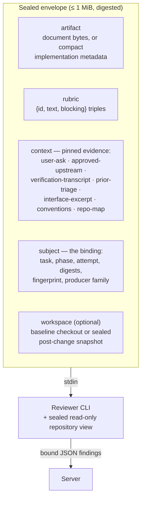
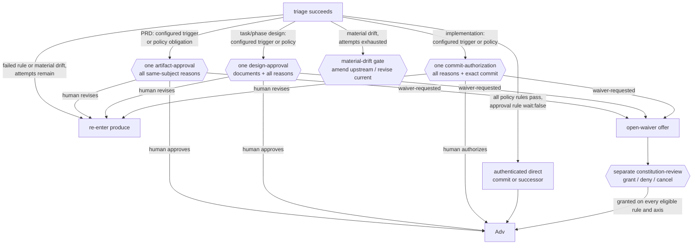

# review/COUNTER-REVIEW

**Explored:** 2026-09-03 · **Commit:** `1d71fee` · **Covers:** `src/review/`, `src/dispatch/`, `src/contracts/mcp-tools.ts`, `src/contracts/semantic-workflow.ts`, `src/mcp/handlers/counter-review.ts`, `src/state/semantic-actions.ts`, `src/state/produce-subject.ts`, `src/state/evidence-results.ts`

Counter-review is independent evidence the producer cannot author. One semantic `review` action dispatches general review, the configured test specialist for phase design and implementation, and constitution review when active rules exist. Children run concurrently against sealed assignments and shared server-materialized repository views. Stable reviewer IDs bind findings and provenance before the results merge into one authoritative evidence document.

## The dispatch envelope

The control envelope is a single JSON document — serialized, hashed, and byte-capped at 1 MiB. It arrives on stdin with nothing prepended. Source bytes are not transported through that JSON: the server separately materializes the configured repository set as sealed, read-only snapshots. One repository preserves the historical `repo` cwd and binding arm; multiple repositories appear beneath `repos/<name>`, and citations use `<name>/<path>`. The envelope declares and binds every snapshot.

The shape is closed: validation rejects unknown keys, so producer-authored history and instructions cannot enter the request. Server-owned instructions define how to apply the rubric. Document review traces the reviewed artifact and its commitments. Implementation review is narrower: inspect declared outputs and their current post-change behavior, using unchanged files only to verify dependencies, interfaces, and consequences. It is not a general code review. The subject names the durable attempt, and the envelope digest makes the input reproducible as bytes without claiming deterministic model judgment.

Active reviewer instructions and structured output use one three-field taxonomy. `claim_type` distinguishes defect, risk, gap, and preference; `confidence` distinguishes certain, likely, and suspicion; `falsifier` names the concrete command, inspection, or evidence that would disprove the claim and is bounded to 4096 UTF-16 code units. Suspicion is intentionally cheap: uncertainty should be labeled, not inflated into confidence or suppressed. Finding-level severity and blocking do not exist in V2. Rubric criteria still retain their parser-owned `blocking: boolean` policy keys; only criterion prose follows the new finding vocabulary.

Fresh children return findings plus the eight server-bound subject fields and matched rules, never their own rollup. The server verifies those bindings and derives the result: no findings is `pass`, preference-only is `advisory`, and any defect, risk, or gap is `review-raised`; it also derives `total_findings` and every one of the 12 claim/confidence partition counts. Multi-reviewer aggregation preserves configured reviewer order and each reviewer's finding order, retains the existing deterministic ID tagging/disambiguation, and rejects a V1 or mixed active round. Archived V1 evidence remains native—severity, blocking, blocking count, and the legacy verdicts—and renders without conversion.

## Prior-triage context: stopping defect-class re-litigation

On remediation, `prior-triage` contains only the latest accepted findings assigned to that child: the original finding and the producer's revision intent. The child verifies each intent and reports only a material defect introduced, exposed, or worsened by that revision. It does not reopen unchanged content, relitigate rejected findings, or repeat editorial findings. If the revisions satisfy the accepted intents without such a regression, it returns no findings.

With several configured reviewers, only owners of latest accepted findings rerun, each with its own accepted intents. Stable assignment IDs (`general-1-…`, `general-2-…`, `test-…`) preserve ownership. Rejected and editorial findings are closed. If an accepted finding has no current owner after reconfiguration, the first configured reviewer handles it with the complete rubric; the server does not fan the request out. The constitution child still runs because policy and drift are judged against the revised subject. `reviewer_runs` records each contributor's envelope digest, assignment, route provenance, and finding IDs. When a route override was used, the evidence records the exact declared reason, displaced route, actual route, and source, while the documented limitation remains that human origin of the override is not server-authenticated (see `docs/LIMITATIONS.md`).

Durable triage still carries a server-computed cumulative `disposition_ledger`. It supports audit and `review_strength`; it is not placed in remediation prompts. This separates durable history from the small amount of context a reviewer needs to confirm the latest accepted work.

## Material defects, not review volume

The production rubrics are server-owned config files under `assets/rubrics/` (`prd.yaml`, `design.yaml`, `implementation.yaml`), shipped in the install bundle and selected by durable phase kind (`prd`, design, or implementation). The server reads and strictly parses the selected file fresh on every review and status call — no rebuild is needed for an edit to take effect once the bundle is installed — and a missing or invalid file fails the review closed with `CONFIG_INVALID`, naming the file. Each file's `rubric_id` is cross-checked against its phase kind and excluded from the digest, which covers exactly the schema version, kind, mode, and ordered criteria. Full status publishes the selected rubric, ID, and digest for the producer's bounded author check; the durable counter-review handler independently loads the same policy and binds its digest into the input fingerprint and review evidence, so a rubric edit between two steps of an in-flight task fails that task's next review-cycle step closed. Skills still carry no rubric copies, and callers cannot substitute one in an MCP request.

The production rubrics use a consequence-based standard:

- **A finding needs a material consequence (The Consequential Stopping Rule).** Leaving the artifact unchanged must be reasonably likely to break production, alter downstream implementation, break verification, or fail an approved risk boundary. Reviewers evaluate against the finite question: *"What would break in production or fail execution?"* rather than the unbounded *"What is wrong?"* A true observation or discrepancy that does not change downstream code, contracts, or verification is **not a defect**; reporting such items leads to specification drift and hyper-coupling (e.g. accumulating arbitrary defensible constraints that make documents falsely precise).
- **Ambiguity is material only when reasonable readers diverge materially.** More specific prose is not automatically better. Wording blocks when it permits materially different reasonable implementations or acceptance outcomes.
- **Implementation findings stay change-bounded.** Each finding must tie a material defect to behavior introduced, exposed, or materially worsened by a declared output. A defect found only because the snapshot made unrelated code visible is out of scope.
- **Remediation confirms accepted work.** It verifies the latest accepted intents and checks their changes for material regressions. It does not reopen rejected, editorial, or unrelated issues.
- **Numbers are commitments.** The design rubric's `quantitative-consistency` criterion treats stated constants, budgets, bounds, and derived figures as design commitments: a set of constants and invariants that cannot jointly hold, a bound that depends on a quantity the design neither states nor schedules to measure, or arithmetic that does not follow from its inputs is a blocking defect when it has a consequence for a requirement, verification result, or risk. The reviewer recomputes rather than accepts.
- **Load-bearing mechanisms and unmet inputs are defects.** `boundary-and-mechanism-coverage` blocks when a safety, ordering, or recovery property lacks direct verification, or when a stated policy omits an input or lifecycle class the system will meet and behavior would change.
- **Non-material output is suppressed, not deferred to the human.** Optional polish, harmless wording refinements, stylistic preferences, true-but-inconsequential observations, and completeness suggestions do not become a gate backlog. Deterministic-tool territory — formatting, lint, type-checking, naming, import order — is never a finding. Structured review and triage evidence remains embedded in the current durable result manifest; Markdown renderings are disposable cache, not permanent outputs.
- **Evidence gaps are proportional.** `unverifiable-claims` reports a gap only when missing evidence prevents a material judgment; explicit assumptions remain under `stated-assumptions`.
- **Test quality and shortcuts are first-class material defects.** Phase design carries `test-strategy`; implementation carries `verification-evidence` and `test-quality`. With `test-reviewer` configured, those criteria move to its sealed assignment and are removed from general assignments; without it, general review keeps the whole rubric. Test review seeks distinct regression protection at economical seams: missing boundary, lifecycle, and failure cases matter, while duplicate setup/behavior/oracle combinations, raw coverage targets, exhaustive low-risk matrices, and disproportionately expensive fixtures do not buy confidence. `anti-shortcut` stays with general review because it also covers non-test implementation shortcuts.
- **Reviewer uncertainty is surfaced, never guessed.** `reviewer-confidence` records a non-blocking `escalate-` finding when a material judgment cannot be made with confidence; the producer dispositions it with a written rationale and presents it in full at the next human boundary this phase reaches.
- **Phase-boundary findings use the same materiality bar.** A reviewer may challenge a split, merge, or sequence when it makes a repository-ready outcome, stable predecessor input, valid completion state, or understandable verification story materially worse. Numeric preferences, file-count rules, phase-count targets, layer boundaries, and the fact that a design contains several work chunks are not defects by themselves. Broad, small, and genuinely open-ended plans are acceptable when their concrete exception value is explained.

The protocol bounds reviewer context and repeat work without making generative judgment deterministic.

### Review push-through is occurrence-bound

Triage retains a server-computed `review_round_history`: one entry for each distinct completed counter-review round, with its evidence identity and resulting dispositions. That history, not the attempt number alone, determines whether an exhausted loop may offer `push-through-review`. Eligibility requires at least two distinct completed entries and a complete current set of accepted occurrences. An occurrence is the exact pair of review-evidence digest and finding ID, so two reviewers reusing a local finding ID remain distinguishable and an accepted finding cannot be replaced by similarly worded prose. If compatible historical evidence maps one attempt to conflicting review identities, reconstruction omits that ambiguous attempt: ordinary triage remains available, but the conflict can never inflate push-through eligibility.

The attempts-exhausted context repeats the current evidence-set digest and triage result digest and must match the gate's authenticated evidence. Its accepted-occurrence list is locale-sorted at the human gate; the durable record is ordinal-sorted under the state schema. The option is omitted if history is legacy, partial, duplicated, stale, or cannot account for every current acceptance. Old attempts-exhausted requests retain their exact four-choice archive shape and remain readable; fresh eligible requests use the expanded five-choice shape.

Human push-through does not rewrite or erase review evidence. Settlement records the ordinary attempts-exhausted approval and a specialized record over the exact occurrences, attempt, evidence set, triage result, reason, and time. The fixed-point evaluator may treat that exact review obstacle as settled, but it still evaluates constitution compliance, matched `review_trigger` conditions, material drift, project approval rules, and commit authorization. A later subject or evidence set cannot borrow the record.

A validation override is deliberately outside this evidence loop. It is requested only from a failed phase-implementation work result when named checks could not run. Granting it records those exact descriptions as **not run**, never as review evidence and never as a passed verification. When the implementation later reaches commit authorization, the human-facing details disclose every current authenticated validation exception. Invalid or unavailable archives produce only a safe audit status; untrusted reason, time, input, or validation text is not displayed.

## Pinned context: evidence, not narrative

"Pinning" means the **server itself** reads the evidence bytes from an immutable, authenticated source and records their SHA-256 — never the model, never a summary. Each context entry declares its status so no gap is silent:

- `pinned` — full bytes plus digest.
- `truncated` — a bounded head plus the full-file digest and byte count.
- `unavailable` — a named gap the server could not fill.
- `omitted-cap` — dropped to fit the byte cap; digest retained.

The policy split is the key idea: absence that **contradicts durable authority** (the PRD's declared ask drifted; an upstream lost its approval; bytes don't match the retained projection or parent-document binding) **fails closed** — no review happens. Document reviews authenticate their selected file against the retained result projection. A task-design review additionally authenticates the `prd.md` projection in that result; a phase-design review authenticates both `design.md` and `prd.md`. The reviewer and later approval therefore judge the complete document set rather than a primary file beside unbound parent edits. Implementation reviews authenticate `impl-notes.md` against the retained implementation output's parent-document digest, while declared changed files come from that result's retained projection plan. When implementation also changes the PRD, task design, phase design, or log, those task paths are retained outputs and their exact current bytes become `co_produced_documents` in the authenticated implementation review subject; both review children see them, while unchanged upstreams remain separately pinned to their approved owner. If that approved owner is a compound planning result, its other projections are still authenticated together except for paths the implementation now co-produces: the current implementation owns those bytes, so a surviving sibling binding cannot reintroduce the owner's superseded projection. Every other gap becomes a named `unavailable` entry, which the rubric's non-blocking `unverifiable-claims` criterion turns into a finding. Findings prefixed `unverifiable-` mean "the reviewer lacked evidence," and triage must *reject* them with an `envelope-gap:` rationale — the fix for recurring gaps is better envelope assembly (or the reviewer's repo access), never pinning more bytes in.

When the cap is hit, droppable context is replaced lowest-priority-first (`repo-map`, then `conventions`, then `interface-excerpt`). The user ask, approved upstreams, verification transcript, and latest accepted remediation intents are never droppable; if they do not fit, review fails closed.

For implementation subjects, the raw transcript lives only at ignored `.archflow/runtime/tasks/<task>/cache/phases/<n>/verification.txt`. `ImplementationOutputV1.verification_evidence` binds its SHA-256 digest and byte count into durable authority. Envelope assembly verifies those bytes before review; after phase advancement the raw transcript may be removed without weakening already-approved authority. If it disappears during an uncommitted active step, status asks for a rerun rather than invalidating an earlier phase.

## The sealed implementation snapshot

An implementation envelope carries the compact `ImplementationOutputV1`: baseline commit, declared operations and paths, snapshot and diff identities, verification binding, and undeclared-change report. It carries neither whole source files nor generated diffs. Source size therefore does not consume the 1 MiB control-envelope budget.

Before either child runs, `workspace.ts` archives every plan member at its exact commit. Primary snapshots remove `.archflow/tasks`; secondaries remove `.archflow` entirely. For an implementation, it applies every authenticated retained primary after-image, deletion, rename endpoint, symlink, and executable mode. A secondary without an authenticated implementation section stays commit-only context at observed HEAD, even if configured `writable`. The child starts in these snapshots and navigates with read-only tools.

The snapshot is evidence, not the subject. Declared outputs, co-produced documents, and their current behavior define implementation-review scope. Unchanged files may be inspected only to trace a changed output's dependencies, interfaces, and effects; unchanged writable members and context-only repositories remain context. A finding is valid only when it identifies a material defect introduced, exposed, or worsened by the current implementation change.

The workspace declaration binds the baseline and declared snapshot digest; the review subject already binds the complete retained implementation artifact. Materialization omits retained `.archflow/tasks` projections just as it removes those paths from the baseline, while rejecting path escape, symlink-parent traversal, and file/directory collisions. This matters for implementation results that also retain their tracked implementation log: the log remains authenticated workflow evidence but is not repository source exposed to the child. The temporary archive has no `.git`, so removed task blobs and unrelated worktree edits are unreachable.

The 1 MiB cap remains a control-plane safeguard. An overflow now means compact declarations, co-produced governing documents, or mandatory pinned context are themselves excessive; it is not evidence that ordinary source files are too large. A phase split is a product/design judgment about review scope, not an automatic response to source transport size.

## The flow, end to end

1. **Produce** — the artifact is recorded durably; its digest becomes the subject digest.
2. **Counter-review call** — one offered `review` action reaches the direct seam, with the artifact, subject, and pinned transcript derived entirely from durable authority. The server selects the rubric. Everything through step 6 happens inside this one call.
3. **Server assembles** the review material (document text or compact implementation metadata), pins context (failing closed on authority violations), and seals the envelope under the cap. Document reviews receive a checkout at HEAD. Implementation reviews receive the attested base tree with the retained after-images applied, producing the exact post-change snapshot.
4. **Rubric dispatch** — the selected reviewer CLIs run headless in parallel (see `../mcp/DISPATCH.md`). The strong general reviewer remains the broad accuracy, design, and code-quality counter-review. Phase design and implementation may additionally route one `test-reviewer` (the shipped default is `gpt-5.6-luna` at `xhigh`) for test strategy, missing cases, duplicated cases, and coverage value. Every child receives a sealed assignment with a stable reviewer ID, focus, and ordered criterion IDs; its output is bound to contributor provenance including route, its own envelope digest, assignment, and owned finding IDs. Multiple general reviewers and the specialist combine into one evidence document. Remediation re-dispatches only stable finding owners; if an owner disappears after reconfiguration, all available reviewers run and general receives the whole rubric. Selection remains role-local: human one-dispatch override, invocation route, producer-specific config, then top-level config. Each child validates and retains its own output as it returns, so sibling failure does not discard completed work.
5. **Constitution dispatch** — when the pinned constitution has active rules, the server dispatches a reviewer child (running concurrently alongside the rubric reviewers) that performs the constitution and drift review (see below). The child returns only its per-rule and per-upstream judgments. The server deterministically derives the constitution, drift, matched-trigger, and uncertain-trigger summaries before attestation, so redundant model-authored rollups cannot contradict those judgments. The server alone decides whether this runs; with no active rules the drift check is also skipped and the result records `constitution: {status: "not-run", reason: "no-active-constitution-rules"}`, which is normal.
6. **Currency re-check and commit** — after every child has settled (the round waits for all of them, whether they succeed or fail), the server re-authenticates the artifact/projection, repository-set digest, identity continuity, and every HEAD pin. Any drift discards the products (`counter-review-subject-not-current`). Otherwise both results land in **one atomic state transaction**, each carrying the ordered repository name, identity, and commit pins. For fresh V2 evidence, the server derives `pass`, `advisory`, or `review-raised` from the bound findings; a child never authors that verdict. The retired `fail` verdict appears only in native archived V1 evidence and is not active V2 vocabulary.
7. **Triage** — the producer must disposition every rubric finding across five strict dispositions:
   - `accepted` — the finding demands a substantive fix; forces re-entry into produce and all evidence is redone against the new bytes. Its owning reviewer receives only the latest accepted intent during remediation.
   - `accepted-editorial` — the fix is purely wording or formatting without changing meaning or commitments. Permitted **only** for PRD and design documents (`prd`, `design`); the server refuses `accepted-editorial` for phase-design and phase-impl positions (where substantive changes must use `accepted`). When all accepted findings are editorial, retained review and constitution evidence are preserved for a strictly one-hop predecessor declaration.
   - `rejected` — with a written rationale and evidence demonstrating that the finding is non-material or refuted. Findings prefixed `unverifiable-` mean "the reviewer lacked evidence" and must be rejected with an `envelope-gap:` rationale.
   - `escalated-human` — the producer escalates a finding requiring human judgment or architectural tradeoff. An unsettled escalation suppresses autonomous `wait:false` no-wait advancement and routes into the position's ordinary human gate (`artifact-approval`, `design-approval`, `commit-authorization`) or unified adjudication gate, presenting full finding details and rationale. Once approved for that exact evidence set, if any accepted editorial findings were also triaged, produce re-entry is required before advancement.
   - `deferred` — the finding is recognized but postponed to a real later milestone or phase. The server strictly refuses `deferred` for any defect finding (`claim_type: "defect"` or legacy `blocking: true`). V2 risk and gap deferrals require non-blank `evidence` demonstrating non-material consequence for the current scope; preference deferrals require non-blank `rationale`.

The producer owns the judgment behind those shapes. It first confirms that the claim concerns the submitted subject and has a concrete material consequence, then runs any feasible returned `falsifier`. A disproved, speculative, inconsequential, unrelated, unaffected pre-existing, optional-cleanup, or merely preferred-alternative claim is rejected with the observed evidence; a confirmed subject-owned material problem is accepted with a concrete revision intent. `escalated-human` is reserved for a genuinely material claim whose judgment cannot be falsified or resolved by the producer, and it requests rather than supplies human authority. Deferral is evidence-backed postponement to a real later boundary, never a backlog escape for a V2 defect.
   The server enforces strict partition count equality (`accepted_count`, `accepted_editorial_count`, `rejected_count`, `escalated_human_count`, `deferred_count`) against the actual filtered dispositions. Triage covers rubric findings only; constitution findings follow their own settlement path.
8. **Rule settlement, then targeted authority** — the triage-settle transaction records what project `approval_rules` evaluated for the exact subject at clean and foldable policy-adjudication fixed points. Every fresh ordinary gate binds that exact settlement and frozen conclusion in `approval_trigger`, then adds all policy findings and exact eligible waiver pairs over the same subject. Task and phase design present their compound document sets; PRD uses `artifact-approval`; implementation uses `commit-authorization`. For implementation content rules, settlement freezes every matching path. Presentation joins that path set to retained output to reconstruct each operation and exact signed byte delta. Rename endpoints are matched independently, and overlapping effects such as renaming away and then adding at the old path remain separate, deterministically ordered evidence instead of being collapsed into a lossy path set. The semantic operation/size `details` remains complete even when bounded archive prose elides paths. Later config edits may appear as an informational notice but cannot rewrite authenticated reasons. A `wait:false` settlement can instead produce direct milestone, commit, or successor authority only when no matching ordinary human approval exists; approval always takes precedence in recovery and proof consumers. After a requested change, simple wording or formatting binds the prior archived decision plus predecessor/final subject digests in the alternate reapproval trigger, always returns for approval, and never clears an accepted material finding. Significant changes archive prior evidence, reset to attempt 1, and automatically dispatch fresh reviews. Uncertainty is significant; the human may override the classification in either direction.

Step 3 re-reads the subject document and its approved planning documents, then checks their digests against durable authority. A mismatch blocks dispatch. Status offers either re-recording the phase result over current subject bytes or restoring an upstream document's recorded bytes. Baseline adoption cannot re-bind a result's recorded subject. See `../state/DURABLE-STATE.md`.

The same distinction applies after a milestone. Proving the exact authorized commit in first-parent history does not review any later descendant, and adopting current projected bytes does not refresh the retained review. If milestone proof is missing but a real delta can be produced, the server's recovery action invalidates old active authority and sends the same owner through fresh significant production and automatic review. Governing planning bytes likewise cannot be adopted into successor authority; they are restored or reviewed again by their owner.

If a dispatch dies mid-flight, the position stays at `counter_review: running` and the next `review` action re-runs only step 4 onward: the entry boundary is already installed, and the state machine has no running-to-running edge that would let it be recorded twice. That re-run is a retry of the *same round*, not a new one: every identifier the children see (review invocation and result, constitution invocation and result) derives from the round's intent rather than the MCP call, so the retry re-seals byte-identical envelopes, and a child whose validated output was retained for exactly that envelope, role, route, and route provenance is not dispatched again. If fable and sol both answered and only the constitution child failed, the retry runs the constitution child alone and commits all three together; a route override for the failed role leaves the retained siblings untouched, while an override or invocation route that changes how a retained role was selected dispatches that role fresh so the evidence never misstates its provenance. The retained outputs are convenience, not authority: reuse still passes the same output validation as a fresh dispatch, the currency re-check, and the atomic commit, and the records are dropped once the round commits. That resumption does not require the review's own entry transition to still be the newest one in `state.json`. A human decision — a baseline adoption, say — can legally land while the review sits there and overwrite that single slot, and the review still resumes with a real dispatch rather than being stranded. See `../state/DURABLE-STATE.md` for the slot itself.

A classified selection or dispatch failure also writes one compact failure observation for the current phase instance and attempt under ignored runtime. Within one revision the first classified failure is kept: sibling children of one round run to completion independently and more than one may fail, and the slot names the failure that happened first rather than whichever sibling wrote last; a retry runs at a later revision and replaces it. It contains only a bounded server-authored message, role, project error code, selected model/effort/provider when available, route source, and exact-current state binding. Status projects it only while task, phase, `counter_review/running`, attempt, and revision all match. It never consumes an attempt, changes state, authorizes a retry or gate, mints evidence, or replaces the original returned error; malformed, stale, terminal, or missing records are ignored. The existing random forensic attempt record remains separate and may contain local channel tails that never enter semantic status.

## Invocation-declared routes

All four producing skills may declare counter-reviewer and adjudicator routes for one run; phase design and phase implementation may additionally declare `test-reviewer`, and phase design may additionally declare `effort-reviewer`. The public semantic invocation calls the member `review_routes`; the internal counter-review request calls the copied member `invocation_routes`. Both are included in their respective offer/operation or request digests, but neither changes the reviewed-subject input fingerprint: routing chooses who judges the same bytes. Semantic review continuation always re-derives the routes from the original invocation, including significant revisions, rather than caching a one-shot submission.

Selection is role-local and ordered: `route_override → invocation_routes → phase/base configured route`. An omitted invocation role therefore falls back independently. Evidence from every fresh dispatch records the actual adapter, family, model, effort, optional provider, and `route_source`. Invocation selection is labeled `invocation-declared` and records the raw configured route it displaced when one existed; it is not human- or controller-authenticated. Archived evidence without these new optional compatibility fields remains readable.

## Route overrides, for outages

The task's routing config is freely editable and reported through `config_change`, but editing project policy is the wrong tool for one reviewer outage: it persists beyond the failed call and affects later dispatches. Without a per-dispatch escape hatch, a logged-out or rate-limited reviewer CLI still forces either a lasting config edit or a stranded task.

So a dispatching semantic `review` offer optionally accepts a `review-dispatch` submission carrying `route_override`: a substitute `{model, effort, provider?}` for the counter-reviewer, test reviewer, adjudicator, or any combination, plus the human's nonempty `reason` for it. The offer and submission digest bind that declaration to the request and review operation. It applies to that dispatch and nothing else — invocation and `config.yaml` are untouched, the next fresh review selects its normal invocation/config route again, and a role the override does not name keeps its invocation selection or configured fallback.

Two things keep this honest rather than a way around the reviewer:

- **A substitute is validated exactly like a configured route.** Same model-name rules, same family derivation, same cc-switch `provider` restriction, same per-adapter effort support. An override cannot express a route the config could not.
- **The deviation is recorded with the evidence.** Evidence produced under an override uses `route_source.provenance = route-override`, carries the reason, records the actual provider when present, and identifies the raw normally selected invocation/config route plus its source as displaced context. The separate override record also includes the configured route facts (including provider) pinned for the request. Rendered evidence keeps route source and human override as distinct sections.

Choosing a substitute is the human's call, not the agent's. The agent's job when a dispatch fails on an outage is to say so plainly and ask; it never picks a different reviewer on its own to get past a failure. This is a policy deviation, not a trust-boundary one — reviewer families were already recorded rather than enforced (`../mcp/DISPATCH.md`), so a substitute reviewer is the same *kind* of choice as configuring a same-family one, just made later and for a stated reason.

Editing the artifact changes its digest, which invalidates downstream evidence. You iterate until the remediation review finds no material defect worth accepting; non-material suggestions do not prolong the loop or move to the human approval agenda.

## Constitution review

The constitution review judges the subject against the repository's versioned policy rules and approved upstream documents. It is not arbitration between rubric reviewers; triage resolves those findings. It runs concurrently with rubric review only when the pinned constitution has active rules. The server decides whether it runs. Declared security rules belong here, novel vulnerabilities remain in general review, and security-boundary coverage belongs to the test specialist.

Each numbered Markdown file in `.archflow/constitution/` is exactly one rule: frontmatter carries a stable `id`, a `version`, a `status`, and an optional `review_trigger` — the rule's own human gate, a condition under which the repository wants a person to decide at once; the shipped defaults declare three (below) — and the prose body is the normative text. Rule IDs are append-only — content changes bump the version, deprecation replaces deletion. The eight shipped rules are a good summary of the product's values:

- **`explicit-human-authority`** — silence, elapsed time, agent prose, or a model verdict never supplies approval; the server enforces this at its gates, so an artifact complies unless it asserts or relies on a human decision the workflow never recorded.
- **`approved-design-before-code`** — implementation starts only from an approved phase design; a result that departs from its own phase design updates it in the same reviewed result, a change to the architecture design or PRD is made in the same result and decided by the project's approval rules, and a departure from an approved upstream is reported as a drift finding rather than a failure of the rule.
- **`prefer-established-libraries`** — prefer mature, widely-adopted, and actively-maintained libraries over custom implementations for common domain problems; custom authoring requires explicit architectural justification, and unmaintained or obscure single-user packages must not be introduced.
- **`task-and-evidence-isolation`** — tasks are isolated; stale, mismatched, cross-task, or partial evidence fails closed.
- **`honest-human-centered-outcomes`** — failures and dead ends stay visible non-success states with a safe next action, never silently bypassed.
- **`human-approval-for-access-control`** — a trigger rule: adding or changing authentication, authorization, or permission-decision logic asks a human at once, because a defect grants access silently.
- **`human-approval-for-crypto-and-secrets`** — a trigger rule: changing cryptographic primitives or key and credential handling asks a human at once, because incorrect use can look correct while destroying confidentiality or authenticity.
- **`human-approval-for-workflow-control-plane`** — a trigger rule: editing `.archflow/workflow.yaml`, `.archflow/config.yaml`, or `.archflow/constitution/` asks a human at once, because the authority files are the trust boundary every task pins its policy from.

A task-branch constitution edit does not change the rules governing that task. Counter-review continues against the immutable constitution pinned at task initialization; mutable or later committed policy bytes are never substituted into the constitution envelope. Because a commit names an immutable tree, the server reads the pinned constitution from the policy-base commit once per process per worktree and commit and reuses that resolution; a failed resolution is never reused. The policy edit may travel as an ordinary reviewed implementation output and becomes available to future tasks only when their approved policy base includes it.

The constitution child receives the subject, sorted active rules, approved upstream documents, fixed instructions, and the same workspace binding as rubric review. For an implementation, declared outputs and co-produced documents remain the subject; unchanged snapshot content is evidence only. A rule or drift finding must tie its judgment to behavior introduced, exposed, or materially worsened by the current change. Trigger matching likewise needs direct evidence in the subject or a traced consequence in supporting context. Workflow mechanics owned by the server are not trigger evidence, and a rule without `review_trigger` is always `not-matched`.

The server requires one finding per supplied rule and upstream, canonicalizes their order, and rejects missing, duplicate, invented, or contradictory entries. Before dispatch, durable state, constitution digest, review set, and each upstream approval must agree.

The output is cross-checked mechanically: one finding per active rule, in ID order, matching versions.

After triage, status and request construction read the adjudication evidence from its retained `adjudication-evidence` artifact wrapper. The wrapper is durable result metadata, not the evidence itself; approval presentation unwraps it before folding rule findings and never treats the outer artifact as reviewer output.

A rule may declare `enforced_by` labels naming its mechanical enforcement. They are context for judgment, not findings the reviewer must report.

### What the verdict opens

A matched `review_trigger` demands human authority at once — through the ordinary gate flow, **after triage**, never dispositioned by the producer. A failing or uncertain rule and material upstream drift are the producer's to resolve first: the fixed point re-enters production with the findings named in the revise offer, and only when the attempt budget is spent do they reach the same gate (where a human may also waive a rule the reviewer misjudged):

Compliance ("did the subject violate this rule") and trigger ("does this rule's `review_trigger` condition apply here") are different judgments that routinely share one root cause. The review retains both axes, but they route differently: a compliance failure is agent work until attempts run out, while a matched trigger is the constitution asking for a human now. Whichever opens the gate, both findings fold into the phase's ordinary gate over the same subject. That context also carries the configured trigger and exact eligible rule/axis pairs, so a PRD, design, phase design, or implementation produces one decision boundary rather than a policy prompt followed by ordinary approval. The ordinary decision may approve, request revision, reject/abort, or redirect to waiver; `waiver-requested` itself grants no authority.

Material drift keeps its own gate because it concerns a different subject — an approved upstream document — and its human choices differ (amend the upstream, revise the current work, or stop). It opens only after the producer's attempts are spent; before that, the revise offer names the drifted document and the affected claims so the producer can update the governing document it owns (a phase implementation owns its phase design; a change to the architecture design or PRD then meets the project's approval rules) or bring the work back in line. The gate stays serialized behind the constitution decision when both open.

Status derives the pending gate. A skill-authored `gate-summary` opens the current presentation—title, summary, direct question, material evidence, labeled choices, and structured `{class,text}` reasons. The archived ordinary request's `approval_trigger` supplies configured subject/content provenance or the durable simple-revision return; its policy findings supply exceptional reasons. Live config and the caller summary cannot rewrite them, and any exceptional reason dominates the aggregate class. After presenting those words and receiving one human answer, the offered decision action archives the selected token and `{reason}` immutably and settles the gate in a separate substep; a stale or superseded subject is rejected rather than approved, and a retried call replays the archive without recording the decision twice. Distinct remedies such as material drift, exhaustion, migration audit, and the waiver decision remain separately serialized because they govern different subjects or actions.

### Waivers

A waiver is a durable, human-granted exemption from **one specific rule version**, for **one specific subject digest**, under one specific scope, lasting only until the task completes. The semantics are exact-match: change the artifact and the subject digest changes, so the waiver evaporates; bump the rule version and it evaporates.

A waiver also names **one axis**: `adjudication-failure` exempts the rule's compliance verdict, `review-trigger` exempts its matched trigger. Waiving one says nothing about the other, so a gate that flagged a rule on both axes is satisfied by the waiver path only when both are granted.

Waivers are requested from an existing ordinary gate, never conjured: a fresh origin must be `artifact-approval`, `design-approval`, or `commit-authorization`, and its recorded decision must literally say `waiver-requested` while naming a rule and axis pair offered in `eligible_waivers`. The server re-reads and re-authenticates the exact gate, subject, evidence set, decision, rule, and axis before binding the waiver. The normal path applies the separate no-submission `open-waiver` offer and freshly writes a waiver-context `constitution-review` gate with grant, deny, and cancel choices. A grant is separate human authority; `waiver-requested`, denial, and cancellation grant nothing. Historical policy-obligation `constitution-review` requests remain archive-only, but an archived one that offered and recorded `waiver-requested` remains a valid compatibility origin so a human choice made under the old interface does not become unusable.

### Durable decisions

Gates and waivers funnel into the same machinery (`src/state/gates.ts`): each gate writes an immutable request and decision record under `authority/decisions/<gate-id>/`, bound to the gate ID, context digest, subject digest, phase, and its kind-specific evidence, with human provenance on the decision. Ordinary and attempts-exhausted gates cite the current review evidence set; baseline adoption cites the drift observation; validation override cites the authenticated pending failure request. On the normal bounded path provenance is minted only from an authenticated connected-host invocation, binding the connection and canonical transport request identity; an agent cannot self-assert it in the payload. Task state holds references to ordinary approvals and waivers, plus specialized validation-override and review-push-through histories. Later consumers re-read and validate the underlying archives before projecting authority. Supersession is honest: if the subject changed after preview or under an open gate, the resolver refuses stale bytes and the workflow re-enters the pipeline. The human-facing gate UI is reconstructed under ignored runtime from that durable request and deleted only after the selected decision has been archived.

## Human-facing gates

The durable request remains exact and machine-verifiable, but it is not what the human is asked to read.

### Review strength

The human approving at a gate is approving on the strength of the review evidence, so the view carries `review_strength` whenever current counter-review evidence exists: primary model/effort and family, producer family and `same_family`, attempt/remediation facts, and per-round counts. Fresh evidence additionally exposes every contributor's stable ID, focus, model, effort, family, same-family flag, and finding count; `review_context.assignments` publishes the owned criteria. Archived evidence without contributor records is rendered honestly as one synthesized general reviewer from its legacy scalar provenance. None of it is judgment or producer prose. Skills present it conversationally and give a same-family reviewer or a remediation-round pass the same prominence as an exceptional reason. Reviewer families and effort are legal configuration choices (`../mcp/DISPATCH.md`, `../LIMITATIONS.md`); this projection exists so a task quietly reviewed by its author's model family is never presented as independently reviewed. The server derives a reconstructible presentation with plain evidence and choices while keeping mechanical bindings in the diagnostic layer unless the user asks for them.

There is no separate or optional gate counter-review. The server-dispatched review already ran automatically in the normal evidence pipeline. A simple human revision can reuse that evidence for one hop because it changes no meaning, but it cannot resolve or suppress an accepted material finding and always returns for approval of the final bytes. A significant revision automatically repeats the normal review because the prior judgment is no longer current.

## Exact trees across repositories

An implementation review maps each authenticated retained section back to the one configured repository member with the same name and identity. Every changed writable member is materialized at its declared base plus retained after-images; unchanged writable and context-only members remain pinned at HEAD. The final currency check reopens the session and revalidates membership, identity, bases, HEAD pins, and retained proposed bytes after all children return.

Every fresh server-attested review records the repository pins it saw (`repositories[]`, one entry per member, `primary` alone for a single-repository task); evidence archived before repository sets existed has none and stays readable. The pins are display only: status compares them with live HEADs so a human can see that reviewed context moved, but a context-only member changing after review never stales the evidence or reopens its gate — only the reviewed subject and writable after-images bind authority.

Content globs match each repository's own repository-relative path and run independently in each changed section: `**/*.sql` matches SQL in any writable repository, while a rule like `apis/src/**` does not address a secondary by name. Durable matches retain secondary attribution structurally; human presentation uses `<repository>/<path>` only as display text. One gate or no-wait settlement covers the combined reviewed subject and yields primary-first, ordinal-secondary commit facts.

## Phase-design effort evidence

Semantic status projects effort evidence through one closed public union. Ready advice includes all component judgments, totals, profiles and caveats plus the phase profile and determining IDs. Blocked advice exposes its questions without a phase route. Unavailable advice distinguishes `not-applicable`, `not-produced`, `subject-stale`, and `legacy-evidence`. A live post-review hazard-registry comparison may add one `registry-created`, `registry-removed`, `registry-changed`, or `registry-unreadable` caveat; it is informational and cannot stale authenticated advice or alter an action.

A new phase design contains exactly one fenced `archflow-components-v1` manifest. The manifest is a validated index into the Markdown authority: stable component IDs, repository-qualified normalized paths, scope, mechanism, and verification boundaries. The server never reconstructs it from prose or changed files. It captures the repository-owned hazard registry once at review entry; missing legacy data is an explicit `absent` input, invalid existing bytes fail before dispatch, and later registry drift cannot rewrite evidence from the completed round.

The fixed Luna/xhigh effort child judges decomposition, A–E axes, long-loop and short-component classifications, and concrete questions for material specification gaps. It cannot author totals or routes. Exact component equality and hazard E floors are server checks; the versioned policy then derives component profiles and the phase maximum. A `D >= 2` result or undifferentiated decomposition withholds the phase profile and blocks the fixed point independently of rubric findings or triage.

The strict registry key is `hazards`. Raw decomposition reports `adequate` or `undifferentiated`; an undifferentiated result names at least one `missing_boundaries` entry. A specification blocker identifies whether its question needs a `number` or `priority-order` answer. Derived recommendations use the ordered IDs `gemini-3-7-flash-max`, `glm-5-3-flash-max`, `gpt-5-6-sol-medium`, and `gpt-5-6-sol-xhigh`; these are advisory profile identifiers, not dispatch routes.

Fresh phase-design bytes always require fresh effort evidence, including editorial and remediation changes. Exact unchanged evidence created before this feature may settle under the explicit legacy classification, but any later design edit ends that exception. The nested assessment is optional only for archive reading; a newly minted phase-design review without it is invalid.
