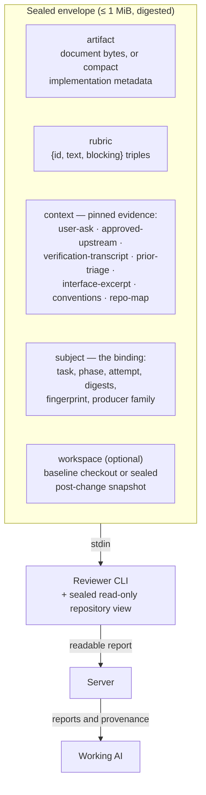
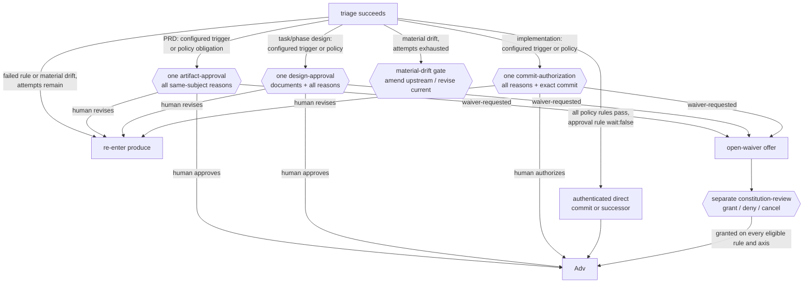

# review/COUNTER-REVIEW

**Explored:** 2026-09-12 · **Commit:** `7f97fe0` · **Covers:** `src/review/`, `src/dispatch/`, `src/contracts/mcp-tools.ts`, `src/contracts/semantic-workflow.ts`, `src/mcp/handlers/counter-review.ts`, `src/state/semantic-actions.ts`, `src/state/produce-subject.ts`, `src/state/evidence-results.ts`

Counter-review supplies independent feedback to the working AI. The initial review runs the configured general and test reviewers, alongside separate constitution review when rules are active. Reviewers return readable reports; the working AI interprets them, makes worthwhile revisions, and selects previous reviewers to verify the changes. Useful feedback and economical follow-up matter more than agreement on every suggestion.

Fresh Review V4 evidence records report text and server-owned reviewer, route, and reviewed-subject identity. The preferred child response is `{ "report": "..." }`; any other successfully extracted JSON is retained as readable JSON rather than rejected for taxonomy, field, or ordering differences. The server does not derive a verdict, finding count, or plan-alignment census from it. A missing or unreadable response remains a dispatch failure. A server-record validation failure is reported separately, with received bytes retained and bounded validation paths/codes in ignored diagnostics.

Gate choices are validated against the authenticated decision templates independently of presentation rendering. A gate opened solely for escalated findings still accepts its advertised choices, including requesting changes at commit authorization, even though the explanation requires separately loaded review evidence.

MCP returns `review_reports` and accepts a `triage` response with `decision: finish | revise | revise-minor | escalate` and a rationale. An ordinary revision additionally names previous reviewer IDs and a verification request for each. The response uses the existing transaction and offer binding; the client does not copy digests. `finish` settles ordinary feedback even when the reviewer disagrees, but cannot bypass constitution checks, a required human approval, or commit authorization.

`revise-minor` lets the orchestrator make one batch of localized corrections without another AI review. A paragraph may gain a short explanation of established intent; a coordinated rewrite across ten paragraphs needs review. Typos, formatting, and comment cleanup also qualify. New requirements, behavioral changes, and verification commitments require ordinary review. Classification is the orchestrator's judgment about consequence and breadth, not an automated paragraph limit or another AI call. Non-material suggestions may still be dismissed with `finish`.

After entering the returned revision window, the producer runs applicable checks and submits `review_revision: {classification: "minor" | "significant", rationale: "..."}` on its succeeded work result. Minor preserves the original review group, including constitution and phase-design effort evidence, through an authenticated one-hop predecessor link. Significant triggers fresh review. The declaration and final artifact are retained, while status discloses review reuse and keeps each report bound to the bytes it actually reviewed. Unresolved policy requirements and final-byte human and commit approvals still apply. Archived structured reviews retain their existing editorial rules.

Successful sibling feedback remains visible as `partial_review_reports` after a failed group settles. The review stays incomplete and retries reuse successful outputs. Follow-up calls run only the selected reviewers plus required constitution/effort work. Unselected reports remain `previous_review_reports`, with their original reviewed subject. There is no additional interpretation-model call.

## The dispatch envelope

The control envelope is a single JSON document — serialized, hashed, and byte-capped at 1 MiB. It arrives on stdin with nothing prepended. Source bytes are not transported through that JSON: the server separately materializes the configured repository set as sealed, read-only snapshots. One repository preserves the historical `repo` cwd and binding arm; multiple repositories appear beneath `repos/<name>`, and citations use `<name>/<path>`. The envelope declares and binds every snapshot.

The shape is closed: validation rejects unknown keys, so producer-authored history and instructions cannot enter the request. Server-owned instructions define how to apply the rubric. Document review traces the reviewed artifact and its commitments. Implementation review is narrower: inspect declared outputs and their current post-change behavior, using unchanged files only to verify dependencies, interfaces, and consequences. It is not a general code review. The subject names the durable attempt, and the envelope digest makes the input reproducible as bytes without claiming deterministic model judgment.

## Complete implementation diffs

Implementation reviewers start with changed-file statistics and a complete Git patch, then inspect the existing post-change repository snapshot as needed. The server creates read-only files beside that snapshot, outside the control envelope; their paths, byte counts, content digests, and reviewed-subject identity are bound into the envelope. Large patches are read in sections, never silently truncated. Text changes, deletions, renames, modes, and symlinks use ordinary Git presentation; binary files have change markers. All `.archflow/` paths are excluded from patches and statistics. Governing documents and verification remain separately supplied evidence.

A follow-up also gets a patch from that reviewer's last reviewed implementation to the current implementation. Reviewers that skip rounds keep their own baseline. The full implementation patch remains available, and missing historical material explicitly falls back to it. These files are reconstructed from authenticated retained outputs and Git baselines, not from the live worktree. No session persistence is needed. Implementation prompts no longer preload dependency-file excerpts; reviewers read dependencies when the changed behavior warrants it. Document-review context is unchanged.

## Feedback and verification

Every general and test reviewer receives the same consequential-review standard, with rubric criteria as focus guidance. PRD and design documents explain intent and constraints rather than define a mechanical checklist; a plan discrepancy needs a concrete consequence, and a real defect need not have been anticipated by the plan. Reviewers inspect available code and tests before claiming something is missing. Extra verification needs an identified failure that current checks could miss, and equivalent behavioral evidence is sufficient. General review examines the changed work; test review examines useful regression protection. Reports need no finding IDs, exact criterion selections, falsifiers, or coverage census. On follow-up, each selected reviewer receives its earlier report, the working AI’s revision summary, and its verification request. It checks resolution and consequential regressions without reopening unrelated work or demanding the original suggested solution when another solution works.

The working AI assesses each concern on its evidence, resolves supported material problems, dismisses unsupported or non-material suggestions, and finishes when no supported material issue remains. It does not chase reviewer agreement. The default limit remains five completed rounds. Retries do not consume rounds, and a finish response at the limit can continue through the remaining policy checks. Another review beyond the limit uses the existing human intervention.

Archived Review V1–V3 and pending gates remain readable without rewriting. Their original structured triage and alignment semantics apply until a fresh dispatch produces V4. V4 responses do not build a disposition ledger; the small completed-round history remains for the budget.

## Consequential feedback at useful cost

The server-owned rubrics remain review guidance. Reviewers focus on defects likely to break the intended behavior, important risk boundaries, or useful verification. They can explain uncertainty without producing a special taxonomy entry. The working AI checks claims proportionally and decides which changes justify their cost; stylistic disagreements and exhaustive closure are not workflow blockers.

General and test reviewers keep their intended focus. Neither interprets constitution decisions for the producer. Missing context can be explained in the report; the server still refuses a dispatch when its own snapshot or approved-subject authority is invalid.

### Archived structured-review push-through

Triage retains a server-computed `review_round_history`: one entry for each distinct completed counter-review round, with its evidence identity and resulting dispositions. That history, not the attempt number alone, determines whether an exhausted loop may offer `push-through-review`. Eligibility requires at least two distinct completed entries and a complete current set of accepted occurrences. An occurrence is the exact pair of review-evidence digest and finding ID, so two reviewers reusing a local finding ID remain distinguishable and an accepted finding cannot be replaced by similarly worded prose. If compatible historical evidence maps one attempt to conflicting review identities, reconstruction omits that ambiguous attempt: ordinary triage remains available, but the conflict can never inflate push-through eligibility.

The attempts-exhausted context repeats the current evidence-set digest and triage result digest and must match the gate's authenticated evidence. Its accepted-occurrence list is locale-sorted at the human gate; the durable record is ordinal-sorted under the state schema. The option is omitted if history is legacy, partial, duplicated, stale, or cannot account for every current acceptance. Old attempts-exhausted requests retain their exact four-choice archive shape and remain readable; fresh eligible requests use the expanded five-choice shape.

For archived structured reviews, human push-through does not rewrite or erase review evidence. Settlement records the ordinary attempts-exhausted approval and a specialized record over the exact occurrences, attempt, evidence set, triage result, reason, and time. The fixed-point evaluator may treat that exact review obstacle as settled, but it still evaluates constitution compliance, matched `review_trigger` conditions, material drift, project approval rules, and commit authorization. A later subject or evidence set cannot borrow the record.

A validation override is deliberately outside this evidence loop. It is requested only from a failed phase-implementation work result when named checks could not run. Granting it records those exact descriptions as **not run**, never as review evidence and never as a passed verification. When the implementation later reaches commit authorization, the human-facing details disclose every current authenticated validation exception. Invalid or unavailable archives produce only a safe audit status; untrusted reason, time, input, or validation text is not displayed.

## Pinned context: evidence, not narrative

"Pinning" means the **server itself** reads the evidence bytes from an immutable, authenticated source and records their SHA-256 — never the model, never a summary. Each context entry declares its status so no gap is silent:

- `pinned` — full bytes plus digest.
- `truncated` — a bounded excerpt plus the full-file digest and byte count.
- `unavailable` — a named gap the server could not fill.
- `omitted-cap` — dropped to fit the byte cap; digest retained.

The policy split is the key idea: absence that **contradicts durable authority** (the PRD's declared ask drifted; an upstream lost its approval; bytes don't match the retained projection or parent-document binding) **fails closed** — no review happens. Document reviews authenticate their selected file against the retained result projection. A task-design review additionally authenticates the `prd.md` projection in that result; a phase-design review authenticates both `design.md` and `prd.md`. The reviewer and later approval therefore judge the complete document set rather than a primary file beside unbound parent edits. Implementation reviews authenticate `impl-notes.md` against the retained implementation output's parent-document digest, while declared changed files come from that result's retained projection plan. When implementation also changes the PRD, task design, phase design, or log, those task paths are retained outputs and their exact current bytes become `co_produced_documents` in the authenticated implementation review subject; both review children see them, while unchanged upstreams remain separately pinned to their approved owner. If that approved owner is a compound planning result, its other projections are still authenticated together except for paths the implementation now co-produces: the current implementation owns those bytes, so a surviving sibling binding cannot reintroduce the owner's superseded projection. Other missing context becomes a named `unavailable` entry. A fresh V4 reviewer explains consequential uncertainty in its report, and the working AI decides whether additional evidence is needed; it does not manufacture a finding ID or mandatory rejection rationale. Repair recurring context gaps in envelope assembly or repository access.

When the cap is hit, droppable context is replaced lowest-priority-first (`repo-map`, then `conventions`, then `interface-excerpt`, then optional verification-log content). A dropped log keeps its digest and, for an excerpt, original byte count as metadata. The user ask, approved upstreams, and latest accepted remediation intents are never droppable; if they do not fit, review fails closed.

For implementation subjects, `impl-notes.md` carries the concise verification record: commands, exit statuses, outcomes, relevant failures and reruns, and unverified coverage. An optional raw log lives at ignored `.archflow/runtime/tasks/<task>/cache/phases/<n>/verification.txt`. Review pins its current bytes independently of implementation authority. Logs up to 24 KiB appear whole; larger logs contribute up to 12 KiB from each end plus an explicit omission marker, the full-log SHA-256 digest, and original byte count. These excerpts preserve final output without making raw log volume an envelope blocker. Omitted output is not proof of success; reviewers assess the notes, supplied evidence, code, and tests. A missing log is visible supporting-context absence, not invalid implementation authority. The log path labels local evidence; it does not promise reviewer access to the producer's runtime directory.

While review is pending, the producer can compact or replace the optional log and retry the offered `review`. Each dispatch preparation reads it afresh and pins a new envelope; retained child outputs are reusable only against the same envelope binding. There is no separate repin operation or new implementation result. This also recovers older results carrying `verification_evidence`: that field remains readable as historical metadata but no longer constrains the live cache. Finished reviews and approvals retain their original evidence binding; changing a log cannot replace them. Changes to code or verification claims in implementation notes still require normal revision. Do not change logs during a running dispatch: that dispatch continues to concern the bytes it captured.

## The sealed implementation snapshot

An implementation envelope carries the compact `ImplementationOutputV1`: baseline commit, declared operations and paths, snapshot and diff identities, verification binding, and undeclared-change report. It carries neither whole source files nor generated diffs. Source size therefore does not consume the 1 MiB control-envelope budget.

Before either child runs, `workspace.ts` archives every plan member at its exact commit. Primary snapshots remove `.archflow/tasks`; secondaries remove `.archflow` entirely. For an implementation, it applies every authenticated retained primary after-image, deletion, rename endpoint, symlink, and executable mode. A secondary without an authenticated implementation section stays commit-only context at observed HEAD, even if configured `writable`. The child starts in these snapshots and navigates with read-only tools.

The snapshot is evidence, not the subject. Declared outputs, co-produced documents, and their current behavior define implementation-review scope. Unchanged files may be inspected only to trace a changed output's dependencies, interfaces, and effects; unchanged writable members and context-only repositories remain context. A finding is valid only when it identifies a material defect introduced, exposed, or worsened by the current implementation change.

The workspace declaration binds the baseline and declared snapshot digest; the review subject already binds the complete retained implementation artifact. Materialization omits retained `.archflow/tasks` projections just as it removes those paths from the baseline, while rejecting path escape, symlink-parent traversal, and file/directory collisions. This matters for implementation results that also retain their tracked implementation log: the log remains authenticated workflow evidence but is not repository source exposed to the child. The temporary archive has no `.git`, so removed task blobs and unrelated worktree edits are unreachable.

The 1 MiB cap remains a control-plane safeguard. An overflow now means compact declarations, co-produced governing documents, or mandatory pinned context are themselves excessive; it is not evidence that ordinary source files are too large. A phase split is a product/design judgment about review scope, not an automatic response to source transport size.

## The flow, end to end

1. Record the produced work and verification evidence. Its identity becomes the reviewed subject.
2. Assemble the bounded context and read-only repository snapshots from durable authority.
3. Dispatch the configured roster initially, or the working AI’s selected previous reviewers for verification. Run required constitution and effort work alongside them.
4. Retain extracted feedback before constructing server-owned report evidence. After the group settles, expose successful reports even when a sibling failed; retries reuse successful outputs for unchanged inputs.
5. Recheck subject currency and atomically record the complete report and constitution result set. Reports do not themselves mean the work passed.
6. Return reports to the working AI. Its finish, revise, or escalate response uses the current action offer. Revisions require a separate production entry, fresh work submission, and the requested verification.
7. Apply independent constitution and approval rules. Only the server-returned action authorizes the next gate, commit, or phase transition.

Archived V1–V3 evidence and existing gates retain their original parsing and settlement rules. A fresh dispatch uses V4; old evidence is not rewritten.

## Invocation-declared routes

All four producing skills may declare counter-reviewer and adjudicator routes for one run; phase design and phase implementation may additionally declare `test-reviewer`, and phase design may additionally declare `effort-reviewer`. The public semantic invocation calls the member `review_routes`; the internal counter-review request calls the copied member `invocation_routes`. Both are included in their respective offer/operation or request digests, but neither changes the reviewed-subject input fingerprint: routing chooses who judges the same bytes. Semantic review continuation always re-derives the routes from the original invocation, including significant revisions, rather than caching a one-shot submission.

Selection is role-local and ordered: `route_override → invocation_routes → phase/base configured route`. An omitted invocation role therefore falls back independently. Evidence from every fresh dispatch records the actual adapter, family, model, effort, optional provider, and `route_source`. Invocation selection is labeled `invocation-declared` and records the raw configured route it displaced when one existed; it is not human- or controller-authenticated. Archived evidence without these new optional compatibility fields remains readable.

## Route overrides, for outages

The task's routing config is freely editable and reported through `config_change`, but editing project policy is the wrong tool for one reviewer outage: it persists beyond the failed call and affects later dispatches. Without a per-dispatch escape hatch, a logged-out or rate-limited reviewer CLI still forces either a lasting config edit or a stranded task.

So a dispatching semantic `review` offer optionally accepts a `review-dispatch` submission carrying `route_override`: a substitute `{model, effort, provider?}` for the counter-reviewer, test reviewer, adjudicator, or any combination, plus the human's nonempty `reason` for it. The offer and submission digest bind that declaration to the request and review operation. It applies to that dispatch and nothing else — invocation and `config.yaml` are untouched, the next fresh review selects its normal invocation/config route again, and a role the override does not name keeps its invocation selection or configured fallback.

Two things keep this honest rather than a way around the reviewer:

- **A substitute is validated exactly like a configured route.** Same model-name rules, same family derivation, same cc-switch `provider` restriction, same per-adapter effort support. An override cannot express a route the config could not.
- **The deviation is recorded with the evidence.** Evidence produced under an override uses `route_source.provenance = route-override`, carries the reason, records the actual provider when present, and identifies the raw normally selected invocation/config route plus its source as displaced context. The separate override record also includes the configured route facts (including provider) pinned for the request. Rendered evidence keeps route source and human override as distinct sections.

Choosing a substitute is the human's call, not the agent's. The agent's job when a dispatch fails on an outage is to say so plainly and ask; it never picks a different reviewer on its own to get past a failure. This is a policy deviation, not a trust-boundary one — reviewer families were already recorded rather than enforced (`../mcp/DISPATCH.md`), so a substitute reviewer is the same *kind* of choice as configuring a same-family one, just made later and for a stated reason.

Editing the artifact changes its digest, which invalidates downstream evidence. You iterate until the remediation review finds no material defect worth accepting; non-material suggestions do not prolong the loop or move to the human approval agenda.

## Constitution review

The constitution review judges the subject only against the repository's versioned active policy rules. It is not arbitration between rubric reviewers, and it no longer owns approved-upstream alignment. Plan-alignment concerns are ordinary reviewer feedback. Constitution review runs concurrently only when the pinned constitution has active rules; approval rules for material governing-plan changes still apply.

Each numbered Markdown file in `.archflow/constitution/` is exactly one rule: frontmatter carries a stable `id`, a `version`, a `status`, and an optional `review_trigger` — specifically a human-review trigger, a condition under which the repository wants a person to decide at once; the shipped defaults declare two (below) — and the prose body is the normative text. Rule IDs are append-only — content changes bump the version, deprecation replaces deletion. Every active rule receives automated compliance review with or without that field; omitting it removes routine user approval, not AI review. The eleven shipped rules are a good summary of the product's values:

- **`explicit-human-authority`** — silence, elapsed time, agent prose, or a model verdict never supplies approval; the server enforces this at its gates, so an artifact complies unless it asserts or relies on a human decision the workflow never recorded.
- **`approved-design-before-code`** — implementation starts only from an approved phase design; a result that departs from its own phase design updates it in the same reviewed result, a change to the architecture design or PRD is made in the same result and decided by the project's approval rules, and a departure from an approved upstream is reported as a drift finding rather than a failure of the rule.
- **`prefer-established-libraries`** — prefer mature, widely-adopted, and actively-maintained libraries over custom implementations for common domain problems; custom authoring requires explicit architectural justification, and unmaintained or obscure single-user packages must not be introduced.
- **`task-and-evidence-isolation`** — tasks are isolated; stale, mismatched, cross-task, or partial evidence fails closed.
- **`human-approval-for-database-behavior`** — actual SQL-backed query, ORM, schema, and migration behavior changes require human review, including changes outside SQL files and in writable secondary repositories. Planning mentions, test-only changes, and behavior-preserving refactors do not trigger this rule. The independent path rule still gates every changed `.sql` file.
- **`honest-human-centered-outcomes`** — failures and dead ends stay visible non-success states with a safe next action, never silently bypassed.
- **`human-approval-for-material-plan-changes`** — changes to governing requirements or architecture are compared with the last human-approved baseline. Material changes require a human; meaning-preserving amendments can continue under the normal policy rules.
- **`human-approval-for-public-contracts`** — automatically review externally consumed contracts against the compatibility and behavior promised by the governing documents; update those documents when decisions change. No default human trigger.
- **`human-approval-for-access-control`** — automatically review authentication, authorization, and permission decisions against the approved requirements, denying by default where they are silent. No default human trigger.
- **`human-approval-for-crypto-and-secrets`** — automatically review cryptography and credential handling for established primitives and preserved secrecy/authenticity guarantees. No default human trigger.
- **`human-approval-for-workflow-control-plane`** — declare policy edits as reviewed outputs and keep governing documents truthful; a task cannot change its own pinned policy. No default human trigger.

A task-branch constitution edit does not change the rules governing that task. Counter-review continues against the immutable constitution pinned at task initialization; mutable or later committed policy bytes are never substituted into the constitution envelope. Because a commit names an immutable tree, the server reads the pinned constitution from the policy-base commit once per process per worktree and commit and reuses that resolution; a failed resolution is never reused. The policy edit may travel as an ordinary reviewed implementation output and becomes available to future tasks only when their approved policy base includes it.

The constitution child receives the artifact, opaque server-created slots paired with sorted active rule text, fixed instructions, and the same workspace binding as rubric review. For an implementation, declared outputs and co-produced documents remain the subject; unchanged snapshot content is evidence only. Each returned slot contains only compliance, rationale, trigger, and trigger evidence. Trigger matching needs direct evidence in the subject or a traced consequence in supporting context. Workflow mechanics owned by the server are not trigger evidence, and a rule without `review_trigger` is always `not-matched`.

The server requires the exact slot set, ignores object property order, maps slots back to rule identity and version, and derives canonical findings and rollups. Missing, extra, malformed, accessor-backed, non-enumerable, or otherwise unbound slots fail before evidence minting. The child cannot author task or subject bindings, rule identity, ordering, aggregates, drift, findings, provenance, or human decisions.

After the working AI responds, status and request construction use the same policy-facts projection. Fresh V4 feedback has no automatic alignment verdict; current Adjudication V2 still supplies independent constitution judgments. Archived cohorts retain their native rule and alignment facts.

A rule may declare `enforced_by` labels naming its mechanical enforcement. They are context for judgment, not findings the reviewer must report.

### What the verdict opens

A matched `review_trigger` demands human authority at once — through the ordinary gate flow, **after triage**, never dispositioned by the producer. A failing or uncertain constitution rule is the producer's to resolve first: the fixed point re-enters production with the findings named in the revise offer, and only when the attempt budget is spent do they reach the same gate (where a human may also waive a rule the reviewer misjudged):

Compliance ("did the subject violate this rule") and trigger ("does this rule's `review_trigger` condition apply here") are different judgments that routinely share one root cause. The review retains both axes, but they route differently: a compliance failure is agent work until attempts run out, while a matched trigger is the constitution asking for a human now. Whichever opens the gate, both findings fold into the phase's ordinary gate over the same subject. That context also carries the configured trigger and exact eligible rule/axis pairs, so a PRD, design, phase design, or implementation produces one decision boundary rather than a policy prompt followed by ordinary approval. The ordinary decision may approve, request revision, reject/abort, or redirect to waiver; `waiver-requested` itself grants no authority.

For archived structured review, material drift keeps its own gate because it concerns a different subject — an approved upstream document — and its human choices differ (amend the upstream, revise the current work, or stop). It opens only after the producer's attempts are spent; before that, the revise offer names the drifted document and the affected claims so the producer can update the governing document it owns (a phase implementation owns its phase design; a change to the architecture design or PRD then meets the project's approval rules) or bring the work back in line. The gate stays serialized behind the constitution decision when both open.

Status derives the pending gate. A skill-authored `gate-summary` opens the current presentation—title, summary, direct question, material evidence, labeled choices, and structured `{class,text}` reasons. The archived ordinary request's `approval_trigger` supplies configured subject/content provenance or the durable simple-revision return; its policy findings supply exceptional reasons. Live config and the caller summary cannot rewrite them, and any exceptional reason dominates the aggregate class. After presenting those words and receiving one human answer, the offered decision action archives the selected token and `{reason}` immutably and settles the gate in a separate substep; a stale or superseded subject is rejected rather than approved, and a retried call replays the archive without recording the decision twice. Distinct remedies such as material drift, exhaustion, migration audit, and the waiver decision remain separately serialized because they govern different subjects or actions.

### Waivers

A waiver is a durable, human-granted exemption from **one specific rule version**, for **one specific subject digest**, under one specific scope, lasting only until the task completes. The semantics are exact-match: change the artifact and the subject digest changes, so the waiver evaporates; bump the rule version and it evaporates.

A waiver also names **one axis**: `adjudication-failure` exempts the rule's compliance verdict, `review-trigger` exempts its matched trigger. Waiving one says nothing about the other, so a gate that flagged a rule on both axes is satisfied by the waiver path only when both are granted.

Waivers are requested from an existing ordinary gate, never conjured: a fresh origin must be `artifact-approval`, `design-approval`, or `commit-authorization`, and its recorded decision must literally say `waiver-requested` while naming a rule and axis pair offered in `eligible_waivers`. The server re-reads and re-authenticates the exact gate, subject, evidence set, decision, rule, and axis before binding the waiver. The normal path applies the separate no-submission `open-waiver` offer and freshly writes a waiver-context `constitution-review` gate with grant, deny, and cancel choices. A grant is separate human authority; `waiver-requested`, denial, and cancellation grant nothing. Historical policy-obligation `constitution-review` requests remain archive-only, but an archived one that offered and recorded `waiver-requested` remains a valid compatibility origin so a human choice made under the old interface does not become unusable.

### Durable decisions

Gates and waivers funnel into the same machinery (`src/state/gates.ts`): each gate writes an immutable request and decision record under `authority/decisions/<gate-id>/`, bound to the gate ID, context digest, subject digest, phase, and its kind-specific evidence, with human provenance on the decision. Ordinary and attempts-exhausted gates cite the current review evidence set; baseline adoption cites the drift observation; validation override cites the authenticated pending failure request. On the normal bounded path provenance is minted only from an authenticated connected-host invocation, binding the connection and canonical transport request identity; an agent cannot self-assert it in the payload. Task state holds references to ordinary approvals and waivers, plus specialized validation-override and review-push-through histories. Later consumers re-read and validate the underlying archives before projecting authority. Supersession is honest: if the subject changed after preview or under an open gate, the resolver refuses stale bytes and the workflow re-enters the pipeline. The human-facing gate UI is reconstructed under ignored runtime from that durable request and deleted only after the selected decision has been archived.

## Human-facing gates

The durable request remains exact and machine-verifiable, but it is not what the human is asked to read.

### Review strength

Fresh V4 views expose report text and authenticated reviewer identity, model, effort, route, and reviewed subject. The skill explains who reviewed the work and how the working AI responded, distinguishing current reports from previous-version and partial reports. The semantic renderer omits the retired `review_strength` and taxonomy projections when current V4 reports are present; it does not derive finding counts from prose.

Archived structured reviews retain their `review_strength` projection, including contributor and round counts where recorded. Those archive facts must not be presented as fresh V4 measurements. In either cohort, reviewer identity and the reviewed subject come from authenticated evidence rather than producer claims.

There is no separate or optional gate counter-review. The server-dispatched review already ran automatically in the normal evidence pipeline. A simple human revision can reuse that evidence for one hop because it changes no meaning, but it cannot resolve or suppress an accepted material finding and always returns for approval of the final bytes. A significant revision automatically repeats the normal review because the prior judgment is no longer current.

## Exact trees across repositories

An implementation review maps each authenticated retained section back to the one configured repository member with the same name and identity. Every changed writable member is materialized at its declared base plus retained after-images; unchanged writable and context-only members remain pinned at HEAD. The final currency check reopens the session and revalidates membership, identity, bases, HEAD pins, and retained proposed bytes after all children return.

Every fresh server-attested review records the repository pins it saw (`repositories[]`, one entry per member, `primary` alone for a single-repository task); evidence archived before repository sets existed has none and stays readable. The pins are display only: status compares them with live HEADs so a human can see that reviewed context moved, but a context-only member changing after review never stales the evidence or reopens its gate — only the reviewed subject and writable after-images bind authority.

Content globs match each repository's own repository-relative path and run independently in each changed section: `**/*.sql` matches SQL in any writable repository, while a rule like `apis/src/**` does not address a secondary by name. Durable matches retain secondary attribution structurally; human presentation uses `<repository>/<path>` only as display text. One gate or no-wait settlement covers the combined reviewed subject and yields primary-first, ordinal-secondary commit facts.

## Phase-design effort evidence

Phase-design review captures the current plan and repository hazards and dispatches the configured effort selector (Luna/xhigh by default). Fresh policy `implementation-agent-selector-v4` assesses the reasoning remaining after design. Sol medium is the default for settled patterns; Astra low handles substantive implementation reasoning within a settled approach; Astra high is reserved for a concrete difficult algorithm or interacting correctness mechanisms. Gemini high remains available for narrow, short work with a cheap reliable check. There are no additive scores, automatic risk floors, or strongest-component aggregation. Calling a tested mechanism does not inherit its invention cost.

The child returns a bound profile ID with an optional free-form rationale about remaining difficulty and opportunities to settle or isolate costly work. Missing explanation does not invalidate the profile. The recommendation describes the current plan, without assuming unplanned delegation. The producer assesses the feedback through existing review/triage or reopen actions; rationale is never an instruction or authority. Any selector failure produces the fixed Sol-medium default without retry or a human boundary. Public ready advice exposes model, effort, and the explanation when present; unavailable advice explains why no current recommendation can be rendered.

Archived V1 assessments and V2/V3-policy selections remain readable with their original profile meanings. Their old scores and blockers do not become fresh workflow requirements. A policy update alone does not rerun a completed review; changed phase-design bytes require fresh selection. See `../research/effort-research.md` for planning guidance and calibration limits.

## Intentional approval versus exceptional intervention

Matched `review_trigger` conditions are configured approvals when compliance passes; uncertain triggers and failed or uncertain compliance remain exceptional. SQL-file matching remains deterministic. The database constitution trigger extends coverage to embedded queries, ORM operations, schemas, and migrations using independent reviewer judgment over the actual changed behavior. Those semantic judgments can be mistaken; they are not a language parser or a proof of complete detection. Access-control, public-contract, cryptography/secrets, and control-plane rules retain automatic compliance review without default human triggers; their historical IDs remain stable. The material-plan-change rule uses server-pinned human-approved before-images of governing documents; the existing independent constitution reviewer judges the amendment and records its rationale. No extra reviewer is added and no producer-only classification can clear the boundary.

Uncertain approval triggers are first returned to the producer with the rule and missing evidence named. They use the completed-review-round budget; only a positively matched trigger opens its configured approval immediately. Unresolved uncertainty at the budget limit remains an explicit exception.
