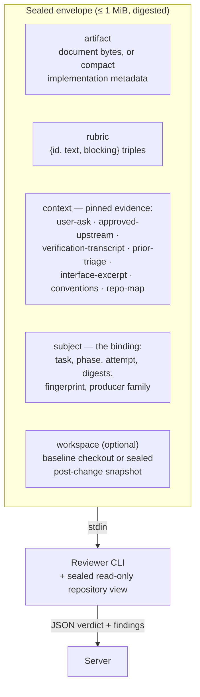
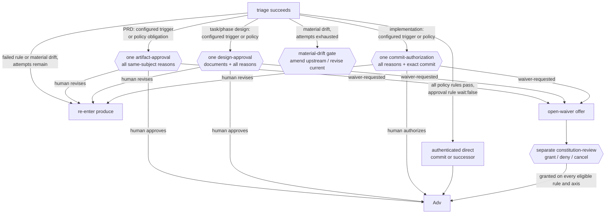

# review/COUNTER-REVIEW

**Explored:** 2026-08-27 · **Commit:** `7c19a5e` · **Covers:** `src/review/`, `src/dispatch/`, `src/contracts/mcp-tools.ts`, `src/contracts/semantic-workflow.ts`, `src/mcp/handlers/counter-review.ts`, `src/state/semantic-actions.ts`, `src/state/produce-subject.ts`, `src/state/evidence-results.ts`

Counter-review is the system's adversarial check: every artifact is reviewed by server-dispatched reviewers — by default configured per producer client (for example Claude Code runs Sol, Antigravity runs Sol and Fable in parallel with Gemini constitution adjudication, Codex runs Fable) — so the evidence is something the producer cannot author. One offered semantic `review` action reaches the direct handler seam and covers up to three or more parallel child dispatches: the configured rubric counter-reviewers (single or multiple running concurrently in parallel) and — only when the pinned constitution has active rules, a decision the server makes alone — the constitution review (see below). Semantic review owns the outer process FIFO across replay, dispatch, and commit; the direct inner seam never queues itself again. All reviewer children fly together: the constitution subject binds the review envelope's digest — sealed before any dispatch — rather than the review children's outputs, so all dispatches are enqueued as one FIFO link and run concurrently in parallel via `serializeDispatchAll`. Findings from multiple reviewers are merged with clean model-derived prefixes (such as `sol-` and `fable-`) and unique disambiguation, their verdicts combined, and their blocker counts summed into a single authoritative counter-review evidence document. This page covers the review envelope, the review flow, the constitution review, and waivers.

## The dispatch envelope

The control envelope is a single JSON document — serialized, hashed, and byte-capped at 1 MiB. It arrives on stdin with nothing prepended. Source bytes are not transported through that JSON: the server separately materializes the configured repository set as sealed, read-only snapshots. One repository preserves the historical `repo` cwd and binding arm; multiple repositories appear beneath `repos/<name>`, and citations use `<name>/<path>`. The envelope declares and binds every snapshot.

The shape is deliberately closed: field validation rejects any key not on the expected list, so free-form producer history and agent instructions are *structurally unrepresentable* in a review request. One piece of round history is deliberately representable — the `prior-triage` context kind carries the phase instance's carried triage history, but only because the server assembles it mechanically from retained triage and review manifests, never from producer-curated prose. The subject also names the durable `attempt` counter, so the reviewer knows it is looking at round N of the same phase instance. The envelope digest makes the input and resulting attestation reproducible as bytes; it does not claim that a fresh generative reviewer would produce the same judgment twice.

## Prior-triage context: stopping defect-class re-litigation

Every dispatch is a fresh reviewer with no memory, so without help round N tends to rediscover the defect class round N−1 already dispositioned — the same defect was once found four times in a real run. On re-entry the server pins a `prior-triage` entry: for each retained finding it includes the reviewer-authored ID, severity, blocking flag, summary, evidence, and suggested resolution, plus the producer's disposition, rationale, and revision intent. The fixed follow-up instruction changes the task from another open-ended audit to **remediation review**: verify accepted revision intents first, do not relitigate completed or rejected findings in variant form, and raise a previously undiscovered issue only when it carries a material downstream consequence.

**The retention boundary, honestly:** durable state (`authoritative_results`) keeps exactly one triage result per phase instance — installing a new one replaces the reference to the old, and unreferenced manifests are not durable authority. Each installed triage therefore carries a server-computed `disposition_ledger`: at install the round's dispositions are embedded with that round's reviewer-authored finding details — resolvable then, because the reviewed evidence is still the retained counter-review result — and the predecessor's ledger rides along. The pinned record is the current dispositions plus that carried ledger: every round of this phase instance whose triage installed, each entry stamped with its round's attempt number, the newest disposition winning a finding_id collision. Rounds whose triage predates the ledger or never installed are absent — absence is the accurate record, not a gap. Disposition strings render as-is, so a grown triage vocabulary (for example `accepted-editorial`) never breaks assembly. The ledger lives inside the triage evidence digest: durable authority assembled mechanically from retained manifests, never producer-curated prose.

## Material defects, not review volume

The production rubrics are server-owned config files under `assets/rubrics/` (`prd.yaml`, `design.yaml`, `implementation.yaml`), shipped in the install bundle and selected by durable phase kind (`prd`, design, or implementation). The server reads and strictly parses the selected file fresh on every review and status call — no rebuild is needed for an edit to take effect once the bundle is installed — and a missing or invalid file fails the review closed with `CONFIG_INVALID`, naming the file. Each file's `rubric_id` is cross-checked against its phase kind and excluded from the digest, which covers exactly the schema version, kind, mode, and ordered criteria. Full status publishes the selected rubric, ID, and digest for same-side non-durable review; the durable counter-review handler independently loads the same policy and binds its digest into the input fingerprint and review evidence, so a rubric edit between two steps of an in-flight task fails that task's next review-cycle step closed. Skills still carry no rubric copies, and callers cannot substitute one in an MCP request.

The production rubrics use one consequence-based standard across initial and remediation reviews:

- **A finding needs a material consequence.** Leaving the artifact unchanged must be reasonably likely to change a downstream decision, behavior, verification result, delivery outcome, or important risk. A preference, possible enhancement, or residual imperfection is not a finding.
- **Ambiguity is material only when reasonable readers diverge materially.** More specific prose is not automatically better. Wording blocks when it permits materially different reasonable implementations or acceptance outcomes.
- **Remediation review has a primary and secondary task.** First verify every accepted revision intent. Second, catch a newly introduced or previously undiscovered defect only when it clears the same materiality bar. This escape hatch keeps a terrible new issue actionable without turning every fix into another general search for improvements.
- **Non-material output is suppressed, not deferred to the human.** Optional polish, harmless wording refinements, stylistic preferences, and completeness suggestions do not become a gate backlog. Deterministic-tool territory — formatting, lint, type-checking, naming, import order — is never a finding. Structured review and triage evidence remains embedded in the current durable result manifest; Markdown renderings are disposable cache, not permanent outputs.
- **Evidence gaps are proportional.** `unverifiable-claims` reports a gap only when missing evidence prevents a material judgment; explicit assumptions remain under `stated-assumptions`.
- **Test quality and shortcuts are first-class material defects.** The implementation rubric carries dedicated blocking criteria: `test-quality` (a suite that would not fail if a required behavior regressed — tautological or change-detector tests, double-replaced assertions, removed or weakened guards) and `anti-shortcut` (the appearance of success on the change path — stubs, silently narrowed scope, swallowed failures, hardcoded expected values or special-cased outputs).
- **Reviewer uncertainty is surfaced, never guessed.** `reviewer-confidence` records a non-blocking `escalate-` finding when a material judgment cannot be made with confidence; the producer dispositions it with a written rationale and presents it in full at the next human boundary this phase reaches.
- **Phase-boundary findings use the same materiality bar.** A reviewer may challenge a split, merge, or sequence when it makes a repository-ready outcome, stable predecessor input, valid completion state, or understandable verification story materially worse. Numeric preferences, file-count rules, phase-count targets, layer boundaries, and the fact that a design contains several work chunks are not defects by themselves. Broad, small, and genuinely open-ended plans are acceptable when their concrete exception value is explained.

The honest limit remains: `prior-triage` reaches back exactly one round. The protocol reduces serial rediscovery by narrowing later work to remediation and material regressions; it does not make generative judgment deterministic.

## Pinned context: evidence, not narrative

"Pinning" means the **server itself** reads the evidence bytes from an immutable, authenticated source and records their SHA-256 — never the model, never a summary. Each context entry declares its status so no gap is silent:

- `pinned` — full bytes plus digest.
- `truncated` — a bounded head plus the full-file digest and byte count.
- `unavailable` — a named gap the server could not fill.
- `omitted-cap` — dropped to fit the byte cap; digest retained.

The policy split is the key idea: absence that **contradicts durable authority** (the PRD's declared ask drifted; an upstream lost its approval; bytes don't match the retained projection or parent-document binding) **fails closed** — no review happens. Document reviews authenticate their selected file against the retained result projection. A task-design review additionally authenticates the `prd.md` projection in that result; a phase-design review authenticates both `design.md` and `prd.md`. The reviewer and later approval therefore judge the complete document set rather than a primary file beside unbound parent edits. Implementation reviews authenticate `impl-notes.md` against the retained implementation output's parent-document digest, while declared changed files come from that result's retained projection plan. When implementation also changes the PRD, task design, phase design, or log, those task paths are retained outputs and their exact current bytes become `co_produced_documents` in the authenticated implementation review subject; both review children see them, while unchanged upstreams remain separately pinned to their approved owner. If that approved owner is a compound planning result, its other projections are still authenticated together except for paths the implementation now co-produces: the current implementation owns those bytes, so a surviving sibling binding cannot reintroduce the owner's superseded projection. Every other gap becomes a named `unavailable` entry, which the rubric's non-blocking `unverifiable-claims` criterion turns into a finding. Findings prefixed `unverifiable-` mean "the reviewer lacked evidence," and triage must *reject* them with an `envelope-gap:` rationale — the fix for recurring gaps is better envelope assembly (or the reviewer's repo access), never pinning more bytes in.

When the cap is hit, droppable context is replaced lowest-priority-first (`repo-map`, then `conventions`, then `interface-excerpt`, then `prior-triage`). The user ask, approved upstreams, and verification transcript are never droppable — if they don't fit, the review fails closed.

For implementation subjects, the raw transcript lives only at ignored `.archflow/runtime/tasks/<task>/cache/phases/<n>/verification.txt`. `ImplementationOutputV1.verification_evidence` binds its SHA-256 digest and byte count into durable authority. Envelope assembly verifies those bytes before review; after phase advancement the raw transcript may be removed without weakening already-approved authority. If it disappears during an uncommitted active step, status asks for a rerun rather than invalidating an earlier phase.

## The sealed implementation snapshot

An implementation envelope carries the compact `ImplementationOutputV1`: baseline commit, declared operations and paths, snapshot and diff identities, verification binding, and undeclared-change report. It carries neither whole source files nor generated diffs. Source size therefore does not consume the 1 MiB control-envelope budget.

Before either child runs, `workspace.ts` archives every plan member at its exact commit. Primary snapshots remove `.archflow/tasks`; secondaries remove `.archflow` entirely. For an implementation, it applies every authenticated retained primary after-image, deletion, rename endpoint, symlink, and executable mode. A secondary without an authenticated implementation section stays commit-only context at observed HEAD, even if configured `writable`. The child starts in these snapshots and navigates with read-only tools.

The workspace declaration binds the baseline and declared snapshot digest; the review subject already binds the complete retained implementation artifact. Materialization omits retained `.archflow/tasks` projections just as it removes those paths from the baseline, while rejecting path escape, symlink-parent traversal, and file/directory collisions. This matters for implementation results that also retain their tracked implementation log: the log remains authenticated workflow evidence but is not repository source exposed to the child. The temporary archive has no `.git`, so removed task blobs and unrelated worktree edits are unreachable.

The 1 MiB cap remains a control-plane safeguard. An overflow now means compact declarations, co-produced governing documents, or mandatory pinned context are themselves excessive; it is not evidence that ordinary source files are too large. A phase split is a product/design judgment about review scope, not an automatic response to source transport size.

## The flow, end to end

1. **Produce** — the artifact is recorded durably; its digest becomes the subject digest.
2. **Counter-review call** — one offered `review` action reaches the direct seam, with the artifact, subject, and pinned transcript derived entirely from durable authority. The server selects the rubric. Everything through step 6 happens inside this one call.
3. **Server assembles** the review material (document text or compact implementation metadata), pins context (failing closed on authority violations), and seals the envelope under the cap. Document reviews receive a checkout at HEAD. Implementation reviews receive the attested base tree with the retained after-images applied, producing the exact post-change snapshot.
4. **Rubric dispatch** — the selected reviewer CLIs run headless in parallel (see `../mcp/DISPATCH.md`); each child output is parsed and bound to its provenance (adapter, CLI version, actual route including provider, route source, envelope digest). Selection is independent per role: a human one-dispatch override wins over invocation-declared routing, which wins over producer-specific config (`producers.<host>`), which wins over top-level fallback config. When multiple counter-reviewers are configured, they execute concurrently in parallel and their outputs are combined into one merged counter-review evidence document.
5. **Constitution dispatch** — when the pinned constitution has active rules, the server dispatches a reviewer child (running concurrently alongside the rubric reviewers) that performs the constitution and drift review (see below). The child returns only its per-rule and per-upstream judgments. The server deterministically derives the constitution, drift, matched-trigger, and uncertain-trigger summaries before attestation, so redundant model-authored rollups cannot contradict those judgments. The server alone decides whether this runs; with no active rules the drift check is also skipped and the result records `constitution: {status: "not-run", reason: "no-active-constitution-rules"}`, which is normal.
6. **Currency re-check and commit** — after all children return, the server re-authenticates the artifact/projection, repository-set digest, identity continuity, and every HEAD pin. Any drift discards the products (`counter-review-subject-not-current`). Otherwise both results land in **one atomic state transaction**, each carrying the ordered repository name, identity, and commit pins. A `fail` verdict is a successful recording, never an error.
7. **Triage** — the producer accepts material defects and rejects output without a concrete material consequence. Any accepted finding forces re-entry into produce with a new attempt; the next reviewer receives the enriched `prior-triage` record and performs remediation review. Rejecting even a model-labeled blocker is sanctioned because severity does not substitute for evidence. Triage covers rubric findings only — the constitution verdict is never dispositioned by the producer; a failing or triggering verdict surfaces as a human gate after triage.
8. **Rule settlement, then targeted authority** — the triage-settle transaction records what project `approval_rules` evaluated for the exact subject at clean and foldable policy-adjudication fixed points. Every fresh ordinary gate binds that exact settlement and frozen conclusion in `approval_trigger`, then adds all policy findings and exact eligible waiver pairs over the same subject. Task and phase design present their compound document sets; PRD uses `artifact-approval`; implementation uses `commit-authorization`. For implementation content rules, settlement freezes every matching path. Presentation joins that path set to retained output to reconstruct each operation and exact signed byte delta. Rename endpoints are matched independently, and overlapping effects such as renaming away and then adding at the old path remain separate, deterministically ordered evidence instead of being collapsed into a lossy path set. The semantic operation/size `details` remains complete even when bounded archive prose elides paths. Later config edits may appear as an informational notice but cannot rewrite authenticated reasons. A `wait:false` settlement can instead produce direct milestone, commit, or successor authority only when no matching ordinary human approval exists; approval always takes precedence in recovery and proof consumers. After a requested change, simple wording or formatting binds the prior archived decision plus predecessor/final subject digests in the alternate reapproval trigger, always returns for approval, and never clears an accepted material finding. Significant changes archive prior evidence, reset to attempt 1, and automatically dispatch fresh reviews. Uncertainty is significant; the human may override the classification in either direction.

Step 3 re-reads two things from the worktree rather than taking them from retained bytes: the document the subject itself recorded (the implementation log, or the design document being reviewed) and the approved planning documents upstream of it. Both are re-hashed against the digests durable authority recorded, and a mismatch refuses the dispatch — a review transcript must not be pinned to bytes no recorded result covers. That refusal used to be a dead end whenever the change was one a human had already accepted as the new baseline for its path: a baseline adoption re-answers *which bytes are authoritative for a path*, which is a different question from *what did this result record*, so the drift finding went quiet while the dispatch stayed impossible. Status now checks these documents itself while a review is still owed and offers the move that actually clears them — re-recording the phase's own result over the current bytes, or putting an upstream document's recorded bytes back. See `../state/DURABLE-STATE.md`.

The same distinction applies after a milestone. Proving the exact authorized commit in first-parent history does not review any later descendant, and adopting current projected bytes does not refresh the retained review. If milestone proof is missing but a real delta can be produced, the server's recovery action invalidates old active authority and sends the same owner through fresh significant production and automatic review. Governing planning bytes likewise cannot be adopted into successor authority; they are restored or reviewed again by their owner.

If a dispatch dies mid-flight, the position stays at `counter_review: running` and the next `review` action re-runs only step 4 onward: the entry boundary is already installed, and the state machine has no running-to-running edge that would let it be recorded twice. That resumption does not require the review's own entry transition to still be the newest one in `state.json`. A human decision — a baseline adoption, say — can legally land while the review sits there and overwrite that single slot, and the review still resumes with a real dispatch rather than being stranded. See `../state/DURABLE-STATE.md` for the slot itself.

A classified selection or dispatch failure also writes one compact latest-failure observation for the current phase instance and attempt under ignored runtime. It contains only a bounded server-authored message, role, project error code, selected model/effort/provider when available, route source, and exact-current state binding. Status projects it only while task, phase, `counter_review/running`, attempt, and revision all match. It never consumes an attempt, changes state, authorizes a retry or gate, mints evidence, or replaces the original returned error; malformed, stale, terminal, or missing records are ignored. The existing random forensic attempt record remains separate and may contain local channel tails that never enter semantic status.

## Invocation-declared routes

All four producing skills may declare either reviewer role for one run. The public semantic invocation calls the member `review_routes`; the internal counter-review request calls the copied member `invocation_routes`. Both are included in their respective offer/operation or request digests, but neither changes the reviewed-subject input fingerprint: routing chooses who judges the same bytes. Semantic review continuation always re-derives the routes from the original invocation, including significant revisions, rather than caching a one-shot submission.

Selection is role-local and ordered: `route_override → invocation_routes → phase/base configured route`. An omitted invocation role therefore falls back independently. Evidence from every fresh dispatch records the actual adapter, family, model, effort, optional provider, and `route_source`. Invocation selection is labeled `invocation-declared` and records the raw configured route it displaced when one existed; it is not human- or controller-authenticated. Archived evidence without these new optional compatibility fields remains readable.

## Route overrides, for outages

The task's routing config is freely editable and reported through `config_change`, but editing project policy is the wrong tool for one reviewer outage: it persists beyond the failed call and affects later dispatches. Without a per-dispatch escape hatch, a logged-out or rate-limited reviewer CLI still forces either a lasting config edit or a stranded task.

So a dispatching semantic `review` offer optionally accepts a `review-dispatch` submission carrying `route_override`: a substitute `{model, effort, provider?}` for the counter-reviewer, the adjudicator, or both, plus the human's nonempty `reason` for it. The offer and submission digest bind that declaration to the request and review operation. It applies to that dispatch and nothing else — invocation and `config.yaml` are untouched, the next fresh review selects its normal invocation/config route again, and a role the override does not name keeps its invocation selection or configured fallback.

Two things keep this honest rather than a way around the reviewer:

- **A substitute is validated exactly like a configured route.** Same model-name rules, same family derivation, same cc-switch `provider` restriction, same per-adapter effort support. An override cannot express a route the config could not.
- **The deviation is recorded with the evidence.** Evidence produced under an override uses `route_source.provenance = route-override`, carries the reason, records the actual provider when present, and identifies the raw normally selected invocation/config route plus its source as displaced context. The separate override record also includes the configured route facts (including provider) pinned for the request. Rendered evidence keeps route source and human override as distinct sections.

Choosing a substitute is the human's call, not the agent's. The agent's job when a dispatch fails on an outage is to say so plainly and ask; it never picks a different reviewer on its own to get past a failure. This is a policy deviation, not a trust-boundary one — reviewer families were already recorded rather than enforced (`../mcp/DISPATCH.md`), so a substitute reviewer is the same *kind* of choice as configuring a same-family one, just made later and for a stated reason.

Editing the artifact changes its digest, which invalidates downstream evidence. You iterate until the remediation review finds no material defect worth accepting; non-material suggestions do not prolong the loop or move to the human approval agenda.

## Constitution review

The constitution review judges the artifact against the repository's **constitution** — the versioned policy rules in `.archflow/constitution/`, pinned per task at a human-approved commit — and checks for drift against the approved upstream documents. It is *not* "reviewer A vs reviewer B" arbitration; disagreements between reviews are resolved by triage. It runs inside the same review action as the rubric review, as a second sequential dispatch, and only when the pinned constitution has active rules — the server decides, never the agent.

Each numbered Markdown file in `.archflow/constitution/` is exactly one rule: frontmatter carries a stable `id`, a `version`, a `status`, and an optional `review_trigger` — the rule's own human gate, a condition under which the repository wants a person to decide at once; the shipped defaults declare three (below) — and the prose body is the normative text. Rule IDs are append-only — content changes bump the version, deprecation replaces deletion. The eight shipped rules are a good summary of the product's values:

- **`explicit-human-authority`** — silence, elapsed time, agent prose, or a model verdict never supplies approval; the server enforces this at its gates, so an artifact complies unless it asserts or relies on a human decision the workflow never recorded.
- **`approved-design-before-code`** — implementation starts only from an approved phase design; a result that departs from its own phase design updates it in the same reviewed result, a change to the architecture design or PRD is made in the same result and decided by the project's approval rules, and a departure from an approved upstream is reported as a drift finding rather than a failure of the rule.
- **`prefer-established-libraries`** — prefer mature, widely-adopted, and actively-maintained libraries over custom implementations for common domain problems; custom authoring requires explicit architectural justification, and unmaintained or obscure single-user packages must not be introduced.
- **`task-and-evidence-isolation`** — tasks are isolated; stale, mismatched, cross-task, or partial evidence fails closed.
- **`honest-human-centered-outcomes`** — failures and dead ends stay visible non-success states with a safe next action, never silently bypassed.
- **`human-approval-for-access-control`** — a trigger rule: adding or changing authentication, authorization, or permission-decision logic asks a human at once, because a defect grants access silently.
- **`human-approval-for-crypto-and-secrets`** — a trigger rule: changing cryptographic primitives or key and credential handling asks a human at once, because incorrect use can look correct while destroying confidentiality or authenticity.
- **`human-approval-for-workflow-control-plane`** — a trigger rule: editing `.archflow/workflow.yaml`, `.archflow/config.yaml`, or `.archflow/constitution/` asks a human at once, because the authority files are the trust boundary every task pins its policy from.

A task-branch constitution edit does not change the rules governing that task. Counter-review continues against the immutable constitution pinned at task initialization; mutable or later committed policy bytes are never substituted into the constitution envelope. Because a commit names an immutable tree, the server reads the pinned constitution from the policy-base commit once per process per worktree and commit and reuses that resolution; a failed resolution is never reused. The policy edit may travel as an ordinary reviewed implementation output and becomes available to future tasks only when their approved policy base includes it.

The constitution-review child gets its own sealed envelope — the artifact, sorted active rules, approved upstream documents, fixed instructions, and the same workspace binding used for rubric review. For implementations it therefore judges policy and drift against the exact post-change repository snapshot without duplicating source bytes in JSON. The instructions require one finding for every supplied rule and every supplied upstream, and they tell the reviewer how to judge a trigger: `matched` needs direct evidence in the artifact, its co-produced documents, or the snapshot; workflow mechanics the server owns (gate authority, approvals, commits, dispatch outcomes) are never trigger evidence; a rule with no `review_trigger` is always `not-matched`. Those finding arrays are semantic sets, so the server canonicalizes their order before validation and storage; missing, duplicate, invented, or contradictory entries still fail closed. Invalid output is reported with a safe structural category (for example upstream coverage, duplicate findings, unexpected fields, or an authority-binding mismatch) rather than exposing the rejected response or collapsing every cause into one opaque code. Before dispatching, the server is unusually strict: durable state, the pinned constitution digest, the authenticated review set, and the phase-appropriate durable approval for every declared upstream (`artifact-approval` for PRD, `design-approval` for current design documents, with legacy design archives still accepted) must all agree, or nothing is dispatched.

The output is cross-checked mechanically: one finding per active rule, in ID order, matching versions.

After triage, status and request construction read the adjudication evidence from its retained `adjudication-evidence` artifact wrapper. The wrapper is durable result metadata, not the evidence itself; approval presentation unwraps it before folding rule findings and never treats the outer artifact as reviewer output.

A rule may also declare `enforced_by` — labels naming where the rule is mechanically enforced in the repository, such as a test suite. These travel to the child as *context for its judgment*, nothing more. They are deliberately not something the reviewer reports back on, and a rule that declares them is judged exactly like a rule that does not.

That was once the opposite, and the reason is worth recording. The reviewer used to be instructed to report a per-mechanism evidence state for each declared label, even though those labels are names rather than executable proofs and document reviews may expose no relevant implementation. So a rule declaring `enforced_by` could never reliably be reported `pass`; it was permanently `uncertain`, and every review of every artifact opened a human gate carrying no information. Declaring where a rule is enforced made it strictly impossible to satisfy. The instruction and the mechanism reporting are both gone.

### What the verdict opens

A matched `review_trigger` demands human authority at once — through the ordinary gate flow, **after triage**, never dispositioned by the producer. A failing or uncertain rule and material upstream drift are the producer's to resolve first: the fixed point re-enters production with the findings named in the revise offer, and only when the attempt budget is spent do they reach the same gate (where a human may also waive a rule the reviewer misjudged):

Compliance ("did the subject violate this rule") and trigger ("does this rule's `review_trigger` condition apply here") are different judgments that routinely share one root cause. The review retains both axes, but they route differently: a compliance failure is agent work until attempts run out, while a matched trigger is the constitution asking for a human now. Whichever opens the gate, both findings fold into the phase's ordinary gate over the same subject. That context also carries the configured trigger and exact eligible rule/axis pairs, so a PRD, design, phase design, or implementation produces one decision boundary rather than a policy prompt followed by ordinary approval. The ordinary decision may approve, request revision, reject/abort, or redirect to waiver; `waiver-requested` itself grants no authority.

Material drift keeps its own gate because it concerns a different subject — an approved upstream document — and its human choices differ (amend the upstream, revise the current work, or stop). It opens only after the producer's attempts are spent; before that, the revise offer names the drifted document and the affected claims so the producer can update the governing document it owns (a phase implementation owns its phase design; a change to the architecture design or PRD then meets the project's approval rules) or bring the work back in line. The gate stays serialized behind the constitution decision when both open.

Status derives the pending gate. A skill-authored `gate-summary` opens the current presentation—title, summary, direct question, material evidence, labeled choices, and structured `{class,text}` reasons. The archived ordinary request's `approval_trigger` supplies configured subject/content provenance or the durable simple-revision return; its policy findings supply exceptional reasons. Live config and the caller summary cannot rewrite them, and any exceptional reason dominates the aggregate class. After presenting those words and receiving one human answer, the offered decision action archives the selected token and `{reason}` immutably and settles the gate in a separate substep; a stale or superseded subject is rejected rather than approved, and a retried call replays the archive without recording the decision twice. Distinct remedies such as material drift, exhaustion, migration audit, and the waiver decision remain separately serialized because they govern different subjects or actions.

### Waivers

A waiver is a durable, human-granted exemption from **one specific rule version**, for **one specific subject digest**, under one specific scope, lasting only until the task completes. The semantics are exact-match: change the artifact and the subject digest changes, so the waiver evaporates; bump the rule version and it evaporates.

A waiver also names **one axis**: `adjudication-failure` exempts the rule's compliance verdict, `review-trigger` exempts its matched trigger. Waiving one says nothing about the other, so a gate that flagged a rule on both axes is satisfied by the waiver path only when both are granted.

Waivers are requested from an existing ordinary gate, never conjured: a fresh origin must be `artifact-approval`, `design-approval`, or `commit-authorization`, and its recorded decision must literally say `waiver-requested` while naming a rule and axis pair offered in `eligible_waivers`. The server re-reads and re-authenticates the exact gate, subject, evidence set, decision, rule, and axis before binding the waiver. The normal path applies the separate no-submission `open-waiver` offer and freshly writes a waiver-context `constitution-review` gate with grant, deny, and cancel choices. A grant is separate human authority; `waiver-requested`, denial, and cancellation grant nothing. Historical policy-obligation `constitution-review` requests remain archive-only, but an archived one that offered and recorded `waiver-requested` remains a valid compatibility origin so a human choice made under the old interface does not become unusable.

### Durable decisions

Both gates and waivers funnel into the same machinery (`src/state/gates.ts`): each gate writes an immutable request and decision record under `authority/decisions/<gate-id>/`, bound to the gate ID, context digest, subject digest, phase, and the current evidence set, with human provenance on the decision. On the normal bounded path that provenance is minted only from an authenticated connected-host invocation, binding the connection and canonical transport request identity; an agent cannot self-assert it in the payload. Task state holds only *references* to approvals and waivers — any later code that wants to rely on one re-reads and re-validates the underlying documents, and the resulting authenticated object can only be minted by that verification (it cannot be hand-constructed). Supersession is honest: if the subject changed after preview or under an open gate, the resolver refuses to approve stale bytes and the workflow re-enters the pipeline. The human-facing gate UI is reconstructed under ignored runtime from that durable request and deleted only after the selected decision has been archived.

## Human-facing gates

The durable request remains exact and machine-verifiable, but it is not what the human is asked to read. The server derives a reconstructible presentation with a plain title and summary, the material finding or evidence, one direct question, labeled choices, a structured reason list, and an aggregate `configured-approval | exception` class. Every ordinary presentation includes the authenticated configured and policy reasons that apply; one exceptional reason makes the whole boundary exceptional. Content operation/size details stay tied to frozen settlement plus retained output, and a legacy request without trigger provenance gets a deterministic exceptional fallback rather than a guess. Skills present this conversationally and keep gate IDs, digests, JSON, internal paths, and protocol codes in the diagnostic layer unless the user asks for them.

There is no separate or optional gate counter-review. The server-dispatched review already ran automatically in the normal evidence pipeline. A simple human revision can reuse that evidence for one hop because it changes no meaning, but it cannot resolve or suppress an accepted material finding and always returns for approval of the final bytes. A significant revision automatically repeats the normal review because the prior judgment is no longer current.

## Exact trees across repositories

An implementation review maps each authenticated retained section back to the one configured repository member with the same name and identity. Every changed writable member is materialized at its declared base plus retained after-images; unchanged writable and context-only members remain pinned at HEAD. The final currency check reopens the session and revalidates membership, identity, bases, HEAD pins, and retained proposed bytes after all children return.

Every fresh server-attested review records the repository pins it saw (`repositories[]`, one entry per member, `primary` alone for a single-repository task); evidence archived before repository sets existed has none and stays readable. The pins are display only: status compares them with live HEADs so a human can see that reviewed context moved, but a context-only member changing after review never stales the evidence or reopens its gate — only the reviewed subject and writable after-images bind authority.

Content globs match each repository's own repository-relative path and run independently in each changed section: `**/*.sql` matches SQL in any writable repository, while a rule like `apis/src/**` does not address a secondary by name. Durable matches retain secondary attribution structurally; human presentation uses `<repository>/<path>` only as display text. One gate or no-wait settlement covers the combined reviewed subject and yields primary-first, ordinal-secondary commit facts.
