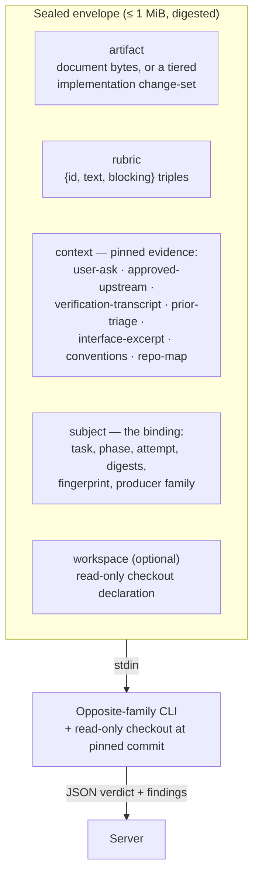

# review/COUNTER-REVIEW

**Explored:** 2026-08-10 · **Commit:** `50a218d` · **Covers:** `src/review/`, `src/state/produce-subject.ts`

Counter-review is the system's adversarial check: every artifact is reviewed by the *opposite model family* (Claude ⇄ Codex), dispatched by the server itself so the evidence is something the producer cannot author. This page covers the review envelope and the review flow; adjudication and waivers are in `ADJUDICATION.md`.

## The dispatch envelope

The envelope is a single JSON document — serialized, hashed, byte-capped at 1 MiB — that is the *entire* input to the reviewing child. It arrives on stdin; nothing else is prepended.

The shape is deliberately closed: field validation rejects any key not on the expected list, so free-form producer history and agent instructions are *structurally unrepresentable* in a review request. One piece of round history is deliberately representable — the `prior-triage` context kind carries the previous round's triage record, but only because the server assembles it mechanically from retained triage and review manifests (reviewer-authored findings and their recorded dispositions), never from producer-curated prose. The subject also names the durable `attempt` counter, so the reviewer knows it is looking at round N of the same phase instance. The envelope digest makes the review a reproducible attestation about exactly those bytes.

## Prior-triage context: stopping defect-class re-litigation

Every dispatch is a fresh reviewer with no memory, so without help round N tends to rediscover the defect class round N−1 already dispositioned — the same defect was once found four times in a real run. On re-entry the server pins a `prior-triage` entry: for each prior finding, its `finding_id`, severity, blocking flag, and summary (all reviewer-authored, from the retained review evidence), plus its disposition and the recorded revision intent or rejection rationale (from the retained triage manifest). Whenever this entry is present, the envelope adds one fixed instruction literal: already-dispositioned findings must not be re-raised in variant form — a reviewer who thinks a prior disposition was wrong challenges it by naming its `finding_id`.

**The retention boundary, honestly:** durable state (`authoritative_results`) keeps exactly one triage result per phase instance — installing a new one replaces the reference to the old, and unreferenced manifests are not durable authority. So the pinned record covers only the *immediately preceding* round, which is also the round whose accepted findings the current attempt is answering; earlier rounds are superseded and deliberately not reconstructed. The record does not carry the historical attempt number of that prior round either — durable state never recorded it — only the current attempt (in the subject and in the record) is authoritative. Attempt 1, or a retry that never reached triage, pins nothing: absence is the accurate record. Disposition strings render as-is, so a grown triage vocabulary (for example `accepted-editorial`) never breaks assembly.

## The materiality bar: why review converges

The rubric is not a server asset — it is a JSON literal in each skill's markdown, and the server validates only its shape. That is where convergence pressure lives, because the loop's exit condition is a triage judgment (see `../workflow/LIFECYCLE.md`), not a finding count.

Three rubric clauses do the work, added after a real PRD session spent three xhigh dispatches converging on a document that was decision-ready after one:

- **`substantive-correctness` carries a materiality bar.** A blocking finding must name the concrete consequence of shipping the artifact unchanged, and that consequence must survive the artifact's *own* stated non-goals and priority order. "Requires producer action" alone is true of every refinement, which is why it never terminated.
- **Challenges are qualified.** The envelope invites a reviewer to challenge a prior disposition by naming its `finding_id` — the right escape hatch, but unqualified it produced a chain where each round challenged the previous round's accepted fix. A challenge is blocking only if the recorded revision intent was not carried out, or the fix introduced a *new* defect. A residual weakness left by a fix that did what it said is advisory.
- **`unverifiable-claims` no longer fires on stated assumptions.** A scope choice the artifact explicitly records as an assumption is covered by `stated-assumptions`; an envelope gap is for something asserted as established fact that no pinned evidence can confirm. Each distinct gap is reported once, and a gap already named in the pinned prior-triage record is not re-raised.

The honest limit: `prior-triage` reaches back exactly one round (see the retention boundary above), so these clauses shrink the class at the source rather than relying on the reviewer remembering every prior rejection.

## Pinned context: evidence, not narrative

"Pinning" means the **server itself** reads the evidence bytes from an immutable, authenticated source and records their SHA-256 — never the model, never a summary. Each context entry declares its status so no gap is silent:

- `pinned` — full bytes plus digest.
- `truncated` — a bounded head plus the full-file digest and byte count.
- `unavailable` — a named gap the server could not fill.
- `omitted-cap` — dropped to fit the byte cap; digest retained.

The policy split is the key idea: absence that **contradicts durable authority** (the PRD's declared ask drifted; an upstream lost its approval; bytes don't match the retained projection) **fails closed** — no review happens. Every other gap becomes a named `unavailable` entry, which the rubric's non-blocking `unverifiable-claims` criterion turns into a finding. Findings prefixed `unverifiable-` mean "the reviewer lacked evidence," and triage must *reject* them with an `envelope-gap:` rationale — the fix for recurring gaps is better envelope assembly (or the reviewer's repo access), never pinning more bytes in.

When the cap is hit, droppable context is replaced lowest-priority-first (`repo-map`, then `conventions`, then `interface-excerpt`, then `prior-triage`). The user ask, approved upstreams, and verification transcript are never droppable — if they don't fit, the review fails closed.

## The tiered change-set rendering

Implementation reviews can't always embed whole files, so the artifact uses a three-tier ladder (in `src/state/produce-subject.ts`):

| Tier | When | What ships |
|---|---|---|
| `embedded` | both sides ≤ 32 KiB | whole files — full context is where diff-invisible findings come from |
| `unified-diff` | larger UTF-8 text | hand-rolled Myers diff with 40 context lines (generous on purpose — it approximates full-file review) |
| `digest-only` | generated files (`linguist-generated`), lockfiles, non-UTF-8 | digest + byte count only |

The diff is hand-rolled (`src/review/line-diff.ts`) because the runtime dependency set is frozen by release policy and shelling out to `diff` would break the renderer's deterministic, in-memory character. Every non-embedded entry still names its exact bytes by digest, so nothing is silently elided.

If the envelope still overflows after tiering and cap relief, the result is `ENVELOPE_OVERFLOW` naming the five largest contributors. The intended human reading: a generated path belongs in `.gitattributes`; a hand-written one means the phase is too big for one sealed review pass and should be split at the design gate. There is deliberately no chunked multi-dispatch fallback — one subject, one attestation.

## The flow, end to end

1. **Produce** — the artifact is recorded durably; its digest becomes the subject digest.
2. **Counter-review call** — `archflow_counter_review` with the artifact path, rubric, and fingerprint.
3. **Server assembles** the review material (document text or tiered change set), pins context (failing closed on authority violations), seals the envelope under the cap, and materializes the read-only checkout — HEAD for documents, the attested `base_commit` for implementations (the reviewer sees the pre-change tree; changes travel only in the envelope).
4. **Dispatch** — the opposite-family CLI runs headless (see `../mcp/DISPATCH.md`); output is parsed and bound to its provenance (adapter, CLI version, route, envelope digest).
5. **Currency re-check** — if the artifact drifted mid-dispatch, the result is discarded (`counter-review-subject-not-current`).
6. **Commit** — the evidence lands in a state transaction. A `fail` verdict is a successful recording, never an error.
7. **Triage** — the producer dispositions every finding; any accepted finding forces re-entry into produce with a new attempt (capped, default 3). Rejecting a finding — including a blocking one — is a sanctioned disposition that lets the loop advance, which is what makes the materiality bar below effective. The next round's reviewer then receives this triage record as pinned `prior-triage` context and the new round number in the subject's `attempt`.
8. **Adjudicate** — see `ADJUDICATION.md`.

Editing the artifact changes its digest, which invalidates all downstream evidence — that currency rule (enforced by `src/review/fixed-point.ts`) is what makes the loop converge honestly. You iterate until produce, counter-review, triage, and adjudication all agree about the same bytes with no accepted findings.

## Gate counter-reviews

Separately from the pipeline, every human gate offers a ready-to-run counter-review recipe for the *other* client — a second terminal, a fully pinned prompt, and `archflow-local gate-counter` to ingest the result after verifying it binds the archived gate request field-for-field. Whether to run it is always the human's decision; the agent's job is only to offer it honestly.
