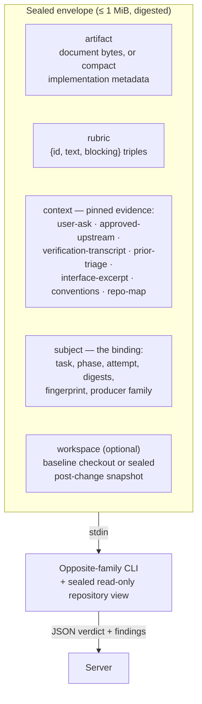
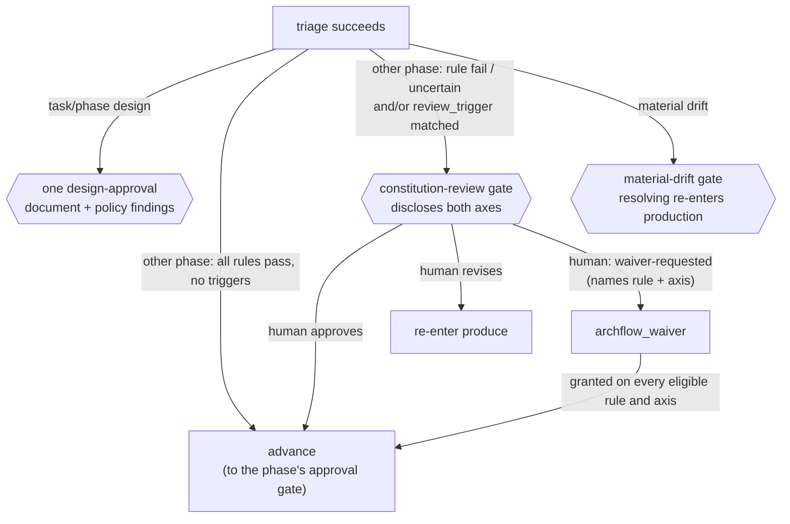

# review/COUNTER-REVIEW

**Explored:** 2026-08-13 · **Commit:** `66c4c9b` · **Covers:** `src/review/`, `src/state/produce-subject.ts`, `src/state/evidence-results.ts`

Counter-review is the system's adversarial check: every artifact is reviewed by a server-dispatched reviewer — the producer's *opposite model family* by default (the shipped template's choice), either family by explicit config — so the evidence is something the producer cannot author. One `archflow_counter_review` call covers up to two dispatches: the rubric counter-review, and — only when the pinned constitution has active rules, a decision the server makes alone — the constitution review (see below). This page covers the review envelope, the review flow, the constitution review, and waivers.

## The dispatch envelope

The control envelope is a single JSON document — serialized, hashed, and byte-capped at 1 MiB. It arrives on stdin with nothing prepended. For implementation reviews, source bytes are not transported through that JSON: the server separately materializes the authenticated retained output as the child's sealed, read-only working directory. The envelope declares and binds that workspace.

The shape is deliberately closed: field validation rejects any key not on the expected list, so free-form producer history and agent instructions are *structurally unrepresentable* in a review request. One piece of round history is deliberately representable — the `prior-triage` context kind carries the previous round's triage record, but only because the server assembles it mechanically from retained triage and review manifests, never from producer-curated prose. The subject also names the durable `attempt` counter, so the reviewer knows it is looking at round N of the same phase instance. The envelope digest makes the input and resulting attestation reproducible as bytes; it does not claim that a fresh generative reviewer would produce the same judgment twice.

## Prior-triage context: stopping defect-class re-litigation

Every dispatch is a fresh reviewer with no memory, so without help round N tends to rediscover the defect class round N−1 already dispositioned — the same defect was once found four times in a real run. On re-entry the server pins a `prior-triage` entry: for each retained finding it includes the reviewer-authored ID, severity, blocking flag, summary, evidence, and suggested resolution, plus the producer's disposition, rationale, and revision intent. The fixed follow-up instruction changes the task from another open-ended audit to **remediation review**: verify accepted revision intents first, do not relitigate completed or rejected findings in variant form, and raise a previously undiscovered issue only when it carries a material downstream consequence.

**The retention boundary, honestly:** durable state (`authoritative_results`) keeps exactly one triage result per phase instance — installing a new one replaces the reference to the old, and unreferenced manifests are not durable authority. So the pinned record covers only the *immediately preceding* round, which is also the round whose accepted findings the current attempt is answering; earlier rounds are superseded and deliberately not reconstructed. The record does not carry the historical attempt number of that prior round either — durable state never recorded it — only the current attempt (in the subject and in the record) is authoritative. Attempt 1, or a retry that never reached triage, pins nothing: absence is the accurate record. Disposition strings render as-is, so a grown triage vocabulary (for example `accepted-editorial`) never breaks assembly.

## Material defects, not review volume

The production rubrics are immutable server assets selected by durable phase kind (`prd`, design, or implementation). Full status publishes the selected rubric, ID, and digest for same-side non-durable review; the durable counter-review handler independently selects the same policy and binds its digest into the input fingerprint and review evidence. Skills no longer carry rubric copies, and callers cannot substitute one in an MCP request.

The production rubrics use one consequence-based standard across initial and remediation reviews:

- **A finding needs a material consequence.** Leaving the artifact unchanged must be reasonably likely to change a downstream decision, behavior, verification result, delivery outcome, or important risk. A preference, possible enhancement, or residual imperfection is not a finding.
- **Ambiguity is material only when reasonable readers diverge materially.** More specific prose is not automatically better. Wording blocks when it permits materially different reasonable implementations or acceptance outcomes.
- **Remediation review has a primary and secondary task.** First verify every accepted revision intent. Second, catch a newly introduced or previously undiscovered defect only when it clears the same materiality bar. This escape hatch keeps a terrible new issue actionable without turning every fix into another general search for improvements.
- **Non-material output is suppressed, not deferred to the human.** Optional polish, harmless wording refinements, stylistic preferences, and completeness suggestions do not become a gate backlog. Structured review and triage evidence remains embedded in the current durable result manifest; Markdown renderings are disposable cache, not permanent outputs.
- **Evidence gaps are proportional.** `unverifiable-claims` reports a gap only when missing evidence prevents a material judgment; explicit assumptions remain under `stated-assumptions`.

The honest limit remains: `prior-triage` reaches back exactly one round. The protocol reduces serial rediscovery by narrowing later work to remediation and material regressions; it does not make generative judgment deterministic.

## Pinned context: evidence, not narrative

"Pinning" means the **server itself** reads the evidence bytes from an immutable, authenticated source and records their SHA-256 — never the model, never a summary. Each context entry declares its status so no gap is silent:

- `pinned` — full bytes plus digest.
- `truncated` — a bounded head plus the full-file digest and byte count.
- `unavailable` — a named gap the server could not fill.
- `omitted-cap` — dropped to fit the byte cap; digest retained.

The policy split is the key idea: absence that **contradicts durable authority** (the PRD's declared ask drifted; an upstream lost its approval; bytes don't match the retained projection or parent-document binding) **fails closed** — no review happens. Document reviews authenticate their selected file against the retained result projection. A task-design review additionally authenticates the `prd.md` projection in that result; a phase-design review authenticates both `design.md` and `prd.md`. The reviewer and later approval therefore judge the complete document set rather than a primary file beside unbound parent edits. Implementation reviews authenticate `impl-notes.md` against the retained implementation output's parent-document digest, while declared changed files come from that result's retained projection plan. When implementation also changes the PRD, task design, phase design, or log, those task paths are retained outputs and their exact current bytes become `co_produced_documents` in the authenticated implementation review subject; both review children see them, while unchanged upstreams remain separately pinned to their approved owner. If that approved owner is a compound planning result, its other projections are still authenticated together except for paths the implementation now co-produces: the current implementation owns those bytes, so a surviving sibling binding cannot reintroduce the owner's superseded projection. Every other gap becomes a named `unavailable` entry, which the rubric's non-blocking `unverifiable-claims` criterion turns into a finding. Findings prefixed `unverifiable-` mean "the reviewer lacked evidence," and triage must *reject* them with an `envelope-gap:` rationale — the fix for recurring gaps is better envelope assembly (or the reviewer's repo access), never pinning more bytes in.

When the cap is hit, droppable context is replaced lowest-priority-first (`repo-map`, then `conventions`, then `interface-excerpt`, then `prior-triage`). The user ask, approved upstreams, and verification transcript are never droppable — if they don't fit, the review fails closed.

For implementation subjects, the raw transcript lives only at ignored `.archflow/runtime/tasks/<task>/cache/phases/<n>/verification.txt`. `ImplementationOutputV1.verification_evidence` binds its SHA-256 digest and byte count into durable authority. Envelope assembly verifies those bytes before review; after phase advancement the raw transcript may be removed without weakening already-approved authority. If it disappears during an uncommitted active step, status asks for a rerun rather than invalidating an earlier phase.

## The sealed implementation snapshot

An implementation envelope carries the compact `ImplementationOutputV1`: baseline commit, declared operations and paths, snapshot and diff identities, verification binding, and undeclared-change report. It carries neither whole source files nor generated diffs. Source size therefore does not consume the 1 MiB control-envelope budget.

Before either child runs, `workspace.ts` archives the attested `base_commit`, removes `.archflow/tasks`, and applies every authenticated retained after-image, deletion, rename endpoint, symlink, and executable mode. The result is the exact proposed repository state, not the live worktree and not merely the baseline. The child starts in that snapshot and navigates it with read-only tools. This gives it full-file and cross-file context—including facts a diff can hide—while the artifact's changed-path declarations keep the review scoped.

The workspace declaration binds the baseline and declared snapshot digest; the review subject already binds the complete retained implementation artifact. Materialization omits retained `.archflow/tasks` projections just as it removes those paths from the baseline, while rejecting path escape, symlink-parent traversal, and file/directory collisions. This matters for implementation results that also retain their tracked implementation log: the log remains authenticated workflow evidence but is not repository source exposed to the child. The temporary archive has no `.git`, so removed task blobs and unrelated worktree edits are unreachable.

The 1 MiB cap remains a control-plane safeguard. An overflow now means compact declarations, co-produced governing documents, or mandatory pinned context are themselves excessive; it is not evidence that ordinary source files are too large. A phase split is a product/design judgment about review scope, not an automatic response to source transport size.

## The flow, end to end

1. **Produce** — the artifact is recorded durably; its digest becomes the subject digest.
2. **Counter-review call** — `archflow_counter_review` with the artifact path and fingerprint; in the normal flow `build-request` derives both. The server selects the rubric. Everything through step 6 happens inside this one call.
3. **Server assembles** the review material (document text or compact implementation metadata), pins context (failing closed on authority violations), and seals the envelope under the cap. Document reviews receive a checkout at HEAD. Implementation reviews receive the attested base tree with the retained after-images applied, producing the exact post-change snapshot.
4. **Rubric dispatch** — the configured reviewer CLI runs headless (see `../mcp/DISPATCH.md`); output is parsed and bound to its provenance (adapter, CLI version, route, envelope digest). Reviewer families are recorded in the evidence as provenance — the template defaults to the producer's opposite family, and a route may name a cc-switch `provider` to run a non-claude model through the claude CLI.
5. **Constitution dispatch** — when the pinned constitution has active rules, the server then dispatches a second reviewer child that performs the constitution and drift review (see below). The child returns only its per-rule and per-upstream judgments. The server deterministically derives the constitution, drift, matched-trigger, and uncertain-trigger summaries before attestation, so redundant model-authored rollups cannot contradict those judgments. The server alone decides whether this runs; with no active rules the drift check is also skipped and the result records `constitution: {status: "not-run", reason: "no-active-constitution-rules"}`, which is normal.
6. **Currency re-check and commit** — if the artifact drifted mid-dispatch, the result is discarded (`counter-review-subject-not-current`). Otherwise both results land in **one atomic state transaction**, and the tool result reports both: `{path, verdict, blocking_count, constitution, revision, request_digest}`, where `constitution` is either `{status: "evaluated", path, constitution: pass|fail|uncertain, drift: aligned|incidental|material, triggers: […]}` or the `not-run` shape above. A `fail` verdict is a successful recording, never an error.
7. **Triage** — the producer accepts material defects and rejects output without a concrete material consequence. Any accepted finding forces re-entry into produce with a new attempt; the next reviewer receives the enriched `prior-triage` record and performs remediation review. Rejecting even a model-labeled blocker is sanctioned because severity does not substitute for evidence. Triage covers rubric findings only — the constitution verdict is never dispositioned by the producer; a failing or triggering verdict surfaces as a human gate after triage.
8. **Human decision and revision** — task design presents `design.md` with its retained `prd.md`, while phase design presents its primary phase document and both retained parent projections, together with every constitution finding at one `design-approval`; other phases retain their own gate sequence. After a requested change, the producer classifies the actual diff. Simple wording or formatting changes may keep the predecessor evidence for one hop and still return for approval. Significant changes archive prior evidence, reset to attempt 1, and automatically dispatch a fresh rubric review and constitution review. Uncertainty is significant; the human may override the classification in either direction. Every design-stage revision retains its parent projections in the new subject, even when their bytes did not change in that retry.

Editing the artifact changes its digest, which invalidates downstream evidence. You iterate until the remediation review finds no material defect worth accepting; non-material suggestions do not prolong the loop or move to the human approval agenda.

## Constitution review

The constitution review judges the artifact against the repository's **constitution** — the versioned policy rules in `.archflow/constitution/`, pinned per task at a human-approved commit — and checks for drift against the approved upstream documents. It is *not* "reviewer A vs reviewer B" arbitration; disagreements between reviews are resolved by triage. It runs inside the same `archflow_counter_review` call as the rubric review, as a second sequential dispatch, and only when the pinned constitution has active rules — the server decides, never the agent.

Each numbered Markdown file in `.archflow/constitution/` is exactly one rule: frontmatter carries a stable `id`, a `version`, a `status`, and a `review_trigger` (a condition that should open a human gate); the prose body is the normative text. Rule IDs are append-only — content changes bump the version, deprecation replaces deletion. The four shipped rules are a good summary of the product's values:

- **`explicit-human-authority`** — silence, elapsed time, agent prose, or a model verdict never supplies approval.
- **`approved-design-before-code`** — implementation starts only from an approved phase design; deviations update the governing documents and re-enter review.
- **`task-and-evidence-isolation`** — tasks are isolated; stale, mismatched, cross-task, or partial evidence fails closed.
- **`honest-human-centered-outcomes`** — failures and dead ends stay visible non-success states with a safe next action, never silently bypassed.

A task-branch constitution edit does not change the rules governing that task. Counter-review continues against the immutable constitution pinned at task initialization; mutable or later committed policy bytes are never substituted into the constitution envelope. The policy edit may travel as an ordinary reviewed implementation output and becomes available to future tasks only when their approved policy base includes it.

The constitution-review child gets its own sealed envelope — the artifact, sorted active rules, approved upstream documents, fixed instructions, and the same workspace binding used for rubric review. For implementations it therefore judges policy and drift against the exact post-change repository snapshot without duplicating source bytes in JSON. The instructions require one finding for every supplied rule and every supplied upstream. Those finding arrays are semantic sets, so the server canonicalizes their order before validation and storage; missing, duplicate, invented, or contradictory entries still fail closed. Invalid output is reported with a safe structural category (for example upstream coverage, duplicate findings, unexpected fields, or an authority-binding mismatch) rather than exposing the rejected response or collapsing every cause into one opaque code. Before dispatching, the server is unusually strict: durable state, the pinned constitution digest, the authenticated review set, and the phase-appropriate durable approval for every declared upstream (`artifact-approval` for PRD, `design-approval` for current design documents, with legacy design archives still accepted) must all agree, or nothing is dispatched.

The output is cross-checked mechanically: one finding per active rule, in ID order, matching versions.

After triage, status and request construction read the adjudication evidence from its retained `adjudication-evidence` artifact wrapper. The wrapper is durable result metadata, not the evidence itself; approval presentation unwraps it before folding rule findings and never treats the outer artifact as reviewer output.

A rule may also declare `enforced_by` — labels naming where the rule is mechanically enforced in the repository, such as a test suite. These travel to the child as *context for its judgment*, nothing more. They are deliberately not something the reviewer reports back on, and a rule that declares them is judged exactly like a rule that does not.

That was once the opposite, and the reason is worth recording. The reviewer used to be instructed to report a per-mechanism evidence state for each declared label, even though those labels are names rather than executable proofs and document reviews may expose no relevant implementation. So a rule declaring `enforced_by` could never reliably be reported `pass`; it was permanently `uncertain`, and every review of every artifact opened a human gate carrying no information. Declaring where a rule is enforced made it strictly impossible to satisfy. The instruction and the mechanism reporting are both gone.

### What the verdict opens

A failing or uncertain rule, material upstream drift, or a matched `review_trigger` demands human authority — through the ordinary gate flow, **after triage**, never dispositioned by the producer:

Compliance ("did the subject violate this rule") and trigger ("does this rule's `review_trigger` condition apply here") are two different judgments about the same rules, and they routinely share one root cause. They were once two separate gates, which meant one rule flagged on both axes cost the human two sequential decisions — and whoever answered the second knew nothing they had not already known at the first. One counter-review now yields **one** constitution decision. The gate context discloses both axes separately (`failed_rules` / `uncertain_rules` for compliance, `matched_trigger_rules` / `uncertain_trigger_rules` for the trigger), and `eligible_waivers` names each rule the human may waive *together with the axis that waiver would cover*, so both waiver operations stay offerable at the one gate.

Material drift stays its own gate. It concerns a different subject — an approved upstream document — and resolving it re-enters production, so it is deliberately serialized behind the constitution decision.

`archflow-local status` derives the pending gate. `archflow-local gate-preview` then renders the current presentation and a digest over its revision, phase, kind, subject, context, evidence, and choices. After presenting those words and receiving one human answer, `archflow-local build-request` (kind `"gate"`) recomputes the preview and composes the complete request mechanically from retained adjudication evidence plus the supplied `{choice, reason}`. A stale preview or unavailable choice is rejected before staging and checked again by the handler. The connected handler resolves that decision in the same MCP call; it does not poll for a second CLI writer. When a review demands more than one gate, status also reports `pending_gate_kinds` on the next action, so the human can be told up front how many decisions the review will cost instead of discovering the next gate after answering the last.

### Waivers

A waiver is a durable, human-granted exemption from **one specific rule version**, for **one specific subject digest**, under one specific scope, lasting only until the task completes. The semantics are exact-match: change the artifact and the subject digest changes, so the waiver evaporates; bump the rule version and it evaporates.

A waiver also names **one axis**: `adjudication-failure` exempts the rule's compliance verdict, `review-trigger` exempts its matched trigger. Waiving one says nothing about the other, so a gate that flagged a rule on both axes is satisfied by the waiver path only when both are granted.

Waivers are requested from an existing gate, never conjured: the origin must be a `constitution-review` or combined `design-approval` whose recorded decision literally says `waiver-requested`, naming a rule and axis pair the gate actually offered in `eligible_waivers`. The server re-reads and re-authenticates the archived request and decision before binding the waiver. The normal path runs a waiver `gate-preview`, asks once, and sends the answer through decision-carrying `build-request` kind `"waiver"`; its bounded handler authenticates the origin and preview again before resolving. A `waiver-requested` decision is not approval; a denied or cancelled waiver grants nothing.

### Durable decisions

Both gates and waivers funnel into the same machinery (`src/state/gates.ts`): each gate writes an immutable request and decision record under `authority/decisions/<gate-id>/`, bound to the gate ID, context digest, subject digest, phase, and the current evidence set, with human provenance on the decision. On the normal bounded path that provenance is minted only from an authenticated connected-host invocation, binding the connection and canonical transport request identity; an agent cannot self-assert it in the payload. Task state holds only *references* to approvals and waivers — any later code that wants to rely on one re-reads and re-validates the underlying documents, and the resulting authenticated object can only be minted by that verification (it cannot be hand-constructed). Supersession is honest: if the subject changed after preview or under an open gate, the resolver refuses to approve stale bytes and the workflow re-enters the pipeline. The human-facing gate UI is reconstructed under ignored runtime from that durable request and deleted only after the selected decision has been archived.

## Human-facing gates

The durable request remains exact and machine-verifiable, but it is not what the human is asked to read. The server derives a reconstructible presentation with a plain title and summary, the material finding or evidence, one direct question, and labeled choices that explain their consequences. A `design-approval` presentation includes one plain-English detail for every non-passing compliance result and every matched or uncertain trigger, carrying the reviewer's rationale or evidence; pointing the human at an artifact on disk is not sufficient. Skills present that conversationally and keep gate IDs, digests, JSON, internal paths, and protocol codes in the diagnostic layer unless the user asks for them.

There is no separate or optional gate counter-review. The server-dispatched review already ran automatically in the normal evidence pipeline. A simple human revision can reuse that evidence for one hop because it changes no meaning; a significant revision automatically repeats the normal review because the prior judgment is no longer current.
