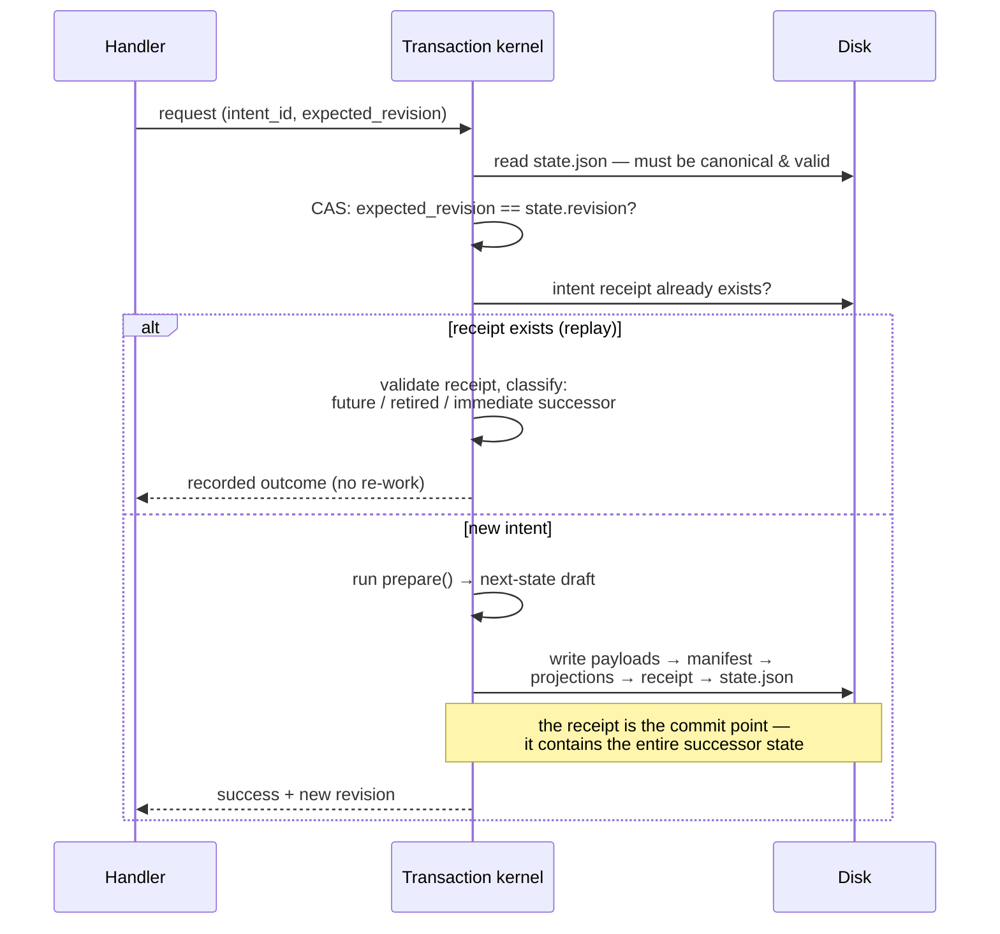
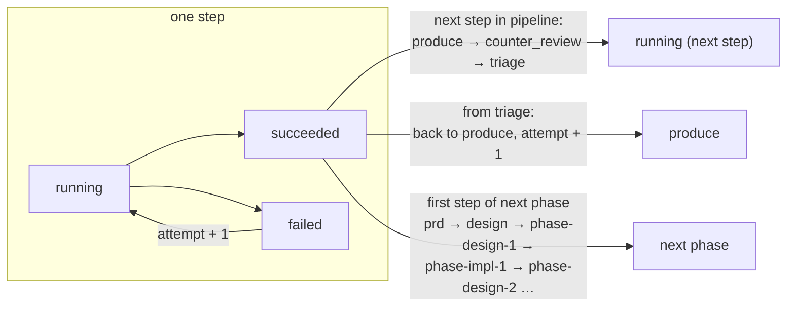

# state/DURABLE-STATE

**Explored:** 2026-08-12 · **Commit:** `e7a63c0` · **Covers:** `src/state/`, `src/repository/`, `skills/archflow-prd/`

Durable state is ArchFlow's memory and its authority. Every server answer — "what phase am I in?", "what do I do next?" — is recomputed from bytes on disk under `.archflow/`, never from session memory. This page covers where those bytes live, how writes stay safe, the state machine, and how drift is detected and repaired.

## The layout

Task root: `.archflow/tasks/<task-id>/`. The important entries:

| Path | What it is | Mutability |
|---|---|---|
| `state.json` | **The** durable state document | replaced atomically |
| `config.yaml` | digest-pinned task config (dispatch routes, models) | pinned |
| `ask.md` | verbatim request plus append-only clarification Q&A; its complete bytes are digest-pinned as the PRD's declared input | authored durable input |
| `prd.md`, `design.md`, `phases/<n>/…` | human-readable projections of retained results | derived, replaceable |
| `gate.json` / `gate.decision` | the mutable *interface* a human answers a gate through | transient |
| `decisions/<gate-id>/` | gate request + decision archive | **immutable** |
| `results/sha256/<digest>/` | content-addressed store — the after-image of every step | manifest **immutable & permanent**; superseded `payload/` bytes reclaimed |
| `intents/<intent-id>.json` | intent receipts — the transaction journal | **immutable**; retired *boundary* receipts reclaimed |
| `intents/<intent-id>.request.json` | staged requests — the resolved request `build-request` composed, awaiting its digest-checked MCP call | replaced on recompose; deletable once the intent is retired |
| `manual/checkpoints/` | legacy offline checkpoint chain — retired; never written by current code, but pre-retirement files remain and still pin reclamation digests | inert legacy |
| `attempts/`, `maintenance/`, `imports/` | failed-dispatch forensics, reclamation records, legacy staging | append-only |

`state.json` holds identity, position (`phase_instance`, `step`, `status`, `attempt`), a strictly increasing `revision` (the compare-and-swap token), the pinned input digests, sorted sets of authoritative results / approvals / waivers, and **at most one** `open_gate` — modelled as an optional object rather than an array, so a second concurrent gate is unrepresentable rather than merely rejected. Deliberately absent: any recorded "blocking reason" — blocking is always recomputed, so there's no second source of truth to disagree.

A key distinction to internalize: the markdown files humans read are **projections** — derived copies of retained results. The authority is always the canonical JSON in `results/` + `state.json`. Losing a projection loses convenience, never truth — and for every *referenced* result the payload bytes are still there to restore it. That restore guarantee is deliberately scoped: superseded payloads are reclaimed (next section), so only results something can still read keep their byte copies.

### Retention and reclamation

Every produce/review round stores a full copy of its output under `results/sha256/<digest>/payload/`, so a phase that loops N times would otherwise retain N near-identical copies. Two rules keep that bounded without ever touching truth:

- **A result is *referenced* — never pruned — while anything can still read it back:** it appears in `state.json`'s `authoritative_results`, an archived gate document under `decisions/` (or a retained review record, the live gate interface, or a pre-retirement manual checkpoint file still on disk — matched conservatively, by digest-shaped string, so an unrecognized reference shape fails toward keeping), or the intent receipt for the current revision or its not-yet-promoted successor — the only receipts crash arbitration ever consumes. Retired receipts replay from their own recorded outcome bytes, so they no longer pin payloads. Staged requests (`*.request.json`, a distinct path class that can never classify as a receipt) are never roots: their content is re-authenticated by request digest on every use, so a stale one pins nothing and is simply deletable.
- **Everything else loses only its `payload/` byte copies.** The `manifest.json` stays forever as the digest-bound authority record, and each reclamation pass writes an immutable record under `maintenance/` (reachability proof digest, exact deletion set, byte counts) *before* deleting, so every reclaimed byte is accounted for. Because a payload is stored under a full mirror of its repository path, deleting one also removes the now-empty directories it leaves behind, up to and including that result's own `payload/`.
- **Retired intent records are reclaimed too, but narrowly.** Two categories cover them: `retired-staged-request` deletes a `*.request.json` once its receipt exists (a staged request with no receipt is a pre-call buffer and is kept), and `retired-intent` deletes a receipt **only** when it is a `record-state-boundary` marker whose `resulting_revision` is behind the current one. Every other receipt is retained indefinitely — the constitution review (`loadRetiredOutcome`) and gate replay both read *retired* receipts by intent id, and only a boundary marker, which installs no result, has no such reader. The surviving set is bound into the reachability proof digest, so retention is decided by the same proof-then-delete walk as payloads rather than by a filter at the delete site.

Why bother: reconciliation reads `intents/` on **every status call** and keeps only the receipt at the current revision, so every retained receipt is parsed and discarded on the workflow's most frequent command. Each receipt also embeds a full copy of `state.json`, which is what made a single PRD session's `intents/` the largest real-byte consumer in the task directory.

Reclamation runs opportunistically: after a commit that replaces an authoritative result, the transaction kernel triggers a best-effort prune (`pruneSupersededResultPayloads`). A prune failure is never a transaction failure — the commit is already durable, and the next superseding commit retries. The human-run `archflow-local maintain` command performs the same pass on demand and is additionally the only path allowed to delete attempt records: dispatches write an `attempts/` record **only on failure** (timeout, cancellation, nonzero exit — the forensic evidence for canary/leak analysis); successful dispatches write nothing.

## How writes stay safe

All writes go through one path: `runStateTransaction` in `src/state/transaction.ts`, under a per-task lock (an atomically-created lock directory; abandonment is never inferred — a human confirms before a stale lock is removed, via a two-phase inspect-then-delete protocol).

Supporting guarantees:

- **Immutable classes never clobber.** Receipts, decisions, manifests, and payloads are written with `link()`-into-place, which fails on existence — so "created" vs "already there" is a trustworthy answer, and an identical replay is recognized by digest comparison.
- **Half-written results are invisible.** Payloads are written before the manifest; no manifest, no result.
- **Crash windows are arbitrated, not guessed.** Every failed write reports whether the target may have changed; an arbitration step re-reads state and receipt and decides: committed after all, unchanged, moved by someone else (`RECONCILIATION_REQUIRED`), or genuinely ambiguous.
- **The kernel owns the revision counter.** Callers structurally cannot set `revision` or `committed_intent` in their drafts.
- **Write capability is a minted object.** Every write-capable function requires a `TransactionAuthority` that can only be created by resolving and verifying the real repository — it cannot be forged, and one repository's authority cannot be smuggled into another.

## The state machine

Position is `(phase_instance, step, status, attempt)`. The legal moves (`src/state/transitions.ts`, pure — no I/O) are few:

The pipeline steps are exactly `produce`, `counter_review`, and `triage`. "Adjudicate" is **not** a state-machine position — it survives only as an internal evidence-slot key: the counter-review transaction installs up to two results (the rubric review and, when active constitution rules exist, the constitution-review result under that slot) in **one atomic commit**. There is no produce→adjudicate editorial edge; an editorial revision re-runs nothing, keeping retained evidence bound to the declared predecessor for one hop.

Nothing moves while a gate is open or the task is terminal. Two special exits require an *authenticated gate approval object* (mintable only by re-verifying the archived gate documents): the legacy-upgrade jump from `design` into a later phase via `migration-audit` (armed by triage-succeeded), and task completion from the final phase's triage-succeeded via `commit-authorization` — which also requires the commit to be actually observed in git.

The input fingerprint is recomputed and compared *before* any write, so a request built against stale inputs fails cleanly (`INPUT_FINGERPRINT_MISMATCH`).

## Deriving "the one next action"

`status.ts` reassembles all the facts read-only (config verification, reconciliation, retained evidence, approvals, commit observation, the evidence fixed point), and `next-action.ts` reduces them through a strict precedence ladder — repair findings first, then terminal/gate states, then the evidence pipeline's next step, then advancement. The result is exactly one `next_action`, usually with a mechanically complete prefilled request attached where only the judgment fields are left blank. That's what `archflow-local status` prints and what every skill follows. Because only one gate can be open at a time, a constitution review that demands more than one gate also reports `pending_gate_kinds` on that action — the whole queue, in the order it will open — so a human can be told the total cost of the review before answering the first gate rather than discovering the next one afterwards. It is disclosure only: each gate is still opened and decided separately.

One subtlety: when re-entry is required (accepted findings), some projection drift is *expected* — status reclassifies those findings out of the blockers but keeps them visible as `expected_reentry_edits`, so drift is never hidden.

## Drift, reconciliation, repair

Discovery (pure I/O) hashes what's actually on disk against what the manifests recorded, and verifies the gate head binds its archive. Classification (pure logic) turns mismatches into six findings, each with its own prescribed next action — e.g. `receipt-only` (crash between receipt and state write) → `resume-exact-intent`; `projection-mismatch` → `restore-or-record-new-transition`. Repair never acts on its own: **the server detects and classifies; a human authorizes every destructive fix.**

## The git boundary

The repository layer (`src/repository/`) invokes only ten read-oriented git subcommands — **the server never commits, pushes, or checks out.** Committing is always the human's step. Notable care lives here:

- **Repository identity** is a digest over the object format + root commits — no filesystem path — so it survives relocation and is shared across worktrees.
- **`.archflow/** -text merge=binary`** in `.gitattributes` is what licenses hashing file bytes in-process: it makes blob IDs a pure function of content, independent of platform line-ending settings.
- **The runner is root-bound by construction** — a branded runner mintable only by worktree discovery, closing a reproduced hole where git commands run from a subdirectory silently return wrong-but-well-formed answers.
- **Honesty about limits:** locking and revision CAS coordinate only processes sharing one filesystem. Git is transport and history, **not a distributed lock** — ArchFlow simply does not coordinate writers across machines; one filesystem holds the writer at a time, and moving a task between machines is an ordinary git push/pull the human performs between sessions.

## Degraded mode

Degraded mode is deliberately small: when the MCP server is unavailable, `archflow-local manual-status` classifies the situation read-only — `normal` delegates to task status, `degraded` (no durable state) has one answer, wait for the server, and `repair-required` (state present but unreadable) yields a position summary. No offline recording path exists; the server records all progress. The former manual/offline mirror of the kernel (checkpoint chains, manual gates, checkpoint import — roughly 2,000 lines of parallel machinery) is retired; see `../COMPLEXITY.md` for the audit history.

Two legacy remnants survive that retirement. Pre-retirement checkpoint chains are stranded: nothing reads them back, the files remain on disk, and reclamation still conservatively treats their digests as roots. And `state.json` may carry a legacy `adopted_checkpoint` field from a pre-retirement import — accepted when present on old states, preserved verbatim by transactions, never written by any current code. See `../LIMITATIONS.md`.
