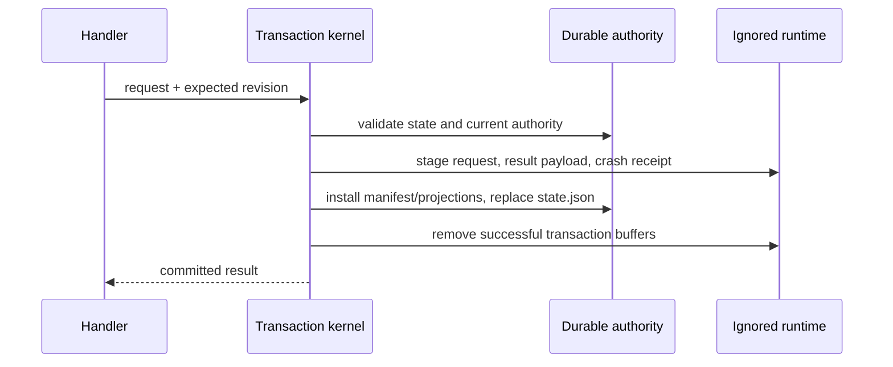

# state/DURABLE-STATE

**Explored:** 2026-08-12 · **Commit:** `247df34` · **Covers:** `src/state/`, `src/repository/`, `src/init/`, `src/local/`

Durable state is ArchFlow's memory and authority, but not every file the workflow uses deserves that status. The repository now separates tracked, reviewable authority from an ignored workspace containing bytes that are transient, reconstructible, or useful only for diagnosis.

## The authority/runtime split

```text
.archflow/
  .gitignore                         # exactly /runtime/
  config.yaml
  workflow.yaml
  constitution/
  tasks/<task>/
    config.yaml
    state.json
    ask.md
    prd.md
    design.md
    phases/<n>/{design.md,impl-notes.md}
    authority/
      initialization.json
      results/<result-digest>.json
      decisions/<gate-id>/
        request.json
        decision.json
  runtime/tasks/<task>/
    transient/{intents/,.transaction-lock}
    cache/{results/,reviews/,gates/,phases/<n>/verification.txt,imports/}
    diagnostics/attempts/
```

The durable side contains human-authored documents, pinned configuration and policy, `state.json`, the adopted initialization artifact, current result manifests, and gate authority still referenced by state. The `runtime/` side contains staged requests, crash receipts, locks, duplicate payload bytes, rendered evidence and gate interfaces, raw verification transcripts, legacy import staging, and failed-dispatch attempts. `.archflow/.gitignore` ignores that entire tree; initialization checks both that the rule works and that no runtime path is already tracked, without touching the project root `.gitignore`.

Task isolation applies equally to both roots. A runtime path is resolved only below `.archflow/runtime/tasks/<validated-task>` with the same containment, symlink, and cross-task protections used for durable task paths.

## Bounded result and decision authority

`state.json` holds identity, position, revision, pinned inputs, current authoritative results, approvals and waivers, at most one open gate, and `last_transition`. A result reference carries its digest, not a caller-authored manifest path; the manifest is derived as `authority/results/<result-digest>.json`.

Only the current result for each `(phase_instance, step)` is retained. Once a state commit replaces it, cleanup removes the superseded manifest and cached payload unless a live durable decision still references that result. Review, triage, and adjudication Markdown are not permanent outputs: their structured evidence lives in the manifest and is rendered into ignored cache when a human or reviewer needs it. Gate requests, human decisions, and any resulting human-revision reference become immutable authority below `authority/decisions/<gate-id>/` while referenced; the writable gate UI below `runtime/` is merely a reconstructible interface.

The initialization digest is resolvable because the adopted artifact is written once to `authority/initialization.json`. Cleanup audit files, permanent review Markdown, and superseded manifests are neither authority nor supported compatibility inputs and are no longer created.

## Transactions and exact replay

All state changes still pass through the transaction kernel under a task-local lock and revision compare-and-swap. Before state replacement, request staging and crash receipts live below ignored `runtime/tasks/<task>/transient/`; they are recovery buffers, not long-lived records.



`last_transition` makes the newest committed call self-contained in `state.json`: it records tool, operation, intent/request identity, input fingerprint, result identity, validated outcome, and outcome digest. A retry can therefore replay the last call exactly after its crash receipt has been deleted. Recovery buffers are preserved when a transaction has not durably committed; crash arbitration never guesses.

Other load-bearing guarantees remain: immutable authority never clobbers, incomplete results do not become visible, the kernel owns revision and `last_transition`, and write capability is minted only after repository and task resolution.

## Verification evidence

Raw phase verification is written to `.archflow/runtime/tasks/<task>/cache/phases/<n>/verification.txt`. `ImplementationOutputV1` requires `verification_evidence: { transcript_digest, byte_count }`, so the manifest and review envelope bind to the exact transcript bytes. The transcript is digest-checked before review and removed only after the workflow advances past the phase. Losing it during an uncommitted active step yields an actionable rerun classification; it does not retroactively invalidate an approved earlier phase.

When a cached result payload is absent, readers recover from structured evidence embedded in its manifest, a verified tracked projection, or its recorded Git blob identity. This is why a fresh clone containing only tracked files can still validate durable results, rebuild gate UI, report status, and derive the next action. The guarantee reaches the last checked-in durable boundary, not uncommitted implementation bytes.

## Cleanup

Cleanup runs at explicit lifecycle boundaries:

- after every successful write, remove staged requests, crash receipts, scratch bytes, and superseded unreferenced authority;
- after phase advancement, remove completed-phase caches, raw verification, rendered reviews, attempts, and gate UI;
- on completion or abandonment, remove the entire task-specific runtime directory;
- before durable commitment, retain recovery buffers needed to arbitrate an interrupted transaction.

A cleanup failure never rolls back committed authority. Full status reports the non-blocking `workspace.cleanup_pending` condition; brief status includes workspace only while it is pending. The next mutation retries cleanup, and `archflow-local clean --task <id>` provides an input-free manual retry that reports removed and retained file/byte counts. It removes only unreferenced authority and stale or reconstructible runtime data.

## State machine, gates, and Git boundary

The pipeline remains `produce → counter_review → triage`; accepted findings return to produce, and successful triage advances only after required human gates. Gate resolution and phase advancement are separate state commits: after approval, status exposes one successor and the producer composes a judgment-free `advance` request, calls `archflow_state`, and verifies the new position. If the producer session ended in between, the exact destination skill may make the same call when status authenticates its target phase and arguments. No code is written before phase-design approval, and no commit is made before a durable commit-authorization decision plus the separate explicit Git confirmation.

Document boundaries fail closed. A transition out of `prd`, `design`, or `phase-design-N` re-reads an authenticated `artifact-approval` and requires it to name the current produce result and subject bytes; absent, stale, wrong-subject, or fabricated approval cannot advance. Phase implementation keeps its stronger Git boundary: commit authorization plus observed committed outputs. The hand-off reuses existing state operations and documents, so the durable shape is unchanged and existing approved-but-not-advanced tasks require no schema migration or manual repair.

Gate UI is disposable: it is reconstructed from the durable request, and resolution archives the human decision before deleting the UI. Its normal projection is conversational—title, summary, question, evidence, and labeled choices—while IDs, hashes, JSON, paths, and codes remain available only for diagnostics. A missing or corrupt projection can remove convenience but cannot strand authenticated authority.

When a human asks for changes, durable state records the resulting classification and reason. A simple, meaning-preserving revision retains review evidence for one predecessor hop and keeps the attempt count, but never inherits approval. A significant revision archives the former evidence, resets the attempt count to 1, and makes fresh counter-review and constitution review the next automatic work. The human can override either classification; the recorded override, not the producer's initial suggestion, is authoritative.

ArchFlow's durable files are committed only on the task's working branch for resumability and are removed before the final product PR. Git supplies transport and history, not a distributed lock. A fresh clone recovers the last committed durable boundary; moving uncommitted cache or implementation bytes between machines is outside that promise.

Degraded mode remains read-only: `archflow-local manual-status` reports the position and instructs the user to restore the server. It records no offline progress or compatibility state.
