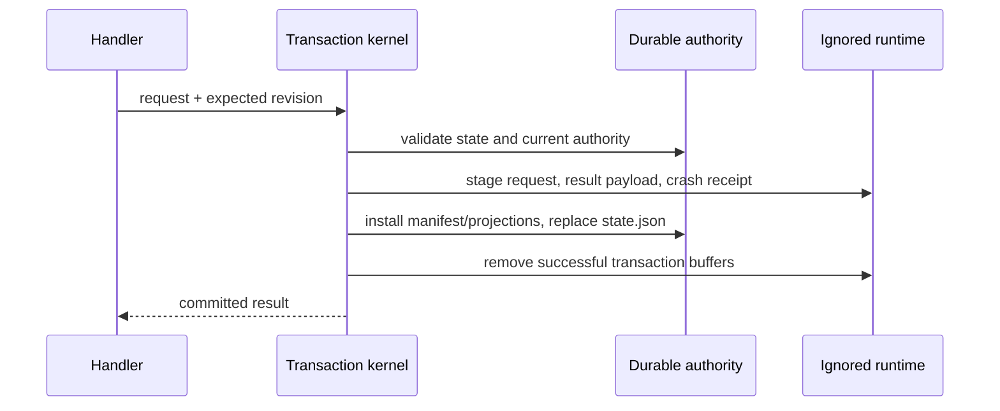

# state/DURABLE-STATE

**Explored:** 2026-09-03 · **Commit:** `1d71fee` · **Covers:** `src/state/`, `src/contracts/durable-state.ts`, `src/contracts/durable-implementation-output.ts`, `src/repository/`, `src/init/`, `src/local/`, `src/mcp/handlers/semantic.ts`, `src/dispatch/failure-observation.ts`

Durable state is ArchFlow's memory and authority, but not every file the workflow uses deserves that status. The repository now separates tracked, reviewable authority from an ignored workspace containing bytes that are transient, reconstructible, or useful only for diagnosis.

Repository review coverage is recovered from retained evidence, not inferred from live configuration. Status accepts only the current workflow position's server-attested counter-review repository pins for `last_reviewed_commit`. When a gate binds that exact evidence set, its disposable human presentation lists the abbreviated reviewed commits and flags a differing live HEAD; losing the presentation cannot affect the durable gate. Baseline adoption binds drift rather than review evidence, so it intentionally has no such lines.

Review history is versioned evidence, not a migration queue. Archived Review V1 retains severity/blocking and its legacy verdict; Review V2 retains the taxonomy triplet and generic finding detail. Fresh Review V3 adds server-stamped reviewer/focus/routing/criterion attribution, role-native general or test detail, exact reviewer responsibilities, and the primary general upstream census. Archived Adjudication V1 keeps combined constitution/drift facts; fresh Adjudication V2 keeps only server-derived constitution findings from exact child judgment slots because Review V3 now owns drift. Triage ledger entries preserve each cohort's native detail, including V3 attribution and test fields, after the source review is superseded. An occurrence remains `(review_evidence_digest, finding_id)`, so replay cannot double-count it and a later reuse is distinct. Status derives native round counts and computes the 12 taxonomy denial rates across V2/V3 classified occurrences; gate authority remains bound to the exact current evidence set.

One internal policy-facts projection prevents status, fixed point, request composition, and gate selection from disagreeing about those versions. Fresh facts take alignment from Review V3 and constitution results from Adjudication V2 when rules are active; a no-active-rule cohort is clean/not-run without suppressing alignment. Archived facts take both halves from Adjudication V1. Mixed, stale, or incomplete cohorts fail closed. Constitution gates remain ordered before material-drift gates, and existing waiver, replay, and re-entry effects are unchanged.

## The authority/runtime split

```text
.archflow/
  .gitignore                         # exactly /runtime/
  config.yaml
  workflow.yaml
  constitution/
  tasks/<task>/
    config.yaml
    state.json
    ask.md
    prd.md
    design.md
    phases/<n>/{design.md,impl-notes.md}
    authority/
      initialization.json
      results/<result-digest>.json
      decisions/<gate-id>/
        request.json
        decision.json
  runtime/tasks/<task>/
    transient/{intents/,.transaction-lock}
    cache/{results/,reviews/,gates/,phases/<n>/verification.txt,imports/}
    diagnostics/attempts/   # failed-dispatch forensics plus retained child outputs of an uncommitted review round
  runtime/diagnostics/internal-errors.log
```

The durable side contains human-authored documents, mutable task configuration, pinned constitution policy, `state.json`, the adopted initialization artifact, current result manifests, and gate authority still referenced by state. The `runtime/` side contains intent receipts, crash receipts, locks, duplicate payload bytes, rendered evidence and gate interfaces, raw verification transcripts, legacy import staging, and failed-dispatch diagnostics. `.archflow/.gitignore` ignores that entire tree; initialization checks both that the rule works and that no runtime path is already tracked, without touching the project root `.gitignore`.

Each current review attempt may have one deterministic compact dispatch-failure observation beside the existing random-ID forensic attempt records. The compact file is latest-failure-only and intentionally disposable: it records safe route/code facts plus task, phase instance, step, attempt, and revision solely so status can reject stale or mismatched bytes. It never transitions state, consumes an attempt, mints evidence, opens a gate, or authorizes a retry. Losing it removes convenience only; the same pending durable review authority remains and a still-failing retry can reconstruct the observation.

The same directory holds the retained child outputs of a review round that has not committed yet (`round-<envelope>-<role>-<key>.json`): the validated raw output of each general, test-specialist, or constitution child bound to the exact envelope digest, role, route, and route provenance it answered. A retry of the same round reuses them instead of re-dispatching those children and deletes them when the round commits. They are equally disposable — reuse re-validates the bytes under the current binding, and losing a record costs one re-dispatch, never workflow progress.

Task isolation applies equally to both roots. A runtime path is resolved only below `.archflow/runtime/tasks/<validated-task>` with the same containment, symlink, and cross-task protections used for durable task paths.

`runtime/diagnostics/internal-errors.log` is the one runtime path that belongs to no task, and it is deliberately not a resolved path claim. It is a process-level append-only record of `INTERNAL_ERROR` stacks written directly by the server (see `mcp/SERVER.md`), so it must exist before any task context does and must never be able to fail a call. It is created only when `.archflow/` already exists, and every write error is swallowed.

## Bounded result and decision authority

`state.json` holds identity, position, revision, pinned inputs, current authoritative results, approvals and waivers, approval-rule settlements, validation-override and review-push-through history, at most one open gate, and `last_transition`. A result reference carries its digest, not a caller-authored manifest path; the manifest is derived as `authority/results/<result-digest>.json`.

Approval-rule settlements deliberately live inside this one state root. Each entry binds a producing phase instance, subject digest, config digest, settlement revision, and the full evaluated conclusion: no wait, a subject wait, or an implementation content wait with the complete matched-path set. The human detail is reconstructible from two durable authorities: that frozen path set and the retained implementation output. Their join binds each matching path to its operation and exact signed byte delta. Rename source and destination paths are evaluated independently, and multiple operations affecting the same path remain distinct and deterministically ordered. Both outcomes are written atomically with the transition that first establishes a clean fixed point, so later mutable config or worktree bytes cannot rewrite the recorded match. Under the exact shipped v2 policy, the server may consume an authenticated `wait:false` settlement as direct advancement authority after clean counter-review, constitution, and safety checks; `wait:true` remains presentation evidence for a human gate. The settlement is never caller authority, and v1, divergent policy, stale or wrong-subject settlements, and exception conditions fail closed to a human boundary. There is no parallel settlement document, authority directory, or independently registered schema root that could drift from state.

Only the current result for each `(phase_instance, step)` remains active. Once a state commit replaces it, cleanup removes the superseded manifest and cached payload unless another durable root references it. The shared retained-result graph includes active results, pending and historical human-revision evidence, restart-history superseded results, and evidence moved with a cleared pending revision; references are deduplicated by result digest for both retention and byte accounting. Other digest-shaped values nested in a manifest do not create retention authority; malformed, unreadable, or identity-mismatched manifests fail safely toward retention for inspection. Byte accounting reads only what it needs: a manifest's own accounting record, proved authentic by re-hashing the bytes to the digest the durable reference names. It deliberately does not require the manifest's *artifact body* to satisfy the current schema for that artifact kind, because it never reads that body. A task's retained graph spans every result it has ever produced, including results written by earlier server versions, so binding the byte total to today's artifact schemas would let an ordinary field rename strand a task that had done nothing wrong. Corruption is still caught; schema drift in a part of the manifest accounting does not read is not corruption. Review, triage, and adjudication Markdown are not permanent outputs: their structured evidence lives in the manifest and is rendered into ignored cache when a human or reviewer needs it. Gate requests, human decisions, and any resulting human-revision reference become immutable authority below `authority/decisions/<gate-id>/` while referenced; the writable gate UI below `runtime/` is merely a reconstructible interface.

### Validation and review-exception records

`pending_validation_override` is the one in-flight request a failed phase implementation may carry. It preserves the current input fingerprint, authenticated governing phase-design digest, exact `localeCompare`-sorted validation descriptions, producer reason, request digest, and request revision. If a validation gate is open, state requires the matching pending request and subject; a different open gate cannot coexist. The request and its human decision leave the attempt unchanged. Grant, deny, and cancel all return to `produce: failed`; an ordinary retry is the separate transition that increments the attempt.

A grant appends `ValidationOverrideRecordV1` to `validation_overrides`. It records the gate and decision identity, phase, input and governing design, subject, exact displaced validation set, human reason/time, and grant revision. It creates no approval or waiver reference. Denial and cancellation append no record. Consumers render the list as **not run**, and authenticate the governing input before treating the record as current.

`ReviewPushThroughRecordV1` is different: `push-through-review` uses the ordinary advancing attempts-exhausted effect, so settlement appends both its generic `ApprovalRef` and the specialized record atomically. The record binds phase, attempt, subject, current evidence set, triage result, exact accepted `{review_evidence_digest, finding_id}` occurrences, human reason/time, and resolution revision. It authorizes only the exact repeated-review obstacle; it does not clear policy, trigger, drift, configured-approval, or commit checks.

Fresh initialization writes both history arrays as `[]`; their schema fields remain optional only so older states stay readable. The arrays sort by ordinal `(phase_instance, gate_id)` and reject duplicate gate IDs. Nested durable validation descriptions and accepted occurrences also use code-unit ordinal order. Gate input lists instead use `localeCompare`, because they feed gate schemas whose comparator is explicitly locale-based; the settling writer reorders for the durable consumer rather than assuming the two comparators agree.

## Explicit backward planning restart

`TaskStateV1.restart_history` is optional, so pre-feature state remains readable. Each record authenticates one explicit human request: stable restart ID, source and strictly earlier target, exact reason, restart revision, superseded result references, cleared waivers, optional cleared pending human revision, and human provenance in one of three arms — a declared local trace from a connected host, a declared local trace from an `archflow-local` invocation, or a server-attested `connected-request-trace` (connection, invocation, and request digests) constructed by the MCP state handler when the restart arrived as an authenticated tool call. The total order is `prd < design < phase-design-1 < phase-impl-1 < phase-design-2 < ...`; only PRD, design, or a numbered phase design can be a target.

The planned final phase is not only a design-approval fact: any produce whose retained payloads record the task design document re-derives the bound from those exact bytes in the same transaction, because phase-boundary revisions change the phase plan long after the design position's own approval settled it. An open-ended recorded design clears the bound; a produce recording no design document leaves it untouched; a recorded design whose phase plan does not conform fails the produce closed rather than silently keeping a stale bound — but only while a stored bound exists to go stale. A task with no stored bound (fresh, legacy-imported, or restarted to the design position) preserves the absent bound: legacy imports legitimately record designs without the ArchFlow phase-plan grammar, their approval path never derives the bound, and the design-approval gate already enforces phase-plan conformance at approval.

The restart transition preserves Git, index, and worktree bytes except for the PRD ask append described below. It archives target-and-downstream result authority into the restart record, clears active waivers and pending human revision into that record, retains approvals as audit history, enters target `produce: running` at attempt 1, and recomputes the target fingerprint. PRD or design clears `planned_final_phase`; a phase-design restart retains it. The transaction layer treats this as the sole narrow exception to ordinary gate-authority preservation and independently checks the exact resulting draft.

Historical approvals, rule settlements, and baseline-adoption records remain readable after a restart. Approvals and settlements are ineligible when the restart affected their producer phase. An adoption remains only an overlay on a retained source projection; if restart or milestone recovery supersedes that source manifest, the orphaned adoption is inert and cannot create projection authority of its own. Approval consumers enforce the restart cutoff for authority, and settlement presentation selection enforces it so reproduced identical bytes cannot revive a stale trigger explanation.

For a PRD target, the state handler appends one `Reopening and corrections` entry to canonical `ask.md` after the restart request has passed the locked state checks. Framing records the restart ID, exact request byte length, and request digest, then preserves the human request bytes without trimming or reflowing them. The request digest binds the expected ask-prefix digest; an exact operation-bound suffix is replayable, while a changed prefix or post-append tail fails closed. The ask append is the only intended worktree side effect of restart and is installed before state so an interrupted call can retry its exact suffix.

### Where the secret scan runs

Every result manifest records the secret-scan verdict that was reached over the exact bytes it names. That scan happens **once, wherever bytes are produced or written**: capturing a fresh document or implementation result, projecting evidence, restoring retained projections at a gate, and staging a legacy import. The scanner is fail-closed in a way worth stating plainly — a scanner that is merely *unavailable* is reported as a detection, not waved through, so a broken scanner blocks the write instead of quietly permitting it.

Reads do not re-scan. Reloading a result reads its manifest, which has already been proven against its own digest, its declared semantics, and the Git objects it names; that manifest carries the recorded verdict, and for implementation results the verdict must match the source artifact's byte-for-byte or the manifest is rejected. Since the scanner runs a pinned detector set over bytes already proven identical, a re-scan can only ever reproduce the recorded answer — at the cost of re-reading every payload. So status, gate derivation, evidence correlation, and byte accounting all read manifests and trust the recorded verdict. Only review dispatch, which needs the full projection plan to show a reviewer what changed, reloads a result in full.

The practical reason this matters: rebuilding a projection plan is proportional to the number of outputs, and a large implementation phase can carry several hundred. Making a read pay that cost turned a status check into a multi-second operation for no added safety.

The initialization digest is resolvable because the adopted artifact is written once to `authority/initialization.json`. Cleanup audit files, permanent review Markdown, and superseded manifests are neither authority nor supported compatibility inputs and are no longer created.

Gate archives are append-only authority across compatible software updates. Fresh ordinary requests strictly require policy fields and an `approval_trigger`, and fresh artifact/commit requests use their complete waiver-capable decision tuples. Explicit reader-only arms preserve the exact earlier artifact, design, exact-commit, and pre-exact-commit contexts and decision tuples, including surviving supersession shapes. An old open request can reconstruct its disposable active presentation after cache loss without rewriting archive bytes or weakening the fresh writer. The reader also still accepts a `commit-authorization` context archived before `baseline_commit`, `commit_message`, and `paths` existed; such approval remains historical authority but attests no exact commit. A valid advancing decision remains usable with its original digest; a historical `superseded` outcome remains audit history and cannot satisfy an approval. Corrupt or hybrid retired fields fail closed rather than being stripped before hashing.

Attempts-exhausted archives preserve one more exact historical pair: the old context without `review_push_through` and its four-decision tuple. Fresh writers advertise the fifth choice only when the context carries authenticated eligible history. The reader never adds a choice to archived bytes, and an old human decision re-digests under the shape it actually used.

That tolerance is read-only and narrow: only shapes the archive actually contains are accepted, and only the fields that postdate them are excused. Anything else malformed in the same record — a missing digest, an unknown key, an out-of-order digest set — still fails closed. An old approval remains full human authority for advancement, but it cannot attest a commit whose baseline, message, and path set it never bound; the commit-observation check skips it instead of comparing against absent values.

## Transactions and exact replay

Semantic human decisions preserve append-only gate authority without a blocking file wait. `decision-archive` writes the immutable connected-host decision under an operation-bound identity, and `decision-settle` re-authenticates the request and archive before changing state. Revision settlement is close-only and leaves a durable checkpoint; it does not reopen the write window, so `revise-enter` must commit before writable document resources reappear.

All state changes still pass through the transaction kernel under a task-local lock and revision compare-and-swap. Before state replacement, request staging and crash receipts live below ignored `runtime/tasks/<task>/transient/`; they are recovery buffers, not long-lived records.



`last_transition` makes the newest committed call self-contained in `state.json`: it records tool, operation, intent/request identity, input fingerprint, result identity, validated outcome, and outcome digest. A retry can therefore replay the last call exactly after its crash receipt has been deleted. It is a single slot, though, and any committed call overwrites it — including a human gate decision, which may legally land at almost any position. So a semantic continuation treats it as replay authority only when it names the very substep being continued; a slot naming a different substep is no evidence rather than evidence of tampering, and the action simply runs its remaining substeps under a fresh operation. That distinction is what keeps a decision taken mid-review from stranding the review forever. Recovery buffers are preserved when a transaction has not durably committed; crash arbitration never guesses.

Other load-bearing guarantees remain: immutable authority never clobbers, incomplete results do not become visible, the kernel owns revision and `last_transition`, and write capability is minted only after repository and task resolution.

## Verification evidence

Raw phase verification is written to `.archflow/runtime/tasks/<task>/cache/phases/<n>/verification.txt`. `ImplementationOutputV1` requires `verification_evidence: { transcript_digest, byte_count }`, so the manifest and review envelope bind to the exact transcript bytes. The transcript is digest-checked before review and removed only after the workflow advances past the phase. Losing it during an uncommitted active step yields an actionable rerun classification; it does not retroactively invalidate an approved earlier phase.

When a cached result payload is absent, readers recover from structured evidence embedded in its manifest, a verified tracked projection, or its recorded Git blob identity. Design results own compound projections: task design owns `design.md` plus current `prd.md`; phase design owns its phase document plus current `design.md` and `prd.md`. Every member has an output entry, projection digest, and retained payload under the one result and snapshot digest. Reconciliation therefore selects the newest result that owns each path, preserving superseded parent results as history instead of treating their older digests as current authority. An implementation result separates its declared changed-file projections from its parent-document bindings: counter-review authenticates the tracked implementation log through the latter, so the log need not be misclassified as a changed implementation output. This is why a fresh clone containing only tracked files can still validate durable results, rebuild gate UI, report status, and derive the next action. The guarantee reaches the last checked-in durable boundary, not uncommitted implementation bytes.

An implementation result names the commit its work started from, and that name is normalized before anything is observed. The client may pass whatever reference it holds — commonly an abbreviated hash — and `buildImplementationOutput` resolves it to the full object id first. This matters because Git is permissive where the durable contract is not: an abbreviation satisfies every `ls-tree`, `diff`, and ancestry check the builder runs, so without normalization the mismatch would surface only when the finished artifact is parsed, as an unexplained internal error long after the work is correct. A reference Git cannot resolve is returned as a contract failure the client can fix, and the stored artifact always names one unambiguous commit.

During implementation review, those retained projections are also the only source of changed repository bytes. Dispatch archives the recorded base commit and applies the retained after-images into a disposable checkout; it never copies the live worktree. The compact envelope binds the base and declared snapshot while the child reads full files from that reconstructed tree. Task workflow files are excluded from that checkout, so the implementation composer mechanically declares every changed writable governing document as an output and restore target, and review-material assembly includes its exact digest-checked bytes in the authenticated implementation subject. Thus a transport cap cannot silently select only part of a changed file, governing-document edits remain reviewable, and edits made after produce cannot leak into the reviewed subject.

## Cleanup

Cleanup runs at explicit lifecycle boundaries:

- after every successful write, remove intent receipts, crash receipts, scratch bytes, and superseded unreferenced authority;
- after phase advancement, remove completed-phase caches, raw verification, rendered reviews, attempts, and gate UI;
- on completion or abandonment, remove the entire task-specific runtime directory;
- before durable commitment, retain recovery buffers needed to arbitrate an interrupted transaction.

A cleanup failure never rolls back committed authority. Full status reports the non-blocking `workspace.cleanup_pending` condition; brief status includes workspace only while it is pending. The next mutation retries cleanup, and `archflow-local clean --task <id>` provides an input-free manual retry that reports removed and retained file/byte counts. It removes only unreferenced authority and stale or reconstructible runtime data.

## State machine, gates, and Git boundary

The semantic façade preserves the pipeline entry edges rather than collapsing them. Both submitted triage and review's zero-finding continuation record `triage: running` before terminal triage. Semantic review serializes replay, dispatch, and commit under one outer FIFO while using the counter-review handler's direct inner seam.

The pipeline remains `produce → counter_review → triage`; accepted findings return to produce, and so do a failed constitution rule and material upstream drift while the attempt budget lasts. The triage-settle transaction records project-rule evaluation at both clean and foldable policy-adjudication fixed points. A configured trigger or same-subject policy obligation opens the position's one ordinary human gate, whose required `approval_trigger` binds either the exact settlement or a durable simple-revision predecessor/final checkpoint. The implementation presentation includes frozen per-path operation and byte-delta evidence. A clean `wait:false` path advances directly only when no matching ordinary approval exists. Migration adoption, material drift, exhaustion, baseline adoption, and other distinct remedies remain separate human gates; `constitution-review` remains a fresh writer only for the separate waiver grant/deny/cancel decision. Gate resolution and phase advancement are separate state commits. A semantic gate decision archives the human's choice and reason immutably and settles the gate separately; a disposable decision file is recovery machinery, never the protocol. Design adds a third recoverable fact before advancement: the exact task-local milestone commit authorized by either the authenticated ordinary gate result or no-wait authority. Status exposes `commit-artifacts` until Git proves that exact commit, then exposes the successor. Implementation submit-work carries only the client-owned declaration; the server derives manifests, digests, scans, accounting, and verification evidence. Every returned commit binds exact baseline, target ref, paths, and message and is executed directly after the same Git checks; read-only status observes proof. No code is written before the server reports durable phase-design authority, whether from a passed triggered gate or rule-based advancement after counter-review.

`restart_history` is the append-only audit trail for explicit backward planning moves. Each record binds the restart ID, source and target phase instances, reason, revision, human provenance (a declared local trace from a connected host or `archflow-local`, or the server-attested connected-request trace), superseded result references, cleared waivers, and any cleared pending human revision. Those archived references remain live for cleanup/accounting purposes even though they no longer confer current authority. The restart operation never rewrites Git or restores old projections: it changes durable workflow authority so the existing worktree can be reconciled into a new reviewed plan.

A restart does delete one narrow class of file, and the reason is worth stating plainly. The abandoned attempt's own phase documents — the implementation notes of the phase being redone, and any design or notes belonging to a later phase — are left in the worktree with no authority behind them. The milestone commit that follows the redone design covers the whole task directory, so a leftover would be swept into a commit that never reviewed it; the milestone check would then correctly refuse to recognize that commit, and the commit cannot be retried once made. Clearing the leftover at the restart removes the cause instead of relaxing the check. Only *untracked* documents are removed: a tracked one is already in history, and deleting it would merely turn the same unauthorized change into a deletion. The removal happens after the restart's state write is durable, so a failed restart never destroys work.

Entering `produce: running` is the durable write window for that phase. During this window, status still reports changed historical projection paths, but classifies their byte drift as expected production work rather than demanding reconciliation—even on the first produce attempt, when no current-phase produce result exists. This matters when a later phase intentionally edits files produced by an earlier phase. Receipt and gate-authority disagreements remain blocking. On terminal produce, the implementation builder establishes the new authority by binding the declared outputs to the base commit, current index/worktree identities, undeclared-change report, verification transcript, and exact retained bytes; once the write window closes, projection drift is strict again.

Strict does not mean dead-ended. Post-window drift on projected files — typically later commits or a merge from main advancing past a completed phase's recorded bytes — routes to the `baseline-adoption` gate instead of an unrecoverable recovery action. The gate opens only on the exact live drift set (re-derived under the lock), and the human decides once: adopt the current bytes, which appends a `baseline_adoptions` record binding each path to its adopted digest, or restore the recorded bytes through the existing projection-plan machinery. Discovery overlays those adoption records newest-per-path alongside result manifests, so an adoption suppresses older manifest digests for its paths, a later produce naturally supersedes an adoption, and fresh drift on an adopted path opens a new decision rather than passing silently. A restore is offered only when a retained manifest still holds the recorded bytes — drift on top of an adoption can only be adopted again, because adopted bytes exist in the worktree and git, never in durable authority; the choice is refused before the gate opens (a decided interface is immutable, so recording an unapplicable decision would wedge the gate behind it). A projected file that has been deleted has no current bytes to adopt, so that case routes to `inspect-state` with per-output `archflow-local restore` guidance instead of this gate — unless the recorded projection is adoption-sourced, in which case no retained bytes exist to restore either: restore is impossible and adoption needs current bytes. There the workflow offers the produce re-entry (the same window accepted findings and new information use) whenever the current phase already has a recorded produce; the fresh terminal produce re-declares the drifted paths and the deletion, so the normal review boundary covers the bytes instead of a human adopting them unseen. The re-entry can only complete at an implementation position — a document produce cannot declare repository-source deletions — so at a document position the recovery is restoring the bytes from Git history when they are recoverable, then re-declaring the deletion at the next implementation produce. A deletion that is already committed removes even that door: absent from HEAD as well as the worktree, the file has no before-image in any future produce's base commit. The gate therefore grows a deletion shape — the drift set carries the deleted paths beside the drifted ones, and the human choice keeps the committed deletions, recording them as `adopted_absences` on the adoption record. Discovery overlays those absences newest-per-path exactly like declared deletion outputs, retiring the stale recorded presence; the presentation offers only the choices the context can satisfy, so a deletions-only decision never shows the bytes options. The produce re-entry still outranks that decision while anything re-declarable remains — drifted paths, or a missing file whose deletion is worktree-only — because the fresh terminal produce covers those bytes under review instead of a bytes adoption; once only committed deletions remain, the re-entry can make no progress and would loop, so the deletion decision takes over.

New baseline requests additionally persist the authorized target ref, the target head shown to the human, and the sorted paths whose current versions are not in that target tree. Their semantic subject is the complete changed/deleted path and digest set plus target and committedness classification. Settlement recomputes that subject under the task lock and requires first-parent continuity from the presented head: an unrelated descendant that preserves the subject remains settleable, while changed bytes, drift membership, branch, committedness, or a non-descendant replacement makes it stale. `gate_supersessions` preserves an immutable audit fact when the server retires such a stale open interface; it never supplies adoption or human provenance.

Historical milestone authority is also explicit. New no-wait settlements write target ref and baseline together. The shared proof resolver checks only the authorized target's first first-parent child after that baseline and distinguishes not-yet-created, missing history, and unverifiable Git evidence. A `milestone_recovery_history` entry records a server-owned same-position reset: superseded active results, cleared waivers and pending human revision, exact target facts, reason, and revision. Eligibility cutoffs treat that recovery like a planning restart, so older approvals, settlements, or waivers cannot revive. The record itself is not approval or review; normal production, verification, review, settlement, and commit handling must run again.

One class of drift the baseline decision cannot settle, and it is worth being precise about why. A review dispatch does not read every projected file from the worktree — the declared repository outputs reach the reviewer from retained payload bytes — but it does re-read the *documents* the subject carries: the implementation log or design document the result recorded, and the approved planning documents upstream of it. Those it re-hashes against the digests durable authority recorded, and it refuses to review bytes the result never recorded. A baseline adoption answers a different question: which bytes are authoritative for a *path*. Adopting therefore silences the drift finding while the recorded result — whose digest is the review subject — stays pinned to what it recorded, and the review that was already impossible stays impossible with a human decision spent on it. So while a review is still owed, status checks those documents itself and routes past the baseline decision: drift in a document the current phase's own result recorded goes to a produce re-entry, which re-records the result over the bytes that are actually there and puts them under review; drift in an approved upstream document goes to `inspect-state`, because nothing in this phase can re-record another phase's document — the recorded bytes go back, or the phase that owns them is reopened. Once the review is current, the pin is no longer read and ordinary drift is the baseline decision's business again, exactly as before.

The produce window is what makes that recovery reachable, and its door is deliberately wide. Within a phase, `produce: running` may be entered from anywhere at attempt + 1 — from a succeeded step (the accepted-finding re-entry and the author's new-information door), and equally from a step that is still running or has already failed. That last arm is load-bearing rather than permissive: a step whose terminal result cannot be recorded has no forward edge at all, and the same-step retry rule only repeats work that cannot succeed. A review that cannot be dispatched over documents that changed under it is exactly that shape. The produce window is the phase's root and the only door that is never a dead end, and abandoning an entry to walk through it costs the same attempt a retry would have. Work already in flight in produce itself is untouched: `produce: running` still settles at its own terminal result first.

Document boundaries fail closed. A transition out of `prd`, `design`, or `phase-design-N` re-authenticates either the phase-appropriate ordinary human approval or exact no-wait authority for the current result and subject bytes. For either design stage the subject includes the primary document and its parent projections. Human approval binds target ref, baseline commit, deterministic message, policy findings, eligible waivers, and trigger provenance; autonomous authority binds the same current subject and Git facts through the authenticated settlement and supported policy profile. If both exist, human approval takes precedence everywhere—advancement, target movement, milestone recovery, and proof selection never fall back to settlement facts. Advancement independently proves its commit is the direct child of the selected baseline, touches only `.archflow/tasks/<task>/`, and contains every document in the result plus state. The task root must otherwise be clean. Existing legacy design `artifact-approval` archives remain usable under their recorded contract and are not treated as commit authority.

That proof reports *why* it failed, not merely that it did, and the distinction decides what happens next. "Not committed yet" is the only miss the authorized commit action can still resolve by running, so it alone leaves `commit-artifacts` on offer. Every other miss — the target moved, the parent is not the baseline, the message or an approved document does not match, an unapproved task document is present, or the task tree is not clean — means the action is unperformable, because the local commit path requires the target to still *be* the approved baseline. Status names that miss in `blocking_reasons` as `design-milestone-<reason>` and the next action becomes `inspect-state`, so a human sees what is wrong instead of a step that silently cannot succeed. The unapproved-document rule is also applied before the commit exists, while it can still be fixed by removing the stray file.

Status preserves the reason when that approval authentication fails. Full status includes an `approval_issues` entry with the gate identity and structured loader error, while `blocking_reasons` carries only the aggregate `approval-authority-unavailable` condition and brief status omits the mechanical detail. Failure to resolve an approved upstream is reported separately as `approved-upstream-authority-unavailable`; `fixed-point-disagreement` is reserved for a failure while assessing an otherwise available evidence set.

Config reads carry the same honesty. Every dispatch or state transaction reads the live task-local `config.yaml`; a successful transaction records its parsed shape in `last_seen_config`, and status reports later field-level differences as informational `config_change` entries. Repository add/remove/path/mode edits use that same nonblocking mechanism: they do not independently reroute the workflow, stale retained evidence, or open a gate. Relative secondary paths resolve from the primary worktree root and absolute paths are accepted; `primary` is reserved for the implicit writable member, and omitted secondary mode resolves to `context-only` without being materialized into the config snapshot. Members are always reported primary-first and then by ordinal secondary name, never YAML mapping order.

The current repository set is recomputed live from the task-local declaration. The primary task remains the sole source of task resources, config, constitution, and state; secondary `.archflow/` trees are never consulted, and tasks never read one another's files. `last_seen_repository_bindings` is only a self-validating continuity checkpoint paired atomically with `last_seen_config`: it binds the canonical member name, declared path, and repository identity so an unrelated repository cannot silently replace an unchanged declaration. It cannot create or retain membership. Explicit add/remove/path edits change membership normally; an unchanged name/path must retain identity. Dispatched review evidence separately binds the exact configured primary-first repository names, identities, and commits it saw. A secondary `writable` mode is still not output or commit authority without an authenticated implementation section.

Config bytes are not part of the review input fingerprint, so an edit does not stale retained evidence or an open gate. Retired `producer` keys are accepted on read, while other unknown or invalid fields fail as `config-invalid` until corrected; invalid declarations fail closed before mutation or dispatch and never silently fall back to an older snapshot. An invalid config read carries a bounded `issues` array naming the faulty fields; a repository that cannot be observed reports `repositories.<name>.path` with a reason-specific code (`repository-open-failed`, `repository-identity-unresolved`, `repository-head-unresolved`), while an aliased or nested topology reports `repository-set-invalid`. The counter-review handler presents the three observation reasons as a retryable, member-named `REPOSITORY_VIEW_UNAVAILABLE` both before dispatch and at its post-dispatch recheck. The exact repository seed `.archflow/config.yaml` is separately allowed as a reviewed implementation output so a policy-activation phase can retain, restore, and commit defaults for future tasks; this narrow exception does not admit any task-local state or other managed `.archflow/` path into the repository-source class.

Gate UI is disposable: it is reconstructed from the durable request, and resolution archives the human decision before deleting the UI. Its normal projection is conversational—title, summary, question, evidence, and labeled choices—while IDs, hashes, JSON, paths, and codes remain available only for diagnostics. A missing or corrupt projection can remove convenience but cannot strand authenticated authority.

When a human asks for changes, durable state records the resulting classification and reason. A simple, meaning-preserving revision retains review evidence for one predecessor hop and keeps the attempt count, but never inherits approval. A significant revision archives the former evidence, resets the attempt count to 1, and makes fresh counter-review and constitution review the next automatic work. The human can override either classification; the recorded override, not the producer's initial suggestion, is authoritative.

ArchFlow's durable files are committed only on the task's working branch for resumability and are removed before the final product PR. Git supplies transport and history, not a distributed lock. A fresh clone recovers the last committed durable boundary; moving uncommitted cache or implementation bytes between machines is outside that promise.

Degraded mode remains read-only: `archflow-local manual-status` reports the position and instructs the user to restore the server. For state-absent upgrades it also distinguishes a reusable current stage from incompatible pre-fix staging; neither is promoted to authority. Current upgrade staging contains config, manifest, payloads, and a stage descriptor only below ignored runtime. Legacy initialization validates those bytes and publishes the complete destination directory by one rename, so config, state, PRD, overall design, phase designs, and implementation logs become visible together or not at all.

## Multi-repository implementation authority

The primary repository still owns all task state and retained authority. A phase result may add ordinal writable-secondary sections that bind repository identity, caller-declared base, exact outputs, undeclared-change scan, restore targets, inputs, and snapshot accounting. Retained secondary payloads are repository-qualified below the primary task cache; durable authority stores names and identity digests, never live locations. Projection and adoption identity is the structured `(repository, path)` tuple, with omitted repository meaning primary for old records.

Installation and restore validate every repository group before writing, apply primary then ordinal secondaries, and roll back in reverse after an ordinary failure. This is a recoverable sequence, not a cross-filesystem atomic transaction. One approval or authenticated settlement governs all member commits, but Git proof lands one repository at a time; already-proved commits survive partial failure and the phase advances only after every changed member is proved.

## Effort evidence currency

Status does not add a durable recommendation pointer or duplicate assessment bytes. It follows the existing authoritative result reference for the governing `phase-design-N`, authenticates only the retained review slice it consumes, and derives the current public recommendation during one consistent read. Phase implementation N and terminal completion use that same phase design's retained review; unrelated tasks, phases, predecessor subjects, Markdown, and reviewer-authored routing prose are never candidates.

Fresh phase-design review evidence nests one authenticated effort assessment beside ordinary reviewer provenance. It binds the exact task, phase instance, attempt, subject/input identities, component-manifest and hazard digests, policy, repository pins, child input/output digests, and any one-dispatch override. The recommendation is server-derived data inside evidence, not a state transition or approval field.

Fixed-point readers require an exact-current, ready assessment for newly reviewed phase designs. An effort blocker remains active even when all ordinary findings are rejected; remaining attempts return to production with the recorded questions, and the maximum reaches the existing exhausted-attempt boundary. Read paths accept absent effort data only for explicitly classified, byte-identical pre-feature authority. Retained-graph accounting continues reading the narrow authenticated manifest slice it consumes, so an old record cannot strand a task merely because its nested review schema predates effort evidence.
