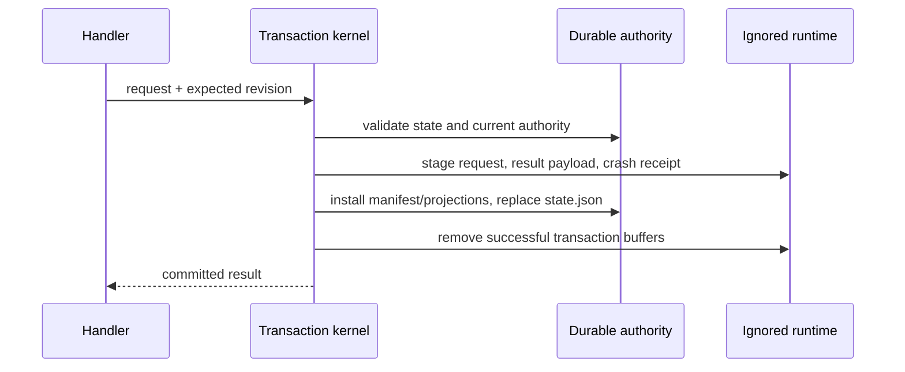

# state/DURABLE-STATE

**Explored:** 2026-08-16 · **Commit:** `d60da73` · **Covers:** `src/state/`, `src/repository/`, `src/init/`, `src/local/`, `src/mcp/handlers/semantic.ts`

Durable state is ArchFlow's memory and authority, but not every file the workflow uses deserves that status. The repository now separates tracked, reviewable authority from an ignored workspace containing bytes that are transient, reconstructible, or useful only for diagnosis.

## The authority/runtime split

```text
.archflow/
  .gitignore                         # exactly /runtime/
  config.yaml
  workflow.yaml
  constitution/
  tasks/<task>/
    config.yaml
    state.json
    ask.md
    prd.md
    design.md
    phases/<n>/{design.md,impl-notes.md}
    authority/
      initialization.json
      results/<result-digest>.json
      decisions/<gate-id>/
        request.json
        decision.json
  runtime/tasks/<task>/
    transient/{intents/,.transaction-lock}
    cache/{results/,reviews/,gates/,phases/<n>/verification.txt,imports/}
    diagnostics/attempts/
```

The durable side contains human-authored documents, pinned configuration and policy, `state.json`, the adopted initialization artifact, current result manifests, and gate authority still referenced by state. The `runtime/` side contains intent receipts, crash receipts, locks, duplicate payload bytes, rendered evidence and gate interfaces, raw verification transcripts, legacy import staging, and failed-dispatch attempts. `.archflow/.gitignore` ignores that entire tree; initialization checks both that the rule works and that no runtime path is already tracked, without touching the project root `.gitignore`.

Task isolation applies equally to both roots. A runtime path is resolved only below `.archflow/runtime/tasks/<validated-task>` with the same containment, symlink, and cross-task protections used for durable task paths.

## Bounded result and decision authority

`state.json` holds identity, position, revision, pinned inputs, current authoritative results, approvals and waivers, at most one open gate, and `last_transition`. A result reference carries its digest, not a caller-authored manifest path; the manifest is derived as `authority/results/<result-digest>.json`.

Only the current result for each `(phase_instance, step)` remains active. Once a state commit replaces it, cleanup removes the superseded manifest and cached payload unless another durable root references it. The shared retained-result graph includes active results, pending and historical human-revision evidence, restart-history superseded results, and evidence moved with a cleared pending revision; references are deduplicated by result digest for both retention and byte accounting. Other digest-shaped values nested in a manifest do not create retention authority; malformed, unreadable, or identity-mismatched manifests fail safely toward retention for inspection. Review, triage, and adjudication Markdown are not permanent outputs: their structured evidence lives in the manifest and is rendered into ignored cache when a human or reviewer needs it. Gate requests, human decisions, and any resulting human-revision reference become immutable authority below `authority/decisions/<gate-id>/` while referenced; the writable gate UI below `runtime/` is merely a reconstructible interface.

## Explicit backward planning restart

`TaskStateV1.restart_history` is optional, so pre-feature state remains readable. Each record authenticates one explicit human request: stable restart ID, source and strictly earlier target, exact reason, restart revision, superseded result references, cleared waivers, optional cleared pending human revision, and human provenance in one of three arms — a declared local trace from a connected host, a declared local trace from an `archflow-local` invocation, or a server-attested `connected-request-trace` (connection, invocation, and request digests) constructed by the MCP state handler when the restart arrived as an authenticated tool call. The total order is `prd < design < phase-design-1 < phase-impl-1 < phase-design-2 < ...`; only PRD, design, or a numbered phase design can be a target.

The restart transition preserves Git, index, and worktree bytes except for the PRD ask append described below. It archives target-and-downstream result authority into the restart record, clears active waivers and pending human revision into that record, retains approvals as audit history, enters target `produce: running` at attempt 1, and recomputes the target fingerprint. PRD or design clears `planned_final_phase`; a phase-design restart retains it. The transaction layer treats this as the sole narrow exception to ordinary gate-authority preservation and independently checks the exact resulting draft.

Historical approvals remain readable but cannot authorize post-restart work. Every approval consumer applies the latest restart revision affecting the authority's actual producer phase; only approvals resolved after that cutoff are eligible. This prevents reproducing identical subject bytes from reviving an old approval.

For a PRD target, the state handler appends one `Reopening and corrections` entry to canonical `ask.md` after the restart request has passed the locked state checks. Framing records the restart ID, exact request byte length, and request digest, then preserves the human request bytes without trimming or reflowing them. The request digest binds the expected ask-prefix digest; an exact operation-bound suffix is replayable, while a changed prefix or post-append tail fails closed. The ask append is the only intended worktree side effect of restart and is installed before state so an interrupted call can retry its exact suffix.

### Where the secret scan runs

Every result manifest records the secret-scan verdict that was reached over the exact bytes it names. That scan happens **once, wherever bytes are produced or written**: capturing a fresh document or implementation result, projecting evidence, restoring retained projections at a gate, and staging a legacy import. The scanner is fail-closed in a way worth stating plainly — a scanner that is merely *unavailable* is reported as a detection, not waved through, so a broken scanner blocks the write instead of quietly permitting it.

Reads do not re-scan. Reloading a result reads its manifest, which has already been proven against its own digest, its declared semantics, and the Git objects it names; that manifest carries the recorded verdict, and for implementation results the verdict must match the source artifact's byte-for-byte or the manifest is rejected. Since the scanner runs a pinned detector set over bytes already proven identical, a re-scan can only ever reproduce the recorded answer — at the cost of re-reading every payload. So status, gate derivation, evidence correlation, and byte accounting all read manifests and trust the recorded verdict. Only review dispatch, which needs the full projection plan to show a reviewer what changed, reloads a result in full.

The practical reason this matters: rebuilding a projection plan is proportional to the number of outputs, and a large implementation phase can carry several hundred. Making a read pay that cost turned a status check into a multi-second operation for no added safety.

The initialization digest is resolvable because the adopted artifact is written once to `authority/initialization.json`. Cleanup audit files, permanent review Markdown, and superseded manifests are neither authority nor supported compatibility inputs and are no longer created.

Gate archives are append-only authority across compatible software updates. The current gate writer does not create the retired supplemental-review or supersession fields, while the V1 archive reader continues to validate and authenticate those historical shapes without rewriting them. The reader likewise still accepts a `commit-authorization` context archived before `baseline_commit`, `commit_message`, and `paths` became required — a field added to a writer must not retroactively invalidate a decision a human already made. A valid advancing decision remains usable with its original digest; a historical `superseded` outcome remains audit history and cannot satisfy an approval. Corrupt retired fields fail closed rather than being stripped before hashing.

That tolerance is read-only and narrow: only shapes the archive actually contains are accepted, and only the fields that postdate them are excused. Anything else malformed in the same record — a missing digest, an unknown key, an out-of-order digest set — still fails closed. An old approval remains full human authority for advancement, but it cannot attest a commit whose baseline, message, and path set it never bound; the commit-observation check skips it instead of comparing against absent values.

## Transactions and exact replay

Semantic human decisions preserve append-only gate authority without a blocking file wait. `decision-archive` writes the immutable connected-host decision under an operation-bound identity, and `decision-settle` re-authenticates the request and archive before changing state. Revision settlement is close-only and leaves a durable checkpoint; it does not reopen the write window, so `revise-enter` must commit before writable document resources reappear.

All state changes still pass through the transaction kernel under a task-local lock and revision compare-and-swap. Before state replacement, request staging and crash receipts live below ignored `runtime/tasks/<task>/transient/`; they are recovery buffers, not long-lived records.



`last_transition` makes the newest committed call self-contained in `state.json`: it records tool, operation, intent/request identity, input fingerprint, result identity, validated outcome, and outcome digest. A retry can therefore replay the last call exactly after its crash receipt has been deleted. Recovery buffers are preserved when a transaction has not durably committed; crash arbitration never guesses.

Other load-bearing guarantees remain: immutable authority never clobbers, incomplete results do not become visible, the kernel owns revision and `last_transition`, and write capability is minted only after repository and task resolution.

## Verification evidence

Raw phase verification is written to `.archflow/runtime/tasks/<task>/cache/phases/<n>/verification.txt`. `ImplementationOutputV1` requires `verification_evidence: { transcript_digest, byte_count }`, so the manifest and review envelope bind to the exact transcript bytes. The transcript is digest-checked before review and removed only after the workflow advances past the phase. Losing it during an uncommitted active step yields an actionable rerun classification; it does not retroactively invalidate an approved earlier phase.

When a cached result payload is absent, readers recover from structured evidence embedded in its manifest, a verified tracked projection, or its recorded Git blob identity. Design results own compound projections: task design owns `design.md` plus current `prd.md`; phase design owns its phase document plus current `design.md` and `prd.md`. Every member has an output entry, projection digest, and retained payload under the one result and snapshot digest. Reconciliation therefore selects the newest result that owns each path, preserving superseded parent results as history instead of treating their older digests as current authority. An implementation result separates its declared changed-file projections from its parent-document bindings: counter-review authenticates the tracked implementation log through the latter, so the log need not be misclassified as a changed implementation output. This is why a fresh clone containing only tracked files can still validate durable results, rebuild gate UI, report status, and derive the next action. The guarantee reaches the last checked-in durable boundary, not uncommitted implementation bytes.

During implementation review, those retained projections are also the only source of changed repository bytes. Dispatch archives the recorded base commit and applies the retained after-images into a disposable checkout; it never copies the live worktree. The compact envelope binds the base and declared snapshot while the child reads full files from that reconstructed tree. Task workflow files are excluded from that checkout, so the implementation composer mechanically declares every changed writable governing document as an output and restore target, and review-material assembly includes its exact digest-checked bytes in the authenticated implementation subject. Thus a transport cap cannot silently select only part of a changed file, governing-document edits remain reviewable, and edits made after produce cannot leak into the reviewed subject.

## Cleanup

Cleanup runs at explicit lifecycle boundaries:

- after every successful write, remove intent receipts, crash receipts, scratch bytes, and superseded unreferenced authority;
- after phase advancement, remove completed-phase caches, raw verification, rendered reviews, attempts, and gate UI;
- on completion or abandonment, remove the entire task-specific runtime directory;
- before durable commitment, retain recovery buffers needed to arbitrate an interrupted transaction.

A cleanup failure never rolls back committed authority. Full status reports the non-blocking `workspace.cleanup_pending` condition; brief status includes workspace only while it is pending. The next mutation retries cleanup, and `archflow-local clean --task <id>` provides an input-free manual retry that reports removed and retained file/byte counts. It removes only unreferenced authority and stale or reconstructible runtime data.

## State machine, gates, and Git boundary

The semantic façade preserves the pipeline entry edges rather than collapsing them. Both submitted triage and review's zero-finding continuation record `triage: running` before terminal triage. Semantic review serializes replay, dispatch, and commit under one outer FIFO while using the counter-review handler's direct inner seam.

The pipeline remains `produce → counter_review → triage`; accepted findings return to produce, and successful triage advances only after required human gates. Gate resolution and phase advancement are separate state commits. A semantic gate decision is bounded and nonblocking: the offered action archives the human's choice and reason immutably — provenance minted only from an authenticated connected-host invocation — and settles the durable gate in a separate substep; a disposable decision file is recovery machinery, never the protocol. Design adds a third recoverable fact between gate and advancement: the task-local milestone commit authorized by the combined gate. Status exposes `commit-artifacts` until Git proves that exact commit, then exposes the successor and the semantic surface applies the judgment-free advance. At the semantic tier, implementation submit-work carries only the client-owned declaration — base commit, outputs, restore targets, declared inputs — and the server derives the manifest, digests, secret scan, accounting, and verification evidence inside the produce transaction; after `commit-authorization` settles, status returns the exact commit facts with `requires_human_confirmation: true`, the durable authorization stays the sole durable gate, the explicit confirmation before the client-created commit is conversational, and one later read-only status observes the commit proof before the successor appears. The client creates every commit itself from those returned facts, preserving unrelated index/worktree state. If the session ended in between, the same skill resumes the pending commit or the exact destination skill completes the authenticated hand-off. No code is written before phase-design approval.

`restart_history` is the append-only audit trail for explicit backward planning moves. Each record binds the restart ID, source and target phase instances, reason, revision, human provenance (a declared local trace from a connected host or `archflow-local`, or the server-attested connected-request trace), superseded result references, cleared waivers, and any cleared pending human revision. Those archived references remain live for cleanup/accounting purposes even though they no longer confer current authority. The restart operation never rewrites Git or restores old projections: it changes durable workflow authority so the existing worktree can be reconciled into a new reviewed plan.

A restart does delete one narrow class of file, and the reason is worth stating plainly. The abandoned attempt's own phase documents — the implementation notes of the phase being redone, and any design or notes belonging to a later phase — are left in the worktree with no authority behind them. The milestone commit that follows the redone design covers the whole task directory, so a leftover would be swept into a commit that never reviewed it; the milestone check would then correctly refuse to recognize that commit, and the commit cannot be retried once made. Clearing the leftover at the restart removes the cause instead of relaxing the check. Only *untracked* documents are removed: a tracked one is already in history, and deleting it would merely turn the same unauthorized change into a deletion. The removal happens after the restart's state write is durable, so a failed restart never destroys work.

Entering `produce: running` is the durable write window for that phase. During this window, status still reports changed historical projection paths, but classifies their byte drift as expected production work rather than demanding reconciliation—even on the first produce attempt, when no current-phase produce result exists. This matters when a later phase intentionally edits files produced by an earlier phase. Receipt and gate-authority disagreements remain blocking. On terminal produce, the implementation builder establishes the new authority by binding the declared outputs to the base commit, current index/worktree identities, undeclared-change report, verification transcript, and exact retained bytes; once the write window closes, projection drift is strict again.

Strict does not mean dead-ended. Post-window drift on projected files — typically later commits or a merge from main advancing past a completed phase's recorded bytes — routes to the `baseline-adoption` gate instead of an unrecoverable recovery action. The gate opens only on the exact live drift set (re-derived under the lock), and the human decides once: adopt the current bytes, which appends a `baseline_adoptions` record binding each path to its adopted digest, or restore the recorded bytes through the existing projection-plan machinery. Discovery overlays those adoption records newest-per-path alongside result manifests, so an adoption suppresses older manifest digests for its paths, a later produce naturally supersedes an adoption, and fresh drift on an adopted path opens a new decision rather than passing silently. A restore is offered only when a retained manifest still holds the recorded bytes — drift on top of an adoption can only be adopted again, because adopted bytes exist in the worktree and git, never in durable authority; the choice is refused before the gate opens (a decided interface is immutable, so recording an unapplicable decision would wedge the gate behind it). A projected file that has been deleted has no current bytes to adopt, so that case routes to `inspect-state` with per-output `archflow-local restore` guidance instead of this gate — unless the recorded projection is adoption-sourced, in which case no retained bytes exist to restore either: restore is impossible and adoption needs current bytes. There the workflow offers the produce re-entry (the same window accepted findings and new information use) whenever the current phase already has a recorded produce; the fresh terminal produce re-declares the drifted paths and the deletion, so the normal review boundary covers the bytes instead of a human adopting them unseen. The re-entry can only complete at an implementation position — a document produce cannot declare repository-source deletions — so at a document position the recovery is restoring the bytes from Git history when they are recoverable, then re-declaring the deletion at the next implementation produce.

Document boundaries fail closed. A transition out of `prd` re-reads `artifact-approval`; transitions out of `design` and `phase-design-N` re-read `design-approval`. All must name the current produce result and subject bytes; for either design stage that subject includes the primary document and its parent projections. A combined design approval also binds target ref, baseline commit, deterministic message, policy findings, and eligible waivers. Advancement independently proves its commit is the direct child of that baseline, touches only `.archflow/tasks/<task>/`, contains every document in the approved result plus state and archived request/decision, and leaves the task root clean. Existing legacy design `artifact-approval` archives remain usable under their recorded contract and are not treated as commit authority.

That proof reports *why* it failed, not merely that it did, and the distinction decides what happens next. "Not committed yet" is the only miss the authorized commit action can still resolve by running, so it alone leaves `commit-artifacts` on offer. Every other miss — the target moved, the parent is not the baseline, the message or an approved document does not match, an unapproved task document is present, or the task tree is not clean — means the action is unperformable, because the local commit path requires the target to still *be* the approved baseline. Status names that miss in `blocking_reasons` as `design-milestone-<reason>` and the next action becomes `inspect-state`, so a human sees what is wrong instead of a step that silently cannot succeed. The unapproved-document rule is also applied before the commit exists, while it can still be fixed by removing the stray file.

Status preserves the reason when that approval authentication fails. Full status includes an `approval_issues` entry with the gate identity and structured loader error, while `blocking_reasons` carries only the aggregate `approval-authority-unavailable` condition and brief status omits the mechanical detail. Failure to resolve an approved upstream is reported separately as `approved-upstream-authority-unavailable`; `fixed-point-disagreement` is reserved for a failure while assessing an otherwise available evidence set.

Config reads carry the same honesty. Retired config keys are accepted on read — the removed `producer` role, exactly like the retired `independence` evidence field — while every other unknown key still fails, and pinned bytes that no longer parse under the installed tooling surface as `pinned-config-schema-unsupported` with an `upgrade-tooling` action instead of `restore-pinned-config`, because the pin compares bytes and the bytes match: no restore can help.

Gate UI is disposable: it is reconstructed from the durable request, and resolution archives the human decision before deleting the UI. Its normal projection is conversational—title, summary, question, evidence, and labeled choices—while IDs, hashes, JSON, paths, and codes remain available only for diagnostics. A missing or corrupt projection can remove convenience but cannot strand authenticated authority.

When a human asks for changes, durable state records the resulting classification and reason. A simple, meaning-preserving revision retains review evidence for one predecessor hop and keeps the attempt count, but never inherits approval. A significant revision archives the former evidence, resets the attempt count to 1, and makes fresh counter-review and constitution review the next automatic work. The human can override either classification; the recorded override, not the producer's initial suggestion, is authoritative.

ArchFlow's durable files are committed only on the task's working branch for resumability and are removed before the final product PR. Git supplies transport and history, not a distributed lock. A fresh clone recovers the last committed durable boundary; moving uncommitted cache or implementation bytes between machines is outside that promise.

Degraded mode remains read-only: `archflow-local manual-status` reports the position and instructs the user to restore the server. For state-absent upgrades it also distinguishes a reusable current stage from incompatible pre-fix staging; neither is promoted to authority. Current upgrade staging contains config, manifest, payloads, and a stage descriptor only below ignored runtime. Legacy initialization validates those bytes and publishes the complete destination directory by one rename, so config, state, PRD, overall design, phase designs, and implementation logs become visible together or not at all.
