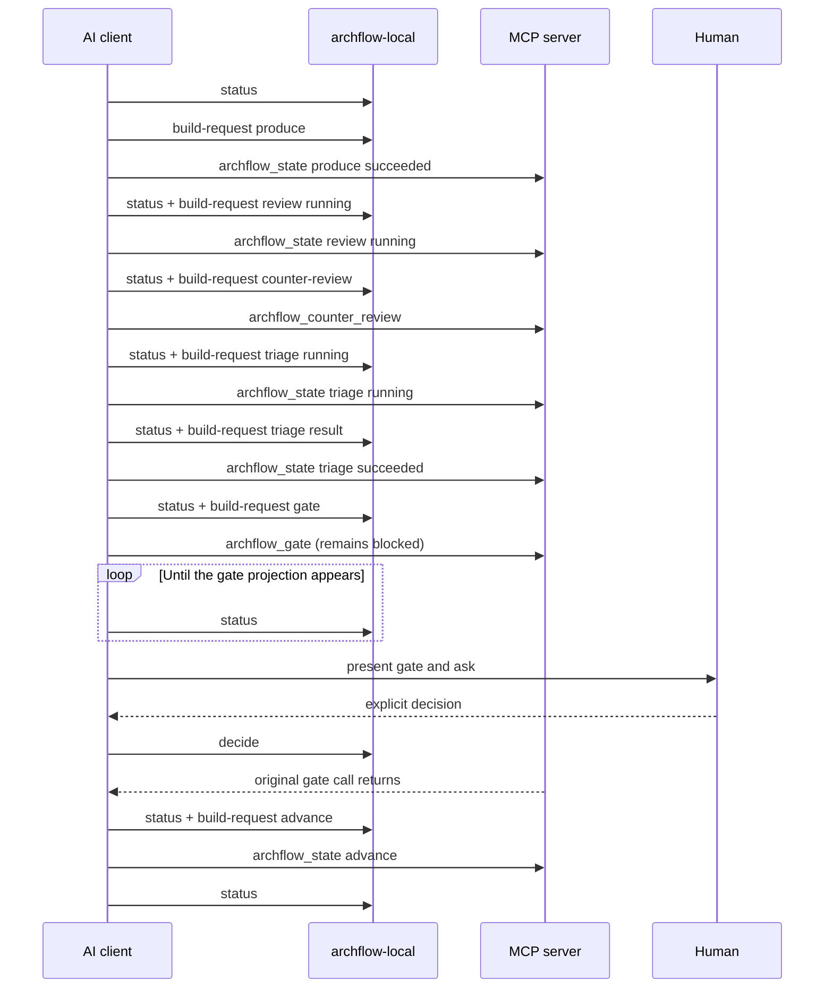
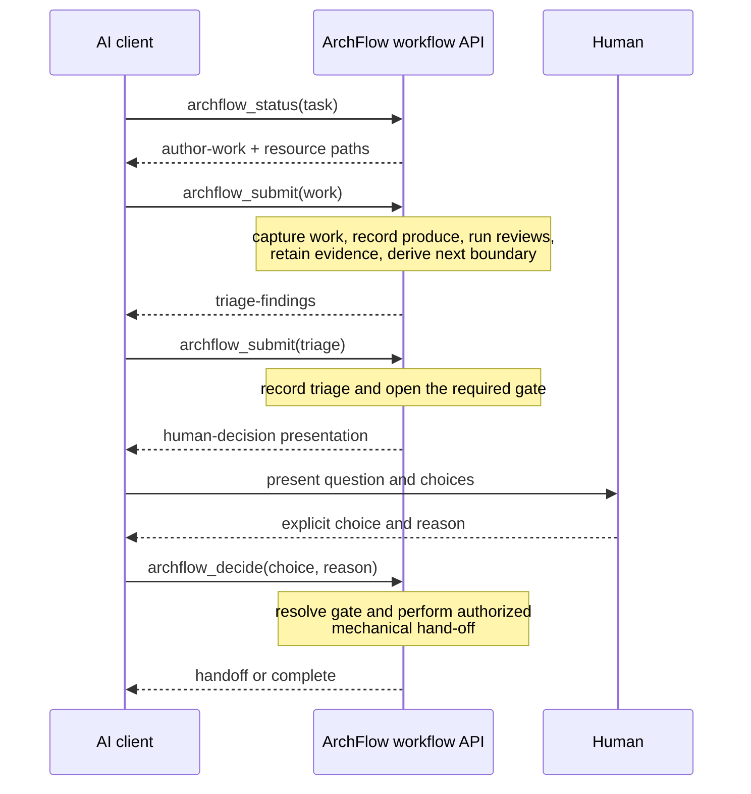

# Client workflow interface audit

**Audited:** 2026-08-14 · **Commit:** `6637099` · **Status:** recommendation for follow-up; not implemented

This audit starts from the actions an AI client actually needs to perform, then compares those actions with the current CLI and MCP surface. The recommendation is to keep ArchFlow's durable state machine and trust checks, but move their orchestration behind a small client-intent API.

## Conclusion

The current interface is a transaction API wearing a workflow wrapper. `archflow-local build-request` successfully removes most manual digest and payload construction, but the client still has to understand and sequence the underlying state machine.

A normal, already-started document phase with no rework takes seven MCP mutations. Each is normally preceded by request composition and followed by status. A gate additionally requires a long-running MCP call, status polling, and an out-of-band CLI decision. The client is not merely reporting its work and judgment; it is acting as ArchFlow's workflow coordinator.

The target should be one public call per actor-owned action:

- one call when the client submits completed work;
- one call when the client submits its judgment about review findings;
- one call when it relays an explicit human decision;
- one additional call when the human performs the deliberately separate implementation commit confirmation.

The server may retain every current transition, receipt, digest, review, and re-verification internally. Public call count and durable transition count do not need to match.

## Client-first action map

The useful boundary is where information or authority crosses between the human, the producing client, and ArchFlow. Everything else is orchestration.

| Client action | Information the client owns | ArchFlow owns | Expected response |
|---|---|---|---|
| Inspect or resume | Task identifier | Reconciliation, current position, resource discovery, recovery classification | Current position and exactly one semantic next action |
| Start a task | Task identifier | Task initialization, pinned configuration, initial write window | Writable resources and the work expected next |
| Submit completed work | Authored artifact or implementation declarations; verification facts; human-revision classification when required; optional human-facing synthesis | Capture, validation, digests, retention, produce completion, review entry, opposite-client dispatch, constitution dispatch, review completion | Findings requiring triage, a human presentation, or a blocked result |
| Reopen work for new information | Why current evidence is no longer current | Evidence invalidation and a new produce write window | Writable resources and the work expected next |
| Submit review judgment | One disposition and rationale per finding; optional human-facing synthesis | Evidence binding, counts, triage transitions, attempt accounting, re-entry or gate selection | Revision work, a human presentation, or the next phase action |
| Relay a human decision | Server-issued choice, human reason, and only choice-specific rationale | Gate bindings, provenance, archives, waiver derivation, approval re-verification | The next human decision, commit confirmation, hand-off, or completion |
| Confirm implementation commit | The human's explicit confirmation after seeing the exact staged diff and message | Exact scoped commit, commit observation, phase advance or task completion | Hand-off or completion |
| Run exceptional administration | An explicit setup, migration, or recovery choice | Repository setup, legacy import validation, repair safety checks | One bounded administrative result |

The client should not supply revisions, fingerprints, request digests, intent receipts, phase/step/status triples, artifact paths already known from status, rubric identity, gate IDs, evidence ordering, gate contexts, or waiver-origin archive bindings.

## The current action surface

The public vocabulary is spread across four layers:

- 17 `NextActionCode` values in [`src/state/next-action.ts`](../../src/state/next-action.ts#L12);
- 7 `build-request` kinds in [`src/local/build-request.ts`](../../src/local/build-request.ts#L38);
- 4 MCP tools in [`src/contracts/tool-names.ts`](../../src/contracts/tool-names.ts#L1);
- 14 flat CLI commands in [`src/local/commands.ts`](../../src/local/commands.ts#L35).

Those counts are not intrinsically bad. The problem is that the client translates between them. One conceptual action can have five representations:

1. `status.next_action.code`;
2. a full `status.next_action.request` template with placeholders;
3. a `build-request` kind plus client-authored facts;
4. a call envelope containing a resolved full request and staged reference;
5. the MCP invocation itself.

The mapping is important enough to have its own contract test in [`test/unit/request-templates.test.ts`](../../test/unit/request-templates.test.ts#L353). Brief status removes the request and guidance, so normal skill prose must teach the mapping that full status and the tests already encode ([`src/state/status.ts`](../../src/state/status.ts#L234)).

### MCP tools

| Current tool | What the client must understand |
|---|---|
| `archflow_state` | Task creation, phase hand-off, step entry, terminal success/failure, phase/step/status legality, and optional artifacts |
| `archflow_counter_review` | That review first needs a separate `counter_review/running` transition and which staged request to pass |
| `archflow_gate` | Gate kind/context construction and a blocking open-and-resolve lifecycle that depends on another interface writing the decision |
| `archflow_waiver` | The archived origin gate, decision/context/subject/evidence digests, rule, scope, and a second blocking gate lifecycle |

Every full tool request exposes `schema_version`, `task_id`, `intent_id`, `expected_revision`, and `input_fingerprint`; the staged alternative exposes task, intent, and request digest ([`src/contracts/mcp-tools.ts`](../../src/contracts/mcp-tools.ts#L39)). These values matter to ArchFlow's integrity model, but none expresses client judgment.

The MCP catalogue also provides schemas but no purpose-level tool descriptions: the descriptor is only `name`, `inputSchema`, and `outputSchema` ([`src/mcp/tools.ts`](../../src/mcp/tools.ts#L19)). The skills therefore serve as an external protocol manual for an API that is not self-describing.

The full-payload-or-staged-reference input union creates a second usability problem. A known host breaks root combinators, so ArchFlow advertises a merged, mostly optional object and explains the mutually exclusive parameter groups in prose ([`src/mcp/tools.ts`](../../src/mcp/tools.ts#L248)). Even after a custom reference pruner and reduced error projection, the serialized four-tool catalogue is about 105 KB ([`test/contracts/mcp-advertised-schema.test.ts`](../../test/contracts/mcp-advertised-schema.test.ts#L354)). Much of that context describes internal artifact, gate, and error shapes.

### CLI commands used by the normal loop

The normal workflow crosses both transports:

- `status` discovers the next transition;
- `build-request` composes and stages it;
- `envelope` handles requests the composer does not cover;
- an MCP tool performs the authoritative mutation;
- `decide` writes a gate decision while the MCP call waits;
- `manual-status` is a second status surface selected based on capability.

The other CLI commands mix setup (`init`, `upgrade`), retained-result maintenance (`snapshot`, `restore`, `clean`, `reconcile`), and contract/debug adapters (`validate`, `hash`, `render`) into the same flat namespace.

`build-request` is the right place for mechanical derivation under the current architecture. It derives the values correctly and stages them safely. It does not, however, hide the workflow. The caller still selects `running`, `produce`, `counter-review`, `triage`, `gate`, or `advance`, invokes the matching MCP tool, and checks status again.

## Current happy-path choreography

From an already-open produce write window, a no-rework document phase takes these seven MCP mutations:

1. record `produce/succeeded`;
2. record `counter_review/running`;
3. dispatch review and record `counter_review/succeeded`;
4. record `triage/running`;
5. record `triage/succeeded`;
6. open and resolve the approval gate;
7. record the phase advance.

Task initialization adds another mutation. Each mutation normally has its own `build-request` invocation and surrounding status reads. The integration journey encodes the five pre-gate build/invoke pairs and gate construction directly in [`test/integration/status-request-roundtrip.test.ts`](../../test/integration/status-request-roundtrip.test.ts#L243), with the separate hand-off at [line 547](../../test/integration/status-request-roundtrip.test.ts#L547).

Externally, that is seven request-composition calls, seven MCP calls, one CLI decision write, and at least seven routine status reads: roughly 22–23 machine interactions before any additional Git work. “Atomic” in the target design means one client intent, not one filesystem transaction; the server may still record the eight crash-safe revisions represented by the seven MCP calls.

The test helper for gates has to start the MCP invocation as a pending promise, poll status until the gate appears, call the local decision writer, and then await the original invocation ([`test/integration/status-request-roundtrip.test.ts`](../../test/integration/status-request-roundtrip.test.ts#L217)). That is an accurate demonstration of the client contract, not merely test scaffolding.

## Complexity classification

The safest collapse distinguishes trust boundaries from orchestration mechanics.

| Keep as a visible actor boundary | Keep internally, hide from the client |
|---|---|
| Human approval of exact bytes | Gate IDs, subject/context/evidence digests, decision archive paths |
| A fresh opposite-client review before a human gate | `counter_review/running`, dispatch routing fields, rubric paths, result installation |
| Client judgment over every review finding | `triage/running`, evidence slot ordering, accepted/rejected counts |
| Significant human revision triggers fresh review | Attempt-number transitions, predecessor links, stale-evidence cleanup |
| No code before approved phase design | Generic phase/step/status transition requests |
| A separate implementation commit authorization and commit confirmation | Staging commands, commit observation, judgment-free phase advance |
| A separate human grant/deny decision for a requested waiver | Waiver-origin reconstruction and re-authentication fields |
| Honest recovery when durable authority is ambiguous | Intent IDs, expected revisions, fingerprints, receipts, replay routing |

Two internal details deserve special care:

- **Produce running is meaningful.** It opens the durable write window. The public action should be “start/reopen work,” while the server records the required transition.
- **Intermediate states are useful for crash recovery.** A compound public call may write several durable transitions. If interrupted, status should describe the semantic operation that can be resumed, not ask the client to reconstruct the last low-level request.

## Specific leaks to remove

### The client chooses state transitions

`archflow_state` accepts the phase, step, and status directly. `build-request` validates that choice, but the client still decides whether it is entering review, entering triage, recording success, or advancing. Those choices are deterministic from current durable state plus the result the client is submitting.

### Automatic work requires explicit client calls

The counter-review handler already derives the subject and rubric, dispatches the rubric and constitution reviews, and atomically installs their terminal evidence. Requiring a separate state call to enter review adds no judgment. The same is true of triage's running marker after the client has already authored all dispositions.

### Gates invert the request/response model

`archflow_gate` does not return “human input required.” It opens a gate and waits, polling `gate.decision` every 500 ms ([`src/state/gates.ts`](../../src/state/gates.ts#L847), [`src/state/gate-wait.ts`](../../src/state/gate-wait.ts#L49)). The client must create that decision through a different interface while the request is outstanding.

The simple pieces already exist: status can render a conversational `{title, summary, details, question, options}` presentation, and the local decision writer accepts a choice token plus reason while deriving the live bindings. Those should be the MCP contract.

### Waivers expose data the server immediately re-authenticates

`archflow_waiver` requires the caller to reconstruct an archived origin containing gate IDs, three digests, phase, rule, scope, and evidence bindings. The handler then re-reads the archive and verifies every supplied field ([`src/mcp/handlers/waiver.ts`](../../src/mcp/handlers/waiver.ts#L50)). The human owns the request and the grant/deny choices; ArchFlow owns their bindings.

### The common path has special construction exceptions

`build-request` has no waiver or failure-result kind. Initialization cannot use staging. `attempts-exhausted` falls back to a status prefill plus `envelope`. A staged reference is normal, a full payload is the fallback, and waiver reconstruction is separate again. These exceptions force the skills to remain a detailed protocol implementation.

### Status is duplicated and does not travel with mutations

Normal phase skills use `status`; the status skill uses `manual-status`; the client chooses between them based on server availability. Mutation results then expose low-level success data rather than the same semantic next-action view, so the skills must issue a read after every write.

## Recommended public surface

Expose a small workflow facade and keep the current tools as internal kernels while the follow-up is being built.

| Proposed tool | Minimal client input | Server behavior |
|---|---|---|
| `archflow_status` | `task_id`, optional diagnostic detail | Return reconciled position, resources, and one semantic next action |
| `archflow_start` | `task_id` | Create the task and initial write window, then return the common workflow view |
| `archflow_submit` | `task_id` plus a nested `submission` of `work`, `triage`, `reopen`, or `failure` | Derive and run every mechanical transition until new client or human input is required |
| `archflow_decide` | `task_id`, server-issued choice, human reason, and only option-specific rationale | Resolve the live human boundary, derive waiver/commit/handoff effects, then return the common workflow view |

Four purpose-level tools are preferable to one large state tool. Each advertised input should retain a plain object root. `archflow_submit` can put its discriminated variants below the root, where hosts preserve combinators.

An optional human-facing summary is legitimate client-authored content, but it should travel with the work or triage submission that may open a gate. It should never require a separate “open this gate” call; the server still derives whether a gate is due and all of its authenticated bindings.

Every tool should have a purpose-level description and every successful mutation should return the same `WorkflowView` shape. Its routine `next.kind` vocabulary can stay small:

- `author-work`;
- `triage-findings`;
- `human-decision`;
- `commit-confirmation`;
- `handoff`;
- `blocked`;
- `complete`.

Task creation can be reported as a pre-start condition rather than another durable-state code. Diagnostic detail may include the internal revision, digests, gate bindings, and repair codes only when explicitly requested.

### Target routine journey

When a review has no findings, the server can record an empty triage and proceed directly to the next human boundary. When triage accepts a finding, the triage submission itself opens the next produce write window. When a human requests changes, the decision opens that write window; the later work submission carries the client-owned simple/significant classification and triggers the correct evidence path.

## Recommended atomic boundaries

### Submit work

One call should:

1. materialize and validate the current authored files once;
2. record terminal produce evidence;
3. enter review internally;
4. dispatch the opposite-family rubric review and conditional constitution review;
5. record terminal review evidence;
6. return findings, or skip empty triage and open the next gate.

The review may still take minutes. That is one long client action, which MCP already supports with the configured timeout. If interrupted, a retry or fresh status should resume the semantic submission through existing receipts and current state.

### Submit triage

One call should validate exact finding coverage, record triage, and then:

- enter produce when a material finding was accepted;
- enter the one-hop editorial path when all acceptances are editorial;
- open and immediately return the required human gate when the fixed point closes;
- open `attempts-exhausted` when the attempt cap is reached.

Gate opening is not human approval and does not need a separate client action.

### Decide

Gate creation and gate resolution should be separate server operations but not a blocked request plus filesystem side channel:

1. the preceding workflow action durably opens the gate and returns its presentation;
2. the client converses with the human;
3. `archflow_decide` looks up the one live gate, binds the choice, records provenance, and resolves it synchronously.

A `waiver-requested` choice should automatically derive and open the waiver gate, returning its new presentation. The human's later grant/deny remains a second call because it is a genuinely separate decision.

### Commit and hand-off

- PRD approval should advance directly to task design.
- Design and phase-design approval already authorizes an exact task-local milestone commit. The semantic decision operation should own that commit and hand-off; whether the Git subprocess lives in the MCP process or a local service module is not a client concern.
- Implementation keeps both human boundaries. The authorization decision returns the exact staged diff and message as `commit-confirmation`; the confirmation decision performs the exact scoped commit, verifies it, and advances or completes.

The current judgment-free `advance` call should disappear from the normal client surface.

## Internal architecture direction

The smallest implementation is a coordinator above the existing kernels, not a replacement state machine:

1. load and reconcile the current task once;
2. identify which semantic submission or decision is legal;
3. derive the same artifacts and authenticated requests `build-request` derives today;
4. invoke the current state, review, and gate services internally;
5. preserve intermediate durable transitions for crash recovery;
6. project the fresh common workflow view into the response.

Intent IDs, expected revisions, fingerprints, request digests, staged request bytes, receipts, and replay checks can remain. The coordinator should generate or derive them. On concurrency or drift, return a fresh semantic view and safe recovery action instead of asking the client to rebuild a request.

The staged-request mechanism can remain as an internal hand-off during the transition, but it should not be part of the advertised high-level schemas. Its integrity tests still buy confidence even after the model stops copying the reference.

## CLI role after the collapse

The routine workflow should not alternate between shell commands and MCP calls. Keep the CLI for operations that are genuinely local or exceptional:

- repository initialization and registration;
- one read-only status/diagnostic fallback when MCP is unavailable;
- legacy upgrade preview/staging;
- explicit cleanup or repair diagnostics.

Move `build-request`, `envelope`, `validate`, `hash`, `render`, `snapshot`, `restore`, and `reconcile` out of the normal agent protocol. They may remain as internal functions or an explicitly diagnostic namespace while useful. Merge `status` and `manual-status` semantics so the client does not choose between two interpretations of the same durable state.

CLI commands should also converge on one `{ok, value | error}` result shape and one machine-readable failure channel, but that is secondary to removing the CLI-to-MCP handshake from the routine loop.

## What must not be weakened

This proposal does not change these guarantees:

- no review gate or commit without explicit human approval;
- no code before approved phase design;
- automatic opposite-client review before the human gate;
- significant human revisions trigger a fresh review cycle;
- the phase state machine remains no document → `DESIGNED` → `IN PROGRESS` → `COMPLETE`;
- tasks never read one another's files;
- implementation deviations update parent documents;
- each completed phase writes implementation notes;
- implementation authorization and confirmation remain separate human decisions;
- canonical bytes, digests, replay receipts, pinned context, re-authentication, and atomic state replacement remain authoritative.

The objective is to stop making the client operate those guarantees one transition at a time.

## Follow-up implementation order

1. Define the common `WorkflowView` and the semantic action/submission contracts.
2. Add high-level `status`, `start`, `submit`, and `decide` services above the existing kernels.
3. Make gate opening nonblocking and expose the existing choice-token decision path through MCP.
4. Fold review entry/completion, triage entry, gate creation, and phase hand-off into their owning semantic operations.
5. Move exact design commits and implementation commit confirmation behind the semantic decision path.
6. Rewrite one phase skill against the new facade and prove the client-level journey before migrating the remaining skills.
7. Retire the low-level tools and CLI handshake from the advertised/documented normal path. Because ArchFlow is a prototype, prefer a direct replacement over a compatibility layer unless a current user requirement demonstrates the need for one.

## Acceptance criteria for the follow-up

- No normal skill mentions `archflow_state`, `phase_instance`, explicit `running`/`succeeded`/`failed` transitions, `expected_revision`, `input_fingerprint`, `request_digest`, `intent_id`, `staged.reference`, `build-request`, or `envelope`.
- No ordinary workflow action requires a CLI composition call followed by an MCP mutation.
- Submitting work is one public call that returns findings or the next human boundary.
- Submitting triage is one public call that returns revision work or a human presentation.
- Opening a gate returns immediately; no client-managed background MCP call or polling loop is required.
- A human decision requires only a choice token, reason, and genuinely choice-specific rationale.
- Waiver bindings are entirely server-derived.
- Every mutation returns the fresh semantic next action; routine read-after-write status calls disappear.
- The no-rework document-phase journey has client-level tests that express only submit work, submit triage when findings exist, and relay human decision.
- Existing tests continue to prove explicit approvals, review independence, task isolation, digest/replay integrity, crash recovery, and implementation commit confirmation.
