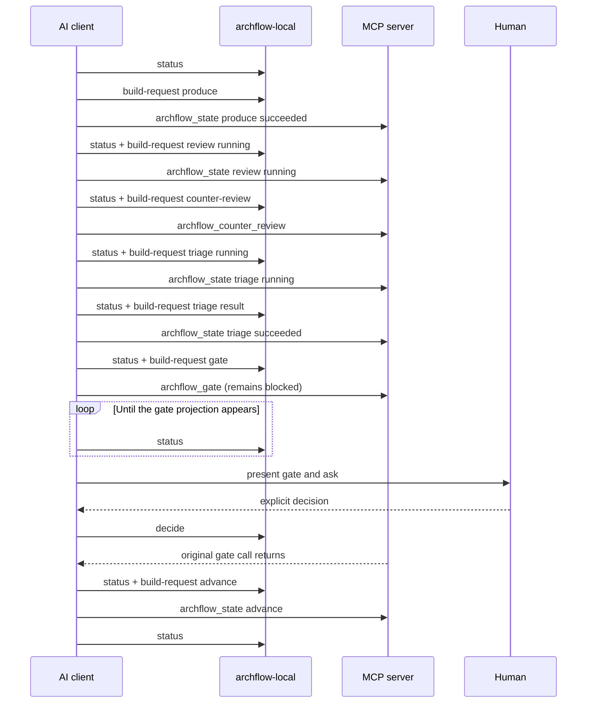
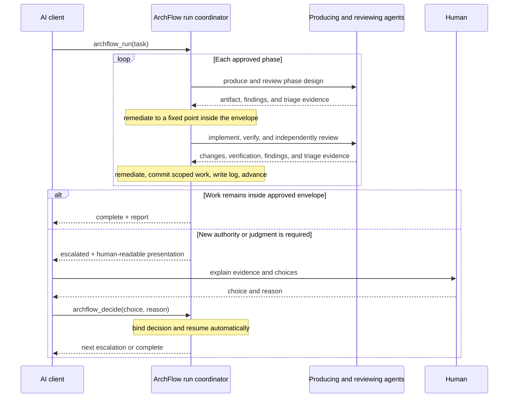

# Client workflow interface audit

**Audited:** 2026-08-14 · **Commit:** `6637099` · **Status:** recommendation for follow-up; not implemented

This audit starts from the actions an AI client actually needs to perform, then compares those actions with the current CLI and MCP surface. It now also accounts for the intended next iteration: once the human approves the task design and phase plan, ArchFlow should execute the remaining phase-design and implementation loop autonomously, with human escalation as an exception.

That changes the target boundary. The recommendation is still to keep ArchFlow's durable state machine and trust checks, but the post-design public API should be a control plane over an autonomous run, not an action-by-action facade over worker activity.

This audit now makes a second interface decision: **MCP is the only supported public workflow transport, and one durably fenced coordinator is the exclusive live mutation gateway.** The CLI must not compose requests for MCP, mutate live task state, resolve decisions, or act as a parallel workflow client. Canonical durable records remain the restart and recovery authority. Bootstrap stays local, and exceptional diagnostic knowledge moves into a separate `$archflow-doctor` skill with a task-state-read-only CLI fallback only when MCP is unavailable or lacks compatible diagnostic capability.

This is a proposal for a follow-up. It does not change the current workflow policy or implementation.

## Conclusion

The current interface is a transaction API wearing a workflow wrapper. `archflow-local build-request` successfully removes most manual digest and payload construction, but the client still has to understand and sequence the underlying state machine.

A normal, already-started document phase with no rework takes seven MCP mutations. Each is normally preceded by request composition and followed by status. A gate additionally requires a long-running MCP call, status polling, and an out-of-band CLI decision. The client is not merely reporting its work and judgment; it is acting as ArchFlow's workflow coordinator.

Collapsing those calls into `submit work`, `submit triage`, and `decide` would improve the current interactive workflow, but it would preserve the wrong post-design ownership model. After design approval, work submission, review dispatch, triage, remediation, verification, commits, and phase advance are worker-loop operations. They should not be public actions that the outer client must drive.

The post-design target should instead be:

- one call to start or resume autonomous execution;
- optional status reads for observation, never to make progress;
- one call to resolve a rare escalation, which automatically resumes execution when safe;
- explicit pause or cancel controls initiated by the human;
- a completion report when the approved design has been implemented.

The server may retain every current transition, receipt, digest, review, and re-verification internally. Public call count and durable transition count do not need to match. In the routine case, the public action is `run this approved design`, not `advance this state machine one transition` and not even `submit each unit of worker output`.

All normal workflow actions should enter over MCP and be admitted by the coordinator holding the current durable fence. The CLI should never manufacture a request using today's installed code for an MCP server process that may still be running yesterday's loaded code. Moving request construction behind the coordinator is therefore a coherence fix as well as a usability simplification.

Four terms must remain distinct throughout the follow-up:

- **Canonical authority** — durable state, receipts, evidence, and repository observations from which truth is reconciled.
- **Live mutation gateway** — the coordinator holding the current durable fencing generation for the repository and task run.
- **Public transport** — MCP, through which supported workflow and diagnostic intentions reach a coordinator candidate.
- **Process instance** — one ephemeral MCP server created by one host session; it owns nothing merely because it is alive.

The CLI is outside that authority chain except for bootstrap and task-state-read-only unavailable-server diagnosis.

## Client-first action map

The useful boundary is where information or authority crosses between the human and ArchFlow. After design approval, the producing and reviewing agents are parts of ArchFlow's execution loop rather than independent public actors.

### Before design approval: interactive definition

The human and the client are still defining what may be built. These are genuine public interactions:

| Client action | Information or authority crossing the boundary | ArchFlow owns | Expected response |
|---|---|---|---|
| Inspect or resume | Task identifier | Reconciliation, current position, resource discovery, recovery classification | Current position and exactly one semantic next action |
| Start a task | Task identifier | Task initialization, pinned configuration, initial write window | Writable resources and the work expected next |
| Submit PRD or task-design work | Authored artifact, review judgment, and optional human-facing synthesis | Capture, validation, review dispatch, evidence retention, and fixed-point mechanics | Revision work or a human approval presentation |
| Relay a document decision | Server-issued choice, human reason, and only choice-specific rationale; task-design approval covers the exact design and its bounded execution envelope | Gate bindings, provenance, exact scoped milestone commit and observation, the next write window, and durable run authorization when design is approved | Revision work or an execution-ready view only after the approved design commit is observed |

The earlier `submit work` and `submit triage` facade remains a useful way to simplify this interactive portion. It is not the correct public model after the delegation boundary.

### After design approval: autonomous execution

| Client action | Information or authority crossing the boundary | ArchFlow owns | Expected response |
|---|---|---|---|
| Start or resume the run | Task identifier; the existing design approval is the authority | Phase design, implementation, review, triage, remediation, verification, scoped commits, implementation logs, and phase advance | Completion or a rare human-readable escalation |
| Observe | Task identifier; optional progress-detail request | Reconciled progress and recovery classification | Current semantic progress without changing it |
| Resolve an escalation | A choice and reason addressing the new authority or judgment ArchFlow lacks | Binding the decision, updating the delegation envelope when applicable, and resuming the run | The next escalation or completion |
| Pause | Explicit human control | Stop at a safe durable boundary | Paused state that can be resumed |
| Cancel | Explicit human control and confirmation proportional to cleanup risk | Stop execution without inventing completion; preserve or clean task-local state according to policy | Canceled state and recovery/cleanup report |

The client should not submit routine phase work, review dispositions, verification transitions, commits, or phase advances after design approval. It also should not supply revisions, fingerprints, request digests, intent receipts, phase/step/status triples, artifact paths already known from state, rubric identity, gate IDs, evidence ordering, gate contexts, or waiver-origin archive bindings.

### The delegation envelope

Task-design approval must identify the boundary of the autonomous run. At minimum that envelope consists of:

- the approved PRD, task design, architecture, and phase plan;
- repository constitution and task configuration;
- the authorized repository and task-local scope;
- the allowed local commands and Git effects;
- the absence of unapproved external, destructive, privileged, or security-sensitive side effects.

Inside this envelope, ordinary implementation judgment is delegated. Outside it, ArchFlow must stop at a durable boundary and ask for new authority. The envelope should be a semantic policy derived from approved durable artifacts, not another caller-authored digest bundle.

The envelope must be enforced as worker capabilities, not only written into a prompt. Write-capable workers receive a dispatcher-controlled filesystem scope limited to the authorized worktree and task files, with other tasks and Git metadata excluded. Network/external access, privileged operations, destructive operations, and writes outside that scope are denied unless the approved envelope grants a specific capability. Workers may inspect Git but cannot stage, update refs, or commit; those effects remain coordinator-owned under the repository fence. A denied capability request returns structured evidence to the coordinator, which either proves it is already authorized or escalates before execution.

### Exceptional diagnostics

Diagnostics are a separate client intent, not extra protocol knowledge embedded in every workflow skill.

| Client action | Information or authority crossing the boundary | ArchFlow owns | Expected response |
|---|---|---|---|
| Diagnose | Optional task identifier and the observed symptom | Compatible MCP inspection of registration, loaded build, durable compatibility, run ownership, recovery artifacts, Git scope, and dispatch health | Human-readable diagnosis and one safe next action |
| Authorize repair | Explicit approval of a presented repair when one is necessary | Re-authentication, exclusive maintenance checks, and the smallest bounded repair | Reconciled workflow view or a clear restart requirement |

Normal skills should only recognize a semantic `blocked` result whose presentation says diagnostics are required, then direct the user to `$archflow-doctor`. They should not carry the diagnostic procedure, CLI recipes, schema knowledge, or repair mechanics themselves.

## The current action surface

The public vocabulary is spread across four layers:

- 17 `NextActionCode` values in [`src/state/next-action.ts`](../../src/state/next-action.ts#L12);
- 7 `build-request` kinds in [`src/local/build-request.ts`](../../src/local/build-request.ts#L38);
- 4 MCP tools in [`src/contracts/tool-names.ts`](../../src/contracts/tool-names.ts#L1);
- 14 flat CLI commands in [`src/local/commands.ts`](../../src/local/commands.ts#L35).

Those counts are not intrinsically bad. The problem is that the client translates between them. One conceptual action can have five representations:

1. `status.next_action.code`;
2. a full `status.next_action.request` template with placeholders;
3. a `build-request` kind plus client-authored facts;
4. a call envelope containing a resolved full request and staged reference;
5. the MCP invocation itself.

The mapping is important enough to have its own contract test in [`test/unit/request-templates.test.ts`](../../test/unit/request-templates.test.ts#L353). Brief status removes the request and guidance, so normal skill prose must teach the mapping that full status and the tests already encode ([`src/state/status.ts`](../../src/state/status.ts#L234)).

### MCP tools

| Current tool | What the client must understand |
|---|---|
| `archflow_state` | Task creation, phase hand-off, step entry, terminal success/failure, phase/step/status legality, and optional artifacts |
| `archflow_counter_review` | That review first needs a separate `counter_review/running` transition and which staged request to pass |
| `archflow_gate` | Gate kind/context construction and a blocking open-and-resolve lifecycle that depends on another interface writing the decision |
| `archflow_waiver` | The archived origin gate, decision/context/subject/evidence digests, rule, scope, and a second blocking gate lifecycle |

Every full tool request exposes `schema_version`, `task_id`, `intent_id`, `expected_revision`, and `input_fingerprint`; the staged alternative exposes task, intent, and request digest ([`src/contracts/mcp-tools.ts`](../../src/contracts/mcp-tools.ts#L39)). These values matter to ArchFlow's integrity model, but none expresses client judgment.

The MCP catalogue also provides schemas but no purpose-level tool descriptions: the descriptor is only `name`, `inputSchema`, and `outputSchema` ([`src/mcp/tools.ts`](../../src/mcp/tools.ts#L19)). The skills therefore serve as an external protocol manual for an API that is not self-describing.

The full-payload-or-staged-reference input union creates a second usability problem. A known host breaks root combinators, so ArchFlow advertises a merged, mostly optional object and explains the mutually exclusive parameter groups in prose ([`src/mcp/tools.ts`](../../src/mcp/tools.ts#L248)). Even after a custom reference pruner and reduced error projection, the serialized four-tool catalogue is about 105 KB ([`test/contracts/mcp-advertised-schema.test.ts`](../../test/contracts/mcp-advertised-schema.test.ts#L354)). Much of that context describes internal artifact, gate, and error shapes.

### CLI commands used by the normal loop

The normal workflow crosses both transports:

- `status` discovers the next transition;
- `build-request` composes and stages it;
- `envelope` handles requests the composer does not cover;
- an MCP tool performs the authoritative mutation;
- `decide` writes a gate decision while the MCP call waits;
- `manual-status` is a second status surface selected based on capability.

The other CLI commands mix setup (`init`, `upgrade`), retained-result maintenance (`snapshot`, `restore`, `clean`, `reconcile`), and contract/debug adapters (`validate`, `hash`, `render`) into the same flat namespace.

`build-request` is the right place for mechanical derivation under the current architecture. It derives the values correctly and stages them safely. It does not, however, hide the workflow. The caller still selects `running`, `produce`, `counter-review`, `triage`, `gate`, or `advance`, invokes the matching MCP tool, and checks status again.

### The two executables can run different contracts

The MCP entry point creates its handlers once inside a long-lived stdio process ([`src/main.ts`](../../src/main.ts#L1)). Every `archflow-local` call is a new process that imports and dispatches the CLI implementation currently installed on disk ([`src/local/main.ts`](../../src/local/main.ts#L1)). If ArchFlow is updated while a host session remains open, the CLI and MCP process can therefore execute different code and contract versions.

That skew is especially dangerous because the CLI does not merely display information. It composes authenticated requests, stages payloads, writes decisions that unblock outstanding MCP calls, reconciles state, and exposes repair operations. A request digest can prove which bytes crossed the boundary; it cannot prove that the two processes assign those bytes the same semantics.

The correct boundary is one exclusive live mutation gateway. A loaded MCP process may become that coordinator only after it acquires the current durable fence; it then derives its own requests and performs its own authoritative mutations. Durable state remains on disk so a compatible replacement process can reconcile and resume after restart. A loaded-versus-installed build mismatch produces a semantic `blocked` presentation whose reason is restart required; a durable contract/schema incompatibility produces an upgrade or migration diagnosis. Neither case instructs a newly loaded CLI to mutate state around the older process.

## Current happy-path choreography

From an already-open produce write window, a no-rework document phase takes these seven MCP mutations:

1. record `produce/succeeded`;
2. record `counter_review/running`;
3. dispatch review and record `counter_review/succeeded`;
4. record `triage/running`;
5. record `triage/succeeded`;
6. open and resolve the approval gate;
7. record the phase advance.

Task initialization adds another mutation. Each mutation normally has its own `build-request` invocation and surrounding status reads. The integration journey encodes the five pre-gate build/invoke pairs and gate construction directly in [`test/integration/status-request-roundtrip.test.ts`](../../test/integration/status-request-roundtrip.test.ts#L243), with the separate hand-off at [line 547](../../test/integration/status-request-roundtrip.test.ts#L547).

Externally, that is seven request-composition calls, seven MCP calls, one CLI decision write, and at least seven routine status reads: roughly 22–23 machine interactions before any additional Git work. “Atomic” in the target design means one client intent, not one filesystem transaction; the server may still record the eight crash-safe revisions represented by the seven MCP calls.

The test helper for gates has to start the MCP invocation as a pending promise, poll status until the gate appears, call the local decision writer, and then await the original invocation ([`test/integration/status-request-roundtrip.test.ts`](../../test/integration/status-request-roundtrip.test.ts#L217)). That is an accurate demonstration of the client contract, not merely test scaffolding.

## Complexity classification

The safest collapse distinguishes authority changes from routine autonomous labor.

| Keep as a visible human or control-plane boundary | Keep internally, hide from the client |
|---|---|
| Approval of the exact PRD and task design, including the bounded delegation envelope | Gate IDs, subject/context/evidence digests, decision archive paths |
| A material requirements, architecture, phase-plan, scope, or safety-policy change | Routine phase-design drafting, implementation choices, and parent-document synchronization inside the approved design |
| A constitution exception or waiver grant/deny decision | Waiver-origin reconstruction and re-authentication fields |
| A product judgment that the approved artifacts do not resolve | Review triage that can be resolved from those artifacts and repository evidence |
| An unsafe, external, destructive, privileged, or ambiguous repository operation outside delegated authority | Scoped local edits, verification, milestone commits, commit observation, and phase advance inside delegated authority |
| Explicit pause or cancel control | Running-entry markers, hand-offs, retries, and normal recovery |
| Honest escalation when durable authority is ambiguous | Intent IDs, expected revisions, fingerprints, receipts, and replay routing |
| Completion and an auditable report | Each intermediate phase result and transition |

These checks remain load-bearing but become internal execution invariants:

- an independently produced opposite-client review runs before an automated checkpoint can close;
- significant revisions invalidate stale evidence and start a fresh review cycle;
- a phase design must exist, be reviewed, and satisfy the approved task design before implementation begins;
- verification and review must reach their configured fixed point before a scoped commit;
- tasks remain isolated, implementation deviations update parent documents, and each completed phase writes an implementation log.

Two internal details deserve special care:

- **Produce running is meaningful.** It opens a durable write window. Before design approval, a public submission service may own that transition. During an autonomous run, the runner owns it.
- **Intermediate states are useful for crash recovery.** A compound public call may write many durable transitions. If interrupted, `run` or `status` should resume or describe the semantic operation, not ask the client to reconstruct the last low-level request.

## Specific leaks to remove

### The client chooses state transitions

`archflow_state` accepts the phase, step, and status directly. `build-request` validates that choice, but the client still decides whether it is entering review, entering triage, recording success, or advancing. Those choices are deterministic from current durable state plus the result the client is submitting.

### Automatic work requires explicit client calls

The counter-review handler already derives the subject and rubric, dispatches the rubric and constitution reviews, and atomically installs their terminal evidence. Requiring a separate state call to enter review adds no judgment. The same is true of triage's running marker after the client has already authored all dispositions.

### Gates invert the request/response model

`archflow_gate` does not return “human input required.” It opens a gate and waits, polling `gate.decision` every 500 ms ([`src/state/gates.ts`](../../src/state/gates.ts#L847), [`src/state/gate-wait.ts`](../../src/state/gate-wait.ts#L49)). The client must create that decision through a different interface while the request is outstanding.

The simple pieces already exist: status can render a conversational `{title, summary, details, question, options}` presentation, and the local decision writer accepts a choice token plus reason while deriving the live bindings. Those should be the MCP contract.

### Waivers expose data the server immediately re-authenticates

`archflow_waiver` requires the caller to reconstruct an archived origin containing gate IDs, three digests, phase, rule, scope, and evidence bindings. The handler then re-reads the archive and verifies every supplied field ([`src/mcp/handlers/waiver.ts`](../../src/mcp/handlers/waiver.ts#L50)). The human owns the request and the grant/deny choices; ArchFlow owns their bindings.

### The common path has special construction exceptions

`build-request` has no waiver or failure-result kind. Initialization cannot use staging. `attempts-exhausted` falls back to a status prefill plus `envelope`. A staged reference is normal, a full payload is the fallback, and waiver reconstruction is separate again. These exceptions force the skills to remain a detailed protocol implementation.

### Status is duplicated and does not travel with mutations

Normal phase skills use `status`; the status skill uses `manual-status`; the client chooses between them based on server availability. Mutation results then expose low-level success data rather than the same semantic next-action view, so the skills must issue a read after every write.

### Diagnostic machinery leaks into normal skills

When the same skills must handle installation checks, MCP absence, version skew, malformed durable state, locks, receipts, Git ambiguity, and repair commands, their normal workflow instructions become an operational manual. That context is expensive even when nothing is wrong, and it encourages the ordinary client to improvise recovery.

The main skills should understand only semantic workflow results. A dedicated `$archflow-doctor` skill should own health inspection and recovery presentation, default to read-only operation, and load only when explicitly requested or when the workflow reports that diagnostics are required.

### A semantic submission facade is still too low-level after design

`submit work` and `submit triage` correctly collapse the current transition protocol, and they remain useful before the task-design delegation boundary. Exposing them for each post-design phase would still make the outer client schedule ArchFlow's workers and review loop. The outer client should start a run; the run should own those private submissions until it completes or discovers that it lacks authority.

## Recommended interface split

Do not mix workflow control, diagnostics, worker protocol, and durable-kernel mechanics into one client-facing surface.

| Layer | Consumer | Responsibility | Visibility |
|---|---|---|---|
| Public control plane | Normal workflow skills and human | Start/resume, observe, resolve escalations, pause/cancel | Small advertised MCP surface admitted by the fenced coordinator |
| Diagnostic plane | `$archflow-doctor` | Inspect runtime health, version coherence, recovery state, and safe repair choices | One compact MCP tool; task-state-read-only local fallback if the tool is unavailable |
| Private worker protocol | Run coordinator and producing/reviewing agents | Submit artifacts, verification facts, findings, triage, and remediation results | Internal service calls or tightly scoped child-agent contracts |
| Durable workflow kernel | Control plane and worker coordinator | State transitions, evidence bindings, reviews, gates, receipts, digests, commits, and recovery | Existing internal modules; not model-authored API payloads |

The existing state, counter-review, gate, and waiver handlers can remain as kernels during the transition. The current `build-request` logic is also a useful derivation library. Neither needs to remain an advertised client protocol or a separately invoked executable.

MCP is the only supported public transport for authoritative workflow transitions, decisions, repairs, and commits. An MCP process is only a coordinator candidate; it must acquire the current durable fence before mutating. Authorized workers may still write bounded work products under that coordinator's repository execution fence. In-memory session state is never authoritative: durable state, receipts, evidence, and fencing generations support restart and recovery.

### Public post-design control plane

| Proposed tool | Minimal client input | Server behavior |
|---|---|---|
| `archflow_status` | `task_id`, optional progress detail | Return a reconciled `WorkflowView`; observing is never required to keep work moving |
| `archflow_run` | `task_id` | Start, attach to, or resume the one durable autonomous run and drive it until completion or escalation |
| `archflow_decide` | Server-issued decision/choice binding, human reason, and only option-specific rationale; task may be derived from the binding | Resolve any live workflow, escalation, waiver, or diagnostic-repair presentation and automatically continue when the decision restores authority |
| `archflow_control` | `task_id`, `pause` or `cancel`, plus confirmation only when required | Apply explicit human control at a safe durable boundary |

Each advertised input must retain a plain object root. Every tool needs a purpose-level description and returns the same `WorkflowView`. The routine run vocabulary should stay small:

- `ready` — task design is approved and the run may start;
- `running` — autonomous work is continuing without client action;
- `escalated` — new human authority or judgment is required;
- `paused` — the human stopped work at a safe boundary;
- `canceled` — execution was explicitly ended without inventing completion;
- `blocked` — execution cannot continue and no valid workflow decision is currently available; its presentation may say that restart, upgrade, or `$archflow-doctor` is required;
- `complete` — all approved phases finished, with a concise result and commit report.

An `escalated` view carries a conversational presentation: what happened, why it is outside the delegation envelope, relevant evidence, the available choices, and their likely effects. Gate IDs, digests, internal paths, and protocol codes remain diagnostic detail. `restart-required` and `upgrade-required` are reasons presented under `blocked`, not additional workflow states. A `running` response is valid only if work continues independently; status polling must never be the engine that advances the run.

The exact transport can remain simple for the prototype. `archflow_run` may stay open until a boundary or use a durable background runner. Either way, an interrupted call must be safely re-runnable from durable state, and a normal run must not require the client to call `run` once per phase. The transport choice should be proven against real host timeout and process-lifetime behavior before implementation is fixed.

### Diagnostic surface and skill

Add one compact `archflow_diagnose` MCP tool for `$archflow-doctor`, with an optional task identifier and diagnostic scope. Its response should be a human-readable report plus one semantic next action, not the low-level state/review/gate schemas removed from the normal catalogue.

Splitting the skill removes diagnostic procedure from normal skill instructions; it does not make the diagnostic descriptor invisible to an MCP host. That trade is acceptable only if `archflow_diagnose` stays compact and the entire advertised catalogue is measured in real hosts. If diagnostic invisibility later becomes necessary, it requires capability-scoped tool discovery—not a second server and not merely another skill.

The doctor should inspect, as applicable:

- MCP registration and launchability;
- the server's loaded build identity versus the installed and registered build;
- durable document and workflow-schema compatibility;
- active-run ownership, stale ownership, locks, receipts, and resumability;
- repository root, Git scope, unrelated changes, and attribute assumptions;
- producer/reviewer dispatch availability and host authentication.

`archflow_diagnose` is non-repairing and observation-only with respect to task workflow state, the worktree, and Git. It may append only a bounded diagnostic proposal/receipt to repository-scoped maintenance state. When a task-state repair is safe to offer, it returns a conversational repair presentation whose server-issued decision/choice binding is resolved through `archflow_decide`. Diagnostic decisions use the same resolver contract as workflow decisions, but their authenticated proposal and replay receipt live independently of the possibly malformed task state. The binding covers the exact observed bytes, proposed repair, coordinator contract/build compatibility, and fencing generation. Under the exclusive maintenance fence, `archflow_decide` re-authenticates the observation and applies the repair only if the proposal is still current.

If MCP cannot start or the active server predates the compatible diagnostic tool, the doctor may use a local read-only command to inspect installation and registration and may repair bootstrap configuration with explicit approval. That fallback must not interpret or mutate task workflow state; once a compatible server can start, workflow diagnosis and repair return to MCP.

Keep this as one skill, not a second diagnostic MCP server. A second server would create another coordinator candidate, catalogue, availability path, and version boundary. The normal skills should not mention `archflow_diagnose`, CLI fallbacks, build identities, locks, receipts, or repair recipes. They only present the server's concise blocked result and point to `$archflow-doctor`.

### Administrative migration surface

Stateful legacy adoption also needs an explicit semantic MCP route. Add a compact `archflow_upgrade` tool whose plain-object input is the legacy source and distinct target task identifier. It performs read-only inspection and returns the migration preview as a server-issued maintenance decision presentation. `archflow_decide` re-authenticates that preview under the repository maintenance fence and performs the approved adoption; denial or cancellation leaves no partially canonical task. `$archflow-upgrade` becomes a thin guide over those two semantic calls, and the tool is included in the whole-catalogue budget.

### Pre-design facade

The MCP-only decision also applies before task-design approval; this facade is required in the same follow-up, not deferred:

| Proposed tool | Minimal client input | Server behavior |
|---|---|---|
| `archflow_start` | `task_id` | Create and pin the task, open the initial PRD write window, and return the common workflow view |
| `archflow_submit` | `task_id` plus a nested pre-design submission of `work`, `triage`, `reopen`, or `failure` | Derive and perform capture, review, triage, remediation entry, and nonblocking human-presentation creation until new client or human content is required |
| `archflow_decide` | The common server-issued decision/choice binding and human rationale | Resolve PRD/design approval or revision through the same decision contract used later |

The advertised inputs retain plain object roots; discriminated submission variants stay below the root. Once task-design approval commits and observes the exact design milestone and mints the execution-ready state, `archflow_run` takes ownership. Phase work and triage stop being public submissions.

### Target post-design journey

`archflow_status` may observe this journey, but it is absent from the routine sequence because no status call should be required between phases or internal transitions.

### Escalation policy

Escalation is for missing authority or irreducible human judgment, not ordinary difficulty. ArchFlow should normally handle review findings, repairable verification failures, editorial corrections, evidence invalidation, routine parent-document updates, milestone commits, and phase transitions itself.

Escalate when at least one of these is true:

- continuing would materially change a requirement, architecture decision, phase plan, or authorized repository scope;
- the constitution fails or is uncertain, or a waiver is required;
- the implementation reveals a product tradeoff that the approved PRD and design do not resolve;
- a command or edit would have an unapproved external, destructive, privileged, credential, secret, or security-sensitive effect;
- repository drift, unrelated changes, merge conflicts, or recovery ambiguity make the safe commit scope uncertain;
- review or verification repeatedly fails to converge after the configured autonomous remediation budget;
- durable authority is inconsistent and cannot be repaired without choosing among plausible histories.

An escalation should identify the smallest new decision that restores a safe envelope. A successful decision resumes automatically; it must not require a separate `advance`, `gate`, or `run` handshake. Denial, pause, cancel, or an unresolved safety condition may end in a durable non-running state.

The runner must not “try and report” an unauthorized side effect. Worker sandbox/capability enforcement prevents it first; the resulting permission request is what the human reviews.

## Recommended atomic boundaries

### Run

One post-design call should take responsibility for the whole authorized execution loop:

1. require and re-authenticate the approved task design and delegation envelope;
2. reconcile durable state and resume the current semantic operation if one is incomplete;
3. produce the next phase design;
4. run the opposite-client and constitution reviews, triage findings, remediate, and repeat until the phase design reaches a fixed point inside the envelope;
5. record the reviewed phase design and enter implementation without a public hand-off;
6. implement, run verification, review the exact result, triage findings, remediate, and repeat until the implementation reaches a fixed point;
7. synchronize parent documents and write the implementation log;
8. create and verify the exact scoped milestone commit;
9. advance to the next phase and repeat, or return the task completion report.

The runner may keep the current fine-grained state transitions and transactions. They are durable checkpoints within one semantic run, not invitations for the client to drive the next transition. Normal review findings and test failures stay inside the loop. A configured remediation limit changes an endless loop into a human-readable escalation; it should not turn every failed attempt into a gate.

The runner owns materiality classification for its own revisions. Any change that can invalidate review evidence starts a fresh automatic review cycle; only demonstrably editorial changes may take the existing one-hop path.

### Decide

Decision presentation and resolution should be separate durable operations but not a blocked request plus filesystem side channel:

1. the originating operation durably records a server-issued presentation in the appropriate authority domain—workflow state for an escalation, or repository maintenance state for a diagnostic repair;
2. the client converses with the human;
3. `archflow_decide` resolves the binding to that exact presentation, acquires the applicable fence, re-authenticates its observations, records provenance and replay protection, and applies the chosen effect;
4. when a workflow decision restores authority, the same operation resumes the run until completion or the next escalation.

A choice that requires an amended PRD or task design may cause ArchFlow to draft the amendment and return a new exact-document approval presentation. That is still one rare escalation conversation, not a return to transition-by-transition orchestration. A `waiver-requested` choice should automatically derive and open the waiver decision. The human's later grant/deny remains separate because it is genuinely new authority.

### Pause and cancel

Pause should take effect at the next safe durable boundary and preserve a resumable run. Cancel should stop without marking unfinished phases complete. Cleanup that would remove material work or evidence needs a separate explicit confirmation or remains a later administrative action.

### Commit and hand-off

- PRD approval should create and observe the exact approved PRD milestone commit, then advance directly to task design.
- Task-design approval through `archflow_decide` should acquire the repository fence, re-authenticate the exact approved bytes, create and observe the scoped task-design milestone commit, and only then return `ready` with durable authorization for phase-design and implementation milestone commits inside the delegation envelope.
- The runner should compute, stage, inspect, create, observe, and report each exact scoped commit. Whether the Git subprocess lives in the MCP process or a local service module is not a client concern.
- A diff that cannot be proven task-scoped and within the approved design must escalate before commit.
- Phase hand-off and judgment-free advance are runner operations. They should disappear from the normal client surface.

The final completion report should summarize phases, verification, reviews, deviations, and commits. Completion reporting is observable evidence, not another approval required to make durable progress.

## Internal architecture direction

The smallest implementation is a resumable coordinator above the existing kernels, not a replacement state machine or a generalized job platform:

1. load and reconcile the current task;
2. authenticate the approved task-design delegation envelope;
3. derive the next legal semantic operation from durable state;
4. acquire the repository execution fence before dispatching any write-capable producer, then dispatch producers, verifiers, or independent reviewers with bounded private briefs;
5. materialize each returned value once, derive the same authenticated artifacts `build-request` derives today, and invoke the existing state/review/gate services internally;
6. decide from approved artifacts and evidence whether to remediate, advance, complete, or escalate;
7. preserve every useful intermediate transition for crash recovery, then continue without returning control merely because a transition completed;
8. project a fresh common `WorkflowView` only at a public observation, control, completion, or escalation boundary.

This is more than renaming the current tools. Today the outer skill is the producer and orchestrator while the MCP server dispatches only reviewers. Autonomous execution requires the run coordinator to own producer dispatch as well as review dispatch, or to call an equivalently internal worker service. Producer results and triage judgments become bounded worker outputs, not authority-bearing requests authored by the public client.

Every worker launch carries a mechanically enforced capability profile derived from the delegation envelope. The dispatcher pins the repository/worktree root, exposes only authorized task context, restricts writes to approved paths, denies Git index/ref writes, disables network and external effects by default, and forbids privilege escalation or destructive host operations. Workers cannot self-escalate those capabilities. A permission request terminates or suspends the bounded operation and returns structured escalation evidence to the coordinator.

Intent IDs, expected revisions, fingerprints, request digests, staged request bytes, receipts, and replay checks can remain. The coordinator should generate or derive them. On concurrency or drift, it should resume safely or escalate with a semantic explanation instead of asking the client to rebuild a request.

The staged-request mechanism can remain as an internal hand-off during the transition, but it should not be part of the advertised high-level schemas. Its integrity tests still buy confidence even after the model stops copying the reference.

Task-level ownership is not sufficient because tasks share a worktree, Git index, and branch. For this prototype, serialize write-capable autonomous execution with one durable repository/worktree execution fence. A task run also records its task identity and semantic checkpoint under that fence. Read-only reviewers may still run concurrently against pinned views; a second task that wants to write receives a semantic busy/blocked view rather than a second writer. Isolated per-task worktrees can be reconsidered only when real concurrent-write demand justifies them.

Every write-capable producer dispatch is bound to the repository fencing generation and runs under a coordinator-supervised process identity. A replacement coordinator must confirm that the prior writer exited or was terminated before reclaiming the fence, then reconcile the worktree before dispatching another writer. A stale generation cannot have its result admitted, stage files, or commit. If an orphan may still be editing, or its partial edits cannot be attributed safely, recovery remains blocked and escalates instead of starting a replacement writer.

Keep four internal identities separate: loaded server build, contract/schema compatibility version, ephemeral process instance, and durable fencing generation. The active build and contract bind the fence, but a declared-compatible replacement may recover it after the previous owner and workers are gone. Cancellation and the current semantic checkpoint must survive process loss without making session memory authoritative.

The update policy is explicit: if the installed or registered build changes while a coordinator owns a run, that coordinator finishes or safely terminates its current bounded worker operation, records the next durable checkpoint, dispatches no new worker, releases ownership, and returns `blocked` with a restart-required presentation. A compatible restarted server can then acquire a new generation and resume; a durable contract incompatibility routes to upgrade/migration diagnostics.

Before implementing the coordinator, run a real-host transport spike covering maximum expected call duration, stdio EOF, interruption, and whether pause/cancel can arrive while `archflow_run` is active. Choose an attached `run-until-boundary` call only if those behaviors work. Otherwise choose the smallest durable supervisor/background runner that does. Regardless of transport, reconnecting must be idempotent and status polling must not be required for forward progress.

## Runtime authority and CLI role

The target is not “put every existing CLI command into the MCP catalogue.” It is “make MCP the only supported public workflow transport, then internalize or retire the mechanical commands.”

Keep the local executable only for operations that must exist before or without compatible MCP diagnostics:

- installation, project-scoped registration, and repository initialization;
- version and launch diagnostics;
- a task-state-read-only `$archflow-doctor` fallback when MCP cannot start or lacks compatible diagnostic capability;
- explicitly approved repair of installation or registration so MCP can start again.

The CLI must not construct MCP requests, stage live intents, record human decisions, reconcile or repair task state, run migrations, create workflow snapshots, restore workflow data, advance phases, or commit task work. Stateful upgrade, cleanup, recovery, and migration operations belong to MCP maintenance services so they share the active contract and durable ownership checks.

Move `build-request`, `envelope`, `validate`, `hash`, `render`, `snapshot`, `restore`, `clean`, `reconcile`, `manual-status`, `decide`, and workflow `status` out of the distributed agent-facing CLI. Reuse their pure logic as internal modules where it still earns its place; keep developer-only utilities as repository scripts rather than a second supported workflow frontend.

An independent terminal workflow transport is out of scope for this iteration. If one is wanted later, it requires an explicit transport-policy change and must submit intents to the same durably fenced coordinator service; it must not import the workflow kernel into an independent on-demand mutator.

Diagnostics compare the process's loaded build with the installed and registered build. The loaded coordinator remains self-consistent only through the current bounded operation, then follows the checkpoint-and-stop update policy above. An incompatible attach or durable-state version fails with a concise blocked restart/upgrade presentation. The newly installed CLI never compensates by manufacturing requests for the older session.

## Skill context boundary

Normal workflow skills should contain only human conversation and semantic MCP intentions. They may call `status`, `start`/`submit` before design approval, and `run`, `decide`, or `control` at the applicable boundary. They should not contain `archflow-local` command lines, transport fallbacks, request templates, diagnostic trees, state codes, schema versions, digests, receipts, locks, build identities, or repair procedures.

The target skill map is explicit:

| Current skill | Target role |
|---|---|
| `$archflow-init` | Retain as bootstrap for installation, registration, and repository assets |
| `$archflow-constitution` | Retain as the explicit repository-policy configuration surface |
| `$archflow-upgrade` | Retain as exceptional migration guidance, but perform stateful migration through semantic MCP maintenance operations |
| `$archflow-explore` | Retain for repository documentation; it is outside live task orchestration |
| `$archflow-prd` | Keep as a thin pre-design conversation and semantic MCP client |
| `$archflow-design` | Keep as a thin task-design conversation and semantic MCP client; approval establishes the delegation envelope |
| `$archflow-phase-design` | Retire as a public entry point; preserve useful instructions as an internal producer/reviewer brief owned by the run coordinator |
| `$archflow-phase-impl` | Retire as a public entry point; preserve useful instructions as an internal producer/verifier/reviewer brief owned by the run coordinator |
| `$archflow-status` | Keep as the read-only semantic workflow view, distinct from system diagnosis |
| — | Add `$archflow-run` as the public start/resume entry point for autonomous post-design execution |
| — | Add `$archflow-doctor` as the exceptional health and recovery skill |

Bootstrap and system-health knowledge remain outside the normal workflow skills:

- `$archflow-init` owns installation, registration, and repository bootstrap before compatible MCP services are available.
- `$archflow-doctor` owns health inspection, version-skew diagnosis, recovery explanation, and presentation of any explicitly approved repair. It uses `archflow_diagnose` over MCP whenever possible and the task-state-read-only local fallback only when the server or compatible tool is unavailable.

A blocked normal skill should report the human-readable symptom and direct the user to `$archflow-doctor`; it should not inline the doctor's procedure. Conversely, the doctor must not become an escape hatch for ordinary review findings, test failures, or implementation difficulty—the autonomous runner owns those.

## Policy dependency: rare escalation requires a deliberate trust-model change

The autonomous target cannot coexist with the current requirement for fresh human approval of every review gate, exact phase-design bytes, implementation authorization, and implementation commit. Those interactions are the normal post-design loop, so retaining them would make human involvement routine by definition.

This audit therefore proposes a policy change, not a hidden reinterpretation of the current rules:

| Current policy | Required post-design policy |
|---|---|
| Never pass a review gate or commit without a fresh explicit human approval | Human approval of the exact task design creates bounded prior authorization for automatic post-design checkpoints and scoped milestone commits inside that design |
| Never write code before human approval of the exact phase design | Never write code before a phase design exists, has independent review evidence, reaches a fixed point, and is proven to fit the approved task design; escalate if it does not |
| Every phase-design approval is a human gate | Phase-design acceptance is an internal evidence-based checkpoint unless it changes the approved requirements, architecture, phase plan, scope, or policy |
| Implementation authorization and commit confirmation are separate human decisions | Verification, independent review, scope proof, exact staging, commit, and commit observation are runner-owned; uncertainty or expansion escalates before commit |
| Human revision classification controls review reuse | The runner classifies its own changes conservatively; any potentially significant change triggers a fresh independent review |

The replacement human trust boundary is: **ArchFlow may act autonomously only inside a human-approved task-design envelope, and must durably stop before any action that needs new authority.** Design approval—and any later material design amendment—remains approval of exact human-readable bytes. A broad “do whatever is needed” grant is not an acceptable envelope.

These guarantees remain unchanged:

- automatic opposite-client review and applicable constitution review remain independent of the producer;
- significant revisions invalidate stale evidence and trigger a fresh review cycle;
- review and verification evidence must reach the configured fixed point before an automated checkpoint or commit;
- the phase state machine remains no document → `DESIGNED` → `IN PROGRESS` → `COMPLETE`;
- tasks never read one another's files;
- implementation deviations update parent documents, and a material deviation escalates for design approval;
- each completed phase writes implementation notes;
- human escalations are conversational and omit mechanical bindings by default;
- constitution waivers and other expansions of authority remain explicit human decisions;
- canonical bytes, digests, replay receipts, pinned context, re-authentication, task-scoped Git checks, and atomic state replacement remain authoritative.

Until the repository's governing policy is separately revised and approved, the existing per-phase human gates and commit confirmations remain mandatory. Updating this audit alone does not authorize the runtime to bypass them.

## Follow-up implementation order

1. Make and approve the explicit policy decision: define the task-design delegation envelope, automatic checkpoint/commit authority, and escalation conditions before changing enforcement.
2. Run a real-host spike for tool-call lifetime, stdio EOF, concurrent pause/cancel, reconnect, and whole-catalogue advertisement/tool selection. Choose attached versus minimally supervised execution and set a measured catalogue budget before fixing the contracts.
3. Define the common `WorkflowView`, public `start`/`submit`/`status`/`run`/`decide`/`control` contracts, compact diagnostic and upgrade contracts, common server-issued decision binding, four internal identities, update policy, repository execution fence, worker capability profile, and task-run checkpoint semantics.
4. Extract internal semantic services from `build-request` and the current state/review/gate handlers so the coordinator can call them without CLI or MCP self-round-trips.
5. Add `archflow_diagnose`, `archflow_upgrade`, build/session mismatch detection, repository-scoped maintenance decisions, and the task-state-read-only `$archflow-doctor` path; reduce the CLI to bootstrap and unavailable-server diagnosis before removing its mutation commands.
6. Add a resumable coordinator for one complete phase, including capability-restricted and fenced producer dispatch, orphan-worker recovery, independent review, triage/remediation, verification, scoped commit, and advance.
7. Make escalation opening nonblocking and resolve workflow and diagnostic presentations through the common `archflow_decide` path; make a successful decision resume the coordinator automatically.
8. Extend the coordinator across all approved phases and produce one completion report.
9. Complete the required pre-design `start`/`submit` facade; rewrite the normal and upgrade skills as thin semantic MCP clients; retire the public phase skills; add `$archflow-run` and `$archflow-doctor`; and prove the routine and exceptional journeys in real hosts.
10. Retire the low-level MCP tools and agent-facing CLI workflow commands from the advertised/documented surface. Because ArchFlow is a prototype, prefer a direct replacement over a compatibility layer unless a current user requirement demonstrates the need for one.

## Acceptance criteria for the follow-up

- After task-design approval, the happy path requires one public `archflow_run` call, zero human prompts, and no client-managed calls between phases.
- No normal skill mentions `archflow_state`, `phase_instance`, explicit `running`/`succeeded`/`failed` transitions, `expected_revision`, `input_fingerprint`, `request_digest`, `intent_id`, `staged.reference`, `build-request`, `envelope`, work submission, review triage, gate opening, commit confirmation, phase advance, `archflow-local` fallbacks, locks, receipts, or build identities.
- After repository initialization, normal workflow skills execute zero `archflow-local` workflow invocations; this does not prohibit the runner or its workers from using Git, tests, or model CLIs as bounded implementation tools.
- No CLI command constructs an MCP request, stages an intent, writes a decision, mutates task workflow state, or commits task work.
- Every authoritative workflow mutation is performed by a compatible coordinator holding the current durable fence and reached through MCP; no operation is implemented as a CLI call followed by an MCP mutation or as an MCP call waiting on a CLI/file side channel.
- Updating the installed server while an older coordinator owns a run lets only the current bounded operation reach a safe checkpoint, then yields a `blocked` restart-required presentation before any new dispatch; the newly installed CLI cannot mutate around it.
- A restarted compatible MCP process reconstructs semantic progress from canonical durable records without relying on lost session memory.
- Two host sessions or two tasks cannot concurrently dispatch write-capable workers into the same repository/worktree.
- An orphaned producer is confirmed stopped before ownership recovery; its stale result cannot be admitted, staged, or committed, and ambiguous partial edits fail closed.
- `$archflow-doctor` owns diagnostics; normal skills only relay the semantic blocked result and how to invoke it.
- `archflow_diagnose` uses the same MCP transport and coordinator implementation, never repairs task/worktree/Git state, writes at most a bounded maintenance proposal/receipt, and returns a compact human report rather than exposing low-level workflow schemas.
- A diagnostic repair is represented by a durable, stale-safe, replay-safe server-issued decision binding independent of malformed task state and is re-authenticated under the repository maintenance fence before application.
- When MCP or compatible diagnostics are unavailable, the doctor's CLI fallback does not interpret or mutate task state and may change installation or registration only after explicit approval.
- Every advertised tool has a purpose-level description; the complete serialized catalogue is measured against the step-2 budget in both real hosts, excludes all internal state/review/gate schemas, and supports correct first-call tool selection without teaching the old protocol mapping in a skill.
- `$archflow-phase-design` and `$archflow-phase-impl` are no longer public workflow entry points; `$archflow-run` owns post-design execution and their useful instructions survive only in private worker briefs.
- `$archflow-prd`, `$archflow-design`, and `$archflow-upgrade` use the semantic MCP facade; the final surface has no deferred pre-design or migration dependency on low-level tools or `archflow-local`.
- Approved PRD and task-design bytes are committed and the exact commits observed under the repository fence before hand-off; `archflow_run` cannot start from an uncommitted design approval.
- `archflow_upgrade` produces a read-only migration preview, and only a replay-safe `archflow_decide` maintenance decision may create the distinct canonical task.
- Write-capable workers are mechanically denied out-of-scope filesystem writes, Git staging/commits, network/external effects, privilege escalation, and destructive host operations unless a specific capability is already in the approved envelope.
- Routine phase-design findings, implementation findings, and repairable verification failures are remediated and re-reviewed internally.
- The runner cannot enter implementation without a durably recorded, independently reviewed phase design that conforms to the approved task design.
- The runner cannot commit without successful configured verification, current independent review evidence, synchronized parent documents, an implementation log, and a proven task-scoped diff.
- Any material expansion beyond the approved delegation envelope produces a durable, human-readable escalation before the action or commit occurs.
- Opening an escalation returns or notifies immediately; no client-managed background MCP call, status polling loop, or filesystem decision side channel is required.
- A human decision requires only a server-issued choice, reason, and genuinely choice-specific rationale; all bindings, including waiver origins, are server-derived.
- A decision that restores authority resumes execution automatically; the client does not call `advance`, `gate`, or `run` again in the routine resolution path.
- Pause and cancel stop at defined safe boundaries and never invent phase completion.
- An interrupted `run` can be reissued without duplicating reviews, transitions, or commits.
- Status is optional observation and reports semantic progress, not the low-level transition the client must perform next.
- Real-host tests prove the selected run transport against expected duration, stdio teardown, reconnect, and pause/cancel while work is active.
- Client-level tests cover a multi-phase zero-escalation run, each escalation category, pause/resume, cancellation, transport interruption, completion reporting, two tasks competing for the repository fence, and an orphaned write-capable producer.
- Adversarial worker tests prove attempted writes outside the authorized scope, direct Git staging/commit, unapproved network/external effects, privilege escalation, and destructive operations are denied before effect and returned as structured escalation evidence.
- Integrity tests continue to prove review independence, evidence freshness, task isolation, digest/replay integrity, crash recovery, safe Git scope, parent-document synchronization, and implementation logs.
- Tests whose sole purpose is to require superseded per-phase human approvals or commit confirmations are replaced by tests proving bounded delegation and fail-closed escalation outside it.
