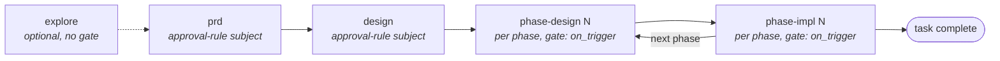

# workflow/LIFECYCLE

**Explored:** 2026-09-03 · **Commit:** `1d71fee` · **Covers:** `assets/workflow.yaml`, `src/contracts/workflow.ts`, `src/contracts/gates.ts`, `src/contracts/config.ts`, `src/state/approval-rules.ts`, `src/state/semantic-*.ts`, `src/mcp/handlers/semantic.ts`, `skills/`

How a task moves from idea to committed code, and where a human must decide.

## The phase graph

The canonical graph lives in `.archflow/workflow.yaml` (shipped from `assets/workflow.yaml`, mirrored as a hard-coded constant in `src/contracts/workflow.ts`). It is short and declarative — five phases, four attributes each: the owning skill, dependency edges (`requires`), whether the phase iterates per phase number, and the gate policy.

One nuance the YAML alone doesn't show: project `approval_rules` decide whether an ordinary clean fixed point waits for a human. A waiting settlement preserves the exact subject/content reason for the presentation. An exact no-wait settlement under the shipped v2 constitution can instead supply upstream, milestone-commit, phase-exit, or successor authority directly. It is evidence the server authenticates, never caller authority; legacy or divergent policy and every exception condition remain human-required.

The optional config section has two lists. `subjects` accepts `prd`, `design`, `phase-design`, and `phase-impl`. `content` entries each carry repository-relative path globs and are considered only for a phase implementation; with writable secondaries each glob is matched against every changed repository's own relative paths, so a glob cannot address a secondary by name. Matching is whole-path, case-sensitive, and `/`-segmented: `*` and `?` stay within one segment, while `**` spans zero or more complete segments (`**/*.sql` therefore matches both `a.sql` and `db/a.sql`). An absent or empty section records `wait:false`.

An implementation content match is more than a path list at presentation time. The settlement freezes the complete matched-path set; the server joins those paths to the retained implementation output to reconstruct each operation and exact signed byte delta. Rename endpoints are evaluated independently: the old path, new path, or both can match, and a rename away followed by a new add at the old name keeps both operations. This evidence is sorted deterministically and survives later `approval_rules` edits unchanged. A waiting conclusion explains the reviewed diff at the human gate; a no-wait conclusion is consumed only through separately derived exact commit facts.

That decision does not silently rewrite the phase. Approval commits first; the active producer then automatically composes the server-derived `advance` operation and re-runs status until the successor or terminal state is durable. This separation preserves replay and auditability without leaving a customer action gap. If a session stops between the two commits, status recommends the exact destination skill and arguments, and that invocation can complete only its authenticated immediate-predecessor hand-off.

The workflow file's bytes are digest-pinned into each task at creation, so changing the graph mid-task is detectable, not silently applied. Tasks pinned to the retired four-step workflow digest (the one with a separate `adjudicate` step) are invalidated and either restart or go through `archflow-upgrade`; there is no graph migration. Task routing config is deliberately different: every dispatch or state transaction reads the live task-local file, records the parsed shape as `last_seen_config`, and later status calls report field-level changes without invalidating retained evidence or gates. The retired `producer` role remains accepted on read; other invalid or unknown fields block as `config-invalid` until the human fixes the file.

## What each stage produces

| Stage | Skill | Artifact | Human approval |
|---|---|---|---|
| explore | `archflow-explore` | the maintained `docs/` set (`OVERVIEW.md`, `section/FILE.md`, stamped with commit + coverage) | review + commit confirmation (not a server gate) |
| task creation | any phase skill | mutable task-local `config.yaml`, `state.json` | — |
| prd | `archflow-prd` | `ask.md` (verbatim request plus clarification Q&A), `prd.md` | `artifact-approval` only when a rule or safety condition requires it; otherwise direct successor authority |
| design | `archflow-design` | `design.md` with a machine-readable `### Phase N:` plan, plus the current `prd.md` projection | conditional `design-approval`; otherwise an exact autonomous milestone commit and successor |
| phase-design | `archflow-phase-design` | `phases/<n>/design.md`, plus the current `design.md` and `prd.md` projections | conditional `design-approval`; otherwise an exact autonomous milestone commit and implementation hand-off |
| phase-impl | `archflow-phase-impl` | code, tracked `phases/<n>/impl-notes.md`, digest-bound ignored verification transcript | conditional `commit-authorization`; every returned exact commit is executed directly after the same Git checks |
| status | `archflow-status` | nothing — read-only | surfaces gates, resolves none |

Tracked task documents and authority live under `.archflow/tasks/<task>/`; transient, cache, and diagnostic bytes live under ignored `.archflow/runtime/tasks/<task>/`. Both resolvers enforce the same containment, symlink, and task boundary. The only shared material is repository policy and the maintained `docs/` set. **Tasks never read each other's files** — this isolation is real and test-enforced.

## How implementation phases are bounded

The default phase is one coherent repository-ready increment: it has one primary outcome, leaves the repository in a valid completion state, receives stable inputs from its predecessors, and has one verification story a human can understand. That shape makes each milestone a useful checkpoint for review, recovery, and later implementation; it avoids phases that are merely arbitrary slices of labor or bundles of unrelated outcomes.

Architecture design performs observable checks in both directions. It merges neighboring phases when neither is a useful outcome without the other, and splits a phase when it contains independently valuable outcomes with separate completion and verification stories. Work chunks do not automatically become phases, and crossing UI, service, persistence, documentation, or other repository layers is normal when the changes jointly deliver one outcome. A broad or unusually small phase can remain when the design names its concrete exception value. A genuinely open-ended plan can remain open-ended for the same reason; the marker is not an escape from boundary reasoning.

The numbered phase-design skill performs one bounded fit check against the reviewed parent plan. If it discovers a materially harmful split, merge, or sequencing defect, the correction travels through the existing compound parent-document result and server authority; it does not create a side-channel planning decision. Phase sizing remains engineering judgment. ArchFlow does not pretend that file counts, layer counts, phase counts, token estimates, or a one-session heuristic can determine the right boundary.

## The pipeline inside each gated stage

Every gated stage runs the same evidence pipeline to a fixed point:

1. **produce** — write or revise the artifact. Its SHA-256 becomes the *subject digest*. Task design records `design.md` with the current `prd.md`; phase design records its phase document with the current `design.md` and `prd.md`. Parents remain in the result across retries. Producers perform one bounded author check against the returned rubric. Only server-dispatched review becomes review authority.
2. **counter_review** — one semantic action dispatches assigned reviewers concurrently and commits their evidence atomically. General review covers broad accuracy, design, and code quality. Phase design and implementation also use the configured test specialist for test strategy, evidence, and quality; without that route, general review owns the complete rubric. Active constitution rules add adjudication. Each child receives a sealed assignment and the same read-only repository snapshot. Implementation review covers declared outputs and current post-change behavior; unchanged files and context-only repositories are evidence, not independent review subjects. Active V2 `claim_type` is exactly `defect`, `risk`, `gap`, or `preference`; each finding also carries confidence and a falsifier, and server-derived counts cover all 12 claim/confidence cells. A defect, risk, or gap makes the V2 verdict `review-raised`, preference-only is `advisory`, and no findings is `pass`. `constitution: {status: "not-run"}` means no active rules exist.
3. **triage** — the producer must disposition **every** rubric finding across five strict dispositions:
   - **accepted** — the finding demands a substantive fix; the work re-enters produce and all evidence is redone against the new bytes. Its owning reviewer receives only the latest accepted intent during remediation.
   - **accepted-editorial** — the fix is purely wording or formatting without changing meaning or commitments. Supported **only** for PRD and design documents (`prd`, `design`); refused for phase-design and phase-impl positions (where substantive changes must use `accepted`). When all accepted findings are editorial, retained review and constitution evidence are preserved for a strictly one-hop predecessor declaration.
   - **rejected** — with a written rationale and evidence demonstrating that the finding is non-material or refuted. Findings prefixed `unverifiable-` mean "the reviewer lacked evidence" and are rejected with an `envelope-gap:` rationale.
   - **escalated-human** — the producer escalates a finding requiring human judgment or architectural tradeoff. An unsettled escalation suppresses autonomous `wait:false` no-wait advancement and routes into the position's ordinary human gate (`artifact-approval`, `design-approval`, `commit-authorization`) or unified adjudication gate, presenting full finding details and rationale.
   - **deferred** — the finding is recognized but postponed to a real later milestone or phase. The server strictly refuses `deferred` for any defect finding (`claim_type: "defect"` or legacy `blocking: true`). V2/V3 risk and gap deferrals require non-blank `evidence` demonstrating non-material consequence for the current scope; preference deferrals require non-blank `rationale`.
   The server enforces strict partition count equality against the filtered dispositions. Triage covers rubric findings only; constitution findings follow their own settlement path.

   The constitution verdict is never triaged, and it is not a human gate by default. Fresh constitution facts come from Adjudication V2 rule slots; fresh drift comes from the primary general reviewer's exact Review V3 upstream census, including when no active rule exists. A failing or uncertain rule and material upstream drift re-enter production until the attempt budget is spent. Only then, or at once when a rule's own `review_trigger` matched, are they carried into the applicable human boundary. Archived Adjudication V1 retains its combined constitution/drift meaning through the same policy-facts adapter. Material drift keeps its separate gate because it governs a different subject and remedy.

On the semantic document path, both an explicit triage submission and review's empty-finding fast path first record `triage: running` through the authenticated `triage-enter` substep. Terminal triage therefore never appears without its normal state-machine entry boundary.

The triage-settle transaction evaluates `approval_rules` and persists its complete conclusion when the fixed point is clean or has a foldable policy-adjudication obligation. Subject rules apply to all four workflow subjects; content globs are evaluated against the paths a result changed — every repository path an implementation touched, and the governing task documents (`design.md`, `prd.md`) a later phase rewrote, which is how the shipped defaults keep a human over the architecture while phase designs and implementations that change only their own phase run autonomously. For a content match, the settlement freezes every matching path; joining that set to the retained output supplies the complete per-path operation and exact signed size change, including both independently matched rename endpoints and overlapping rename/add effects. A fresh ordinary gate copies the exact settlement identity and frozen `{wait, match}` into its required `approval_trigger`, alongside rule-authority provenance and any policy findings. An absent or empty section records `wait:false`; exact authenticated policy consumes that conclusion autonomously only when no matching ordinary approval exists. A matching human approval wins in commit, target movement, recovery, and phase-exit proof. Later config edits may be reported without rewriting the gate reasons, and a planning restart makes old settlements ineligible.

Editing the artifact changes the subject digest, which normally invalidates all downstream evidence — the pipeline re-runs until everything agrees about the same bytes. Re-entry is bounded (`max_attempts`, default 3); exhaustion opens an `attempts-exhausted` gate rather than looping forever. A significant human revision begins a new cycle at attempt 1, so exhaustion counts only attempts since the latest such revision.

**Triage ends the loop, not the finding count.** Only a plain `accepted` disposition forces another round. Rejected and editorial findings are closed. For every non-PRD artifact, the primary general reviewer reruns for a fresh upstream census; every other remediation child receives only its exact latest accepted revision intents. PRD has no upstream census, so its remediation runs only those exact owners and does not reopen an ownerless primary. Ownership is recovered from authenticated run membership and route identity, with version-specific handling for run-less archives. Missing or ambiguous ownership fails closed before dispatch; no reviewer inherits another's finding. The cumulative ledger remains durable for audit and `review_strength`, but is not reviewer memory.

`status.evidence.findings` retains each finding and disposition for audit, but ordinary human approval is not used to triage model polish. Rejected non-material observations stay out of the approval agenda. An envelope gap is disclosed there only when it prevented a material judgment; an `attempts-exhausted` gate instead presents the unresolved material defect and asks whether another revision is warranted. Only the authenticated repeated-review shape adds the separate push-through choice over the exact accepted occurrences.

The fixed-point rule is version-aware rather than version-normalizing. A V2 or V3 defect, risk, or gap is substantive; a preference is not. Archived V1 evidence keeps the equivalent historical rule: a finding is substantive when its recorded `blocking` value is true. Remediation preserves native details. Fresh V3 uses exact owner-bound criterion assignments and an upstream census; criterion-less V1/V2 acceptances use the bounded legacy-confirmation channel instead of being semantically reclassified.

### Validation that could not run

A phase implementation must not report an unrun command as passing. When a required validation cannot run, the producer submits a **failed** work result with an optional bounded validation-override request: 1–32 unique, nonblank descriptions, each at most 1,024 UTF-16 code units, sorted with `localeCompare`. The list names what would be displaced; the accompanying failure reason explains why. No other position or successful work result may carry the request.

The request is its own state operation, `request-validation-override`. Its request digest includes the exact phase, `produce/failed` status, reason, and validation list, so it cannot replay as an ordinary failed boundary. The durable pending request also binds the current input fingerprint, the authenticated governing phase-design result, and the request revision. It stays on the same failed attempt: requesting, granting, denying, or cancelling does not consume a review attempt. A later ordinary retry is what increments the attempt.

The resulting `validation-override` gate uses the pending request—not a review result—as current evidence. Its subject binds the task, phase instance, current input fingerprint, governing phase-design digest, and exact displaced list. The human may grant, deny, or cancel. Every choice returns control to the failed producer boundary. A grant records those exact checks as **not run**; it does not count them as passed. Denial and cancellation add no exception authority. None of the three creates an `ApprovalRef` or `WaiverRef`, and none can bypass counter-review, constitution policy, drift handling, configured approval, or exact commit authorization.

### Continuing after repeated accepted review findings

An exhausted review loop does not automatically offer a bypass. `push-through-review` appears only when retained triage contains at least two distinct completed `review_round_history` entries and the server can derive the complete current set of accepted occurrences. Each occurrence is the pair `{review_evidence_digest, finding_id}`; the gate binds that exact sorted set, the current evidence-set digest, the triage result digest, and the fixed minimum of two rounds. Missing, duplicate, stale, or incomplete history leaves the option absent.

Choosing it advances through the ordinary gate effect and atomically records both authorities: the normal attempts-exhausted approval reference and a specialized review-push-through record. It does not increment the attempt or erase the findings. The exception settles only the repeated-review obstacle. Policy failures, matched review triggers, material drift, configured approval rules, and commit authorization still run in their normal order, so review push-through is never a general phase or policy bypass.

### The editorial revision

When a round's only accepted findings are `accepted-editorial`, the producer applies exactly the recorded revision intents and records produce again — and **nothing re-runs**. The revised artifact declares a server-validated, strictly one-hop `editorial_predecessor` link — `{subject_digest, input_fingerprint, triage_result_digest}` naming the exact reviewed bytes, their inputs, and the triage round that authorized the hop. The retained reviews *and* the constitution verdict stay bound to the declared predecessor for that one hop, and the eventual human gate presents the predecessor→final diff with an explicit disclosure that the evidence evaluated the predecessor bytes. A plain `accepted` disposition anywhere in the round still forces full re-entry — the editorial path exists only for rounds that are editorial through and through.

An editorial round consumes an attempt slot like any other re-entry. That is deliberate: if editorial rounds push a task to its attempt cap, the `attempts-exhausted` gate's retry decision is the intended recovery, keeping the human in the loop rather than letting cosmetic churn extend the loop silently.

### Human revisions after a gate

When the human requests changes at a gate, the producer applies them and classifies the actual diff, explaining the result in plain language. A **simple** revision is strictly typo, formatting, comment, or wording-only work that changes no meaning, behavior, scope, interface, trust boundary, input, verification claim, or parent document. It keeps the attempt count and may retain predecessor review and constitution evidence for one hop, but it cannot resolve or suppress an accepted material finding. The exact small diff is shown and the final bytes always return to the human for approval. A **significant** revision is anything else; uncertainty defaults to significant. It archives old evidence as history, resets the attempt counter to 1, and automatically dispatches fresh reviews before another gate. The human may override the producer's classification in either direction, and the override is durable.

This replaces the former supplemental gate-review loop. There is no optional review after a gate: the ordinary server-dispatched review is automatic before it, and repeats automatically only when a significant human change makes the prior judgment stale. The `baseline-adoption` gate opens before any review by design: it is not approval of produced work but a human decision about which bytes are the reviewed baseline after they drifted.

### The transition edges, precisely

Beyond the forward hand-off (each succeeded step to its successor, same attempt), the state machine (`src/state/transitions.ts`) admits exactly one other same-phase move:

- **any step → produce-running (attempt + 1)** — the "new information" door. From triage this is the accepted-finding (or editorial) re-entry, and equally the policy re-entry for a failed constitution rule or material drift while attempts remain; from a succeeded produce or counter_review it is the author withdrawing to incorporate new information. It opens from a step that is still running or has already failed too, and for a blunter reason: a step whose terminal result cannot be recorded has no forward edge, and retrying the same step only repeats work that cannot succeed — so the produce window, the phase's root, is the one door that is never a dead end. Downstream evidence simply goes stale and is redone — except on the one-hop editorial path, where retained evidence stays bound to the declared predecessor. Produce work already in flight is the exception that keeps the rule honest: `produce: running` settles at its own terminal result first. The same write-window rule applies to an initial phase attempt: once state durably sits at produce running (or failed), implementation edits—including changes to paths projected by an earlier phase—are expected production work, not material drift. Terminal produce seals the new exact subject.

An explicit human-requested **planning restart** is the separate backward edge. From any active nonterminal phase, with no gate open, it may target only a strictly earlier planning position in the total order `prd → design → phase-design-N → phase-impl-N → phase-design-(N+1)`. Restart enters the target at `produce: running` attempt 1, preserves Git and worktree bytes, archives target-and-downstream result references in `restart_history`, clears their active authority plus all waivers and pending human revision, and clears `planned_final_phase` when reopening PRD or task design. Reopening the current planning stage uses ordinary produce re-entry. A material-drift decision of `amend-upstream` invokes this same primitive from its authenticated gate instead of leaving the task stranded at triage.

The phase-completion signal normally fires from **triage-succeeded**: once triage closes the fixed point, the phase can advance through either authenticated human authority or an eligible exact no-wait settlement. Accepted-editorial re-entry can re-establish the reviewed fixed point at **produce-succeeded** using its exact retained predecessor evidence and may record a new rule settlement. A human-requested simple revision is different: it records no settlement, cannot clear an accepted material finding, and always returns to the human for approval of the final bytes. `advance-phase` and `complete-task` are executable actions, not reports: the semantic surface recomputes status and derives the successor before composing the operation. PRD and design boundaries re-authenticate the applicable human-or-rule authority; design also refuses to advance until Git proves the exact task-local milestone commit carries the complete reviewed document set and its bound authority.

That Git proof is descendant-aware but not permissive. The only candidate is the first commit after the authorized baseline on the authorized target's first-parent path, and its parent, message, paths, tree, and authority are validated from the immutable candidate. Later descendants may preserve that proof, but never become the reviewed milestone themselves. Before any hand-off or final completion, status classifies governing-document drift, reconciles ordinary projections, and then resolves this historical proof; the consuming mutation repeats the same ordering under its lock.

Two server-owned no-submission actions keep recovery executable. `refresh-stale-baseline` supersedes an obsolete open baseline interface after its complete path/digest/committedness or target-history subject changes; it records no decision. `recover-milestone-authority` preserves repository bytes but invalidates stale active authority and starts attempt 1 of a significant same-position production/review cycle when proof is missing or a current-owner governing plan changed. A content-preserving rewritten history with no committable delta is not sent into an empty-commit loop: status explains the safe history-restoration or explicit planning-reopen choices instead.

An interrupted handoff has two authenticated owners: the current producer can complete the automatic advance, and a resume invocation for the exact server-derived successor may recover it. Semantic ownership implements that literally: `start-next-skill` is offerable only to the exact successor invocation, while ordinary actions belong only to the current document owner. A different phase number or skill receives the common view but no mutation offer.

### Reopening earlier planning work

Resume never means reopen. An explicit backward correction targets only a strictly earlier PRD, task design, or numbered phase design in the canonical total order. The server derives the target and ordered impact from the invoked skill plus current authority; phase implementation, same/current, forward, terminal, open-gate, repair, and reconciliation positions cannot be reopened.

One restart preserves existing repository bytes except for the PRD ask-history append, archives target-and-downstream results in durable restart history, clears active waivers and pending human revision into that history, resets the target to produce attempt 1, and forces fresh review and approval. PRD reopening appends the human's exact correction request to `ask.md`; task design and phase-design reopening do not. The operation binds the expected ask-prefix digest and validates the exact append on replay. Older approvals remain audit evidence but are cut off from authorizing the restarted generation. Baseline-adoption records likewise remain historical, but their overlays are inert whenever the restart superseded the retained projection they once overlaid; an adoption never creates projection authority by itself.

## Gates: where humans decide

Eleven gate kinds exist (`src/contracts/gates.ts`):

| Gate kind | Opens when |
|---|---|
| `artifact-approval` | a PRD reaches a fixed point with a configured trigger, unavailable rule authority, or policy finding; one decision carries all same-subject reasons and exact eligible waivers |
| `design-approval` | task design or phase design reaches that boundary; one decision covers the complete document set, configured trigger, policy findings, eligible waivers, and milestone commit authority |
| `commit-authorization` | a phase implementation reaches that boundary; one decision covers policy and configured reasons plus exact commit facts, with content triggers showing every frozen operation and byte delta |
| `constitution-review` | the separate waiver grant/deny/cancel decision opened after `waiver-requested`; the policy obligation itself folds into the ordinary gate, which a failed rule reaches only once the attempt budget is spent (a matched `review_trigger` reaches it at once) |
| `material-drift` | an approved upstream document drifted materially and the producer's attempt budget is spent without resolving it (while attempts remain, drift re-enters production with the document named); `amend-upstream` durably restarts at the affected planning document |
| `attempts-exhausted` | the produce/review loop hit its attempt cap (the gate composer's exhaustion arm derives it from the same fixed-point assessment status advertises); after at least two distinct completed review rounds, and only with a complete authenticated accepted-occurrence set, it may also offer the narrow `push-through-review` exception |
| `validation-override` | a phase-implementation producer failed because it could not run an explicitly named validation set and asked the human whether those exact checks may remain not run; grant, deny, and cancel all return to the failed producer boundary |
| `baseline-adoption` | files changed after the recorded review bytes they were left at — typically later commits or a merge — block reconciliation outside a produce window; the human either adopts the current bytes as the reviewed baseline (no re-review; the next implementation phase still reviews what it touches) or restores the recorded bytes; documents a still-owed review must re-read are the exception and never reach this gate, because adopting a path cannot re-bind the recorded result the review is dispatched over (see below); a file deleted by an already-committed change with an adoption-sourced record (no retained bytes to restore, no before-image to re-declare) offers adopting the committed deletion instead, retiring the stale recorded presence (the gate composer derives all three shapes from the reconciliation findings status advertises) |
| `constitution-edit` | legacy compatibility for previously opened policy-edit gates; current counter-review does not emit this gate because task policy is already pinned immutably |
| `restore-collision` | a drift repair would overwrite conflicting bytes |
| `migration-audit` | an atomically adopted legacy import has completed its automatic design review and triage; one decision binds every imported document digest, phase plan, commit authority, and the derived phase-design or phase-implementation resume point |

Every gate is a durable pair of canonical documents (request + decision record) bound to a gate ID, context digest, subject digest, and kind-specific evidence. Ordinary gates cite the current review evidence set; baseline adoption cites its exact drift observation; validation override cites its exact pending request. Decisions carry human provenance. The semantic path archives a connected-host decision immutably and settles it in a separate nonblocking substep. A revision settlement closes the gate only; writable document resources stay hidden until `revise-enter` separately opens production. Two properties keep decisions honest:

- **Supersession**: if the subject changes while a gate is open, the gate returns `GATE_SUPERSEDED` and approves nothing — the work re-enters the pipeline and a fresh gate opens.
- **Re-verification**: later code never trusts a recorded approval reference alone; it re-reads and re-validates the underlying documents.

The machine bindings above are audit authority, not the default human interface. The server derives a reconstructible conversational presentation: a title, summary, direct question, labeled choices, and structured `{class,text}` reasons. Configured subject/content matches are `configured-approval`; policy findings, unavailable rule authority, and recovery gates are `exception`; one exceptional reason dominates the aggregate class. The archived request's `approval_trigger` and policy findings—not the skill-authored summary, live config, or worktree—supply those reasons. For a content-triggered implementation, complete deterministic operation and signed-byte-delta `details` are reconstructed from frozen settlement plus retained output. A pre-trigger legacy request receives a deterministic exceptional fallback rather than guessed provenance. Skills show that presentation and hide identifiers, digests, JSON, internal paths, and protocol codes unless the human asks for diagnostics.

## Hard trust boundaries

These rules recur across every skill and are enforced by the server wherever mechanically possible:

- **Every gate that opens requires an explicit human decision on the exact bytes.** Silence, elapsed time, agent prose, or a model verdict never supplies approval. A clean no-wait result does not create a gate; the server must authenticate its settlement and return the next exact action.
- **No code before approved phase design.** Durable state must say `phase-impl-<n>`; a design file existing on disk is explicitly insufficient.
- **Every commit has exact durable authority.** A triggered document gate or implementation `commit-authorization` binds human authority to the reviewed subject and exact Git facts; an eligible no-wait settlement lets the server derive the same exact facts from rule authority only when no matching ordinary approval exists. Every returned commit is executed directly after verifying baseline, target, sorted paths, staged diff, and message, then calling read-only status for proof. There is no second confirmation field or question. Because a design milestone covers the whole task directory, an unrelated task document sitting in it would ride along unreviewed; status refuses the commit and identifies the obstruction.
- **Every nonterminal hand-off is explicit for both clients.** Skills print the exact server-derived successor as `Claude: /<skill> ...` and `Codex: $<skill> ...`; terminal completion prints no next command.
- **Waivers are narrow.** A `waiver-requested` decision on `artifact-approval`, `design-approval`, or `commit-authorization` is only a redirect. The server authenticates the offered rule and axis, then opens a separate `constitution-review` grant/deny/cancel gate. A granted waiver covers one rule version + one subject digest + one task and evaporates on any change; denial and cancellation grant nothing.
- **Exceptions say exactly what they do not prove.** Validation override records checks as not run and creates no approval or waiver. Review push-through names exact accepted finding occurrences and settles no policy, drift, configured-approval, or commit boundary. Neither can be interpreted as passing evidence.
- **Fail closed, honestly.** With the MCP server unavailable nothing records progress — degraded mode is a read-only status, not an offline workflow; `repair-required` states never become progress; "task complete" means the last planned phase is committed — it does not imply QA, staging, or release.

## Merging main into a task branch

Task branches live long enough that merging `main` becomes routine, and the design intends it to be a non-event: immutable pins read either the task's own files or the `policy_base_commit` tree, never `HEAD`, so a merge that does not touch `.archflow/` changes no pinned digest and trips no baseline check. The task-local routing config likewise stays as the task branch left it; if a merge deliberately edits that file, normal live-config change reporting applies. Status otherwise simply continues the current phase.

Two windows need care, and both are about commit proofs, not pins:

- **Do not merge between an approval and its authorized commit.** Design `design-approval` and implementation `commit-authorization` bind the commit that was `HEAD` when the human decided, and the proof requires the authorized commit to be its direct child with `HEAD` still in place. A merge in that window moves `HEAD`, the milestone can no longer be recognized, and status correctly refuses to re-offer a commit that cannot succeed — the decision is taken again against the new baseline. Merge before opening the gate, or after the authorized commit has landed.
- **During phase implementation, merged files are ordinary incoming changes.** The implementation proof only requires the approved base to remain an ancestor, so a merge is safe mid-implementation; but merged files surface in the undeclared-change scan and must be folded into the declared outputs (or the phase design revised) before the final diff is authorized.

That decision has one boundary, and status enforces it before the gate is ever offered. While a review of the current work is still owed, the two kinds of document the review re-reads from the worktree — the log or design document the current result recorded, and the approved planning documents upstream of it — are checked directly. Adopting them as a new baseline would settle the path while leaving the recorded result pinned to the bytes it recorded, so the review would still refuse to run and a human decision would have been spent for nothing. Drift in the phase's own document routes to the produce re-entry instead, which re-records the result over the current bytes and puts them under review; drift in an approved upstream document routes to `inspect-state`, because no action in this phase can re-record another phase's document — the recorded bytes go back, or the phase that owns them is reopened. Once the review is current the check stops, and drift is the baseline decision's business again.

One more window matters, after a milestone: files a completed phase projected (its committed sources, docs, dist) keep being re-hashed against their recorded review bytes, so a merge that touches them makes reconciliation drift and blocks the next gate. That drift is resolved by the `baseline-adoption` gate: the human decides once — keep the current versions (they become the reviewed baseline without re-review) or restore the recorded ones — and the pipeline resumes where it stood. Adopting does not immunize the files: later drift opens a fresh decision, and a restore is only offered when a retained manifest still holds the recorded bytes (drift on top of an adoption can only be adopted again, since adopted bytes live in the worktree and git, not in durable authority). A deletion adds a third shape: when the newest record is adoption-sourced (digest-only, nothing to restore) and the file is gone from HEAD as well as the worktree — the deletion was already committed, typically by an authorized milestone commit — no produce can re-declare it either, because the base commit holds no before-image. The gate then offers keeping the deletion: the human accepts the committed absence, the record stores it as `adopted_absences`, and discovery retires the stale presence exactly like a declared deletion — unless the produce re-entry still has re-declarable work to cover (drifted paths, or worktree-only deletions), in which case that comes first and the deletion settles at its own decision right after the fresh terminal produce.

If a merge does conflict inside `.archflow/` — only possible when both branches carry it, for example two task branches — `.gitattributes` marks those files binary: resolve by taking one side wholesale rather than merging line-by-line, because a hand-merged state file matches no recorded digest.

## Where this is heading

The cutover is complete: the public catalogue is exactly the two semantic tools, and every workflow — document production, phase implementation, status reporting, and legacy adoption after its local staging and adoption steps — runs through the one client-orchestrated loop. The façade performs one bounded action, never producer work or Git, and returns a fresh view before any successor action can begin. For auditing which parts of the machinery earn their weight, start with `../COMPLEXITY.md`.

## A phase spanning writable repositories

One implementation result can cover primary plus configured writable secondaries. The declaration, retained proposed trees, review, policy settlement, and human decision form one subject. Execution is deliberately sequential: commit primary, observe proof, then commit each changed secondary in ordinal order. A failure pauses at the first unproved repository without undoing prior commits, and phase advancement waits for the complete ordered proof set. Repository-aware baseline adoption and restore address exact `(repository, path)` tuples, so identical relative paths in different members cannot collide.

## Effort selection during phase-design review

At phase-design completion, generic status, and phase-implementation entry, clients render the same authenticated `ready | unavailable` advice before the unchanged server-derived action. A ready result contains only model and effort. It can inform a human's out-of-band model selection, but it never selects a producer, completes a hand-off, grants implementation authority, or records which route actually ran.

Only phase design adds the effort selector. Review captures the current plan and hazard registry and dispatches the configured selector alongside the ordinary review group. The selector silently applies the existing component/A–E policy and returns one profile ID. Ready advice exposes only model and effort and does not change the successor or authority path.

Effort selection has no fixed-point authority. It cannot create findings, blockers, re-entry, attempt exhaustion, or a human gate. If it cannot return a valid bound profile, the server records the Sol-medium default and the ordinary review continues without retry. Archived blocker-shaped effort evidence remains readable but is likewise ignored by action selection.
