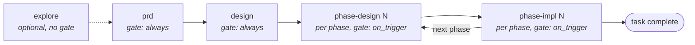

# workflow/LIFECYCLE

How a task moves from idea to committed code, and where a human must decide.

## The phase graph

The canonical graph lives in `.archflow/workflow.yaml` (shipped from `assets/workflow.yaml`, mirrored as a hard-coded constant in `src/contracts/workflow.ts`). It is short and declarative — five phases, four attributes each: the owning skill, dependency edges (`requires`), whether the phase iterates per phase number, and the gate policy.

One nuance the YAML alone doesn't show: `gate: on_trigger` refers only to *adjudication-triggered* gates. The phase skills impose an additional mandatory human gate on top — phase-design always opens an `artifact-approval` gate, and phase-impl always opens a `commit-authorization` gate (`src/local/build-request.ts` picks the kind from the phase). In practice **every phase ends at a human decision.**

The workflow file's bytes are digest-pinned into each task at creation, so changing the graph mid-task is detectable, not silently applied.

## What each stage produces

| Stage | Skill | Artifact | Human approval |
|---|---|---|---|
| explore | `archflow-explore` | `.archflow/context/{architecture,patterns,dependencies}.md` | review + commit confirmation (not a server gate) |
| task creation | any phase skill | `config.yaml` (byte-pinned), `state.json` | — |
| prd | `archflow-prd` | `ask.md` (the user's request, verbatim), `prd.md` | `artifact-approval`, always |
| design | `archflow-design` | `design.md` with a machine-readable `### Phase N:` plan | `artifact-approval`, always |
| phase-design | `archflow-phase-design` | `phases/<n>/design.md` | `artifact-approval` + any triggered gate |
| phase-impl | `archflow-phase-impl` | code, `phases/<n>/verification.txt`, `phases/<n>/impl-notes.md` | `commit-authorization`, **then** a second explicit confirm-to-commit |
| status | `archflow-status` | nothing — read-only | surfaces gates, resolves none |

All task files live under `.archflow/tasks/<task>/`; the shared `.archflow/context/` is the only cross-task material. **Tasks never read each other's files** — this isolation is real and test-enforced.

## The pipeline inside each gated stage

Every gated stage runs the same evidence pipeline to a fixed point:

1. **produce** — write or revise the artifact. Its SHA-256 becomes the *subject digest*.
2. **self_review** — the producing agent reviews its own work against the stage's rubric.
3. **counter_review** — the server dispatches the *opposite model family* (Claude ⇄ Codex) against a sealed envelope plus a read-only repo checkout at a pinned commit. Evidence the producer cannot author.
4. **triage** — the producer must disposition **every** finding from both reviews: accept (forces re-entry into produce) or reject with a written rationale. Findings prefixed `unverifiable-` mean "the reviewer lacked evidence," and are rejected with an `envelope-gap:` rationale, never accepted.
5. **adjudicate** — a third dispatch judges the artifact against the pinned constitution. Failures, uncertainty, drift, or matched review triggers open human gates.

Editing the artifact changes the subject digest, which invalidates all downstream evidence — the pipeline re-runs until everything agrees about the same bytes. Re-entry is bounded (`max_attempts`, default 3); exhaustion opens an `attempts-exhausted` gate rather than looping forever.

## Gates: where humans decide

Nine gate kinds exist (`src/contracts/gates.ts`):

| Gate kind | Opens when |
|---|---|
| `artifact-approval` | a PRD, design, or phase design reaches its fixed point |
| `commit-authorization` | a phase implementation is ready to commit |
| `review-trigger` | a constitution rule's `review_trigger` condition matched |
| `adjudication-failure` | the adjudicator found a rule `fail` or `uncertain` |
| `material-drift` | an approved upstream document drifted materially |
| `attempts-exhausted` | the produce/review loop hit its attempt cap |
| `constitution-edit` | a task branch tried to amend its own governing constitution |
| `restore-collision` | a drift repair would overwrite conflicting bytes |
| `migration-audit` | a legacy import is ready for its guarded resume jump |

Every gate is a durable pair of canonical documents (request + decision record) bound to a gate ID, context digest, subject digest, and the current evidence set. Decisions carry human provenance. Two properties keep them honest:

- **Supersession**: if the subject changes while a gate is open, the gate returns `GATE_SUPERSEDED` and approves nothing — the work re-enters the pipeline and a fresh gate opens.
- **Re-verification**: later code never trusts a recorded approval reference alone; it re-reads and re-validates the underlying documents.

## Hard trust boundaries

These rules recur across every skill and are enforced by the server wherever mechanically possible:

- **Nothing is approved until a human explicitly decides, on the exact bytes.** Silence, elapsed time, agent prose, or a model verdict never supplies approval. Skills re-run `status` after a gate rather than trusting conversation memory.
- **No code before approved phase design.** Durable state must say `phase-impl-<n>`; a design file existing on disk is explicitly insufficient.
- **Committing is a double lock.** An `authorize-commit` gate decision bound to the final diff, *and then* a separate stop where the user sees the exact staged diff and message and explicitly confirms.
- **Waivers are narrow.** A `waiver-requested` decision is not approval; a granted waiver covers one rule version + one subject digest + one task, and evaporates on any change.
- **Fail closed, honestly.** Degraded mode never advances the workflow by itself; `repair-required` states never become progress; "task complete" means the last planned phase is committed — it does not imply QA, staging, or release.

## Where this is heading

The lifecycle above is the current, MCP-backed workflow (it supersedes the legacy skill-only flow described in `docs/archflow-process.md`, kept for history). For auditing which parts of the machinery earn their weight, start with `../COMPLEXITY.md`.
