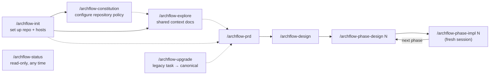

# workflow/SKILLS

**Explored:** 2026-08-16 · **Commit:** `d60da73` · **Covers:** `skills/`, `src/init/`, `src/mcp/handlers/semantic.ts`, `src/state/semantic-*.ts`, `assets/`

The nine skills are the human-facing entry points. They are thin judgment and trust-boundary playbooks: the MCP owns durable state, legal transitions, canonical task resource paths, and immutable review policy. Every workflow runs through the semantic status/apply pair; the one purpose-specific local adapter is the legacy upgrade's preview/stage/adopt, which exists only because the destination task does not exist yet at adoption time. In Codex the same skills are invoked with `$` instead of `/`.

## The set at a glance

## archflow-init

Runs `archflow-local init` from the repo root and translates its report into a short human summary rather than relaying JSON or internal paths. Init scaffolds `.archflow/` (workflow.yaml, constitution, config.yaml, and the nested `.gitignore` whose only rule is `/runtime/`), appends `.archflow/** -text merge=binary` to `.gitattributes` (this is what makes digests stable across platforms), and registers the MCP server with both hosts — a project-scoped `.mcp.json` entry for Claude Code, a fenced managed block in `.codex/config.toml` for Codex. It reports whether the nested ignore file was created or already present and diagnoses that runtime data is ignored and contains no tracked paths; it never edits the root `.gitignore`.

Three things it deliberately never does: overwrite a diverged file (it refuses with `scaffold-diverged`), claim it passed a host's human approval/trust step (Claude approval and Codex repo trust are always the human's), or create task state or commits. **The human's commit of the scaffolded files is the policy approval** — that commit becomes each task's `policy_base_commit`.

## archflow-constitution

Explains and configures the repository-owned policy rules in `.archflow/constitution/`; it adds no CLI or server surface. Each numbered Markdown file is one rule with a stable ID, positive version, active or deprecated status, optional human-gate trigger, optional real enforcement mechanisms, and normative prose. The skill keeps rules focused on durable trust and engineering constraints rather than task requirements, style preferences, or model workarounds.

Rule IDs are append-only. Any content, status, trigger, or enforcement change increments the version; deprecation replaces deletion, and deprecated IDs cannot be reactivated. The skill shows the resulting diff but never commits without separate explicit approval. Policy is best changed on the repository's policy/base branch before affected tasks begin. A task branch may carry a reviewed constitution edit for future tasks, while the active task continues under its immutable pinned constitution.

## archflow-explore

Produces or refreshes the repository's maintained documentation set: caps-named pages in `docs/` (`OVERVIEW.md`, `section/FILE.md`), tracked in git and shared by humans, agent sessions, and reviewers. Heavy reading is delegated to parallel sub-agents — one per page — and each page carries an `Explored / Commit / Covers` stamp, so a later run can diff since the stamped commit and refresh only pages whose covered code changed. The only pre-workflow skill — it touches no MCP tools. Two human confirmations: before overwriting existing pages, and before committing (`Archflow: Explore Codebase Docs`).

## archflow-prd

This document skill runs on `archflow_status` and `archflow_apply`: the skill authors the ask, document, triage, and human decision while the server offers and applies only the current bounded action.

Turns a request into `prd.md` through the full evidence pipeline. Before clarifying conversation, the request is written verbatim to `ask.md`. Each clarification question is appended there verbatim before it is presented, and the user's verbatim answer follows when received, so an interrupted exchange is resumable and ask fidelity is judged against the complete digest-pinned record. Before durable review the producer performs one bounded author checklist, not another generative review loop. The initial counter-review reports only material defects; later rounds verify accepted revision intents first and may raise a new issue only when it carries a material downstream consequence. Ends at a mandatory `artifact-approval` gate where the user sees `ask.md` alongside the PRD, without a backlog of rejected polish; after approval, the skill automatically records the separate hand-off to design and prints both `Claude: /archflow-design <task>` and `Codex: $archflow-design <task>`.

## archflow-design

This document skill uses the semantic pair; document production, triage judgment, and Git remain client-owned.

Reads the approved PRD and writes `design.md`: boundaries, interfaces, risks, verification strategy, and the implementation phase plan. When architecture work reveals that the PRD is inaccurate, the skill updates it too; one compound produce result, review, approval, and milestone commit bind `design.md` with the current `prd.md`. If later work instead shows that the requirements need a fundamentally new pass, an explicit user request can durably reopen the PRD (or this design) through the reopen invocation without discarding the worktree; superseded authority remains archived for audit. The plan is machine-readable by contract — consecutive `### Phase N: Name` headings, or an explicit open-ended marker; anything else fails closed at approval. The server derives `planned_final_phase` from the approved headings — the agent never authors it. The phase ends at one `design-approval` containing the complete document outcome and every constitution finding in plain language. Approval also authorizes the exact recoverable task-local milestone commit; the skill makes it without another prompt, verifies it through status, and then records the hand-off to phase design 1.

## archflow-phase-design

Another document skill on the semantic pair. The exact server-named phase-design successor may recover an interrupted hand-off, but no other invocation receives that offer.

Designs one phase (`phases/<n>/design.md`): goal, files, work chunks, pinned cross-chunk interfaces, and *executable* verification steps. When later planning corrects the architecture or requirements, the phase document and current `design.md` and `prd.md` are one compound produce result; revisions retain all three projections rather than reverting parent authority. Writes no implementation code, and is explicit that "a phase design has no authority merely because its file exists" — only the durable `design-approval` gate confers it. That one gate includes the complete document set, constitution findings, and task-local commit authority. The skill commits the approved milestone without a second prompt, verifies it, and records the hand-off to that phase's implementation.

## archflow-phase-impl

This skill uses the semantic status/apply pair: the client implements, verifies, triages, converses at gates, stages, and commits, while the server offers and applies exactly one bounded action per call and derives every manifest, digest, and evidence fact from a small client-owned declaration.

The only skill that writes production code, and the most heavily gated. Requires the durable position to say `phase-impl-<n>` before touching code. Runs every verification step from the phase design and saves raw output to ignored `.archflow/runtime/tasks/<task>/cache/phases/<n>/verification.txt`. The implementation's `verification_evidence` records its digest and byte count, binding review to the exact transcript even though cleanup removes the raw file after phase advancement. Keeps a tracked structured log in `impl-notes.md` (decisions, deviations, patterns, gotchas, interfaces, evidence). Governing documents remain writable when implementation reveals a false assumption; the server mechanically binds changed plan files as reviewed co-produced outputs and the review envelope pins their bytes outside the task-excluding repository snapshot. If the correction requires a new planning cycle rather than a co-produced adjustment, the user can explicitly reopen the applicable phase design, design, or PRD; the durable planning restart preserves the worktree and archives superseded authority.

Commit authorization is the durable human lock. A `gate-summary` opens the mandatory `commit-authorization` presentation and the user's `authorize-commit` decision returns through the offered action. Fresh status then exposes the exact authorized commit facts with `requires_human_confirmation: true`: the client stages exactly the authorized paths, shows the human the staged diff and exact message, obtains the explicit confirmation, creates the commit itself, and calls read-only `archflow_status` so the server observes proof. Counter-review reads the exact retained post-change repository snapshot; source bodies and generated diffs do not consume the sealed control-envelope cap. A residual `ENVELOPE_OVERFLOW` therefore concerns compact declarations or mandatory pinned evidence and should be diagnosed on that basis—not treated as automatic proof that source files or the approved phase must be split. After a nonfinal implementation hand-off the skill prints the exact successor in both Claude and Codex syntax; after the final phase completes the task, it prints no next command.

After the server observes the commit proof, the successor boundary arrives through the façade. At the planned final phase the implementation invocation owns and applies its `finish-task` offer and reports terminal completion; at a non-final phase fresh status reports the `start-next-skill` successor with no offer to the finishing invocation — the skill prints it and stops, and only the newly invoked phase-design invocation consumes that hand-off offer. A destination skill likewise recovers an interrupted hand-off only by applying the offer returned for its own exact invocation; it cannot bypass an unrelated or earlier phase.

## archflow-status

Strictly read-only, and a pure semantic consumer: it calls `archflow_status` with the task id and no invocation — the generic read that returns the reconciled view with no mutation offer — and never calls `archflow_apply`. It translates the view into a conversational status summary and recommends **exactly one** next action. It refuses to infer progress from filenames, document contents, git history, or conversation — durable state is the only source. For a pending hand-off it renders the exact destination from the server's skill and argument fields in both forms — `Claude: /archflow-*` and `Codex: $archflow-*` — rather than repeating the completed source skill. Terminal completion prints no next command. At an open gate it explains the decision, material evidence, and choices without dumping IDs, hashes, JSON templates, or internal paths, and never resolves the gate itself.

When the server is unavailable, the skill falls back to read-only `archflow-local manual-status --task <task>` and reports the classification with wait guidance. A staged, not-yet-adopted legacy import stays visible through a second trigger: when the semantic read projects no durable task state for a named task — the initialization-ready projection — the skill runs the same helper check before recommending initialization, because the import's ignored runtime stage is not durable task state and only the helper can classify it; an `upgrade-staged` or `upgrade-restart-required` classification replaces the initialization recommendation. It reconstructs nothing while both server and helper are unavailable.

## archflow-upgrade

Adopts an in-flight legacy task into a distinct canonical task. `archflow-local upgrade preview` validates and derives the mapping without writes; an explicitly approved preview may be `stage`d only into ignored runtime storage, and staging never creates the visible destination. Input-free `archflow-local upgrade adopt --task <task>` then runs the initialization transaction locally, authenticating every staged payload and atomically publishing config, state, PRD, overall design, mapped phase designs, and implementation logs — retry-safe, and failing closed on tampered staged bytes. Staging and adoption never require the server.

From there the task is an ordinary semantic workflow: the imported design is submitted unchanged under the archflow-design resume invocation, travels one normal counter-review/triage cycle whose pinned context labels the imported PRD and phase history as migration references, and reaches one `migration-audit` human gate that approves the exact imported bytes, phase plan, and resume point. Acceptance is the import-commit authority: the view returns the one task-local path with server-derived message, target, and baseline, and the client stages exactly that path and creates the commit itself without a second confirmation. Read-only status observes the proof and returns the resume skill — phase implementation for a mapped design without an implementation log, otherwise the next phase design. Old review prose remains historical rather than approval evidence.

## Shared conventions across skills

- **The session is the producer.** The server identifies the producer family from the connected client's initialize handshake and records it as provenance; one offered review action dispatches the configured rubric review (opposite-family by default) and, when active constitution rules exist, the constitution review with it. The pipeline is `produce → counter_review → triage`; constitution gates open after triage. Skills never perform, spawn, or simulate either dispatched review. Same-side author checks or review sub-agents record nothing durable.
- **Status is the driver loop.** Producing skills read `archflow_status` with their resume invocation and apply its one opaque offer with `archflow_apply`; the status skill is the read-only consumer. Every path refreshes status after each bounded action rather than trusting memory.
- **One approval, then the authorized commit or hand-off.** PRD keeps `artifact-approval`; phase implementation's `commit-authorization` is its only durable commit confirmation, with the client-held explicit confirmation guarding the commit itself. Task design and phase design use one combined `design-approval`. Once a commit-bearing gate resolves, the producer performs the already-authorized commit from the returned commit facts: the document skills (and the migration audit) make the task-local milestone commit, and implementation stages the authorized paths, takes the explicit confirmation, and creates the commit itself. Either way the producer re-runs status until the successor is durable, then prints the server-derived successor in both Claude and Codex syntax; terminal completion prints neither.
- **Human gates are conversations, not payloads.** Skills lead with what needs attention, why it matters, and the offered choices with their consequences, then ask one direct question. A `gate-summary` opens the nonblocking presentation and the decision returns through the offered action, which archives it immutably and settles it in a separate substep. Offer and request bindings stay internal unless the user requests diagnostics. The normal server-dispatched review runs automatically before the gate; no optional supplemental review is offered afterward.
- **Human revisions are classified from the actual diff.** Simple wording or formatting changes reuse review evidence for one hop and still require reapproval. Significant changes reset the attempt counter and automatically run a fresh review cycle. Uncertainty is significant, and the human may override either classification.
- **Compose, don't transcribe.** The server composes every durable request from current authority; the caller supplies only judgment — findings, dispositions, rationales, summaries, and decisions — and the opaque offer token binds the rest. Hand-copying digests between commands is impossible by construction now: the client never sees them.
- **stdin vs `--input`:** for the local adapter's payload commands, small generated JSON is piped on stdin; anything carrying authored prose or quotes goes in a file passed with `--input`, because shell quoting silently corrupts prose.
- **Failures exit nonzero.** A command result with `{"ok": false}` also exits 1; the JSON body remains the authority for structured details.
- **Degraded mode fails safe.** If the MCP server is down, skills run read-only `manual-status`, report the position, make no milestone, and wait for the server — there is no offline recording; the server records all progress. If the helper is gone too, stop and reinstall with `./install.sh`.
