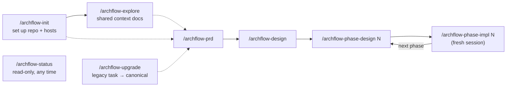

# workflow/SKILLS

**Explored:** 2026-08-10 · **Commit:** `50a218d` · **Covers:** `skills/`, `src/init/`, `assets/`

The eight skills are the human-facing entry points. They are prose playbooks — they enforce nothing themselves; every rule they state is backed (where mechanically possible) by the server. In Codex the same skills are invoked with `$` instead of `/`.

## The set at a glance

## archflow-init

Runs `archflow-local init` from the repo root and relays its report verbatim. Init scaffolds `.archflow/` (workflow.yaml, constitution, config.yaml from templates), appends `.archflow/** -text merge=binary` to `.gitattributes` (this is what makes digests stable across platforms), and registers the MCP server with both hosts — a project-scoped `.mcp.json` entry for Claude Code, a fenced managed block in `.codex/config.toml` for Codex.

Three things it deliberately never does: overwrite a diverged file (it refuses with `scaffold-diverged`), claim it passed a host's human approval/trust step (Claude approval and Codex repo trust are always the human's), or create task state or commits. **The human's commit of the scaffolded files is the policy approval** — that commit becomes each task's `policy_base_commit`.

## archflow-explore

Produces or refreshes the repository's maintained documentation set: caps-named pages in `docs/` (`OVERVIEW.md`, `section/FILE.md`), tracked in git and shared by humans, agent sessions, and reviewers. Heavy reading is delegated to parallel sub-agents — one per page — and each page carries an `Explored / Commit / Covers` stamp, so a later run can diff since the stamped commit and refresh only pages whose covered code changed. The only pre-workflow skill — it touches no MCP tools. Two human confirmations: before overwriting existing pages, and before committing (`Archflow: Explore Codebase Docs`).

## archflow-prd

Turns a request into `prd.md` through the full evidence pipeline. Its distinctive move: **before any clarifying conversation**, the user's request is written verbatim to `ask.md` — the counter-reviewer judges "ask fidelity" against exactly those bytes, so a mistranscribed ask is caught at review rather than shipped. Ends at a mandatory `artifact-approval` gate where the user sees `ask.md` alongside the PRD.

## archflow-design

Reads the approved PRD and writes `design.md`: boundaries, interfaces, risks, verification strategy, and the implementation phase plan. The plan is machine-readable by contract — consecutive `### Phase N: Name` headings, or an explicit open-ended marker; anything else fails closed at approval. The server derives `planned_final_phase` from the approved headings — the agent never authors it. Mandatory `artifact-approval` gate.

## archflow-phase-design

Designs one phase (`phases/<n>/design.md`): goal, files, work chunks, pinned cross-chunk interfaces, and *executable* verification steps. Writes no implementation code, and is explicit that "a phase design has no authority merely because its file exists" — only the durable `artifact-approval` gate confers it.

## archflow-phase-impl

The only skill that writes production code, and the most heavily gated. Requires durable state to say `phase-impl-<n>` before touching code. Runs every verification step from the phase design and saves the raw output to `phases/<n>/verification.txt` — the only verification evidence the counter-reviewer accepts. Keeps a structured log in `impl-notes.md` (decisions, deviations, patterns, gotchas, interfaces, evidence).

Committing is a double lock: first the durable `commit-authorization` gate bound to the final diff, then a separate stop where the agent stages only declared outputs, shows the exact staged diff and message, and waits for explicit confirmation. Generated files must be marked `linguist-generated` so review capacity goes to hand-written change; an `ENVELOPE_OVERFLOW` means the phase is too big and should be split at the design gate, not trimmed to sneak under the cap.

## archflow-status

Strictly read-only. Runs `archflow-local manual-status --task <task>`, reports the mode — `normal` (delegates to task status, one next action), `degraded` (no durable state exists; the one answer is to wait for the server), or `repair-required` (state present but unreadable; a position summary) — and **exactly one** recommended `next_action`. It refuses to infer progress from filenames, document contents, git history, or conversation — durable state is the only source. It surfaces open gates (with ready-to-write decision templates) but never resolves them.

## archflow-upgrade

Migrates a legacy flat-file task into the canonical layout. Governing principle: **stage, never convert.** Legacy files are copied byte-for-byte into a content-addressed import (after a mandatory secret scan), mapped into `draft` seeds (prd, design — inputs for redoing the work) and `historical` material (old phase docs, logs, reviews). The task then re-enters at the PRD and runs the *full* pipeline; a `migration-audit` gate at the approved design authorizes a guarded jump to the derived resume phase. The load-bearing rule: imported prose, history, and prior decisions are **never** approval evidence.

## Shared conventions across skills

- **The session is the producer.** The server identifies the producer family from the connected client's initialize handshake; one `archflow_counter_review` call makes it dispatch the opposite-family rubric review and, when active constitution rules exist (the server decides, never the agent), the constitution review with it. The pipeline is `produce → counter_review → triage`; constitution gates open after triage. Skills never perform, spawn, or simulate either dispatched review — their own self-review sub-agents record nothing durable.
- **Status is the driver loop.** Every skill starts steps from `archflow-local status` and follows the one `next_action` — `--brief` for routine iterations, full status at gates and repairs; after any gate resolves, it re-runs status rather than trusting memory.
- **Compose, don't transcribe.** Requests are built by `archflow-local build-request`, which also stages them on disk; the MCP call passes the four-field `staged.reference` and the server rehydrates the staged request, refusing on any digest mismatch (`request.input` verbatim is the fallback). Intent ids are generated by the composer unless explicitly reused to replay. Hand-copying digests between commands is forbidden.
- **stdin vs `--input`:** small generated JSON is piped on stdin; anything carrying authored prose or quotes goes in a file passed with `--input`, because shell quoting silently corrupts prose.
- **Failures exit nonzero.** A command result with `{"ok": false}` also exits 1; the JSON body remains the authority for structured details.
- **Degraded mode fails safe.** If the MCP server is down, skills run read-only `manual-status`, report the position, make no milestone, and wait for the server — there is no offline recording; the server records all progress. If the helper is gone too, stop and reinstall with `./install.sh`.
