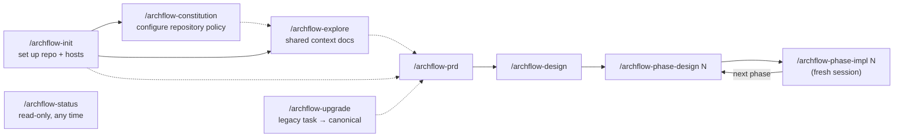

# workflow/SKILLS

**Explored:** 2026-08-31 · **Commit:** `fe0e4ce` · **Covers:** `skills/`, `src/init/`, `src/contracts/config.ts`, `src/contracts/semantic-workflow.ts`, `src/repository/`, `src/mcp/handlers/semantic.ts`, `src/state/semantic-*.ts`, `assets/`

The nine skills are the human-facing entry points. They are thin judgment and trust-boundary playbooks: the MCP owns durable state, legal transitions, canonical task resource paths, and immutable review policy. Every workflow runs through the semantic status/apply pair; the one purpose-specific local adapter is the legacy upgrade's preview/stage/adopt, which exists only because the destination task does not exist yet at adoption time. In Codex the same skills are invoked with `$` instead of `/`.

## The set at a glance

## archflow-init

Runs `archflow-local init` from the repo root and translates its report into a short human summary rather than relaying JSON or internal paths. Init scaffolds `.archflow/` (workflow.yaml, constitution, config.yaml, and the nested `.gitignore` whose only rule is `/runtime/`), appends `.archflow/** -text merge=binary` to `.gitattributes` (this is what makes digests stable across platforms), and registers the MCP server with supported hosts — a project-scoped `.mcp.json` entry for Claude Code, a fenced managed block in `.codex/config.toml` for Codex, and a global server entry in `~/.gemini/config/mcp_config.json` for Antigravity. It reports whether the nested ignore file was created or already present and diagnoses that runtime data is ignored and contains no tracked paths; it never edits the root `.gitignore`.

Three things it deliberately never does: overwrite a diverged file (it refuses with `scaffold-diverged`; the human can opt into replacement with `archflow-local init --force`, which overwrites every diverged scaffold file — including `config.yaml` — with the shipped template and reports them as `overwritten`), claim it passed a host's human approval/trust step (Claude approval and Codex repo trust are always the human's), or create task state or commits. **The human's commit of the scaffolded files is the policy approval** — that commit becomes each task's `policy_base_commit`.

The config template also documents the optional task repository set. `primary` is reserved for the implicit writable repository containing `.archflow/`; secondaries have task-slug names, absolute paths or paths relative to the primary worktree root, and an optional mode that defaults to `context-only`. `writable` lets phase implementation declare repository-source changes there but is not authority on its own. Every writable secondary gets a declaration section, including output-empty scan-only sections; context-only members are never implementation targets. Repository config edits are ordinary informational changes, and all presentations are primary-first then ordinal by secondary name. The task in primary remains the only task-resource and policy source; a secondary `.archflow/` is never read.

## archflow-constitution

Explains and configures the repository-owned policy rules in `.archflow/constitution/`; it adds no CLI or server surface. Each numbered Markdown file is one rule with a stable ID, positive version, active or deprecated status, optional human-gate trigger, optional real enforcement mechanisms, and normative prose. The skill keeps rules focused on durable trust and engineering constraints rather than task requirements, style preferences, or model workarounds.

Rule IDs are append-only. Any content, status, trigger, or enforcement change increments the version; deprecation replaces deletion, and deprecated IDs cannot be reactivated. The skill shows the resulting diff but never commits without separate explicit approval. Policy is best changed on the repository's policy/base branch before affected tasks begin. A task branch may carry a reviewed constitution edit for future tasks, while the active task continues under its immutable pinned constitution.

## archflow-explore

Produces or refreshes the maintained caps-named pages in `docs/`. It delegates substantial independent exploration when useful. Each page carries an `Explored / Commit / Covers` stamp, so later runs refresh only pages whose covered code changed. It uses no MCP workflow tools and asks before overwriting existing pages or committing (`Archflow: Explore Codebase Docs`).

## archflow-prd

This document skill runs on `archflow_status` and `archflow_apply`: the skill authors the ask, document, triage, and human decision while the server offers and applies only the current bounded action.

Turns a request into `prd.md` through the full evidence pipeline. Before clarifying conversation, the request is written verbatim to `ask.md`. Each clarification question is appended there verbatim before it is presented, and the user's verbatim answer follows when received, so an interrupted exchange is resumable and ask fidelity is judged against the complete digest-pinned record. Before durable review the producer performs one bounded author checklist, not another generative review loop. The initial counter-review reports only material defects; later rounds verify accepted revision intents first and may raise a new issue only when it carries a material downstream consequence. A returned `artifact-approval` carries every configured and policy reason over the PRD, plus exact eligible waivers, in one classified presentation; a clean no-wait result instead returns direct successor authority. The skill follows only that returned action and prints the server-derived design hand-off.

Research uses every repository in the returned live list at its resolved location. Workflow documents and policy still come only from server-returned task resources.

## archflow-design

This document skill uses the semantic pair; document production, triage judgment, and Git remain client-owned.

Reads the durably authorized PRD and writes `design.md`: boundaries, interfaces, risks, verification strategy, and the implementation phase plan. When architecture work reveals that the PRD is inaccurate, the skill updates it too; one compound produce result and review bind `design.md` with the current `prd.md`. If later work instead shows that the requirements need a fundamentally new pass, an explicit user request can durably reopen the PRD (or this design) through the reopen invocation without discarding the worktree; superseded authority remains archived for audit.

Codebase exploration and design use every repository returned by status, while task resources remain exclusively server-returned.

For a finite plan, architecture design makes the phase boundaries observable and checks in both directions: adjacent phases that are fragments of one outcome should merge, while a phase containing independently valuable outcomes should split. The default phase is one coherent repository-ready increment with one primary outcome, a valid completion state, stable predecessor inputs, and one understandable verification story. Work chunks are implementation organization, not automatic phase boundaries, and crossing repository layers is fine when the changes serve one outcome. Broad or small retained phases and genuinely open-ended plans state the concrete exception value. This is a judgment framework, not a formula based on file, layer, phase, or token counts.

The plan is machine-readable by contract — consecutive `### Phase N: Name` headings, or an explicit open-ended marker; anything else fails closed. The server derives `planned_final_phase` from those headings. A returned `design-approval` contains the complete document outcome, configured trigger, every policy finding, and exact eligible waivers for one human judgment; otherwise authenticated no-wait authority returns the exact milestone commit directly. Both paths use only server-returned commit facts, perform the same Git checks without a second question, verify proof through status, and record the phase-design hand-off.

## archflow-phase-design

Another document skill on the semantic pair. The exact server-named phase-design successor may recover an interrupted hand-off, but no other invocation receives that offer.

Designs one phase (`phases/<n>/design.md`): goal, files, work chunks, pinned cross-chunk interfaces, and *executable* verification steps. It performs one bounded fit check: does this numbered phase still form the coherent repository-ready increment the parent plan promised, with usable predecessor inputs, a valid completion state, and a single verification story? The check does not split by work chunk, file count, or layer; it corrects only a materially harmful boundary through the existing reviewed parent documents and server authority.

Phase exploration and design span every returned repository at its resolved location, without treating any secondary `.archflow/` content as task input.

When later planning corrects the architecture or requirements, the phase document and current `design.md` and `prd.md` are one compound produce result; revisions retain all three projections rather than reverting parent authority. A changed `design.md` or `prd.md` meets the project's approval rules (the shipped defaults make it a human gate), while a phase design that changes only itself advances on its own; earlier phases' designs are never edited. Writes no implementation code, and is explicit that a phase design has no authority merely because its file exists. Durable authority comes from either a passed returned `design-approval` gate or authenticated rule-based advancement after counter-review. The server returns the exact milestone commit and implementation hand-off for the applicable branch; the skill never synthesizes either.

## archflow-phase-impl

This skill uses the semantic status/apply pair: the client implements, verifies, triages, converses at gates, stages, and commits, while the server offers and applies exactly one bounded action per call and derives every manifest, digest, and evidence fact from a small client-owned declaration.

The only skill that writes production code. It requires durable `phase-impl-<n>` authority, runs the phase design's verification, and saves raw output under ignored runtime. The implementation result binds that transcript by digest and byte count. `impl-notes.md` records decisions, deviations, patterns, gotchas, interfaces, and evidence. If implementation reveals a false plan assumption, changed governing documents become authenticated co-produced outputs; larger corrections use the explicit planning-restart path.

Implementation may explore every returned repository for context. Its result declares outputs for the primary and every writable secondary; context-only members are never implementation targets. The reviewer receives changed members at their authenticated proposed trees. Declared outputs and their current behavior are the review subject. Unchanged files, unchanged writable members, and context-only repositories are evidence only, so phase review cannot fan out into a general code review.

The implementation keeps its own phase design, the task design, and the PRD truthful in the same work result: a changed phase design is reviewed with the code and needs no separate approval; a changed task design or PRD meets the project's approval rules. A failed constitution rule or material drift from the plan returns as a `revise` offer naming what to resolve, not as a human gate, until the attempt budget is spent. After review, the returned action determines the authority path. If `gate-summary` is offered, it opens one `commit-authorization` containing configured matches, policy findings, exact eligible waivers, and exact commit facts; the human decision remains mandatory. A clean authenticated no-wait result may return commit facts directly. In both cases the client verifies baseline and target, stages exactly the returned paths, inspects the staged diff and exact message, creates the commit without another confirmation question, and calls read-only status for proof. Counter-review reads the exact retained post-change repository snapshot; source bodies and generated diffs do not consume the sealed control-envelope cap. A residual `ENVELOPE_OVERFLOW` therefore concerns compact declarations or mandatory pinned evidence and should be diagnosed on that basis—not treated as automatic proof that source files or the approved phase must be split.

After the server observes the commit proof, the successor boundary arrives through the façade. At the planned final phase the implementation invocation owns and applies its `finish-task` offer and reports terminal completion; at a non-final phase fresh status reports the `start-next-skill` successor with no offer to the finishing invocation — the skill prints it and stops, and only the newly invoked phase-design invocation consumes that hand-off offer. A destination skill likewise recovers an interrupted hand-off only by applying the offer returned for its own exact invocation; it cannot bypass an unrelated or earlier phase.

## archflow-status

Strictly read-only, and a pure semantic consumer: it calls `archflow_status` with the task id and no invocation — the generic read that returns the reconciled view with no mutation offer — and never calls `archflow_apply`. It translates the view into a conversational status summary and recommends **exactly one** next action. It refuses to infer progress from filenames, document contents, git history, or conversation — durable state is the only source. For a pending hand-off it renders the exact destination from the server's skill and argument fields in both forms — `Claude: /archflow-*` and `Codex: $archflow-*` — rather than repeating the completed source skill. Terminal completion prints no next command. At an open gate it explains the decision, material evidence, and choices without dumping IDs, hashes, JSON templates, or internal paths, and never resolves the gate itself.

Status renders the returned repository list with name, resolved location, mode, current commit, and any exact current-position `last_reviewed_commit` in deterministic primary-first then ordinal-secondary order. Every review-backed human presentation lists those authenticated reviewed commits and flags a moved current HEAD without changing authority or blocking behavior. Baseline adoption has no review binding and shows no repository-review claim.

When the server is unavailable, the skill falls back to read-only `archflow-local manual-status --task <task>` and reports the classification with wait guidance. A staged, not-yet-adopted legacy import stays visible through a second trigger: when the semantic read projects no durable task state for a named task — the initialization-ready projection — the skill runs the same helper check before recommending initialization, because the import's ignored runtime stage is not durable task state and only the helper can classify it; an `upgrade-staged` or `upgrade-restart-required` classification replaces the initialization recommendation. It reconstructs nothing while both server and helper are unavailable.

## archflow-upgrade

Adopts an in-flight legacy task into a distinct canonical task. `archflow-local upgrade preview` validates and derives the mapping without writes; an explicitly approved preview may be `stage`d only into ignored runtime storage, and staging never creates the visible destination. Input-free `archflow-local upgrade adopt --task <task>` then runs the initialization transaction locally, authenticating every staged payload and atomically publishing config, state, PRD, overall design, mapped phase designs, and implementation logs — retry-safe, and failing closed on tampered staged bytes. Staging and adoption never require the server.

From there the task is an ordinary semantic workflow: the imported design is submitted unchanged under the archflow-design resume invocation, travels one normal counter-review/triage cycle whose pinned context labels the imported PRD and phase history as migration references, and reaches one `migration-audit` human gate that approves the exact imported bytes, phase plan, and resume point. Acceptance is the import-commit authority: the view returns the one task-local path with server-derived message, target, and baseline, and the client stages exactly that path and creates the commit itself without a second confirmation. Read-only status observes the proof and returns the resume skill — phase implementation for a mapped design without an implementation log, otherwise the next phase design. Old review prose remains historical rather than approval evidence.

## Shared conventions across skills

- **The session is the producer.** The server records the connected client as provenance and dispatches the configured rubric review plus any constitution review. The pipeline is `produce → counter_review → triage`. Skills perform one bounded author check; they do not spawn or simulate independent reviews.
- **Status is the driver loop.** Producing skills read `archflow_status` with their resume invocation and apply its one opaque offer with `archflow_apply`; the status skill is the read-only consumer. Every path refreshes status after each bounded action rather than trusting memory.
- **Repository context is server-returned.** Producing skills use every returned repository for context but only returned task resources for workflow documents. Reviewers receive named read-only snapshots of the configured set. Implementation review is bounded to declared outputs and current behavior; unchanged snapshot content is supporting evidence. Review coverage does not authorize secondary outputs or commits.
- **Invocation routing is constructed once.** Each producer accepts trailing `--counter-reviewer model:effort[@provider]` and `--adjudicator model:effort[@provider]`; phase design and phase implementation also accept `--test-reviewer model:effort[@provider]`, and phase design also accepts `--effort-reviewer model:effort[@provider]`. Roles are independently optional. The skill normalizes supplied roles once under `invocation.review_routes` and repeats the complete invocation through status, apply, retries, reopen/resume, significant revisions, and final observation. Changing it between status and apply makes the input stale. Omitted roles use live phase/base config.
- **Reviewer substitution is explicit and request-scoped.** A selected route failure appears as a safe exact-current `dispatch_failure` while the same review attempt remains pending. The skill explains the failed role and route source, never silently retries or falls back, and offers repair with an identical invocation or a human-selected one-dispatch substitute and reason. The server validates that `route_override` like any route, gives it precedence for that dispatch only, and records its reason and displaced normal selection without editing the invocation or config. Invocation-declared routing is normal run input, never described as human- or controller-authenticated; the override is the separate reason-bearing human substitution path.
- **Returned authority, then the exact commit or hand-off.** A configured trigger, policy obligation, or both opens one `artifact-approval`, `design-approval`, or `commit-authorization` for the exact reviewed subject; every returned gate requires explicit human judgment and presents its authenticated classified reasons. An eligible no-wait settlement can instead yield direct milestone, commit, or successor facts after the same mandatory review only when no matching human approval exists. Clients never invent either branch, and execute every returned commit directly after the existing Git checks. Migration audit and every distinct safety or recovery presentation remain unconditional human boundaries.
- **Human gates are conversations, not payloads.** Skills lead with what needs attention, why it matters, and the offered choices with their consequences, then ask one direct question. They also say how strong the review evidence is from the view's `review_strength` — every contributing reviewer and focus, which model reviewed at what effort, whether it shares the producer's family, and what each round raised — and give a same-family reviewer, a low effort, or a pass from a remediation round the prominence of an exception. A `gate-summary` opens the nonblocking presentation and the decision returns through the offered action, which archives it immutably and settles it in a separate substep. Offer and request bindings stay internal unless the user requests diagnostics. The normal server-dispatched review runs automatically before the gate; no optional supplemental review is offered afterward.
- **Human revisions are classified from the actual diff.** Simple wording or formatting changes reuse review evidence for one hop and still require reapproval. Significant changes reset the attempt counter and automatically run a fresh review cycle. Uncertainty is significant, and the human may override either classification.
- **Compose, don't transcribe.** The server composes every durable request from current authority; the caller supplies only judgment — findings, dispositions, rationales, summaries, and decisions — and the opaque offer token binds the rest. Hand-copying digests between commands is impossible by construction now: the client never sees them.
- **stdin vs `--input`:** for the local adapter's payload commands, small generated JSON is piped on stdin; anything carrying authored prose or quotes goes in a file passed with `--input`, because shell quoting silently corrupts prose.
- **Explicit commit authority re-anchoring:** When Git branches merge, rebases occur, or commit baselines diverge from older settlements, `echo '{"target_commit":"HEAD","reason":"<reason>"}' | archflow-local set-commit-authority --task <task>` explicitly updates the task's milestone baseline and target head (and optionally `policy_base_commit` and constitution digest when `"scope": ["policy"]` is passed) without corrupting completed receipts or bypassing verification.
- **Failures exit nonzero.** A command result with `{"ok": false}` also exits 1; the JSON body remains the authority for structured details.
- **Degraded mode fails safe.** If the MCP server is down, skills run read-only `manual-status`, report the position, make no milestone, and wait for the server — there is no offline recording; the server records all progress. If the helper is gone too, stop and reinstall with `./install.sh`.
- **Phase designs name implementation components.** `archflow-phase-design` writes exactly one `archflow-components-v1` fence whose stable components state scope, mechanism, repository-qualified paths, and a verification boundary. Components are units of implementation judgment, not work chunks, files, types, or layers. The server validates this index and the repository hazard registry before its required effort child runs.
- **Effort routing is configurable.** `effort-reviewer` uses the configured route (`gpt-5.6-luna`/`xhigh` by default), can be declared on phase-design invocation under `invocation.review_routes`, and accepts a human-selected, reason-bearing substitute for one dispatch on failure. Phase design, phase implementation entry, and generic status render only the returned semantic recommendation, make substituted provenance conspicuous, and preserve the exact next action. They report reviewer provenance, recommended implementation profile, and the explicitly unrecorded actual producer route as three separate facts; model selection remains outside ArchFlow.
