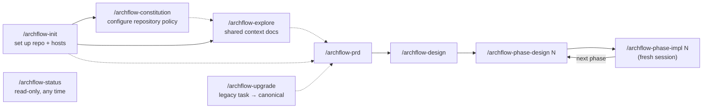

# workflow/SKILLS

**Explored:** 2026-08-13 · **Commit:** `247df34` · **Covers:** `skills/`, `src/init/`, `assets/`

The nine skills are the human-facing entry points. They are thin judgment and trust-boundary playbooks: the CLI/MCP owns durable state, legal transitions, canonical task resource paths, and immutable review policy. Full status returns those resources and policy so a skill does not need to know how to traverse `.archflow/` or carry rubric JSON. In Codex the same skills are invoked with `$` instead of `/`.

## The set at a glance

## archflow-init

Runs `archflow-local init` from the repo root and translates its report into a short human summary rather than relaying JSON or internal paths. Init scaffolds `.archflow/` (workflow.yaml, constitution, config.yaml, and the nested `.gitignore` whose only rule is `/runtime/`), appends `.archflow/** -text merge=binary` to `.gitattributes` (this is what makes digests stable across platforms), and registers the MCP server with both hosts — a project-scoped `.mcp.json` entry for Claude Code, a fenced managed block in `.codex/config.toml` for Codex. It reports whether the nested ignore file was created or already present and diagnoses that runtime data is ignored and contains no tracked paths; it never edits the root `.gitignore`.

Three things it deliberately never does: overwrite a diverged file (it refuses with `scaffold-diverged`), claim it passed a host's human approval/trust step (Claude approval and Codex repo trust are always the human's), or create task state or commits. **The human's commit of the scaffolded files is the policy approval** — that commit becomes each task's `policy_base_commit`.

## archflow-constitution

Explains and configures the repository-owned policy rules in `.archflow/constitution/`; it adds no CLI or server surface. Each numbered Markdown file is one rule with a stable ID, positive version, active or deprecated status, optional human-gate trigger, optional real enforcement mechanisms, and normative prose. The skill keeps rules focused on durable trust and engineering constraints rather than task requirements, style preferences, or model workarounds.

Rule IDs are append-only. Any content, status, trigger, or enforcement change increments the version; deprecation replaces deletion, and deprecated IDs cannot be reactivated. The skill shows the resulting diff but never commits without separate explicit approval. Policy is best changed on the repository's policy/base branch before affected tasks begin. A task branch may carry a reviewed constitution edit for future tasks, while the active task continues under its immutable pinned constitution.

## archflow-explore

Produces or refreshes the repository's maintained documentation set: caps-named pages in `docs/` (`OVERVIEW.md`, `section/FILE.md`), tracked in git and shared by humans, agent sessions, and reviewers. Heavy reading is delegated to parallel sub-agents — one per page — and each page carries an `Explored / Commit / Covers` stamp, so a later run can diff since the stamped commit and refresh only pages whose covered code changed. The only pre-workflow skill — it touches no MCP tools. Two human confirmations: before overwriting existing pages, and before committing (`Archflow: Explore Codebase Docs`).

## archflow-prd

Turns a request into `prd.md` through the full evidence pipeline. Before clarifying conversation, the request is written verbatim to `ask.md`. Each clarification question is appended there verbatim before it is presented, and the user's verbatim answer follows when received, so an interrupted exchange is resumable and ask fidelity is judged against the complete digest-pinned record. Before durable review the producer performs one bounded author checklist, not another generative review loop. The initial counter-review reports only material defects; later rounds verify accepted revision intents first and may raise a new issue only when it carries a material downstream consequence. Ends at a mandatory `artifact-approval` gate where the user sees `ask.md` alongside the PRD, without a backlog of rejected polish; after approval, the skill automatically records the separate hand-off to design and prints both `Claude: /archflow-design <task>` and `Codex: $archflow-design <task>`.

## archflow-design

Reads the approved PRD and writes `design.md`: boundaries, interfaces, risks, verification strategy, and the implementation phase plan. The plan is machine-readable by contract — consecutive `### Phase N: Name` headings, or an explicit open-ended marker; anything else fails closed at approval. The server derives `planned_final_phase` from the approved headings — the agent never authors it. The phase ends at one `design-approval` containing the document outcome and every constitution finding in plain language. Approval also authorizes the exact recoverable task-local milestone commit; the skill makes it without another prompt, verifies it through status, and then records the hand-off to phase design 1.

## archflow-phase-design

Designs one phase (`phases/<n>/design.md`): goal, files, work chunks, pinned cross-chunk interfaces, and *executable* verification steps. Writes no implementation code, and is explicit that "a phase design has no authority merely because its file exists" — only the durable `design-approval` gate confers it. That one gate includes constitution findings and task-local commit authority. The skill commits the approved milestone without a second prompt, verifies it, and records the hand-off to that phase's implementation.

## archflow-phase-impl

The only skill that writes production code, and the most heavily gated. Requires durable state to say `phase-impl-<n>` before touching code. Runs every verification step from the phase design and saves raw output to ignored `.archflow/runtime/tasks/<task>/cache/phases/<n>/verification.txt`. The required implementation-output `verification_evidence` records its digest and byte count, binding review to the exact transcript even though cleanup removes the raw file after phase advancement. Keeps a tracked structured log in `impl-notes.md` (decisions, deviations, patterns, gotchas, interfaces, evidence).

Committing is a double lock: first the durable `commit-authorization` gate bound to the final diff, then a separate stop where the agent stages only declared outputs, shows the exact staged diff and message, and waits for explicit confirmation. Generated files must be marked `linguist-generated` so review capacity goes to hand-written change; an `ENVELOPE_OVERFLOW` means the phase is too big and should be split at the design gate, not trimmed to sneak under the cap. After a nonfinal implementation hand-off the skill prints the exact successor in both Claude and Codex syntax; after the final phase completes the task, it prints no next command.

After Git proves the authorized outputs were committed, the skill records the separate automatic hand-off to the next phase design or terminal task completion. Every producer uses the shared judgment-free `{"kind":"advance"}` composer request and verifies fresh status before returning. A destination skill can recover an interrupted hand-off only when status names that exact target phase and exact invocation arguments; it cannot bypass an unrelated or earlier phase.

## archflow-status

Strictly read-only. Runs `archflow-local manual-status --task <task>`, translates the mode into a conversational status summary, and recommends **exactly one** next action. It refuses to infer progress from filenames, document contents, git history, or conversation — durable state is the only source. For a pending hand-off it renders the exact destination from the server's skill and argument fields in both forms — `Claude: /archflow-*` and `Codex: $archflow-*` — rather than repeating the completed source skill. Terminal completion prints no next command. At an open gate it explains the decision, material evidence, and choices without dumping IDs, hashes, JSON templates, or internal paths, and never resolves the gate itself.

## archflow-upgrade

Migrates a legacy flat-file task into the canonical layout. Governing principle: **stage, never convert.** Legacy files are copied byte-for-byte into ignored `.archflow/runtime/tasks/<task>/cache/imports/` staging (after a mandatory secret scan), mapped into `draft` seeds (prd, design — inputs for redoing the work) and `historical` material (old phase docs, logs, reviews). The task then re-enters at the PRD and runs the *full* pipeline; a `migration-audit` gate at the approved design authorizes a guarded jump to the derived resume phase. The load-bearing rule: imported prose, history, and prior decisions are **never** approval evidence.

## Shared conventions across skills

- **The session is the producer.** The server identifies the producer family from the connected client's initialize handshake; one `archflow_counter_review` call dispatches the opposite-family rubric review and, when active constitution rules exist, the constitution review with it. The pipeline is `produce → counter_review → triage`; constitution gates open after triage. Skills never perform, spawn, or simulate either dispatched review. Same-side author checks or review sub-agents record nothing durable.
- **Status is the driver loop.** Every skill starts steps from `archflow-local status` and follows the one `next_action` — `--brief` for routine iterations, full status at gates and repairs; after any gate resolves, it re-runs status rather than trusting memory.
- **One design approval, automatic milestone commit, then hand-off.** PRD keeps `artifact-approval`; phase implementation keeps its commit gate and confirmation. Task design and phase design use one combined `design-approval`. Once it resolves, the active producer performs the already-authorized task-local commit, composes `{"kind":"advance"}`, calls `archflow_state`, and re-runs status until the successor is durable. Every nonterminal producer then prints the server-derived successor in both Claude and Codex syntax; terminal completion prints neither.
- **Human gates are conversations, not payloads.** Skills lead with what needs attention, why it matters, and the choices with their consequences. Machine bindings stay internal unless the user requests diagnostics. The normal opposite-client review runs automatically before the gate; no optional supplemental review is offered afterward.
- **Human revisions are classified from the actual diff.** Simple wording or formatting changes reuse review evidence for one hop and still require reapproval. Significant changes reset the attempt counter and automatically run a fresh review cycle. Uncertainty is significant, and the human may override either classification.
- **Compose, don't transcribe.** Requests are built by `archflow-local build-request`, which also stages them on disk; the MCP call passes the four-field `staged.reference` and the server rehydrates the staged request, refusing on any digest mismatch (`request.input` verbatim is the fallback). Intent ids are generated by the composer unless explicitly reused to replay. Hand-copying digests between commands is forbidden.
- **stdin vs `--input`:** small generated JSON is piped on stdin; anything carrying authored prose or quotes goes in a file passed with `--input`, because shell quoting silently corrupts prose.
- **Failures exit nonzero.** A command result with `{"ok": false}` also exits 1; the JSON body remains the authority for structured details.
- **Degraded mode fails safe.** If the MCP server is down, skills run read-only `manual-status`, report the position, make no milestone, and wait for the server — there is no offline recording; the server records all progress. If the helper is gone too, stop and reinstall with `./install.sh`.
